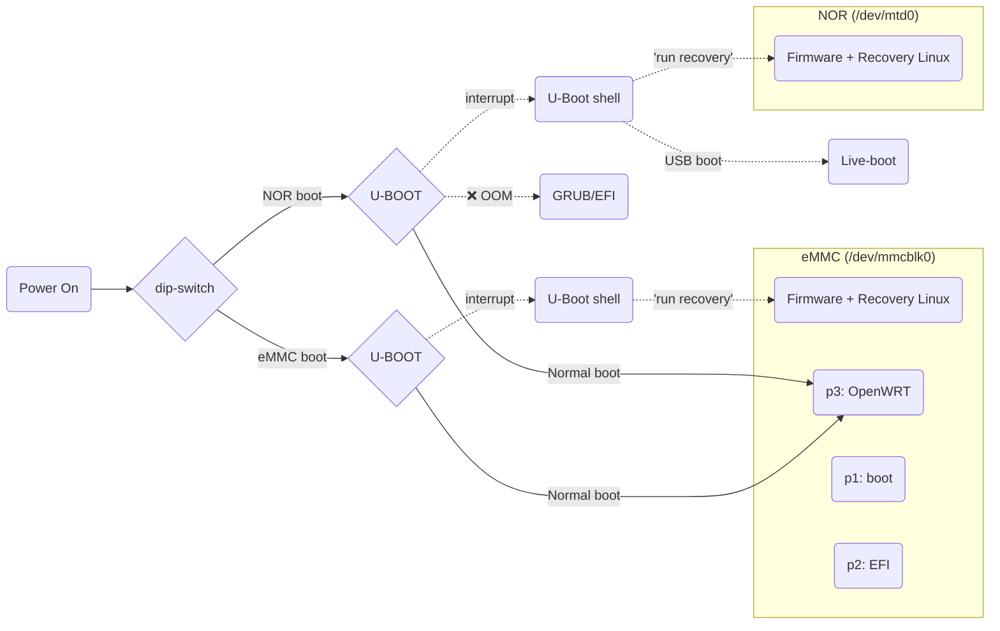
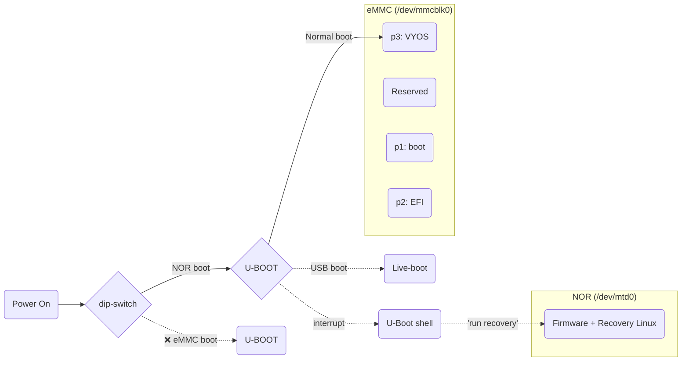
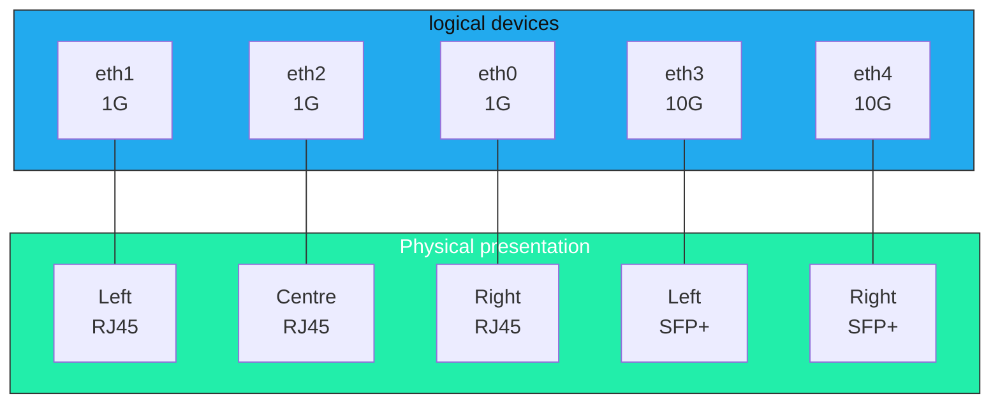
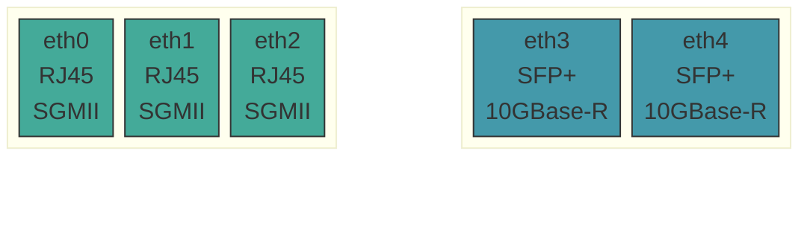

# Hardware Overview: Mono Gateway Development Kit

The primary source of truth for the physical hardware is the [Mono development kit hardware description](https://docs.mono.si/gateway-development-kit/hardware-description). This documentation builds on this foundation, and addresses the quirks.

## Specification

|                                |                                                                                                                                                       |
| ------------------------------ | ----------------------------------------------------------------------------------------------------------------------------------------------------- |
| **CPU**                        | NXP QorIQ LS1046A SoC: 4x Cortex-A72 @1.6 GHz                                                                                                         |
| **RAM**                        | 8 GB ECC DDR4 @2100 MT/s                                                                                                                              |
| **Networking**                 | 2x SFP+ 10 Gbps (10GBASE-R)   3x RJ45 1 Gbps (1000BASE-T)                                                                                          |
| **Wifi**                       | 1x M.2 Key-E for Wifi6 2x2 MU-MIMO   1x M.2 Key-E for tri-radio (Wifi5, Bluetooth, Thread)                                                         |
| **Storage**                    | User selectable boot source via PCB dip-switch: 64 MB NOR flash for Bootloader 32 GB eMMC for Operating System                                  |
| **Firmware**                   | NOR + eMMC (user-updatable) firmware targets available                                                                                                |
| **Boot loader**                | U-Boot 2025.04 via `booti`                                                                                                                            |
| **External I/O**               | 1x USB-C 3.1 5 Gbps port, Max 5V 3A 1x USB-C UART (serial) Console, 115200 baud (`ttyS0`)                                                          |
| **Internal I/O**               | 1x 4-pin 5V PWM CPU fan 1x 4-pin 5V header (unused) 1x Programmable RGBW LED status LED 1x JTAG programmer connector 100+ PCB test points |
| **Power supply (external)** | 1x USB-C PD 3.0: 20V 2A (40W), or 15V 3A (45W)                                                                                                        |
> **Note:** As a development kit, additional features are included to enable: 
> OS installation, device recovery, firmware updates, and HW debugging of both the SoC and PCB

The Mono Gateway Development Kit is an extremely versatile device, and its design enables user-recovery in an abnormally wide range of scenarios. Even if rendered 'bricked' and unbootable, the device may be recovered via a (separate) JTAG hardware debugger probe.

---
## Boot chain

In order to use this device effectively, some foundational knowledge of how it operates is required, starting with how it effects the initial boot process. 

There is no fixed 'BIOS' as you might find on an x86 computer, as this is an embedded device. The user can however control: the boot source (via a physical dip-switch on the PCB), and after initialisation of the hardware via the U-Boot bootloader, what boots next in the chain.

>**Note:** Use **NOR** as your default boot device, **except when updating the NOR [FIRMWARE.md](FIRMWARE.md)**. This ensures that after installing an OS to the eMMC, your device remains bootable.

### Boot chain: As shipped + OpenWRT + Opnsense

Initially, either the 64 MB NOR flash or the 32 GB eMMC can be used as the primary boot device, as shown below. Each storage device has a separate 'Recovery Linux' and firmware partition in the first 32MB which is used for firmware upgrades, and device recovery. For updating firmware, see [FIRMWARE.md](FIRMWARE.md).

**The active boot device is controlled via a physical dip-switch on the main PCB.** This defines which storage device used to load U-boot. 

>**Note:** The EFI/GRUB path is permanently broken: DPAA1 reserved-memory nodes in the device tree cause GRUB to OOM during `bootefi`. Nobody plans to fix it. `booti` works, costs nothing, and skips GRUB entirely. Sometimes the universe does you a favour. 

### Boot chain: for VyOS

After installing Vyos there are three notable changes to the boot chain. 
1. Booting from eMMC will fail. You must boot from **NOR**. This is now also the only route to access 'Recovery linux', if it is required.
2. If a VyOS USB is inserted, it boot from it (live mode) before VyOS Installed on eMMC
3. Reading from `/boot/vyos.env` from eMMC p3 → defines the VyOS named image that is booted

>**Note:** If installing VyOS onto the eMMC per [INSTALL.md](INSTALL.md) you will (currently) lose the ability to directly boot from eMMC. This is a known [Issue#24](https://github.com/mihakralj/vyos-ls1046a-build/issues/24) for which a fix is known, but not yet deployed. This can be remedied via re-imaging the eMMC, see [FIRMWARE.md](FIRMWARE.md).

### Known Boot Messages (Ignore These)

The boot log contains some alarming lines. All of them are fine.

| Message                             | Why It's Fine                                                                       |
| ----------------------------------- | ----------------------------------------------------------------------------------- |
| `smp_processor_id() in preemptible` | Cosmetic: PREEMPT_DYNAMIC on Cortex-A72. Suppressed in current builds.              |
| `could not generate DUID`           | No persistent machine-id on live boot. Resolves after `install image`.              |
| `PCIe: no link` / `disabled`        | No PCIe devices on this board. The bus exists. The devices do not.                  |
| `WARNING failed to get smmu node`   | No SMMU/IOMMU nodes in DTB. Harmless.                                               |
| `binfmt_misc.mount` FAILED          | Expected on ARM64 target hardware. No binfmt emulation needed.                      |
| kexec double-boot (USB live only)   | Normal VyOS live-boot behavior. Installed eMMC systems boot once, straight through. |

For the curious, a full annotated boot sequence can be walked-through in [plans/BOOT-PROCESS.md](plans/BOOT-PROCESS.md).

---
## Port Layout

The port layout on the Mono Gateway can be very confusing due to a hardware quirk. The initial (as shipped) firmware applied a cosmetic fix for this, but subsequent firmware releases since (2026-03-28) revert this for consistency.

**Root cause** - hardware network devices are enumerated out of step with their physical presentation. This happens because a hardware quirk

### As enumerated - 1,2,0,3,4 ([Mono firmware 2026-03-28 onwards](https://github.com/we-are-mono/meta-mono/blob/master/CHANGELOG.md#2026-03-28--remove-fman-ethernet-alias-ordering-patch-and-dt-aliases))

As of firmware 2026-03-29+, the FMan MAC probe order matches physical port positions natively. No udev rename rule needed. Interface names map left-to-right as shown. On older firmware, eth0 was the rightmost port, which made staring at the front panel a Sudoku problem.

