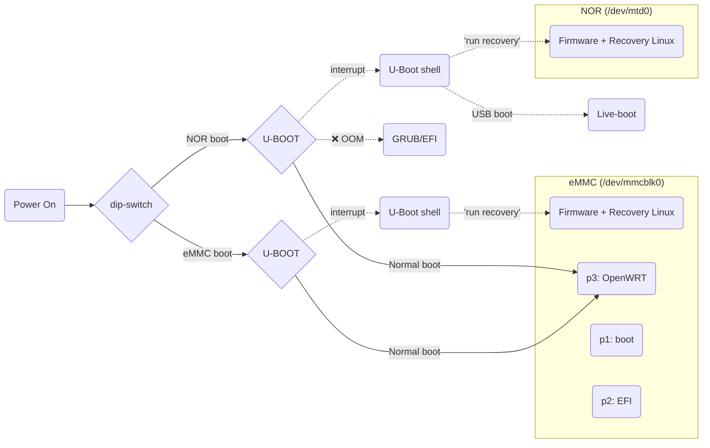
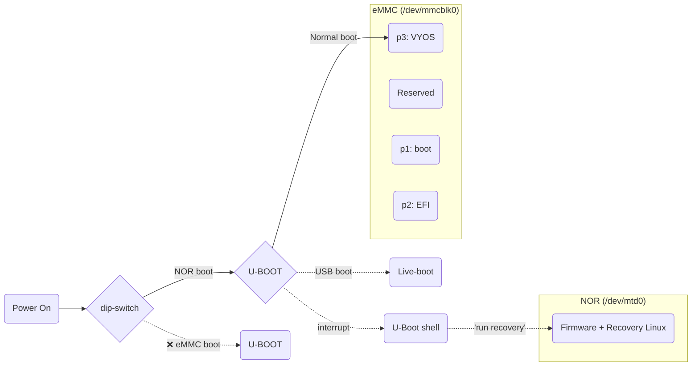
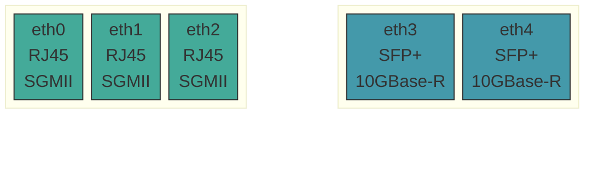
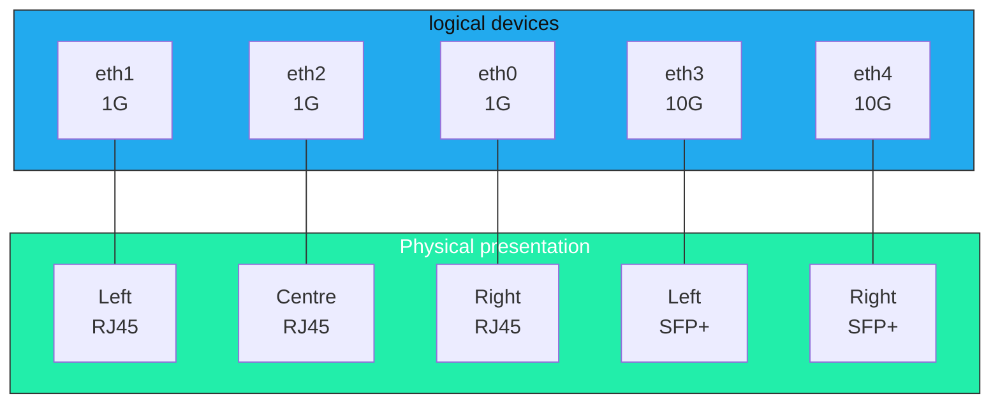

# Hardware Overview: Mono Gateway Development Kit

The primary source of truth for the physical hardware is the [Mono development kit - hardware description](https://docs.mono.si/gateway-development-kit/hardware-description). This documentation builds on this foundation, and addresses the quirks.

# 1. Specification

|                                |                                                                                                                                                                                                                                               |
| ------------------------------ | --------------------------------------------------------------------------------------------------------------------------------------------------------------------------------------------------------------------------------------------- |
| **CPU**                        | NXP QorIQ LS1046A SoC: 4x Cortex-A72 @1.6 GHz                                                                                                                                                                                                 |
| **RAM**                        | 8 GB ECC DDR4 @2100 MT/s                                                                                                                                                                                                                      |
| **Networking**                 | 2x SFP+ 10 Gbps (10GBASE-R)   3x RJ45 1 Gbps (1000BASE-T)                                                                                                                                                                                  |
| **M.2 expansion\***            | 1x M.2_1 Key-E (Left) 'Smart home' — interfaces: SDIO, UART, SPI, I2C — Usage: low-bandwidth tri-radio cards (Wifi5, Bluetooth, Thread) 1x M.2_2 Key-E (Right) 'Wireless' — interfaces: UART, PCIe 3.0 x1 — Usage: Wifi6 2x2 MU-MIMO cards |
| **Storage**                    | *User selectable boot source via PCB dip-switch:* 1x 64 MB NOR flash for Bootloader 1x 32 GB eMMC for Operating System                                                                                                                  |
| **Firmware**                   | NOR + eMMC (user-updatable) firmware targets available                                                                                                                                                                                        |
| **Boot loader**                | U-Boot 2025.04 via `booti`                                                                                                                                                                                                                    |
| **External I/O**               | 1x USB-C 3.1 5 Gbps port, Max 5V 3A 1x USB-C UART (serial) Console, 115200 baud (`ttyS0`)                                                                                                                                                  |
| **Internal I/O**               | 1x 4-pin 5V PWM CPU fan 1x 4-pin 5V header (unused) 1x Programmable RGBW LED status LED 1x JTAG programmer connector 100+ PCB test points                                                                                         |
| **Power supply (external)** | 1x USB-C PD 3.0: 20V 2A (40W), or 15V 3A (45W)                                                                                                                                                                                                |
> **NOTE:** As a development kit, additional features are included to enable: 
> OS installation, device recovery, firmware updates, and HW debugging of both the SoC and PCB

>**\*WARNING:** The two m.2 E-key slots have different presented interfaces and pinouts. Compatibility with user-supplied m.2 E-key hardware is not guaranteed, and incorrect use may result in hardware damage. Check the datasheet for your intended m.2 E-key device for interface requirements and pin-compatibility. For a list of the tested m.2 devices, and full socket pin-assignments see - [Mono hardware description](https://docs.mono.si/gateway-development-kit/hardware-description#supported-cards)

The Mono Gateway Development Kit is an extremely versatile device, and its design enables user-recovery in an abnormally wide range of scenarios. Even if rendered *'bricked'* and unbootable, the device still may be recovered via a (separate) JTAG hardware debugger probe ([e.g. TC2050](https://www.tag-connect.com/product/tc2050-idc-050-all)).

---
# 2. Boot chain

In order to use this device effectively, some foundational knowledge of how it operates is required, starting with how it effects the initial boot process. 

There is no fixed 'BIOS' ROM as you might find on an x86 computer, as this is an embedded device. The user can however control the boot source (via a physical dip-switch on the PCB), and after initialisation of the hardware via the U-Boot bootloader, what boots next in the chain.

>**NOTE:** Use **NOR** as your default boot device, **except when updating the NOR [FIRMWARE.md](FIRMWARE.md)**. This ensures that after installing an OS to the eMMC, your device remains bootable.

## 2.1 Boot chain: As shipped + OpenWRT + Opnsense

Initially, either the 64 MB NOR flash, OR the 32 GB eMMC can be used as the primary boot device, as shown below. This works because each storage device has a it's own separate copy of U-Boot, and a small 'Recovery Linux' environment in an initial firmware partition located in the first 32MB of each device. The primary use of the 'Recovery Linux' environment is to perform firmware upgrades, and to device recovery. [FIRMWARE.md](FIRMWARE.md) provides a brief 'how-to' guide for updating the device firmware, and provides critical warnings for avoid common issues.

**The *active* boot device is controlled via a physical dip-switch on the main PCB.** This defines which storage device is used to load U-boot when the system is powered. 

>**NOTE** The EFI/GRUB path is permanently broken. DPAA1 (see: [HW-OFFLOADING.md](HW-OFFLOADING.md)) reserved-memory nodes in the device tree cause GRUB to OOM during `bootefi`. Nobody plans to fix it. `booti` works, costs nothing, and skips GRUB entirely. Sometimes the universe does you a favour. 

## 2.2 Boot chain: for VyOS

After installing Vyos there are three notable changes to the boot chain, at present:
1. Booting from eMMC will fail. You must boot from **NOR**. NOR is now also the only route to access 'Recovery linux', if it is required.
2. If a VyOS USB is inserted, U-boot will boot from USB (live mode) before attempting to boot VyOS images installed on eMMC
3. Reading from `/boot/vyos.env` from eMMC p3 (`mmc 0:3`) → defines which named VyOS image is then booted.

>**NOTE:** If installing VyOS onto the eMMC per [INSTALL.md](INSTALL.md) you will (currently) lose the ability to directly boot from eMMC. This is a known [issue#24](https://github.com/mihakralj/vyos-ls1046a-build/issues/24) for which a fix is known, but not yet deployed. This can be remedied via re-imaging the eMMC firmware located in the first 32 MB 'reserved' partition on the eMMC. To do so manually, see [FIRMWARE.md](FIRMWARE.md).

## 2.2.1 Diving deeper

For the curious, a full annotated boot sequence from earlier development can be walked-through in [plans/BOOT-PROCESS.md](plans/BOOT-PROCESS.md). This notes a number of boot log messages that have since been investigated, and are now suppressed in subsequent releases. These relate to typical x86 capabilities that simply are not present on this aarch64 HW, e.g. IOMMU nodes.

---
# 3. Network Port Layout

The port layout on the Mono Gateway can be very confusing due to a hardware quirk that breaks the expected mapping between physical ports, and their logical named order. 

The initial (as shipped) Mono Gateway Development Kit firmware applies a cosmetic fix for this (using a `udev` rule at boot-time), but all subsequent firmware releases (2026-03-28+) revert this for consistency between installed recovery Linux environments and the main (eMMC installed) OS, e.g. VyOS.

**Root cause** - The hardware network devices are enumerated out of step with their physical presentation, as 1,2,0,3,4, whereas one might more routinely expect 0,1,2,3,4. This is an entirely cosmetic issue, but it remains a source of persistent confusion amongst new users, on the initial stock firmware.

## 3.1 Cosmetic interface naming - (As shipped, with correction applied)

Whilst readable, the correction will break for any subsequently loaded OS (VyOS, OPNsense, etc) unless they too manually apply further corrective remapping. It also breaks the expected logical sequencing of the physical MAC address assigned to the interfaces, which remain out-of-order.

### 3.1.1 Reversion

Maintaining a manual patch all OS maintainers must apply manually was not seen as a consistent or supportable approach, and following a discord straw-poll, Mono elected to revert the cosmetic fix from [Mono firmware 2026-03-28](https://github.com/we-are-mono/meta-mono/blob/master/CHANGELOG.md#2026-03-28--remove-fman-ethernet-alias-ordering-patch-and-dt-aliases) onwards. This provide a more consistent and supportable experience and reverts the (at-boot) port mapping to that shown in §3.2 below.

> **NOTE:** All units, as shipped, have the cosmetic correction applied, and the interface order within the firmware 'Recovery Linux' environment reflects this correction. This may see the same interface assigned during the first firmware update, change it's assigned name after the firmware update. This is expected behaviour, but can be confusing if unexpected.

## 3.2 The hardware order, as enumerated - 1,2,0,3,4 

This quirk does divide options, but it remains a more consist default, and can be readily addressed post-boot in your OS of choice (see §3.3 below). 

> **NOTE:** This is most likely to be observed in the firmware 'Recovery Linux' environment, e.g. when applying subsequent firmware updates, or when migrating from one eMMC installed OS to another.

## 3.3 VyOS port naming

Enumeration proceeds normally, but sanity is restored.

Interface names are fungible, and VyOS elects to name/number the physical ports to restore the more intuitive order scheme. This provides a more sustainable route, to the same desired outcome.

The only notable anomaly this introduces is the order in which interfaces are printed via commands like `ip address show`. This is an extremely small price to pay for regaining certainty in of which interface you have just plugged in.

>**NOTE:** As this renaming occurs *within VyOS*, the interface numbering seen in the separate Firmware 'Recovery Linux' environment continues to reflect the ordering shown in §3.2 above. Be mindful of this, if you regularly update the firmware, and rely on muscle-memory for interface names!

---

# 4. CPU SERDES lanes, and SFP+ Port Signalling

# 4.1 Overview: CPU-Device Signalling requirements

# 4.2 SERDES configuration in Mono Gateway Development Kit

# 4.3 Known limitations + workarounds
