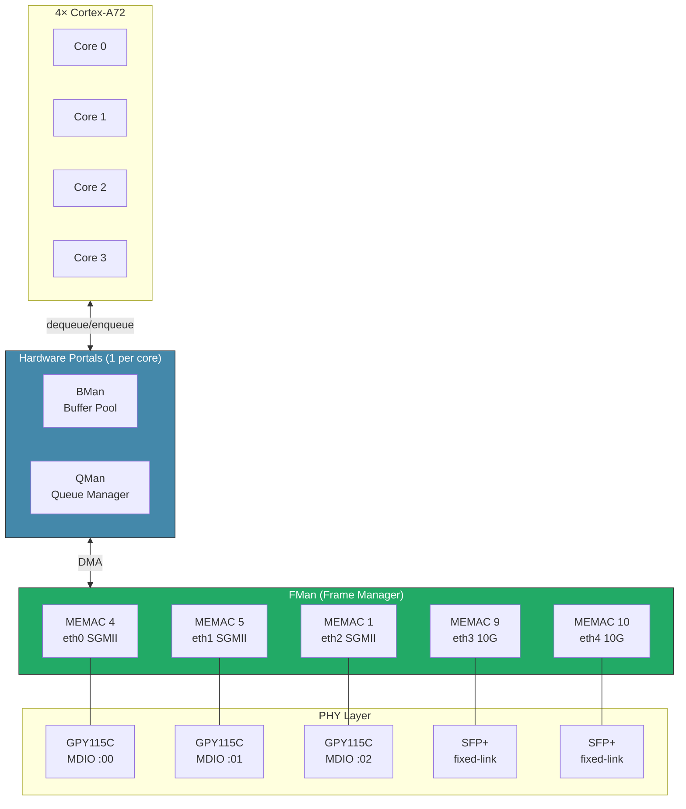

# DPAA1 Network Architecture

The Frame Manager is the unsung hero. It handles packet parsing, core distribution, and buffer management in hardware before the CPU ever touches a byte. LS1046A has four QMan/BMan software portals (one per A72 core), plus 28 pool channels and 4 dedicated channels the modernization work claims for per-qband AF_XDP dispatch.

## Architecture & Design

The design specs and deep-dives behind the build. Start here to understand *how* it works, not just how to run it.

| Document                                                                           | What's inside                                                                                                                                                                                                                   |
| ---------------------------------------------------------------------------------- | ------------------------------------------------------------------------------------------------------------------------------------------------------------------------------------------------------------------------------- |
| [specs/dpaa1-afxdp-modernization-spec.md](specs/dpaa1-afxdp-modernization-spec.md) | **DPAA1 AF_XDP driver modernization** — the flavor-ops abstraction, XSK-backed BMan pools, per-CPU NAPI on dedicated QMan channels, the four FMan HW offloads (CC / HM / Policer / CEETM), and the per-milestone status tracker |
| [plans/NETWORKING-DEEP-DIVE.md](plans/NETWORKING-DEEP-DIVE.md)                     | **DPAA1 networking internals** — FMan architecture, QBMan portal allocation, the three-driver split (`fsl_dpaa_mac` / `fsl_dpa` / `fsl_dpaa_eth`), and how packets flow before the CPU sees them                                |
| [plans/DUAL-DATAPLANE.md](plans/DUAL-DATAPLANE.md)                                 | **Single-image dual-dataplane model** — one ISO ships every datapath; the silicon mode state machine (mainline/RSS ↔ ASK offload, with VPP as an AF_XDP overlay), runtime switching, and the reversibility contract             |
| [specs/ask2-rewrite-spec.md](specs/ask2-rewrite-spec.md)                           | **ASK2 hardware accelerator** — the modern in-tree rewrite of the FMan/QMan offload engine: `ask.ko`, the PCD subsystem, config-driven engagement (`set system offload ask`)                                                    |
| [specs/vpp-dpaa1-ls1046a-spec.md](specs/vpp-dpaa1-ls1046a-spec.md)                 | **VPP AF_XDP overlay** — kernel-bypass dataplane on the 10G SFP+ ports, thermal constraints, and the kernel↔VPP coexistence model                                                                                               |
| [plans/PORTING.md](plans/PORTING.md)                                               | **Porting postmortem** — driver archaeology, the boot-flow rework, and what broke (and why) bringing mainline VyOS up on the LS1046A                                                                                            |
