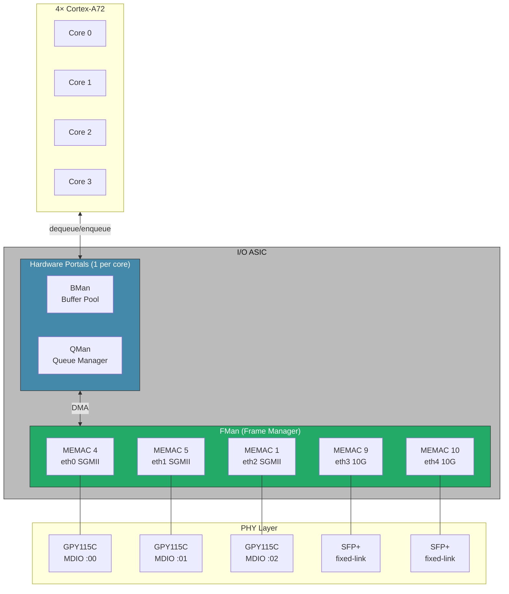

## TL;DR: DPAA1 and ASK are both required for HW-offloading in the LS1064A SoC. Different versions exist with different functionality. Both are being rebuilt for use with VyOS on Kernel 6.18

# Understanding HW-Offloading on LS1046A

Achieving wire-speed throughput on the Mono Gateway Development Kit requires utilising the HW-offloading capabilities of the LS1046A SoC, specifically it's I/O ASIC. Here we provide an overview of what this is, how it works, and why rebuilding parts of the SW machinery as 'ASK2' for use modern Kernels (6.18+), as used in VyOS 'Rolling', is now essential.

# DPAA1/ASK Network Architecture Overview

To understand HW-offload on the LS1046A SoC you first need to understand the DPAA1 architecture, and how the various parts of it work together. These parts include the DPAA1 kernel driver, the NXP microcode the ASIC itself loads, and how ASK programmes these functions collectively to enable HW-offloading.

Lots of acronyms. Lets unpack.

ASIC = [Application Silicon Integrated Circuit](https://en.wikipedia.org/wiki/Application-specific_integrated_circuit) — Built to do specific things, really well.
DPAA = Data Path Acceleration Architecture — Defines the ASIC accelerator functions
ASK = Application Solutions Kit — Defines how the ASIC functions interoperate
Microcode — In this specific context, defines which ASIC functions are enabled

This is a big topic, best approached by first visualising the outcome, as below.

A visual overview of DPAA1 of the LS1064A SoC in the Mono Gateway development kit. 

>**NOTE:** The I/O ASIC sits between the Physical network port PHYs (bottom) and the CPU (top). If the HW-offloading does it's job well, packets enter and leave the device without ever touching the CPU. That is what HW-Offloading means in this context, and it leaves the CPU free to do other work.

One diagram in and more Acronyms to expand.

FMan = Frame manager — inspects, splits, enqueues on ingress/egress
QMan = Queue manager — controls input/output queues and scheduling for other functions
BMan = Buffer manager — controls frame/data buffers in memory for other functions
CAAM (not shown) = Cryptographic Accelerator and Assurance Module — performs accelerated crypto functions

The curious can find more detail in existing public NXP documentation on [QorIQ DPAA1](https://docs.nxp.com/bundle/GUID-39A0A446-70E5-4ED7-A580-E7508B61A5F1/page/GUID-194DD21B-FC7F-4AF4-BB44-86F4B4A402D2.html) and [Layerscape DPAA/DPAA1](https://docs.nxp.com/bundle/LLDPUG_L6.1.36_2.1.0/page/topics/introduction_003.html) two names, same thing. The name change was to differentiate from the (unrelated) DPAA2 architecture that launched later.

''DPAA1' as a term is more commonly used to refer to the kernel DPAA1 driver for the SoC architecture of the same name. There are parallels between this DPAA1 driver and those of a simple network device, along with the added complexity associated with driving an entire I/O ASIC.

## A (brief) history of ~~time~~ relevant DPAA1 driver versions

- **NXP lf-5.4 LSDK** — this is the original NXP source, made for kernel 5.4, in the times when coding discipline was... _Different._
- **NXP lf-6.12.49** — **(what Mono shipped)** — NXP/mirror forward-port that stubbed the older 5.4 patches
- **OPNsense/FreeBSD** — Re-port of the full lf-5.4 SDK + ASK 1.x cdx/cmm/dpa_app userspace onto FreeBSD
- **NXP lf-6.6.y** — Forward-port that also stubbed older 5.4 patches → initial Vyos build
- **VyOS** — **(Now)** — Modernising DPAA1, e.g. adding AF_XDF (adds 'zero copy') support; actively rebuilding ASK as 'ASK2' for Kernel 6.18 branch used in VyOS 1.5.x 'Rolling'

## Choose your own DPAA1/ASK adventure

For an slightly less brief overview of DPAA1 and ASK, read on.
If you prefer a direct deep dive on this topic, see - [plans/NETWORKING-DEEP-DIVE.md](plans/NETWORKING-DEEP-DIVE.md)

> **NOTE:** It is hard to sufficiently <u>underscore</u> just how much has changed in Linux kernel-land networking since the initial DPAA1 + ASK were created. Less 'new page', more 'entirely new book'. This makes it is significantly more complex and expensive to maintain this legacy code moving forward, than to instead fundamentally rebuild the DPAA1 driver and ASK2 using modern paradigms.

# Overview: Using the DPAA1 Driver(s), Microcode & ASK

Multiple different versions, combinations and capabilities exist under the same 'DPAA1 driver' banner. Lets unpick.

## Open Source, but limited: NXP DPAA1 (mainline 4.1-)

NXP DPAA1/Layerscape DPAA, have been around in the mainline Linux Kernel in various iterations since at least 2015, and were first merged in Kernel mainline 4.1.x. [NXP QorIQ SDK 2.0](https://www.nxp.com/docs/en/release-note/QORIQ-SDK-2-0_RN.pdf) release notes echo this, and some quick Kernel tree archaeology unearths the initial Kernel FMAN (network device) commits landed in [Dec 2015](https://github.com/torvalds/linux/commits/f31c00c377ccf07c85442712f7c940a855cb3371/drivers/net/ethernet/freescale/fman?since=2015-12-01&until=2015-12-31), and initial QMan/BMan SoC commits followed within a year in [Sept 2016](https://github.com/torvalds/linux/commits/master/drivers/soc/fsl/qbman?since=2016-09-01&until=2016-09-30). This is an old codebase, with a long legacy.

### Limitations

The mainline DPAA1 driver is built to leverage the Coarse Classifier functions of the open-source `106.4.18` NXP microcode that is [freely available](https://github.com/nxp-qoriq/qoriq-fm-ucode) . As the function's name suggests, this classifier enables comparatively limited functionality of the underlying ASIC, and this microcode version enables comparatively little. In performance terms, this combination was designed for a previous era of Linux networking.

## Faster, but old: NXP DPAA1 (NXP ASK)

The ASIC within the SoC LS1046A is capable of far greater performance when using an alternative (out-of tree) NXP DPAA1 ASK driver and the proprietary (closed-source) `210.10.1` NXP-signed microcode blob that also ships with the Mono Gateway Development Kit. Critically, this microcode version enables a fine-grain PCD (Parse-Classify-Distribute) classifier along with a wide range of other HW accelerator functions. This makes HW-offloading both far more capable, and more performant.

### Limitations

The NXP provided DPAA1 driver and ASK, are based on the NXP lf-5.4x LTS Kernel branch. The Kernel 5.4 was released in Nov 2019, and reached End of Life (EoL) in December 2025. It is no longer supported. It is faster, but it still lacks the optimisations and improvements common to modern high-speed networking.

During the development of the Mono Gateway Development Kit, Mono purchased NXP ASK, and with permission, [released the ASK source](https://github.com/we-are-mono/ASK) under GPL v2.0, but the onboard `210.10.1` microcode remains proprietary. This is why [Mono firmware](https://firmware.mono.si/) sits behind authentication.

### Forward-ports

Mono presented their solution to the (EoL) kernel [in a video](https://www.youtube.com/watch?v=xRvi3k8XV8E) discussing using supervised AI to port the aging Kernel 5.4 NXP DPAA1+ASK code forward to the newer NXP lf-6.12.49 Kernel branch. This is what Mono then shipped in the default [OpenWRT build](https://github.com/we-are-mono/OpenWRT-ASK) installed the Mono Gateway Development Kits.

The subsequent official [Opnsense builds](https://opnsense.mono.si/) utilised a similar re-port process of the full NXP lf-5.4 patches + ASK user-space components over to FreeBSD, on which Opnsense is based.

# Modernising DPAA1 & ASK for VyOS

The creation of an initial VyOS build for Mono Gateway Development Kits is described in [STARTING-GATE.md](STARTING-GATE.md), and leverages the VyOS 1.5.x 'Rolling' release sources built for the Kernel 6.6 LTS branch. As porting from 5.4 LTS to 6.12.49 had been proven by Mono, porting from 5.4 to 6.6 LTS for VyOS 'Rolling', was readily achievable.

VyOS 'Rolling' was subsequently rebased from Kernel `6.6.137 LTS` to the near-experimental `6.18 Mainline`, representing a significant shift in the underlying kernel structures and primitives. What was portable from 5.4, or 6.6 to 6.12, as mono did for OpenWRT fundamentally breaks if porting to 6.18. A new approach is now required. 

Rather than continue to carry-forward the now historical DPAA1 and ASK codebase, attempting to continue modernising it for more recent Kernel releases, a decision was taken to fundamentally rebuild ASK as ASK2. This enables a more holistic modernisation of the DPAA1 driver to utilise modern Kernel networking performance improvements like zero-copy forwarding with AF_XDF.

# DPAA1 Driver Modernization Progress

An ongoing effort modernizes the mainline DPAA1 driver into a single shared kernel binary (consumed in different runtime modes — kernel `default`, `vpp` AF_XDP, `ask` offload, all shipping in one image) with HW-accelerated AF_XDP and four FMan/QMan hardware offloads. Full design and per-milestone status: [specs/dpaa1-afxdp-modernization-spec.md](specs/dpaa1-afxdp-modernization-spec.md).

**Shipping and board-validated today:**

- **Flavor-ops abstraction (M0)** — per-`dpaa_priv` ops tables, RCU-NULL-safe; byte-identical to mainline when no flavor module is loaded.
- **AF_XDP zero-copy plumbing (M1–M3-3)** — `ndo_xsk_wakeup`, XSK-backed BMan pool, per-CPU NAPI + dedicated QMan channels per qband, cluster-aware pinning. Driver proven to drop **0%** at line rate; ~5.57 Gbit/s aggregate RX measured (bottleneck is the single userspace receiver, not the NIC).
- **HW capability layer** — FMan PCD caps live-probed (`0x17` = CC HM POL PARSER on ucode 210).
- **HM VLAN-strip offload (M3-3c)** — live on hardware (`ethtool -k` → `rx-vlan-offload: on`).
- **Policer + CEETM scaffolds (M3-3d/e)** — install/stub APIs compiled in and cap-probed, stable contracts for the VyOS CLI consumers.

**What remains for a feature-complete driver** (see the spec's "What remains for a complete DPAA1 driver" table):

- **Two real kernel forward-ports** — the FMan PCD subsystem (unblocks CC steering and the productive HM/Policer datapaths) and the QMan-CEETM driver (~4500 LOC, absent from mainline 6.18, needed for HW egress shaping).
- **Non-kernel glue** — vyos-1x CLI consumers for HM/Policer/CEETM, a traffic generator for the functional datapath gates, and a multi-core receiver to record the literal ≥7 Gbps figure.

No further *architectural* work is required — the ops abstraction and capability layer already accommodate every remaining consumer.