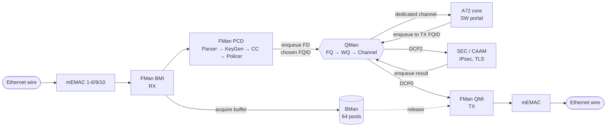
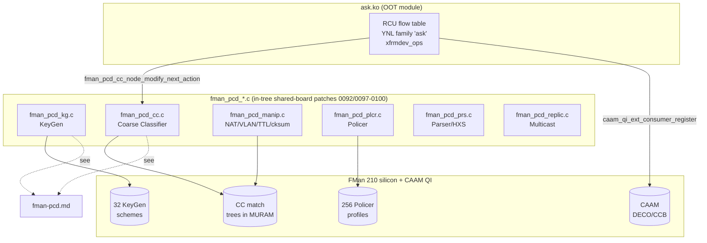

# DPAA1 / LS1046A Hardware Architecture Reference

**Status:** Reference material (silicon ground truth) · **Board:** NXP LS1046A — Mono Gateway Development Kit · **DPAA version:** DPAA1, FMan v3

This directory is the **in-repo, distilled silicon reference** for the NXP LS1046A Data Path
Acceleration Architecture (DPAA1). It exists because the authoritative sources — the LS1046A
Reference Manual (`LS1046ARM`), the DPAA Reference Manual (`LS1046ADPAARM`), and the SEC Reference
Manual (`LS1046ASECRM`) — are **NDA-gated PDFs that cannot live in the repo**, yet
[`specs/ask2-rewrite-spec.md`](../specs/ask2-rewrite-spec.md) tells every implementer to *"read RM
§8.7–8.10 before touching FMan code."* These documents close that gap: they capture the
register-level, resource-count, and dataflow facts an agent needs to implement **ASK2** (`ask.ko` +
the `fman_pcd` subsystem) without holding the NDA manuals open.

> **Provenance.** Every fact here is distilled from the NXP reference manuals (cited inline by
> chapter/section/page). These docs are the **hardware layer**; they do not restate driver/API
> behaviour — for that see the LSDK 21.08 / LLDPUG L6.1.1 release notes and the implementation specs
> under [`../specs`](../specs). When a project-verified finding and a manual disagree for *our*
> board, the project finding wins; the manual wins for canonical silicon behaviour.

---

## 1. How this relates to `specs/` and `plans/`

| Directory | Answers | Authority |
|---|---|---|
| `arch/` (this dir) | *"What does the silicon do, and how is it programmed?"* | NXP reference manuals (hardware truth) |
| [`specs/`](../specs) | *"What are we building on top of it?"* (ASK2 `ask.ko`, `fman_pcd` patches, AF_XDP) | Project design intent |
| [`plans/`](../plans) | *"In what order, and what is done?"* (phases, gates, course corrections) | Project execution |

The arch docs are the **bedrock** the specs stand on. Where a spec says *"per RM §8.7.3.4"* or
*"FORWARD_FQ_WITH_MANIP"*, the corresponding mechanism is explained here.

---

## 2. Document index

| Doc | Module(s) | Read it before… |
|---|---|---|
| [`dpaa1-architecture.md`](dpaa1-architecture.md) | DPAA programming model, Frame Descriptor, FQ/WQ/Channel, ICID, packet walk-through | Touching any datapath code |
| [`fman.md`](fman.md) | FMan v3 internals — BMI, QMI, FPM, DMA, ports, mEMAC, 210 ucode | Working on RX/TX, ports, FMan probe |
| [`fman-pcd.md`](fman-pcd.md) | **Parse / Classify / Distribute** — Parser, KeyGen, Coarse Classifier, Policer, Header-Manip, Replicator | **Implementing `fman_pcd_*.c` or `ask.ko` flow tables** |
| [`qman-ceetm.md`](qman-ceetm.md) | Queue Manager — portals, FQ states, scheduling, congestion, ORP, **CEETM** | FQ config, QoS, shaping, congestion |
| [`bman.md`](bman.md) | Buffer Manager — pools, FBPR, depletion, portals | Buffer pool sizing, depletion handling |
| [`muram.md`](muram.md) | FMan shared RAM — budget, partitioning, allocator, **the ASK2 flow-table ceiling** | Sizing CC trees / manip chains (Risk #13) |
| [`sec-caam.md`](sec-caam.md) | SEC/CAAM — Job Rings, QI, DECO, CHA inventory, protocol accel | IPsec offload, `0001-caam-qi-share` |
| [`serdes-ethernet.md`](serdes-ethernet.md) | SerDes lanes, MAC↔lane map, mEMAC registers, 1588, XFI/KR | PHY/link bring-up, port map, 10G |
| [`soc-integration.md`](soc-integration.md) | CCSR/memory map, reset/clock/RCW, GIC interrupts, SCFG/DCFG/DEVDISR, SMMU/ICID | Probe order, IRQ wiring, coherency |
| [`software-stack-ask.md`](software-stack-ask.md) | SDK vs ASK vs ASK2 vs mainline; FLib/FMC/dpaa_eth; how SW maps to HW | Orienting in the codebase |

---

## 3. DPAA1 at a glance — the datapath

DPAA1 turns "network I/O + crypto + queueing" into **enqueue/dequeue operations on a single Queue
Manager**. Frame *data* lives in DRAM buffers (owned by BMan); everything else passes **Frame
Descriptors** (128-bit pointers-with-metadata) between blocks over QMan queues.

Key idea: **every block-to-block handoff is an enqueue/dequeue on QMan.** Priority and CPU affinity
are chosen per-handoff by selecting the destination Work Queue / Channel. The CPU can be bypassed
entirely (HW fast path) when the PCD classifies a flow straight to an egress FQ — this is exactly
what ASK2 programs.

---

## 4. Canonical LS1046A hardware constants

These are **silicon constants** (not configurable). Treat this table as the single source of truth;
the per-module docs cite the originating RM section. Values reconciled across the DPAA RM, SoC RM,
and SEC RM (and a known Ch.14-vs-Ch.1 erratum on CGR count).

| Domain | Constant | Value | Source |
|---|---|---|---|
| **CPU** | Cores | 4× Cortex-A72 @ up to 1.8 GHz, 2 MB shared L2 | SoC RM Ch.1 |
| **DDR** | Controller | 1× DDR4, up to 2.1 GT/s, ECC | SoC RM Ch.1 |
| **FMan** | Instances | **1** FMan v3 @ ~700 MHz | DPAA RM §1.9.3 |
| FMan | mEMACs (SoC) | **8**: mEMAC1–6, 9, 10 (no 7/8) | DPAA RM §1.9.3 |
| FMan | Aggregate | ~32 Mpps / ~22 Gbps | DPAA RM Ch.5 |
| FMan | **MURAM** | **384 KB** | DPAA RM §1.9.3 |
| FMan | TNUMs (tasks) | 128 | DPAA RM §1.9.3 |
| FMan | KeyGen schemes | **32** | DPAA RM §5.10 |
| FMan | Classification plans | 256 | DPAA RM §5.10 |
| FMan | Policer profiles | **256** | DPAA RM §5.11 |
| FMan | CC roots / port | 16 | DPAA RM §5.12 |
| FMan | CC entries / table | 255 (+1 miss) | DPAA RM §5.12 |
| FMan | Offline (OH) ports | 3 (IDs 03h–05h) + 1 host-cmd (02h) | DPAA RM §1.9.3 |
| **QMan** | SW portals | **10** | DPAA RM §3 |
| QMan | DCP portals | 2 — **DCP0=FMan, DCP2=SEC** | DPAA RM §3 |
| QMan | Pool channels | 15 (0x401–0x40F) | DPAA RM §3 |
| QMan | FQID space | 16 M (24-bit) | DPAA RM §3 |
| QMan | FQD cache | 512 | DPAA RM §1.9.1 |
| QMan | SFDRs | **2048** | DPAA RM §1.9.1 |
| QMan | **Congestion groups** | **256** (Ch.14's "128" is an erratum) | DPAA RM §1.9.1 |
| QMan | ORP/ORL records | 256 | DPAA RM §3 |
| **CEETM** | Variant | 8-channel | DPAA RM §3.3.20 |
| CEETM | Class queues | 128 (16/channel) | DPAA RM §3.3.20 |
| CEETM | **XSFDRs** | **1024** (NOT 4096) | DPAA RM §3.3.20 |
| CEETM | LNIs / LFQIDs | 8 / 1 K | DPAA RM §3.3.20 |
| **BMan** | Buffer pools | **64** (BPID 0–63; 255=discard) | DPAA RM §1.9.2 |
| **SEC** | Job Rings | 4 | SEC RM Ch.1 |
| SEC | DECO/CCB | 3 | SEC RM Ch.1 |
| SEC | CHAs | 11 (incl. PKHA ≤4096-bit RSA / ≤1024-bit ECC) | SEC RM |
| **SoC** | SVR | `0x8707_0010` (SOC_DEV_ID 0x707, rev 1.0) | SoC RM (DCFG_SVR @ 0x01EE_00A4) |

---

## 5. CCSR memory map (the addresses you will `ioremap`)

CCSR base = **`0x0100_0000`** at reset (16 MB window). Linux relocates the window to **ALTCBAR
`0x01_0000_0000`** (4 GB). Full register address = `CCSR_base + block_offset + register_offset`.

| Block | CCSR offset | Notes |
|---|---|---|
| SEC / CAAM | `0x170_0000` | 1 MB region |
| QMan config | `0x188_0000` | |
| BMan config | `0x189_0000` | |
| FMan (all sub-blocks) | `0x1A0_0000` | 1 MB; mEMACs, BMI/QMI/FPM, KeyGen, Policer, parser inside |
| mEMAC1–6 | `0x1AE_0000` + n·0x2000 | mEMAC1=…E0000 … mEMAC6=…EA000 |
| mEMAC9 / mEMAC10 | `0x1AF_0000` / `0x1AF_2000` | the two 10G XFI ports |
| MDIO1 / MDIO2 | `0x1AF_C000` / `0x1AF_D000` | XGMAC MDIO — `CONFIG_FSL_XGMAC_MDIO=y` is mandatory |
| SCFG | `0x157_0000` | supplemental config (coherency snoop, QoS, pinmux) |
| SerDes1 / SerDes2 | `0x1EA_0000` / `0x1EB_0000` | per-lane TECR0 at lane offsets |
| DCFG | `0x1EE_0000` | device config (RCW shadow, SVR, DEVDISR) |
| RCPM | `0x1EE_2000` | run-control / power |

QMan/BMan **software-portal data windows** are *separate* 36-bit regions at `0x05_0000_0000`
(QMan) and `0x05_0800_0000` (BMan) — not the config offsets above. See
[`qman-ceetm.md`](qman-ceetm.md) and [`bman.md`](bman.md).

---

## 6. ASK2 relevance map

How each hardware block maps onto the ASK2 implementation (per
[`specs/ask2-rewrite-spec.md`](../specs/ask2-rewrite-spec.md) §13):

| ASK2 artifact | Grounded by | Hardware ceiling that constrains it |
|---|---|---|
| `fman_pcd_kg.c` (exact-match lookup) | [`fman-pcd.md` §KeyGen](fman-pcd.md) | 32 schemes; 56-byte key; CRC-64 hash |
| `fman_pcd_cc.c` (flow table) | [`fman-pcd.md` §Coarse Classifier](fman-pcd.md) | 16 roots/port, 255 entries/table, ≤3 nested lookups, ≤128 B table for line-rate |
| `fman_pcd_manip.c` (inline NAT) | [`fman-pcd.md` §Header Manipulation](fman-pcd.md) | ≤4 AD entries/chain; ≤1 KiB MURAM/chain (Risk #13) |
| `fman_pcd_plcr.c` | [`fman-pcd.md` §Policer](fman-pcd.md) | 256 profiles; RFC-2698/4115 |
| Flow-table capacity | [`muram.md`](muram.md) | ~96 KB usable MURAM → **~750 HW flow entries** |
| `0001-caam-qi-share` | [`sec-caam.md`](sec-caam.md) | 4 Job Rings; QI via DCP2; RNG must be SW-instantiated at boot |
| Port map (eth0–eth4, OP1/OP2) | [`serdes-ethernet.md`](serdes-ethernet.md) | SerDes `0x1133`: mac9=lane D, mac10=lane C |

---

*Maintainers: when you add a silicon fact, cite the RM section and (if it changes an implementation
constraint) note the affected `fman_pcd`/`ask.ko` artifact.*
