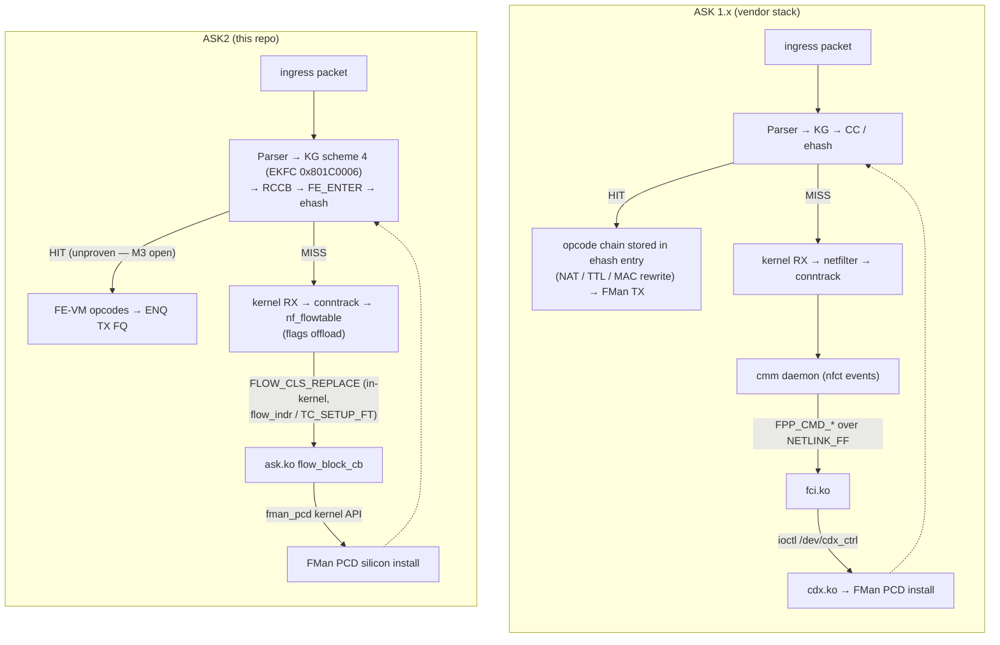

# ASK 1.x vs ASK2 — Module Comparison

**Version 1.0 · HADS 1.0.0 · 2026-08-12**

## AI READING INSTRUCTION

This document maps every component of the NXP ASK 1.x offload stack to its
ASK2 equivalent (or records that the component was deliberately deleted).
It is a **structural cross-reference**, not a silicon reference — for
register-level facts read `fman-microcode-210-programming-reference.md`;
for execution status read `plans/ASK2-MASTER-PLAN.md`; for the dataplane
state machine read `plans/DUAL-DATAPLANE.md`. Where this document and
those documents disagree, they win. Status claims below were verified
against branch `dpaa1` on 2026-08-12 and against the vendor reference
pin described in §8.

---

## 1. Scope and sources

**[SPEC]** ASK 1.x = the NXP/Mindspeed-heritage offload stack as shipped on
the vendor reference node (`.106`, OpenWrt) and mirrored in
`we-are-mono/openwrt` (branch `mono`, ASK pin `b4c31a46`, NXP tag
`lf-6.12.49-2.2.0`, vendor kernel `df24f9428e38`). Its components: `cdx.ko`,
`fci.ko`, `auto_bridge.ko`, comcerto fastpath (`CONFIG_CPE_FAST_PATH`),
`cmm`, `dpa_app`, `fmc`, `fmlib`, `libcli`, iptables QOSMARK extensions,
and the XML config set (`cdx_pcd.xml`, `cdx_cfg.xml`, `cdx_sp.xml`,
`fastforward`).

**[SPEC]** ASK2 = this repository's rewrite: the OOT module `ask.ko`
(`kernel/ask/oot-modules/ask/`) plus the in-tree `fman_pcd` subsystem
(board patches 0092–0169, `CONFIG_FSL_FMAN_PCD=y`) plus the VyOS CLI
patches (`data/vyos-1x-031-offload-ask-cli.patch`,
`data/vyos-1x-033-op-mode-ask-flows.patch`), engaged per interface via
`set interfaces ethernet eth<n> offload ask`.

**[NOTE]** Provenance discipline (spec v1.1 onward): ASK 1.x and the NXP
SDK are used as silicon-behaviour cross-references only. ASK2 copies no
code or struct layouts from them; legacy ABI surfaces (`/dev/cdx_ctrl`,
`libfci.so.1`, `/etc/cdx_*.xml`) are forbidden in ASK2 (spec v1.3).

---

## 2. The fundamental architectural delta

**[SPEC]** ASK 1.x is a **userspace-daemon-driven** stack bolted onto the
vendored NXP SDK drivers: `cmm` watches conntrack in userspace and pushes
flows through a custom netlink protocol (FCI) into `cdx.ko`, while
`dpa_app` + `fmc` compile an XML PCD graph at boot, before netdevs exist.
ASK2 **inverts** this: there is no daemon, no IPC layer, and no XML. The
kernel's own conntrack/nf_flowtable machinery selects flows, a single OOT
module programs an in-tree PCD subsystem through kernel APIs, and the
whole dataplane mode is switched per interface from the VyOS CLI with a
byte-exact reversibility contract (`pcd-snapshot`).

**[NOTE]** ASK 1.x is a port of the Mindspeed/Comcerto C2000 Forward Path
Processor control plane re-pointed at NXP SDK FMan (Mindspeed copyright in
`auto_bridge.c`, Comcerto FPP heritage in `cmm`); it is not native DPAA
classification. ASK2 is designed natively against the DPAA1 programming
model with mainline drivers.

---

## 3. Module-for-module mapping

**[SPEC]** The table below is the normative mapping. "Deleted" means the
component has **no successor by design**; its function is either absorbed
by a mainline kernel mechanism or dropped from scope.

| ASK 1.x component | Role in 1.x | ASK2 equivalent | ASK2 status (2026-08-12) |
|---|---|---|---|
| `cdx.ko` (~45 kLOC, 85 files; `/dev/cdx_ctrl` chardev, 30+ ioctls) | Hardware flow-table manager: CC trees, KeyGen schemes, OH ports, ehash insert, timer wheel, procfs | `ask.ko` (16 sources, ~5.6 kLOC C measured; RCU rhashtable flow table) **+** in-tree `fman_pcd` subsystem (patches 0092–0169) | ask.ko shipping: engage/disengage via kernel API, conntrack offload, crash-safe teardown; chardev/ioctl replaced by genl family `ask` (`kernel/ask/uapi/ask.yaml`) |
| — `cdx_ehash.c` (4062 LOC): `insert_entry_in_classif_table()` → `fill_key_info()` → `ExternalHashTableAddKey()` | Per-flow HW key install + opcode chain | `fman_pcd_ehash_add_key()` / FE-VM flow insert (patches 0122–0131, 0153); insert path `ask_fe_flow_insert()` → `fman_pcd_fe_flow_add()` | Code complete, byte-verified via `fe_*` debugfs; **no confirmed silicon HIT yet** (master plan M3 open) |
| — `cdx_dpa_ipsec.c` + `dpa_ipsec.c` (~4 kLOC): CAAM SEC shared descriptors, to-sec/from-sec FQs, NAT-T | IPsec offload | `ask_xfrm.c` (29 LOC) + `ask_caam.c` (21 LOC) stubs; patch 0134 `caam-qi-share` landed | Deferred to M6; `ask_xfrm_state_add` returns `-EOPNOTSUPP` |
| — `cdx_ceetm_app.c` + `cdx_qos.c` (~2.6 kLOC): CEETM channels/shapers, policer profiles | QoS / policing | Patches 0104/0104a (ingress policer tc-matchall bridge, HW-verified 2026-06-09), 0111 `qman-ceetm`, 0112 `dpaa-ceetm-htb`, 0104b ceetm stub | Ingress policer shipping (`set … ingress-policer` → FMan PLCR, `in_hw`); hierarchical CEETM not wired into ask.ko |
| — `cdx_timer.c`: hierarchical timer wheel (flow aging) | Flow aging | Deleted — mainline nf_flowtable ages flows (HW-aging-off invariant) | Mainline |
| — `control_bridge.c`, `control_{vlan,pppoe,socket,rtp_relay}.c`, `devman.c` | Feature controllers | Mostly not carried forward (§5); bridge = `ask_bridge.c` 21-LOC switchdev-notifier stub | M6 scope (IPv6/bridge/IPsec) |
| `fci.ko` + `libfci` (NETLINK_FF custom protocol, `FPP_CMD_*`) | cmm↔cdx IPC | **Deleted, no replacement.** Flow delivery uses the mainline flowtable HW-offload contract: nft flowtable `flags offload` → `flow_indr_dev` / `TC_SETUP_FT` → `flow_block_cb` (`FLOW_CLS_REPLACE/DESTROY/STATS`) in `ask_flow_offload.c` (2323 LOC). Residual control = genl/YNL | Shipping (proven at M2) |
| `auto_bridge.ko` (1831 LOC; ebtables hooks, NETLINK_L2FLOW=33) | L2 bridge flow detection | `ask_bridge.c` stub (switchdev notifier planned) | Not implemented; L2 offload deferred |
| comcerto fastpath (`CONFIG_CPE_FAST_PATH`, `fp_netfilter`, NF_IP_PRI_LAST metadata snapshot into ct entries) | Per-packet conntrack metadata enrichment | **Deleted, no equivalent.** Mainline conntrack + flowtable deliver a complete `flow_rule` at REPLACE time; no per-packet snapshot hook exists or is needed | — |
| `cmm` (~43 kLOC daemon: conntrack monitor, route/neighbor caches, keytrack, QoS modules, cmmctl CLI) | Software brain | **Deleted.** Split into mainline pieces: conntrack events → nf_flowtable promotion (in-kernel); route/neigh resolution performed by kernel flowtable infra before REPLACE; policy = VyOS firewall config; operator surface = `vyos-1x-031` CLI + `033` op-mode | CLI shipping (`offload ask` per-interface, ASK↔VPP mutex, `show flows` via ynl) |
| `dpa_app` (boot-time PCD loader via `call_usermodehelper`, reads the XML set) | PCD baseline programmer | **Deleted.** Replaced by engage-at-config-commit: `fman_pcd_fe_engage()`/`_disengage()` (patch 0153) through dpaa flavor-ops (patches 0068/0069); boot always lands S0 (mainline RSS) | Engage works in dev builds (debugfs path); genl end-to-end engage is the open course-correction (`plans/ASK2-PRODUCTION-ARCHITECTURE.md`, 2026-08-11) |
| `fmc` + `fmlib` (XML→PCD compiler, `FM_PCD_*` userspace API) | PCD graph compiler | **Deleted.** Replaced by in-tree `fman_pcd` kernel API: KeyGen (0097), CC (0098, 0105–0108, 0115–0118, 0166–0167), HM chains (0099, 0119–0120, 0137), PLCR (0100), FE-VM/ehash (0122–0135) | Layer 1 shipping |
| iptables `QOSMARK`/`QOSCONNMARK` extensions (64-bit qosmark) | QoS marking consumed by offload | **Not carried forward.** nftables `meta mark`/`ct mark` + tc-flower / hw-tc-offload cover the role | **[?]** no 64-bit qosmark concept exists in ASK2 |
| `libcli` + cmmctl | Operator CLI | ynl Python + VyOS op-mode commands | Surface shipping (M7); release claim gated by CR-001 |
| Config: `cdx_pcd.xml`, `cdx_cfg.xml`, `cdx_sp.xml`, `/etc/config/fastforward` | Declarative PCD topology + port→policy binding | **Forbidden legacy surfaces** (spec v1.3). PCD topology is code: EKFC `0x801C0006`, 14-byte key `PORT_ID\|SIP\|DIP\|PROTO\|SPORT\|DPORT`, raw CRC-64 — constants in `fman_pcd` per `specs/fman-keygen-flow-key-spec.md` v2.0 | — |

**[NOTE]** Size comparison: ASK 1.x totals roughly 100 kLOC of C plus a
17.9k-line kernel patch and the vendored SDK driver fork (kernel pinned to
6.12.49 — the SDK Kconfig is rejected by the 6.18 parser). ASK2 totals
~11 kLOC (ask.ko ~5.6 kLOC measured 2026-08-12 + `fman_pcd` subsystem
across patches 0092–0169) on mainline 6.18.x. The spec's original
"~2800 LOC ask.ko" target predates the genl/flow-offload buildout; the
measured tree is authoritative.

---

## 4. Control and data paths side by side

**[SPEC]** Data flow (both stacks, identical silicon): packet → Parser →
KeyGen hash → classification lookup → HIT: header-manipulation opcodes →
FMan TX (zero CPU); MISS: default RX FQID → kernel network stack.

**[NOTE]** The ASK 1.x flow-install path is strictly
conntrack → cmm → FCI → cdx → FMan PCD; there is no alternative path, and
it is bootstrap-deadlocked on the SDK kernel (`enable_hooks=false` gates
conntrack hook registration). ASK2 removes the deadlock because flow
selection and delivery both live in the kernel.

---

## 5. Deliberately not carried forward

**[SPEC]** The following ASK 1.x mechanisms have no ASK2 successor:

1. **OH-port detour** (two FMan datapath trips with a DDR round-trip for
   IPsec/WiFi re-inject) — replaced by the single-stage inline-manip
   concept (`FORWARD_FQ_WITH_MANIP`, RM §8.7.3.4 +
   `e_FM_PCD_CC_KEY_FLAG_DO_MANIP_BEFORE_NE`).
2. **Userspace daemon, custom netlink protocol, chardev ioctl ABI** —
   legacy surfaces `/dev/cdx_ctrl`, `libfci.so.1`, `/etc/cdx_*.xml`
   forbidden (spec v1.3).
3. **RTP/RTCP relay, PPPoE offload, multicast replication, HW IP
   reassembly, WiFi VAP config, L2TP** — dropped or deferred to M6+.
4. **SDK driver dependency** — ASK 1.x requires vendored
   `sdk_fman`/`sdk_dpaa`/`fsl_qbman` plus the 17.9k-line kernel patch and
   cannot build past kernel 6.12; ASK2 runs on mainline `fman`/`dpaa`
   (6.18.x, 7.x-rebase-safe).
5. **64-bit qosmark iptables extensions** — see §3 row.

---

## 6. Shared invariants

**[SPEC]** Both stacks share these silicon-level facts:

1. Same firmware: FMan microcode **210.10.1**, ASK package gate ≥ 209.
   `cdx_module_init()` checks `fm_get_fw_rev()`; ask.ko encodes the same
   `ASK_UCODE_PACKAGE_NUMBER = 209` gate.
2. Same production classification mechanism: **external hash table**.
   Vendor `cdx.ko` classifies every accelerated flow via
   `ExternalHashTableAddKey()` (confirmed 2026-08-05 as the vendor's real
   production path, not CC-tree); ASK2's FE-VM ehash path targets the same
   mechanism.
3. Same flow-key format: the vendor's 14-byte `union dpa_key`
   (`portid` byte + 13-byte 5-tuple) matches ASK2's EKFC `0x801C0006` key
   byte-for-byte — HW-confirmed via CRC-64 match three independent times
   (2026-08-06/07/08, `specs/fman-keygen-flow-key-spec.md` §2–3).
4. Same KG hash: raw CRC-64 (ECMA-182, reflected poly
   `0xC96C5795D7870F42`), seed `~0ULL`, no final complement, stored at IC
   offset `0x48`.

---

## 7. Maturity comparison (honest state, 2026-08-12)

**[SPEC]**

| Axis | ASK 1.x | ASK2 |
|---|---|---|
| L2 bridge offload | Proven in hardware (vendor node `.106`, CVAN 25.12.4: PCD counters moving) | Not implemented (`ask_bridge.c` stub) |
| Routed-flow HW offload | Pipeline proven end-to-end, but `cmm` conntrack ingestion on `.106` is deaf (vendored libnetfilter_conntrack 1.1.0 never invokes `__cmmCtCatch()`); historically blocked by `enable_hooks=false` and VyOS `notrack` | No confirmed silicon HIT (M3 open); zero-HIT reproduced across every key-format/topology hypothesis tested; fault bracketed between KeyGen completion and ehash comparator visibility |
| Proven HW offload today | Bridge path | FMan ingress policer (HW-verified) + mainline RSS; M2 = 7.37 Gbps MISS→kernel pass-through @ 0.16% CPU |
| Reversibility | None — PCD state persists across `rmmod cdx`; reboot-only recovery | Hard gate: S1→S0 `pcd-snapshot` byte-exact register/MURAM diff |
| Kernel horizon | Dead at 6.12 (SDK Kconfig rejected by 6.18 parser) | Mainline-aligned (6.18.x, survives 7.x rebase) |
| Observability | `/proc/fqid_stats/pcd/*`, `/proc/fci` — **not** a HIT/MISS oracle (cmm deafness) | genl `dump-flows`/`get-info`; `fe_*` debugfs in dev builds only (production images compile debugfs out per `plans/ASK2-PRODUCTION-ARCHITECTURE.md`) |

---

## 8. Where the ASK 1.x reference lives

**[SPEC]** Verified 2026-08-12:

1. **`we-are-mono/openwrt`** (branch `mono`, default) — the complete ASK
   1.x integration tree. Pins: ASK `b4c31a46` (`package/ask/ask-version.mk`),
   vendor kernel `nxp-qoriq/linux @ df24f9428e38`
   (`configs/mono_gateway-dk.seed`). Packages: `ask-modules`
   (kmod-ask-cdx AutoLoad 30 / auto-bridge 31 / fci 52), `cmm` (START=54),
   `dpa-app`, `fmc` (`nxp-qoriq/fmc @ 15a31335` +
   `100-mono-ask-extensions.patch`), `fmlib` (`nxp-qoriq/fmlib @ 79c5c2ec`
   + same patch), `libcli` 1.10.7. Kernel integration:
   `target/linux/layerscape/Makefile` applies ASK `patches/kernel/0*.patch`
   (the 010–099 split series; `999-*` legacy monolith never applied), then
   `patches-ask/`, then `files-ask/` (mono-gateway-dk.dts).
2. **`we-are-mono/ASK`** — the source repo; `master` == `mt-6.12.y` ==
   `b4c31a46` (converged). Split kernel patches 010–099; `999-layerscape-
   ask-kernel_linux_5_4_3_00_0.patch` = golden LSDK reference with the only
   non-stub FE-VM bodies (`FmPcdCcBuildFE`, `FmPcdCcBuildContextByFE`,
   `get_indexed_hash_bucket`).
3. **Local references:** `/home/vyos/ask-ref/ask` (checkout `85f2db27` —
   ~170 commits **behind** the openwrt pin; align with
   `git checkout b4c31a46`), `/home/vyos/ask-ref/linux` (pristine vendor
   kernel `df24f9428e38` — comcerto fastpath is **not** in it; it comes
   from ASK patches 010–070),
   `/home/vyos/kernel-ls1046a-build/reference/ASK-fix-security-hardening`
   (`165f402`, merged into master; missing patches 080–099).
4. **Live oracle:** `root@192.168.1.106` — production ASK 1.x node;
   byte-level oracle per `plans/NXP-106-DEEP-DIVE-PLAN.md`. Its `/proc`
   counters are not a HIT/MISS oracle (§7).

**[NOTE]** The comcerto fastpath (`CPE_FAST_PATH`, `enable_hooks`) is
introduced by the ASK kernel patch series (010–070) applied onto the
pristine vendor kernel — patch `050-ask-conntrack-offload.patch` adds
`enable_hooks` to `nf_conntrack_standalone.c`. Anyone bisecting conntrack
deafness must look at the patched tree, not the vendor tag.
