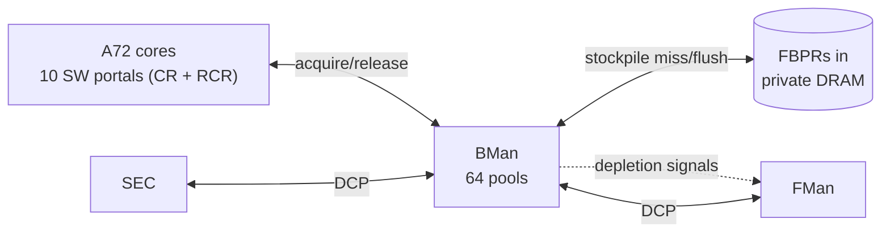
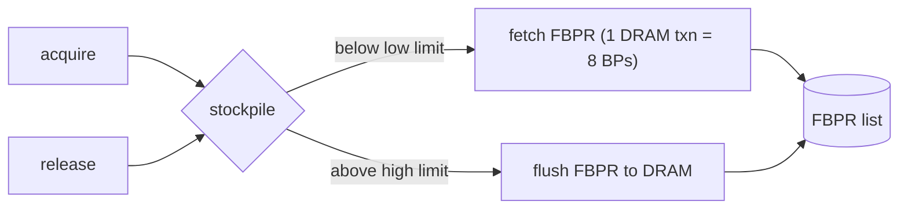

**Version 1.0.0 · vyos-ls1046a-build · 2026-06-21 · HADS 1.0.0**
# Buffer Manager (BMan)

## AI READING INSTRUCTION

This document is a hardware-reference manual for the NXP LS1046A BMan (Buffer Manager) block, DPAA Release 2 (DPAA-R2). It covers instance parameters, pool model, acquire/release protocol, stockpile mechanics, depletion signalling, FBPR backing store, init ordering (critical), error/ECC ISR bits, and ASK2 relevance. Every register name, bit position, threshold parameter, and init-order step is **correctness-critical** — the BMan init order is the most common source of silent no-buffer datapath deadlocks on this SoC. Treat all `**[SPEC]**` tagged paragraphs as binding; `**[NOTE]**` paragraphs contain rationale and datapath interaction context. Cross-references to `[fman.md]`, `[muram.md]`, `[qman-ceetm.md]`, `[dpaa1-architecture.md]`, and `[soc-integration.md]` are part of the specification surface.

---

## 1. Instance parameters (LS1046A)

**[SPEC]** Source: LS1046A DPAA RM Ch.4 (pp.409–466). BMan is the central free-buffer-pool manager. It serves acquire/release of **buffer pointers** to software (via portals) and to FMan/SEC (via DCPs). BMan never touches buffer data — it manages 40-bit pointers only.

| Parameter | Value |
|---|---|
| **Buffer pools** | **64** (BPID 0–63; **255 = discard**, releases silently dropped) |
| Software portals | 10 |
| Direct-Connect Portals | 2 (FMan, SEC) |
| Max buffers per acquire | 8 |
| Stockpile / pool | up to 64 buffers (on-chip SRAM) |
| Buffer pointer width | 40 bits (upper bits truncated) |
| CCSR base | `0x31_A000` (i.e. config block 0x189_0000 from CCSR base) |
| FBPR window (max) | 16 GB → 256 M FBPRs → 2 G pointers (~32 M/pool) |
| `BMAN_IP_REV_2[IP_CFG]` | 0x03 |

---

## 2. Buffer pools & the acquire/release model

**[SPEC]** 64 independent pools (BPID 0–63). Buffers within a pool are assumed **homogeneous** (same size/partition) and **unique** — BMan does not enforce this; a double-release corrupts the pool.

**[SPEC] Acquire (SW):** write a 64-byte command to the cache-enabled `BCSPn_CR`, read up to 8 pointers back from `BCSPn_RR0/RR1`. Empty/non-existent pool → VERB 0x10 (0 buffers). One outstanding CR at a time. Strict write/flush ordering required (DC ZVA → write words → DMB → write verb → flush).

**[SPEC] Release (SW):** via the **8-entry Release Command Ring (RCR)** (cache-enabled), up to 8 buffers per entry; verb type 2h = all to one pool, 3h = each to its own BPID. Releases are never rejected — BMan stalls RCR consumption if FBPRs are unavailable.

**[SPEC] DCP (FMan/SEC):** dedicated hardware interface; receives **availability** and **depletion** state as signals for automatic flow control. DCP acquires with multi-bit ECC errors return the pointer as invalid (corruption can't escape).

---

## 3. Stockpile — why most acquires never hit DRAM

**[SPEC]** Each pool keeps an on-chip **stockpile** of up to 64 pointers:

**[NOTE]** If per-pool acquire/release rates roughly balance, **no external DRAM transactions occur** — the stockpile absorbs the churn. Each FBPR slot holds 8 buffer pointers, so one DRAM access services 8 acquires/releases.

---

## 4. Depletion — the signal that matters for the datapath

**[SPEC]** A pool has two distinct low states:

| State | Meaning | Notification |
|---|---|---|
| **Availability** (empty) | pool completely empty | global `BMAN_ERR_ISR[BSCN]`; DCP signal |
| **Depletion** (below threshold) | occupancy < programmable threshold | per-portal `BCSPn_ISR[BSCN]`; DCP signal |

**[SPEC]** Four thresholds per pool (`COEF·2^EXP`): SW entry/exit (`SWDET`/`SWDXT`) and HW entry/exit (`HWDET`/`HWDXT`) — independent, with hysteresis (enter at DET, exit at DXT).

**[SPEC]** HW (FMan/SEC) depletion is signalled directly to the DCPs → the FMan BMI can **generate pause frames** or halt before it runs the pool dry (see [`fman.md`](fman.md) §6).

**[SPEC]** FBPR low-watermark (`FBPR_FP_LWIT`) raises `FLWI` when the *backing* FBPR free pool runs low.

**[BUG] Pool under-provisioning → silent discards (ASK2)**

**[NOTE]** ASK2 offloaded RX uses BMan pools for frame buffers. **Pool sizing is a correctness issue**: under-provisioned pools → out-of-buffer discards (counted in `FMBM_RFDC`) that look like silent packet loss. Wire HW depletion thresholds so the MAC pauses rather than drops. Buffer-size vs. pool-count tradeoffs interact with the MURAM FIFO budget ([`muram.md`](muram.md)).

---

## 5. FBPRs — the DRAM backing store

**[SPEC] FBPR** (Free Buffer Proxy Record) = 64-byte structure in BMan's **private, non-coherent** DRAM region; holds **8 buffer pointers** + self-index + BPID + next-index. Per-pool free list is a singly-linked LIFO (head in `BMAN_POOLn_HDPTR`).

**[SPEC]** Configure `FBPR_BARE`/`FBPR_BAR` (48-bit base) + `BMAN_ICIDR` (ICID for FBPR DMA) **before** writing `FBPR_AR[SIZE]` — the size write *immediately* triggers free-list initialisation in DRAM. Base must never change afterward; size may only grow.

**[SPEC]** Software must **never** touch FBPR memory directly.

### Init order (don't get this wrong)

**[SPEC]**
1. `FBPR_BARE`, `FBPR_BAR`, `FBPR_AR[P]`, `BMAN_ICIDR`
2. `FBPR_AR[SIZE]` (kicks off DRAM init)
3. wait for `STATE_IDLE[I]` before any release
4. `FLWI` is masked until init completes

---

## 6. Error & ECC notes

| ISR bit | Name | Trigger |
|---|---|---|
| 25 | EMAI | external memory read error on FBPR fetch |
| 26 | EMCI | corrupted FBPR data (bad self-index/BPID) |
| 27 | IVCI | invalid command verb at a SW portal |
| 28 | FLWI | FBPR free count below low watermark |
| **29** | **MBEI** | **multi-bit ECC in stockpile SRAM → requires system reset** |
| 30 | SBEI | single-bit ECC count over `BMAN_SBET` |
| 31 | BSCN | a pool entered/left empty |

**[SPEC]** Single-bit ECC in the stockpile is corrected; **multi-bit is fatal** (system-wide reset) — a reason ECC DRAM and clean shutdown matter on this board.

---

## 7. ASK2 relevance

| BMan facility | ASK2 use |
|---|---|
| 64 pools | RX frame buffers per port/profile; the FMan storage profile picks ≤4 pools/profile ([`fman.md`](fman.md) §6) |
| Depletion → DCP signals | drives MAC pause; prevents silent offload drops |
| BPID 255 discard | a quick "drop" sink for unwanted offloaded frames |
| Stockpile | keeps the offload path off the DRAM bus at line rate |
| FBPR ICID | FBPR DMA is SMMU-isolated like every other DPAA DMA ([`soc-integration.md`](soc-integration.md)) |

**[NOTE]** Related: [`qman-ceetm.md`](qman-ceetm.md) (the FDs that point at these buffers), [`dpaa1-architecture.md`](dpaa1-architecture.md) (FD/BPID/SG model).