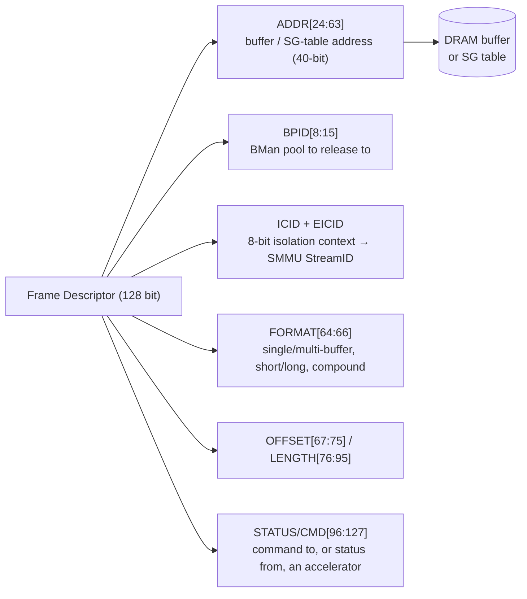
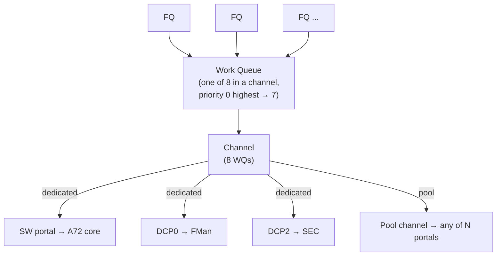
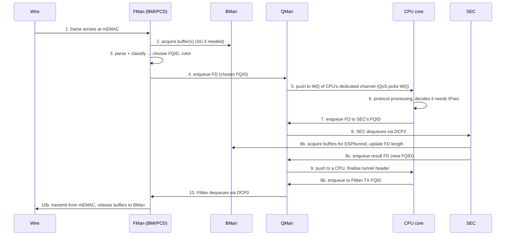

# DPAA1 Architecture — Programming Model, Frame Descriptor, Queues

**Source:** LS1046A DPAA Reference Manual (`LS1046ADPAARM` Rev 0, 2017) Ch.1–2; LS1046A RM Ch.14.
**Scope:** the conceptual anchor — read this before any datapath code.

The LS1046A DPAA1 moves frames between the 4× A72 cores, the Frame Manager (network I/O +
classification), the Security Engine (crypto), and the Buffer Manager, **with minimal CPU
involvement**. It does this by abstracting every hardware resource into **enqueue/dequeue
operations** on a single Queue Manager. Frame *data* never moves through a CPU register on the fast
path — only **Frame Descriptors** (FDs) do.

---

## 1. The programming model

- All accelerators (NICs, crypto) are abstracted into **enqueue/dequeue operations** on QMan. There
  is no per-device datapath driver — there is one QMan portal driver, and blocks talk through queues.
- A **network flow** is a series of packets sharing processing + ordering requirements. Software
  picks the granularity freely: a broad class (all TCP) or a single 5-tuple session (what ASK2 does).
- DPAA is **not all-or-nothing.** Legacy/software classification can coexist with hardware queueing;
  you can offload just the parts that pay off.
- Two offload categories:
  1. **Packet distribution & queue/congestion management** → BMan + QMan
  2. **Content-processing acceleration** → FMan (parse/classify/police), SEC (crypto)
- Operations are encoded as **architected messages** placed on queues; responses (including errors)
  return via the same queue structures.

### Core vocabulary (DPAA RM Table 1-2)

| Term | Meaning |
|---|---|
| **Buffer** | Contiguous memory region, software-allocated, **BMan**-managed |
| **Buffer pool** | Set of buffers with common size/alignment/access (BPID 0–63) |
| **Frame** | One buffer, or a scatter/gather list of buffers, holding packet data |
| **Frame Queue (FQ)** | FIFO of FDs — the fundamental scheduling unit in QMan |
| **Work Queue (WQ)** | FIFO of FQs — 8 per channel, priority 0 (highest) → 7 |
| **Channel** | A set of 8 WQs with hardware-prioritised access |
| **Dedicated channel** | Statically bound to **one** endpoint (a CPU, FMan, or SEC) — *push* model |
| **Pool channel** | Bound to a **group** of endpoints; any member may dequeue — *pull* / load-balance model |

---

## 2. The Frame Descriptor (FD) — 128 bits

The FD is the currency of the datapath. It is **128 bits** and does **not** hold frame data — it
points to where the data lives and carries out-of-band metadata. (DPAA RM §1.6, Fig 1-2, Table 1-6.)

| FD bits | Field | Notes |
|---|---|---|
| 0–1 | DD | Dynamic-debug marking (trace on enqueue/dequeue) |
| 2–7 / 18–19 | ICID / EICID | 8-bit Isolation Context ID = `{EICID[1:0], ICID[5:0]}` |
| 8–15 | BPID | BMan pool to release the buffer to |
| 24–63 | **ADDR** | 40-bit address of buffer or first scatter/gather table |
| 64–66 | FORMAT | frame-format code (below) |
| 67–75 | OFFSET | bytes from ADDR to first valid data (only when FORMAT=00x) |
| 76–95 | LENGTH | total valid bytes |
| 67–95 | CONGESTION WEIGHT | WRED weight for *compound* frames (overlaps OFFSET+LENGTH) |
| 96–127 | STATUS/CMD | out-of-band command (to accelerator) or status (from accelerator) |

### Frame formats (FORMAT[64:66])

| Code | Type | Reach | Has OFFSET? |
|---|---|---|---|
| 000 | Short, single-buffer, simple | ≤ 1 MB−1 | yes |
| 010 | Long, single-buffer, simple | ≤ 512 MB−1 | no (data at buffer base) |
| 100 | Short, multi-buffer (SG) | ≤ 1 MB−1 | yes |
| 110 | Long, multi-buffer (SG) | ≤ 512 MB−1 | no |
| 001 | Compound (e.g. crypto in+out pair) | — | uses CONGESTION WEIGHT |

**Accelerator format support (RM Table 1-10) — important constraint:**
- **FMan:** short/long single-buffer in+out; multi-buffer with **≤ 16 SG entries**; the SG *extension*
  (E) bit is **not** supported; **no compound frames.**
- **SEC:** all single- and multi-buffer formats; multi-buffer output limited to one buffer per SG
  entry; **supports compound frames** in and out.

### Scatter/Gather entry (128 bits each)

`ADDR[24:63]` + `E` (extension → points to another SG table) + `F` (final) + `LENGTH` + `BPID` +
`OFFSET`. Extension chains are **flat** (no SG trees). If `E=1` and `F=1`, E wins and F is ignored.
Buffer release stops at the F bit or total FD LENGTH — leave no orphaned entries beyond it.

---

## 3. Frame Queues, Work Queues, Channels

The scheduling hierarchy is **two-level**: many FQs feed 8 WQs, 8 WQs make a Channel, Channels are
serviced by portals.

- An **FQ** is a FIFO of FDs. New frames enqueue at the tail, dequeue from the head. Software creates
  FQs; QMan allocates a 64-byte **FQD** for each. Multiple producers may enqueue concurrently — QMan
  serialises atomically (no software locks).
- A **WQ** is a linked list of *FQDs*. When an FQ becomes eligible (XON + non-empty) it links to its
  destination WQ's tail.
- A **Channel** has exactly 8 WQs. WQ 0/1 are strict priority; WQ 2–4 and 5–7 are weighted
  interleaved round-robin tiers (see [`qman-ceetm.md`](qman-ceetm.md) for the scheduler detail).
- **Dedicated** channel → one endpoint (push). **Pool** channel → a group (any member pulls;
  load-balancing across CPUs).

Full FQ state machine, FQD layout, congestion, and order-restoration live in
[`qman-ceetm.md`](qman-ceetm.md).

---

## 4. ICID — isolation & the SMMU

The 8-bit **ICID** (`{EICID[1:0], ICID[5:0]}`) maps each IO transaction to an ARM **SMMU StreamID**
for access control. One hardware block can act on behalf of many requestors with the correct
permissions per transaction.

Critically: for **software portals**, QMan sets the ICID from *per-portal configuration* — software
**cannot inject an arbitrary ICID.** That is the hardware mechanism that stops a core from using an
accelerator to escalate DMA privilege. A block may also use *different* ICIDs for descriptor/context
accesses vs. frame-data accesses. (See the SMMU/ICID stream-isolation note in
[`soc-integration.md`](soc-integration.md); the DPAA RM errata clarifies QMan ICID programming.)

---

## 5. Packet walk-through — ingress to IPsec to egress

This is the canonical DPAA1 flow (RM §1.8). It shows why DPAA1 is "queues all the way down": each
arrow is an enqueue or dequeue.

**The ASK2 fast path collapses steps 4–9:** when the PCD classifies a flow directly to an egress FQ
(with inline NAT/TTL/checksum via `FORWARD_FQ_WITH_MANIP`, and optionally a SEC dequeue via DCP2),
the CPU is **bypassed entirely**. The CPU only sees the *first* packet of a flow (slow path), then
`ask.ko` programs a CC-table row so subsequent packets stay in silicon. That is the whole point of
the architecture — see [`fman-pcd.md`](fman-pcd.md).

---

## 6. Why this matters for ASK2

- The FD's **STATUS/CMD** and **compound-frame** semantics are how SEC results come back — relevant
  to `0001-caam-qi-share` and the xfrm packet-mode path.
- The **16-SG-entry / no-compound** FMan limit shapes how large frames and crypto pairs are handled.
- **ICID isolation** is why ASK2 doesn't (and can't) forge DMA contexts from software — it programs
  classification, and the silicon enforces the StreamID.
- The **enqueue/dequeue-everywhere** model is why ASK2 needs *no* new datapath driver: it reprograms
  the PCD's FQID selection and the CC action, and the existing QMan/BMan/FMan plumbing carries it.

---

*Next: [`fman.md`](fman.md) for the block that does steps 1–4 and 10, then
[`fman-pcd.md`](fman-pcd.md) for step 3 in full detail.*
