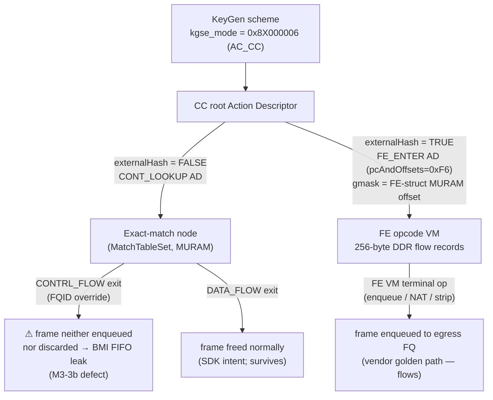

# FMan Frame-Engine (FE) Objects & External Hash — the M0 offload-init oracle

**Status:** M0 vendor-oracle deliverable (byte-level reference for DUAL-DATAPLANE M2/M3) · **Board:** NXP LS1046A — Mono Gateway DK · **FMan:** v3 / DPAA1, stock QEF **210.10.1** microcode · **Provenance:** the **allocation/structural** contract (§3–§5 MURAM/DDR sizes, the `FE_ENTER` AD encoding) is genuine NXP SDK source archived at [`mihakralj/kernel-ls1046a-build@464df181`](https://github.com/mihakralj/kernel-ls1046a-build) (`…/sdk_fman/Peripherals/FM/`) — the **lf-6.6.y** ASK-port mirror — cross-checked against on-hardware register/MURAM dumps (qdrant `iter-23/32/45/47`, `m0-vendor-oracle-reconciliation`). ⚠ **The FE-VM *programming* core is stubbed in that archive** (`FmPcdCcBuildFE` / `FmPcdCcBuildContextByFE` / `get_indexed_hash_bucket` — see the **Provenance caveat** below); the genuine complete implementation is the **lf-5.4 Layerscape SDK** ([`we-are-mono/ASK`](https://github.com/we-are-mono/ASK) `patches/kernel/999-layerscape-ask-kernel_linux_5_4_3_00_0.patch`). The shipping **`lf-6.12.49-2.2.0`** mono port (`002-mono-gateway-ask-kernel_linux_6_12.patch`) was checked and **also stubs both FE builders** (explicit `UNUSED()` no-ops) — it allocates and wires the FE pool but never programs it. Fork B (M2) extracts the datapath core from **lf-5.4**, not lf-6.12.y or the archive.

> **Why this doc exists.** [`specs/ask2-rewrite-spec.md`](../specs/ask2-rewrite-spec.md) §2.4(6) asserts the M0 verdict in prose — *"the 210 ucode parks frames only when the ehash/FE MURAM structures are missing; with those structures live, AC_CC dispatch flows."* This document is the **byte-level backing** for that claim: the exact MURAM/DDR init contract every ASK2 classify milestone (M2+) must reproduce, and the inverse it must undo (the §3.5 reversibility contract). It is the M0 *oracle* — DUAL-DATAPLANE M0 is satisfied by this static extraction, **not** by a live serial vendor-stack capture (which is MURAM-blocked and redundant — see §7).

> **⚠ Provenance caveat — three FE-VM functions are archive *stubs* (added 2026-06-16).** Reading the archived **lf-6.6.y** source directly confirms that the three functions which *program* (not merely *allocate*) the Frame-Engine datapath are no-op stubs there: **`FmPcdCcBuildFE`** (`fm_cc.c:8250`, `#if DPAA_VERSION>=11` — empty body, all params `UNUSED`, literal comment *"Stub — FE building for enhanced external hash not implemented"*), **`FmPcdCcBuildContextByFE`** (`fm_cc.c:8267` — `return E_OK` without action, *"returns success without action"*), and **`get_indexed_hash_bucket`** (`fm_ehash.c:43` — `static inline` returning bucket index `0`; the ask30 fix for an undefined-reference *link* error, since the real CRC-shift helper is out-of-tree in lf-6.12.y). So this archive **allocates** the FE/ehash structures (§3–§5 are genuine bodies) but never **arms the FE opcode VM**. The §1/§2/§5 prose that the FE VM *executes / enqueues / NATs / frees* is grounded in vendor *binary* behaviour (the 2026-06-13 parity run that flowed) plus the **lf-5.4 LSDK** working implementation — **not** in a working archive implementation. **Fork B's source-of-truth for the FE datapath *core* is the lf-5.4 Layerscape SDK** — [`we-are-mono/ASK`](https://github.com/we-are-mono/ASK), `patches/kernel/999-layerscape-ask-kernel_linux_5_4_3_00_0.patch` (target `…/sdk_fman/Peripherals/FM/Pcd/fm_cc.c`), where `FmPcdCcBuildFE` (999-patch L8883) and `FmPcdCcBuildContextByFE` (L8954) are complete real bodies and `get_indexed_hash_bucket` is the real CRC64 indexer (L7301). **The `lf-6.12.49-2.2.0` mono port `002-…` patch was checked and *also* stubs both FE builders** (explicit `UNUSED()` no-ops, *"FE building … not implemented"*) — its `FM_PCD_Init` allocates and wires the FE pool/singletons but calls the stub builder, so it allocates without programming; only lf-5.4 has the working FE-VM core. This lf-6.6.y archive is authoritative only for the MURAM/DDR allocation sizes and the `FE_ENTER` AD encoding (`FM_PCD_AD_FE_ENTER_ALLOCATE = 0x00800000`, opcode `0x000000F6`), both byte-real here. (qdrant `m0-vendor-oracle-fe-ehash-provenance`, `m1-fork-b-fe-ehash-provenance-lf5.4-source-found`.)

---

## 1. The one-paragraph verdict

On the shipping **210.10.1** microcode, a KeyGen scheme set to **AC_CC** (`kgse_mode = 0x8X000006`, next-engine = coarse-classification dispatch) reliably delivers a classified frame to its egress FQ **only when the Coarse-Classifier root Action Descriptor enters the FE (Frame-Engine) opcode VM** — i.e. the external-hash path (`pcAndOffsets = 0xF6` = `FE_ENTER`, root-AD `gmask` repurposed as the MURAM offset of an FE struct, 256-byte flow records in DDR executed by the FE VM, which performs the terminal enqueue / NAT / strip / insert / stats). A **bare exact-match** Coarse-Classifier node (`MatchTableSet`, `externalHash = FALSE`, no FE buffer) is a *real and SDK-supported* primitive, but on this ucode our static grafts of it **park** — the `CONTRL_FLOW` (FQID-override) exit walks the key then never frees the frame's BMI FIFO allocation, the 24 KB port RX FIFO fills at ~45 frames, BMI admission stalls, and the port goes deaf under traffic (the open **M3-3b CC-disposition defect**). The FE/ehash structures are therefore **not a deferrable scale option — they are the disposition mechanism** the exact-match path lacks. This doc captures their complete init contract.

---

## 2. Two CC dispatch paths — the disposition fork



| | **Path 2 — exact-match** | **Path 1 — external-hash / FE** |
|---|---|---|
| SDK entry | `MatchTableSet` (`fm_cc.c`) | `FM_PCD_HashTableSet` → `ExternalHashTableSet` (`fm_ehash.c`, `#ifdef USE_ENHANCED_EHASH`) |
| `externalHash` | `FALSE` (no assignment in `MatchTableSet` path) | `TRUE` |
| Root AD | `CONT_LOOKUP` (`FillAdOfTypeContLookup`, `fm_cc.c:364`) | `FE_ENTER` — `pcAndOffsets=0xF6`, `gmask`=FE-struct MURAM offset, sets `FM_PCD_AD_FE_ENTER_ALLOCATE` |
| FE buffer | **none** (FE_ENTER_ALLOCATE never set) | **required** (`FmPortSetFESupport` per port + `AllocFEObjs` pool) |
| Match store | CC table + 16-byte ADs in **MURAM** | bucket array in **DDR** (`XX_MallocSmart`), AD node + global mem in MURAM |
| Terminal disposition | exit NIA only — **`CONTRL_FLOW` does not free the FIFO** | FE opcode VM does enqueue/NAT/free |
| On 210.10.1 | grafts **park** at ~45 frames (M3-3b) | **flows** (vendor parity run, 2026-06-13) |
| MURAM cardinality | O(flows) — the ~750-flow ceiling ([`muram.md`](muram.md)) | O(1) MURAM + O(buckets) **DDR** |

**Unifying theory (grounded, qdrant `iter-23`/`iter-45`/`m0-reconciliation`):** terminal frame disposition for a classified frame on 210.10.1 is performed by the **FE opcode VM**, which exists only on the external-hash path. `DATA_FLOW` exits free the BMI FIFO allocation; `CONTRL_FLOW` (FQID-override) exits do not. Exact-match-without-FE that exits via `CONTRL_FLOW` therefore leaks the FIFO. This is the single coherent explanation that reconciles "the SDK runs exact-match CC without an FE buffer" (true — via a `DATA_FLOW` exit) with "our exact-match graft parks" (true — our FQID-override graft is a `CONTRL_FLOW` exit).

---

## 3. The FE-object MURAM pool (`AllocFEObjs`, global, per-PCD)

`AllocFEObjs()` — `Pcd/fm_pcd.c:433`, compiled only for `DPAA_VERSION >= 11` (always on LS1046A). Run once at `FM_PCD_Init`:

```c
for (i = 0; i < 100; i++) {                       /* a fixed pool of 100 FE objects */
    p_FeObj = XX_Malloc(sizeof(t_FmPcdFEObj));    /* host control struct (DDR) */
    memset(p_FeObj, 0, sizeof(t_FmPcdFEObj));
    p_FeObj->h_FE = FM_MURAM_AllocMem(h_FmMuram,
                        FM_PCD_FE_MAX_SIZE,        /* = 28 B (see constants) */
                        FM_PCD_FE_ALIGN);          /* = 8  */
    memset(p_FeObj->h_FE, 0, FM_PCD_FE_MAX_SIZE);
    EnqueueFEObj(p_FmPcd, &p_FmPcd->feInfo.availableFeLst, p_FeObj);
}
```

- **MURAM cost: 100 × `FM_PCD_FE_MAX_SIZE` (28 B) = 2 800 B**, 8-byte aligned, reserved at PCD init whenever FE support is compiled. Bounded, one-time.
- List-managed: `feInfo.availableFeLst` (free) / `feInfo.enqLst` (in-use). `FM_PCD_FE_OBJ(node)` maps a list node back to its `t_FmPcdFEObj`. `DequeueFEObj`/`EnqueueFEObj` move objects under `p_FmPcd->h_Spinlock`.
- **Inverse:** `ReleaseFEsList()` (`fm_pcd.c:385`) drains both lists, `FM_MURAM_FreeMem(h_FE)` + `XX_Free` each.
- **⚠ Allocation ≠ programming.** `AllocFEObjs` only *reserves* the 100-object pool; each object is *configured* by **`FmPcdCcBuildFE`**, which is a **no-op stub in this lf-6.6.y archive** *and* in the lf-6.12.49 mono port (Provenance caveat). The real per-FE configuration (`FmPcdCcBuildFE`, lf-5.4 999-patch L8883) must be lifted from the **lf-5.4 LSDK** (`we-are-mono/ASK` `999-…patch`).

### FE-type sizes (`inc/fm_common.h`, `DPAA_VERSION >= 11`)

| Constant | Value | Note |
|---|---|---|
| `FM_PCD_FE_ALIGN` | `8` | MURAM alignment of every FE object |
| `FM_PCD_FE_T_EXT_HASH_SIZE` | `4*7 = 28` | external-hash FE record |
| `FM_PCD_FE_T_HM_SIZE` | `4*4 = 16` | header-manip FE |
| `FM_PCD_FE_T_ENQ_SIZE` | `4*4 = 16` | enqueue FE |
| `FM_PCD_FE_T_TRANSITION_SIZE` | `4*2 = 8` | TRANSITION-FE singleton |
| `FM_PCD_FE_T_EXIT_SIZE` | `4*1 = 4` | EXIT-FE singleton |
| **`FM_PCD_FE_MAX_SIZE`** | **= `FM_PCD_FE_T_EXT_HASH_SIZE` = 28** | every pooled object sized to the max (ext-hash) |

> **KASAN gotcha (archived patch 110/094).** `memset`/`memcpy` on `p_FeObj->h_FE` faults under `CONFIG_KASAN_GENERIC=y` — `h_FE` is iomem (`FM_MURAM_AllocMem` → `devm_ioremap`) with no KASAN shadow → boot panic in `FM_PCD_Init → AllocFEObjs`. The SDK fix replaces the `memset` with `IOMemSet32` and scopes `KASAN_SANITIZE := n` on `sdk_fman`/`sdk_dpaa`/`fsl_qbman`. Mainline M2 must use `memset_io`/`__iowrite32_copy` for any MURAM clear.

---

## 4. Per-port FE support (`FmPortSetFESupport`, the params-page +0x54/+0x58 writes)

`FmPortSetFESupport()` — `Port/fm_port.c:2223`, `DPAA_VERSION >= 11`. Triggered from `CcUpdateParam` (`fm_cc.c:1138`, the **active** branch under `#ifndef USE_ENHANCED_EHASH`, line 1196) **iff `p_CcNode->externalHash`**. Idempotent per port (`if (p_FmPort->supportFE) return E_OK`).

```c
totalNumOfTnums = p_FmPort->tasks.num + p_FmPort->tasks.extra;

/* (a) per-port FE internal buffer pool — MURAM */
p_FmPort->internalFEBufferPoolAddr =
    FM_MURAM_AllocMem(h_FmMuram, totalNumOfTnums * BMI_FIFO_UNITS * 2, BMI_FIFO_UNITS);
IOMemSet32(internalFEBufferPoolAddr, 0, totalNumOfTnums * BMI_FIFO_UNITS * 2);

/* (b) management free-list index — MURAM */
p_FmPort->internalFEBufferPoolManagementIndexAddr =
    FM_MURAM_AllocMem(h_FmMuram, 5 + totalNumOfTnums, 4);
*(u32*)p = MURAM_offset_of(internalFEBufferPoolAddr);  /* = VirtToPhys - fmMuramPhysBaseAddr */
p[0] = 4;                                               /* pool-management index init */
for (i = 0; i < totalNumOfTnums; i++) p[4+i] = i;       /* free-list 0..N-1 */
p[4+totalNumOfTnums] = 0xFF;                            /* terminator */

/* (c) ctrl-params page (FM_CTL) writes — the M0 params-page FE words */
WRITE_UINT32(p_ParamsPage->internalFEBufferDepletionCounter, 0);              /* +0x58 */
WRITE_UINT32(p_ParamsPage->internalFEBufferManagementIndexAddr,              /* +0x54 */
             MURAM_offset_of(internalFEBufferPoolManagementIndexAddr));
p_FmPort->supportFE = TRUE;
```

- `BMI_FIFO_UNITS = 0x100` (256 B). **MURAM cost (a)** = `totalNumOfTnums × 256 × 2` per port (a port with ~8–16 TNUMs ⇒ ~4–8 KB); **(b)** = `5 + totalNumOfTnums` bytes. Both freed by the inverse.
- The ctrl-params page is the **FM_CTL `t_FmPcdCtrlParamsPage`** (256 B) addressed via `FMBM_RGPR` / `e_FM_PORT_GPR_MURAM_PAGE`. On mainline it is allocated once per port by board patch **`0116 fman_pcd_port_ensure_params_page`** (the verified one-time 256 B MURAM scaffold the M1 soak identified — qdrant `M1-item4`).

### Byte-exact `t_FmPcdCtrlParamsPage` (`inc/fm_common.h:182`, packed, **256 B**)

| Offset | Field | Note |
|---|---|---|
| `0x00` | `reserved0[16]` | |
| `0x10` | `iprIpv4Nia` | IP-reassembly v4 NIA |
| `0x14` | `iprIpv6Nia` | IP-reassembly v6 NIA |
| `0x18` | `reserved1[24]` | (iter-32 only inspected +0x28/+0x2c here) |
| `0x30` | `ipfOptionsCounter` | |
| `0x34` | `reserved2[12]` | |
| `0x40` | **`misc`** | `FM_CTL_PARAMS_PAGE_ALWAYS_ON = 0x100`; `OFFLOAD_SUPPORT_EN = 0x40000000` |
| `0x44` | `errorsDiscardMask` | `FMBM_RFSDM|RFSEM = 0x012ee0e8` |
| `0x48` | `discardMask` | |
| `0x4C` | `reserved3[4]` | |
| `0x50` | `postBmiFetchNia` | |
| **`0x54`** | **`internalFEBufferManagementIndexAddr`** | MURAM offset of the per-port mgmt free-list |
| **`0x58`** | **`internalFEBufferDepletionCounter`** | reset to 0 on enable |
| `0x5C` | `reserved4[164]` | pad to 256 B |

> Confirmed on hardware (qdrant `iter-32`): the install path already populates `+0x40 = 0x00000100` and `+0x44 = 0x012ee0e8` before any experiment writes — i.e. board `0116` already satisfies the params-page contract. iter-32 **disproved** params-page *contents* as the M3-3b cause; the missing piece is the FE *VM*, not the page words.

### Inverse — `FmPortDeleteFESupport` (`fm_port.c:2282`)

`supportFE = FALSE` → `WRITE_UINT32(p_ParamsPage->internalFEBufferManagementIndexAddr, 0)` → `FM_MURAM_FreeMem` both pool + mgmt addrs. **This is the §3.5 reversibility inverse** M2 must land in the same patch as the forward writes.

---

## 5. External hash tables (`ExternalHashTableSet`, the FE flow store)

`ExternalHashTableSet()` — `Pcd/fm_ehash.c:756`, active when `USE_ENHANCED_EHASH=1` (`fm_pcd_ext.h:51`). `FM_PCD_HashTableSet` redirects here; this path **bypasses** `IcHashIndexedCheckParams`, `FM_PCD_MatchTableSet`, and **MURAM table allocation entirely** — the bucket array lives in **DDR**:

```c
info->tablesize = sizeof(en_exthash_bucket) << (64 - num_of_zeroes);
info->table_base = XX_MallocSmart(info->tablesize, 0, EN_EXTHASH_TBL_ALIGNMENT);  /* DDR */
memset(info->table_base, 0, info->tablesize);
...
node = &info->node;
info->h_Ad = &info->node;                  /* ASK41 fix: was NULL → oops in ModifyMissNextEngine (offset 24) */
node->key_size       = info->keysize;
node->hash_mask_bits = ii;                 /* (mask+1) must be 2^ii, mask <= 0x7fff */
node->int_buf_pool_addr = p_FmPcd->InternalBufMgmtMuramArea;
node->global_mem_offset = EN_INTERNAL_BUFF_POOL_SIZE >> 8;
if (!en_global_muram_mem)                   /* singleton, once per PCD */
    en_global_muram_mem = (en_exthash_global_mem *)
        ((u8*)p_FmPcd->pIntMuramPtr + EN_INTERNAL_BUFF_POOL_SIZE);   /* MURAM */
tblphysaddr        = XX_VirtToPhys(info->table_base);
node->table_base_hi = (tblphysaddr >> 32) & 0xffff;
node->table_base_lo =  tblphysaddr & 0xffffffff;
```

- **DDR** (`XX_MallocSmart`): the bucket array `sizeof(en_exthash_bucket) × (mask+1)`, `mask ≤ 0x7fff` and `(mask+1)` an exact power of two (valid: `0x1,0x3,0x7,0xf,…,0x7fff`; `0xf0` is **invalid**). `en_exthash_bucket` = `{u64 hash; u64 pad}` = **16 B** (two `u64`). *(An earlier draft labelled this "8 B"; the genuine lf-6.6.y `fm_ehash.h` (`en_exthash_bucket = {u64 hash; u64 pad}`) and the lf-5.4 transcription source are **both 16 B** — now confirmed against vendor source. The mainline `0125` increment uses 16 B (`FMAN_EHASH_BUCKET_SIZE`). The bucket *stride* is therefore settled; only its on-silicon interpretation under 210.10.1 dispatch stays HW-dump-gated, harmless/reversible for the dormant increment; see §8.6 item 6.)*
- **MURAM**: the AD `node` (`en_exthash_node`, holds `table_base_hi/lo`, `key_size`, `hash_mask_bits`, `int_buf_pool_addr`, `global_mem_offset`) + the `en_global_muram_mem` singleton at `pIntMuramPtr + EN_INTERNAL_BUFF_POOL_SIZE`.
- Runtime inserts: `ExternalHashTableAddKey()` writes 5-tuple flow records (256-byte external records) into the DDR buckets; matching packets bypass the CPU via FE-VM steering. *(Mainline **`0128`** — FE-VM increment 3 — reproduces this: the lf-5.4 `get_indexed_hash_bucket` CRC64 bucket indexer (reflected/LSB-first CRC64 transcribed verbatim from the genuine NXP `crc64.h` — reflected ECMA-182 poly `0xC96C5795D7870F42`, seed `~0ULL`; byte-granular `(6-shift)` right-shift + mask) + the simple `ExternalHashTableAddKey` head-insert. Per flow: CRC64 the key → bucket index → `kzalloc(256)` DDR record → `en_ehash_entry` header (`flags` BE16@0, `next_entry_hi` BE16@2 + `next_entry_lo` BE32@4 = the previous bucket head, chaining the collision list) → key@8 → next-FE pointer (the `0127` ENQ FE MURAM offset) after the 8-byte-aligned key → head-insert `bucket->h = swab64(phys(record))`. New debugfs `fe_flow` (`add <tbl_idx> <key_hex> [enq_fe_off_hex]` / `clear`). Records + buckets are **DDR** (§6/invariant 3), so gen_pool `used` is unchanged — the reversibility signal is (a) every record freed, (b) every bucket head restored byte-exactly; the inverse drains **LIFO** (head-add + head-first walk = reverse insert order) so each bucket head reverts to its exact pre-insert value. Ships **DORMANT** — nothing dispatches into the store until the `0127` `FE_ENTER` root-AD is wired to a live KeyGen→AC_CC scheme on a port and a real key/FQID is programmed. §8.6 item-6 residue: the CRC64 **core is now confirmed** — its polynomial+seed were transcribed verbatim from the genuine NXP `crc64.h` (reflected ECMA-182, poly `0xC96C5795D7870F42`, seed `0xFFFFFFFFFFFFFFFF`), and a standalone proof shows the bit-serial form regenerates `crc64.h`'s 256-entry table **and** matches its table-driven `crc64_compute` byte-for-byte over all keys; what remains **confirm-against-210.10.1-HW-dump-before-arming** is only (a) the byte-select `(6-shift)`+mask (the EHASH `get_indexed_hash_bucket` *body* is stubbed in lf-6.6.y, genuine only in the inaccessible lf-5.4 999-patch) and (b) the `kzalloc` → `dma_alloc_coherent` switch — neither affects dormant reversibility.)*
- **⚠ The bucket indexer and FE-context builder are archive stubs.** `get_indexed_hash_bucket` (`fm_ehash.c:43`, returns bucket `0`) and `FmPcdCcBuildContextByFE` (`fm_cc.c:8267`, `return E_OK` no-op) are **not implemented** in lf-6.6.y; the working CRC64 indexer (`get_indexed_hash_bucket`, real in **lf-5.4** 999-patch L7301 and in lf-6.12.49) + FE-context population (`FmPcdCcBuildContextByFE`, real **only in lf-5.4** 999-patch L8954 — *stubbed* in lf-6.12.49) live in the **lf-5.4 LSDK** (`we-are-mono/ASK` `999-…patch`). `ExternalHashTableSet` above (the DDR/MURAM *allocation*) is genuine archive source, but a flow inserted here will **not steer** until the lf-5.4 FE-VM glue is reproduced.

### Byte-exact `t_ExtHashFe` — the FE the `FE_ENTER` AD dispatches into (mainline `0131`)

The §3 FE pool holds 28-byte slots because the largest FE record is the **external-hash Flow-Entry**, `t_ExtHashFe` (genuine lf-5.4 `USE_ENHANCED_EHASH` `FmPcdExternalHashTableSet` builder, 999-patch L10318/L9005). This is the object the `0127` `FE_ENTER` root AD's `gmask` actually points at; it performs the HW hash lookup over the §5 DDR bucket array and branches HIT → MUX singleton / MISS → Exit singleton. Its 7 big-endian words (mainline `fman_pcd_fe_hash_encode`, board patch **`0131`**):

| word | offset | contents (dormant value) |
|------|--------|--------------------------|
| `w0 misc`        | `@0`  | `FMAN_FE_TYPE_EXT_HASH (0x06000000)` \| `contextOffsetInWS(0)` [\| aging `0x00020000` \| stats `0x00010000`]. Dormant → **`0x06000000`** |
| `w1`             | `@4`  | `(hashMask<<16)` \| `((contextSize-1)<<8)` \| `hashShift`. `contextSize=256`→`0xff`; for the gate (mask `0xff`, shift `0`) → **`0x00ffff00`** |
| `w2`             | `@8`  | high-16 of `phys(bucket table)` [\| `LIODN<<shift`, armed only]. Dormant LIODN=0 → table_dma hi |
| `w3`             | `@12` | low-32 of `phys(bucket table)` = `table_dma` lo (e.g. `0xfa403000`) |
| `w4 missResult`  | `@16` | miss-result context MURAM offset. **Dormant → 0** (arming-time field; no frame dispatches) |
| `w5 nextFEPtr`   | `@20` | **HIT** link = MURAM offset of the MUX singleton (`pcd->fe_mux_off`) |
| `w6 missNextFE`  | `@24` | **MISS** link = MURAM offset of the Exit singleton (`pcd->fe_exit_off`) |

**Critical address-space split:** the table pointer (`w2`/`w3`) is a **full DDR bus address** (`table_dma`, from `0130`'s `dma_alloc_coherent`), because the FE VM DMA-reads the bucket array from DDR; `nextFEPtr`/`missNextFEPtr` (`w5`/`w6`) are **MURAM offsets** (gen_pool offsets, the SDK `phys(FE) - physicalMuramBase` convention). The `0125` `en_exthash_node` is the table/int-buf **substrate** feeding `t_ExtHashFe`'s `w2`/`w3` (table addr), `w1` hashMask/hashShift — it is **not** itself the FE object. `0131` also repoints `fman_pcd_fe_enter_build`'s default `gmask` to prefer `pcd->fe_hash_off` (the `t_ExtHashFe`) once built, falling back to the MUX singleton (the `0127` default, kept so the bare-chain gate still works). Ships **DORMANT**: assembled + byte-verifiable via the `fe_hashfe` debugfs readback against this table while the port is quiescent (§8.6 item 6), but nothing dispatches into it until the M2 arm (D9-B) switches the KeyGen scheme to AC_CC and points the BMI CC root at the `FE_ENTER` AD. `w4` and the `w2` LIODN are arming-time fields, left zero.

---

## 6. MURAM / DDR budget & the vendor over-provisioning anti-pattern

| Allocation | Where | Size | Lifetime |
|---|---|---|---|
| FE-object pool (`AllocFEObjs`) | MURAM | 100 × 28 B = **2 800 B** | per-PCD, one-time |
| Per-port FE buffers (`FmPortSetFESupport` a) | MURAM | `tnums × 256 × 2` (~4–8 KB/port) | per engaged port |
| Per-port FE mgmt index (b) | MURAM | `5 + tnums` B | per engaged port |
| FM_CTL params page (`0116`) | MURAM | 256 B | per port, reused forever |
| ehash global mem | MURAM | `en_exthash_global_mem` singleton | per-PCD |
| ehash bucket arrays | **DDR** | `16 × (mask+1)` per table | per table |

**The wall the vendor hit — and how to avoid it.** The vendor `/etc/cdx_pcd.xml` asked for 16 classifications × `max=512` keys × `statistics=byteframe` + **18 hash tables tagged `external='yes' aging='yes'`**. On-target `fmc` **silently drops** the `external`/`aging` attributes (warns *"Unknown attribute"*), so every hash table falls back to an **internal MURAM** `MatchTableSet` build → `fm_cc.c:4377 AllocStatsObjs Memory Allocation Failed` → `MatchTableSet` → `FM_PCD_HashTableSet` NULL → `dpa_app rc=65280` — the **same 384 KiB MURAM-exhaustion wall as ASK 1.x** (`327×-ENOMEM`). The DDR sizes above (`4× mask=0x7fff = 512 KB each = ~2 MB`, well within 2 GB) are harmless **only when `external='yes'` is honored**. Mainline M2 avoids the wall by (i) bounded cardinality (next-hop-deduped manip, ~750-flow MURAM ceiling — [`muram.md`](muram.md)), and (ii) if it adopts the ehash path, building the DDR buckets **directly via `XX_MallocSmart`-equivalent (`kmalloc`/`dma`)**, never letting them fall to MURAM.

---

## 7. Why M0 is static-extraction, not a live capture

A live serial vendor-stack FE/ehash capture is **blocked and redundant** (qdrant `m0-vendor-oracle-reconciliation`, 2026-06-15):

1. **MURAM-blocked.** The resurrected vendor stack cannot complete the FE/ehash build either — lxc200 `ask-activate.sh` **Phase 4 (dpa_app/FMC PCD programming) is SKIPPED** with the in-script note *"FM_PCD_CcRootBuild() blocks inside the kernel FMan PCD ioctl handler"*; it hits the §6 wall. The only "12 AC_CC schemes captured" success ([`files/verification-matrix.md` §G](../specs)) was the **minimal KG-only** PCD, not the full FE/ehash build. Observing the full build live would first require *trimming* `cdx_pcd.xml` to one small table — i.e. partly solving the problem to watch it.
2. **Statically available — for the *allocation* contract.** The MURAM/DDR allocation contract in §3–§5 is genuine lf-6.6.y archive source — no hardware needed. ⚠ But the FE-VM *programming* core (`FmPcdCcBuildFE` / `FmPcdCcBuildContextByFE` / `get_indexed_hash_bucket`) is **stubbed** in that archive (Provenance caveat) and must be extracted from the **lf-5.4 LSDK** (`we-are-mono/ASK` `999-…patch`) for Fork B — the lf-6.12.49 mono port also stubs the two FE builders. Combined with the captured KG schemes (§G), the m33b CC-root/AD/match-table cross-audit, and the iter-31 `AttachPCD` contract (`RCMNE=0x2C`, `RFENE`, params-page via `FMBM_RGPR`), this **is** the complete M0 *allocation* oracle; the lf-5.4 datapath-core extraction is an M2 prerequisite.

The live minimal-config capture is reserved as a fallback only if an M2 ambiguity the source cannot resolve appears.

---

## 8. What M2 must do with this oracle (decision criterion)

The dpaa1 board substrate today steers via **Path 2** (exact-match: `0098` static CC install + `0108` per-key FQ enqueue-AD + `0106` KGSE→AC_CC). Its 100× S0↔S1 soak passed **control-plane-only** (no traffic) precisely because traffic triggers the Path-2 stall (M3-3b).

### 8.1 What the M3-3b stall is — and is *not*

Three findings bound the stall; a fourth (the iter-42 disassembly) corrects an earlier over-reach; a fifth (iter-49/50) settles it:

1. **iter-28/30 — defect is *upstream* of the AD action.** Per-port disposition accounting (`FMQM_PnETFC`, `RFDC`) proved that with executing 210.10.1 ucode, **all three** result-AD actions (FM_CTL-enqueue `0x02000028`, BMI-direct `0x00500002`, BMI-discard `0x005000C1`) are abandoned — nothing enqueues *and* nothing discards. No exit-NIA/AD-action tweak can matter because the CC dispatch never reaches AD execution.
2. **iter-33 (2026-06-12 breakthrough) — it is a first-frame *port stall*, not a per-frame FIFO leak.** Exception capture (`ccexp32.py`, no differential writes) caught `FMFP_PS` for port `0x10` transitioning `0x80000000 → 0x80800000` (**STL** bit8) on the *first* dispatched frame, with the parked FM_CTL task `ts[4]=0x81000000` (**PRK**). All event registers (FPM EPI/FCEV/EE, BMI IEVR, QMI EIE) stayed silent. The ~47-frame "freeze boundary" of iters 5–24 was just passive BMI-FIFO intake on an already-stalled port — the leak model was an artifact, not the cause.
3. **iter-42 (2026-06-12, full disassembly) — the AC_CC handler reads NO missing driver global; the stall is a runtime *arming* gap.** Disassembling the proprietary 210.10.1 AC_CC handler (vector-table entry word `0x630`) showed it reads **only the per-task context page** (`0xd0xx`: d018, d00c, d024, d014, d098, d09c, d01c) for **every** branch decision and key extraction — there is **no load from any global/absolute config address** a mainline driver could fail to initialize. PRE_CC (which populates the context page AC_CC reads) is **near-instruction-identical** between the open-source `106` and the proprietary `210` ucodes. So the park is **not** a missing driver-set global and **not** a ucode-build defect — it is a **hardware resource / dispatch wait**: a controller-arming register write the SDK performs at FMan/PCD-enable that mainline `fman.c` + our patches skip ("**Option B**").
4. **2026-06-13 — the vendor uses FE/ehash, but that does NOT make classic exact-match *impossible*.** The vendor stack (we-are-mono/ASK, `nxp-qoriq/linux lf-6.12.49-2.2.0`) force-defines `USE_ENHANCED_EHASH=1` and routes production traffic through the **`FE_ENTER` external-hash dispatch** (root AD `pcAndOffsets=0xF6`), which *does* dereference FE global structures (FE object pool, 32 KB internal FE buffer pool, MUX/TRANSITION-FE singletons). **But `FE_ENTER` is a *different* handler entry than `AC_CC` (action code `0x06`)** — and iter-42 (#3) proves the `AC_CC` handler we drive reads no FE globals. The vendor chose FE/ehash for **features** (scale, NAT, fragmentation, byte/frame statistics), not because exact-match cannot dispatch. **The earlier verdict *"classic exact-match CC can never work on this ucode"* was an over-reach** — it conflated the `FE_ENTER` path's FE-global dependency with the `AC_CC` path — and is **retracted here.**
5. **iter-49/50 (2026-06-16) — the arming hypothesis (#3) is REFUTED; the stall is a fault-free dispatch WAIT.** Two decisive experiments closed the Option-B arming theory. iter-49 (`ccexp47_rfne.py`) tested the strongest untested arming lead — the SDK `rfne`-last detach/re-arm discipline — byte-perfectly, and the port still stalled identically (§8.2). iter-50 (`ccexp48_faultcap.py`, the never-done fault-capture) then forced a true AC_CC stall and, at the instant `FMFP_PS[0x10]=0x80800000`, snapshotted **every** FMan DMA + FPM fault register: `fmdmsr=0` (no BUS/READ/WRITE-ECC, no faulting address), `fm_epi=0`, `fmfp_ee` unchanged (no ECC/STALL event), `fcev=0`, `cee=0`, `fm_cld=0`, `decceh=0` — **not one fault latched**, identical at STALL+1s. A *missing controller-arming write* would leave a resource/event signature; the **positive absence of any fault** proves the walk does not error — it reaches a point with **no terminal disposition** and simply WAITs. There is no arming step to find. qdrant `m3-3b-iter50-faultcap-verdict-d-fork-a-dead`.

**Net (resolved 2026-06-16):** findings #3/#4 framed the stall as a possible *arming gap* and declined to call exact-match impossible. iter-49/50 (#5) close that question: the stall carries **zero hardware fault**, so it is **not** a missing arming write — it is the absence of a terminal BMI-FIFO disposition, exactly as §1 predicts for bare `CONTRL_FLOW` without the FE VM. **Classic exact-match (Fork A) is dead on 210.10.1**; the path forward is Fork B (§8.3).

### 8.2 Option B — controller-arming enumeration (EXHAUSTED & REFUTED 2026-06-16)

> **Resolution (iter-49, image `2026.06.15-0222`).** The strongest untested lead — the SDK **`rfne`-last detach/re-arm discipline** — was tested byte-perfectly: a true AC_CC scheme[3] (`mode=0x80000006`) was forced on eth3 wrapped in the full bracket (save `fmbm_rfne`=`0x00440000` → detach `=0x00500002` → reprogram scheme → **re-arm `rfne` last** `=0x00440000`), every readback confirmed. Result: **still `FMFP_PS[STL]=0x80800000` at rfrc=+2**, byte-identical to the unbracketed baseline — sequencing is **not** the cause. With gmask/exit-NIA/leaf-AD/extraction/RCMNE/params-page/ucode all previously exonerated, **classic exact-match (Fork A) is dead on 210.10.1**; this confirms §1's verdict (bare AC_CC `CONTRL_FLOW` has no terminal BMI-FIFO disposition without the FE VM). **The active path is Fork B (§8.3).** qdrant `m3-3b-option-b-rfne-last-REFUTED-forkB-decision`.
>
> **Decisive confirmation (iter-50, 2026-06-16, same image).** The never-done **fault-capture** (`ccexp48_faultcap.py`) forced a true AC_CC stall and, at the instant `FMFP_PS[0x10]=0x80800000`, snapshotted **every** FMan DMA + FPM fault register: all clean (`fmdmsr=0` — no BUS/READ/WRITE-ECC, no faulting address; `fm_epi=0`; `fmfp_ee` unchanged — no ECC/STALL event; `fcev=0`; `cee=0`; `fm_cld=0`; `decceh=0`), identical at STALL+1s. A missing arming write would leave a resource/event signature; the **positive absence of any fault** proves the walk does not error — it reaches a point with **no terminal disposition** and WAITs. This is the positive-evidence close of Option B (vs. iter-49's negative result). qdrant `m3-3b-iter50-faultcap-verdict-d-fork-a-dead`.
>
> The enumeration below is retained as the record of what was ruled out.

`LoadFmanCtrlCode` (microcode load + `IRAM_READY` handshake) is **already replicated** by patch **`0117`** (GATE-1 HW pass: *"FM_CTL microcode 210.10.1 loaded (12851 words)"*, verify clean). The port-side `AttachPCD` NIAs were each replicated **and individually disproven** as the fix: `RCMNE=0x2C` (iter-31), params-page contents (iter-32, page already populated by `0116`), `RFPNE` CC_EN already set (iter-36). **The unexhausted residue is the controller-level *enable* arming** — the `FmEnable` / `FmPcdEnable` / `FmPcdCcEnable` register writes (FMan-controller go/event/poll, PCD master-enable, CC-engine enable) that mainline `fman.c` performs differently or omits. This is the iter-42-endorsed next step and was never executed.

**De-risk (cheap; first half needs no board):** SDK source archaeology of `FmEnable` / `FmPcdEnable` / `FmPcdCcEnable` (`sdk_fman fm.c`, `fm_pcd.c`, `fm_cc.c` in the archived `mihakralj/kernel-ls1046a-build@464df181`) vs mainline `fman.c` + patches `0115`/`0116`/`0117`, enumerating the controller-arming register-write delta. Then `/dev/mem`-replay each candidate **one mutation per boot** on eth3 against the `0107 cc_test` install, watching `FMFP_PS[STL]` (the iter-33 method). If a write clears the first-frame stall → Option B is the fix and the **already-coded** classic exact-match (`0098/0108/0115`) flows. If the delta is empty or no write clears the stall → escalate to Fork B.

### 8.3 The larger alternative — Fork B (reproduce vendor FE/ehash)

**Option B is exhausted (§8.2) — Fork B is now the active M2 path.** Adopt the vendor's proven production datapath: external-hash + FE opcode VM (this doc §3–§5). It is **proven to flow** on 210.10.1 (vendor stack) but is large (~1700 LOC: FE pool + singletons + `FE_ENTER` AD + per-port `FmPortSetFESupport` + DDR buckets + opcode-VM entries + `PORT_ID` in EKFC) with **high MURAM risk** (§6) — buckets must live in **DDR** to avoid the vendor 327×-ENOMEM wall. **⚠ Source-of-truth caveat:** the §3–§5 *allocation* skeleton is genuine in the lf-6.6.y archive, but the FE-VM *programming* core (`FmPcdCcBuildFE`, `FmPcdCcBuildContextByFE`, `get_indexed_hash_bucket`) is **stubbed** there (Provenance caveat) — Fork B must lift those three from the **lf-5.4 LSDK** (`we-are-mono/ASK` `999-…patch`; the lf-6.12.49 mono port *also* stubs the two FE builders, so it is **not** a usable source). Fork B is the eventual M2/M3 substrate for full features (NAT/frag/stats) regardless.

### 8.4 Ruled out — the `106.4.18` ucode swap

Swapping to the open-source `106.4.18` ucode to "get classic exact-match" is **uninformative** and is **not** an experiment to run:

- **iter-42:** the `106` and `210` AC_CC/PRE_CC handlers are the **same code shape**, so `106` would park identically — swapping the ucode cannot localize an *arming* bug.
- **ccexp12 (2026-06-11):** empirically confirmed `106` parks **identically** to `210`.
- It would also require lifting the `0086a` caps gate (which returns `0` for `106`) for **no** diagnostic gain.

*(This retracts the prior §8.2 "Fork C / one-boot 106-swap de-risk" recommendation, which iter-42 rules out.)*

### 8.5 Common to whichever path

Board patch **`0118` (CCBS-as-pointer) is a placebo and must be deleted** — it silently *bypasses* classification rather than enabling it (spec §2.4(6c)); the vendor's own `#if 0`'d "BMR bypass" experiment in `fm_kg.c` is the same encoding they tried and abandoned (qdrant 2026-06-13 item 10). The forward writes and their inverses must land **in the same patch** (the §3.5 reversibility contract), each verified by `pcd-snapshot` diff against the warm-S0′ baseline.

### 8.6 Defensive-coding contract for Fork B implementation

Every Fork B patch (§3 pool → §4 `FmPortSetFESupport` → §5 `ExternalHashTableSet` → FE-VM core) **MUST** observe these invariants. The decisive reason is iter-50: the M3-3b stall latches **no hardware fault** (`fmdmsr=0`, `fmfp_ee` unchanged, every fault register clean). A mistake in FE programming therefore produces a silent WAIT that is **invisible to traffic tests** — only this discipline catches it.

1. **MURAM is iomem, never RAM.** Access FE objects, AD nodes, ehash global mem, and the params page with `memset_io` / `memcpy_toio` / `writel` / `readl` **only** — never plain `memset` / `memcpy` / `->field =` (faults under KASAN; otherwise silently corrupts the AD). `gen_pool` does **not** zero on alloc, so every `fman_pcd_muram_alloc` is immediately followed by `memset_io(p, 0, size)` (the `0122` scaffold establishes this pattern).
2. **Bounds-check before every alloc; unwind cleanly on failure.** Call `gen_pool_avail()` before each MURAM reservation; on any failure, free **all** prior allocations of that operation (no partial-alloc leak), return `-ENOMEM`, and fall back to the SW path — **never half-program silicon**. This is the direct guard against the vendor 327×-`ENOMEM` wall.
3. **ehash buckets in DDR, never MURAM.** Bucket arrays go through `kmalloc` / `dma` (the `XX_MallocSmart` equivalent, §6); only the FE-object pool, the AD node, and the ehash global singleton live in MURAM. This single rule is what keeps the FE path within budget.
4. **Forward ⇒ inverse in the same patch.** No register or MURAM write lands without its verified undo (§3.5 reversibility contract). Teardown is proven by a `pcd-snapshot` register/MURAM diff against the warm-S0′ baseline — **never** by "ping works".
5. **Refcount + fixed lock order.** FE-pool get/put is refcounted so a pristine S0 returns gen_pool `used` to its baseline; lock order is `fe_lock → pcd->lock` everywhere; `WARN_ON` a refcount underflow; drive bring-up from a **single-writer** debugfs node so engage/disengage cannot race during development.
6. **Validate against this oracle before traffic.** After programming an FE struct / bucket, diff the live MURAM image against this document's expected encoding (`FE_ENTER` AD = `pcAndOffsets=0xF6`, `FM_PCD_AD_FE_ENTER_ALLOCATE=0x00800000`; §3–§5 sizes) via `pcd-snapshot` **before** enabling dispatch — catch a wrong image while the port is still quiescent, not under load.

---

## 9. Cross-references

| For… | See |
|---|---|
| CC root/AD/match-table byte formats, KeyGen scheme bits | [`fman-pcd.md`](fman-pcd.md) §2–§3 |
| MURAM budget, the ~750-flow ceiling, Risk #13 | [`muram.md`](muram.md) |
| Mode-switch reversibility contract (S0↔S1), `pcd-snapshot` | [`specs/ask2-rewrite-spec.md`](../specs/ask2-rewrite-spec.md) §2.4(6), §3.1, [`plans/DUAL-DATAPLANE.md`](../plans/DUAL-DATAPLANE.md) §2.2 |
| 210.10.1 microcode (open-source 106.x vs proprietary 210.10.1), FE opcode VM | [`fman-microcode.md`](fman-microcode.md) |
| Mainline FE-VM build increments (byte-assembled dormant chain) | `0124` singletons → `0125`/`0130` ehash table (DDR/DMA) → `0127` per-flow ENQ FE + `FE_ENTER` root AD → `0128` CRC64 flow insert → **`0131` `t_ExtHashFe` FE-hash object** (§5 byte table). Each ships DORMANT with its inverse + a `fe_*` debugfs byte-readback for the item-6 oracle gate. The **arm** (D9-B: KG→AC_CC + BMI CC root → `FE_ENTER`) is a separate explicitly-approved experiment, authored only after the dormant chain passes the §8.6-item-6 byte-gate on silicon |
| M3-3b root cause (first-frame `FMFP_PS[STL]` stall; iter-42 disassembly = AC_CC handler reads only per-frame context → most likely a missing controller-arming step, *not* a FIFO leak and *not* missing FE globals) | qdrant `iter-33`, `iter-42` (2026-06-12), `ASK2 ehash/FE architecture root cause` (2026-06-13) |

---

*Maintainers: this is an M0 reference snapshot of vendor/SDK init behaviour. When an M2 implementation PR lands a forward FE/ehash write, cite the §-here it reproduces and add its verified inverse in the same patch.*
