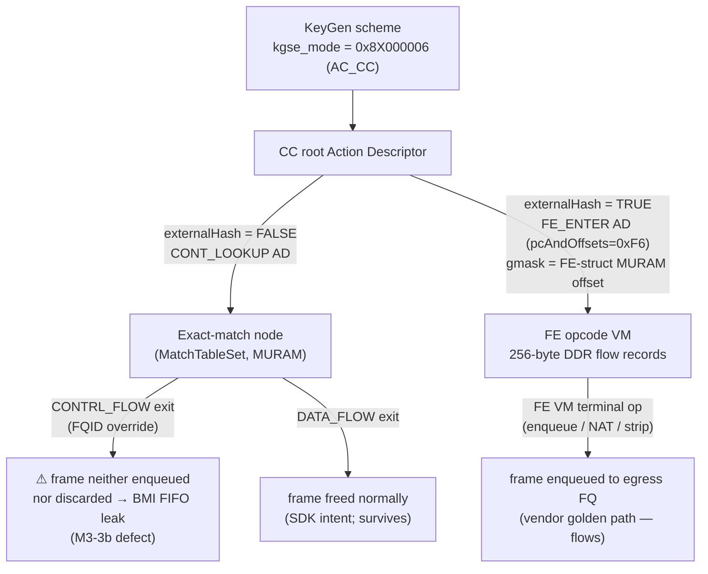

# FMan Frame-Engine (FE) Objects & External Hash — the M0 offload-init oracle

**Status:** M0 vendor-oracle deliverable (byte-level reference for DUAL-DATAPLANE M2/M3) · **Board:** NXP LS1046A — Mono Gateway DK · **FMan:** v3 / DPAA1, stock QEF **210.10.1** microcode · **Provenance:** genuine NXP SDK source the shipping vendor binaries were compiled from, archived at [`mihakralj/kernel-ls1046a-build@464df181`](https://github.com/mihakralj/kernel-ls1046a-build) (`release/patches/kernel/sdk-sources/drivers/net/ethernet/freescale/sdk_fman/Peripherals/FM/`), cross-checked against on-hardware register/MURAM dumps (qdrant `iter-23/32/45/47`, `m0-vendor-oracle-reconciliation`).

> **Why this doc exists.** [`specs/ask2-rewrite-spec.md`](../specs/ask2-rewrite-spec.md) §2.4(6) asserts the M0 verdict in prose — *"the 210 ucode parks frames only when the ehash/FE MURAM structures are missing; with those structures live, AC_CC dispatch flows."* This document is the **byte-level backing** for that claim: the exact MURAM/DDR init contract every ASK2 classify milestone (M2+) must reproduce, and the inverse it must undo (the §3.5 reversibility contract). It is the M0 *oracle* — DUAL-DATAPLANE M0 is satisfied by this static extraction, **not** by a live serial vendor-stack capture (which is MURAM-blocked and redundant — see §7).

---

## 1. The one-paragraph verdict

On the shipping **210.10.1** microcode, a KeyGen scheme set to **AC_CC** (`kgse_mode = 0x8X000006`, next-engine = coarse-classification dispatch) reliably delivers a classified frame to its egress FQ **only when the Coarse-Classifier root Action Descriptor enters the FE (Frame-Engine) opcode VM** — i.e. the external-hash path (`pcAndOffsets = 0xF6` = `FE_ENTER`, root-AD `gmask` repurposed as the MURAM offset of an FE struct, 256-byte flow records in DDR executed by the FE VM, which performs the terminal enqueue / NAT / strip / insert / stats). A **bare exact-match** Coarse-Classifier node (`MatchTableSet`, `externalHash = FALSE`, no FE buffer) is a *real and SDK-supported* primitive, but on this ucode our static grafts of it **park** — the `CONTRL_FLOW` (FQID-override) exit walks the key then never frees the frame's BMI FIFO allocation, the 24 KB port RX FIFO fills at ~45 frames, BMI admission stalls, and the port goes deaf under traffic (the open **M3-3b CC-disposition defect**). The FE/ehash structures are therefore **not a deferrable scale option — they are the disposition mechanism** the exact-match path lacks. This doc captures their complete init contract.

---

## 2. Two CC dispatch paths — the disposition fork



| | **Path 2 — exact-match** | **Path 1 — external-hash / FE** |
|---|---|---|
| SDK entry | `MatchTableSet` (`fm_cc.c`) | `FM_PCD_HashTableSet` → `ExternalHashTableSet` (`fm_ehash.c`, `#ifdef USE_ENHANCED_EHASH`) |
| `externalHash` | `FALSE` (no assignment in `MatchTableSet` path) | `TRUE` |
| Root AD | `CONT_LOOKUP` (`FillAdOfTypeContLookup`, `fm_cc.c:364`) | `FE_ENTER` — `pcAndOffsets=0xF6`, `gmask`=FE-struct MURAM offset, sets `FM_PCD_AD_FE_ENTER_ALLOCATE` |
| FE buffer | **none** (FE_ENTER_ALLOCATE never set) | **required** (`FmPortSetFESupport` per port + `AllocFEObjs` pool) |
| Match store | CC table + 16-byte ADs in **MURAM** | bucket array in **DDR** (`XX_MallocSmart`), AD node + global mem in MURAM |
| Terminal disposition | exit NIA only — **`CONTRL_FLOW` does not free the FIFO** | FE opcode VM does enqueue/NAT/free |
| On 210.10.1 | grafts **park** at ~45 frames (M3-3b) | **flows** (vendor parity run, 2026-06-13) |
| MURAM cardinality | O(flows) — the ~750-flow ceiling ([`muram.md`](muram.md)) | O(1) MURAM + O(buckets) **DDR** |

**Unifying theory (grounded, qdrant `iter-23`/`iter-45`/`m0-reconciliation`):** terminal frame disposition for a classified frame on 210.10.1 is performed by the **FE opcode VM**, which exists only on the external-hash path. `DATA_FLOW` exits free the BMI FIFO allocation; `CONTRL_FLOW` (FQID-override) exits do not. Exact-match-without-FE that exits via `CONTRL_FLOW` therefore leaks the FIFO. This is the single coherent explanation that reconciles "the SDK runs exact-match CC without an FE buffer" (true — via a `DATA_FLOW` exit) with "our exact-match graft parks" (true — our FQID-override graft is a `CONTRL_FLOW` exit).

---

## 3. The FE-object MURAM pool (`AllocFEObjs`, global, per-PCD)

`AllocFEObjs()` — `Pcd/fm_pcd.c:433`, compiled only for `DPAA_VERSION >= 11` (always on LS1046A). Run once at `FM_PCD_Init`:

```c
for (i = 0; i < 100; i++) {                       /* a fixed pool of 100 FE objects */
    p_FeObj = XX_Malloc(sizeof(t_FmPcdFEObj));    /* host control struct (DDR) */
    memset(p_FeObj, 0, sizeof(t_FmPcdFEObj));
    p_FeObj->h_FE = FM_MURAM_AllocMem(h_FmMuram,
                        FM_PCD_FE_MAX_SIZE,        /* = 28 B (see constants) */
                        FM_PCD_FE_ALIGN);          /* = 8  */
    memset(p_FeObj->h_FE, 0, FM_PCD_FE_MAX_SIZE);
    EnqueueFEObj(p_FmPcd, &p_FmPcd->feInfo.availableFeLst, p_FeObj);
}
```

- **MURAM cost: 100 × `FM_PCD_FE_MAX_SIZE` (28 B) = 2 800 B**, 8-byte aligned, reserved at PCD init whenever FE support is compiled. Bounded, one-time.
- List-managed: `feInfo.availableFeLst` (free) / `feInfo.enqLst` (in-use). `FM_PCD_FE_OBJ(node)` maps a list node back to its `t_FmPcdFEObj`. `DequeueFEObj`/`EnqueueFEObj` move objects under `p_FmPcd->h_Spinlock`.
- **Inverse:** `ReleaseFEsList()` (`fm_pcd.c:385`) drains both lists, `FM_MURAM_FreeMem(h_FE)` + `XX_Free` each.

### FE-type sizes (`inc/fm_common.h`, `DPAA_VERSION >= 11`)

| Constant | Value | Note |
|---|---|---|
| `FM_PCD_FE_ALIGN` | `8` | MURAM alignment of every FE object |
| `FM_PCD_FE_T_EXT_HASH_SIZE` | `4*7 = 28` | external-hash FE record |
| `FM_PCD_FE_T_HM_SIZE` | `4*4 = 16` | header-manip FE |
| `FM_PCD_FE_T_ENQ_SIZE` | `4*4 = 16` | enqueue FE |
| `FM_PCD_FE_T_TRANSITION_SIZE` | `4*2 = 8` | TRANSITION-FE singleton |
| `FM_PCD_FE_T_EXIT_SIZE` | `4*1 = 4` | EXIT-FE singleton |
| **`FM_PCD_FE_MAX_SIZE`** | **= `FM_PCD_FE_T_EXT_HASH_SIZE` = 28** | every pooled object sized to the max (ext-hash) |

> **KASAN gotcha (archived patch 110/094).** `memset`/`memcpy` on `p_FeObj->h_FE` faults under `CONFIG_KASAN_GENERIC=y` — `h_FE` is iomem (`FM_MURAM_AllocMem` → `devm_ioremap`) with no KASAN shadow → boot panic in `FM_PCD_Init → AllocFEObjs`. The SDK fix replaces the `memset` with `IOMemSet32` and scopes `KASAN_SANITIZE := n` on `sdk_fman`/`sdk_dpaa`/`fsl_qbman`. Mainline M2 must use `memset_io`/`__iowrite32_copy` for any MURAM clear.

---

## 4. Per-port FE support (`FmPortSetFESupport`, the params-page +0x54/+0x58 writes)

`FmPortSetFESupport()` — `Port/fm_port.c:2223`, `DPAA_VERSION >= 11`. Triggered from `CcUpdateParam` (`fm_cc.c:1138`, the **active** branch under `#ifndef USE_ENHANCED_EHASH`, line 1196) **iff `p_CcNode->externalHash`**. Idempotent per port (`if (p_FmPort->supportFE) return E_OK`).

```c
totalNumOfTnums = p_FmPort->tasks.num + p_FmPort->tasks.extra;

/* (a) per-port FE internal buffer pool — MURAM */
p_FmPort->internalFEBufferPoolAddr =
    FM_MURAM_AllocMem(h_FmMuram, totalNumOfTnums * BMI_FIFO_UNITS * 2, BMI_FIFO_UNITS);
IOMemSet32(internalFEBufferPoolAddr, 0, totalNumOfTnums * BMI_FIFO_UNITS * 2);

/* (b) management free-list index — MURAM */
p_FmPort->internalFEBufferPoolManagementIndexAddr =
    FM_MURAM_AllocMem(h_FmMuram, 5 + totalNumOfTnums, 4);
*(u32*)p = MURAM_offset_of(internalFEBufferPoolAddr);  /* = VirtToPhys - fmMuramPhysBaseAddr */
p[0] = 4;                                               /* pool-management index init */
for (i = 0; i < totalNumOfTnums; i++) p[4+i] = i;       /* free-list 0..N-1 */
p[4+totalNumOfTnums] = 0xFF;                            /* terminator */

/* (c) ctrl-params page (FM_CTL) writes — the M0 params-page FE words */
WRITE_UINT32(p_ParamsPage->internalFEBufferDepletionCounter, 0);              /* +0x58 */
WRITE_UINT32(p_ParamsPage->internalFEBufferManagementIndexAddr,              /* +0x54 */
             MURAM_offset_of(internalFEBufferPoolManagementIndexAddr));
p_FmPort->supportFE = TRUE;
```

- `BMI_FIFO_UNITS = 0x100` (256 B). **MURAM cost (a)** = `totalNumOfTnums × 256 × 2` per port (a port with ~8–16 TNUMs ⇒ ~4–8 KB); **(b)** = `5 + totalNumOfTnums` bytes. Both freed by the inverse.
- The ctrl-params page is the **FM_CTL `t_FmPcdCtrlParamsPage`** (256 B) addressed via `FMBM_RGPR` / `e_FM_PORT_GPR_MURAM_PAGE`. On mainline it is allocated once per port by board patch **`0116 fman_pcd_port_ensure_params_page`** (the verified one-time 256 B MURAM scaffold the M1 soak identified — qdrant `M1-item4`).

### Byte-exact `t_FmPcdCtrlParamsPage` (`inc/fm_common.h:182`, packed, **256 B**)

| Offset | Field | Note |
|---|---|---|
| `0x00` | `reserved0[16]` | |
| `0x10` | `iprIpv4Nia` | IP-reassembly v4 NIA |
| `0x14` | `iprIpv6Nia` | IP-reassembly v6 NIA |
| `0x18` | `reserved1[24]` | (iter-32 only inspected +0x28/+0x2c here) |
| `0x30` | `ipfOptionsCounter` | |
| `0x34` | `reserved2[12]` | |
| `0x40` | **`misc`** | `FM_CTL_PARAMS_PAGE_ALWAYS_ON = 0x100`; `OFFLOAD_SUPPORT_EN = 0x40000000` |
| `0x44` | `errorsDiscardMask` | `FMBM_RFSDM|RFSEM = 0x012ee0e8` |
| `0x48` | `discardMask` | |
| `0x4C` | `reserved3[4]` | |
| `0x50` | `postBmiFetchNia` | |
| **`0x54`** | **`internalFEBufferManagementIndexAddr`** | MURAM offset of the per-port mgmt free-list |
| **`0x58`** | **`internalFEBufferDepletionCounter`** | reset to 0 on enable |
| `0x5C` | `reserved4[164]` | pad to 256 B |

> Confirmed on hardware (qdrant `iter-32`): the install path already populates `+0x40 = 0x00000100` and `+0x44 = 0x012ee0e8` before any experiment writes — i.e. board `0116` already satisfies the params-page contract. iter-32 **disproved** params-page *contents* as the M3-3b cause; the missing piece is the FE *VM*, not the page words.

### Inverse — `FmPortDeleteFESupport` (`fm_port.c:2282`)

`supportFE = FALSE` → `WRITE_UINT32(p_ParamsPage->internalFEBufferManagementIndexAddr, 0)` → `FM_MURAM_FreeMem` both pool + mgmt addrs. **This is the §3.5 reversibility inverse** M2 must land in the same patch as the forward writes.

---

## 5. External hash tables (`ExternalHashTableSet`, the FE flow store)

`ExternalHashTableSet()` — `Pcd/fm_ehash.c:756`, active when `USE_ENHANCED_EHASH=1` (`fm_pcd_ext.h:51`). `FM_PCD_HashTableSet` redirects here; this path **bypasses** `IcHashIndexedCheckParams`, `FM_PCD_MatchTableSet`, and **MURAM table allocation entirely** — the bucket array lives in **DDR**:

```c
info->tablesize = sizeof(en_exthash_bucket) << (64 - num_of_zeroes);
info->table_base = XX_MallocSmart(info->tablesize, 0, EN_EXTHASH_TBL_ALIGNMENT);  /* DDR */
memset(info->table_base, 0, info->tablesize);
...
node = &info->node;
info->h_Ad = &info->node;                  /* ASK41 fix: was NULL → oops in ModifyMissNextEngine (offset 24) */
node->key_size       = info->keysize;
node->hash_mask_bits = ii;                 /* (mask+1) must be 2^ii, mask <= 0x7fff */
node->int_buf_pool_addr = p_FmPcd->InternalBufMgmtMuramArea;
node->global_mem_offset = EN_INTERNAL_BUFF_POOL_SIZE >> 8;
if (!en_global_muram_mem)                   /* singleton, once per PCD */
    en_global_muram_mem = (en_exthash_global_mem *)
        ((u8*)p_FmPcd->pIntMuramPtr + EN_INTERNAL_BUFF_POOL_SIZE);   /* MURAM */
tblphysaddr        = XX_VirtToPhys(info->table_base);
node->table_base_hi = (tblphysaddr >> 32) & 0xffff;
node->table_base_lo =  tblphysaddr & 0xffffffff;
```

- **DDR** (`XX_MallocSmart`): the bucket array `sizeof(en_exthash_bucket) × (mask+1)`, `mask ≤ 0x7fff` and `(mask+1)` an exact power of two (valid: `0x1,0x3,0x7,0xf,…,0x7fff`; `0xf0` is **invalid**). `en_exthash_bucket` = `{u64 hash; u64 pad}` = 8 B.
- **MURAM**: the AD `node` (`en_exthash_node`, holds `table_base_hi/lo`, `key_size`, `hash_mask_bits`, `int_buf_pool_addr`, `global_mem_offset`) + the `en_global_muram_mem` singleton at `pIntMuramPtr + EN_INTERNAL_BUFF_POOL_SIZE`.
- Runtime inserts: `ExternalHashTableAddKey()` writes 5-tuple flow records (256-byte external records) into the DDR buckets; matching packets bypass the CPU via FE-VM steering.

---

## 6. MURAM / DDR budget & the vendor over-provisioning anti-pattern

| Allocation | Where | Size | Lifetime |
|---|---|---|---|
| FE-object pool (`AllocFEObjs`) | MURAM | 100 × 28 B = **2 800 B** | per-PCD, one-time |
| Per-port FE buffers (`FmPortSetFESupport` a) | MURAM | `tnums × 256 × 2` (~4–8 KB/port) | per engaged port |
| Per-port FE mgmt index (b) | MURAM | `5 + tnums` B | per engaged port |
| FM_CTL params page (`0116`) | MURAM | 256 B | per port, reused forever |
| ehash global mem | MURAM | `en_exthash_global_mem` singleton | per-PCD |
| ehash bucket arrays | **DDR** | `8 × (mask+1)` per table | per table |

**The wall the vendor hit — and how to avoid it.** The vendor `/etc/cdx_pcd.xml` asked for 16 classifications × `max=512` keys × `statistics=byteframe` + **18 hash tables tagged `external='yes' aging='yes'`**. On-target `fmc` **silently drops** the `external`/`aging` attributes (warns *"Unknown attribute"*), so every hash table falls back to an **internal MURAM** `MatchTableSet` build → `fm_cc.c:4377 AllocStatsObjs Memory Allocation Failed` → `MatchTableSet` → `FM_PCD_HashTableSet` NULL → `dpa_app rc=65280` — the **same 384 KiB MURAM-exhaustion wall as ASK 1.x** (`327×-ENOMEM`). The DDR sizes above (`4× mask=0x7fff = 256 KB each = ~1 MB`, well within 2 GB) are harmless **only when `external='yes'` is honored**. Mainline M2 avoids the wall by (i) bounded cardinality (next-hop-deduped manip, ~750-flow MURAM ceiling — [`muram.md`](muram.md)), and (ii) if it adopts the ehash path, building the DDR buckets **directly via `XX_MallocSmart`-equivalent (`kmalloc`/`dma`)**, never letting them fall to MURAM.

---

## 7. Why M0 is static-extraction, not a live capture

A live serial vendor-stack FE/ehash capture is **blocked and redundant** (qdrant `m0-vendor-oracle-reconciliation`, 2026-06-15):

1. **MURAM-blocked.** The resurrected vendor stack cannot complete the FE/ehash build either — lxc200 `ask-activate.sh` **Phase 4 (dpa_app/FMC PCD programming) is SKIPPED** with the in-script note *"FM_PCD_CcRootBuild() blocks inside the kernel FMan PCD ioctl handler"*; it hits the §6 wall. The only "12 AC_CC schemes captured" success ([`files/verification-matrix.md` §G](../specs)) was the **minimal KG-only** PCD, not the full FE/ehash build. Observing the full build live would first require *trimming* `cdx_pcd.xml` to one small table — i.e. partly solving the problem to watch it.
2. **Statically available.** The authoritative init contract is the genuine NXP SDK source in §3–§5 — no hardware needed. Combined with the captured KG schemes (§G), the m33b CC-root/AD/match-table cross-audit, and the iter-31 `AttachPCD` contract (`RCMNE=0x2C`, `RFENE`, params-page via `FMBM_RGPR`), this **is** the complete M0 oracle.

The live minimal-config capture is reserved as a fallback only if an M2 ambiguity the source cannot resolve appears.

---

## 8. What M2 must do with this oracle (decision criterion)

The dpaa1 board substrate today steers via **Path 2** (exact-match: `0098` static CC install + `0108` per-key FQ enqueue-AD + `0106` KGSE→AC_CC). Its 100× S0↔S1 soak passed **control-plane-only** (no traffic) precisely because traffic triggers the Path-2 `CONTRL_FLOW` FIFO leak (M3-3b). So M2 faces a fork:

- **Fork A — fix Path-2 disposition.** Find why the exact-match `CONTRL_FLOW` exit doesn't free the BMI FIFO (next leads, qdrant `iter-32`: FPM exception capture during the walk; 210.10.1 AC-handler disassembly of the `0x06`/`0x28` opcodes). If fixed, exact-match is simpler and FE/ehash stays deferred to DDR-backed scale.
- **Fork B — adopt the vendor Path-1 (FE/ehash).** Reproduce §3–§5 (the only configuration **empirically proven to flow** on 210.10.1), letting the FE opcode VM do disposition. More code; must avoid §6's over-provisioning.

Either way, board patch **`0118` (CCBS-as-pointer) is a placebo and must be deleted** — it silently *bypasses* classification rather than enabling it (spec §2.4(6c)). The forward writes in §3–§5 and their §4/§3 inverses must land **in the same patch** (the §3.5 reversibility contract), each verified by `pcd-snapshot` diff.

---

## 9. Cross-references

| For… | See |
|---|---|
| CC root/AD/match-table byte formats, KeyGen scheme bits | [`fman-pcd.md`](fman-pcd.md) §2–§3 |
| MURAM budget, the ~750-flow ceiling, Risk #13 | [`muram.md`](muram.md) |
| Mode-switch reversibility contract (S0↔S1), `pcd-snapshot` | [`specs/ask2-rewrite-spec.md`](../specs/ask2-rewrite-spec.md) §2.4(6), §3.1, [`plans/DUAL-DATAPLANE.md`](../plans/DUAL-DATAPLANE.md) §2.2 |
| 210.10.1 microcode (open-source 106.x vs proprietary 210.10.1), FE opcode VM | [`fman-microcode.md`](fman-microcode.md) |
| Open M3-3b CC-disposition defect (BMI FIFO leak) | qdrant `iter-23/32/45/47`, `m3-3b-cc-disposition` |

---

*Maintainers: this is an M0 reference snapshot of vendor/SDK init behaviour. When an M2 implementation PR lands a forward FE/ehash write, cite the §-here it reproduces and add its verified inverse in the same patch.*
