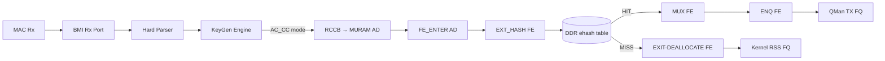

# FMan Microcode 210.10.1 — Complete Programming Reference

**Board:** NXP LS1046A Mono Gateway DK (FMan v3, DPAA1)
**Microcode:** QEF 210.10.1 ("Microcode version 210.10.1 for LS1043 r1.0"), `caps=0x17`
**Blob:** 51652 bytes, 12851 code words, SPI `mtd3` @ `0x400000`, DT node `/soc/fman@1a00000/fman-firmware/fsl,firmware`

This manual describes the complete programming surface of the NXP FMan 210.10.1 microcode — every register, field, bit assignment, FE type encoding, opcode, and resource ceiling. Sections 1–11 cover the reachable programming surface. Section 12 documents three facts not yet confirmed by a direct hardware measurement, with the methodology to resolve each. Section 13 documents what is absent from this microcode. Section 14 provides cross-references to deeper architectural documents.

---

## 1. Identity & Scope

The FMan v3 (LS1046A) microcode is a QEF container (`struct qe_firmware`, `magic="QEF"`) loaded by U-Boot from SPI `mtd3` into FMan IRAM at boot. It implements a table-driven Parse-Classify-Distribute pipeline. The kernel programs it by writing MURAM-resident configuration tables through FMan CCSR registers. It is never invoked via a software API or opcode dispatch.

The Host Command (HC) doorbell is **absent** from this blob (`caps=0x17`, bit 3 `FMAN_CAP_HC_DISPATCH` clear). `fmd_host_cmd_send()` returns `-ENXIO`. The only productive programming path is the register→MURAM→silicon path documented here.

The microcode is proprietary NXP 210.10.1, not the open-source `qoriq-fm-ucode` 106.x/108.x families. The public families are a strictly narrower subset — features marked "210-only" in this document do not exist in public microcode.

Three programming facts are not yet confirmed by a direct hardware measurement (§12). They are marked **UNKNOWN-1**, **UNKNOWN-2**, **UNKNOWN-3**. Everything else has been confirmed against at least one of: (a) the NXP DPAA Reference Manual, (b) the NXP lf-5.4 LSDK driver source, (c) the `we-are-mono/ASK` production code, or (d) a direct `/dev/mem` / debugfs read on the board.


## 2. Architecture Overview

The FMan PCD pipeline has five stages, each programmed through registers and MURAM tables:



The programming model is **table-driven**: the driver writes MURAM-resident Action Descriptors (16 B each), FE objects (4–28 B each), CC match tables, HM command tables, and policer profile records. The microcode reads these tables as frames traverse the pipeline. There is no runtime opcode dispatch, no doorbell protocol, no IRQ-driven completion — the tables are the API.

DDR is used for the ehash bucket array and per-flow records (to avoid MURAM exhaustion). MURAM holds all FE objects, CC trees, HM chains, policer profiles, and the per-port ctrl-params page.

The two dispatch paths on 210.10.1:

- **Path 1 — FE-VM external-hash** (the only path that flows): RCCB → `FE_ENTER` AD → EXT_HASH FE → DDR bucket lookup → MUX → ENQ (HIT) or EXIT (MISS). The FE-VM opcode interpreter provides terminal BMI-FIFO disposition.
- **Path 2 — bare exact-match CC** (`CONT_LOOKUP` → `CONTRL_FLOW` exit): **Parks on 210.10.1** — no terminal FIFO disposition, BMI stall at ~45 frames. Do not use.


## 3. QEF Container (Blob Identity)

The microcode blob on SPI `mtd3` (flash offset `0x400000`, 1 MiB partition "fman-ucode") is a QorIQ Engine Firmware container. Header layout:

| Bytes | Field | Value (this board) |
|---|---|---|
| `0x00–0x03` | `__be32 length` | `51652` |
| `0x04–0x06` | `magic` | `"QEF"` |
| `0x07` | `layout_version` | `1` |
| `0x08–0x45` | `id[62]` NUL-terminated | `"Microcode version 210.10.1 for LS1043 r1.0"` |
| `0x46` | `split_IRAM` | `0` |
| `0x47` | `count` (microcode sections) | `1` |
| `0x48–0x49` | `__be16 soc_model` | `0x0413` (proprietary 210); `0x0416` = open-source 106 |
| `+112` | `u8×3 version` | `0xd2 0x0a 0x01` = 210.10.1 |

Microcode entry at `code_offset = 244`, `wcount = 12851` (51404 code bytes). After U-Boot loads it, the kernel reads it from the DT property `/proc/device-tree/soc/fman@1a00000/fman-firmware/fsl,firmware`.

> The "for LS1043 r1.0" label is cosmetic — LS1043A and LS1046A share identical FMan v3 silicon. NXP ships one ASK microcode package for both.

**Verification commands:**
```bash
# Decode QEF header from DT (no root, always present if U-Boot loaded it):
od -An -tx1 -N76 /proc/device-tree/soc/fman@1a00000/fman-firmware/fsl,firmware

# Decode from raw flash (needs root; confirm partition first with cat /proc/mtd):
sudo od -An -tx1 -N76 /dev/mtd3

# Full inventory:
sudo firmware-check
```

MD5: `6f23090a3d5ae8b302ea41fd90a14d4d`
SHA256: `5f3ed8d32b8659aafd8912d5d9920306350cae7a85884d81859152b9723eff0d`


## 4. KeyGen Scheme Registers

FMan CCSR base: `0x01A_0000`. KeyGen register block: offset `0x0C_1000`. All scheme registers are accessed indirectly through the KeyGen Action Register (`FMKG_AR` at offset `0x1FC`).

### 4.1 Indirect Access Protocol

To read or write a scheme word:
1. Write `FMKG_AR` = `GO(bit31)` | `READ(bit30, optional)` | `WSEL(word_index)` | `NUM(scheme 0–31)` | `HPORTID(port 0–15)`
2. Poll `FMKG_AR[GO]` until 0 (hardware clears it on completion)
3. Read/write the indirect window at `0x100+4*word_index`

### 4.2 Scheme Register Map (words 0–23 at indirect window `0x100`)

| Word Index | Register Name | Bits | Meaning |
|---|---|---|---|
| **0** | `kgse_mode` | `[31]` | **EN** — master enable for this scheme |
| | | `[7:0]` | **next_engine**: `2`=RSS (hash→DONE), `3`=FM_CTL (AC_CC), `4`=PLCR (policer), `6`=DONE (enqueue) |
| | | `[31:28]` | **NIA_ENG**: `0x8`=FM_CTL, `0xC`=PLCR, `0x0`=BMI |
| **1** | `kgse_ekfc` | `[31:0]` | **Extract Known Fields bitmask** — see §4.3 |
| **2** | `kgse_mv` | `[31:0]` | **Match Vector** — LCV bits that select this scheme |
| **3** | `kgse_ccbs` | `[27:12]` | **CC Base Select** — MURAM offset of CC group table (set to `0` for direct AC_CC dispatch via FMBM_RCCB) |
| **4** | `kgse_fqb` | `[23:0]` | **FQID base** for hash distribution |
| | | `[27:24]` | **range** — number of FQ bits to substitute (0→1 FQ, 7→128 FQs) |
| **5** | `kgse_hc` | `[31:16]` | **HMASK** — hash mask for FQID distribution |
| | | `[15]` | **SYM** — symmetric hash (XOR src/dst pairs before hashing) |
| | | `[7:0]` | **HSHIFT** — right-shift applied to hash before masking |
| **8** | `kgse_ppc` | `[31:0]` | Per-packet counter (read-only) |
| **16** | `kgse_spc` | `[31:0]` | **Scheme Packet Counter** (read-only) |
| **23** | (upper words) | | Additional configuration words for advanced features |

**Key mode encodings:**

| Purpose | `kgse_mode` | Meaning |
|---|---|---|
| **AC_CC dispatch** (FE-VM path) | `0x80000006` | EN \| FM_CTL \| AC_CC — frames dispatched to CC classifier for FE-VM lookup |
| **RSS hash** (mainline default) | `0x80500002` | EN \| BMI \| DONE — hash→enqueue to kernel FQs |
| **Policer steering** | `0xC04C0000` | EN \| NIA_PLCR \| DONE — route to policer profile |
| **Scheme disabled** | `0x00000000` | SI=0 — skipped during scheme selection |

For AC_CC dispatch, `kgse_ccbs` MUST be `0x00000000`. A non-zero CCBS triggers an implicit CC group-table walk, which is a different dispatch mechanism and does not work for FE-VM on 210.10.1.

### 4.3 EKFC Field Bit Assignments

Extract Known Fields Command — a 32-bit bitmask. Each set bit instructs the KeyGen to extract one canonical field from the Parse Result. The assembly order of extracted fields into the key buffer is **UNKNOWN-1** — see §12.1.

| Bit | Constant | Field | Size | Notes |
|---|---|---|---|---|
| 31 | `KG_SCH_KN_MACDST` | Ethernet MAC destination | 6 B | |
| 30 | `KG_SCH_KN_MACSRC` | Ethernet MAC source | 6 B | |
| 22 | `KG_SCH_KN_ETYPE` | EtherType | 2 B | |
| 21 | `KG_SCH_KN_VLAN1` | First VLAN TCI | 2 B | |
| **20** | **`KG_SCH_KN_IPSRC1`** | **Outer IP source** | 4 B (IPv4) / 16 B (IPv6) | |
| **19** | **`KG_SCH_KN_IPDST1`** | **Outer IP destination** | 4 B (IPv4) / 16 B (IPv6) | |
| **18** | **`KG_SCH_KN_PTYPE1`** | **L4 protocol number** | 1 B | TCP=6, UDP=17. No EKDV default-value slot; guard against proto=0 at flow insert |
| 17 | `KG_SCH_KN_IPTOS1` | IPv4 TOS / IPv6 Traffic Class | 1 B | |
| 14 | `KG_SCH_KN_IPSRC2` | Inner/tunneled IP source | 4/16 B | Tunneled frame only |
| 13 | `KG_SCH_KN_IPDST2` | Inner/tunneled IP destination | 4/16 B | Tunneled frame only |
| **9** | `KG_SCH_KN_IPSECSPI` | IPsec ESP/AH SPI | 4 B | **Do NOT set on non-IPsec schemes** — parser has no SPI offset for non-IPsec frames, reads random bytes |
| **4** | **`KG_SCH_KN_L4PSRC`** | **TCP/UDP source port** | 2 B | |
| **3** | **`KG_SCH_KN_L4PDST`** | **TCP/UDP dest port** | 2 B | |
| 2 | `KG_SCH_KN_TFLG` | TCP flags | 1 B | |

**5-tuple target:** `EKFC = 0x001C0006` = `IPSRC1 | IPDST1 | PTYPE1 | L4PSRC | L4PDST` → 13 bytes.

**4-tuple (NO PTYPE1):** `EKFC = 0x00180006` → 12 bytes. **Do not use for production** — aliases TCP and UDP flows sharing the same IP:port pair (silent misforwarding).

**IPsec SPI (bit 9) MUST NOT be set on non-IPsec schemes.** On non-IPsec frames the parser has no SPI offset — reads random bytes — unpredictable key. **The mainline `dpaa_eth` default RSS scheme sets this bit** (`DEFAULT_HASH_KEY_EXTRACT_FIELDS = 0x00180206` in `fman_keygen.c`), which means the KG hash for non-IPsec traffic on unmodified kernel-delivery ports is per-frame nondeterministic. For the hash-match calibration (§12.1) use a scheme WITHOUT bit 9 (`EKFC = 0x001C0006` or `0x00180006`), otherwise software cannot reproduce the hash even with the correct algorithm and extraction order.

### 4.4 Scheme Selection Logic

For each received frame:
1. Parse Result `CPID[7:0]` → effective plan = `CPGBASE | (CPID & CPGMASK)` → 32-bit classification plan mask
2. `QLCV = plan_mask & LCV` (LCV = Line-up Confirmation Vector from parser)
3. Walk schemes SC0→SC31: first scheme where `SI=1` AND `(QLCV & kgse_mv) == kgse_mv` wins
4. No match → `FMKG_GCR[DEFNIA]` default next-interface action

For exact-match classification: set `kgse_mv` to the LCV bits for the protocol combination you want to match, and set `SI=1`.

### 4.5 Hash Algorithm

CRC-64-ECMA-182, reflected polynomial `0xC96C5795D7870F42`, seed `0xFFFFFFFFFFFFFFFF`, **final complement** (XOR `0xFFFFFFFFFFFFFFFF`) — i.e. **CRC-64/XZ** (a.k.a. CRC-64/GO-ECMA). Applied over the assembled key bytes in network byte order. The result is a 64-bit hash stored at Internal Context offset `0x48` (confirmed by `fman_sp_build_buffer_structure`).

**Algorithm verification vector** (2026-07-13): `CRC-64/XZ("123456789") == 0x995DC9BBDF1939FA`. `fman_pcd_crc64()` on the dpaa1 branch returns this exact value — algorithm confirmed identical to the definitional NXP `fsl_fman_crc64.h`. Any hash-match mismatch is therefore NOT an algorithm defect; it is either wrong extraction order, wrong capture site, or wrong key bytes fed in.

FQID computation: `KDFV = (hash >> HSHIFT) & HMASK`; `FQID = KDFV | FQBASE`.

Symmetric hash (`SYM=1`): XORs src+dst pairs (MAC, IP, L4 port) before hashing. Both directions of a flow produce the same FQID.

FE-VM ehash bucket index (from lf-5.4 LSDK `get_indexed_hash_bucket`, L7301):
```
bucket_index = (crc64_hash >> ((6 - hashShift) * 8)) & hashMask
```

### 4.6 KGSE_SPC — Scheme Packet Counter

`kgse_spc` (word 16, read-only) is the per-scheme packet counter. It increments for every frame this scheme classifies. Zero SPC on an armed scheme means frames are not being dispatched to it — check `kgse_mv` against the live `LCV`.


## 5. BMI Port Registers

Per-RX-port registers in the FMan BMI block. Port `0x10` = eth3 (left SFP+), port `0x11` = eth4 (right SFP+). Ports `0x08`–`0x0D` = eth0–eth2 (RJ45).

| Register | Offset | Bits | Meaning |
|---|---|---|---|
| **FMBM_RFPNE** | `0x28` | `[31:24]` | NIA engine after parse: `0x00`=BMI, `0x40`=KG (KeyGen), `0x80`=FM_CTL |
| | | `[7:0]` | Sub-engine within NIA |
| **FMBM_RFQID** | `0x0C` | `[23:0]` | Default RX Frame Queue ID — where frames go if not reclassified |
| **FMBM_RCCB** | `0x34` | `[27:12]` | **RX CC Base** — MURAM offset of the first Action Descriptor for CC dispatch |
| **FMBM_RICP** | `0x40` | `iceof[15:0]` | IC External Offset — where in DDR buffer the IC copy starts |
| | | `iciof[15:0]` | IC Internal Offset — which IC byte to start copying from |
| | | `icsz[15:0]` | IC Size — how many IC bytes to copy to DDR annotation |

- **KG dispatch:** `FMBM_RFPNE = 0x00480000` — NIA engine = KG (0x40), sub-engine = 0
- **AC_CC dispatch:** `FMBM_RFPNE = 0x00480200` — NIA engine = KG (0x40), sub-engine selects AC_CC path. `FMBM_RCCB` must point to the `FE_ENTER` AD at its MURAM offset
- **RSS default (mainline):** `FMBM_RFPNE = 0x00480000`, RCCB = 0 (no CC dispatch)

For the hash-match method (§12.1), `pass_hash_result` must be enabled in the buffer prefix content so the 8-byte KG hash at IC `0x48` is visible in the DDR annotation.

**Buffer prefix — vaddr semantics (verified 2026-07-13):** In the mainline `dpaa_eth` RX path, `vaddr = phys_to_virt(qm_fd_addr(fd))` points to the **BMan buffer base**, NOT to the frame data. The frame data lives at `vaddr + data_offset`. Consequently `fman_port_get_hash_result_offset()` returns a buffer-start-relative offset, and the standard read `be32_to_cpu(*(__be32*)(vaddr + hash_offset))` is correct. Earlier notes claiming "`fd.addr` points to frame data" describe a different debugging context (ic_probe scan-direction confusion) and do NOT apply to the mainline RX hash read.

**Observed layout on the dpaa1 branch (10G port, 2026-07-13):** F-072 scans show `hash_result_offset = 264`, frame data at `vaddr + 272`, giving `ext_buf_offset = 224` and `data_offset = align_up(224 + 48, 16) = 272`. This is unusual — mainline default is `ext_buf_offset = 16` (from `DPAA_TX_PRIV_DATA_SIZE = 16`) and ASK SDK production is `96`. `ext_buf_offset = 224` (14×16 B) implies `priv_data_size ≈ 209–224` on this port; investigate whether an ASK2/board patch bumped it. The layout formula still holds: `hash_result_offset = ext_buf_offset + 40` for the standard `pass_prs_result + pass_time_stamp + pass_hash_result` configuration.


### FMBM_RFPNE / FMBM_RFENE NIA-field decode (RM §8.5)

Parser-Next-Engine (`FMBM_RFPNE`) and Frame-Enqueue-Next-Engine (`FMBM_RFENE`) share the NIA (Next-Invoked-Action) 32-bit encoding. Bits [22:16] name the target engine; bits [11:0] name the per-engine action code.

| Symbol | Value | Meaning |
|---|---|---|
| `NIA_ENG_HWP` | `0x00440000` | Hardware Parser |
| `NIA_ENG_HWK` | `0x00480000` | KeyGen (RSS / classification hash) |
| `NIA_ENG_BMI` | `0x00500000` | BMI direct |
| `NIA_BMI_AC_ENQ_FRAME` | `0x00000002` | BMI: enqueue frame to destination FQ |
| `NIA_BMI_AC_CC` | `0x00000200` | BMI: dispatch to coarse-classifier (CC / FE-VM entry) |
| `NIA_ORDER_RESTOR` | `0x00800000` | QMan order-restoration flag (order-preserving enqueue). **NOTE:** this is the bit that was previously mis-labeled "~~workspace ALLOCATE~~ (WRONG — this bit is `NIA_ORDER_RESTOR`; see §12.2 and §5.X NIA decode)" in FE_ENTER AD word0. See §12.2. |

**Observed pipeline configurations (LS1046A, dpaa1 branch, 2026-07-13):**

| `FMBM_RFPNE` | Decode | Effective RX pipeline | KG in path? | Hash slot valid? |
|---|---|---|---|---|
| `0x00500002` | `NIA_ENG_BMI \| AC_ENQ_FRAME` | Parser → BMI → direct enqueue | **no** | **no** (stale/garbage) |
| `0x00480200` | `NIA_ENG_HWK \| AC_CC` | Parser → KG → AC_CC dispatch → FE-VM | yes | yes (KG CRC-64) |
| `0x00440200` | `NIA_ENG_HWP \| AC_CC` | Parser → CC (KG skipped) | no | no |

The mainline `dpaa_eth` default for kernel RSS delivery is `0x00500002` — no KeyGen. The ASK2 `vyos-offload-ask engage` action rewrites the target port's RFPNE to `0x00480200`. Before trusting any read at `hash_result_offset`, dump RFPNE and confirm bits [22:16] = `0x48`. If bits [22:16] = `0x50`, the KG did not run and the annotation hash slot is not populated by the KG.

## 6. FM_CTL Params Page (per-port, 256 B MURAM)

Allocated once per port. The FMan Controller reads this page during frame processing. Exact layout (`t_FmPcdCtrlParamsPage`, packed 256 bytes):

| Offset | Field | Bits | Meaning |
|---|---|---|---|
| `0x00` | `reserved0[16]` | | |
| `0x10` | `iprIpv4Nia` | `[31:0]` | IP Reassembly v4 next-interface action (unconsumed) |
| `0x14` | `iprIpv6Nia` | `[31:0]` | IP Reassembly v6 NIA (unconsumed) |
| `0x18` | `reserved1[24]` | | |
| `0x30` | `ipfOptionsCounter` | `[31:0]` | IP Fragmentation options counter (unconsumed) |
| `0x34` | `reserved2[12]` | | |
| **`0x40`** | **`misc`** | `[31:0]` | `FM_CTL_PARAMS_PAGE_ALWAYS_ON = 0x100`; `OFFLOAD_SUPPORT_EN = 0x40000000` |
| `0x44` | `errorsDiscardMask` | `[31:0]` | Frame error discard mask (`0x012ee0e8`) |
| `0x48` | `discardMask` | `[31:0]` | |
| `0x4C` | `reserved3[4]` | | |
| `0x50` | `postBmiFetchNia` | `[31:0]` | NIA after BMI buffer fetch |
| **`0x54`** | **`internalFEBufferManagementIndexAddr`** | `[31:0]` | MURAM offset of per-port FE buffer free-list |
| **`0x58`** | **`internalFEBufferDepletionCounter`** | `[31:0]` | Reset to 0 on enable |
| `0x5C` | `reserved4[164]` | | Pad to 256 B |

**Init values** (from lf-5.4 LSDK `FmPortSetFESupport`):
- `+0x40` = `0x00000100`
- `+0x44` = `0x012ee0e8`
- `+0x54` = MURAM offset of the per-port FE buffer management free-list (written at arm time)
- `+0x58` = `0x00000000` (reset depletion counter at arm time; zeroed at disengage)

The `internalFEBufferManagementIndexAddr` and `internalFEBufferDepletionCounter` are only written when `FmPortSetFESupport` is called (the FE-VM path). They are left zero for bare exact-match CC.


## 7. FE Types — The Complete Command Set

The FE-VM opcode interpreter dispatches on the type field in bits `[31:26]` of the first MURAM word of each FE object. These are the ONLY commands the 210.10.1 FE-VM implements. Each FE object lives in the MURAM pool (100 slots × 28 B = 2800 B total, allocated by `AllocFEObjs`).

### 7.1 FE Type Table

| Type Constant | Word0 | Name | MURAM Size | Purpose |
|---|---|---|---|---|
| `0x01000000` | — | **HM** (Hash Match) | 16 B | Header Manipulation FE — executes HMCD/HMCT chains inline |
| `0x02000000` | `0x02010000` | **ENQ** | 16 B | Terminal enqueue to QMan FQ. Word1 encodes the 24-bit FQID |
| `0x03000000` | `0x03800000` | **EXIT** (DEALLOCATE) | 4 B | Free workspace allocation, terminate frame. Terminal MISS disposition |
| `0x04000000` | `0x04000000` | **MUX** | 8 B | Multiplexer — branches HIT→nextFE / MISS→implied EXIT. Singleton |
| `0x05000000` | — | **TRANSITION** | 8 B | State transition relay for HIT forwarding. Singleton |
| `0x06000000` | `0x06000000` | **EXT_HASH** | 28 B | External hash table lookup in DDR — core FE-VM fastpath |

### 7.2 EXT_HASH FE — Byte-Level Layout

The central FE object. It performs: CRC64(hardware key) → bucket index → DDR bucket walk → key comparison → HIT/MISS dispatch.

| Word | Offset | Size | Field | Dormant Value |
|---|---|---|---|---|
| `w0` | `0x00` | 4 B | **misc**: `FMAN_FE_TYPE_EXT_HASH (0x06000000)` \| `contextOffsetInWS` \| aging \| stats | `0x06000000` |
| `w1` | `0x04` | 4 B | `(hashMask << 16)` \| `((contextSize-1) << 8)` \| `hashShift` | `0x00FFFF00` (mask=`0xFF`, ctxtSize=256, shift=0) |
| `w2` | `0x08` | 4 B | `table_base_hi` — DDR bucket array bus address, high 16 bits of 48-bit | `0x00000000` (dormant) |
| `w3` | `0x0C` | 4 B | `table_base_lo` — DDR bucket array bus address, low 32 bits | table DMA addr lo |
| `w4` | `0x10` | 4 B | `missResult` — miss-result context MURAM offset | `0x00000000` (dormant) |
| `w5` | `0x14` | 4 B | `nextFEPtr` — **HIT** link = MURAM offset of the MUX singleton | `pcd->fe_mux_off` |
| `w6` | `0x18` | 4 B | `missNextFE` — **MISS** link = MURAM offset of the EXIT singleton | `pcd->fe_exit_off` |

**Critical address-space split:** `table_base_hi/lo` (`w2`/`w3`) carry a DDR bus address (`dma_addr_t` from `dma_alloc_coherent`). `nextFEPtr`/`missNextFE` (`w5`/`w6`) carry MURAM offsets (gen_pool offsets). Do not mix them.

**contextSize** (in `w1[15:8]`): the SDK passes 256 (`w1 = 0x00FF0000` masked with `0x7FFF`). Encoded as `contextSize-1` in the field.

**hashMask** (in `w1[31:16]`): `(mask+1)` must be an exact power of two. Valid masks: `0x0, 0x1, 0x3, 0x7, 0xF, …, 0x7FFF` (32768 buckets).

**contextOffsetInWS**: See §12.2 **UNKNOWN-2**. The SDK passes `0`. The field occupies bits in `w0`.

### 7.3 ENQ FE — Byte Layout

| Word | Offset | Contents |
|---|---|---|
| `w0` | `0x00` | `FMAN_FE_TYPE_ENQ (0x02010000)` |
| `w1` | `0x04` | FQID (24-bit). `w1 = 0x00000200` for FQ `0x200` (kernel delivery); `0x00008000` for dedicated offload FQ |
| `w2` | `0x08` | reserved/context |
| `w3` | `0x0C` | reserved/context |

### 7.4 EXIT FE — Byte Layout

| Word | Offset | Contents |
|---|---|---|
| `w0` | `0x00` | `FMAN_FE_TYPE_EXIT | FMAN_FE_EXIT_DEALLOCATE (0x03800000)` |

EXIT-DEALLOCATE is a real terminal MISS disposition on 210.10.1: AC_CC arm → MISS → EXIT → port does NOT park.

### 7.5 MUX FE — Byte Layout

| Word | Offset | Contents |
|---|---|---|
| `w0` | `0x00` | `FMAN_FE_TYPE_MUX (0x04000000)` |
| `w1` | `0x04` | next-FE MURAM offset (TRANSITION singleton) |

The MUX requires `ALLOCATE` semantics. The `ALLOCATE` bit MUST be set for both `FE_ENTER` and MUX.

### 7.6 TRANSITION FE — Byte Layout

| Word | Offset | Contents |
|---|---|---|
| `w0` | `0x00` | `FMAN_FE_TYPE_TRANSITION (0x05000000)` |
| `w1` | `0x04` | next-FE MURAM offset (ENQ FE) |

### 7.7 FE_ENTER Root AD — Byte Layout

The AD at `FMBM_RCCB` that enters the FE-VM. NOT a pooled FE object — a standalone 16-byte MURAM AD.

| Word | Offset | Contents |
|---|---|---|
| `w0` | `0x00` | **`0x40800000`** = `CONT_LOOKUP(0x40)` \| `ALLOCATE(0x00800000)` |
| `w1` | `0x04` | `0x00000000` (reserved) |
| `w2` | `0x08` | **`0x000000F6`** = `pcAndOffsets` = OPC_FE_ENTER |
| `w3` | `0x0C` | next-FE MURAM offset (the EXT_HASH FE) |

**Do NOT strip the ALLOCATE bit (0x00800000).** It allocates the FE workspace that holds the extracted key and KG hash. Removing it removes the place the context lives.

### 7.8 FE Object Pool

Pool init (`AllocFEObjs`, lf-5.4 LSDK):
- 100 FE objects × `FM_PCD_FE_MAX_SIZE` (28 B) = **2800 B MURAM**, 8-byte aligned
- List-managed: `availableFeLst` (free) / `enqLst` (in-use)
- Inverse: `ReleaseFEsList()` drains both lists, frees each `h_FE` via `FM_MURAM_FreeMem`

MURAM is iomem — use `memset_io` / `__iowrite32_copy` for all accesses.

### 7.9 FE Object Sizes

| Constant | Value | FE Type |
|---|---|---|
| `FM_PCD_FE_ALIGN` | 8 | All FE objects |
| `FM_PCD_FE_T_EXT_HASH_SIZE` | 28 (4×7) | EXT_HASH |
| `FM_PCD_FE_T_HM_SIZE` | 16 (4×4) | HM |
| `FM_PCD_FE_T_ENQ_SIZE` | 16 (4×4) | ENQ |
| `FM_PCD_FE_T_TRANSITION_SIZE` | 8 (4×2) | TRANSITION (singleton) |
| `FM_PCD_FE_T_EXIT_SIZE` | 4 (4×1) | EXIT (singleton) |
| `FM_PCD_FE_MAX_SIZE` | 28 | Max of all types (= EXT_HASH) |

### 7.10 FE-VM Programming Core

The FE-VM is operational on the dpaa1 branch using `fman_pcd_fe_*_build()` functions and `fman_pcd_fe_build_contexts()`. The `get_indexed_hash_bucket()` CRC64 bucket indexer is verbatim-identical to the SDK implementation. AC_CC dispatch is proven on hardware with byte-clean reversibility.

For reference, the equivalent lf-5.4 LSDK functions are:

| Function | LSDK Location (999-patch) | Purpose | Current dpaa1 equivalent |
|---|---|---|---|
| `FmPcdCcBuildFE` | L8883 | Programs a single FE object | `fman_pcd_fe_enq_build()`, `fman_pcd_fe_hash_encode()` |
| `FmPcdCcBuildContextByFE` | L8954 | Populates per-port FE context | `fman_pcd_fe_build_contexts()` (patch 0146) |
| `get_indexed_hash_bucket` | L7301 | CRC64 bucket indexer | `fman_pcd_ehash_bucket_index()` |

The lf-5.4 LSDK source is at `/home/vyos/ask-ref/ask/patches/kernel/999-layerscape-ask-kernel_linux_5_4_3_00_0.patch`.


## 8. Header Manipulation Opcodes

HMCD (Header-Manip Command Descriptor) table ≤ 256 bytes in MURAM. HMCT (Header-Manip Command Table) entries are 4-byte big-endian command words chained via `HMCD_LAST` (bit 23 = `0x00800000` on the final word). The FMan Controller executes these inline during frame processing.

### 8.1 HM Opcode Table

| Opcode | Name | Operand | Auto Side-Effects |
|---|---|---|---|
| `0x00` | **Remove header** (L2 strip) | — | — |
| `0x01` | **Remove arbitrary bytes** | `offset[7:0]`, `size[15:8]` | — |
| `0x02` | **Insert/Replace arbitrary bytes** | `offset[7:0]`, `size[15:8]`; data inline or from MURAM | — |
| `0x0B` | **VLAN priority update** | Direct or DSCP→VPri 64-entry/32-byte lookup | — |
| **`0x0C`** | **Local IPv4 update** | TOS, **TTL decrement**, IP-ID, src addr, dst addr | **Auto-regenerates IP header checksum** |
| `0x0D` | **Internal L3 replace** | Full IPv4/IPv6 address swap from MURAM | — |
| **`0x0E`** | **Local TCP/UDP update** | Source/dest port | **Auto-incremental L4 checksum** (skipped if original==0) |
| `0x16+` | **Local L3 insert** (tunnel header) | Tunnel header data, size | — |

### 8.2 HMTD Descriptor

16-byte MURAM record:

| Offset | Field | Value |
|---|---|---|
| `0x00` | `cfg` | `0x4080` = `TYPE(0x4000)` \| `EXT_HMCT(0x0080)` |
| `0x04` | `hmcdBasePtr` | MURAM offset of the first HMCT entry |
| `0x0B` | `opCode` | `0x35` = `HMAN_OC` (Header Manipulation opcode) |

### 8.3 The NAT Chain

The L3 forwarding chain in opcode order:
1. `0x01` (RMV_ETHERNET) — strip the incoming L2 header
2. `0x02` (INSRT_GENERIC) — insert the new L2 header (new MACs, EtherType)
3. `0x0C` (IPV4_FORWARD) — rewrite IP src/dst, decrement TTL, auto-regenerate IP checksum
4. `0x0E` (TCP_UDP_UPDATE) — rewrite L4 ports, auto-incremental L4 checksum

Each manip chain must stay within 1 KiB MURAM per chain. The `fman_pcd_manip_chain_create(N manips)` primitive concatenates N source HMCTs into one bigger HMCT with `HMCD_LAST` on the final word.

Pre-allocate manip chains at install time; do not churn them at runtime (MURAM fragmentation risk).


## 9. Policer Programming Model

FMPL CCSR base: `0x01AC0000`. 256 profiles, each a 64-byte entry in 16 KB PRAM (ECC-protected). Accessed indirectly via `FMPL_PAR` (Profile Access Register, offset `0x004`).

### 9.1 Policer Registers

| Register | Offset | Bits | Meaning |
|---|---|---|---|
| **FMPL_GCR** | `0x000` | `[31]` **EN** | **Master enable** — MUST be set (`plcr_enable_block()`) or ALL policer profiles are inert |
| | | `[30]` **STEN** | Statistics enable — MUST be set for per-profile counters |
| | | `[23:0]` DEFNIA | Default NIA for unmetered frames |
| **FMPL_PAR** | `0x004` | | Indirect access to 256 × 64 B PRAM entries |
| **FMPL_PMR1–63** | `0x100+` | | Per-Port Metering Register — maps port N to profile ID |
| **FMPL_DPMR** | `0x200+` | | Dual-Port Metering Register |

`FMPL_GCR[EN]` and `FMPL_GCR[STEN]` are BOTH clear at boot (`FMPL_GCR = 0x00500002`). The whole policer block is disabled. Call `plcr_enable_block()` to set both bits (→ `0xC0500002`). Do NOT ship a build without `plcr_enable_block()`.

### 9.2 Profile PRAM Entry (64 bytes)

| Word | Offset | Field | Encoding |
|---|---|---|---|
| 0 | `0x00` | **Mode** | `COLOR_AWARE(0x8000)` \| `ALG_TRTCM(0x2000)` \| `PACKET_MODE(0x1000)` \| `PIR_DISABLED(0x0040)`. srTCM sets `PIR_DISABLED`; trTCM sets `ALG_TRTCM` |
| 1 | `0x04` | CIR (Committed Information Rate) | Q16.16 fixed-point bytes/s: `rate = (exp << 29) | (mant << 13)`, exp∈[0..7], mant∈[0..0xFFFF] |
| 2 | `0x08` | CBS (Committed Burst Size) | `DIV_ROUND_UP(bytes, 256)`, saturated at `0xFFFF` |
| 3 | `0x0C` | EIR/EBS | Upper 16 bits = EIR rate (same encoding as CIR); lower 16 bits = EBS burst (same encoding as CBS) |

Init: set `CTS`/`PTS_ETS` = `0xFFFFFFFF` (full token buckets), `LTS` = 0. Hardware auto-calibrates on the first packet.

Rate encoding:
```
plcr_encode_rate(u64 bps, u64 clk_hz):
  Find smallest exp ∈ [0..7] where mant = DIV_ROUND_CLOSEST(bps, clk_hz >> (29 - 13*exp)) fits in u16
  Saturate at exp=7, mant=0xFFFF
  Return (exp << 29) | (mant << 13)
```

Burst encoding: `DIV_ROUND_UP(bytes, 256)`, saturated at `0xFFFF`. 0 bytes → 0, 256 bytes → 1, 65536 bytes → 256.

### 9.3 Per-Color Next-Interface Actions

Each profile carries three NIAs: **GNIA** (Green — enqueue, within CIR/CBS), **YNIA** (Yellow — enqueue or mark), **RNIA** (Red — drop or mark). A profile can chain to another profile for hierarchical policing.

### 9.4 Per-Port Virtualization

`FMPL_PMR1–63` maps a logical port number to a policer profile ID, enabling per-port profiles without consuming scheme slots.


## 10. DDR ehash Flow Store

The ehash bucket array lives in DDR (NOT MURAM), allocated via `dma_alloc_coherent`. The FE-VM DMA-reads it directly.

### 10.1 Bucket Array

`sizeof(en_exthash_bucket) × (mask+1)`, where `mask ≤ 0x7FFF` and `(mask+1)` is an exact power of two.

Bucket entry (16 bytes):
```c
struct en_exthash_bucket {
    u64 hash;   // hash value for this bucket
    u64 pad;    // padding
};
```

### 10.2 Per-Flow Record

Each DDR flow record is 256 bytes:

| Offset | Size | Field | Encoding |
|---|---|---|---|
| `0x00` | 2 B | `flags` | BE16 |
| `0x02` | 2 B | `next_entry_hi` | BE16 — collision chain pointer, upper 16 bits |
| `0x04` | 4 B | `next_entry_lo` | BE32 — collision chain pointer, lower 32 bits |
| `0x08` | `keysize` bytes | **extracted key** | Must exactly match the byte order the KG hardware produces |
| after key | 4 B | next-FE MURAM offset | ENQ FE for HIT forwarding |

Collision chain: head-insert at bucket. Chains are LIFO — head-add, head-first walk, reverse insert order. Inverse MUST drain LIFO.

**Entry sizing:** Keysize=13 bytes requires `align_up(8 + key_len, 8)` = 24-byte DDR entries. Using 16-byte entries with keysize=13 causes the FE-VM to DMA-read 8B header + 13B key = 21B past the 16B allocation → BMI port stall. **Keysize MUST equal the full EKFC extracted key length.** For 5-tuple (13 bytes): entries = 24 B, not 16 B.

### 10.3 CRC64 Hash

Algorithm: CRC-64-ECMA-182, reflected polynomial `0xC96C5795D7870F42`, seed `0xFFFFFFFFFFFFFFFF`. Verbatim-identical to lf-5.4 LSDK `get_indexed_hash_bucket()` (L7301).

Bucket index: `(crc >> ((6 - hashShift) * 8)) & hashMask`.

The 64-bit hash result is stored at Internal Context offset `0x48` and copied to the DDR buffer annotation when `pass_hash_result` is enabled. This is the observable output used in the hash-match method (§12.1).

### 10.4 Flow Insert / Remove

```
insert(bucket_idx, key_bytes, key_len, enq_fe_off):
  record = kzalloc(256, GFP_KERNEL)                              // DDR
  write key_bytes at record[8]
  write enq_fe_off after aligned key region
  record_hdr = phys(record) | collision_chain_header
  bucket[bucket_idx].hash = swab64(record_hdr)                    // head-insert

remove(bucket_idx):
  head = bucket[bucket_idx].hash
  record = phys_to_virt(swab64(head))
  bucket[bucket_idx].hash = record.next                             // pop head (LIFO)
  kfree(record)
```

All bucket and record memory is DDR — gen_pool `used` is unchanged.


## 11. Resource Ceilings (Hard Hardware Limits)

| Resource | Limit | Source |
|---|---|---|
| KeyGen schemes | 32 | `FMKG_SEER`; `FMKG_AR[NUM]`=5b |
| Classification plans | 256 (32 groups × 8) | `FMKG_PEER` |
| Max extraction key size | 56 bytes | RM §5.10 |
| KeyGen generic extracts | 8 (GEC0–7) | RM §5.10 |
| Hash algorithm | CRC-64-ECMA-182 | RM §5.10.4.3 |
| FQID width | 24 bits | `FMKG_SE_FQB` |
| Policer profiles | 256 | 16 KB PRAM, 64 B/profile |
| Policer algorithms | 3 (pass-through / RFC 2698 / RFC 4115) | RM §5.11 |
| CC tree roots per port | 16 | 4-bit CCO |
| CC entries per table | 255 + 1 miss entry | `FM_PCD_CC_NUM_OF_KEYS` |
| CC line-rate table size | ≤128 bytes (18 Mpps) | RM §5.12 |
| CC key sizes (fixed) | 1, 2, 4, 8, 16, 24, 32, 40, 48, 56 B | RM §5.12 |
| CC nested lookups per packet | ≤3 | RM §5.12 |
| CC IC-Index ADs | ≤4096 (12-bit GMASK) | RM §5.12 |
| CC AD size | 16 bytes | RM §5.12 |
| HMCD table | ≤256 bytes | RM §5.12.10 |
| Manip MURAM per chain | ≤1 KiB | |
| FE object pool | 100 × 28 B = 2800 B MURAM | `AllocFEObjs` |
| Per-port FE buffers | `tnums × 256 × 2` B MURAM (~4–8 KB/port) | `FmPortSetFESupport` |
| ehash buckets | `(mask+1)`, power-of-2, mask ≤ `0x7FFF` (32768) | DDR (not MURAM) |
| ehash bucket size | 16 bytes | `en_exthash_bucket { u64 hash; u64 pad; }` |
| ehash flow record | 256 bytes | SDK `en_ehash_entry` |
| Total MURAM | 64 KiB reserved, ~38 KiB usable after overhead | gen_pool debugfs |
| Parser hard protocols | 16 | RM §5.9 |
| Parser Rx/OH ports | 16 (IDs 1–16) | RM §5.9 |
| Parse Result | 32 bytes | RM §5.9 |

**MURAM budget:** ehash buckets MUST live in DDR. Only FE objects, CC trees, HM chains, policer profiles, and the params page live in MURAM.


## 12. The Three Unknowns
> **Status update (2026-07-13):** UNKNOWN-2 is downgraded from *open* to *closed via reinterpretation* — the `0x00800000` bit in FE_ENTER AD word0 that was previously labeled "ALLOCATE workspace" is actually `NIA_ORDER_RESTOR`. The workspace is never allocated by this bit; fe_probe/ic_probe all-zeros is fully explained. See §12.2. UNKNOWN-1 remains open; the F-072 hash-capture attempt on the mainline kernel path returned garbage due to three structural reasons documented in §12.1 (KG bypassed on management ports, IPsec-SPI bit in default scheme, no per-port filter). UNKNOWN-3 unchanged.


These are the only three facts about the 210.10.1 programming surface not yet confirmed by a direct hardware measurement. Everything else in this document has been verified against at least one of: the DPAA RM, the lf-5.4 LSDK driver source, the `we-are-mono/ASK` production code, or a direct hardware register read. All three can be resolved by experiments on the Mono Gateway DK.

### 12.1 UNKNOWN-1: EKFC Extraction Byte Order

The EKFC register (§4.3) selects which fields the KeyGen extracts. The assembly order — the sequence in which the hardware places extracted fields into the key buffer — is not documented in any public source. Three models exist:

| Model | Order (first byte → last byte) | Evidence strength |
|---|---|---|
| **Descending bit position** (MSB-first) | SIP(4) + DIP(4) + PROTO(1) + SPORT(2) + DPORT(2) = 13 bytes | **Strong** — two independent production sources: NXP LSDK `fm_kg.c` `orderedArray` sort + ASK 1.x `ipv4_tcpudp_key` struct in `cdx_common.h` |
| **Ascending bit position** (LSB-first) | DPORT(2) + SPORT(2) + PROTO(1) + DIP(4) + SIP(4) | **Weak** — a single ICMP HIT (ports=0, disputed EKFC value) points here, but has been discredited |
| **Size-grouped** | SIP(4) + DIP(4) + SPORT(2) + DPORT(2) + PROTO(1) | **None** |

Previous experimental attempts all failed for unrelated reasons:
- E-EKFC-1 (keysize=13, mask=0): all three orders MISS — rendered invalid by missing ALLOCATE bit
- keysize=8 HIT testing: all three orders MISS — consistent with the raw key not being in the workspace
- `fe_probe` v7: returned ALL ZEROS across 256 bytes — the raw key is transient in the Field Extraction Unit and not retained in any readable workspace

**Derived CRC64 hash values** (computed via `fman_pcd_crc64()`, frame: SIP=`10.99.1.106`, DIP=`10.99.1.185`, PROTO=`6`, SPORT=`0x1111`, DPORT=`0x2222`):

| Order | Key bytes (hex) | Finalized CRC64 | Raw (no final complement) |
|---|---|---|---|
| LSB-first (ascending) | `2222 1111 06 0A6301B9 0A63016A` (13B) | `0xf30a2abe6d46995d` | `0x0cf5d54192b966a2` |
| MSB-first (descending) | `0A63016A 0A6301B9 06 1111 2222` (13B) | `0xd81445768d3e5b6a` | `0x27ebba8972c1a495` |

**Resolution — annotation hash-match:**

Since the raw key is transient and cannot be read, read the 8-byte KG hash from the DDR buffer annotation instead (the hash IS retained at IC `0x48` and copied when `pass_hash_result` is enabled):

1. Configure a KG scheme with `EKFC = 0x001C0006` (5-tuple), hashing enabled, next_engine=RSS (deliver to kernel FQ — does NOT require FE-VM arming, no DAC cable needed)
2. Enable `pass_hash_result` in the buffer prefix content
3. Send ONE known frame with all-DISTINCT non-zero field bytes (never ports=0 — ICMP aliasing destroys the signal). Use SIP=`10.99.1.106`, DIP=`10.99.1.185`, PROTO=`6`, SPORT=`0x1111`, DPORT=`0x2222`
4. Read the full 8-byte KG hash from the buffer annotation. The mainline `dpaa_eth` driver already reads the 32-bit hash for RXHASH — extend to read 64 bits
5. Compare against the pre-computed CRC64 values above. The match names the silicon order

**Hard blocker for FE-VM HIT tests (not for the hash-match):** The 5-tuple key is 13 bytes. FE-VM ehash with keysize=13 stalls BMI port `0x10` — DDR entry sizing must be increased to `align_up(8+13, 8)` = 24 bytes before any HIT test. The hash-match uses RSS kernel delivery, bypassing the FE-VM entirely.

**F-072 hash-capture attempt (2026-07-13) — RESULT: STRUCTURALLY WRONG CAPTURE SITE, order still open.** Deployed a debugfs hook at `be32_to_cpu(*(__be32*)(vaddr + hash_offset))` in `rx_default_dqrr` (kernel 6.18.38-vyos, ISO 2026.07.13-0714-rolling). The hook fires and captures 64-bit values that change per frame — but comparison against pre-computed CRC-64/XZ over the test flow's 5-tuple in **all** orderings and both `EKFC=0x001C0006` (ASK2) and `EKFC=0x00180206` (kernel default) misses every candidate (test flow: SIP=`10.99.1.106`, DIP=`10.99.1.185`, PROTO=6, SPORT=44444, DPORT=55555; captured `0xe1c06b9ab15e28fc`; expected e.g. `0x6c27efdeda9db993` LSB-f / `0xa95f07526c9e1eb9` MSB-f — none match).

**Three compounding structural root causes:**
1. **`rx_default_dqrr` is bypassed by FE-VM frames** — the F-069 dead-end applies identically to F-072. HIT frames go direct-to-QMan via the ENQ FE without traversing the kernel RX default path; MISS frames go EXIT-DEALLOCATE and the buffer is released before dequeue. Captured hashes therefore belong to **unrelated management traffic** (SSH on eth0, ARP, mDNS, NDP), not the ASK2 test frames.
2. **The management port's RX pipeline BYPASSES the KeyGen entirely.** `FMBM_RFPNE` decodes as follows (per RM §8.5 NIA field):
   * `NIA_ENG_HWP = 0x00440000` — Hardware Parser
   * `NIA_ENG_HWK = 0x00480000` — KeyGen (RSS)
   * `NIA_ENG_BMI = 0x00500000` — BMI direct
   * `NIA_BMI_AC_ENQ_FRAME = 0x00000002` — BMI enqueue-frame action
   * `NIA_BMI_AC_CC       = 0x00000200` — BMI coarse-classifier (CC) dispatch action

   The **mainline kernel default** for RSS delivery on `dpaa_eth` sets `FMBM_RFPNE = 0x00500002` (NIA_ENG_BMI | AC_ENQ_FRAME) — Parser → BMI → direct enqueue to the destination FQ. **The KG is not in the RX path.** For any such port the 8-byte slot at `hash_result_offset` is not populated by the KG at all — it holds stale or uninitialised bytes (the DMA overwrites the same annotation region per-frame for the parse result and timestamp, leaving whatever the previous frame left behind at the hash slot). Reads there will change per-frame but do NOT correspond to any CRC-64 over any key.

   The **ASK2-engaged path** (e.g. after `vyos-offload-ask --port 0x11 engage` on the dpaa1 branch) rewrites `FMBM_RFPNE = 0x00480200` (NIA_ENG_HWK | AC_CC) — Parser → KG → AC_CC dispatch → FE-VM. For frames on this port the KG IS in the path and the hash slot IS populated with the KG CRC-64. But this is exactly the frame class that then goes HIT/direct-to-QMan or MISS/EXIT-DEALLOCATE — i.e. the frames that never reach `rx_default_dqrr`.

3. **No per-port filter.** F-072 fires for every RX frame regardless of which port it came from; even if the test frame reached the kernel it would be interleaved with unknown management traffic.

**Precondition check before any hash-capture attempt:** dump the target port's `FMBM_RFPNE` (via `bin/ask-pcd-regdump.py` or `/dev/mem`). Bits [22:16] must decode to `0x48` (HWK) — anything else (0x50 = BMI direct, 0x44 = HWP-only) means the KG is not in the RX path for that port and the hash slot is meaningless.

**Revised hash-match protocol (supersedes fe_probe and F-072):**
1. Configure a **dedicated test scheme** on the specific ingress port under test: `EKFC = 0x001C0006` (5-tuple, NO SPI bit), hashing enabled, `next_engine = RSS/BMI` (delivers to kernel FQ — does NOT arm the FE-VM). Verify `FMBM_RFPNE = 0x00480200` on that port so KG is in the path. This eliminates root causes #1 (frame reaches `rx_default_dqrr`) and #2 (deterministic extraction, KG-armed pipeline).
2. Add a **per-port filter** in the capture hook: only record hashes when `qman_fq_get_chan_id(fq)` matches the test port's default FQ channel, or when a distinguishing marker byte in the parse result matches the test flow. Eliminates root cause #3.
3. Send **exactly one** controlled TCP SYN with all-distinct non-zero field bytes (e.g. SIP=`10.99.1.106` = `0A63016A`, DIP=`10.99.1.185` = `0A6301B9`, PROTO=6, SPORT=`0x1111`, DPORT=`0x2222`). Avoid ports/IPs sharing byte values.
4. Read the full 8-byte hash from the DDR annotation at `vaddr + hash_result_offset` (extend the current 32-bit read to 64). Compare against the pre-computed table above.
5. The candidate whose CRC-64/XZ equals the captured hash names the silicon order. With distinct field bytes the match is unique across the three models.

**Order-independent alternative — widen `FMBM_RICP` to copy the raw key.** Set `iciof = 0x48` (skip past PR+TS+hash to IC key region) and `icsz ≥ 16` (or full key length). The extracted key then appears verbatim in the DDR annotation of every delivered frame; its byte layout is read directly, no CRC64 inference needed. Caveat: the exact IC offset of the extracted key is IC-layout-derived (§12.2) — dump a wide RICP copy of a known frame first and locate the known field bytes to validate the IC offset before trusting it. This is the strongest resolution because it collapses both UNKNOWN-1 and UNKNOWN-2 into a single direct observation.

### 12.2 UNKNOWN-2 (closed 2026-07-13): FE Workspace Layout (contextOffsetInWS)

The `contextOffsetInWS` field in `EXT_HASH w0` tells the EXT_HASH comparator where within the FE workspace the extracted key starts. The SDK passes `0`.

**What is known (from the IC layout, derived from `fman_sp.c`):**

- The frame's Internal Context (IC) is FMan-internal memory, not in DDR during processing
- IC byte layout:
  - `0x00-0x1F` (32 B): reserved / KG-internal working area
  - `0x20-0x3F` (32 B): **PARSE RESULT** — copied when `pass_prs_result` is enabled
  - `0x40-0x47` (8 B): **TIMESTAMP**
  - `0x48-0x4F` (8 B): **KEYGEN HASH RESULT** (64-bit CRC-64) — retained and copyable
  - `0x50+`: beyond standard copy window
- The raw extracted key is assembled transiently by the Field Extraction Unit and fed to the CRC64 engine. Only the hash is retained. The raw key is not preserved at any copyable IC offset
- The SDK passes `contextOffsetInWS = 0` and works in ASK1 production with GEC extraction. Whether this transfers to EKFC is unconfirmed

**Resolution:**

**Status change (2026-07-13): DOWNGRADED — this unknown is effectively closed. The workspace-probe premise was itself wrong.**

**Root cause of the fe_probe all-zeros result — bit misidentification, not timing.** Project notes had labeled bit `0x00800000` in FE_ENTER AD word0 as "ALLOCATE workspace." That label is not supported. In the standard FMan NIA-field encoding used throughout the driver, `0x00800000` is **`NIA_ORDER_RESTOR`** — the QMan order-restoration bit that flags the FE for order-preserving enqueue. It has nothing to do with workspace lifetime. Consequence: **the FE workspace is not allocated by any bit the project's FE_ENTER AD is currently setting.** fe_probe returning all-zeros is not a timing race between EXIT-DEALLOCATE and CPU read — it is that there is no allocated workspace region to read at all. Every ic_probe v9–v22 (F-069) and fe_probe v2–v7 (2026-07-12/13) is structurally explained by this single misidentification.

**Corollary — the whole workspace-anchored debug approach is invalid.** No amount of anchor tuning, offset scanning, or timing adjustment can observe an object that does not exist. `contextOffsetInWS` remains a defined field in the FE-VM ISA (the EXT_HASH comparator dereferences `workspace + contextOffsetInWS` when the microcode DOES allocate a workspace), but for the driver's current AD encoding it is inert — the comparator reads whatever the microcode's implicit staging area holds (the IC extracted-key region at IC offset `0x48`), and `contextOffsetInWS = 0` is the correct default value that expresses this.

**Resolution — three tiers, in order of preference:**
1. **Hash-match** (UNKNOWN-1) confirms an extraction order via the DDR annotation. When it matches, the EXT_HASH comparator is by construction seeing the correct bytes; `contextOffsetInWS = 0` is validated by elimination.
2. **Widen `FMBM_RICP`** (`iciof = 0x48`, `icsz ≥ 16`) and read the extracted key bytes directly from the DDR annotation. Removes all inference; also directly validates the IC-`0x48` key offset assumption. Strongest evidence.
3. **If HIT still misses after (1) or (2) succeed:** the microcode DOES support allocating a workspace via a bit that is NOT currently in the project's AD. Empirically bisect FE_ENTER AD word0 bits and inspect MURAM after each variation to identify a bit that produces a populated (non-zero) MURAM region correlated with received frames. That bit is the true workspace-ALLOCATE. Until such evidence is produced, treat any workspace-anchored theory as speculative.

**Do not build further hypotheses on the "ALLOCATE" label.** The 0x00800000 = NIA_ORDER_RESTOR reinterpretation supersedes any prior spec text that treated the workspace as a first-class observable resource in the F-069/F-072 line of investigation.

### 12.3 UNKNOWN-3: FE-VM Programming Core Port

The FE-VM pipeline is operational on silicon using the dpaa1 branch's `fman_pcd_fe_*_build()` functions and `fman_pcd_fe_build_contexts()` (patch 0146). AC_CC dispatch is proven on hardware with byte-clean reversibility (three full engage→disengage→re-engage cycles). The MISS→EXIT path is proven safe — the port does NOT park.

A byte-for-byte port of three lf-5.4 LSDK functions was originally flagged because lf-6.6.y and lf-6.12.y stub them as empty `UNUSED()` no-ops. The concern was that a wrong FE-struct image would stall the port with no fault latched. This stall signature turned out to be the bare `CONTRL_FLOW` exit on the Fork A (exact-match CC) path — not an FE-VM programming defect.

The lf-5.4 LSDK source is available at `/home/vyos/ask-ref/ask/patches/kernel/999-layerscape-ask-kernel_linux_5_4_3_00_0.patch` for reference. A port may be beneficial for future kernel compatibility but is not currently blocking.


## 13. Complete Function Inventory

| # | Function | Status | Cap Bit | Driver Consumer |
|---|---|---|---|---|
| 1 | **Hard Parser** (L2–L4 header recognition, 16 protocols) | Consumed | — | Mainline `fman_prs.c` |
| 2 | **Soft Parser** (custom protocol extensions, 1984-byte instruction space) | Consumed | BIT 4 | `fman_pcd_prs.c` — the NXP-official RSR 10.3.0.B1 stack uses this to program a 194-line NetPDL protocol (`/etc/cdx_sp.xml`) that handles PPPoE ccbase-slide, TTL/hop-limit kernel-punt, 6-in-4 dispatch, and OH-port Ethernet re-parse. Confirms this feature is production-active on identical FMan v3 silicon. |
| 3 | **KeyGen** — 32 schemes, CRC64 hash, EKFC/GEC extraction, FQID distribution | Consumed | — | `fman_pcd_kg.c` |
| 4 | **KeyGen post-hash index + explicit PP-select** | Present (unconsumed) | — | None |
| 5 | **CC Match-Table** — exact-match, ≤255 entries, ≤3 nested hops, per-key stats | Consumed | BIT 0 | `fman_pcd_cc.c` |
| 6 | **CC Hash-Table** — hashed CC lookup, DDR-based, large flow tables | Present (unconsumed) | BIT 5 placeholder | None |
| 7 | **Header Manipulation** — VLAN/Q-in-Q/MPLS push-pop, arbitrary byte insert/remove/replace | Consumed | BIT 1 | `fman_pcd_manip.c` |
| 8 | **Policer** — 256 profiles, RFC 2698 (srTCM) / RFC 4115 (trTCM), color-marking | Consumed | BIT 2 | `fman_pcd_plcr.c` |
| 9 | **FE-VM ehash** — EXT_HASH → MUX → ENQ → EXIT dispatch, DDR flow store | Partially consumed | — | `fman_pcd_fe.c` |
| 10 | **Frame Replicator** — source-TD + member-AD chain → multiple egress FQs | Present (unconsumed) | BIT 8 placeholder | KUnit tests exist |
| 11 | **IP Reassembly** (timeout-driven flush) | Present (unconsumed) | BIT 6 placeholder | None |
| 12 | **IP Fragmentation** | Present (unconsumed) | BIT 7 placeholder | None |

Capability bitmask: `0x17` = `CC_EXACT_MATCH | HM_NODES | POLICER_TRTCM | PARSER_SOFTSEQ`. Bit 3 (`HC_DISPATCH`) is deliberately clear — the Host Command doorbell is absent from this blob.


## 14. What Is Absent

| Item | Evidence |
|---|---|
| **Host Command doorbell** | `caps=0x17`, bit 3 clear; `fmd_host_cmd_send()` returns `-ENXIO`; `fman_irq()` never services FCEV/REV events |
| **Custom microcode opcodes** | NXP's microcode SDK + compiler + signing keys are not distributed to any client |
| **FE-VM ISA** | No public documentation, no disassembler, no simulator |

The NXP public `qoriq-fm-ucode` families (106, 107, 108) are a narrower subset of the 210.10.1 inventory. Features marked "210-only" above do not exist in public microcode. The 106.4.18 ucode parks identically on bare exact-match CC.


## 15. Cross-References

| For… | See |
|---|---|
| FE-VM init contract, FE pool, per-port params page, DDR bucket sizes | `arch/fman-fe-ehash.md` |
| PCD pipeline: parser, KeyGen, CC, HM, policer, replication | `arch/fman-pcd.md` |
| 106 vs 210.10.1 distinction, QEF format, load path | `arch/fman-microcode.md` |
| EKFC extraction, CRC64 hash, FE-VM dispatch, ehash flow-table architecture | `specs/fman-keygen-flow-key-spec.md` |
| ASK2 fman_pcd subsystem API | `specs/ask2-rewrite-spec.md` §13 |
| Full microcode function inventory | `specs/dpaa1-afxdp-modernization-spec.md` §2.2.1 |
| MURAM budget, 750-flow ceiling, 327× ENOMEM risk | `arch/muram.md` |
| Dual-dataplane mode state machine (S0↔S1), reversibility contract | `plans/DUAL-DATAPLANE.md` |
| Production-proven FE-VM working bodies (lf-5.4 LSDK) | `we-are-mono/ASK` `999-layerscape-ask-kernel_linux_5_4_3_00_0.patch` (local: `/home/vyos/ask-ref/ask/patches/kernel/`) |
| NXP qoriq Linux kernel tree (sdk_fman/dpaa/qbman overlays) | `nxp-qoriq/linux` branch `ask-6.6-port` (local: `/home/vyos/ask-ref/linux/`) |
| NXP RSR 10.3.0.B1 reference stack (official 5.4-era ASK image for LS1046ARDB — CDX cfg/pcd/sp XMLs, DTB with cell-index-corroboration, kmod-wlan-v10 VWD integration) | `RSR/ls1046a-rdb/` in this tree; DTB decompile + soft parser semantics stored in Qdrant `agent_memory` (2026-07-13) |
| Public microcode capability matrix | `github.com/nxp-qoriq/qoriq-fm-ucode` (readme) |
| FMan firmware-check script | `board/scripts/firmware-check` |
