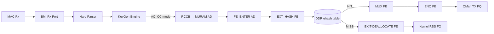
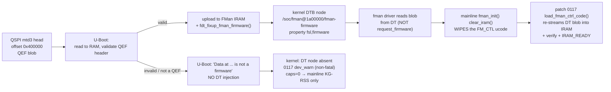

# FMan Microcode 210.10.1 Programming Reference

**Version 1.3**

**Board:** NXP LS1046A Mono Gateway DK (FMan v3, DPAA1)
**Microcode:** QEF 210.10.1 ("Microcode version 210.10.1 for LS1043 r1.0"), `caps=0x17`
**Blob:** 51652 bytes, 12851 code words, SPI `mtd3` @ `0x400000`, DT node `/soc/fman@1a00000/fman-firmware/fsl,firmware`

> **[NOTE — Architecture status UPDATED (2026-08-05), supersedes the 2026-08-01 note below]** The 2026-08-01 "RETIRED/EXPERIMENTAL, NOT the shipping HW-offload path" verdict for the FE-VM ehash/EXT_HASH family was based on lf-6.6.y/lf-5.4 **SDK archives**, whose FE-VM programming core is a documented stub. Reading the **genuine deployed vendor `cdx.ko` driver** instead (`cdx_ehash.c`/`cdx_common.h`, nxp-sdk branch, from board `.106`'s actual running image) shows the opposite: `cmm`'s connection-tracker inserts every accelerated flow via `insert_entry_in_classif_table()` → `fill_key_info()` → `ExternalHashTableAddKey()` — the vendor's real production classification mechanism **is** external-hash, not CC-tree-only. Full reconciliation: `specs/fman-keygen-flow-key-spec.md` §1.2a, `arch/fman-fe-ehash.md` (un-retirement banner). Concrete fix from this finding: **F-163** (§10.5a below) — this branch's own ehash key builder was missing a leading port-ID byte the real vendor key format always carries; fixed. **Still unconfirmed on silicon:** whether the corrected key format actually produces a HIT once FE_ENTER is wired as the live CC root AD (not yet attempted — §10.5a). The CC-tree pass-through numbers below (M2/M5, cdx.ko 8.58 Gbps) remain real and valid; what changed is only the claim that CC-tree is *the* vendor architecture and ehash is not.
>
> **[NOTE — Architecture status (2026-08-01), SUPERSEDED above]** The FE-VM ehash/EXT_HASH/EHASH family described in this reference (Fork-B: `FE_ENTER` → EXT_HASH FE → DDR bucket lookup → MUX → ENQ) is **RETIRED/EXPERIMENTAL**. It never produced a working HIT on silicon (~1.5 Gbps DDR ceiling) and is NOT the shipping HW-offload path. F-156/F-157/F-158 + fe_scaffold oracle proved the CC-match stage not production-worthy. The **shipping path** is CC-tree classification (`CC_KEY_SIZE=16`, `CONT_LOOKUP` group table, CC match rows key+mask) + kernel SW flowtable + manip-chain forwarding. CC-tree scales to 255 keys/node (~8 nodes in 64KiB MURAM → ~2000+ flows). CC comparator reads KG-emitted bytes, not a re-extracted canonical composite (patch 0108). All register offsets, FE types, opcodes, floor/ceiling numbers, and Kconfig facts in this document remain valid regardless of which path is active.

## 1. Identity and Scope

The FMan v3 (LS1046A) microcode is a QEF container (`struct qe_firmware`, `magic="QEF"`) loaded by U-Boot from SPI `mtd3` into FMan IRAM at boot. It implements a table-driven Parse-Classify-Distribute pipeline. The kernel programs it by writing MURAM-resident configuration tables through FMan CCSR registers. It is never invoked via a software API or opcode dispatch.

The Host Command (HC) doorbell is absent from this blob (`caps=0x17 = 0b0001_0111`, bits 0, 1, 2, 4 set; bit 3 `FMAN_CAP_HC_DISPATCH` clear). `fmd_host_cmd_send()` returns `-ENXIO`. The only productive programming path is the register → MURAM → silicon path documented here.

The microcode is proprietary NXP 210.10.1, not the open-source `qoriq-fm-ucode` 106.x/108.x families. The public families are a strictly narrower subset; features marked "210-only" in this document do not exist in public microcode.

### 1.1 The NXP Microcode Families

| Question | Answer |
|---|---|
| What runs on **our board**? | **Proprietary `210.10.1`** QEF blob, U-Boot-injected into the DTB. |
| What is the open-source alternative? | **`106.4.18`** (`fsl_fman_ucode_ls1046_r1.0_106_4_18.bin`). |
| Is **"160"** a valid LS1046A ucode? | **No.** `160` is the **P1023** open-source major. "Open-source 160" for LS1046A is a **misnomer for `106`**. |
| Do both families *support* CC? | Yes — both `106` (IPACC) and `210.x` silicon-support CC/HM/Policer. The gate is **which blob is loaded + executing**, not the family. |
| Does mainline program CC? | **Never.** Mainline DPAA only does KG-RSS. CC is programmed solely by our `fman_pcd_*.c` patches. |
| How is it detected? | QEF header decode (`firmware-check` §4) + kernel caps gate (patch `0086a`, `major>=210 → 0x17`). |
| What is the fallback if it is missing? | Graceful: board boots **mainline KG-RSS only**, no CC caps, `0117` `dev_warn`. There is **no** `request_firmware()` /lib/firmware fallback — by design. |

**NXP open-source ucode versioning** (from the `qoriq-fm-ucode` readme):

- **First number = Primary Major = feature family.** `106` = **IPACC** (includes Custom Classification, Independent-Mode, Host-Commands, IPv4/6 Frag/Reassembly, IPsec, and Header-Manip). `107` = DSAR + partial IPACC. `108` = NG-CAPWAP + FE + IPACC.
- **Second number = HW rev.** `.1` FMANv2 no-SW-DMA-sem · `.2` FMANv2 w/sem · `.3` FMANv3 Rev1 · `.4` FMANv3 > Rev1. LS1046A r1.0 ⇒ `106.4.18`.
- **`210.x` is proprietary** — a newer NXP release **not in the public repo** (`210 ≫ 108`). It lacks the HC host-command doorbell, so our approach uses **direct KG→`FM_CTL|AC_CC` dispatch + result-AD enqueue**, never the HC doorbell.

**Full feature matrix, source: `qoriq-fm-ucode` repo readme (2026-08-05 direct fetch, `gh api repos/nxp-qoriq/qoriq-fm-ucode/contents/readme`):**

| Family | CC | IM | HC | IPF | IPR | HM | DSAR | CAPWAP |
|---|---|---|---|---|---|---|---|---|
| **106** | + | + | + | + | + | + | − | − |
| **107** | + | + | + | − | − | − | + | − |
| **108** | + | + | + | + | + | + | − | + |

CC (Custom/Coarse Classification), IM (Independent-Mode), HC (Host-Commands), IPF/IPR (IPv4/6 Fragmentation/Reassembly), HM (Header Manipulation), DSAR (Deep Sleep Auto Response), CAPWAP (NG CAPWAP). **CC is present in every public family** — the "the `106.4.18` ucode parks identically on bare exact-match CC" note in §13 is not describing a `106`-specific quirk; CC support (and, per this project's own board testing, CC's exact-match-parking failure mode) spans the entire public lineup. `210.x`'s own capability bitmask (§12, `caps=0x17`) has HC's bit clear — a real divergence from every public family, which uniformly ships HC.

**No public register-level documentation exists for any of these families.** The `qoriq-fm-ucode` repo (checked 2026-08-05) contains only binary firmware blobs (`.bin`, one per silicon/family combination) and three PDF release notes (`DPAA_IPACC_ReleaseNote.pdf`, `DPAA_DSAR_ReleaseNote.pdf`, `DPAA_NG_CAPWAP_ReleaseNote.pdf`). The IPACC release note (read in full) is a 28-table changelog spanning `106.x.0` (Feb 2012) through `106.x.18` (Nov 2015) — feature additions, errata (`IPRnn`, `IPACCnn`, `HMn`), and restrictions, with zero register bit-layouts, zero AD/descriptor byte formats, and zero opcode encodings. This corroborates §13's existing claim ("No public documentation, no disassembler, no simulator") at the register level specifically, not just for the FE-VM ISA. **Consequence for this document:** every register-bit-level fact in §4–§10 is derived from this project's own board reads (`.106` vendor stack, `.185` `dpaa1`), the NXP DPAA Reference Manual, or the lf-5.4 LSDK driver source — never from the public `qoriq-fm-ucode` repo, which cannot supply it. A "210-only vs 106/107/108" comparison is only meaningful at the feature-changelog level shown above, not at the bit level.

**Coarse vs fine — the terminology trap.** NXP's PCD has two distinct steering mechanisms whose "coarse/fine" naming is inverted relative to the networking meaning:

- **KeyGen (KG)** hashes a key and spreads flows across a *set* of frame queues → **statistical / COARSE**. This is what mainline DPAA programs by default (RSS).
- **Coarse Classifier (CC)** — despite NXP's name — is the **exact-match lookup tree** = deterministic per-flow steering = the **user's "fine classifier"**. NXP named it "coarse" relative to the *Parser* (which inspects headers byte-by-byte); from a flow-granularity view it is the fine one.

**Mainline DPAA never programs CC.** The practical split is: **mainline / open-source datapath = coarse hash-RSS only**; **fine exact-match CC = our `fman_pcd_*.c` patches + a loaded, executing ucode**.

> **Work with `210`, never request an open-source `106`.** Patch `0117` MUST load the DTB-injected blob (proprietary `210.10.1`) and MUST NOT `request_firmware()` a `106` blob from `/lib/firmware`. Verified: no such code path exists. The load is correct by construction.

Everything in this document has been confirmed against at least one of: the NXP DPAA Reference Manual, the NXP lf-5.4 LSDK driver source, the `we-are-mono/ASK` production code, or a direct `/dev/mem` / debugfs read on the board.


## 2. Architecture Overview

The FMan PCD pipeline has five stages, each programmed through registers and MURAM tables:



The programming model is table-driven. The driver writes MURAM-resident Action Descriptors (16 B each), FE objects (4 to 28 B each), CC match tables, HM command tables, and policer profile records. The microcode reads these tables as frames traverse the pipeline. There is no runtime opcode dispatch, no doorbell protocol, no IRQ-driven completion. The tables are the API.

DDR is used for the ehash bucket array and per-flow records (to avoid MURAM exhaustion). MURAM holds all FE objects, CC trees, HM chains, policer profiles, and the per-port ctrl-params page.

Two dispatch paths exist on 210.10.1:

- **Path 1, FE-VM external-hash** (**210-only**; the only path that flows): RCCB → `FE_ENTER` AD → EXT_HASH FE → DDR bucket lookup → MUX → ENQ (HIT) or EXIT (MISS). The FE-VM opcode interpreter provides terminal BMI-FIFO disposition.
- **Path 2, bare exact-match CC** (`CONT_LOOKUP` → `CONTRL_FLOW` exit): parks on 210.10.1. No terminal FIFO disposition, BMI stall at approximately 45 frames. Do not use. (Empirically observed on LS1046A hardware; confirmed in both 210.10.1 and public 106.4.18 microcode. Not described in NXP documentation — the CC engine expects FE-VM dispatch behind it.)


## 3. QEF Container (Blob Identity)

The microcode blob on SPI `mtd3` (flash offset `0x400000`, 1 MiB partition "fman-ucode") is a QorIQ Engine Firmware container. Header layout:

| Bytes | Field | Value (this board) |
|---|---|---|
| `0x00–0x03` | `__be32 length` | `51652` |
| `0x04–0x06` | `magic` | `"QEF"` |
| `0x07` | `layout_version` | `1` |
| `0x08–0x45` | `id[62]` NUL-terminated | `"Microcode version 210.10.1 for LS1043 r1.0"` |
| `0x46` | `split_IRAM` | `0` |
| `0x47` | `count` (microcode sections) | `1` |
| `0x48–0x49` | `__be16 soc_model` | `0x0413` |
| `+112` | `u8×3 version` | `0xd2 0x0a 0x01` = 210.10.1 |

Microcode entry at `code_offset = 244`, `wcount = 12851` (51404 code bytes). After U-Boot loads it, the kernel reads it from the DT property `/proc/device-tree/soc/fman@1a00000/fman-firmware/fsl,firmware`.

The "for LS1043 r1.0" label is cosmetic. LS1043A and LS1046A share identical FMan v3 silicon; NXP ships one ASK microcode package for both.

### 3.1 Load Path



- **U-Boot owns the load.** It reads the QEF from QSPI `0x400000` into a RAM buffer, validates the header, uploads to FMan IRAM, and `fdt_fixup_fman_firmware()` injects the blob into the kernel DTB. The `fman_ucode` env var is a **volatile boot-computed RAM address** — **never `saveenv`** it.
- **clear_iram bug + patch 0117 (the reload).** Mainline `fman_init()` calls `clear_iram()`, which wipes the U-Boot-uploaded FM_CTL microcode, and mainline **never reloads it** — so the `AC_CC` handler vanishes and CC dispatch silently dies. Patch `0117` `load_fman_ctrl_code()` runs right after `clear_iram`: re-reads the DT QEF, streams the code words via IRAM auto-increment (`IRAM_IADD_AIE`), full verify readback, then `IRAM_READY` — replicating SDK `LoadFmanCtrlCode`. **Non-fatal `dev_warn` if the DT node is absent.**
- **Graceful degradation fallback.** If `mtd3` holds garbage, U-Boot prints `"Fman1: Data at <addr> is not a firmware"`, skips injection, and the board **still boots** — the DT node is absent, `0086a` returns caps `0`, `0117` `dev_warn`s, and the datapath falls back to **mainline KG-RSS** with **no CC offload**.
- **The kernel never calls `request_firmware()`** and there are **no `/lib/firmware/fsl*` files**. The load path is correct by construction: we get whatever U-Boot put in the DTB = `210.10.1`.

> **Partition numbering shifts between builds** — `mtd3` on current builds was `mtd4` on older images. Always confirm with `cat /proc/mtd` before reading raw flash. The 1 MiB at `mtd4` "recovery-dtb" is an FDT, **not** the ucode.

Verification commands:

```bash
# Decode QEF header from DT (no root, always present if U-Boot loaded it):
od -An -tx1 -N76 /proc/device-tree/soc/fman@1a00000/fman-firmware/fsl,firmware

# Decode from raw flash (needs root; confirm partition first with cat /proc/mtd):
sudo od -An -tx1 -N76 /dev/mtd3

# Full inventory:
sudo firmware-check
```

MD5: `6f23090a3d5ae8b302ea41fd90a14d4d`
SHA256: `5f3ed8d32b8659aafd8912d5d9920306350cae7a85884d81859152b9723eff0d`

### 3.2 Vendor userspace observability on `.106` — `cmm`, and why its counters are not a usable oracle

**This subsection is deliberately out of scope for the FMan register/microcode content elsewhere in this document.** `cmm` (Connection/Fast-Forward Manager) is pure userspace plumbing on top of standard Linux netfilter conntrack — not part of the FMan microcode or PCD register model at all. It is documented here only because `.106`'s `cmm` counters are the OBVIOUS first place to look for HIT/MISS ground truth on the vendor reference board, and this section exists to save a future session from repeating that dead end.

**What `cmm` is.** Full source: `nxp-sdk` branch, `kernel/flavors/ask/userspace/cmm/src/`. It subscribes to kernel `ctnetlink` (`NETLINK_NETFILTER`) events via `libnetfilter_conntrack` and, for each conntrack-tracked flow it decides to accelerate, programs the FMan/CDX hardware fast-path via FCI (`kernel/flavors/ask/sources/fci/`). Config: `/etc/config/fastforward` (a deny-list — only excludes FTP/SIP/PPTP-control from acceleration by default). Boot sequence: `cdx_module_init` (kernel-side, applies `/etc/cdx_pcd.xml` via `dpa_app`/`fmc` automatically) → `ls1046a-ask.service` (`/usr/bin/cmm -f /etc/config/fastforward`). Neither step needs manual invocation — **never run `fmc`/`dpa_app` by hand** (confirmed 2026-08-05: doing so once made a board briefly unreachable, requiring a reboot to recover).

**`cmm`'s connection table and `/proc/fqid_stats` do not reflect real hardware classification state on this board build, as of 2026-08-05.** A full prior root-cause analysis (`specs/conntrack-root-cause-analysis.md`, `nxp-sdk` branch, 2026-07-01, commit `4209d315`) traced this precisely, five layers deep:

1. **Kernel `enable_hooks` gate** — healthy (board-verified both 2026-07-01 on `.185` and 2026-08-05 on `.106`: `conntrack -C` increments on real traffic).
2. **VyOS `nftables` `notrack` fallthrough** — healthy (`ask-ct-setup.service`/`ask-ct-resync.timer` strip it; VyOS's own config generator re-adds it on any `firewall`/`nat` commit, hence the 30s self-healing timer).
3. **`cmm`'s netlink socket subscription** — healthy. An earlier diagnosis of "`cmm`'s socket has `groups=0x0`, deaf" was itself a misdiagnosis: `cmm` opens **four** separate `NETLINK_NETFILTER` sockets per process, and naive `Pid`-column filtering of `/proc/net/netlink` only ever finds one of them (not the event-catching one, since Linux netlink autobind only gives the literal-PID address to the *first* socket a process opens on a protocol). Cross-referencing by `/proc/<pid>/fd` inode, not `Pid`, shows the real event-catching socket correctly subscribed (`Groups=00000007` = NEW|UPDATE|DESTROY).
4. **`cmm`'s own internal shadow table (`ct_table[]`) never gets populated** — the real, still-open bug. `cmm -c "query connections"` (or, equivalently, `show stat connection query`) stays empty even for kernel conntrack entries that reach `ESTABLISHED`+`ASSURED`. Leading hypothesis (source-derived, `bin/ci-build-ask-userspace.sh`): `cmm` statically links a 2016-era `libnetfilter_conntrack 1.1.0`, patched with a vendor `01-nxp-ask-comcerto-fp-extensions.patch` (adds `CTA_LAYERSCAPE_FP_*` attribute support) — a separate, older copy from the system's modern dynamic `libnetfilter_conntrack.so.3.8.0` that plain `conntrack -E` uses successfully. The old vendored+patched copy most likely fails to dispatch `nfct_catch()` correctly when messages carry these vendor-specific nested attributes.

**Confirmed and extended 2026-08-05** (this session, `.106`): the July 2026-07-01 analysis's own highest-priority open item was "re-run with genuine transit traffic, not locally-originated" (its own test used a `curl` run directly on the router). This session built a genuine, TTL-verified multi-hop transit path through `.106` using two Linux network namespaces on a peer board plus ingress-interface-keyed policy routing (reusable technique for any 2-box transit test with no third host available — see `plans/NXP-106-DEEP-DIVE-PLAN.md` Phase B for the full recipe). Result: **`cmm`'s connection table stayed at 0 across three separate TCP flows sent through verified genuine transit** — closing that open item and ruling out the "was it just local traffic" confound. Further: `journalctl -u ls1046a-ask.service` was checked for the `CT-TRACE` diagnostic the July analysis itself added (an unconditional print at the top of `__cmmCtCatch()`, `cmm`'s netlink event callback) — only *startup*-sequence `CT-TRACE` lines appear (`cmmCtInit`, thread spawn, fd numbers); **zero per-event `"CT-TRACE: __cmmCtCatch type=..."` lines exist anywhere in the retained journal**, across every boot from 2026-08-01 through 2026-08-05. This means `__cmmCtCatch()` is never invoked at all, for any traffic, ever — a stronger, now-direct confirmation of the vendored-library hypothesis than the July analysis's own more tentative framing.

**Practical consequence for anyone testing PCD/CC dispatch on this board:** do not use `cmm`'s connection table or `/proc/fqid_stats` as a HIT/MISS oracle — they reflect a broken userspace layer, not FMan hardware state. Use direct register/MURAM reads instead (`bin/kg-scheme-read.py`, `bin/muram-mmap-dump.py` — both proven safe, read-only `mmap()` on `/dev/mem`, no `STRICT_DEVMEM` issue on this build), matching the methodology in §7.11a.


## 4. KeyGen Scheme Registers

FMan CCSR base: `0x01A_0000`. KeyGen register block: offset `0x0C_1000`. All scheme registers are accessed indirectly through the KeyGen Action Register (`FMKG_AR` at offset `0x1FC`).

### 4.1 Indirect Access Protocol

To read or write a scheme word:
1. Write `FMKG_AR` = `GO(bit31) | READ(bit30, optional) | WSEL(word_index) | NUM(scheme 0–31) | HPORTID(port 0–15)`
2. Poll `FMKG_AR[GO]` until 0 (hardware clears it on completion)
3. Read/write the indirect window at `0x100 + 4*word_index`

### 4.2 Scheme Register Map (words 0–23 at indirect window `0x100`)

| Word Index | Register Name | Bits | Meaning |
|---|---|---|---|
| **0** | `kgse_mode` | `[31]` | **EN**: master enable for this scheme |
| | | `[30:24]` | **CCOBASE**: group-table entry index this scheme's AC_CC dispatch selects (board-confirmed 2026-08-05, see below) |
| | | `[22:16]` | NIA target engine (same encoding as `FMBM_RFPNE`; see §5) |
| | | `[7:0]` | Action code: `2`=BMI enqueue frame (RSS), `6`=CC/DONE, others per RM |

**CCOBASE, board-confirmed (`.106` vendor stack, `bin/kg-scheme-read.py`, 2026-08-05):** vendor's 12 enabled schemes on a single port show `kgse_mode` values `0x8b000006` down to `0x80000006` (scheme 0→11), i.e. `KG_SCH_MODE_EN(0x80000000) | (CCOBASE=11..0)<<24 | NIA_ENG_FM_CTL|AC_CC(0x000006)`, with `kgse_ccbs=0x00000000` on every scheme. This confirms: (a) `kgse_ccbs` genuinely is unused in AC_CC mode (§4.2 above already noted CCBS must be 0 for AC_CC — this is now board-verified across 12 independent schemes, not just theorized); (b) `FMBM_RCCB` points at a **shared group table with one 16-byte entry per scheme**, and each scheme's own CCOBASE field selects which entry is "its" entry (`effective_target = FMBM_RCCB + CCOBASE * 16`) — not a single-entry table per port. See §7.11a for the confirmed entry-table byte layout.
| **1** | `kgse_ekfc` | `[31:0]` | **Extract Known Fields bitmask**: see §4.3 |
| **2** | `kgse_mv` | `[31:0]` | **Match Vector**: LCV bits that select this scheme |
| **3** | `kgse_ccbs` | `[27:12]` | **CC Base Select**: MURAM offset of CC group table (set to `0` for direct AC_CC dispatch via `FMBM_RCCB`) |
| **4** | `kgse_fqb` | `[23:0]` | **FQID base** for hash distribution |
| | | `[27:24]` | **range**: number of FQ bits to substitute (0→1 FQ, 7→128 FQs) |
| **5** | `kgse_hc` | `[31:16]` | **HMASK**: hash mask for FQID distribution |
| | | `[15]` | **SYM**: symmetric hash (XOR src/dst pairs before hashing) |
| | | `[7:0]` | **HSHIFT**: right-shift applied to hash before masking |
| **8** | `kgse_ppc` | `[31:0]` | Per-packet counter (read-only) |
| **16** | `kgse_spc` | `[31:0]` | **Scheme Packet Counter** (read-only) |
| **23** | (upper words) | | Additional configuration words for advanced features |

Key mode encodings:

| Purpose | `kgse_mode` | Decode |
|---|---|---|
| **AC_CC dispatch** (FE-VM path) | `0x80000006` | EN, CC/DONE action code | **210-only**: dispatches frames to the FE-VM classifier for ehash lookup |
| **RSS hash** (mainline default) | `0x80500002` | EN, `NIA_ENG_BMI \| AC_ENQ_FRAME` | |
| **Policer steering** | `0xC04C0000` | EN, `NIA_ENG_PLCR` with policer profile in low bits | |
| **Scheme disabled** | `0x00000000` | EN clear; scheme skipped during selection | |

For AC_CC dispatch, `kgse_ccbs` MUST be `0x00000000`. A non-zero CCBS triggers an implicit CC group-table walk, which is a different dispatch mechanism and does not work for FE-VM on 210.10.1.

### 4.3 EKFC Field Bit Assignments

Extract Known Fields Command: a 32-bit bitmask. Each set bit instructs the KeyGen to extract one canonical field from the Parse Result.

| Bit | Constant | Field | Size | Notes |
|---|---|---|---|---|
| 31 | `KG_SCH_KN_MACDST` | Ethernet MAC destination | 6 B | |
| 30 | `KG_SCH_KN_MACSRC` | Ethernet MAC source | 6 B | |
| 22 | `KG_SCH_KN_ETYPE` | EtherType | 2 B | |
| 21 | `KG_SCH_KN_VLAN1` | First VLAN TCI | 2 B | |
| **20** | **`KG_SCH_KN_IPSRC1`** | **Outer IP source** | 4 B (IPv4) / 16 B (IPv6) | |
| **19** | **`KG_SCH_KN_IPDST1`** | **Outer IP destination** | 4 B (IPv4) / 16 B (IPv6) | |
| **18** | **`KG_SCH_KN_PTYPE1`** | **L4 protocol number** | 1 B | TCP=6, UDP=17. No EKDV default-value slot; guard against proto=0 at flow insert |
| 17 | `KG_SCH_KN_IPTOS1` | IPv4 TOS / IPv6 Traffic Class | 1 B | |
| 14 | `KG_SCH_KN_IPSRC2` | Inner/tunneled IP source | 4/16 B | Tunneled frame only |
| 13 | `KG_SCH_KN_IPDST2` | Inner/tunneled IP destination | 4/16 B | Tunneled frame only |
| **9** | `KG_SCH_KN_IPSECSPI` | IPsec ESP/AH SPI | 4 B | Do NOT set on non-IPsec schemes; parser has no SPI offset for non-IPsec frames, reads random bytes |
| **2** | **`KG_SCH_KN_L4PSRC`** | **TCP/UDP source port** | 2 B | |
| **1** | **`KG_SCH_KN_L4PDST`** | **TCP/UDP dest port** | 2 B | |
| **0** | **`KG_SCH_KN_TFLG`** | **TCP flags** | 1 B | |

**5-tuple target:** `EKFC = 0x001C0006` = `IPSRC1 | IPDST1 | PTYPE1 | L4PSRC | L4PDST` → 13 bytes.

**4-tuple (no PTYPE1):** `EKFC = 0x00180006` → 12 bytes. Do not use for production: aliases TCP and UDP flows sharing the same IP:port pair (silent misforwarding).

**Extraction byte order:** the silicon extracts fields in descending EKFC bit position (MSB-first). For the 5-tuple key, the byte layout is:

```
Byte:  0  1  2  3  4  5  6  7  8   9 10 11 12
Field: SIP────────  DIP────────  PROTO  SPORT  DPORT
```

Software constructing an ehash flow key MUST assemble bytes in this order or the FE-VM comparator will not HIT.

The IPsec SPI bit (bit 9) MUST NOT be set on non-IPsec schemes. On non-IPsec frames the parser has no SPI offset, reads random bytes, produces an unpredictable key. The mainline kernel's `DEFAULT_HASH_KEY_EXTRACT_FIELDS = 0x00180206` (in `fman_keygen.c`) includes bit 9; when `keygen_port_hashing_init()` applies this value to a scheme, the KG hash for non-IPsec traffic on those ports is per-frame nondeterministic. For any classification or hash-match use, use `EKFC = 0x001C0006` or `0x00180006`.

### 4.4 Scheme Selection Logic

For each received frame:
1. Parse Result `CPID[7:0]` → effective plan = `CPGBASE | (CPID & CPGMASK)` → 32-bit classification plan mask
2. `QLCV = plan_mask & LCV` (LCV = Line-up Confirmation Vector from parser)
3. Walk schemes SC0 → SC31: first scheme where `SI=1` AND `(QLCV & kgse_mv) == kgse_mv` wins
4. No match: `FMKG_GCR[DEFNIA]` default next-interface action

For exact-match classification: set `kgse_mv` to the LCV bits for the protocol combination you want to match, and set `SI=1`.

### 4.5 Hash Algorithm

CRC-64-ECMA-182, reflected polynomial `0xC96C5795D7870F42`, seed `0xFFFFFFFFFFFFFFFF`, **no final complement**. Applied over the assembled key bytes in the extraction byte order from §4.3. The result is a 64-bit hash stored at Internal Context offset `0x48`.

**The silicon stores the raw CRC.** The CRC-64/XZ finalized variant (`crc_raw ^ 0xFFFFFFFFFFFFFFFF`) does NOT match the hardware. The kernel-side `fman_pcd_crc64()` also returns raw (confirmed in NXP `fsl_fman_crc64.h`). When inserting ehash flow keys or computing bucket indices, use the raw form. The finalized variant will never match the hardware.

Self-test invariants:

```
crc64_raw("123456789")  = 0x66A2364420E6C605     ← use this to verify implementations
crc64_xz("123456789")   = 0x995DC9BBDF1939FA     ← finalized variant, does NOT match hardware
```

Reference implementation (Python):

```python
def crc64_raw(data: bytes) -> int:
    poly = 0xC96C5795D7870F42
    crc = 0xFFFFFFFFFFFFFFFF
    for byte in data:
        crc ^= byte
        for _ in range(8):
            crc = (crc >> 1) ^ poly if crc & 1 else crc >> 1
    return crc  # no final complement
```

FQID computation: `KDFV = (hash >> HSHIFT) & HMASK`; `FQID = KDFV | FQBASE`.

Symmetric hash (`SYM=1`): XORs src+dst pairs (MAC, IP, L4 port) before hashing. Both directions of a flow produce the same FQID.

FE-VM ehash bucket index (**210-only**, from lf-5.4 LSDK `get_indexed_hash_bucket`, L7301):

```
bucket_index = (crc64_raw >> ((6 - hashShift) * 8)) & hashMask
```

### 4.6 KGSE_SPC: Scheme Packet Counter

`kgse_spc` (word 16, read-only) is the per-scheme packet counter. It increments for every frame this scheme classifies. Zero SPC on an armed scheme means frames are not being dispatched to it. Check `kgse_mv` against the live `LCV`.


## 5. BMI Port Registers

Per-RX-port registers in the FMan BMI block. Port `0x10` = eth3 (left SFP+), port `0x11` = eth4 (right SFP+). Ports `0x08`–`0x0D` = eth0–eth2 (RJ45).

| Register | Offset | Field | Meaning |
|---|---|---|---|
| **FMBM_RFPNE** | `0x28` | `[22:16]` NIA engine, `[11:0]` action code | Parser-Next-Engine NIA. See NIA decode table below |
| **FMBM_RFQID** | `0x0C` | `[23:0]` | Default RX Frame Queue ID: where frames go if not reclassified |
| **FMBM_RCCB** | `0x34` | `[27:12]` | RX CC Base: MURAM offset of the first Action Descriptor for CC dispatch |
| **FMBM_RICP** | `0x40` | `iceof[15:0]`, `iciof[15:0]`, `icsz[15:0]` | IC copy config: external offset, internal offset, size |

For the hash-match method used to observe the KG hash, `pass_hash_result` must be enabled in the buffer prefix content so the 8-byte KG hash at IC `0x48` is visible in the DDR annotation.

**Buffer prefix, vaddr semantics.** In the mainline `dpaa_eth` RX path, `vaddr = phys_to_virt(qm_fd_addr(fd))` points to the BMan buffer base, not to the frame data. The frame data lives at `vaddr + data_offset`. Consequently `fman_port_get_hash_result_offset()` returns a buffer-start-relative offset, and the standard read `be32_to_cpu(*(__be32*)(vaddr + hash_offset))` is correct.

Buffer layout formula: `hash_result_offset = ext_buf_offset + 40` for the standard `pass_prs_result + pass_time_stamp + pass_hash_result` configuration. Mainline `dpaa_eth` uses `ext_buf_offset = 16` (from `DPAA_TX_PRIV_DATA_SIZE = 16`), producing `hash_result_offset = 56`. ASK SDK production uses `ext_buf_offset = 96`.

### 5.1 NIA-Field Decode (RM §8.5)

Parser-Next-Engine (`FMBM_RFPNE`) and Frame-Enqueue-Next-Engine (`FMBM_RFENE`) share the NIA (Next-Invoked-Action) 32-bit encoding. Bits [22:16] name the target engine; bits [11:0] name the per-engine action code.

| Symbol | Value | Meaning |
|---|---|---|
| `NIA_ENG_HWP` | `0x00440000` | Hardware Parser |
| `NIA_ENG_HWK` (= `NIA_ENG_KG` in vendor SDK naming) | `0x00480000` | KeyGen (RSS / classification hash) |
| `NIA_ENG_BMI` | `0x00500000` | BMI direct |
| `NIA_BMI_AC_ENQ_FRAME` | `0x00000002` | BMI: enqueue frame to destination FQ |
| `NIA_BMI_AC_CC` | `0x00000200` | BMI: dispatch to coarse-classifier (CC / FE-VM entry) | **210-only**: AC_CC dispatch path |
| `NIA_KG_CC_EN` | `0x00000200` | Same bit value as `NIA_BMI_AC_CC`, KeyGen-context name (`fman_port.c`) — set when the port's next engine after KeyGen must be CC |
| `NIA_KG_DIRECT` | `0x00000100` | **KG addresses one scheme directly**, bypassing the SI/match-vector walk (§4.4). OR'd with the low-order `physicalSchemeId` (5 bits, 0–31). Vendor SDK `fm_port.c SetPcd()`'s `PRS_AND_KG_AND_CC` case sets this whenever the port has exactly one bound scheme (`directScheme`). This project's own CC-graft code (`fman_pcd_kg_port_attach_cc()`) never wrote this bit before F-162 (2026-08-05) — confirmed absent from every board dmesg line prior (`rfpne 0x00480200`, no `0x100` bit, no scheme id) |
| `NIA_ORDER_RESTOR` | `0x00800000` | QMan order-restoration flag (order-preserving enqueue) |

Observed pipeline configurations on LS1046A:

| `FMBM_RFPNE` | Decode | Effective RX pipeline | KG in path | Hash slot valid |
|---|---|---|---|---|
| `0x00500002` | `NIA_ENG_BMI \| AC_ENQ_FRAME` | Parser → BMI → direct enqueue | no | no (stale/garbage) |
| `0x00480000` | `NIA_ENG_HWK` | Parser → KG → RSS-hash → BMI enqueue | yes | yes (KG raw CRC-64) |
| `0x00480200` | `NIA_ENG_HWK \| AC_CC` | Parser → KG → AC_CC dispatch, **generic SI/match-vector scheme selection** (§4.4) | yes | yes (KG raw CRC-64) | **210-only**: AC_CC dispatch path |
| `0x00480200 \| NIA_KG_DIRECT \| scheme_id` (e.g. `0x00480304` = scheme 4) | `NIA_ENG_HWK \| AC_CC \| KG_DIRECT` | Parser → KG (**scheme addressed directly**, no SI/match-vector walk) → AC_CC dispatch | yes | yes | **210-only, F-162 (2026-08-05)**: required by vendor SDK for a single-bound-scheme port; board-confirmed via `dev_info` log `"fman_port: KG direct-scheme addressing set, scheme %u (rfpne 0x%08x)"` |
| `0x00440200` | `NIA_ENG_HWP \| AC_CC` | Parser → CC (KG skipped) | no | no |

The mainline `dpaa_eth` default for kernel RSS delivery is `0x00500002`: no KeyGen. To engage the KG for either RSS or AC_CC, RFPNE must be rewritten to `0x00480000` or `0x00480200` on the target port. Before trusting any read at `hash_result_offset`, dump RFPNE and confirm bits [22:16] = `0x48`. If bits [22:16] = `0x50`, the KG did not run and the annotation hash slot is not populated by the KG.

**Note (2026-08-05):** `NIA_KG_DIRECT` alone does not explain the RX-stall this project observed under `cc_test`-driven AC_CC dispatch (F-162 added it, board-confirmed live and correctly encoded, stall persisted regardless — see `plans/CC-TREE-REBUILD-PLAN.md`). It is documented here because it is a real, vendor-required field this project was missing, not because it is a proven fix for that stall.

### 5.2 Full BMI RX Port Register Comparison — dpaa1 vs vendor, and the port-wedge investigation (2026-08-05)

**Context.** Arming AC_CC/FE_ENTER dispatch on port `0x11` (eth4) via this branch's `fe_arm engage` debugfs verb wedges the port immediately and 100% reproducibly (4/4 cold-boot cycles as of this section) — before any test traffic is even sent, with zero fault signature anywhere (no `FMFP_PS` STL bit, all DCSR fault registers — `bmi_err`, `fpm_err`, `kg_err`, `parser_err`, `pol_err`, `qmi_err` — clean both before and immediately after arming). Only a full cold power cycle clears it; `fe_arm disengage` does not. This matches the project's documented "silent WAIT, no fault latched" corruption class (the iter-50 fault-capture precedent) and the broader "port goes deaf, cold boot required" failure class (F-069, F-076, F-125).

This section documents a full register-level comparison against the genuine vendor `cdx.ko` stack running on `.106` (same physical hwport `0x11`), read via `bin/ask-pcd-regdump.py` (`/dev/mem`, read-only) on both boards, plus a methodical trace of the NXP SDK source (`nxp-sdk` branch, `kernel/flavors/ask/sdk-sources/.../Peripherals/FM/Port/fm_port.c`, `FM/SP/fm_sp.c`, `FM/Pcd/fm_pcd.c`, `FM/Pcd/fm_ehash.c`) to determine, for every register that differs, whether the difference is causally relevant to the wedge or merely a general-port-config difference unrelated to AC_CC specifically.

#### 5.2.1 Register-by-register table

`fmbm_rfpne` (the actual AC_CC/HWK dispatch trigger, §5.1) matches exactly between vendor and our armed state. Everything below is registers our arm path either doesn't touch, or that differ in value.

| Register | Offset | Vendor (`.106`) | Ours (`.185`, pre-arm baseline) | Status |
|---|---|---|---|---|
| `FMBM_RIM` (Internal Buffer Margins) | `0x18` | `0x60000000` (96 B) | `0x00000000` (never set by our arm path) | **RESOLVED — not the cause.** §5.2.2: reserved scratch space for header-manip opcodes only, unrelated to classification. Legitimately 0 for our manip-free test. |
| `FMBM_RICP` (Internal Context Parameters) | `0x14` | `0x00000007` | `0x000e0203` | **RULED OUT by live test.** §5.2.3: F-166 set this to the exact vendor value on arm — wedge persisted unchanged (4th cold-boot cycle). Reverted (commit `2262727a`). |
| `FMBM_RSTC` (Statistics Counters control) | `0x200` | `0x80000000` (enabled) | `0x00000000` (disabled) | Explains why `FMBM_RFRC` (RX Frame Counter) reads 0 on `.185` even under confirmed working traffic — **not a live-traffic health signal on this build**, a pure counting-enable difference. Not investigated as a wedge cause (a disabled counter cannot itself block RX). |
| `FMBM_RFNE` (pre-parser next engine) | `0x20` | `0x10440000` | `0x00440000` | Bit 28 differs; meaning not decoded. Open, low priority — this is upstream of the parser, before classification. |
| `FMBM_RPSO` (Parse Start Offset) | `0x2C` | `0x00000060` (96 B) | `0x00000000` | Open. Possibly paired with `FMBM_RIM`'s margin (both 0 together may be internally self-consistent for a manip-free config, matching §5.2.2's conclusion) — not confirmed either way. |
| `FMBM_RPP` (Policer Profile) | `0x30` | `0x01000000` (policer engaged) | `0x00000000` | Likely orthogonal — rate limiting is a separate mechanism from classification dispatch. Not investigated live. |
| `FMBM_RFENE` (post-enqueue next engine) | `0x70` | `0x00000022` | `0x00d40000` | §5.2.4: traced to `AttachPCD()`'s NIA-restore mechanism, found **dormant** for standard CC-tree/AC_CC setups in this source tree — likely general port-init tuning, not PCD-attach-specific. Deprioritized. |
| `FMBM_RCMNE` (continuous-mode next engine) | `0x7C` | `0x0000000e` | `0x00000000` | Same as `FMBM_RFENE` above — same dormant mechanism, same conclusion. Deprioritized. |

#### 5.2.2 `FMBM_RIM` fully traced — closed, not the cause

Source: `FmSpBuildBufferStructure()` (`FM/SP/fm_sp.c`):
```c
/* save extra space for manip in both external and internal buffers */
if (p_BufferPrefixContent->manipExtraSpace) {
    uint8_t extraSpace;
    extraSpace = p_BufferPrefixContent->manipExtraSpace;
    p_FmSpBufferOffsets->manipOffset = p_FmSpBufMargins->startMargins;
    p_FmSpBufMargins->startMargins += extraSpace;
    *internalBufferOffset = extraSpace;
}
```
`internalBufferOffset` (which becomes `FMBM_RIM` via `int_buf_start_margin`, `FM/Port/fm_port.c` ~line 695) is **only** set when the port's buffer-prefix config declares `manipExtraSpace` — i.e. it is scratch space reserved for header-manipulation opcodes (STRIP_ETH_HDR / TTL_DECREMENT / ETH_HEADER_REBUILD, §10.1), not anything KeyGen/CC/ehash-related. Vendor's `.106` shows 96 B because its live PCD config uses manip opcodes on this port; our test uses none. `0x00000000` is the *correct* value for a manip-free classification test, not a missing default. This closes the `FMBM_RIM` line of investigation — no live test needed.

#### 5.2.3 `FMBM_RICP` fully traced — ruled out by live test, mechanism now understood

Decoded bit layout (`ic_ext_offset<<16 | ic_int_offset<<8 | ic_size`, all in 16-byte units — `BMI_IC_TO_EXT_SHIFT=16`, `BMI_IC_FROM_INT_SHIFT=8`, `FMAN_PORT_IC_OFFSET_UNITS=0x10`, confirmed identical in both vendor SDK and our mainline driver):

| | ic_ext_offset | ic_int_offset | ic_size |
|---|---|---|---|
| Vendor `0x00000007` | 0 B | 0 B | 112 B |
| Ours `0x000e0203` | 224 B | 32 B | 48 B |

Source: `FM/Port/fman_port.c` (the vendor's flib-style driver, ~line 108) computes a value from `cfg->ic_ext_offset`/`ic_int_offset`/`ic_size` via the standard formula, then **unconditionally discards it**: `tmp = 0x00000007;` immediately before the register write, no explanatory comment. This is disconnected from the fancier `FmSpBuildBufferStructure()` computation described in §5.2.2 (which would compute IC size from `passPrsResult`/`passTimeStamp`/`passHashResult` flags, maxing out around 48 B, not 112 B) — the actual silicon write is a flib-level hardcoded constant regardless of what the higher-level config layer computed. Our value (`0x000e0203`) comes from mainline `dpaa_eth`'s own `fman_port_cfg_buf_prefix_content()` mechanism, tuned for RSS-hash-in-skb / checksum offload, set once at port init, unrelated to and unaffected by AC_CC arming.

F-166 (`bin/kernel-fixups/F_166.py`, commit `d2f3e875`) live-tested overriding this to the exact vendor value (`0x00000007`) when AC_CC is armed. Confirmed correctly applied (`fmbm_ricp=0x00000007` read back live via `/dev/mem` at arm time) — **the wedge persisted unchanged.** Reverted (commit `2262727a`). This closes `FMBM_RICP` as a cause: even byte-exact reproduction of the vendor's real register write does not resolve the wedge.

#### 5.2.4 `AttachPCD()`/`DetachPCD()`'s NIA-restore mechanism — traced, found dormant for CC-tree

`FM/Port/fm_port.c`'s `AttachPCD()` (called when a PCD-configured port transitions from BMI-to-BMI state to PCD-active) conditionally restores several saved registers based on `p_FmPort->requiredAction` bitflags: `FMBM_RCMNE`, `FMQM_PNEN` (QMI-side, not BMI), `FMBM_RFENE`, `FMQM_PNDN` (QMI-side), and can restrict the port to a single RISC core via `FmSetNumOfRiscsPerPort(fm, hwport, 1, ...)` (flag `UPDATE_FMFP_PRC_WITH_ONE_RISC_ONLY`). These flags are set via a companion setter, `FmPortGetSetCcParams()`'s `setCcParams` half.

Searched every caller of that setter across the entire PCD module tree (`FM/Pcd/*.c`): **only `fm_manip.c` calls it, and only with `UPDATE_OFP_DPTE`** (an OH-offline-parsing-port-specific manip flag). Nothing in `fm_cc.c` (the Coarse Classification / CC-tree module) or anywhere else in the searched tree ever sets `UPDATE_NIA_FENE`, `UPDATE_NIA_CMNE`, `UPDATE_NIA_PNEN`, `UPDATE_NIA_PNDN`, or `UPDATE_FMFP_PRC_WITH_ONE_RISC_ONLY` for a standard CC-tree/AC_CC setup in this SDK source snapshot. This mechanism appears to exist for a narrower manip-chain use case than general PCD attach. Consequently the `FMBM_RFENE`/`FMBM_RCMNE` differences in §5.2.1 are most likely general per-port init-time tuning (same category as `FMBM_RICP`), not something PCD-attach specifically requires — deprioritized as a wedge cause, not ruled out by a live test.

#### 5.2.5 Host Command (HC) synchronization — a lead that does not survive cross-checking

`FM/Pcd/fm_ehash.c` — the vendor's actual external-hash table module, the direct ancestor of this branch's own ehash/Fork-B implementation — calls `FmPcdHcSync()` at least 9 times throughout its normal table-set/key-add/key-delete operations (e.g. `ExternalHashTableSet`, `ExternalHashTableAddKey`). This project has separately and extensively confirmed (§1, §3) that the 210.10.1 microcode blob lacks `FMAN_CAP_HC_DISPATCH` (`caps=0x17`, bit 3 clear; `fmd_host_cmd_send()` returns `-ENXIO`). This looked like a strong candidate: HC might play a synchronization/commit role during ehash table operations that this branch's from-scratch arm path has no substitute for.

**This does not hold up under cross-checking.** `.106` runs the *identical* 210.10.1 blob. If HC sync were genuinely required for ehash operations to succeed, `.106` would show `"FmPcdHcSync failed"` (the module's own `printk` on sync failure) in dmesg — a full `dmesg` search on `.106` found **zero** hits for any HC-related string. Combined with this project's separately-confirmed finding that `cmm`'s connection-tracker never actually fires on `.106` (`CT-TRACE` shows zero invocations of `__cmmCtCatch` across every boot observed) — the more likely explanation is that `.106`'s `ExternalHashTableAddKey()` path (and therefore any `FmPcdHcSync()` calls inside it) is simply **never reached** on that board's current traffic, not that HC sync silently succeeds. This means `.106`'s earlier decisive 400+-frame stress-test success (§14, cross-reference to the NXP-106 deep-dive plan) most likely exercised a statically-preconfigured classification path from `cdx_pcd.xml` (or plain kernel software forwarding), **not** the dynamic ehash-insert path this branch's F-163/F-165 work targets — i.e. `.106`'s success may not actually validate the mechanism under test here at all. Flagged as a genuinely open methodological question, not resolved.

#### 5.2.6 Status summary

| Hypothesis | Status |
|---|---|
| `FMBM_RIM` | Closed — understood to be unrelated (manip scratch space), no live test needed |
| `FMBM_RICP` | Closed — live-tested negative (F-166, reverted) |
| `AttachPCD()` NIA-restore / single-RISC restriction | Deprioritized — traced to be dormant for CC-tree in this SDK snapshot |
| Host Command sync | Open, weakened — doesn't survive the `.106` cross-check; reframes the question as "does `.106`'s working config even exercise ehash" rather than "is HC required" |
| `FMBM_RFNE` bit 28, `FMBM_RPSO`, `FMBM_RPP` | Open, untested, no hypothesis formed yet |
| **The wedge itself** | **Root cause not found as of this section.** Three concrete register hypotheses tested/closed; the investigation is shifting from "which register is missing" toward "does the reference (`.106`) even exercise the mechanism being tested" |


## 6. FM_CTL Params Page (per-port, 256 B MURAM)

Allocated once per port. The FMan Controller reads this page during frame processing. Exact layout (`t_FmPcdCtrlParamsPage`, packed 256 bytes):

| Offset | Field | Bits | Meaning |
|---|---|---|---|
| `0x00` | `reserved0[16]` | | |
| `0x10` | `iprIpv4Nia` | `[31:0]` | IP Reassembly v4 next-interface action (unconsumed) |
| `0x14` | `iprIpv6Nia` | `[31:0]` | IP Reassembly v6 NIA (unconsumed) |
| `0x18` | `reserved1[24]` | | |
| `0x30` | `ipfOptionsCounter` | `[31:0]` | IP Fragmentation options counter (unconsumed) |
| `0x34` | `reserved2[12]` | | |
| **`0x40`** | **`misc`** | `[31:0]` | `FM_CTL_PARAMS_PAGE_ALWAYS_ON = 0x100`; **`OFFLOAD_SUPPORT_EN = 0x40000000`** (**210-only**: enables FE-VM offload on this port) |
| `0x44` | `errorsDiscardMask` | `[31:0]` | Frame error discard mask (`0x012ee0e8`) |
| `0x48` | `discardMask` | `[31:0]` | |
| `0x4C` | `reserved3[4]` | | |
| `0x50` | `postBmiFetchNia` | `[31:0]` | NIA after BMI buffer fetch |
| **`0x54`** | **`internalFEBufferManagementIndexAddr`** | `[31:0]` | **210-only**: MURAM offset of per-port FE buffer free-list |
| **`0x58`** | **`internalFEBufferDepletionCounter`** | `[31:0]` | **210-only**: Reset to 0 on enable |
| `0x5C` | `reserved4[164]` | | Pad to 256 B |

Init values (from lf-5.4 LSDK `FmPortSetFESupport`, **210-only** for FE-VM path):
- `+0x40` = `0x00000100`
- `+0x44` = `0x012ee0e8`
- `+0x54` = MURAM offset of the per-port FE buffer management free-list (written at arm time)
- `+0x58` = `0x00000000` (reset depletion counter at arm time; zeroed at disengage)

The `internalFEBufferManagementIndexAddr` and `internalFEBufferDepletionCounter` are only written when `FmPortSetFESupport` is called (the FE-VM path, **210-only**). They are left zero for bare exact-match CC.


## 7. FE Types: The Complete Command Set (210-only)

The FE-VM opcode interpreter (**210-only**) dispatches on the type field in bits `[31:26]` of the first MURAM word of each FE object. These are the ONLY commands the 210.10.1 FE-VM implements. Each FE object lives in the MURAM pool (100 slots × 28 B = 2800 B total, allocated by `AllocFEObjs`, **210-only**).

### 7.1 FE Type Table (210-only)

All six FE types are **210-only** — they do not exist in public 106.x/108.x microcode.

| Type Constant | Word0 | Name | MURAM Size | Purpose |
|---|---|---|---|---|
| `0x01000000` | - | **HM** (Hash Match) | 16 B | Header Manipulation FE: executes HMCD/HMCT chains inline |
| `0x02000000` | `0x02010000` | **ENQ** | 16 B | Terminal enqueue to QMan FQ. Word1 encodes the 24-bit FQID |
| `0x03000000` | `0x03800000` | **EXIT** (DEALLOCATE) | 4 B | Free workspace allocation, terminate frame. Terminal MISS disposition |
| `0x04000000` | `0x04000000` | **MUX** | 8 B | Multiplexer: branches HIT → nextFE / MISS → implied EXIT. Singleton |
| `0x05000000` | - | **TRANSITION** | 8 B | State transition relay for HIT forwarding. Singleton |
| `0x06000000` | `0x06000000` | **EXT_HASH** | 28 B | External hash table lookup in DDR: core FE-VM fastpath |

### 7.2 EXT_HASH FE: Byte-Level Layout (210-only)

The central FE object. It performs: raw CRC-64(hardware key) → bucket index → DDR bucket walk → key comparison → HIT/MISS dispatch.

| Word | Offset | Size | Field | Dormant Value |
|---|---|---|---|---|
| `w0` | `0x00` | 4 B | **misc**: `FMAN_FE_TYPE_EXT_HASH (0x06000000)` \| `contextOffsetInWS` \| aging \| stats | `0x06000000` |
| `w1` | `0x04` | 4 B | `(hashMask << 16)` \| `((contextSize-1) << 8)` \| `hashShift` | mask=`0x7FFF`, contextSize=`key_size`, shift=0 |
| `w2` | `0x08` | 4 B | `table_base_hi`: DDR bucket array bus address, high 16 bits of 48-bit | `0x00000000` (dormant) |
| `w3` | `0x0C` | 4 B | `table_base_lo`: DDR bucket array bus address, low 32 bits | table DMA addr lo |
| `w4` | `0x10` | 4 B | `missResult`: miss-result context MURAM offset | `0x00000000` (dormant) |
| `w5` | `0x14` | 4 B | `nextFEPtr`: **HIT** link = MURAM offset of the MUX singleton | `pcd->fe_mux_off` |
| `w6` | `0x18` | 4 B | `missNextFE`: **MISS** link = MURAM offset of the EXIT singleton | `pcd->fe_exit_off` |

**Critical address-space split.** `table_base_hi/lo` (`w2`/`w3`) carry a DDR bus address (`dma_addr_t` from `dma_alloc_coherent`). `nextFEPtr` and `missNextFE` (`w5`/`w6`) carry MURAM offsets (gen_pool offsets). Do not mix them.

**contextSize** (in `w1[15:8]`): encoded as `contextSize - 1`. This value MUST equal the EKFC extracted key length (13 for 5-tuple, 12 for 4-tuple, 8 for a hypothetical 3-tuple), NOT the DDR record size. For 5-tuple (13 bytes), `w1[15:8]` = `0x0C` (13 - 1).

**Known bug in patch 0131:** `fman_pcd_fe_hash_encode()` hardcodes `FMAN_FE_HASH_CONTEXT_SIZE=256` (the DDR record size) in the `contextSize` field rather than deriving it from `t->key_size`. This causes the EXT_HASH FE to compare 256 bytes per DDR entry instead of the actual key length. Fix: replace the constant with `t->key_size`.

**hashMask** (in `w1[31:16]`): `(mask + 1)` must be an exact power of two. Valid masks: `0x0, 0x1, 0x3, 0x7, 0xF, ..., 0x7FFF` (32768 buckets).

**contextOffsetInWS** (in `w0`): tells the EXT_HASH comparator where within the FE workspace the extracted key starts. The SDK passes `0`. The raw extracted key is not preserved at any addressable IC offset (the Field Extraction Unit produces the key transiently and feeds it to the CRC64 engine; only the hash is retained at IC `0x48`). The FE-VM comparator reads from the microcode's implicit staging area; `contextOffsetInWS = 0` selects this default and works in ASK1 production with GEC extraction.

### 7.3 ENQ FE: Byte Layout (210-only)

| Word | Offset | Contents |
|---|---|---|
| `w0` | `0x00` | `FMAN_FE_TYPE_ENQ (0x02010000)` — bit 16 = fqidEn; low byte = ws_offset |
| `w1` | `0x04` | FQID (24-bit) when fqidEn=1, or NIA when fqidEn=0 |
| `w2` | `0x08` | context — SDK writes `(rspid << 24) \| fqid` |
| `w3` | `0x0C` | next-FE MURAM offset (chain, e.g. EXIT) |

**⚠ ENQ is NOT a viable MISS→kernel delivery terminal (silicon-proven 2026-07-15/16).** Three variants failed with the workspace pool armed (Gate A passed): (1) NIA-mode `w0=0x02000008, w1=0x00500002` (`NIA_ENG_BMI|AC_ENQ_FRAME`) — zero sustained delivery (one ARP reply passed, then the path died — consistent with FE-buffer depletion); (2) vendor byte encoding — same; (3) fqidEn=1 with the FQID written to the DDR miss context — **wrong memory space**: with ws_offset set, the ENQ reads its FQID from the **MURAM FE workspace** (populated by the microcode during EXT_HASH execution), not from any CPU-writable DDR buffer. MISS→kernel delivery belongs to the CC-layer miss-AD (§7.11), matching the vendor architecture. The ENQ's proven role is the **HIT** terminal (MUX → TRANSITION → ENQ → TX FQ).

### 7.4 EXIT FE: Byte Layout (210-only)

| Word | Offset | Contents |
|---|---|---|
| `w0` | `0x00` | `FMAN_FE_TYPE_EXIT | FMAN_FE_EXIT_DEALLOCATE (0x03800000)` |

EXIT-DEALLOCATE is a real terminal MISS disposition on 210.10.1: AC_CC arm → MISS → EXIT → port does NOT park. **It is a frame DROP, not kernel delivery** — proven as 100% packet loss on the MISS path. EXIT-without-DEALLOCATE is NOT viable: in AC_CC mode there is no scheme-NIA fallback after the FE-VM, so the frame strands in the BMI FIFO → pool exhaustion → watchdog reset (proven 2026-07-15).

### 7.5 MUX FE: Byte Layout (210-only)

| Word | Offset | Contents |
|---|---|---|
| `w0` | `0x00` | `FMAN_FE_TYPE_MUX (0x04000000)` |
| `w1` | `0x04` | next-FE MURAM offset (TRANSITION singleton) |

### 7.6 TRANSITION FE: Byte Layout (210-only)

| Word | Offset | Contents |
|---|---|---|
| `w0` | `0x00` | `FMAN_FE_TYPE_TRANSITION (0x05000000)` |
| `w1` | `0x04` | next-FE MURAM offset (ENQ FE) |

### 7.7 FE_ENTER Root AD: Byte Layout (210-only)

The AD at `FMBM_RCCB` that enters the FE-VM. NOT a pooled FE object; a standalone 16-byte MURAM AD.

| Word | Offset | Contents |
|---|---|---|
| `w0` | `0x00` | **`0x40800000`** = `CONT_LOOKUP` (byte [31:24] = `0x40`) \| `NIA_ORDER_RESTOR` (`0x00800000`) |
| `w1` | `0x04` | `0x00000000` (reserved) |
| `w2` | `0x08` | **`0x000000F6`** = `pcAndOffsets` = OPC_FE_ENTER |
| `w3` | `0x0C` | next-FE MURAM offset (the EXT_HASH FE) |

`w0` encodes two independent bits: `CONT_LOOKUP` (byte `[31:24] = 0x40`, expanding to `0x40000000` in the word) enters the FE-VM lookup path, and `NIA_ORDER_RESTOR` (`0x00800000`) is the QMan order-restoration flag for order-preserving enqueue. OR'ing the two produces `0x40800000`. `NIA_ORDER_RESTOR` does not allocate a workspace; workspace behavior is governed by microcode-internal state and controlled through `contextOffsetInWS` in the EXT_HASH FE (see §7.2).

### 7.8 FE Object Pool (210-only)

Pool init (`AllocFEObjs`, lf-5.4 LSDK):
- 100 FE objects × `FM_PCD_FE_MAX_SIZE` (28 B) = 2800 B MURAM, 8-byte aligned
- List-managed: `availableFeLst` (free) / `enqLst` (in-use)
- Inverse: `ReleaseFEsList()` drains both lists, frees each `h_FE` via `FM_MURAM_FreeMem`

MURAM is iomem; use `memset_io` / `__iowrite32_copy` for all accesses.

### 7.9 FE Object Sizes

| Constant | Value | FE Type |
|---|---|---|
| `FM_PCD_FE_ALIGN` | 8 | All FE objects |
| `FM_PCD_FE_T_EXT_HASH_SIZE` | 28 (4×7) | EXT_HASH |
| `FM_PCD_FE_T_HM_SIZE` | 16 (4×4) | HM |
| `FM_PCD_FE_T_ENQ_SIZE` | 16 (4×4) | ENQ |
| `FM_PCD_FE_T_TRANSITION_SIZE` | 8 (4×2) | TRANSITION (singleton) |
| `FM_PCD_FE_T_EXIT_SIZE` | 4 (4×1) | EXIT (singleton) |
| `FM_PCD_FE_MAX_SIZE` | 28 | Max of all types (= EXT_HASH) |

### 7.10 FE-VM Programming Core (210-only)

The FE-VM programming core comprises `fman_pcd_fe_*_build()` functions plus `fman_pcd_fe_build_contexts()`. The `fman_pcd_ehash_bucket_index()` CRC-64 bucket indexer is verbatim-identical to the lf-5.4 LSDK `get_indexed_hash_bucket()` implementation.

Equivalent lf-5.4 LSDK functions for reference:

| Function | LSDK Location (999-patch) | Purpose | Current equivalent |
|---|---|---|---|
| `FmPcdCcBuildFE` | L8883 | Programs a single FE object | `fman_pcd_fe_enq_build()`, `fman_pcd_fe_hash_encode()` |
| `FmPcdCcBuildContextByFE` | L8954 | Populates per-port FE context | `fman_pcd_fe_build_contexts()` |
| `get_indexed_hash_bucket` | L7301 | CRC64 bucket indexer | `fman_pcd_ehash_bucket_index()` |

The lf-5.4 LSDK source is at `/home/vyos/ask-ref/ask/patches/kernel/999-layerscape-ask-kernel_linux_5_4_3_00_0.patch`. The lf-6.6.y and lf-6.12.y kernels stub these functions as empty `UNUSED()` no-ops; the equivalents above are the operational path forward on mainline.

### 7.11 CONT_LOOKUP Group AD + Settled Dispatch Topology (RM 8.7.4.1)

The AD species that fronts the FE-VM in the settled topology (2026-07-16, supersedes the "RCCB→FE_ENTER direct" ruling of 2026-07-10). A 16-byte MURAM AD at `FMBM_RCCB`:

| Word | Offset | Contents |
|---|---|---|
| `w0` | `0x00` | `(numKeys << 24) \| (matchTableAddr & 0xFFFFFF)` |
| `w1` | `0x04` | `(adTableAddr & 0xFFFFFF)` |
| `w2` | `0x08` | `0x40000000 \| ((keySize-1) << 24)` |
| `w3` | `0x0C` | `0x00000000` |

**Settled dispatch topology:**

```
RCCB → CONT_LOOKUP group AD
   ├─ numKeys=0 (shipping): every frame → miss-AD → port KG-default/PCD FQ → kernel
   └─ numKeys>0 (future HIT): match entry AD → FE_ENTER (§7.7) → EXT_HASH (§7.2) → FE-VM
```

- The pass-through (`numKeys=0`) is silicon-proven: 7.37 Gbps / 0.16% CPU / zero QMan errors (build 28809182051, 2026-07-06). MISS→kernel delivery is a **CC-layer responsibility** (miss-AD hardware enqueue), matching the vendor CDX architecture — never an FE-VM ENQ (§7.3 warning).
- **miss-AD FQID** must be the port's kernel-polled KG-default/PCD FQ, sourced from the `fqids` sysfs at engage time (eth3: PCD base `0x200`; eth4: Rx default `0x292`, PCD `0x300–0x37F`). A TX-channel FQ (e.g. `0x2b9`) or any un-polled FQ silently blackholes the frames.
- The pre-RM-8.7.4.1 `{flags, next_ptr}` group-entry format decodes as `RESULT_CF fqid=0` (reserved-invalid) → QMan Invalid-Enqueue-State storm. Do not use.
- **Engage inverse:** free group table + node/AD tables on disarm, clear the driver's group-offset bookkeeping. The historical scaffold leaked +36 B/cycle; the pcd-snapshot gate (`MURAM used == 0` after disengage) is the acceptance test.
- Any `numKeys>0` entry targeting `FE_ENTER` makes the per-port FE workspace pool (`FmPortSetFESupport`, params page `+0x54`/`+0x58` — see [`fman-fe-ehash.md`](fman-fe-ehash.md) §4) **mandatory** before the first frame dispatches.

### 7.11a Vendor group-table entry format, board-confirmed (`.106`, 2026-08-05)

The table above (§7.11) is this project's own single-entry model, matched against SDK doc comments. Direct MURAM inspection of `.106`'s genuine, working vendor stack (`bin/muram-mmap-dump.py` + `bin/kg-scheme-read.py`, hwport `0x11` — the same physical port, `1a91000.port`, as this project's own `eth4`) shows a **different, richer structure**: `FMBM_RCCB` on real hardware points at a **shared table of one 16-byte entry per enabled KeyGen scheme**, not a single entry. With 12 schemes enabled, `FMBM_RCCB`+`0x00`..`0xB0` held 12 contiguous 16-byte rows, then zero padding. Each scheme's own `kgse_mode` CCOBASE field (§4.2) selects its row: `effective_target = FMBM_RCCB + CCOBASE*16`.

Per-entry word layout, decoded and **verified byte-exact against `/etc/cdx_pcd.xml`'s per-distribution `keysize` attribute for all 12 rows** (12/12 exact match, zero offset — `cdx_udp6_cc`/`cdx_tcp6_cc` keysize 38 ↔ rows with sizeField 38, `cdx_esp6_cc` keysize 22 ↔ sizeField 22, `cdx_multicast6_cc` keysize 34 ↔ sizeField 34, `cdx_ethernet_cc` keysize 15 ↔ sizeField 15, `cdx_pppoe_cc` keysize 11 ↔ sizeField 11, `cdx_tuple3udp4/tcp4_cc` keysize 8 ↔ sizeField 8, `cdx_tuple3udp6/tcp6_cc` keysize 20 ↔ sizeField 20, `cdx_udp4/tcp4_cc` keysize 14 ↔ sizeField 14, `cdx_esp4/multicast4_cc` keysize 10 ↔ sizeField 10):

| Word | Offset | Contents (confirmed) |
|---|---|---|
| `w0` | `0x00` | `FM_PCD_AD_CONT_LOOKUP_TYPE(0x40000000)` in bits `[31:30]` — **same type tag this project's own `cc_write_group0()` uses**, correcting an earlier (2026-08-05, same-day) hypothesis that vendor uses a categorically different AD species here. Bits `[29:24]` = classification **keysize, direct value, no −1 adjustment** (contrary to the `(sizeOfExtraction-1)<<24` SDK C-code comment for the code path this project modeled §7.11 on — that comment evidently describes a different call site than what `dpa_app`/`fmc` actually emits). Low 24 bits = **constant `0x400008` across all 12 entries** regardless of scheme — a shared resource pointer, not yet decoded. |
| `w1` | `0x04` | NOT a literal `numKeys<<24 \| LCL_MASK \| MatchTableOffset` per §7.11's model — top byte takes only two observed values (`0xd6`=214, `0xcc`=204, `0xeb`=235) implausible as literal key counts; low 23 bits (`0x044100`–`0x73dd00` range) too large to be in-range MURAM offsets. Most likely packed hash/CRC configuration, not yet decoded. |
| `w2` | `0x08` | Constant `0x0402` in the top 16 bits across all 12 entries. Low byte shows a plausible parse-code-family pattern: `0x0f` for the four TCP/UDP-port-based classifications (udp4/tcp4/udp6/tcp6), `0x08` for most others (ipv4/ipv6/esp/multicast/tuple3), `0x04` for `pppoe` — a real per-protocol-family selector, but the exact code values do **not** match this project's own `CC_PC_GENERIC_IC_GMASK=0x2B` convention. Vendor uses a different parse-code scheme at this layer. |
| `w3` | `0x0C` | Clustered around `0x0048030x` (x = 6–b) for most entries; the first two (rows 0–1, `ethernet`/`pppoe`) differ at `0x004c8000`. Not yet decoded — plausibly a further MURAM pointer (`0x048030x`/`0x04c8000` are both in-range MURAM offsets, ~0x300 bytes apart from the group table itself, worth a follow-up targeted dump). |

**What this settles:** the type tag and keysize field prove vendor's per-scheme root AD is structurally the same `CONT_LOOKUP` species this project already builds — the earlier explanation "vendor uses a fundamentally different AD species (`t_ExtHashFe`)" for why real hardware survives sustained traffic where `cc_test` freezes within 17–30 frames is **not correct as stated**. **What remains open:** `w1`–`w3`'s real semantics (most likely a hash/CRC-config + further-indirection-pointer scheme this project has never replicated), which is the more likely home for the actual behavioral difference. See `plans/NXP-106-DEEP-DIVE-PLAN.md` Phase A/C for follow-on work — resolving `w1`–`w3` needs either `dpa_app`/`fmc`'s own build-time source (not just the raw SDK primitives this document was modeled on) or live instrumentation.


## 8. Header Manipulation Opcodes

HMCD (Header-Manip Command Descriptor) table ≤ 256 bytes in MURAM. HMCT (Header-Manip Command Table) entries are 4-byte big-endian command words chained via `HMCD_LAST` (bit 23 = `0x00800000` on the final word). The FMan Controller executes these inline during frame processing.

### 8.1 HM Opcode Table

| Opcode | Name | Operand | Auto Side-Effects |
|---|---|---|---|
| `0x00` | **Remove header** (L2 strip) | - |: |
| `0x01` | **Remove arbitrary bytes** | `offset[7:0]`, `size[15:8]` | - |
| `0x02` | **Insert/Replace arbitrary bytes** | `offset[7:0]`, `size[15:8]`; data inline or from MURAM | - |
| `0x0B` | **VLAN priority update** | Direct or DSCP→VPri 64-entry/32-byte lookup | - |
| **`0x0C`** | **Local IPv4 update** | TOS, TTL decrement, IP-ID, src addr, dst addr | **Auto-regenerates IP header checksum** |
| `0x0D` | **Internal L3 replace** | Full IPv4/IPv6 address swap from MURAM | - |
| **`0x0E`** | **Local TCP/UDP update** | Source/dest port | **Auto-incremental L4 checksum** (skipped if original==0) |
| `0x16+` | **Local L3 insert** (tunnel header) | Tunnel header data, size | - |

### 8.2 HMTD Descriptor

16-byte MURAM record:

| Offset | Field | Value |
|---|---|---|
| `0x00` | `cfg` | `0x4080` = `TYPE(0x4000) \| EXT_HMCT(0x0080)` |
| `0x04` | `hmcdBasePtr` | MURAM offset of the first HMCT entry |
| `0x0B` | `opCode` | `0x35` = `HMAN_OC` (Header Manipulation opcode) |

### 8.3 The NAT Chain

The L3 forwarding chain in opcode order:
1. `0x01` (RMV_ETHERNET): strip the incoming L2 header
2. `0x02` (INSRT_GENERIC): insert the new L2 header (new MACs, EtherType)
3. `0x0C` (IPV4_FORWARD): rewrite IP src/dst, decrement TTL, auto-regenerate IP checksum
4. `0x0E` (TCP_UDP_UPDATE): rewrite L4 ports, auto-incremental L4 checksum

Each manip chain must stay within 1 KiB MURAM per chain. The `fman_pcd_manip_chain_create(N manips)` primitive concatenates N source HMCTs into one bigger HMCT with `HMCD_LAST` on the final word.

Pre-allocate manip chains at install time; do not churn them at runtime (MURAM fragmentation risk).


## 9. Policer Programming Model

FMPL CCSR base: `0x01AC0000`. 256 profiles, each a 64-byte entry in 16 KB PRAM (ECC-protected). Accessed indirectly via `FMPL_PAR` (Profile Access Register, offset `0x004`).

### 9.1 Policer Registers

| Register | Offset | Bits | Meaning |
|---|---|---|---|
| **FMPL_GCR** | `0x000` | `[31]` **EN** | Master enable. MUST be set (`plcr_enable_block()`) or ALL policer profiles are inert |
| | | `[30]` **STEN** | Statistics enable. MUST be set for per-profile counters |
| | | `[23:0]` DEFNIA | Default NIA for unmetered frames (standard NIA encoding, see §5.1) |
| **FMPL_PAR** | `0x004` | | Indirect access to 256 × 64 B PRAM entries |
| **FMPL_PMR1–63** | `0x100+` | | Per-Port Metering Register: maps port N to profile ID |
| **FMPL_DPMR** | `0x200+` | | Dual-Port Metering Register |

`FMPL_GCR[EN]` and `FMPL_GCR[STEN]` are both clear at boot (`FMPL_GCR = 0x00500002`, decoding as `NIA_ENG_BMI | AC_ENQ_FRAME` in the DEFNIA field). The whole policer block is disabled. Call `plcr_enable_block()` to set both bits (result: `0xC0500002`).

### 9.2 Profile PRAM Entry (64 bytes)

| Word | Offset | Field | Encoding |
|---|---|---|---|
| 0 | `0x00` | **Mode** | `COLOR_AWARE(0x8000) \| ALG_TRTCM(0x2000) \| PACKET_MODE(0x1000) \| PIR_DISABLED(0x0040)`. srTCM sets `PIR_DISABLED`; trTCM sets `ALG_TRTCM` |
| 1 | `0x04` | CIR (Committed Information Rate) | Q16.16 fixed-point bytes/s: `rate = (exp << 29) | (mant << 13)`, exp∈[0..7], mant∈[0..0xFFFF] |
| 2 | `0x08` | CBS (Committed Burst Size) | `DIV_ROUND_UP(bytes, 256)`, saturated at `0xFFFF` |
| 3 | `0x0C` | EIR/EBS | Upper 16 bits = EIR rate (same encoding as CIR); lower 16 bits = EBS burst (same encoding as CBS) |

Init: set `CTS`/`PTS_ETS` = `0xFFFFFFFF` (full token buckets), `LTS` = 0. Hardware auto-calibrates on the first packet.

Rate encoding:

```
plcr_encode_rate(u64 bps, u64 clk_hz):
  Find smallest exp ∈ [0..7] where mant = DIV_ROUND_CLOSEST(bps, clk_hz >> (29 - 13*exp)) fits in u16
  Saturate at exp=7, mant=0xFFFF
  Return (exp << 29) | (mant << 13)
```

Burst encoding: `DIV_ROUND_UP(bytes, 256)`, saturated at `0xFFFF`. 0 bytes → 0, 256 bytes → 1, 65536 bytes → 256.

### 9.3 Per-Color Next-Interface Actions

Each profile carries three NIAs: **GNIA** (Green, enqueue within CIR/CBS), **YNIA** (Yellow, enqueue or mark), **RNIA** (Red, drop or mark). A profile can chain to another profile for hierarchical policing.

### 9.4 Per-Port Virtualization

`FMPL_PMR1–63` maps a logical port number to a policer profile ID, enabling per-port profiles without consuming scheme slots.


## 10. DDR ehash Flow Store (210-only)

The ehash bucket array and per-flow records are **210-only** — they do not exist in public 106.x/108.x microcode. The FE-VM DMA-reads the bucket array directly from DDR (NOT MURAM), allocated via `dma_alloc_coherent`.

### 10.1 Bucket Array

`sizeof(en_exthash_bucket) × (mask + 1)`, where `mask ≤ 0x7FFF` and `(mask + 1)` is an exact power of two.

Bucket entry (16 bytes):

```c
struct en_exthash_bucket {
    u64 hash;   // encodes the DDR bus address of the head flow record
    u64 pad;    // padding
};
```

Each bucket's `hash` field carries a 48-bit DDR bus address pointing to the head flow record for that bucket index, with collision bits packed in the upper bits (see the `insert()` pseudocode in §10.4). The EXT_HASH FE (§7.2) computes `bucket_index` from the KG raw CRC-64, DMA-reads this 16-byte bucket entry to obtain the head pointer, then walks the collision chain of 256-byte flow records (§10.2) comparing the stored key against the hardware-extracted key. Buckets live in the DDR bucket array; flow records are separately allocated DDR objects. Neither consumes MURAM.

### 10.2 Per-Flow Record

Each DDR flow record is 256 bytes:

| Offset | Size | Field | Encoding |
|---|---|---|---|
| `0x00` | 2 B | `flags` | BE16 |
| `0x02` | 2 B | `next_entry_hi` | BE16: collision chain pointer, upper 16 bits |
| `0x04` | 4 B | `next_entry_lo` | BE32: collision chain pointer, lower 32 bits |
| `0x08` | `keysize` bytes | **extracted key** | Must exactly match the byte order the KG hardware produces (MSB-first per §4.3) |
| after key | 4 B | next-FE MURAM offset | ENQ FE for HIT forwarding |

Collision chain: head-insert at bucket. Chains are LIFO: head-add, head-first walk, reverse insert order. Inverse MUST drain LIFO.

**Entry sizing.** DDR flow records are 256 bytes (`FMAN_EHASH_FLOW_REC_SIZE`), providing ample space for any supported key size. The comparison size is controlled by `contextSize` in the EXT_HASH FE (§7.2), NOT by the DDR record size. `contextSize` MUST equal the EKFC key length. Setting `contextSize` to the DDR record size (256) causes the hardware to compare 256 bytes per entry, stalling the BMI port. For 5-tuple: `keysize = 13` in the DDR record key field and `contextSize = 13` in the EXT_HASH FE.

### 10.2a Vendor source cross-check (2026-08-01, `.106` oracle Phase 1)

**[SPEC]** The 8-byte record header above is confirmed **bit-exact** against the genuine NXP LSDK source (`nxp-sdk` branch, `kernel/flavors/ask/sdk-sources/.../inc/Peripherals/fm_ehash.h`, `struct en_ehash_entry`):

```c
struct en_ehash_entry {
    union {
        struct {
            union {
                struct { uint16_t flags; uint16_t next_entry_hi; uint32_t next_entry_lo; };
                uint64_t next_entry;
            };
            uint8_t key[0];   // variable-size key starts here, offset 0x08
        } __attribute__((packed));
        ...
    } __attribute__((packed));
} __attribute__((packed));
```

`flags(2B) + next_entry_hi(2B) + next_entry_lo(4B)` = 8 bytes, key at offset `0x08` — matches this document's §10.2 table exactly.

**[BUG] What does not match: the "after key: 4B next-FE MURAM offset" row (§10.2, last row) is this project's own design choice, not a documented vendor mechanism.** The real `flags` field is far richer than a generic 16 bits — the vendor header defines it as a packed bitfield:

```c
#define SET_INVALID_ENTRY(flags)        (flags |= (1 << 15))
#define SET_TIMESTAMP_ENABLE(flags)     (flags |= (1 << 13))
#define SET_STATS_ENABLE(flags)         (flags |= (1 << 12))
#define SET_OPC_OFFSET(flags, offset)   (flags |= ((offset >> 2) << 6))   /* bits [10:6] */
#define SET_PARAM_OFFSET(flags, offset) (flags |= (offset >> 2))          /* bits [5:0] */
```

`OPC_OFFSET` points into a per-entry **opcode list** — the same opcode set as the manip/forward chain (`STRIP_ETH_HDR=0x11`, `UPDATE_TTL=0x21`, `ENQUEUE_PKT=0x01`, etc., all defined in the same header) — and `PARAM_OFFSET` points to that opcode chain's parameter blob (e.g. `struct en_ehash_enqueue_param{mtu, hdr_xpnd_sz, bpid, fqid, ...}` for `ENQUEUE_PKT`). **This means the vendor's real HIT-dispatch mechanism embeds the forwarding action directly in each hash-table entry's flags/offset fields, not as a separate "next-FE" pointer applied uniformly across a whole table** — the design this project's scaffold uses (single external `nextFEPtr` in the EXT_HASH FE descriptor, §7.2, applied to every HIT regardless of which entry matched). Confirming `FM_PCD_HashTableSet`'s own doc comment (`fm_pcd_ext.h`): `t_FmPcdHashTableParams` defines `ccNextEngineParamsForMiss` (a **MISS**-path next-engine) but **no equivalent HIT-path field** — consistent with HIT-path forwarding being handled per-entry via the opcode-list mechanism above, not via a table-level next-engine pointer.

**Practical implication:** this project's simpler "one external next-FE for the whole table" design is a valid, distinct configuration of the same underlying EXT_HASH silicon feature (bucket → record compare → dispatch) — nothing here proves it's broken. But it does mean the vendor's "enhanced ehash" reference implementation (`cdx_ehash.c`, the actual `.106` production code) is not a direct structural analog for the trailing-offset scheme this document previously implied; treat §10.2's last row as this project's own design, not a vendor-documented fact.

**Secondary confirmation:** `t_FmPcdHashTableParams.hashShift` doc comment reads *"Byte offset from the beginning of the KeyGen hash result to the 2-bytes to be used as hash index"* — functionally equivalent to this document's §10.3 `(crc >> ((6-hashShift)*8)) & hashMask` model (both select a 2-byte window from the 8-byte hash result at a shift-determined position), just described as a byte-offset-to-a-window rather than a right-shift-then-mask. No contradiction, just a terminology note. The struct also marks a *different*, obsolete field `kgHashShift` as *"Obsolete; will be considered as '0'"* — don't confuse the two names if cross-referencing older SDK versions.

### 10.3 CRC-64 Hash

Algorithm: raw CRC-64-ECMA-182 (no final complement). Reflected polynomial `0xC96C5795D7870F42`, seed `0xFFFFFFFFFFFFFFFF`. Verbatim-identical to lf-5.4 LSDK `get_indexed_hash_bucket()` (L7301). See §4.5 for the reference implementation and self-test vector.

Bucket index: `(crc >> ((6 - hashShift) * 8)) & hashMask`.

The 64-bit hash result is stored at Internal Context offset `0x48` and copied to the DDR buffer annotation when `pass_hash_result` is enabled.

### 10.4 Flow Insert / Remove

```
insert(bucket_idx, key_bytes, key_len, enq_fe_off):
  record = kzalloc(256, GFP_KERNEL)                              // DDR
  write key_bytes at record[8]                                    // MSB-first per §4.3
  write enq_fe_off after aligned key region
  record_hdr = phys(record) | collision_chain_header
  bucket[bucket_idx].hash = swab64(record_hdr)                    // head-insert

remove(bucket_idx):
  head = bucket[bucket_idx].hash
  record = phys_to_virt(swab64(head))
  bucket[bucket_idx].hash = record.next                           // pop head (LIFO)
  kfree(record)
```

All bucket and record memory is DDR. gen_pool `used` is unchanged.

### 10.5 FmPortSetFESupport Confirmation and keysize=13 Resolution (2026-07-17)

**[SPEC]** FmPortSetFESupport is confirmed working on port 0x11 (eth4). Params page `+0x54=0x00056500` (internalFEBufferManagementIndexAddr). FE buffer pool at MURAM `0x54400` (8192 B = 16 tnums × 512 B, BMI_FIFO_UNITS=0x100), management index at `0x56500` (21 B = 5+16). dmesg: `fman_pcd: FE support on port 0x11 (tnums 16, pool 0x54400/8192 B, mgmt 0x56500/21 B)`. The per-port FE internal buffer pool layout matches the lf-5.4 LSDK `FmPortSetFESupport` oracle (999-patch ~L14545): pool = `tnums × BMI_FIFO_UNITS × 2` bytes, 256-aligned, zeroed; index = `(5+tnums)` bytes with byte0=cursor(0x04), bytes1-3=24-bit pool MURAM offset, index ring `0..tnums-1` then `0xFF` sentinel. Teardown order per SDK `FmPortDeleteFESupport` (~L14604): read index offset from `+0x54`, clear `+0x54`, free pool, free index (do not detach PCD before zeroing `+0x54` — that writes to freed MURAM). Fixed in F-072d (2026-07-17).

**[BUG] keysize=13 BMI stall (qdrant F-063, 2026-07-12).** Symptom: engaging the FE-VM with keysize=13 (5-tuple EKFC=0x001C0006) caused immediate BMI port stall — RX counters frozen, all frames dropped, port deaf after disengage. **Cause:** the build lacked FmPortSetFESupport (params page `+0x54=0`), so the microcode FE_ENTER ALLOCATE performed read-modify-write bookkeeping at MURAM offset 0, carving frame workspaces at a garbage pool offset on every FE frame → cumulative MURAM corruption. **Fix:** arm FmPortSetFESupport before any FE-VM activity (F-072). With it present, the workspace pool is properly allocated from the per-port free-list and the 256 B DDR record accommodates 13-byte keys. This also resolved the port-deafness-after-disengage symptom (corruption survived warm reboot, required cold boot).

**[SPEC] contextSize verification.** EXT_HASH FE word1 = `0x7fff0c00` → hashMask=`0x7fff`, contextSize-1=`0x0c` (12), hashShift=`0x00`. contextSize = 13 = EKFC key length ✓. The DDR record is 256 B (`FMAN_EHASH_FLOW_REC_SIZE`), providing ample space for the 13-byte key at offset 8. No DDR access past boundary.

**[SPEC] Bucket index formula verification.** `bucket_index = (crc64_raw >> ((6 - hashShift) * 8)) & hashMask`. With hashShift=0: `(crc >> 48) & 0x7fff`. For test key `0A63026A0A6302B906D6D91451` (SIP=10.99.2.106, DIP=10.99.2.185, PROTO=6, SPORT=55001, DPORT=5201): `crc64_raw = 0x145a4d6c34d37089`, `bucket = (0x145a4d6c34d37089 >> 48) & 0x7fff = 0x145a`. This matches the flow insertion bucket exactly. **Caveat:** `hash & 0x7fff` (low bits) is WRONG — the correct formula uses the HIGH bits after the shift.

**[NOTE] F-083 (scaffold always) and HIT path are mutually exclusive.** F-083 made the CONT_LOOKUP scaffold unconditional, overwriting `fe_enter_off = gro` (group table offset) regardless of the caller-provided value. RCCB pointed at the group table, not the FE_ENTER AD, so frames bypassed the FE-VM entirely. For HIT, the scaffold must be conditional (0161 behavior): `fe_enter_off==0` → scaffold (CONT_LOOKUP pass-through), `fe_enter_off!=0` → RCCB→FE_ENTER direct (FE-VM active). F-083 was removed in commit 9a0954a (2026-07-17), restoring the dual-mode design per the settled topology (spec v4.0 §6.1).

**[NOTE] F-084 compose fix.** The 0158 compose function `__fman_pcd_fe_build_vm_chain()` used the first ENQ FE's MURAM offset as the FE_ENTER target. This is architecturally wrong: FE_ENTER dispatches to the chain head (EXT_HASH FE), not the terminal disposition (ENQ FE). With the ENQ offset as target, frames entering the FE-VM bypassed the ehash lookup entirely, going straight to the ENQ disposition (FQ 0x200). No flow matching occurred regardless of inserted keys. **Fix (commit 67647d0):** single-line sed `e->muram_off` → `pcd->fe_hash_off`. Board-verified: FE_ENTER word3 = `0x0004af00` (EXT_HASH), not `0x0004b000` (ENQ). The ENQ list walk becomes dead code.

**[SPEC] EKFC 4th arg confirmed.** `engage 11 0 2B9 1C0006` → dmesg shows `ekfc=0x001c0006 (slot->ekfc=0x001c0006)`. The strsep tokenizer (0160) correctly parses the 4th arg and propagates it through `fman_pcd_kg_port_arm_fe` → `keygen_scheme_setup` → `keygen_write_scheme`.

### 10.5a keysize=13 → 14: PORT_ID prefix (F-163, 2026-08-05)

**[NOTE — supersedes §10.5's "keysize=13" framing]** §10.5's `keysize=13`/`contextSize=13` verification (EKFC=0x001C0006, 5-tuple `SIP|DIP|PROTO|SPORT|DPORT`) is still correct **for that EKFC**, but that EKFC is now known to be incomplete: the genuine vendor `cdx.ko` driver's external-hash key always carries a leading port-ID byte (`union dpa_key`, `cdx_common.h`, nxp-sdk branch — see `arch/fman-fe-ehash.md` §5 and `specs/fman-keygen-flow-key-spec.md` §1.2a/§4.3a for the full finding). Fixed by adding `KG_SCH_KN_PORT_ID` (bit 31) to the EKFC, giving `0x801C0006` and a 14-byte key (`PORT_ID|SIP|DIP|PROTO|SPORT|DPORT`); implemented in `ask_fe_build_key()`/`_v6()` (`kernel/ask/oot-modules/ask/ask_flow_offload.c`), `ASK_FE_KEY_SIZE`/`_V6` bumped 13/37→14/38.

**Not yet re-verified on silicon:** §10.5's `contextSize`/bucket-index arithmetic was derived for the 13-byte key. With a 14-byte key, `contextSize-1` becomes `0x0d` (13) instead of `0x0c` (12) if the FE object's EXT_HASH word1 is rebuilt for this key length — this has not been re-armed or re-tested on hardware since F-163 landed (the `engage` call site does not yet pass `0x801C0006`; F-163 only fixed the software-side key **content**, not the live EKFC register arm). Confirming a real HIT with the new key format is the next open step (§10.5's `[BUG] keysize=13 BMI stall` caveat about `FmPortSetFESupport` being a prerequisite still applies unchanged).

**[UPDATE, 2026-08-05, board `.185`, manual debugfs test]** The chain WAS re-armed and re-tested on hardware, via the existing `fe_pool`/`fe_singletons`/`fe_port`/`fe_ehash`/`fe_enq`/`fe_hashfe`/`fe_flow`/`fe_enter`/`fe_arm` debugfs verbs directly (not through `ask.ko`/`fman_pcd_fe_engage()`, which still hardcodes the old `0x001C0006` at its `__fman_pcd_fe_arm_engage()` call site and was left untouched). Every object byte-verified exactly against this section's and §5's/§7.7's documented models: `hash_fe` word1 read `00ff0d00` — `contextSize-1=0x0d` confirmed live, exactly as predicted above. `root_ad` (FE_ENTER) read `40800000 00000000 000000f6 0004ba00`, matching §7.7 exactly and correctly auto-targeting the `hash_fe` object. `kg-scheme-read.py` confirmed scheme 4 (hwport `0x11`'s own scheme) live-armed with `mode=0x80000006 ekfc=0x801c0006` — the new EKFC is genuinely on silicon, not just logged. `fe_arm engage` completed with no `FMFP_PS` STL bit set on port `0x11` (no stall) and all DCSR fault registers clean.

A real TCP SYN sent from a peer (`.106`, `10.99.2.106:12345`) matching the inserted key exactly (`11 0a63026a 0a6302b9 06 3039 0050` — `PORT_ID 0x11 | SIP | DIP | TCP | :12345 | :80`) produced a clean **MISS**: both the SYN and the kernel's RST stayed on the normal eth4 path (captured via `tcpdump -p`), nothing reached the eth3/FQID-`0x200` HIT-discriminator target the flow's ENQ FE was wired to. The `fe_hash_probe` diagnostic (reads the KG's silicon-computed CRC-64 from IC offset `0x48`) stayed at `0x0` across 8+ repeated attempts — inconclusive, likely because it always reads a single fixed workspace slot rather than following which of the port's 16 round-robin tnums actually handled the frame, not evidence either way. Chain fully torn down afterward (`fe_arm disengage` → `fe_enter/flow/hashfe/enq/ehash clear` → `fe_port del` → `fe_singletons clear` → `fe_pool put`); board healthy throughout and after (ping, interfaces, dmesg all clean). One open, minor item: live MURAM `used` settled at 1344 B vs the 720 B pre-test baseline (a 624 B residual) — at least 256 B of that is very likely the FM_CTL params page, which this codebase's own design keeps allocated permanently once a port has ever engaged (§4, "reused forever"); the remainder wasn't chased down further this session.

**Net:** the key-format fix (F-163) is now confirmed byte-correct end-to-end on real silicon, including the EKFC actually landing in the live scheme register — but a real matching frame still MISSes. This closely parallels F-156/F-157/F-158's earlier finding (byte-perfect CC-tree scaffold, confirmed-correct KG content, CC engine still not dispatching) — raising the possibility that the MISS here is a continuation of that same deeper, unresolved dispatch gap rather than something specific to the key format. Not yet root-caused; tracked as follow-up work.

**Mechanism citation (added 2026-08-05, cross-checking qdrant):** the MSB-first-descending EKFC assembly order (§4.5 hash algorithm section / spec §3.4) is not just an empirical hardware observation — the NXP SDK's `fm_kg.c` (`sdk_fman/Peripherals/FM/Pcd/`) implements it via `GetKnownFieldId(bitMask)`, a leading-zero-count from bit 31 that gives the highest set EKFC bit the lowest ID, sorted first. This independently predicts `KG_SCH_KN_PORT_ID` (bit 31) gets ID 0 — first field, ahead of IPSRC1 (ID 11) — matching F-163 exactly. This fact was already in qdrant since 2026-07-12 (`FMan KeyGen EKFC Extraction Byte Order — Definitive Answer`) but never cross-referenced into this document or acted on until F-163. **Open caveat from that same entry:** the real vendor `cdx.ko`/`dpa_app` configures its KeyGen scheme via FMC/GEC (software-declared byte ranges), not EKFC, and `fill_key_info()`'s `portid` byte is a plain software assignment at insert time, not a hardware extraction — so whether EKFC's `PORT_ID` bit genuinely makes *silicon's real-time lookup key* carry portid first (as opposed to some other silicon behavior) is inferred by analogy to this branch's own EKFC-vs-GEC design choice (spec §2.3), not directly observed on the vendor's own scheme. This is exactly what wiring FE_ENTER live (task tracked separately) would settle.

## 11. Resource Ceilings (Hard Hardware Limits)

| Resource | Limit | Source |
|---|---|---|
| KeyGen schemes | 32 | `FMKG_SEER`; `FMKG_AR[NUM]`=5b |
| Classification plans | 256 (32 groups × 8) | `FMKG_PEER` |
| Max extraction key size | 56 bytes | RM §5.10 |
| KeyGen generic extracts | 8 (GEC0–7) | RM §5.10 |
| Hash algorithm | CRC-64-ECMA-182 (raw) | RM §5.10.4.3, §4.5 |
| FQID width | 24 bits | `FMKG_SE_FQB` |
| Policer profiles | 256 | 16 KB PRAM, 64 B/profile |
| Policer algorithms | 3 (pass-through / RFC 2698 / RFC 4115) | RM §5.11 |
| CC tree roots per port | 16 | 4-bit CCO |
| CC entries per table | 255 + 1 miss entry | `FM_PCD_CC_NUM_OF_KEYS` |
| CC line-rate table size | ≤128 bytes (18 Mpps) | RM §5.12 |
| CC key sizes (fixed) | 1, 2, 4, 8, 16, 24, 32, 40, 48, 56 B | RM §5.12 |
| CC nested lookups per packet | ≤3 | RM §5.12 |
| CC IC-Index ADs | ≤4096 (12-bit GMASK) | RM §5.12 |
| CC AD size | 16 bytes | RM §5.12 |
| HMCD table | ≤256 bytes | RM §5.12.10 |
| Manip MURAM per chain | ≤1 KiB | |
| FE object pool | 100 × 28 B = 2800 B MURAM (**210-only**) | `AllocFEObjs` |
| Per-port FE buffers | `tnums × 256 × 2` B MURAM (~4–8 KB/port) (**210-only**) | `FmPortSetFESupport` |
| ehash buckets | `(mask+1)`, power-of-2, mask ≤ `0x7FFF` (32768) (**210-only**) | DDR (not MURAM) |
| ehash bucket size | 16 bytes (**210-only**) | `en_exthash_bucket { u64 hash; u64 pad; }` |
| ehash flow record | 256 bytes (**210-only**) | SDK `en_ehash_entry` |
| Total MURAM | 64 KiB reserved, ~38 KiB usable after overhead | gen_pool debugfs |
| Parser hard protocols | 16 | RM §5.9 |
| Parser Rx/OH ports | 16 (IDs 1–16) | RM §5.9 |
| Parse Result | 32 bytes | RM §5.9 |

**MURAM budget.** ehash buckets MUST live in DDR. Only FE objects, CC trees, HM chains, policer profiles, and the params page live in MURAM. See `arch/muram.md` for the full allocation breakdown: pool size, per-object overhead, 750-flow ceiling, and GenPool fragmentation behavior.


## 12. Complete Function Inventory

| # | Function | Status | Cap Bit | Driver Consumer |
|---|---|---|---|---|
| 1 | **Hard Parser** (L2–L4 header recognition, 16 protocols) | Consumed | - | Mainline `fman_prs.c` |
| 2 | **Soft Parser** (custom protocol extensions, 1984-byte instruction space) | **210-only** (consumed) | BIT 4 | `fman_pcd_prs.c`. The NXP-official RSR 10.3.0.B1 stack uses this to program a 194-line NetPDL protocol (`/etc/cdx_sp.xml`) handling PPPoE ccbase-slide, TTL/hop-limit kernel-punt, 6-in-4 dispatch, and OH-port Ethernet re-parse |
| 3 | **KeyGen** (32 schemes, raw CRC-64 hash, EKFC/GEC extraction, FQID distribution) | Consumed | - | `fman_pcd_kg.c` |
| 4 | **KeyGen post-hash index + explicit PP-select** | Present (unconsumed) | - | None |
| 5 | **CC Match-Table** (exact-match, ≤255 entries, ≤3 nested hops, per-key stats) | Consumed | BIT 0 | `fman_pcd_cc.c` |
| 6 | **CC Hash-Table** (hashed CC lookup, DDR-based, large flow tables) | **210-only** (unconsumed) | BIT 5 placeholder | None |
| 7 | **Header Manipulation** (VLAN/Q-in-Q/MPLS push-pop, arbitrary byte insert/remove/replace) | Consumed | BIT 1 | `fman_pcd_manip.c` |
| 8 | **Policer** (256 profiles, RFC 2698 srTCM / RFC 4115 trTCM, color-marking) | Consumed | BIT 2 | `fman_pcd_plcr.c` |
| 9 | **FE-VM ehash** (EXT_HASH → MUX → ENQ → EXIT dispatch, DDR flow store) | **210-only** (consumed) | - | `fman_pcd_fe.c` |
| 10 | **Frame Replicator** (source-TD + member-AD chain → multiple egress FQs) | **210-only** (unconsumed) | BIT 8 placeholder | KUnit tests exist |
| 11 | **IP Reassembly** (timeout-driven flush) | **210-only** (unconsumed) | BIT 6 placeholder | None |
| 12 | **IP Fragmentation** | **210-only** (unconsumed) | BIT 7 placeholder | None |

Capability bitmask: `0x17 = CC_EXACT_MATCH | HM_NODES | POLICER_TRTCM | PARSER_SOFTSEQ`. Bit 3 (`HC_DISPATCH`) is deliberately clear; the Host Command doorbell is absent from this blob.


## 13. What Is Absent

| Item | Evidence |
|---|---|
| **Host Command doorbell** | `caps=0x17`, bit 3 clear; `fmd_host_cmd_send()` returns `-ENXIO`; `fman_irq()` never services FCEV/REV events |
| **Custom microcode opcodes** | NXP's microcode SDK, compiler, and signing keys are not distributed to any client |
| **FE-VM ISA** | No public documentation, no disassembler, no simulator |

The NXP public `qoriq-fm-ucode` families (106, 107, 108) are a narrower subset of the 210.10.1 inventory. Features marked "210-only" above do not exist in public microcode. The 106.4.18 ucode parks identically on bare exact-match CC.


## 14. Cross-References

| For… | See |
|---|---|
| FE-VM init contract, FE pool, per-port params page, DDR bucket sizes | `arch/fman-fe-ehash.md` |
| PCD pipeline: parser, KeyGen, CC, HM, policer, replication | `arch/fman-pcd.md` |
| 106 vs 210.10.1 distinction, QEF format, load path | this document (§1.1, §3) |
| EKFC extraction, CRC64 hash, FE-VM dispatch, ehash flow-table architecture | `specs/fman-keygen-flow-key-spec.md` |
| ASK2 fman_pcd subsystem API | `specs/ask2-rewrite-spec.md` §13 |
| Full microcode function inventory | `specs/dpaa1-afxdp-modernization-spec.md` §2.2.1 |
| MURAM budget, 750-flow ceiling, 327× ENOMEM risk | `arch/muram.md` |
| Dual-dataplane mode state machine (S0↔S1), reversibility contract | `plans/DUAL-DATAPLANE.md` |
| Production-proven FE-VM working bodies (lf-5.4 LSDK) | `we-are-mono/ASK` `999-layerscape-ask-kernel_linux_5_4_3_00_0.patch` (local: `/home/vyos/ask-ref/ask/patches/kernel/`) |
| NXP qoriq Linux kernel tree (sdk_fman/dpaa/qbman overlays) | `nxp-qoriq/linux` branch `ask-6.6-port` (local: `/home/vyos/ask-ref/linux/`) |
| NXP RSR 10.3.0.B1 reference stack (official 5.4-era ASK image for LS1046ARDB: CDX cfg/pcd/sp XMLs, DTB with cell-index corroboration, kmod-wlan-v10 VWD integration) | `RSR/ls1046a-rdb/` in this tree |
| Public microcode capability matrix | `github.com/nxp-qoriq/qoriq-fm-ucode` (readme) |
| FMan firmware-check script | `board/scripts/firmware-check` |
| `cmm`/conntrack root cause (why `cmm` counters aren't a usable oracle), source: `nxp-sdk` branch `kernel/flavors/ask/userspace/cmm/src/` | this document §3.2; `specs/conntrack-root-cause-analysis.md` (`nxp-sdk` branch) |
| `.106` board-confirmed FMBM_RCCB group-table structure, `.106` operational notes (safe boot sequence, board-outage lesson) | this document §7.11a; `plans/NXP-106-DEEP-DIVE-PLAN.md` |