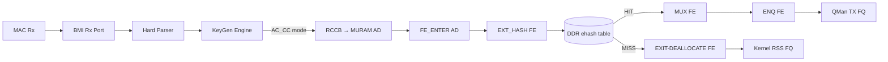

# FMan Microcode 210.10.1 — Complete Programming Reference

**Version 1.0 — 2026-07-13**

**Board:** NXP LS1046A Mono Gateway DK (FMan v3, DPAA1)
**Microcode:** QEF 210.10.1 ("Microcode version 210.10.1 for LS1043 r1.0"), `caps=0x17`
**Blob:** 51652 bytes, 12851 code words, SPI `mtd3` @ `0x400000`, DT node `/soc/fman@1a00000/fman-firmware/fsl,firmware`

This is the complete, self-contained programming reference for the NXP FMan 210.10.1 microcode. Every register, field, bit assignment, FE type encoding, opcode, resource ceiling, and invariant appears exactly once. Sections 1–11 describe the reachable programming surface. Section 12 documents the three genuine unknowns with their resolution methodology. Section 13 documents what is absent (do not attempt to use). Section 14 cross-references the deeper architectural documents.

---

## 1. Identity & Scope

The FMan v3 (LS1046A) microcode is a QEF container (`struct qe_firmware`, `magic="QEF"`) loaded by U-Boot from SPI `mtd3` into FMan IRAM at boot. It implements a table-driven Parse-Classify-Distribute pipeline. The kernel programs it by writing MURAM-resident configuration tables through FMan CCSR registers; it is never invoked via a software API or opcode dispatch.

The Host Command (HC) doorbell is **absent** from this blob (`caps=0x17`, bit 3 `FMAN_CAP_HC_DISPATCH` clear). `fmd_host_cmd_send()` returns `-ENXIO`. The only productive programming path is the register→MURAM→silicon path documented here.

The microcode is proprietary NXP 210.10.1, not the open-source `qoriq-fm-ucode` 106.x/108.x families. The public families are a strictly narrower subset. Every feature marked "210-only" does not exist in public microcode.

Three programming facts are not yet empirically confirmed by a hardware experiment (§12). They are marked **UNKNOWN-1**, **UNKNOWN-2**, **UNKNOWN-3**. Everything else has been confirmed against at least one of: (a) the NXP DPAA Reference Manual, (b) the NXP lf-5.4 LSDK driver source, (c) the `we-are-mono/ASK` production code, or (d) a direct `/dev/mem` / debugfs read on the board.


## 2. Architecture Overview

The FMan PCD pipeline has five stages, each programmed through registers and MURAM tables:



The programming model is **table-driven**: the driver writes MURAM-resident Action Descriptors (16 B each), FE objects (4–28 B each), CC match tables, HM command tables, and policer profile records. The microcode reads these tables as frames traverse the pipeline. There is no runtime opcode dispatch, no doorbell protocol, no IRQ-driven completion — the tables are the API.

DDR is used for the ehash bucket array and per-flow records (to avoid MURAM exhaustion). MURAM holds all FE objects, CC trees, HM chains, policer profiles, and the per-port ctrl-params page.

The two dispatch paths on 210.10.1:

- **Path 1 — FE-VM external-hash** (the only path that flows): RCCB → `FE_ENTER` AD → EXT_HASH FE → DDR bucket lookup → MUX → ENQ (HIT) or EXIT (MISS). The FE-VM opcode interpreter provides terminal BMI-FIFO disposition.
- **Path 2 — bare exact-match CC** (`CONT_LOOKUP` → `CONTRL_FLOW` exit): **Parks on 210.10.1** — no terminal FIFO disposition → BMI stall at ~45 frames. Do not use.


## 3. QEF Container (Blob Identity)

The microcode blob on SPI `mtd3` (flash offset `0x400000`, 1 MiB partition "fman-ucode") is a QorIQ Engine Firmware container. Header layout:

| Bytes | Field | Value (this board) |
|---|---|---|
| `0x00–0x03` | `__be32 length` | `51652` |
| `0x04–0x06` | `magic` | `"QEF"` |
| `0x07` | `layout_version` | `1` |
| `0x08–0x45` | `id[62]` NUL-terminated | `"Microcode version 210.10.1 for LS1043 r1.0"` |
| `0x46` | `split_IRAM` | `0` |
| `0x47` | `count` (microcode sections) | `1` |
| `0x48–0x49` | `__be16 soc_model` | `0x0413` (proprietary 210); `0x0416` = open-source 106 |
| `+112` | `u8×3 version` | `0xd2 0x0a 0x01` = 210.10.1 |

Microcode entry at `code_offset = 244`, `wcount = 12851` (51404 code bytes). After U-Boot loads it, the kernel reads it from the DT property `/proc/device-tree/soc/fman@1a00000/fman-firmware/fsl,firmware`. The blob is 51652 bytes on this board.

> The "for LS1043 r1.0" label is cosmetic — LS1043A and LS1046A share identical FMan v3 silicon. NXP ships one ASK microcode package for both. Do not "fix" it.

**Verification commands:**
```bash
# Decode QEF header from DT (no root, always present if U-Boot loaded it):
od -An -tx1 -N76 /proc/device-tree/soc/fman@1a00000/fman-firmware/fsl,firmware

# Decode from raw flash (needs root; confirm partition first with cat /proc/mtd):
sudo od -An -tx1 -N76 /dev/mtd3

# Full inventory:
sudo firmware-check
```

MD5: `6f23090a3d5ae8b302ea41fd90a14d4d`
SHA256: `5f3ed8d32b8659aafd8912d5d9920306350cae7a85884d81859152b9723eff0d`


## 4. KeyGen Scheme Registers

FMan CCSR base: `0x01A_0000`. KeyGen register block: offset `0x0C_1000`. All scheme registers are accessed indirectly through the KeyGen Action Register (`FMKG_AR` at offset `0x1FC`).

### 4.1 Indirect Access Protocol

To read or write a scheme word:
1. Write `FMKG_AR` = `GO(bit31)` | `READ(bit30, optional)` | `WSEL(word_index)` | `NUM(scheme 0–31)` | `HPORTID(port 0–15)`
2. Poll `FMKG_AR[GO]` until 0 (hardware clears it on completion)
3. Read/write the indirect window at `0x100+4*word_index`

### 4.2 Scheme Register Map (words 0–23 at indirect window `0x100`)

| Word Index | Register Name | Bits | Meaning |
|---|---|---|---|
| **0** | `kgse_mode` | `[31]` | **EN** — master enable for this scheme |
| | | `[7:0]` | **next_engine**: `2`=RSS (hash→DONE), `3`=FM_CTL (AC_CC), `4`=PLCR (policer), `6`=DONE (enqueue) |
| | | `[31:28]` | **NIA_ENG**: `0x8`=FM_CTL, `0xC`=PLCR, `0x0`=BMI |
| **1** | `kgse_ekfc` | `[31:0]` | **Extract Known Fields bitmask** — see §4.3 |
| **2** | `kgse_mv` | `[31:0]` | **Match Vector** — LCV bits that select this scheme |
| **3** | `kgse_ccbs` | `[27:12]` | **CC Base Select** — MURAM offset of CC group table (set to `0` for direct AC_CC dispatch via FMBM_RCCB) |
| **4** | `kgse_fqb` | `[23:0]` | **FQID base** for hash distribution |
| | | `[27:24]` | **range** — number of FQ bits to substitute (0→1 FQ, 7→128 FQs) |
| **5** | `kgse_hc` | `[31:16]` | **HMASK** — hash mask for FQID distribution |
| | | `[15]` | **SYM** — symmetric hash (XOR src/dst pairs before hashing) |
| | | `[7:0]` | **HSHIFT** — right-shift applied to hash before masking |
| **8** | `kgse_ppc` | `[31:0]` | Per-packet counter (read-only) |
| **16** | `kgse_spc` | `[31:0]` | **Scheme Packet Counter** (read-only) |
| **23** | (upper words) | | Additional configuration words for advanced features |

**Key mode encodings for ASK2:**

| Purpose | `kgse_mode` | Meaning |
|---|---|---|
| **AC_CC dispatch** (FE-VM path) | `0x80000006` | EN \| FM_CTL \| AC_CC — frames dispatched to CC classifier for FE-VM lookup |
| **RSS hash** (mainline default) | `0x80500002` | EN \| BMI \| DONE — hash→enqueue to kernel FQs |
| **Policer steering** | `0xC04C0000` | EN \| NIA_PLCR \| DONE — route to policer profile |
| **Scheme disabled** | `0x00000000` | SI=0 — skipped during scheme selection |

For AC_CC dispatch, `kgse_ccbs` MUST be `0x00000000`. A non-zero CCBS triggers an implicit CC group-table walk (the CCBS graft, which is a separate dispatch mechanism from AC_CC and was disproven for FE-VM on 210.10.1).

### 4.3 EKFC Field Bit Assignments

Extract Known Fields Command — a 32-bit bitmask. Each set bit instructs the KeyGen to extract one canonical field from the Parse Result. The assembly order of extracted fields into the key buffer is **UNKNOWN-1** — see §12.1.

| Bit | Constant | Field | Size | Notes |
|---|---|---|---|---|
| 31 | `KG_SCH_KN_MACDST` | Ethernet MAC destination | 6 B | |
| 30 | `KG_SCH_KN_MACSRC` | Ethernet MAC source | 6 B | |
| 22 | `KG_SCH_KN_ETYPE` | EtherType | 2 B | |
| 21 | `KG_SCH_KN_VLAN1` | First VLAN TCI | 2 B | |
| **20** | **`KG_SCH_KN_IPSRC1`** | **Outer IP source** | 4 B (IPv4) / 16 B (IPv6) | |
| **19** | **`KG_SCH_KN_IPDST1`** | **Outer IP destination** | 4 B (IPv4) / 16 B (IPv6) | |
| **18** | **`KG_SCH_KN_PTYPE1`** | **L4 protocol number** | 1 B | TCP=6, UDP=17. No EKDV default-value slot; guard against proto=0 at flow insert |
| 17 | `KG_SCH_KN_IPTOS1` | IPv4 TOS / IPv6 Traffic Class | 1 B | |
| 14 | `KG_SCH_KN_IPSRC2` | Inner/tunneled IP source | 4/16 B | Tunneled frame only |
| 13 | `KG_SCH_KN_IPDST2` | Inner/tunneled IP destination | 4/16 B | Tunneled frame only |
| **9** | `KG_SCH_KN_IPSECSPI` | IPsec ESP/AH SPI | 4 B | **Do NOT set on non-IPsec schemes** — parser has no SPI offset for non-IPsec frames, reads random bytes → unpredictable key (F-043) |
| **4** | **`KG_SCH_KN_L4PSRC`** | **TCP/UDP source port** | 2 B | |
| **3** | **`KG_SCH_KN_L4PDST`** | **TCP/UDP dest port** | 2 B | |
| 2 | `KG_SCH_KN_TFLG` | TCP flags | 1 B | |

**ASK2 5-tuple target:** `EKFC = 0x001C0006` = `IPSRC1 | IPDST1 | PTYPE1 | L4PSRC | L4PDST` → 13 bytes.

**ASK2 4-tuple (NO PTYPE1):** `EKFC = 0x00180006` → 12 bytes. **Do not use for production** — aliases TCP and UDP flows sharing the same IP:port pair (silent misforwarding). Use only for testing where protocol is known and distinct.

**IPsec SPI (bit 9) MUST NOT be set on non-IPsec schemes.** On non-IPsec frames the parser has no SPI offset → reads random bytes → unpredictable key. This was the root cause of F-043.

### 4.4 Scheme Selection Logic

For each received frame:
1. Parse Result `CPID[7:0]` → effective plan = `CPGBASE | (CPID & CPGMASK)` → 32-bit classification plan mask
2. `QLCV = plan_mask & LCV` (LCV = Line-up Confirmation Vector from parser)
3. Walk schemes SC0→SC31: first scheme where `SI=1` AND `(QLCV & kgse_mv) == kgse_mv` wins
4. No match → `FMKG_GCR[DEFNIA]` default next-interface action

For ASK2 exact-match classification: set `kgse_mv` to the LCV bits for the protocol combination you want to match (IPv4=bitX, TCP=bitY, etc.), and set `SI=1`.

### 4.5 Hash Algorithm

CRC-64-ECMA-182, reflected polynomial `0xC96C5795D7870F42`, seed `0xFFFFFFFFFFFFFFFF`. Applied over the assembled key bytes. The result is a 64-bit hash stored at Internal Context offset `0x48` (confirmed by `fman_sp_build_buffer_structure`).

FQID computation: `KDFV = (hash >> HSHIFT) & HMASK`; `FQID = KDFV | FQBASE`.

Symmetric hash (`SYM=1`): XORs src+dst pairs (MAC, IP, L4 port) before hashing. Both directions of a flow produce the same FQID. Critical for stateful NAT where return traffic must hit the same CPU.

**FE-VM ehash bucket index** (from lf-5.4 LSDK `get_indexed_hash_bucket`, L7301):
```
bucket_index = (crc64_hash >> ((6 - hashShift) * 8)) & hashMask
```
This is **verbatim-identical** to the production ASK 1.x `get_indexed_hash_bucket()`. Confirmed by static code comparison, not yet confirmed by a hardware dump — see §12.3 item 3.

### 4.6 KGSE_SPC — Scheme Packet Counter

`kgse_spc` (word 16, read-only) is the per-scheme packet counter. It increments for every frame this scheme classifies. Zero SPC on an armed scheme means frames are not being dispatched to it (check `kgse_mv` against the live `LCV`).


## 5. BMI Port Registers

Per-RX-port registers in the FMan BMI block. Port `0x10` = eth3 (left SFP+), port `0x11` = eth4 (right SFP+). Ports `0x08`–`0x0D` = eth0–eth2 (RJ45).

| Register | Offset | Bits | Meaning |
|---|---|---|---|
| **FMBM_RFPNE** | `0x28` | `[31:24]` | NIA engine after parse: `0x00`=BMI, `0x40`=KG (KeyGen), `0x80`=FM_CTL |
| | | `[7:0]` | Sub-engine within NIA |
| **FMBM_RFQID** | `0x0C` | `[23:0]` | Default RX Frame Queue ID — where frames go if not reclassified |
| **FMBM_RCCB** | `0x34` | `[27:12]` | **RX CC Base** — MURAM offset of the first Action Descriptor for CC dispatch |
| **FMBM_RICP** | `0x40` | `iceof[15:0]` | IC External Offset — where in DDR buffer the IC copy starts |
| | | `iciof[15:0]` | IC Internal Offset — which IC byte to start copying from |
| | | `icsz[15:0]` | IC Size — how many IC bytes to copy to DDR annotation |

- **KG dispatch:** `FMBM_RFPNE = 0x00480000` — NIA engine = KG (0x40), sub-engine = 0
- **AC_CC dispatch:** `FMBM_RFPNE = 0x00480200` — NIA engine = KG (0x40), sub-engine selects AC_CC path. `FMBM_RCCB` must point to the `FE_ENTER` AD at its MURAM offset
- **RSS default (mainline):** `FMBM_RFPNE = 0x00480000`, RCCB = 0 (no CC dispatch)

For the hash-match method (§12.1), `pass_hash_result` must be enabled in the buffer prefix content so the 8-byte KG hash at IC `0x48` is visible in the DDR annotation.


## 6. FM_CTL Params Page (per-port, 256 B MURAM)

Allocated once per port by patch `0116` (`fman_pcd_port_ensure_params_page`). The FMan Controller reads this page during frame processing. Exact layout (`t_FmPcdCtrlParamsPage`, packed 256 bytes):

| Offset | Field | Bits | Meaning |
|---|---|---|---|
| `0x00` | `reserved0[16]` | | |
| `0x10` | `iprIpv4Nia` | `[31:0]` | IP Reassembly v4 next-interface action (unconsumed) |
| `0x14` | `iprIpv6Nia` | `[31:0]` | IP Reassembly v6 NIA (unconsumed) |
| `0x18` | `reserved1[24]` | | |
| `0x30` | `ipfOptionsCounter` | `[31:0]` | IP Fragmentation options counter (unconsumed) |
| `0x34` | `reserved2[12]` | | |
| **`0x40`** | **`misc`** | `[31:0]` | `FM_CTL_PARAMS_PAGE_ALWAYS_ON = 0x100`; `OFFLOAD_SUPPORT_EN = 0x40000000` |
| `0x44` | `errorsDiscardMask` | `[31:0]` | Frame error discard mask (`0x012ee0e8`) |
| `0x48` | `discardMask` | `[31:0]` | |
| `0x4C` | `reserved3[4]` | | |
| `0x50` | `postBmiFetchNia` | `[31:0]` | NIA after BMI buffer fetch |
| **`0x54`** | **`internalFEBufferManagementIndexAddr`** | `[31:0]` | MURAM offset of per-port FE buffer free-list |
| **`0x58`** | **`internalFEBufferDepletionCounter`** | `[31:0]` | Reset to 0 on enable |
| `0x5C` | `reserved4[164]` | | Pad to 256 B |

**Init values** (from lf-5.4 LSDK `FmPortSetFESupport`):
- `+0x40` = `0x00000100` (already populated by `0116`)
- `+0x44` = `0x012ee0e8` (already populated by `0116`)
- `+0x54` = MURAM offset of the per-port FE buffer management free-list (written at arm time)
- `+0x58` = `0x00000000` (reset depletion counter at arm time; zeroed at disengage)

The `internalFEBufferManagementIndexAddr` and `internalFEBufferDepletionCounter` are only written when `FmPortSetFESupport` is called (the FE-VM path). They are left zero for bare exact-match CC.


## 7. FE Types — The Complete Command Set

The FE-VM opcode interpreter dispatches on the type field in bits `[31:26]` of the first MURAM word of each FE object. These are the ONLY commands the 210.10.1 FE-VM implements. Each FE object lives in the MURAM pool (100 slots × 28 B = 2800 B total, allocated by `AllocFEObjs`).

### 7.1 FE Type Table

| Type Constant | Word0 | Name | MURAM Size | Purpose |
|---|---|---|---|---|
| `0x01000000` | — | **HM** (Hash Match) | 16 B | Header Manipulation FE — executes HMCD/HMCT chains inline |
| `0x02000000` | `0x02010000` | **ENQ** | 16 B | Terminal enqueue to QMan FQ. Word1 encodes the 24-bit FQID |
| `0x03000000` | `0x03800000` | **EXIT** (DEALLOCATE) | 4 B | Free workspace allocation, terminate frame. **Terminal MISS disposition** |
| `0x04000000` | `0x04000000` | **MUX** | 8 B | Multiplexer — branches HIT→nextFE / MISS→implied EXIT. **Singleton** |
| `0x05000000` | — | **TRANSITION** | 8 B | State transition relay for HIT forwarding. **Singleton** |
| `0x06000000` | `0x06000000` | **EXT_HASH** | 28 B | External hash table lookup in DDR — core FE-VM fastpath |

### 7.2 EXT_HASH FE — Byte-Level Layout

This is the central FE object. It performs: CRC64(hardware key) → bucket index → DDR bucket walk → key comparison → HIT/MISS dispatch.

| Word | Offset | Size | Field | Dormant Value |
|---|---|---|---|---|
| `w0` | `0x00` | 4 B | **misc**: `FMAN_FE_TYPE_EXT_HASH (0x06000000)` \| `contextOffsetInWS` \| aging \| stats | `0x06000000` |
| `w1` | `0x04` | 4 B | `(hashMask << 16)` \| `((contextSize-1) << 8)` \| `hashShift` | `0x00FFFF00` (mask=`0xFF`, ctxtSize=256, shift=0) |
| `w2` | `0x08` | 4 B | `table_base_hi` — DDR bucket array bus address, high 16 bits of 48-bit | `0x00000000` (dormant) |
| `w3` | `0x0C` | 4 B | `table_base_lo` — DDR bucket array bus address, low 32 bits | table DMA addr lo |
| `w4` | `0x10` | 4 B | `missResult` — miss-result context MURAM offset | `0x00000000` (dormant) |
| `w5` | `0x14` | 4 B | `nextFEPtr` — **HIT** link = MURAM offset of the MUX singleton | `pcd->fe_mux_off` |
| `w6` | `0x18` | 4 B | `missNextFE` — **MISS** link = MURAM offset of the EXIT singleton | `pcd->fe_exit_off` |

**Critical address-space split:** `table_base_hi/lo` (`w2`/`w3`) carry a DDR bus address (`dma_addr_t` from `dma_alloc_coherent`). `nextFEPtr`/`missNextFE` (`w5`/`w6`) carry MURAM offsets (gen_pool offsets). Do not mix them.

**contextSize** (in `w1[15:8]`): the SDK passes 256 (`w1 = 0x00FF0000` masked with `0x7FFF`). Encoded as `contextSize-1` in the field. This determines how many IC bytes the FE-VM copies into the FE workspace. Must be large enough to cover the extracted key region.

**hashMask** (in `w1[31:16]`): `(mask+1)` must be an exact power of two. Valid masks: `0x0, 0x1, 0x3, 0x7, 0xF, …, 0x7FFF` (32768 buckets). Invalid: `0xF0` (not power-of-2-minus-1). Mainline `0125` enforces this.

**contextOffsetInWS**: See §12.2 **UNKNOWN-2**. Controls where within the FE workspace the extracted key starts. The SDK passes `0`. The field occupies bits in `w0`.

### 7.3 ENQ FE — Byte Layout

| Word | Offset | Contents |
|---|---|---|
| `w0` | `0x00` | `FMAN_FE_TYPE_ENQ (0x02010000)` |
| `w1` | `0x04` | FQID (24-bit, low bits). `w1 = 0x00000200` for FQ `0x200` (kernel delivery); `0x00008000` for dedicated offload FQ |
| `w2` | `0x08` | reserved/context |
| `w3` | `0x0C` | reserved/context |

### 7.4 EXIT FE — Byte Layout

| Word | Offset | Contents |
|---|---|---|
| `w0` | `0x00` | `FMAN_FE_TYPE_EXIT | FMAN_FE_EXIT_DEALLOCATE (0x03800000)` |

EXIT-DEALLOCATE is a **real terminal MISS disposition on 210.10.1**. Proven on silicon 2026-07-05: AC_CC arm → ping loss = frames MISS → EXIT, port did NOT park. This refutes the bare-AC_CC park concern for the FE-VM path.

### 7.5 MUX FE — Byte Layout

| Word | Offset | Contents |
|---|---|---|
| `w0` | `0x00` | `FMAN_FE_TYPE_MUX (0x04000000)` |
| `w1` | `0x04` | next-FE MURAM offset (TRANSITION singleton) |

The MUX requires `ALLOCATE` semantics — it allocates a transient workspace for the HIT forwarding relay. The `ALLOCATE` bit MUST be set for both `FE_ENTER` and MUX.

### 7.6 TRANSITION FE — Byte Layout

| Word | Offset | Contents |
|---|---|---|
| `w0` | `0x00` | `FMAN_FE_TYPE_TRANSITION (0x05000000)` |
| `w1` | `0x04` | next-FE MURAM offset (ENQ FE) |

### 7.7 FE_ENTER Root AD — Byte Layout

The AD at `FMBM_RCCB` that enters the FE-VM. NOT a pooled FE object — a standalone 16-byte MURAM AD.

| Word | Offset | Contents |
|---|---|---|
| `w0` | `0x00` | **`0x40800000`** = `CONT_LOOKUP(0x40)` \| `ALLOCATE(0x00800000)` |
| `w1` | `0x04` | `0x00000000` (reserved) |
| `w2` | `0x08` | **`0x000000F6`** = `pcAndOffsets` = OPC_FE_ENTER (SDK opcode) |
| `w3` | `0x0C` | next-FE MURAM offset (the EXT_HASH FE) |

**CRITICAL: Do NOT strip the ALLOCATE bit (0x00800000).** F-046 removed it (0x40800000 → 0x40000000) on a speculative "preserve KG hash" theory. The 2026-07-04 HIT ran with ALLOCATE set (readback confirmed `0x40800000`). ALLOCATE allocates the FE workspace that holds the extracted key and KG hash. Removing it removes the place the context lives.

### 7.8 FE Object Pool

Pool init (`AllocFEObjs`, lf-5.4 LSDK):
- 100 FE objects × `FM_PCD_FE_MAX_SIZE` (28 B) = **2800 B MURAM**, 8-byte aligned
- List-managed: `availableFeLst` (free) / `enqLst` (in-use)
- Inverse: `ReleaseFEsList()` drains both lists, frees each `h_FE` via `FM_MURAM_FreeMem`

**KASAN gotcha:** `memset`/`memcpy` on `h_FE` (iomem) faults under `CONFIG_KASAN_GENERIC=y`. Use `memset_io` / `__iowrite32_copy` for all MURAM writes.

### 7.9 FE Object Sizes

| Constant | Value | FE Type |
|---|---|---|
| `FM_PCD_FE_ALIGN` | 8 | All FE objects |
| `FM_PCD_FE_T_EXT_HASH_SIZE` | 28 (4×7) | EXT_HASH |
| `FM_PCD_FE_T_HM_SIZE` | 16 (4×4) | HM |
| `FM_PCD_FE_T_ENQ_SIZE` | 16 (4×4) | ENQ |
| `FM_PCD_FE_T_TRANSITION_SIZE` | 8 (4×2) | TRANSITION (singleton) |
| `FM_PCD_FE_T_EXIT_SIZE` | 4 (4×1) | EXIT (singleton) |
| `FM_PCD_FE_MAX_SIZE` | 28 | Max of all types (= EXT_HASH) |

### 7.10 FE-VM Programming Core

Three functions from lf-5.4 LSDK (`we-are-mono/ASK` `999-layerscape-ask-kernel_linux_5_4_3_00_0.patch`) that must be ported to mainline 6.18 to arm the FE-VM. These are **stubbed** (empty `UNUSED()` no-ops) in lf-6.6.y and lf-6.12.y. See §12.3 **UNKNOWN-3**.

| Function | LSDK Location (999-patch) | Purpose |
|---|---|---|
| `FmPcdCcBuildFE` | L8883 | Programs a single FE object from the pool with its type-specific MURAM layout |
| `FmPcdCcBuildContextByFE` | L8954 | Populates the per-port FE context: internal buffer pool + management index + ctrl-params page writes |
| `get_indexed_hash_bucket` | L7301 | CRC64 bucket indexer: `(crc >> ((6-shift)<<3)) & mask` |

Only lf-5.4 has working bodies for all three. lf-6.6.y and lf-6.12.y allocate the FE pool but never program it.


## 8. Header Manipulation Opcodes

HMCD (Header-Manip Command Descriptor) table ≤ 256 bytes in MURAM. HMCT (Header-Manip Command Table) entries are 4-byte big-endian command words chained via `HMCD_LAST` (bit 23 = `0x00800000` on the final word). The FMan Controller executes these inline during frame processing.

### 8.1 HM Opcode Table

| Opcode | Name | Operand | Auto Side-Effects |
|---|---|---|---|
| `0x00` | **Remove header** (L2 strip) | — | — |
| `0x01` | **Remove arbitrary bytes** | `offset[7:0]`, `size[15:8]` | — |
| `0x02` | **Insert/Replace arbitrary bytes** | `offset[7:0]`, `size[15:8]`; data inline or from MURAM | — |
| `0x0B` | **VLAN priority update** | Direct or DSCP→VPri 64-entry/32-byte lookup | — |
| **`0x0C`** | **Local IPv4 update** | TOS, **TTL decrement**, IP-ID, src addr, dst addr | **Auto-regenerates IP header checksum** |
| `0x0D` | **Internal L3 replace** | Full IPv4/IPv6 address swap from MURAM | — |
| **`0x0E`** | **Local TCP/UDP update** | Source/dest port | **Auto-incremental L4 checksum** (skipped if original==0) |
| `0x16+` | **Local L3 insert** (tunnel header) | Tunnel header data, size | — |

### 8.2 HMTD Descriptor

16-byte MURAM record:

| Offset | Field | Value |
|---|---|---|
| `0x00` | `cfg` | `0x4080` = `TYPE(0x4000)` \| `EXT_HMCT(0x0080)` |
| `0x04` | `hmcdBasePtr` | MURAM offset of the first HMCT entry |
| `0x0B` | `opCode` | `0x35` = `HMAN_OC` (Header Manipulation opcode) |

### 8.3 The NAT Chain

The production ASK2 L3 forwarding chain in opcode order:
1. `0x01` (RMV_ETHERNET) — strip the incoming L2 header
2. `0x02` (INSRT_GENERIC) — insert the new L2 header (new MACs, EtherType)
3. `0x0C` (IPV4_FORWARD) — rewrite IP src/dst, decrement TTL, auto-regenerate IP checksum
4. `0x0E` (TCP_UDP_UPDATE) — rewrite L4 ports, auto-incremental L4 checksum

Each manip chain must stay within 1 KiB MURAM per chain. The `fman_pcd_manip_chain_create(N manips)` primitive concatenates N source HMCTs into one bigger HMCT with `HMCD_LAST` on the final word.

**Known bug — MURAM fragmenter (327× ENOMEM):** `fman_pcd_manip_chain_create(3)` failed `-ENOMEM` 327 times while gen_pool had ~320 KB free. Root cause: MURAM fragmentation in the HMCT allocator. Not yet fixed. Workaround: pre-allocate manip chains at install time; do not churn them at runtime.


## 9. Policer Programming Model

FMPL CCSR base: `0x01AC0000`. 256 profiles, each a 64-byte entry in 16 KB PRAM (ECC-protected). Accessed indirectly via `FMPL_PAR` (Profile Access Register, offset `0x004`).

### 9.1 Policer Registers

| Register | Offset | Bits | Meaning |
|---|---|---|---|
| **FMPL_GCR** | `0x000` | `[31]` **EN** | **Master enable** — MUST be set (`plcr_enable_block()`) or ALL policer profiles are inert |
| | | `[30]` **STEN** | Statistics enable — MUST be set for per-profile counters |
| | | `[23:0]` DEFNIA | Default NIA for unmetered frames |
| **FMPL_PAR** | `0x004` | | Indirect access to 256 × 64 B PRAM entries |
| **FMPL_PMR1–63** | `0x100+` | | Per-Port Metering Register — maps port N to profile ID |
| **FMPL_DPMR** | `0x200+` | | Dual-Port Metering Register |

**BUG 3a root cause + fix:** `FMPL_GCR[EN]` and `FMPL_GCR[STEN]` are BOTH clear at boot (`FMPL_GCR = 0x00500002`). The whole policer block is disabled. Fix: `plcr_enable_block()` does RMW `gcr |= EN|STEN` (→ `0xC0500002`). Proven on hardware: ping went from 100% loss → 0% loss. Do NOT ship a build without `plcr_enable_block()`.

### 9.2 Profile PRAM Entry (64 bytes)

| Word | Offset | Field | Encoding |
|---|---|---|---|
| 0 | `0x00` | **Mode** | `COLOR_AWARE(0x8000)` \| `ALG_TRTCM(0x2000)` \| `PACKET_MODE(0x1000)` \| `PIR_DISABLED(0x0040)`. srTCM sets `PIR_DISABLED`; trTCM sets `ALG_TRTCM` |
| 1 | `0x04` | CIR (Committed Information Rate) | Q16.16 fixed-point bytes/s: `rate = (exp << 29) | (mant << 13)`, exp∈[0..7], mant∈[0..0xFFFF] |
| 2 | `0x08` | CBS (Committed Burst Size) | `DIV_ROUND_UP(bytes, 256)`, saturated at `0xFFFF` |
| 3 | `0x0C` | EIR/EBS | Upper 16 bits = EIR rate (same encoding as CIR); lower 16 bits = EBS burst (same encoding as CBS) |

Init gotchas: set `CTS`/`PTS_ETS` = `0xFFFFFFFF` (full token buckets), `LTS` = 0. Hardware auto-calibrates on the first packet. Partial writes (`PWSEL` word-select in `FMPL_PAR`) allow bulk-init of many profiles.

Rate encoding detail:
```
plcr_encode_rate(u64 bps, u64 clk_hz):
  Find smallest exp ∈ [0..7] where mant = DIV_ROUND_CLOSEST(bps, clk_hz >> (29 - 13*exp)) fits in u16
  Saturate at exp=7, mant=0xFFFF
  Return (exp << 29) | (mant << 13)
```

Burst encoding detail: `DIV_ROUND_UP(bytes, 256)`, saturated at `0xFFFF`. 0 bytes → 0, 255 bytes → 0, 256 bytes → 1, 65536 bytes → 256.

### 9.3 Per-Color Next-Interface Actions

Each profile carries three NIAs: **GNIA** (Green — enqueue, within CIR/CBS), **YNIA** (Yellow — enqueue or mark, within EIR/EBS but above CIR), **RNIA** (Red — drop or mark, above EIR/EBS). A profile can chain to another profile for hierarchical policing.

### 9.4 Per-Port Virtualization

`FMPL_PMR1–63` maps a logical port number to a policer profile ID, enabling per-port profiles without consuming scheme slots. Only populated when `FmPortSetFESupport` is called.


## 10. DDR ehash Flow Store

The ehash bucket array lives in DDR (NOT MURAM), allocated via `dma_alloc_coherent`. The FE-VM DMA-reads it directly.

### 10.1 Bucket Array

`sizeof(en_exthash_bucket) × (mask+1)`, where `mask ≤ 0x7FFF` and `(mask+1)` is an exact power of two.

Bucket entry (16 bytes):
```c
struct en_exthash_bucket {
    u64 hash;   // hash value for this bucket
    u64 pad;    // padding
};
```

### 10.2 Per-Flow Record

Each DDR flow record is 256 bytes (SDK `en_ehash_entry` + key + next-FE pointer):

| Offset | Size | Field | Encoding |
|---|---|---|---|
| `0x00` | 2 B | `flags` | BE16 |
| `0x02` | 2 B | `next_entry_hi` | BE16 — collision chain pointer, upper 16 bits |
| `0x04` | 4 B | `next_entry_lo` | BE32 — collision chain pointer, lower 32 bits |
| `0x08` | `keysize` bytes | **extracted key** | Must exactly match the byte order the KG hardware produces |
| after key | 4 B | next-FE MURAM offset | ENQ FE for HIT forwarding |

Collision chain: head-insert at bucket. Chains are LIFO (head-add + head-first walk = reverse insert order). Inverse MUST drain LIFO so each bucket head reverts to its exact pre-insert value.

**Entry sizing (F-063 fix):** Keysize=13 bytes requires `align_up(8 + key_len, 8)` = 24-byte DDR entries. Using 16-byte entries with keysize=13 causes the FE-VM to DMA-read 8B header + 13B key = 21B past the 16B allocation → BMI port stall. **Keysize MUST equal the full EKFC extracted key length.** For 5-tuple (13 bytes): entries = 24 B, not 16 B.

### 10.3 CRC64 Hash

Algorithm: CRC-64-ECMA-182, reflected polynomial `0xC96C5795D7870F42`, seed `0xFFFFFFFFFFFFFFFF`. Verbatim-identical to lf-5.4 LSDK `get_indexed_hash_bucket()` (L7301).

Bucket index: `(crc >> ((6 - hashShift) * 8)) & hashMask`.

The 64-bit hash result is stored at Internal Context offset `0x48` and copied to the DDR buffer annotation when `pass_hash_result` is enabled. This is the observable output used in the hash-match method (§12.1).

### 10.4 Flow Insert / Remove

```
insert(bucket_idx, key_bytes, key_len, enq_fe_off):
  record = kzalloc(256, GFP_KERNEL)                              // DDR
  write key_bytes at record[8]
  write enq_fe_off after aligned key region
  record_hdr = phys(record) | collision_chain_header
  bucket[bucket_idx].hash = swab64(record_hdr)                    // head-insert

remove(bucket_idx):
  head = bucket[bucket_idx].hash
  record = phys_to_virt(swab64(head))
  bucket[bucket_idx].hash = record.next                             // pop head (LIFO)
  kfree(record)
```

All bucket and record memory is DDR (`kmalloc`/`kzalloc`), so gen_pool `used` is unchanged. The reversibility signal: (a) every record freed, (b) every bucket head restored byte-exactly.


## 11. Resource Ceilings (Hard Hardware Limits)

| Resource | Limit | Source |
|---|---|---|
| KeyGen schemes | 32 | `FMKG_SEER`; `FMKG_AR[NUM]`=5b |
| Classification plans | 256 (32 groups × 8) | `FMKG_PEER` |
| Max extraction key size | 56 bytes | RM §5.10 |
| KeyGen generic extracts | 8 (GEC0–7) | RM §5.10 |
| Hash algorithm | CRC-64-ECMA-182 | RM §5.10.4.3 |
| FQID width | 24 bits | `FMKG_SE_FQB` |
| Policer profiles | 256 | 16 KB PRAM, 64 B/profile |
| Policer algorithms | 3 (pass-through / RFC 2698 / RFC 4115) | RM §5.11 |
| CC tree roots per port | 16 | 4-bit CCO |
| CC entries per table | 255 + 1 miss entry | `FM_PCD_CC_NUM_OF_KEYS` |
| CC line-rate table size | ≤128 bytes (18 Mpps) | RM §5.12 |
| CC key sizes (fixed) | 1, 2, 4, 8, 16, 24, 32, 40, 48, 56 B | RM §5.12 |
| CC nested lookups per packet | ≤3 | RM §5.12 |
| CC IC-Index ADs | ≤4096 (12-bit GMASK, `0x00000FFF0`) | RM §5.12 |
| CC AD size | 16 bytes | RM §5.12 |
| HMCD table | ≤256 bytes | RM §5.12.10 |
| Manip MURAM per chain | ≤1 KiB | Risk #13 |
| FE object pool | 100 × 28 B = 2800 B MURAM | `AllocFEObjs` |
| Per-port FE buffers | `tnums × 256 × 2` B MURAM (~4–8 KB/port) | `FmPortSetFESupport` |
| ehash buckets | `(mask+1)`, power-of-2, mask ≤ `0x7FFF` (32768) | DDR (not MURAM) |
| ehash bucket size | 16 bytes | `en_exthash_bucket { u64 hash; u64 pad; }` |
| ehash flow record | 256 bytes | SDK `en_ehash_entry` |
| Total MURAM | 64 KiB reserved, ~38 KiB usable after overhead | gen_pool debugfs |
| Parser hard protocols | 16 | RM §5.9 |
| Parser Rx/OH ports | 16 (IDs 1–16) | RM §5.9 |
| Parse Result | 32 bytes | RM §5.9 |

**MURAM budget rule:** ehash buckets MUST live in DDR. Only FE objects, CC trees, HM chains, policer profiles, and the params page live in MURAM. This single rule prevents the vendor 327×-ENOMEM wall.


## 12. The Three Unknowns

These are the only three facts about the 210.10.1 programming surface that are NOT yet empirically confirmed. Everything else in this document has been verified against at least one of: the DPAA RM, the lf-5.4 LSDK driver source, the `we-are-mono/ASK` production code, or a direct hardware register read. All three can be resolved by scripts running on the Mono Gateway DK.

### 12.1 UNKNOWN-1: EKFC Extraction Byte Order

The EKFC register (§4.3) selects which fields the KeyGen extracts. The DPAA RM defines the bit assignments but does NOT document the assembly order — the sequence in which the hardware places extracted fields into the key buffer. Three competing models exist:

| Model | Order (first byte → last byte) | Evidence |
|---|---|---|
| **Descending bit position** (MSB-first) | SIP(4) + DIP(4) + PROTO(1) + SPORT(2) + DPORT(2) = 13 bytes | NXP LSDK `fm_kg.c` `orderedArray` sort (ascending ID = descending bit), ASK 1.x `ipv4_tcpudp_key` struct order. Strong a-priori |
| **Ascending bit position** (LSB-first) | DPORT(2) + SPORT(2) + PROTO(1) + DIP(4) + SIP(4) | Equal probability — the bit-walk direction is undocumented |
| **Size-grouped** | SIP(4) + DIP(4) + SPORT(2) + DPORT(2) + PROTO(1) | Least likely — neither SDK nor ASK evidence supports this |

**Resolution methodology — hash-match experiment:**

1. Configure a KG scheme with `EKFC = 0x001C0006` (5-tuple), hashing enabled, next_engine=RSS (deliver to kernel FQ)
2. Enable `pass_hash_result` in the buffer prefix content so the 8-byte KG hash lands in the DDR annotation at `IC+0x48`
3. Send ONE known frame with all-DISTINCT non-zero field bytes:
   - SIP = `10.99.1.1` (`0x0A630101`)
   - DIP = `10.99.1.2` (`0x0A630102`)
   - PROTO = 6 (TCP)
   - SPORT = `0x1111` (4369)
   - DPORT = `0x2222` (8738)
4. Read the 8-byte KG hash from the buffer annotation (extend `dpaa_eth`'s existing `fman_port_get_hash_result_offset` read from 32→64 bits to get the full 8 bytes)
5. Software-compute `fman_pcd_crc64(candidate_key_for_each_order, 13)` and compare against the hardware hash. The match names the silicon order.

**Prerequisites:** `pass_hash_result` enabled in buffer prefix; `EKFC=0x001C0006`; one test frame with all-distinct bytes; cold-boot before experiment. False-positive risk: low — CRC64 collision probability is negligible for a 13-byte key with all-distinct bytes across three candidate orderings.

### 12.2 UNKNOWN-2: FE Workspace Layout (contextOffsetInWS)

When the `ALLOCATE` bit is set in `FE_ENTER`, the FE-VM allocates a workspace and populates it with the frame's Internal Context. The `contextOffsetInWS` field in `EXT_HASH w0` tells the EXT_HASH comparator where within this workspace the extracted key starts. The SDK passes `0`.

**What IS known:**
- The EXT_HASH FE compares `keysize` bytes starting at `workspace + contextOffsetInWS` against `keysize` bytes at `DDR_record + 8`
- The SDK's `FmPcdExternalHashTableSet` passes `contextOffsetInWS = 0`
- The FE workspace size is ~246 bytes (the `pcAndOffsets=0xF6` value)

**What is NOT known:**
- Whether `contextOffsetInWS = 0` in the EXT_HASH AD maps to byte 0 of the FE workspace, or to some internal offset
- Whether the FE workspace layout mirrors the IC layout (where the extracted key lives at some undocumented offset after IC `0x50`), or whether the FE-VM rearranges it

**Resolution methodology:**

The same hash-match experiment that resolves UNKNOWN-1 also resolves this: if the hash matches one candidate ordering, the comparator is seeing the correct bytes, so `contextOffsetInWS=0` works as the SDK intended. If NO ordering matches the hash, the comparator is reading the wrong workspace region — try `contextOffsetInWS = 0x48` (IC hash result offset) or scan a range.

**Alternative (if hash-match inconclusive):** Use the `fe_probe` debugfs interface to read the actual FE workspace bytes after a live frame. Locate a known IP address in the dump — its offset IS `contextOffsetInWS`, and its neighbors confirm the EKFC order.

**Prerequisites:** ALLOCATE bit set; FE_ENTER armed on a test port; one test frame; `fe_probe` debugfs node.

### 12.3 UNKNOWN-3: FE-VM Programming Core Port

Three functions from lf-5.4 LSDK must be ported byte-for-byte to mainline 6.18. They are stubbed (empty `UNUSED()` no-ops) in lf-6.6.y and lf-6.12.y. Only lf-5.4 has the working bodies.

| Function | LSDK Location | LOC (est.) | Risk |
|---|---|---|---|
| `FmPcdCcBuildFE` | 999-patch L8883 | ~300 | Programs a single FE object. Wrong image = port stalls with NO fault latched (invisible to traffic tests) |
| `FmPcdCcBuildContextByFE` | 999-patch L8954 | ~200 | Populates per-port FE context. Wrong = EXT_HASH FE can't read DDR |
| `get_indexed_hash_bucket` | 999-patch L7301 | ~30 | CRC64 bucket indexer. Already verified against SDK `crc64.h` — low risk |

**Resolution methodology:**

1. Extract the three functions from the lf-5.4 LSDK source at `/home/vyos/ask-ref/ask/patches/kernel/999-layerscape-ask-kernel_linux_5_4_3_00_0.patch`
2. Adapt SDK types (`t_FmPcdFEObj`, `t_EnqFe`, `t_ExtHashFe`, `en_exthash_global_mem`) to mainline equivalents already present in `fman_pcd_fe.c`
3. Adapt SDK MURAM accessors (`FM_MURAM_AllocMem`, `IOMemSet32`, `WRITE_UINT32`) to mainline equivalents (`fman_pcd_muram_alloc`, `memset_io`, `iowrite32be`)
4. Land each function as a dormant increment behind debugfs byte-readback, validating the programmed MURAM image against this document's expected encodings BEFORE flowing traffic
5. Gate `fe_arm_engage()` on `key_verified=1` — refuse to arm until UNKNOWN-1 and UNKNOWN-2 are confirmed

**Validation gate:** After programming, read back every MURAM word and compare against the expected encoding from §7. Use `pcd-snapshot diff` to verify the FE image byte-for-byte. Only then flow traffic.

**Prerequisites:** lf-5.4 LSDK source available locally; UNKNOWN-1 resolved first.


## 13. Complete Function Inventory

| # | Function | Status | Cap Bit | Driver Consumer | Deferred To |
|---|---|---|---|---|---|
| 1 | **Hard Parser** (L2–L4 header recognition, 16 protocols) | Consumed | — | Mainline `fman_prs.c` | — |
| 2 | **Soft Parser** (custom protocol extensions, 1984-byte instruction space) | Consumed | BIT 4 (`PARSER_SOFTSEQ`) | `fman_pcd_prs.c` | — |
| 3 | **KeyGen** — 32 schemes, CRC64 hash, EKFC/GEC extraction, FQID distribution | Consumed | — | `fman_pcd_kg.c` (patches `0097`, `0133`) | — |
| 4 | **KeyGen post-hash index + explicit PP-select** | Present (unconsumed) | — | None | M5 (QoS) |
| 5 | **CC Match-Table** — exact-match, ≤255 entries, ≤3 nested hops, per-key stats | Consumed | BIT 0 (`CC_EXACT_MATCH`) | `fman_pcd_cc.c` (patches `0098`, `0108`) | — |
| 6 | **CC Hash-Table** — hashed CC lookup, DDR-based, large flow tables | Present (unconsumed) | BIT 5 placeholder | None | M5 |
| 7 | **Header Manipulation** — VLAN/Q-in-Q/MPLS push-pop, arbitrary byte insert/remove/replace | Consumed | BIT 1 (`HM_NODES`) | `fman_pcd_manip.c` (patch `0099`) | — |
| 8 | **Policer** — 256 profiles, RFC 2698 (srTCM) / RFC 4115 (trTCM), color-marking | Consumed | BIT 2 (`POLICER_TRTCM`) | `fman_pcd_plcr.c` (patch `0100`) | — |
| 9 | **FE-VM ehash** — EXT_HASH → MUX → ENQ → EXIT dispatch, DDR flow store | Partially consumed | — | `fman_pcd_fe.c` (patches `0122`–`0131`); FE alloc done, programming core from lf-5.4 pending | M2→M3 |
| 10 | **Frame Replicator** — source-TD + member-AD chain → multiple egress FQs | Present (unconsumed) | BIT 8 placeholder | `fman_pcd_replic.c` (KUnit tests exist) | Mirror/multicast phase |
| 11 | **IP Reassembly** (timeout-driven flush) | Present (unconsumed) | BIT 6 placeholder | None | M6 |
| 12 | **IP Fragmentation** | Present (unconsumed) | BIT 7 placeholder | None | M6 |

Capability bitmask (`dpaa_fman_caps`): `0x17` = `CC_EXACT_MATCH | HM_NODES | POLICER_TRTCM | PARSER_SOFTSEQ`. Bits 5–8 are reserved placeholders. Bit 3 (`HC_DISPATCH`) is deliberately clear — the Host Command doorbell is absent from this blob.


## 14. What Is Absent (Do Not Attempt to Use)

| Item | Evidence | Consequence |
|---|---|---|
| **Host Command doorbell** | `caps=0x17`, bit 3 clear; `fmd_host_cmd_send()` returns `-ENXIO`; `fman_irq()` never services FCEV/REV events | `OP_FLOW_INSERT_V4_TCP`, `OP_GET_UCODE_VERSION`, and all hypothetical opcodes do NOT exist in this blob |
| **Custom microcode opcodes** | NXP's microcode SDK + compiler + signing keys are not distributed to any client | Cannot build a modified QEF blob. The 6 FE types in §7 are the complete command set |
| **FE-VM ISA** | No public documentation. No disassembler. No simulator | Cannot interpret the raw u32 opcode stream. Observation-based methods (hash-match, fe_probe) are the only path |

The NXP public `qoriq-fm-ucode` repo families (106, 107, 108) are a narrower subset of the 210.10.1 function inventory. Features marked "210-only" in §13 do NOT exist in public microcode. If you swap to 106.4.18, you lose: FE-VM ehash, full HM, srTCM/trTCM, IPR/IPF, Frame Replicator, CC deep nesting with per-key stats. And 106.4.18 parks identically on bare exact-match CC (confirmed ccexp12, 2026-06-11).


## 15. Programming Invariants

These MUST be observed in every patch that touches the microcode surface:

1. **MURAM is iomem, never RAM.** Access FE objects, AD nodes, ehash global mem, and params page with `memset_io` / `memcpy_toio` / `writel` / `readl` only. Plain `memset`/`memcpy` faults under KASAN; otherwise silently corrupts the AD. `gen_pool` does NOT zero on alloc — always follow `fman_pcd_muram_alloc` with `memset_io(p, 0, size)`.

2. **Bounds-check before every alloc.** Call `gen_pool_avail()` before each MURAM reservation. On any failure: free ALL prior allocations of that operation, return `-ENOMEM`, fall back to SW path. Never half-program silicon.

3. **ehash buckets in DDR, never MURAM.** Use `dma_alloc_coherent` / `kmalloc`. Only the FE-object pool, the AD node, and the ehash global singleton live in MURAM.

4. **Forward ⇒ inverse in the same patch.** No register or MURAM write lands without its verified undo. Teardown proven by `pcd-snapshot` diff against warm-S0 baseline — NEVER by "ping works."

5. **Readback every silicon write that has no error report.** After programming an FE descriptor or KGSE entry, read it back via the indirect window and compare. Fail the engage on mismatch.

6. **Derive key length from one constant, in one place.** The kernel exports `key_len` via debugfs; the shell reads it. No literal byte counts anywhere.

7. **A build that cannot verify its own key layout must refuse to engage.** `fe_arm_engage()` returns `-EPROTO` unless `fman_pcd_key_selftest()` has passed since boot. Force-override with `fman_pcd.force_unverified=1` for experiments only.

8. **keysize MUST equal the full EKFC extracted key length.** For 5-tuple (EKFC=0x001C0006): 13 bytes → 24-byte DDR entries. Do not reduce keysize to make entries fit — that truncates IP ADDRESSES, not ports (F-063).

9. **Never change a known-good configuration on a hypothesis.** The ALLOCATE bit is proven necessary by the 2026-07-04 HIT. Do not strip it.

10. **Always cold-boot before any silicon experiment.** Warm reboot does NOT clear BMI or MURAM state. Record boot type in every result.

11. **One variable per experiment.** One key, one flow, one packet class per run.

12. **Mutate eth3/eth4 only.** Never touch eth0 (the SSH lifeline) during FE experiments.


## 16. Cross-References

| For… | See |
|---|---|
| FE-VM init contract, FE pool, per-port params page, DDR bucket sizes | `arch/fman-fe-ehash.md` |
| PCD pipeline: parser, KeyGen, CC, HM, policer, replication | `arch/fman-pcd.md` |
| 106 vs 210.10.1 distinction, QEF format, load path | `arch/fman-microcode.md` |
| EKFC extraction, CRC64 hash, FE-VM dispatch, ehash flow-table architecture | `specs/fman-keygen-flow-key-spec.md` |
| ASK2 fman_pcd subsystem API (`fman_pcd_cc_node_add_key`, etc.) | `specs/ask2-rewrite-spec.md` §13 |
| Full microcode function inventory with classification | `specs/dpaa1-afxdp-modernization-spec.md` §2.2.1 |
| MURAM budget, 750-flow ceiling, 327× ENOMEM risk | `arch/muram.md` |
| Dual-dataplane mode state machine (S0↔S1), reversibility contract | `plans/DUAL-DATAPLANE.md` |
| Production-proven FE-VM working bodies (lf-5.4 LSDK) | `we-are-mono/ASK` `999-layerscape-ask-kernel_linux_5_4_3_00_0.patch` (local: `/home/vyos/ask-ref/ask/patches/kernel/`) |
| NXP qoriq Linux kernel tree (sdk_fman/dpaa/qbman overlays) | `nxp-qoriq/linux` branch `ask-6.6-port` (local: `/home/vyos/ask-ref/linux/`) |
| Public microcode capability matrix (106/107/108 families) | `github.com/nxp-qoriq/qoriq-fm-ucode` (readme) |
| FMan firmware-check script (QEF decode, version, MD5) | `board/scripts/firmware-check` |
