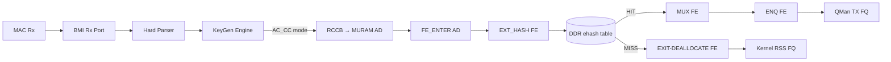
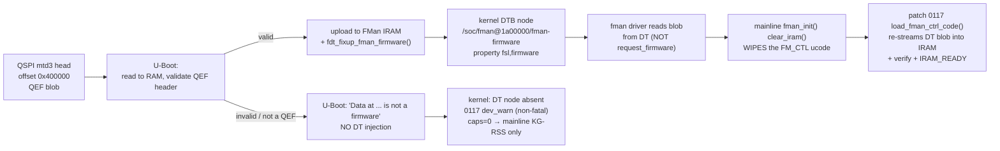

# FMan Microcode 210.10.1 Programming Reference

**Version 1.0**

**Board:** NXP LS1046A Mono Gateway DK (FMan v3, DPAA1)
**Microcode:** QEF 210.10.1 ("Microcode version 210.10.1 for LS1043 r1.0"), `caps=0x17`
**Blob:** 51652 bytes, 12851 code words, SPI `mtd3` @ `0x400000`, DT node `/soc/fman@1a00000/fman-firmware/fsl,firmware`

## 1. Identity and Scope

The FMan v3 (LS1046A) microcode is a QEF container (`struct qe_firmware`, `magic="QEF"`) loaded by U-Boot from SPI `mtd3` into FMan IRAM at boot. It implements a table-driven Parse-Classify-Distribute pipeline. The kernel programs it by writing MURAM-resident configuration tables through FMan CCSR registers. It is never invoked via a software API or opcode dispatch.

The Host Command (HC) doorbell is absent from this blob (`caps=0x17 = 0b0001_0111`, bits 0, 1, 2, 4 set; bit 3 `FMAN_CAP_HC_DISPATCH` clear). `fmd_host_cmd_send()` returns `-ENXIO`. The only productive programming path is the register → MURAM → silicon path documented here.

The microcode is proprietary NXP 210.10.1, not the open-source `qoriq-fm-ucode` 106.x/108.x families. The public families are a strictly narrower subset; features marked "210-only" in this document do not exist in public microcode.

### 1.1 The NXP Microcode Families

| Question | Answer |
|---|---|
| What runs on **our board**? | **Proprietary `210.10.1`** QEF blob, U-Boot-injected into the DTB. |
| What is the open-source alternative? | **`106.4.18`** (`fsl_fman_ucode_ls1046_r1.0_106_4_18.bin`). |
| Is **"160"** a valid LS1046A ucode? | **No.** `160` is the **P1023** open-source major. "Open-source 160" for LS1046A is a **misnomer for `106`**. |
| Do both families *support* CC? | Yes — both `106` (IPACC) and `210.x` silicon-support CC/HM/Policer. The gate is **which blob is loaded + executing**, not the family. |
| Does mainline program CC? | **Never.** Mainline DPAA only does KG-RSS. CC is programmed solely by our `fman_pcd_*.c` patches. |
| How is it detected? | QEF header decode (`firmware-check` §4) + kernel caps gate (patch `0086a`, `major>=210 → 0x17`). |
| What is the fallback if it is missing? | Graceful: board boots **mainline KG-RSS only**, no CC caps, `0117` `dev_warn`. There is **no** `request_firmware()` /lib/firmware fallback — by design. |

**NXP open-source ucode versioning** (from the `qoriq-fm-ucode` readme):

- **First number = Primary Major = feature family.** `106` = **IPACC** (includes Custom Classification, Independent-Mode, Host-Commands, IPv4/6 Frag/Reassembly, IPsec, and Header-Manip). `107` = DSAR + partial IPACC. `108` = NG-CAPWAP + FE + IPACC.
- **Second number = HW rev.** `.1` FMANv2 no-SW-DMA-sem · `.2` FMANv2 w/sem · `.3` FMANv3 Rev1 · `.4` FMANv3 > Rev1. LS1046A r1.0 ⇒ `106.4.18`.
- **`210.x` is proprietary** — a newer NXP release **not in the public repo** (`210 ≫ 108`). It lacks the HC host-command doorbell, so our approach uses **direct KG→`FM_CTL|AC_CC` dispatch + result-AD enqueue**, never the HC doorbell.

**Coarse vs fine — the terminology trap.** NXP's PCD has two distinct steering mechanisms whose "coarse/fine" naming is inverted relative to the networking meaning:

- **KeyGen (KG)** hashes a key and spreads flows across a *set* of frame queues → **statistical / COARSE**. This is what mainline DPAA programs by default (RSS).
- **Coarse Classifier (CC)** — despite NXP's name — is the **exact-match lookup tree** = deterministic per-flow steering = the **user's "fine classifier"**. NXP named it "coarse" relative to the *Parser* (which inspects headers byte-by-byte); from a flow-granularity view it is the fine one.

**Mainline DPAA never programs CC.** The practical split is: **mainline / open-source datapath = coarse hash-RSS only**; **fine exact-match CC = our `fman_pcd_*.c` patches + a loaded, executing ucode**.

> **Work with `210`, never request an open-source `106`.** Patch `0117` MUST load the DTB-injected blob (proprietary `210.10.1`) and MUST NOT `request_firmware()` a `106` blob from `/lib/firmware`. Verified: no such code path exists. The load is correct by construction.

Everything in this document has been confirmed against at least one of: the NXP DPAA Reference Manual, the NXP lf-5.4 LSDK driver source, the `we-are-mono/ASK` production code, or a direct `/dev/mem` / debugfs read on the board.


## 2. Architecture Overview

The FMan PCD pipeline has five stages, each programmed through registers and MURAM tables:



The programming model is table-driven. The driver writes MURAM-resident Action Descriptors (16 B each), FE objects (4 to 28 B each), CC match tables, HM command tables, and policer profile records. The microcode reads these tables as frames traverse the pipeline. There is no runtime opcode dispatch, no doorbell protocol, no IRQ-driven completion. The tables are the API.

DDR is used for the ehash bucket array and per-flow records (to avoid MURAM exhaustion). MURAM holds all FE objects, CC trees, HM chains, policer profiles, and the per-port ctrl-params page.

Two dispatch paths exist on 210.10.1:

- **Path 1, FE-VM external-hash** (**210-only**; the only path that flows): RCCB → `FE_ENTER` AD → EXT_HASH FE → DDR bucket lookup → MUX → ENQ (HIT) or EXIT (MISS). The FE-VM opcode interpreter provides terminal BMI-FIFO disposition.
- **Path 2, bare exact-match CC** (`CONT_LOOKUP` → `CONTRL_FLOW` exit): parks on 210.10.1. No terminal FIFO disposition, BMI stall at approximately 45 frames. Do not use. (Empirically observed on LS1046A hardware; confirmed in both 210.10.1 and public 106.4.18 microcode. Not described in NXP documentation — the CC engine expects FE-VM dispatch behind it.)


## 3. QEF Container (Blob Identity)

The microcode blob on SPI `mtd3` (flash offset `0x400000`, 1 MiB partition "fman-ucode") is a QorIQ Engine Firmware container. Header layout:

| Bytes | Field | Value (this board) |
|---|---|---|
| `0x00–0x03` | `__be32 length` | `51652` |
| `0x04–0x06` | `magic` | `"QEF"` |
| `0x07` | `layout_version` | `1` |
| `0x08–0x45` | `id[62]` NUL-terminated | `"Microcode version 210.10.1 for LS1043 r1.0"` |
| `0x46` | `split_IRAM` | `0` |
| `0x47` | `count` (microcode sections) | `1` |
| `0x48–0x49` | `__be16 soc_model` | `0x0413` |
| `+112` | `u8×3 version` | `0xd2 0x0a 0x01` = 210.10.1 |

Microcode entry at `code_offset = 244`, `wcount = 12851` (51404 code bytes). After U-Boot loads it, the kernel reads it from the DT property `/proc/device-tree/soc/fman@1a00000/fman-firmware/fsl,firmware`.

The "for LS1043 r1.0" label is cosmetic. LS1043A and LS1046A share identical FMan v3 silicon; NXP ships one ASK microcode package for both.

### 3.1 Load Path



- **U-Boot owns the load.** It reads the QEF from QSPI `0x400000` into a RAM buffer, validates the header, uploads to FMan IRAM, and `fdt_fixup_fman_firmware()` injects the blob into the kernel DTB. The `fman_ucode` env var is a **volatile boot-computed RAM address** — **never `saveenv`** it.
- **clear_iram bug + patch 0117 (the reload).** Mainline `fman_init()` calls `clear_iram()`, which wipes the U-Boot-uploaded FM_CTL microcode, and mainline **never reloads it** — so the `AC_CC` handler vanishes and CC dispatch silently dies. Patch `0117` `load_fman_ctrl_code()` runs right after `clear_iram`: re-reads the DT QEF, streams the code words via IRAM auto-increment (`IRAM_IADD_AIE`), full verify readback, then `IRAM_READY` — replicating SDK `LoadFmanCtrlCode`. **Non-fatal `dev_warn` if the DT node is absent.**
- **Graceful degradation fallback.** If `mtd3` holds garbage, U-Boot prints `"Fman1: Data at <addr> is not a firmware"`, skips injection, and the board **still boots** — the DT node is absent, `0086a` returns caps `0`, `0117` `dev_warn`s, and the datapath falls back to **mainline KG-RSS** with **no CC offload**.
- **The kernel never calls `request_firmware()`** and there are **no `/lib/firmware/fsl*` files**. The load path is correct by construction: we get whatever U-Boot put in the DTB = `210.10.1`.

> **Partition numbering shifts between builds** — `mtd3` on current builds was `mtd4` on older images. Always confirm with `cat /proc/mtd` before reading raw flash. The 1 MiB at `mtd4` "recovery-dtb" is an FDT, **not** the ucode.

Verification commands:

```bash
# Decode QEF header from DT (no root, always present if U-Boot loaded it):
od -An -tx1 -N76 /proc/device-tree/soc/fman@1a00000/fman-firmware/fsl,firmware

# Decode from raw flash (needs root; confirm partition first with cat /proc/mtd):
sudo od -An -tx1 -N76 /dev/mtd3

# Full inventory:
sudo firmware-check
```

MD5: `6f23090a3d5ae8b302ea41fd90a14d4d`
SHA256: `5f3ed8d32b8659aafd8912d5d9920306350cae7a85884d81859152b9723eff0d`


## 4. KeyGen Scheme Registers

FMan CCSR base: `0x01A_0000`. KeyGen register block: offset `0x0C_1000`. All scheme registers are accessed indirectly through the KeyGen Action Register (`FMKG_AR` at offset `0x1FC`).

### 4.1 Indirect Access Protocol

To read or write a scheme word:
1. Write `FMKG_AR` = `GO(bit31) | READ(bit30, optional) | WSEL(word_index) | NUM(scheme 0–31) | HPORTID(port 0–15)`
2. Poll `FMKG_AR[GO]` until 0 (hardware clears it on completion)
3. Read/write the indirect window at `0x100 + 4*word_index`

### 4.2 Scheme Register Map (words 0–23 at indirect window `0x100`)

| Word Index | Register Name | Bits | Meaning |
|---|---|---|---|
| **0** | `kgse_mode` | `[31]` | **EN**: master enable for this scheme |
| | | `[22:16]` | NIA target engine (same encoding as `FMBM_RFPNE`; see §5) |
| | | `[7:0]` | Action code: `2`=BMI enqueue frame (RSS), `6`=CC/DONE, others per RM |
| **1** | `kgse_ekfc` | `[31:0]` | **Extract Known Fields bitmask**: see §4.3 |
| **2** | `kgse_mv` | `[31:0]` | **Match Vector**: LCV bits that select this scheme |
| **3** | `kgse_ccbs` | `[27:12]` | **CC Base Select**: MURAM offset of CC group table (set to `0` for direct AC_CC dispatch via `FMBM_RCCB`) |
| **4** | `kgse_fqb` | `[23:0]` | **FQID base** for hash distribution |
| | | `[27:24]` | **range**: number of FQ bits to substitute (0→1 FQ, 7→128 FQs) |
| **5** | `kgse_hc` | `[31:16]` | **HMASK**: hash mask for FQID distribution |
| | | `[15]` | **SYM**: symmetric hash (XOR src/dst pairs before hashing) |
| | | `[7:0]` | **HSHIFT**: right-shift applied to hash before masking |
| **8** | `kgse_ppc` | `[31:0]` | Per-packet counter (read-only) |
| **16** | `kgse_spc` | `[31:0]` | **Scheme Packet Counter** (read-only) |
| **23** | (upper words) | | Additional configuration words for advanced features |

Key mode encodings:

| Purpose | `kgse_mode` | Decode |
|---|---|---|
| **AC_CC dispatch** (FE-VM path) | `0x80000006` | EN, CC/DONE action code | **210-only**: dispatches frames to the FE-VM classifier for ehash lookup |
| **RSS hash** (mainline default) | `0x80500002` | EN, `NIA_ENG_BMI \| AC_ENQ_FRAME` | |
| **Policer steering** | `0xC04C0000` | EN, `NIA_ENG_PLCR` with policer profile in low bits | |
| **Scheme disabled** | `0x00000000` | EN clear; scheme skipped during selection | |

For AC_CC dispatch, `kgse_ccbs` MUST be `0x00000000`. A non-zero CCBS triggers an implicit CC group-table walk, which is a different dispatch mechanism and does not work for FE-VM on 210.10.1.

### 4.3 EKFC Field Bit Assignments

Extract Known Fields Command: a 32-bit bitmask. Each set bit instructs the KeyGen to extract one canonical field from the Parse Result.

| Bit | Constant | Field | Size | Notes |
|---|---|---|---|---|
| 31 | `KG_SCH_KN_MACDST` | Ethernet MAC destination | 6 B | |
| 30 | `KG_SCH_KN_MACSRC` | Ethernet MAC source | 6 B | |
| 22 | `KG_SCH_KN_ETYPE` | EtherType | 2 B | |
| 21 | `KG_SCH_KN_VLAN1` | First VLAN TCI | 2 B | |
| **20** | **`KG_SCH_KN_IPSRC1`** | **Outer IP source** | 4 B (IPv4) / 16 B (IPv6) | |
| **19** | **`KG_SCH_KN_IPDST1`** | **Outer IP destination** | 4 B (IPv4) / 16 B (IPv6) | |
| **18** | **`KG_SCH_KN_PTYPE1`** | **L4 protocol number** | 1 B | TCP=6, UDP=17. No EKDV default-value slot; guard against proto=0 at flow insert |
| 17 | `KG_SCH_KN_IPTOS1` | IPv4 TOS / IPv6 Traffic Class | 1 B | |
| 14 | `KG_SCH_KN_IPSRC2` | Inner/tunneled IP source | 4/16 B | Tunneled frame only |
| 13 | `KG_SCH_KN_IPDST2` | Inner/tunneled IP destination | 4/16 B | Tunneled frame only |
| **9** | `KG_SCH_KN_IPSECSPI` | IPsec ESP/AH SPI | 4 B | Do NOT set on non-IPsec schemes; parser has no SPI offset for non-IPsec frames, reads random bytes |
| **2** | **`KG_SCH_KN_L4PSRC`** | **TCP/UDP source port** | 2 B | |
| **1** | **`KG_SCH_KN_L4PDST`** | **TCP/UDP dest port** | 2 B | |
| **0** | **`KG_SCH_KN_TFLG`** | **TCP flags** | 1 B | |

**5-tuple target:** `EKFC = 0x001C0006` = `IPSRC1 | IPDST1 | PTYPE1 | L4PSRC | L4PDST` → 13 bytes.

**4-tuple (no PTYPE1):** `EKFC = 0x00180006` → 12 bytes. Do not use for production: aliases TCP and UDP flows sharing the same IP:port pair (silent misforwarding).

**Extraction byte order:** the silicon extracts fields in descending EKFC bit position (MSB-first). For the 5-tuple key, the byte layout is:

```
Byte:  0  1  2  3  4  5  6  7  8   9 10 11 12
Field: SIP────────  DIP────────  PROTO  SPORT  DPORT
```

Software constructing an ehash flow key MUST assemble bytes in this order or the FE-VM comparator will not HIT.

The IPsec SPI bit (bit 9) MUST NOT be set on non-IPsec schemes. On non-IPsec frames the parser has no SPI offset, reads random bytes, produces an unpredictable key. The mainline kernel's `DEFAULT_HASH_KEY_EXTRACT_FIELDS = 0x00180206` (in `fman_keygen.c`) includes bit 9; when `keygen_port_hashing_init()` applies this value to a scheme, the KG hash for non-IPsec traffic on those ports is per-frame nondeterministic. For any classification or hash-match use, use `EKFC = 0x001C0006` or `0x00180006`.

### 4.4 Scheme Selection Logic

For each received frame:
1. Parse Result `CPID[7:0]` → effective plan = `CPGBASE | (CPID & CPGMASK)` → 32-bit classification plan mask
2. `QLCV = plan_mask & LCV` (LCV = Line-up Confirmation Vector from parser)
3. Walk schemes SC0 → SC31: first scheme where `SI=1` AND `(QLCV & kgse_mv) == kgse_mv` wins
4. No match: `FMKG_GCR[DEFNIA]` default next-interface action

For exact-match classification: set `kgse_mv` to the LCV bits for the protocol combination you want to match, and set `SI=1`.

### 4.5 Hash Algorithm

CRC-64-ECMA-182, reflected polynomial `0xC96C5795D7870F42`, seed `0xFFFFFFFFFFFFFFFF`, **no final complement**. Applied over the assembled key bytes in the extraction byte order from §4.3. The result is a 64-bit hash stored at Internal Context offset `0x48`.

**The silicon stores the raw CRC.** The CRC-64/XZ finalized variant (`crc_raw ^ 0xFFFFFFFFFFFFFFFF`) does NOT match the hardware. The kernel-side `fman_pcd_crc64()` also returns raw (confirmed in NXP `fsl_fman_crc64.h`). When inserting ehash flow keys or computing bucket indices, use the raw form. The finalized variant will never match the hardware.

Self-test invariants:

```
crc64_raw("123456789")  = 0x66A2364420E6C605     ← use this to verify implementations
crc64_xz("123456789")   = 0x995DC9BBDF1939FA     ← finalized variant, does NOT match hardware
```

Reference implementation (Python):

```python
def crc64_raw(data: bytes) -> int:
    poly = 0xC96C5795D7870F42
    crc = 0xFFFFFFFFFFFFFFFF
    for byte in data:
        crc ^= byte
        for _ in range(8):
            crc = (crc >> 1) ^ poly if crc & 1 else crc >> 1
    return crc  # no final complement
```

FQID computation: `KDFV = (hash >> HSHIFT) & HMASK`; `FQID = KDFV | FQBASE`.

Symmetric hash (`SYM=1`): XORs src+dst pairs (MAC, IP, L4 port) before hashing. Both directions of a flow produce the same FQID.

FE-VM ehash bucket index (**210-only**, from lf-5.4 LSDK `get_indexed_hash_bucket`, L7301):

```
bucket_index = (crc64_raw >> ((6 - hashShift) * 8)) & hashMask
```

### 4.6 KGSE_SPC: Scheme Packet Counter

`kgse_spc` (word 16, read-only) is the per-scheme packet counter. It increments for every frame this scheme classifies. Zero SPC on an armed scheme means frames are not being dispatched to it. Check `kgse_mv` against the live `LCV`.


## 5. BMI Port Registers

Per-RX-port registers in the FMan BMI block. Port `0x10` = eth3 (left SFP+), port `0x11` = eth4 (right SFP+). Ports `0x08`–`0x0D` = eth0–eth2 (RJ45).

| Register | Offset | Field | Meaning |
|---|---|---|---|
| **FMBM_RFPNE** | `0x28` | `[22:16]` NIA engine, `[11:0]` action code | Parser-Next-Engine NIA. See NIA decode table below |
| **FMBM_RFQID** | `0x0C` | `[23:0]` | Default RX Frame Queue ID: where frames go if not reclassified |
| **FMBM_RCCB** | `0x34` | `[27:12]` | RX CC Base: MURAM offset of the first Action Descriptor for CC dispatch |
| **FMBM_RICP** | `0x40` | `iceof[15:0]`, `iciof[15:0]`, `icsz[15:0]` | IC copy config: external offset, internal offset, size |

For the hash-match method used to observe the KG hash, `pass_hash_result` must be enabled in the buffer prefix content so the 8-byte KG hash at IC `0x48` is visible in the DDR annotation.

**Buffer prefix, vaddr semantics.** In the mainline `dpaa_eth` RX path, `vaddr = phys_to_virt(qm_fd_addr(fd))` points to the BMan buffer base, not to the frame data. The frame data lives at `vaddr + data_offset`. Consequently `fman_port_get_hash_result_offset()` returns a buffer-start-relative offset, and the standard read `be32_to_cpu(*(__be32*)(vaddr + hash_offset))` is correct.

Buffer layout formula: `hash_result_offset = ext_buf_offset + 40` for the standard `pass_prs_result + pass_time_stamp + pass_hash_result` configuration. Mainline `dpaa_eth` uses `ext_buf_offset = 16` (from `DPAA_TX_PRIV_DATA_SIZE = 16`), producing `hash_result_offset = 56`. ASK SDK production uses `ext_buf_offset = 96`.

### 5.1 NIA-Field Decode (RM §8.5)

Parser-Next-Engine (`FMBM_RFPNE`) and Frame-Enqueue-Next-Engine (`FMBM_RFENE`) share the NIA (Next-Invoked-Action) 32-bit encoding. Bits [22:16] name the target engine; bits [11:0] name the per-engine action code.

| Symbol | Value | Meaning |
|---|---|---|
| `NIA_ENG_HWP` | `0x00440000` | Hardware Parser |
| `NIA_ENG_HWK` | `0x00480000` | KeyGen (RSS / classification hash) |
| `NIA_ENG_BMI` | `0x00500000` | BMI direct |
| `NIA_BMI_AC_ENQ_FRAME` | `0x00000002` | BMI: enqueue frame to destination FQ |
| `NIA_BMI_AC_CC` | `0x00000200` | BMI: dispatch to coarse-classifier (CC / FE-VM entry) | **210-only**: AC_CC dispatch path |
| `NIA_ORDER_RESTOR` | `0x00800000` | QMan order-restoration flag (order-preserving enqueue) |

Observed pipeline configurations on LS1046A:

| `FMBM_RFPNE` | Decode | Effective RX pipeline | KG in path | Hash slot valid |
|---|---|---|---|---|
| `0x00500002` | `NIA_ENG_BMI \| AC_ENQ_FRAME` | Parser → BMI → direct enqueue | no | no (stale/garbage) |
| `0x00480000` | `NIA_ENG_HWK` | Parser → KG → RSS-hash → BMI enqueue | yes | yes (KG raw CRC-64) |
| `0x00480200` | `NIA_ENG_HWK \| AC_CC` | Parser → KG → AC_CC dispatch → FE-VM | yes | yes (KG raw CRC-64) | **210-only**: AC_CC dispatch path |
| `0x00440200` | `NIA_ENG_HWP \| AC_CC` | Parser → CC (KG skipped) | no | no |

The mainline `dpaa_eth` default for kernel RSS delivery is `0x00500002`: no KeyGen. To engage the KG for either RSS or AC_CC, RFPNE must be rewritten to `0x00480000` or `0x00480200` on the target port. Before trusting any read at `hash_result_offset`, dump RFPNE and confirm bits [22:16] = `0x48`. If bits [22:16] = `0x50`, the KG did not run and the annotation hash slot is not populated by the KG.


## 6. FM_CTL Params Page (per-port, 256 B MURAM)

Allocated once per port. The FMan Controller reads this page during frame processing. Exact layout (`t_FmPcdCtrlParamsPage`, packed 256 bytes):

| Offset | Field | Bits | Meaning |
|---|---|---|---|
| `0x00` | `reserved0[16]` | | |
| `0x10` | `iprIpv4Nia` | `[31:0]` | IP Reassembly v4 next-interface action (unconsumed) |
| `0x14` | `iprIpv6Nia` | `[31:0]` | IP Reassembly v6 NIA (unconsumed) |
| `0x18` | `reserved1[24]` | | |
| `0x30` | `ipfOptionsCounter` | `[31:0]` | IP Fragmentation options counter (unconsumed) |
| `0x34` | `reserved2[12]` | | |
| **`0x40`** | **`misc`** | `[31:0]` | `FM_CTL_PARAMS_PAGE_ALWAYS_ON = 0x100`; **`OFFLOAD_SUPPORT_EN = 0x40000000`** (**210-only**: enables FE-VM offload on this port) |
| `0x44` | `errorsDiscardMask` | `[31:0]` | Frame error discard mask (`0x012ee0e8`) |
| `0x48` | `discardMask` | `[31:0]` | |
| `0x4C` | `reserved3[4]` | | |
| `0x50` | `postBmiFetchNia` | `[31:0]` | NIA after BMI buffer fetch |
| **`0x54`** | **`internalFEBufferManagementIndexAddr`** | `[31:0]` | **210-only**: MURAM offset of per-port FE buffer free-list |
| **`0x58`** | **`internalFEBufferDepletionCounter`** | `[31:0]` | **210-only**: Reset to 0 on enable |
| `0x5C` | `reserved4[164]` | | Pad to 256 B |

Init values (from lf-5.4 LSDK `FmPortSetFESupport`, **210-only** for FE-VM path):
- `+0x40` = `0x00000100`
- `+0x44` = `0x012ee0e8`
- `+0x54` = MURAM offset of the per-port FE buffer management free-list (written at arm time)
- `+0x58` = `0x00000000` (reset depletion counter at arm time; zeroed at disengage)

The `internalFEBufferManagementIndexAddr` and `internalFEBufferDepletionCounter` are only written when `FmPortSetFESupport` is called (the FE-VM path, **210-only**). They are left zero for bare exact-match CC.


## 7. FE Types: The Complete Command Set (210-only)

The FE-VM opcode interpreter (**210-only**) dispatches on the type field in bits `[31:26]` of the first MURAM word of each FE object. These are the ONLY commands the 210.10.1 FE-VM implements. Each FE object lives in the MURAM pool (100 slots × 28 B = 2800 B total, allocated by `AllocFEObjs`, **210-only**).

### 7.1 FE Type Table (210-only)

All six FE types are **210-only** — they do not exist in public 106.x/108.x microcode.

| Type Constant | Word0 | Name | MURAM Size | Purpose |
|---|---|---|---|---|
| `0x01000000` | - | **HM** (Hash Match) | 16 B | Header Manipulation FE: executes HMCD/HMCT chains inline |
| `0x02000000` | `0x02010000` | **ENQ** | 16 B | Terminal enqueue to QMan FQ. Word1 encodes the 24-bit FQID |
| `0x03000000` | `0x03800000` | **EXIT** (DEALLOCATE) | 4 B | Free workspace allocation, terminate frame. Terminal MISS disposition |
| `0x04000000` | `0x04000000` | **MUX** | 8 B | Multiplexer: branches HIT → nextFE / MISS → implied EXIT. Singleton |
| `0x05000000` | - | **TRANSITION** | 8 B | State transition relay for HIT forwarding. Singleton |
| `0x06000000` | `0x06000000` | **EXT_HASH** | 28 B | External hash table lookup in DDR: core FE-VM fastpath |

### 7.2 EXT_HASH FE: Byte-Level Layout (210-only)

The central FE object. It performs: raw CRC-64(hardware key) → bucket index → DDR bucket walk → key comparison → HIT/MISS dispatch.

| Word | Offset | Size | Field | Dormant Value |
|---|---|---|---|---|
| `w0` | `0x00` | 4 B | **misc**: `FMAN_FE_TYPE_EXT_HASH (0x06000000)` \| `contextOffsetInWS` \| aging \| stats | `0x06000000` |
| `w1` | `0x04` | 4 B | `(hashMask << 16)` \| `((contextSize-1) << 8)` \| `hashShift` | mask=`0x7FFF`, contextSize=`key_size`, shift=0 |
| `w2` | `0x08` | 4 B | `table_base_hi`: DDR bucket array bus address, high 16 bits of 48-bit | `0x00000000` (dormant) |
| `w3` | `0x0C` | 4 B | `table_base_lo`: DDR bucket array bus address, low 32 bits | table DMA addr lo |
| `w4` | `0x10` | 4 B | `missResult`: miss-result context MURAM offset | `0x00000000` (dormant) |
| `w5` | `0x14` | 4 B | `nextFEPtr`: **HIT** link = MURAM offset of the MUX singleton | `pcd->fe_mux_off` |
| `w6` | `0x18` | 4 B | `missNextFE`: **MISS** link = MURAM offset of the EXIT singleton | `pcd->fe_exit_off` |

**Critical address-space split.** `table_base_hi/lo` (`w2`/`w3`) carry a DDR bus address (`dma_addr_t` from `dma_alloc_coherent`). `nextFEPtr` and `missNextFE` (`w5`/`w6`) carry MURAM offsets (gen_pool offsets). Do not mix them.

**contextSize** (in `w1[15:8]`): encoded as `contextSize - 1`. This value MUST equal the EKFC extracted key length (13 for 5-tuple, 12 for 4-tuple, 8 for a hypothetical 3-tuple), NOT the DDR record size. For 5-tuple (13 bytes), `w1[15:8]` = `0x0C` (13 - 1).

**Known bug in patch 0131:** `fman_pcd_fe_hash_encode()` hardcodes `FMAN_FE_HASH_CONTEXT_SIZE=256` (the DDR record size) in the `contextSize` field rather than deriving it from `t->key_size`. This causes the EXT_HASH FE to compare 256 bytes per DDR entry instead of the actual key length. Fix: replace the constant with `t->key_size`.

**hashMask** (in `w1[31:16]`): `(mask + 1)` must be an exact power of two. Valid masks: `0x0, 0x1, 0x3, 0x7, 0xF, ..., 0x7FFF` (32768 buckets).

**contextOffsetInWS** (in `w0`): tells the EXT_HASH comparator where within the FE workspace the extracted key starts. The SDK passes `0`. The raw extracted key is not preserved at any addressable IC offset (the Field Extraction Unit produces the key transiently and feeds it to the CRC64 engine; only the hash is retained at IC `0x48`). The FE-VM comparator reads from the microcode's implicit staging area; `contextOffsetInWS = 0` selects this default and works in ASK1 production with GEC extraction.

### 7.3 ENQ FE: Byte Layout (210-only)

| Word | Offset | Contents |
|---|---|---|
| `w0` | `0x00` | `FMAN_FE_TYPE_ENQ (0x02010000)` |
| `w1` | `0x04` | FQID (24-bit). `w1 = 0x00000200` for FQ `0x200` (kernel delivery); `0x00008000` for dedicated offload FQ |
| `w2` | `0x08` | reserved/context |
| `w3` | `0x0C` | reserved/context |

### 7.4 EXIT FE: Byte Layout (210-only)

| Word | Offset | Contents |
|---|---|---|
| `w0` | `0x00` | `FMAN_FE_TYPE_EXIT | FMAN_FE_EXIT_DEALLOCATE (0x03800000)` |

EXIT-DEALLOCATE is a real terminal MISS disposition on 210.10.1: AC_CC arm → MISS → EXIT → port does NOT park.

### 7.5 MUX FE: Byte Layout (210-only)

| Word | Offset | Contents |
|---|---|---|
| `w0` | `0x00` | `FMAN_FE_TYPE_MUX (0x04000000)` |
| `w1` | `0x04` | next-FE MURAM offset (TRANSITION singleton) |

### 7.6 TRANSITION FE: Byte Layout (210-only)

| Word | Offset | Contents |
|---|---|---|
| `w0` | `0x00` | `FMAN_FE_TYPE_TRANSITION (0x05000000)` |
| `w1` | `0x04` | next-FE MURAM offset (ENQ FE) |

### 7.7 FE_ENTER Root AD: Byte Layout (210-only)

The AD at `FMBM_RCCB` that enters the FE-VM. NOT a pooled FE object; a standalone 16-byte MURAM AD.

| Word | Offset | Contents |
|---|---|---|
| `w0` | `0x00` | **`0x40800000`** = `CONT_LOOKUP` (byte [31:24] = `0x40`) \| `NIA_ORDER_RESTOR` (`0x00800000`) |
| `w1` | `0x04` | `0x00000000` (reserved) |
| `w2` | `0x08` | **`0x000000F6`** = `pcAndOffsets` = OPC_FE_ENTER |
| `w3` | `0x0C` | next-FE MURAM offset (the EXT_HASH FE) |

`w0` encodes two independent bits: `CONT_LOOKUP` (byte `[31:24] = 0x40`, expanding to `0x40000000` in the word) enters the FE-VM lookup path, and `NIA_ORDER_RESTOR` (`0x00800000`) is the QMan order-restoration flag for order-preserving enqueue. OR'ing the two produces `0x40800000`. `NIA_ORDER_RESTOR` does not allocate a workspace; workspace behavior is governed by microcode-internal state and controlled through `contextOffsetInWS` in the EXT_HASH FE (see §7.2).

### 7.8 FE Object Pool (210-only)

Pool init (`AllocFEObjs`, lf-5.4 LSDK):
- 100 FE objects × `FM_PCD_FE_MAX_SIZE` (28 B) = 2800 B MURAM, 8-byte aligned
- List-managed: `availableFeLst` (free) / `enqLst` (in-use)
- Inverse: `ReleaseFEsList()` drains both lists, frees each `h_FE` via `FM_MURAM_FreeMem`

MURAM is iomem; use `memset_io` / `__iowrite32_copy` for all accesses.

### 7.9 FE Object Sizes

| Constant | Value | FE Type |
|---|---|---|
| `FM_PCD_FE_ALIGN` | 8 | All FE objects |
| `FM_PCD_FE_T_EXT_HASH_SIZE` | 28 (4×7) | EXT_HASH |
| `FM_PCD_FE_T_HM_SIZE` | 16 (4×4) | HM |
| `FM_PCD_FE_T_ENQ_SIZE` | 16 (4×4) | ENQ |
| `FM_PCD_FE_T_TRANSITION_SIZE` | 8 (4×2) | TRANSITION (singleton) |
| `FM_PCD_FE_T_EXIT_SIZE` | 4 (4×1) | EXIT (singleton) |
| `FM_PCD_FE_MAX_SIZE` | 28 | Max of all types (= EXT_HASH) |

### 7.10 FE-VM Programming Core (210-only)

The FE-VM programming core comprises `fman_pcd_fe_*_build()` functions plus `fman_pcd_fe_build_contexts()`. The `fman_pcd_ehash_bucket_index()` CRC-64 bucket indexer is verbatim-identical to the lf-5.4 LSDK `get_indexed_hash_bucket()` implementation.

Equivalent lf-5.4 LSDK functions for reference:

| Function | LSDK Location (999-patch) | Purpose | Current equivalent |
|---|---|---|---|
| `FmPcdCcBuildFE` | L8883 | Programs a single FE object | `fman_pcd_fe_enq_build()`, `fman_pcd_fe_hash_encode()` |
| `FmPcdCcBuildContextByFE` | L8954 | Populates per-port FE context | `fman_pcd_fe_build_contexts()` |
| `get_indexed_hash_bucket` | L7301 | CRC64 bucket indexer | `fman_pcd_ehash_bucket_index()` |

The lf-5.4 LSDK source is at `/home/vyos/ask-ref/ask/patches/kernel/999-layerscape-ask-kernel_linux_5_4_3_00_0.patch`. The lf-6.6.y and lf-6.12.y kernels stub these functions as empty `UNUSED()` no-ops; the equivalents above are the operational path forward on mainline.


## 8. Header Manipulation Opcodes

HMCD (Header-Manip Command Descriptor) table ≤ 256 bytes in MURAM. HMCT (Header-Manip Command Table) entries are 4-byte big-endian command words chained via `HMCD_LAST` (bit 23 = `0x00800000` on the final word). The FMan Controller executes these inline during frame processing.

### 8.1 HM Opcode Table

| Opcode | Name | Operand | Auto Side-Effects |
|---|---|---|---|
| `0x00` | **Remove header** (L2 strip) | - |: |
| `0x01` | **Remove arbitrary bytes** | `offset[7:0]`, `size[15:8]` | - |
| `0x02` | **Insert/Replace arbitrary bytes** | `offset[7:0]`, `size[15:8]`; data inline or from MURAM | - |
| `0x0B` | **VLAN priority update** | Direct or DSCP→VPri 64-entry/32-byte lookup | - |
| **`0x0C`** | **Local IPv4 update** | TOS, TTL decrement, IP-ID, src addr, dst addr | **Auto-regenerates IP header checksum** |
| `0x0D` | **Internal L3 replace** | Full IPv4/IPv6 address swap from MURAM | - |
| **`0x0E`** | **Local TCP/UDP update** | Source/dest port | **Auto-incremental L4 checksum** (skipped if original==0) |
| `0x16+` | **Local L3 insert** (tunnel header) | Tunnel header data, size | - |

### 8.2 HMTD Descriptor

16-byte MURAM record:

| Offset | Field | Value |
|---|---|---|
| `0x00` | `cfg` | `0x4080` = `TYPE(0x4000) \| EXT_HMCT(0x0080)` |
| `0x04` | `hmcdBasePtr` | MURAM offset of the first HMCT entry |
| `0x0B` | `opCode` | `0x35` = `HMAN_OC` (Header Manipulation opcode) |

### 8.3 The NAT Chain

The L3 forwarding chain in opcode order:
1. `0x01` (RMV_ETHERNET): strip the incoming L2 header
2. `0x02` (INSRT_GENERIC): insert the new L2 header (new MACs, EtherType)
3. `0x0C` (IPV4_FORWARD): rewrite IP src/dst, decrement TTL, auto-regenerate IP checksum
4. `0x0E` (TCP_UDP_UPDATE): rewrite L4 ports, auto-incremental L4 checksum

Each manip chain must stay within 1 KiB MURAM per chain. The `fman_pcd_manip_chain_create(N manips)` primitive concatenates N source HMCTs into one bigger HMCT with `HMCD_LAST` on the final word.

Pre-allocate manip chains at install time; do not churn them at runtime (MURAM fragmentation risk).


## 9. Policer Programming Model

FMPL CCSR base: `0x01AC0000`. 256 profiles, each a 64-byte entry in 16 KB PRAM (ECC-protected). Accessed indirectly via `FMPL_PAR` (Profile Access Register, offset `0x004`).

### 9.1 Policer Registers

| Register | Offset | Bits | Meaning |
|---|---|---|---|
| **FMPL_GCR** | `0x000` | `[31]` **EN** | Master enable. MUST be set (`plcr_enable_block()`) or ALL policer profiles are inert |
| | | `[30]` **STEN** | Statistics enable. MUST be set for per-profile counters |
| | | `[23:0]` DEFNIA | Default NIA for unmetered frames (standard NIA encoding, see §5.1) |
| **FMPL_PAR** | `0x004` | | Indirect access to 256 × 64 B PRAM entries |
| **FMPL_PMR1–63** | `0x100+` | | Per-Port Metering Register: maps port N to profile ID |
| **FMPL_DPMR** | `0x200+` | | Dual-Port Metering Register |

`FMPL_GCR[EN]` and `FMPL_GCR[STEN]` are both clear at boot (`FMPL_GCR = 0x00500002`, decoding as `NIA_ENG_BMI | AC_ENQ_FRAME` in the DEFNIA field). The whole policer block is disabled. Call `plcr_enable_block()` to set both bits (result: `0xC0500002`).

### 9.2 Profile PRAM Entry (64 bytes)

| Word | Offset | Field | Encoding |
|---|---|---|---|
| 0 | `0x00` | **Mode** | `COLOR_AWARE(0x8000) \| ALG_TRTCM(0x2000) \| PACKET_MODE(0x1000) \| PIR_DISABLED(0x0040)`. srTCM sets `PIR_DISABLED`; trTCM sets `ALG_TRTCM` |
| 1 | `0x04` | CIR (Committed Information Rate) | Q16.16 fixed-point bytes/s: `rate = (exp << 29) | (mant << 13)`, exp∈[0..7], mant∈[0..0xFFFF] |
| 2 | `0x08` | CBS (Committed Burst Size) | `DIV_ROUND_UP(bytes, 256)`, saturated at `0xFFFF` |
| 3 | `0x0C` | EIR/EBS | Upper 16 bits = EIR rate (same encoding as CIR); lower 16 bits = EBS burst (same encoding as CBS) |

Init: set `CTS`/`PTS_ETS` = `0xFFFFFFFF` (full token buckets), `LTS` = 0. Hardware auto-calibrates on the first packet.

Rate encoding:

```
plcr_encode_rate(u64 bps, u64 clk_hz):
  Find smallest exp ∈ [0..7] where mant = DIV_ROUND_CLOSEST(bps, clk_hz >> (29 - 13*exp)) fits in u16
  Saturate at exp=7, mant=0xFFFF
  Return (exp << 29) | (mant << 13)
```

Burst encoding: `DIV_ROUND_UP(bytes, 256)`, saturated at `0xFFFF`. 0 bytes → 0, 256 bytes → 1, 65536 bytes → 256.

### 9.3 Per-Color Next-Interface Actions

Each profile carries three NIAs: **GNIA** (Green, enqueue within CIR/CBS), **YNIA** (Yellow, enqueue or mark), **RNIA** (Red, drop or mark). A profile can chain to another profile for hierarchical policing.

### 9.4 Per-Port Virtualization

`FMPL_PMR1–63` maps a logical port number to a policer profile ID, enabling per-port profiles without consuming scheme slots.


## 10. DDR ehash Flow Store (210-only)

The ehash bucket array and per-flow records are **210-only** — they do not exist in public 106.x/108.x microcode. The FE-VM DMA-reads the bucket array directly from DDR (NOT MURAM), allocated via `dma_alloc_coherent`.

### 10.1 Bucket Array

`sizeof(en_exthash_bucket) × (mask + 1)`, where `mask ≤ 0x7FFF` and `(mask + 1)` is an exact power of two.

Bucket entry (16 bytes):

```c
struct en_exthash_bucket {
    u64 hash;   // encodes the DDR bus address of the head flow record
    u64 pad;    // padding
};
```

Each bucket's `hash` field carries a 48-bit DDR bus address pointing to the head flow record for that bucket index, with collision bits packed in the upper bits (see the `insert()` pseudocode in §10.4). The EXT_HASH FE (§7.2) computes `bucket_index` from the KG raw CRC-64, DMA-reads this 16-byte bucket entry to obtain the head pointer, then walks the collision chain of 256-byte flow records (§10.2) comparing the stored key against the hardware-extracted key. Buckets live in the DDR bucket array; flow records are separately allocated DDR objects. Neither consumes MURAM.

### 10.2 Per-Flow Record

Each DDR flow record is 256 bytes:

| Offset | Size | Field | Encoding |
|---|---|---|---|
| `0x00` | 2 B | `flags` | BE16 |
| `0x02` | 2 B | `next_entry_hi` | BE16: collision chain pointer, upper 16 bits |
| `0x04` | 4 B | `next_entry_lo` | BE32: collision chain pointer, lower 32 bits |
| `0x08` | `keysize` bytes | **extracted key** | Must exactly match the byte order the KG hardware produces (MSB-first per §4.3) |
| after key | 4 B | next-FE MURAM offset | ENQ FE for HIT forwarding |

Collision chain: head-insert at bucket. Chains are LIFO: head-add, head-first walk, reverse insert order. Inverse MUST drain LIFO.

**Entry sizing.** DDR flow records are 256 bytes (`FMAN_EHASH_FLOW_REC_SIZE`), providing ample space for any supported key size. The comparison size is controlled by `contextSize` in the EXT_HASH FE (§7.2), NOT by the DDR record size. `contextSize` MUST equal the EKFC key length. Setting `contextSize` to the DDR record size (256) causes the hardware to compare 256 bytes per entry, stalling the BMI port. For 5-tuple: `keysize = 13` in the DDR record key field and `contextSize = 13` in the EXT_HASH FE.

### 10.3 CRC-64 Hash

Algorithm: raw CRC-64-ECMA-182 (no final complement). Reflected polynomial `0xC96C5795D7870F42`, seed `0xFFFFFFFFFFFFFFFF`. Verbatim-identical to lf-5.4 LSDK `get_indexed_hash_bucket()` (L7301). See §4.5 for the reference implementation and self-test vector.

Bucket index: `(crc >> ((6 - hashShift) * 8)) & hashMask`.

The 64-bit hash result is stored at Internal Context offset `0x48` and copied to the DDR buffer annotation when `pass_hash_result` is enabled.

### 10.4 Flow Insert / Remove

```
insert(bucket_idx, key_bytes, key_len, enq_fe_off):
  record = kzalloc(256, GFP_KERNEL)                              // DDR
  write key_bytes at record[8]                                    // MSB-first per §4.3
  write enq_fe_off after aligned key region
  record_hdr = phys(record) | collision_chain_header
  bucket[bucket_idx].hash = swab64(record_hdr)                    // head-insert

remove(bucket_idx):
  head = bucket[bucket_idx].hash
  record = phys_to_virt(swab64(head))
  bucket[bucket_idx].hash = record.next                           // pop head (LIFO)
  kfree(record)
```

All bucket and record memory is DDR. gen_pool `used` is unchanged.


## 11. Resource Ceilings (Hard Hardware Limits)

| Resource | Limit | Source |
|---|---|---|
| KeyGen schemes | 32 | `FMKG_SEER`; `FMKG_AR[NUM]`=5b |
| Classification plans | 256 (32 groups × 8) | `FMKG_PEER` |
| Max extraction key size | 56 bytes | RM §5.10 |
| KeyGen generic extracts | 8 (GEC0–7) | RM §5.10 |
| Hash algorithm | CRC-64-ECMA-182 (raw) | RM §5.10.4.3, §4.5 |
| FQID width | 24 bits | `FMKG_SE_FQB` |
| Policer profiles | 256 | 16 KB PRAM, 64 B/profile |
| Policer algorithms | 3 (pass-through / RFC 2698 / RFC 4115) | RM §5.11 |
| CC tree roots per port | 16 | 4-bit CCO |
| CC entries per table | 255 + 1 miss entry | `FM_PCD_CC_NUM_OF_KEYS` |
| CC line-rate table size | ≤128 bytes (18 Mpps) | RM §5.12 |
| CC key sizes (fixed) | 1, 2, 4, 8, 16, 24, 32, 40, 48, 56 B | RM §5.12 |
| CC nested lookups per packet | ≤3 | RM §5.12 |
| CC IC-Index ADs | ≤4096 (12-bit GMASK) | RM §5.12 |
| CC AD size | 16 bytes | RM §5.12 |
| HMCD table | ≤256 bytes | RM §5.12.10 |
| Manip MURAM per chain | ≤1 KiB | |
| FE object pool | 100 × 28 B = 2800 B MURAM (**210-only**) | `AllocFEObjs` |
| Per-port FE buffers | `tnums × 256 × 2` B MURAM (~4–8 KB/port) (**210-only**) | `FmPortSetFESupport` |
| ehash buckets | `(mask+1)`, power-of-2, mask ≤ `0x7FFF` (32768) (**210-only**) | DDR (not MURAM) |
| ehash bucket size | 16 bytes (**210-only**) | `en_exthash_bucket { u64 hash; u64 pad; }` |
| ehash flow record | 256 bytes (**210-only**) | SDK `en_ehash_entry` |
| Total MURAM | 64 KiB reserved, ~38 KiB usable after overhead | gen_pool debugfs |
| Parser hard protocols | 16 | RM §5.9 |
| Parser Rx/OH ports | 16 (IDs 1–16) | RM §5.9 |
| Parse Result | 32 bytes | RM §5.9 |

**MURAM budget.** ehash buckets MUST live in DDR. Only FE objects, CC trees, HM chains, policer profiles, and the params page live in MURAM. See `arch/muram.md` for the full allocation breakdown: pool size, per-object overhead, 750-flow ceiling, and GenPool fragmentation behavior.


## 12. Complete Function Inventory

| # | Function | Status | Cap Bit | Driver Consumer |
|---|---|---|---|---|
| 1 | **Hard Parser** (L2–L4 header recognition, 16 protocols) | Consumed | - | Mainline `fman_prs.c` |
| 2 | **Soft Parser** (custom protocol extensions, 1984-byte instruction space) | **210-only** (consumed) | BIT 4 | `fman_pcd_prs.c`. The NXP-official RSR 10.3.0.B1 stack uses this to program a 194-line NetPDL protocol (`/etc/cdx_sp.xml`) handling PPPoE ccbase-slide, TTL/hop-limit kernel-punt, 6-in-4 dispatch, and OH-port Ethernet re-parse |
| 3 | **KeyGen** (32 schemes, raw CRC-64 hash, EKFC/GEC extraction, FQID distribution) | Consumed | - | `fman_pcd_kg.c` |
| 4 | **KeyGen post-hash index + explicit PP-select** | Present (unconsumed) | - | None |
| 5 | **CC Match-Table** (exact-match, ≤255 entries, ≤3 nested hops, per-key stats) | Consumed | BIT 0 | `fman_pcd_cc.c` |
| 6 | **CC Hash-Table** (hashed CC lookup, DDR-based, large flow tables) | **210-only** (unconsumed) | BIT 5 placeholder | None |
| 7 | **Header Manipulation** (VLAN/Q-in-Q/MPLS push-pop, arbitrary byte insert/remove/replace) | Consumed | BIT 1 | `fman_pcd_manip.c` |
| 8 | **Policer** (256 profiles, RFC 2698 srTCM / RFC 4115 trTCM, color-marking) | Consumed | BIT 2 | `fman_pcd_plcr.c` |
| 9 | **FE-VM ehash** (EXT_HASH → MUX → ENQ → EXIT dispatch, DDR flow store) | **210-only** (consumed) | - | `fman_pcd_fe.c` |
| 10 | **Frame Replicator** (source-TD + member-AD chain → multiple egress FQs) | **210-only** (unconsumed) | BIT 8 placeholder | KUnit tests exist |
| 11 | **IP Reassembly** (timeout-driven flush) | **210-only** (unconsumed) | BIT 6 placeholder | None |
| 12 | **IP Fragmentation** | **210-only** (unconsumed) | BIT 7 placeholder | None |

Capability bitmask: `0x17 = CC_EXACT_MATCH | HM_NODES | POLICER_TRTCM | PARSER_SOFTSEQ`. Bit 3 (`HC_DISPATCH`) is deliberately clear; the Host Command doorbell is absent from this blob.


## 13. What Is Absent

| Item | Evidence |
|---|---|
| **Host Command doorbell** | `caps=0x17`, bit 3 clear; `fmd_host_cmd_send()` returns `-ENXIO`; `fman_irq()` never services FCEV/REV events |
| **Custom microcode opcodes** | NXP's microcode SDK, compiler, and signing keys are not distributed to any client |
| **FE-VM ISA** | No public documentation, no disassembler, no simulator |

The NXP public `qoriq-fm-ucode` families (106, 107, 108) are a narrower subset of the 210.10.1 inventory. Features marked "210-only" above do not exist in public microcode. The 106.4.18 ucode parks identically on bare exact-match CC.


## 14. Cross-References

| For… | See |
|---|---|
| FE-VM init contract, FE pool, per-port params page, DDR bucket sizes | `arch/fman-fe-ehash.md` |
| PCD pipeline: parser, KeyGen, CC, HM, policer, replication | `arch/fman-pcd.md` |
| 106 vs 210.10.1 distinction, QEF format, load path | this document (§1.1, §3) |
| EKFC extraction, CRC64 hash, FE-VM dispatch, ehash flow-table architecture | `specs/fman-keygen-flow-key-spec.md` |
| ASK2 fman_pcd subsystem API | `specs/ask2-rewrite-spec.md` §13 |
| Full microcode function inventory | `specs/dpaa1-afxdp-modernization-spec.md` §2.2.1 |
| MURAM budget, 750-flow ceiling, 327× ENOMEM risk | `arch/muram.md` |
| Dual-dataplane mode state machine (S0↔S1), reversibility contract | `plans/DUAL-DATAPLANE.md` |
| Production-proven FE-VM working bodies (lf-5.4 LSDK) | `we-are-mono/ASK` `999-layerscape-ask-kernel_linux_5_4_3_00_0.patch` (local: `/home/vyos/ask-ref/ask/patches/kernel/`) |
| NXP qoriq Linux kernel tree (sdk_fman/dpaa/qbman overlays) | `nxp-qoriq/linux` branch `ask-6.6-port` (local: `/home/vyos/ask-ref/linux/`) |
| NXP RSR 10.3.0.B1 reference stack (official 5.4-era ASK image for LS1046ARDB: CDX cfg/pcd/sp XMLs, DTB with cell-index corroboration, kmod-wlan-v10 VWD integration) | `RSR/ls1046a-rdb/` in this tree |
| Public microcode capability matrix | `github.com/nxp-qoriq/qoriq-fm-ucode` (readme) |
| FMan firmware-check script | `board/scripts/firmware-check` |