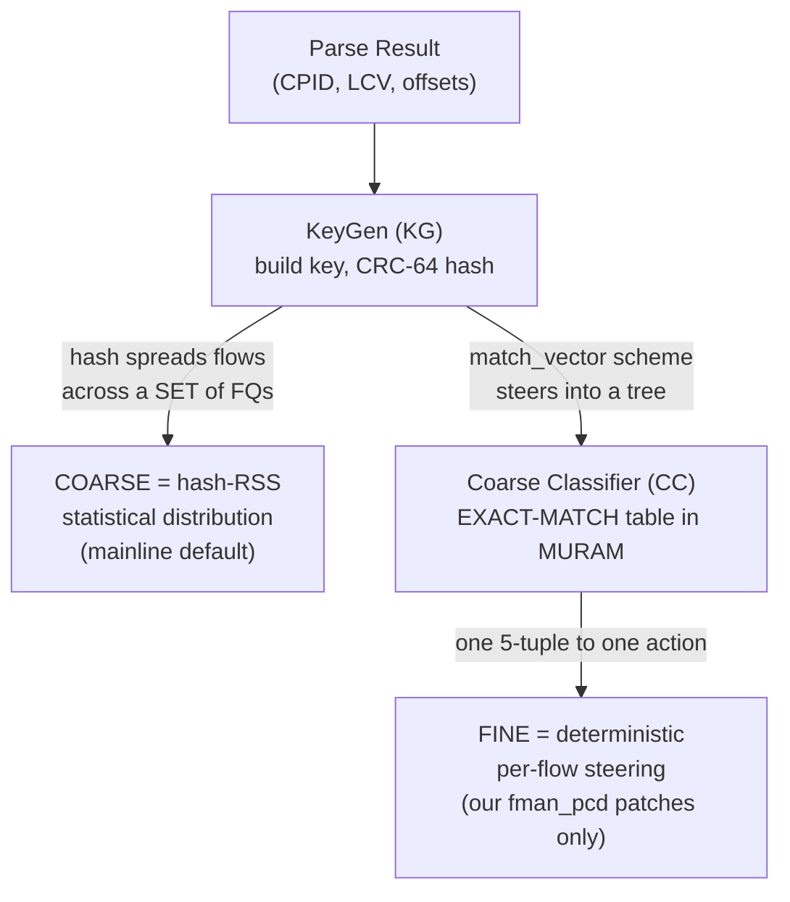
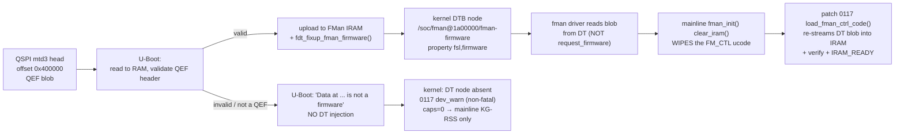

**Version 1 · VyOS LS1046A Build · 2026-06-21 · HADS 1.0.0**

# FMan Microcode — open-source 106 vs proprietary 210.10.1

## AI READING INSTRUCTION

This document is the single source of truth for the FMan microcode distinction (open-source `106` vs proprietary `210.10.1`) on the LS1046A Mono Gateway DK board. It covers QEF header decode (byte offsets, field values, md5/sha256 — preserve verbatim), the two ucode families and their version scheme, the "coarse vs fine" terminology trap (with Mermaid diagram), capability divergence between families, detection commands, the U-Boot→DTB→kernel load path (with Mermaid diagram), the operational invariant ("work with `210`, never request `106`"), and the current M3-3b stall gap. Every PCD-related document assumes a specific microcode is loaded; this document makes that assumption explicit and verifiable. Preserve all byte offsets, version numbers, md5/sha256 hashes, SoC model codes, kernel diagnostic commands, and the operational invariant verbatim. All Mermaid diagrams and tables must be preserved exactly as-is.

---

## 1. TL;DR — the one-screen answer

**[SPEC]** The following table summarizes the critical facts about FMan microcode on the LS1046A board:

| Question | Answer |
|---|---|
| What runs on **our board**? | **Proprietary `210.10.1`** QEF blob, U-Boot-injected into the DTB. |
| What is the open-source alternative? | **`106.4.18`** (`fsl_fman_ucode_ls1046_r1.0_106_4_18.bin`). |
| Is **"160"** an LS1046A ucode? | **No.** `160` is the **P1023** open-source major. "Open-source 160" for LS1046A is a **misnomer for `106`**. |
| Coarse vs fine — which is which? | **KeyGen (KG) = hash-RSS = coarse**; **Coarse-Classifier (CC) = exact-match = the "fine" classifier** (NXP's name is inverted — see §4). |
| Does mainline program CC? | **Never.** Mainline DPAA only does KG-RSS. CC is programmed solely by our `fman_pcd_*.c` patches. |
| Do both ucode families *support* CC? | Yes — both `106` (IPACC) and `210.x` silicon-support CC/HM/Policer. The gate is **which blob is loaded + executing**, not the family. |
| How is it detected? | QEF header decode (`firmware-check` §4) + kernel caps gate (patch `0086a`, `major>=210 → 0x17`). |
| What is the fallback if it is missing? | Graceful: board boots **mainline KG-RSS only**, no CC caps, `0117` `dev_warn`. There is **no** `request_firmware()` /lib/firmware fallback — by design. |

---

## 2. The QEF container

**[SPEC]** The microcode is a **QorIQ Engine Firmware (QEF)** container (`struct qe_firmware`). The first 76 bytes are the header you decode to identify a blob:

| Bytes | Field | Our board (`210.10.1`) |
|---|---|---|
| `0x00–0x03` | be32 total length | `51652` |
| `0x04–0x06` | magic | `"QEF"` |
| `0x07` | layout version | — |
| `0x08–0x45` | `id[62]` null-terminated string | `"Microcode version 210.10.1 for LS1043 r1.0"` |
| `0x46` | split-IRAM flag | `0` |
| `0x47` | microcode count | `1` |
| `0x48–0x49` | be16 SoC model code | `0x0413` (proprietary 210) · `0x0416` = open-source 106 |
| `0x4A / 0x4B` | SoC rev major / minor | — |
| entry `+112` | u8×3 version major/minor/rev | `d2 0a 01` = **210.10.1** |

**[NOTE]** The **"for LS1043 r1.0"** label in the id string is **cosmetic and correct** for this board — LS1043A and LS1046A share the same FMan v3 silicon. Do not "fix" it.

**[SPEC]** Our board's blob: `51652` bytes, md5 `6f23090a3d5ae8b302ea41fd90a14d4d`, sha256 `5f3ed8d32b8659aafd8912d5d9920306350cae7a85884d81859152b9723eff0d`, `wcount=12851` (51404 code bytes), `code_off=244`. It lives at the **head of QSPI `mtd3` "fman-ucode"** (flash offset `0x400000`).

**[BUG] Partition numbering shifts between builds** Symptom: `fw_env.config` and ucode-read scripts use the wrong mtd number and read garbage. Cause: partition numbering changes between image builds — `mtd3` here was `mtd4` on older images. Fix: Always confirm with `cat /proc/mtd` before reading raw flash. The 1 MiB at `mtd4` "recovery-dtb" is an FDT, **not** the ucode — a backup taken from the wrong partition once produced a 39880-byte FDT masquerading as ucode.

---

## 3. The two families and their version scheme

**[SPEC]** NXP open-source ucode versioning (from the `qoriq-fm-ucode` readme):

- **First number = Primary Major = feature family.** `106` = **IPACC**, `107` = DSAR + partial IPACC, `108` = NG-CAPWAP + FE + IPACC. The open-source **`106` IPACC package explicitly includes** Custom Classification (CC), Independent-Mode (IM), Host-Commands (HC), IPv4/6 Frag (IPF), Reassembly (IPR), IPsec, and Header-Manip (HM).
- **Second number = HW rev.** `.1` FMANv2 no-SW-DMA-sem · `.2` FMANv2 w/sem · `.3` FMANv3 Rev1 · `.4` FMANv3 > Rev1. LS1046A r1.0 ⇒ `106.4.18`; stock NXP RDB U-Boot prints `"Uploading microcode version 106.4.18"`.
- **`210.x` is proprietary** — a newer NXP release **not in the public repo** (`210 ≫ 108`). It is the blob U-Boot injects on this board. `210.10.1` does **not** implement the CEV doorbell / REV events (relevant to the FMan event-IRQ discussion in `soc-integration.md` §4) and lacks the **HC host-command doorbell** — so our CC approach uses **direct KG→`FM_CTL|AC_CC` dispatch + result-AD enqueue**, never the HC doorbell.

**[SPEC]** The following table maps blob identity to family, source, and board status:

| Blob | Family | Source | On our board? |
|---|---|---|---|
| `fsl_fman_ucode_ls1046_r1.0_106_4_18.bin` | open-source 106 (IPACC) | public `qoriq-fm-ucode` | no (alternative) |
| `Microcode version 210.10.1 for LS1043 r1.0` | proprietary 210.x | NXP factory (SPI `mtd3`) | **yes** |
| `fsl_fman_ucode_p1023_r1.1_160_0_18.bin` | open-source 160 — **P1023 SoC** | public | **no** — wrong SoC, the "160" misnomer |

---

## 4. Coarse vs fine — the terminology trap

**[NOTE]** NXP's PCD has **two distinct steering mechanisms** whose "coarse/fine" naming is inverted relative to the networking meaning:



**[NOTE]** **KeyGen (KG)** hashes a key and spreads flows across a *set* of frame queues → **statistical / COARSE**. This is what mainline DPAA programs by default.

**[NOTE]** **Coarse Classifier (CC)** — despite NXP's name — is the **exact-match lookup tree** = deterministic per-flow steering = the **user's "fine classifier"**. NXP named it "coarse" relative to the *Parser* (which inspects headers byte-by-byte); from a flow-granularity view it is the fine one.

**[SPEC]** Mainline DPAA never programs CC. So the practical split is: **mainline / open-source datapath = coarse hash-RSS only**; **fine exact-match CC = our `fman_pcd_*.c` patches + a loaded, executing ucode**. The ucode family (106 vs 210) does not change this — the ucode just has to be present so the `FM_CTL AC_CC` handler exists for the CC walk.

---

## 5. Capability divergence

**[SPEC]** Two independent dimensions: **which ucode is loaded** and **which driver path programs the PCD**.

| Capability | mainline-default path | open-source `106.4.18` | proprietary `210.10.1` (our board) |
|---|---|---|---|
| Parser (L2–L4 HXS) | ✅ | ✅ | ✅ |
| KeyGen hash-RSS (coarse) | ✅ (the only thing it uses) | ✅ | ✅ |
| Coarse-Classifier exact-match (fine) | ❌ never programmed | ✅ silicon-supported | ✅ **what we drive** |
| Header-Manip (NAT/TTL/cksum) | ❌ | ✅ | ✅ |
| Policer (RFC-2698/4115) | ✅ (via tc, limited) | ✅ | ✅ |
| HC host-command doorbell | n/a | ✅ | ❌ (we use direct `AC_CC` dispatch) |
| CEV doorbell / REV events | n/a | varies | ❌ (affects FMan event-IRQ wiring) |
| Kernel CC caps gate (`0086a`) | `0` | `0` (over-conservative — see note) | **`0x17`** = CC\|HM\|POL\|PARSER |

**[NOTE] Caps gate conservatism.** Patch `0086a` `dpaa_fman_caps_from_id()` grants caps `0x17` only for `major >= 210`, returning `0` for `106`. This is **over-conservative** (106 *does* have CC per the NXP readme) but **harmless for us** — our board is `210.10.1`, so the gate correctly returns `0x17` and CC programming proceeds. A `106.4.18` swap would require lifting this gate — but that swap is **ruled out as uninformative**; see `fman-fe-ehash.md` §8.4.

**[NOTE] Exact-match cell caveat.** The ✅ marks in the table mean the **silicon** supports CC, not that *classic* (FE-less) exact-match dispatch flows on the **loaded blob** today. Empirically the executing `210.10.1` port **parks** on the first classic exact-match CC frame (`FMFP_PS[STL]`; iter-33). The iter-42 disassembly shows the AC_CC handler reads **only per-frame context** (no missing FE global), so the park is most likely a **missing runtime controller-arming step** (Option B), **not** proof that classic exact-match is impossible — see `fman-fe-ehash.md` §8.1–§8.2.

---

## 6. Detection — which ucode is live?

**[SPEC]** The following commands detect which ucode is loaded:

```bash
# Human-readable, one shot (decodes id string, length, soc-model, version, md5):
firmware-check                # see its section 4

# Decode the QEF header off the U-Boot-injected DTB copy (no root, always present if loaded):
od -An -tx1 -N76 /proc/device-tree/soc/fman@1a00000/fman-firmware

# Decode off raw flash (needs root; CONFIRM the partition first — numbering shifts!):
cat /proc/mtd                 # find the "fman-ucode" partition (mtd3 on current builds)
sudo od -An -tx1 -N76 /dev/mtd3
```

**[SPEC]** The kernel's own verdict is the DT node + the caps gate:

- **DT node present** `/soc/fman@1a00000/fman-firmware` with property `fsl,firmware` ⇒ U-Boot injected a blob. Patch `0086a`'s `dpaa_fman_get_caps()` parses its id string `"Microcode version <maj>"`; `<maj> >= 210` ⇒ caps `0x17`.
- **`id` string SoC-model byte** `0x0413` ⇒ proprietary 210; `0x0416` ⇒ open-source 106.

---

## 7. Load path and the fallback

**[NOTE]** The following diagram shows the microcode load path from QSPI flash through U-Boot to the kernel and the fallback when no valid QEF is present:



**[SPEC]** U-Boot owns the load. It reads the QEF from QSPI `0x400000` into a RAM buffer, validates the header, uploads to FMan IRAM, and `fdt_fixup_fman_firmware()` **injects the blob into the kernel DTB**. The `fman_ucode` env var is a **volatile boot-computed RAM address** — **never `saveenv`** it.

**[SPEC]** The kernel never calls `request_firmware()` and there are **no `/lib/firmware/fsl*` files**. The load path is correct by construction: we get whatever U-Boot put in the DTB = `210.10.1`.

**[BUG] Mainline clear_iram wipes FM_CTL — patch 0117 reloads it** Symptom: CC dispatch silently dies; the `AC_CC` handler vanishes. Cause: mainline `fman_init()` calls `clear_iram()`, which wipes the U-Boot-uploaded **FM_CTL** microcode, and mainline **never reloads it**. Fix: Patch `0117` `load_fman_ctrl_code()` runs right after `clear_iram` in the pre-enable window — re-reads the DT QEF, streams the code words via IRAM auto-increment (`IRAM_IADD_AIE`), full verify readback, then `IRAM_READY` — replicating SDK `LoadFmanCtrlCode`. Non-fatal `dev_warn` if the DT node is absent.

**[SPEC]** Graceful degradation fallback. If `mtd3` holds garbage / an FDT instead of a QEF, U-Boot prints `"Fman1: Data at <addr> is not a firmware"`, skips injection, and the board **still boots** — the DT node is absent, `0086a` returns caps `0`, `0117` `dev_warn`s, and the datapath falls back to **mainline KG-RSS** with **no CC offload**. There is intentionally **no second firmware source**.

---

## 8. Operational invariant

**[SPEC]** Work with `210`, never request an open-source `106`. Patch `0117` MUST load the DTB-injected blob (proprietary `210.10.1`) and MUST NOT `request_firmware()` a `106` blob from `/lib/firmware`. Verified: no such code path exists. The load is correct by construction.

**[SPEC]** If you ever need to restore the factory ucode, the true QEF is the 51652-byte `210.10.1` blob at SPI offset `0x400000` (md5 `6f23090a3d5ae8b302ea41fd90a14d4d`, sha256 `5f3ed8d32b8659aafd8912d5d9920306350cae7a85884d81859152b9723eff0d`) — **not** the `mtd4` recovery-DTB.

---

## 9. Current status — M3-3b structural wall

**[NOTE]** The microcode load path is HW-proven (DTB decode + `0117` GATE-1 pass).

**[BUG] M3-3b structural wall — CC frame stall** Symptom: with `210.10.1` loaded and executing, the `AC_CC` accelerator **is** dispatched on the first CC frame (the parked FM_CTL task holds the correctly-extracted L4 key), but the port **stalls on that first frame** (`FMFP_PS` → `0x80800000`, **STL** bit8; parked task `ts[4]=0x81000000`, **PRK**) **before** any result-AD enqueue/discard fires. Cause: not yet resolved, but the most rigorous analysis (qdrant `iter-42`, 2026-06-12, full disassembly) **narrows** it to a **missing runtime FMan/PCD-enable controller-arming step** (the `FmEnable`/`FmPcdEnable`/`FmPcdCcEnable` register delta mainline `fman.c` skips — "Option B"), **not** a ucode-build defect. The `210.10.1` AC_CC handler (entry word `0x630`) reads **only the per-task context page** (`0xd0xx`) for every branch and key extraction — there is **no load from a driver-set global** it could be missing, and PRE_CC is near-identical between `106` and `210`. The 2026-06-13 finding that the *vendor* uses `USE_ENHANCED_EHASH=1` is about the vendor's **`FE_ENTER`** dispatch (a *different* handler than `AC_CC 0x06`) and does **not** establish that classic exact-match is impossible — that earlier verdict is **retracted**. Fix: under investigation, tracked via the leading-lead (Option B), the larger fallback (**Fork B** reproduce FE/ehash), and the **ruled-out** `106.4.18` swap — see `fman-fe-ehash.md` §8, `../specs/dpaa1-afxdp-modernization-spec.md` §5.6, and the ASK2 CC-steering work.

---

## 10. Cross-references

**[SPEC]** The following documents contain related information:

- [`fman-pcd.md`](fman-pcd.md) — the Parser/KeyGen/**CC**/Policer/Manip detail this ucode dispatches.
- [`fman.md`](fman.md) §8 — FMan Controller, Independent Mode, the "210 ucode" in the block context.
- [`muram.md`](muram.md) — where the CC exact-match tables the ucode walks physically live.
- [`soc-integration.md`](soc-integration.md) §4 — the CEV/REV event-IRQ discrepancy caused by `210.10.1`.
- [`software-stack-ask.md`](software-stack-ask.md) — SDK FMC vs kernel `fman_pcd_*.c` PCD programming.
- [`../specs/ask2-rewrite-spec.md`](../specs/ask2-rewrite-spec.md) §13 — `fman_pcd` subsystem; [`../specs/dpaa1-afxdp-modernization-spec.md`](../specs/dpaa1-afxdp-modernization-spec.md) §5.6 — CC stall.

**[NOTE]** This is the single source of truth for the 106-vs-210 distinction. If a sibling doc names a microcode, it should link here rather than restate the version facts.