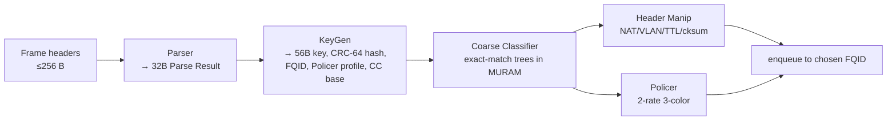
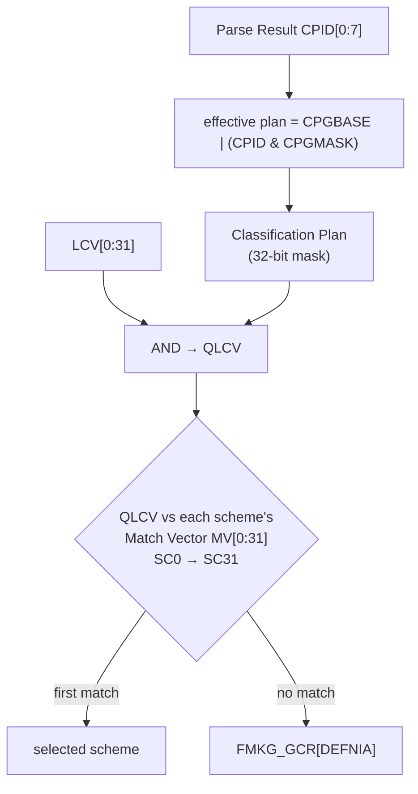
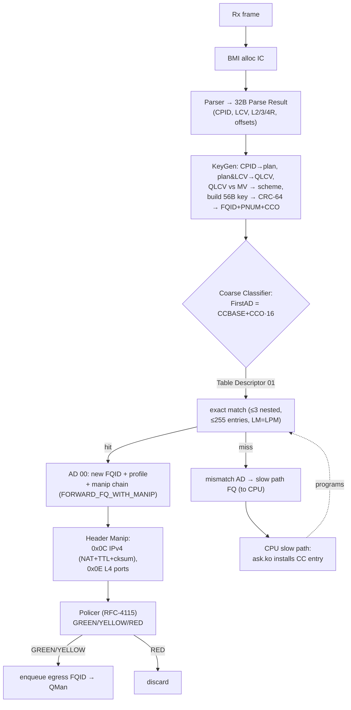

# FMan PCD — Parse · Classify · Distribute (FLAGSHIP)

**Source:** LS1046A DPAA RM §5.9–5.12 (pp.803–1182). **This is the most important arch doc for
ASK2** — the PCD is what `ask.ko` programs and what `fman_pcd_*.c` drives. Every resource ceiling
here is a hard constraint on the offload engine.

The PCD is the in-FMan pipeline that decides **where each frame goes**:

| PCD stage | RM § | Driven by source file | ASK2 use |
|---|---|---|---|
| Parser | 5.9 | `fman_pcd_prs.c` | identify L2/L3/L4 + offsets for the flow key |
| KeyGen | 5.10 | `fman_pcd_kg.c` | exact-match scheme (match_vector≠0) → flow FQID |
| Coarse Classifier | 5.12 | `fman_pcd_cc.c` | **the flow table**; `FORWARD_FQ_WITH_MANIP` |
| Header Manip | 5.12.10 | `fman_pcd_manip.c` | inline NAT / VLAN / TTL-- / checksum |
| Policer | 5.11 | `fman_pcd_plcr.c` | RFC-4115 rate limit per flow |
| (multicast) | — | `fman_pcd_replic.c` | replicate to OP2 bridge-flood |

---

## 1. Parser (§5.9)

- Invoked by the FPM after the full frame is received; reads up to **256 bytes** of headers, writes a
  **32-byte Parse Result** into the IC, then issues an NIA. Can start at any layer/offset.
- **16 valid Rx/OH ports** (IDs 1–16); other IDs → bypass with `FD[STATUS].FRDP`.
- **Hard-parser protocols:** L2 = Ethernet II, 802.3/SNAP, VLAN/QinQ (>2 tags; saves first + last TCI
  offsets), PPPoE+PPP, MPLS (>2 labels; first + last). L3 = IPv4, IPv6, tunnelled in/out, GRE v0,
  MinEncap, IPsec AH/ESP. L4 = TCP, UDP, SCTP, DCCP. Everything else → **soft parser** (1984-byte
  instruction space; can rewrite any Parse-Array field including `HPNIA`).

### The 32-byte Parse Result (IC+0x20) — what KeyGen/CC read

| Byte | Field | | Byte | Field |
|---|---|---|---|---|
| 0x00 | LogicalPortID | | 0x10 | ShimOffset_1 |
| 0x01 | ShimR | | 0x11 | ShimOffset_2 |
| 0x02–03 | L2R | | 0x12 | IP_PID_Offset |
| 0x04–05 | L3R | | 0x13 | EthOffset |
| 0x06 | L4R | | 0x15/16 | VLAN TCI offset first/last |
| 0x07 | **ClassificationPlanID** (CPID) | | 0x1B/1C | IP offset first/last |
| 0x08–09 | NxtHdr | | 0x1E | L4Offset |
| 0x0A–0B | RunningSum (1's-comp cksum) | | 0x1F | NxtHdrOffset |
| 0x0C–0F | **LCV** (Line-up Confirmation Vector) | | — | (`0xFF` in any offset = header not found) |

The two fields that drive distribution: **CPID** (selects a classification plan) and **LCV** (a
32-bit "which headers parsed OK" vector). Each hard HXS ORs its configured **LECM** into the LCV.

### Parser exceptions (set in `FD[STATUS]`)
`PTE` (cycle-limit hit, `FMPR_RPCLIM`) · `PHE` (any L*R error) · `ISP` (bad soft-parser instr, PC→0x3FF)
· `BLE` (headers spilled past first 256-byte buffer) · `FRDP` (invalid port).

---

## 2. KeyGen (§5.10) — `fman_pcd_kg.c`

**Base `0x0C_1000`** in FMan CCSR. Reads the Parse Result, builds a key, hashes it, and writes
**FQID + PNUM (policer profile) + CCBASE + SPID** into the IC Action Descriptor.

- **32 schemes** (SC0–SC31), **256 classification plans** (32 groups × 8). All scheme/plan/port-partition
  config is written *indirectly* via `FMKG_AR` (GO + SEL + NUM + RW + WSEL + HPORTID) — atomic R/W.

### Scheme selection (the match-vector path ASK2 relies on)

> **ASK2 exact-match note:** a scheme with `match_vector ≠ 0` is how `fman_pcd_kg.c` pins specific
> parsed-protocol combinations to a scheme that then steers into the CC flow table. Schemes with
> `SI=0` (not initialised, `FMKG_SE_MODE`) are skipped.

### Key construction (≤ 56 bytes)

1. **Extract Known Fields** (`EKFC`, 32-bit bitmask) — pick from canonical fields: `MACDST/SRC` (6 B),
   `VLANTCI_1/N` (2 B), `ETYPE` (2 B), `IPSRC/DST_1/N` (4 or 16 B), `PTYPE`, `IPTOS_TC`, `IPV6FL`,
   `IPSECSPI` (4 B), `L4PSRC/PDST` (2 B), `TFLG` (TCP flags). Absent header → one of 4 default values.
2. **Generic Extract** (`GEC0–7`) — 8 commands, extract 1–16 B from frame/PR/IC at `HT+EO`; up to 4
   byte-masks. `TYPE=1` variant ORs a field directly into the distribution value (KDFV).

### Hash & FQID

- **CRC-64-ECMA-182**, init `0xFFFF_…FFFF`, over the assembled key → 64-bit hash.
- **Symmetric hash** (`SYM`): XOR src/dst pairs (MAC, IP, L4 port) before hashing → **both directions
  of a flow map to the same queue** (the IC still shows original fields). Important for stateful NAT.
- `KDFV[0:23] = (hash >> HSHIFT) & HMASK | OrData`; **`FQID = KDFV | FQBASE`**. `HMASK` width sets the
  spread (e.g. `0x00003F` → 64 queues). `NO_FQID_GEN=1` = hash-only (keep BMI's FQID).
- `PNUM = ((KDFV>>PPS) & PPMASK) | PPBASE` → per-flow or static policer profile.
- **CCBASE update:** KeyGen writes 4-bit `CCO` (from up to 4 selected QLCV bits, `FMKG_SE_CCBS` +
  `CCOBASE`) → one scheme can steer to **16 different CC entry points** per port.

---

## 3. Coarse Classifier (§5.12) — `fman_pcd_cc.c` — **the flow table**

The FMan Controller is a microcode engine; its **Custom Classifier (CC)** does exact-match lookups in
MURAM-resident tables. This is literally where ASK2's hardware flow table lives.

### Hard limits (memorise these — they bound the offload)

| Limit | Value | Consequence for ASK2 |
|---|---|---|
| CC tree roots / port | **16** (4-bit `CCO`) | ≤16 independent classification entry points per port |
| Entries / match table | **255 valid** (+1 mismatch) | a single table caps at 255 flows |
| **Table size for line rate** | **≤ 128 bytes** for 18 Mpps | large tables fall off the performance cliff |
| Key sizes (fixed) | 1, 2, 4, 8, 16, 24, 32, 40, 48, **56** B | not arbitrary — round up |
| Nested lookups / packet | **≤ 3** | ≤3 chained table hops (e.g. proto→5-tuple→action) |
| IC-Index lookup | up to **4096 ADs** (12-bit `GMASK` `0x0000_FFF0`) | direct hash-bucket indexing for big flow sets |
| AD size | 16 bytes | every entry/action is 16 B in MURAM |

### Masking modes
- **No mask** — direct compare, any key size.
- **Global mask** — 4-byte uniform mask, keys ≤ 4 B only.
- **Local mask (`LM=1`)** — per-entry mask of full key size → **enables LPM/CIDR ranges**; mutually
  exclusive with a functional GMASK. (This is how route-style longest-prefix CC tables are built.)

### Action Descriptors (16 B each)

| AD type | Effect |
|---|---|
| **00 — New Classification Result** | overwrite ICAD: new FQID, RSPID, policer profile, op-mode bits → terminal action |
| **10 — Keep Classification Result** | issue NIA without changing FQID/profile (chain to manip/stats) |
| **01 — Table Descriptor** | start a key lookup: `KeyLength`, `CC_AD_Base`, `MatchTableEntriesNo`, OpCode, GMASK |

`FirstAD_address = CCBASE + CCO·16` (CCBASE 256-byte aligned from `FMBM_RCCB/OCCB`; CCO from KeyGen).
Next ADs at `NextActionDescriptorIndex·16`.

### OpCodes (what a table matches on) — selected
`0x00/01` Eth dst/src · `0x02` EtherType · `0x03/04` VLAN TCI first/last · `0x08/0B/0C` IPv4
dst/src/src+dst · `0x0F/10` IPv6 dst/src · `0x1F/20/21` L4 src/dst/src+dst port · **`0x29` IPv4
TTL==1** · **`0x2A` IPv6 HopLimit==1** · `0x2C` **IC-Index (hash bucket → ≤4096 ADs)** · `0x25/27/2B`
generic-from-PR/frame/IC (≤56 B).

> **ASK2 `FORWARD_FQ_WITH_MANIP`:** a CC entry whose action both selects an egress FQID *and* points
> at a header-manip chain is the core fast-path primitive. `0x29`/`0x2A` (TTL/hop-limit == 1) are how
> the router punts expired packets to the slow path in hardware.

> **Exact-match vs external-hash (the disposition fork — read before M2).** The exact-match
> `CONT_LOOKUP` AD above is the universal v3 CC primitive, but on the shipping **210.10.1** microcode a
> classified frame's *terminal disposition* (the BMI-FIFO free) is performed by the **Frame-Engine (FE)
> opcode VM**, which exists only on the **external-hash** dispatch path (root AD `FE_ENTER`,
> `pcAndOffsets=0xF6`, DDR buckets). A bare exact-match node that exits via `CONTRL_FLOW` (FQID-override)
> leaks the FIFO → the open **M3-3b** stall. The complete FE/ehash init contract, the two-path table,
> and the M2 decision criterion are the M0 oracle: see [`fman-fe-ehash.md`](fman-fe-ehash.md).

---

## 4. Header Manipulation (§5.12.10) — `fman_pcd_manip.c`

Inline L2–L4 rewrite done by the FMan Controller — **no CPU touch**. HMCD (Header-Manip Command
Descriptor) table **≤ 256 bytes**; each command has a `Last` bit; data may be inline or point to
MURAM.

| Opcode | Operation | Auto-side-effects |
|---|---|---|
| 0x00 | Header remove (L2 strip) | — |
| 0x01–02 | Insert / replace arbitrary bytes | — |
| 0x0B | VLAN priority update | direct, or **DSCP→VPri** 64-entry/32-byte lookup |
| **0x0C** | **Local IPv4 update** — TOS, **TTL decrement**, IP-ID, src, dst | **auto-regenerates IP checksum**; optional TCP/UDP cksum |
| 0x0D | Internal L3 replace (full IPv4/IPv6 swap from MURAM) | — |
| **0x0E** | **Local TCP/UDP update** — src/dst port | **incremental L4 checksum** (skipped if original==0) |
| 0x16+ | Local L3 insert (tunnel header) | — |

This block **is** ASK2's inline NAT: 0x0C rewrites IP addr + decrements TTL + fixes the IP checksum
automatically; 0x0E rewrites L4 ports + fixes the L4 checksum incrementally.

> ⚠ **Risk #13 (ASK2 spec §16 / §13.3 — `muram.md`):** each manip chain must total **≤ 1 KiB MURAM**.
> On the board after PR14z21, `fman_pcd_manip_chain_create(3 manips)` failed `-ENOMEM` (errno 12) **327×**
> while `gen_pool` still had ~320 KiB free → needs instrumentation. `fman_pcd_manip.c` must budget AD
> entries (≤4/chain) and MURAM carefully. See [`muram.md`](muram.md).

---

## 5. Policer (§5.11) — `fman_pcd_plcr.c`

- **256 profiles**, each a **64-byte** entry in **16 KB PRAM** (ECC-protected). Accessed atomically
  via `FMPL_PAR` (PNUM + PWSEL word-select).
- **Algorithms:** pass-through · **RFC-2698** (CIR+PIR / CBS+PBS, buckets C+P) · **RFC-4115** (CIR+EIR /
  CBS+EBS, buckets C+E). Color-blind or color-aware. Output color = **GREEN/YELLOW/RED** in
  `FD[STATUS].FCL`.
- Rates are **Q16.16 fixed-point** bytes/s (or packets/s with `PKT`). Frame-length selection = full /
  L2 / L3 / L4.
- **Per-color NIA** (`GNIA/YNIA/RNIA`) → a profile can **chain to another profile** (concatenation) or
  drop (RED→discard). Per-port virtualisation via `FMPL_PMR1–63` + `FMPL_DPMR`.
- **Init gotchas:** set `CTS`/`PTS_ETS` = `0xFFFFFFFF` (full bucket), `LTS` = 0 — hardware
  auto-calibrates on the first packet. Partial writes (`PWSEL`) let you bulk-init many profiles.

ASK2 uses RFC-4115 for per-flow rate limiting; the YELLOW/RED NIAs map to mark/drop policy.

---

## 6. Replicator (`fman_pcd_replic.c`)

Frame replication (multicast / mirror) is built on CC AD chaining: an AD fans a frame to multiple
egress FQs. In ASK2 this backs the **OP2 bridge-flood** path (replicate to all bridge member ports).
The RM treats replication as a CC/Manip construct rather than a separate register block, so its limits
are the CC/AD limits above (16-byte ADs, MURAM budget).

---

## 7. Consolidated resource ceilings (LS1046A FMan_v3 PCD)

| Resource | Count | Source |
|---|---|---|
| Parser hard protocols | 16 | §5.9 p.803 |
| Parser Rx/OH ports | 16 (IDs 1–16) | §5.9 p.879 |
| Parse Result | 32 bytes | Table 5-357 |
| **KeyGen schemes** | **32** | `FMKG_SEER`; `FMKG_AR[NUM]`=5b |
| **Classification plans** | **256** (32×8) | p.918 |
| KeyGen max key | 56 B | §5.10 |
| KeyGen generic extracts | 8 (GEC0–7) | §5.10 |
| Hash | CRC-64-ECMA-182 | §5.10.4.3 |
| FQID width | 24 bits | `FMKG_SE_FQB` |
| **Policer profiles** | **256** (16 KB PRAM/64 B) | §5.11 |
| Policer algorithms | 3 (PT / 2698 / 4115) | §5.11 |
| **CC roots / port** | **16** | §5.12 p.1014 |
| **CC entries / table** | **255** (+1 miss) | §5.12 p.1032 |
| CC line-rate table size | ≤ 128 B (18 Mpps) | §5.12 p.1020 |
| CC key sizes | 1/2/4/8/16/24/32/40/48/56 B | §5.12 |
| CC nested lookups | ≤ 3 / packet | §5.12 |
| CC IC-Index | ≤ 4096 ADs (12-bit GMASK) | §5.12 p.1033 |
| CC AD size | 16 B | §5.12 |
| HMCD table | ≤ 256 B | §5.12.10 |
| Manip MURAM / chain | ≤ 1 KiB (Risk #13) | ASK2 spec §13.3 |

---

## 8. End-to-end PCD dataflow

This is the whole ASK2 thesis: **first packet misses the CC table → goes to the CPU → `ask.ko`
installs a flow entry → every subsequent packet of that flow stays in silicon** (parse → match →
NAT/TTL/cksum → police → egress), never touching a core.

---

## 9. Source-file map (ASK2 `fman_pcd` subsystem, spec §13)

| File | Owns | Key RM section here |
|---|---|---|
| `fman_pcd.c` | orchestration / lifecycle | all |
| `fman_pcd_prs.c` | Parser + HXS + soft parser | §1 above |
| `fman_pcd_kg.c` | KeyGen schemes, exact match (`match_vector≠0`) | §2 |
| `fman_pcd_cc.c` | CC trees, `FORWARD_FQ_WITH_MANIP`, `fman_pcd_cc_node_modify_next_action` | §3 |
| `fman_pcd_manip.c` | NAT/VLAN/TTL/checksum chains (Risk #13 budgeting) | §4 |
| `fman_pcd_plcr.c` | RFC-4115 policer profiles | §5 |
| `fman_pcd_replic.c` | multicast / OP2 flood | §6 |

Exposed to `ask.ko` via `<linux/fsl/fman_pcd.h>` (shared-board patches `0092` / `0097–0100`,
`CONFIG_FSL_FMAN_PCD=y`). See [`software-stack-ask.md`](software-stack-ask.md) and
[`../specs/ask2-rewrite-spec.md`](../specs/ask2-rewrite-spec.md) §13.

*Related: [`muram.md`](muram.md) (where these tables physically live + the -ENOMEM risk),
[`qman-ceetm.md`](qman-ceetm.md) (where the chosen FQID goes next).*
