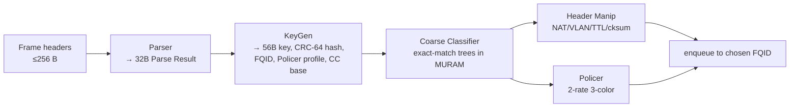
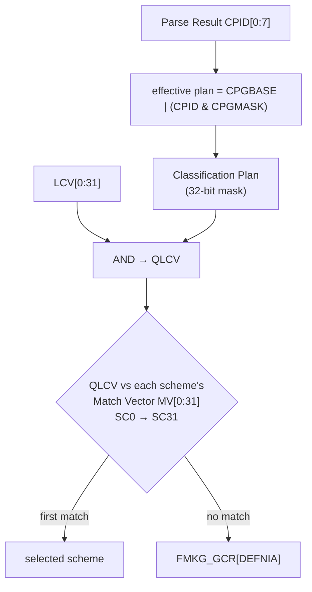
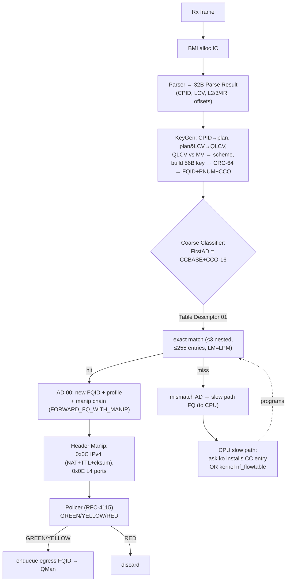

# FMan PCD — Parse · Classify · Distribute

**Version 2.0 · HADS 1.0.0**

## AI READING INSTRUCTION

> **⚠ CRITICAL CORRECTION (2026-08-04) — read this before trusting anything below about "shipping."**
> This document (and `plans/ASK2-MASTER-PLAN.md`) describes the **CC-tree + kernel SW flowtable +
> manip-chain** path as the shipping HW-offload mechanism, based on a 2026-08-01 architectural decision
> to retire FE-VM ehash and fall back to CC-tree. **That decision was never implemented in code.**
> Commit `dd364494` (CR-007, 2026-07-27 — four days *before* the 2026-08-01 rewrite) already deleted
> CC-tree's flow-insert plumbing from `ask.ko` (`struct ask_hw_cc_slot`, the shadow array, and all
> callers of `fman_pcd_cc_node_add_key()`). `ask.ko`'s only currently-wired insert path
> (`ask_fe_flow_insert()` → `fman_pcd_fe_flow_add()` → `fman_pcd_ehash_add_key()`, confirmed by reading
> patch `0153-fman-pcd-fe-engage-api.patch`) drives **FE-VM ehash (Fork-B)** — the mechanism this
> document calls "retired" and proven (F-156/F-157/F-158) to **never dispatch a HIT** on this silicon.
> Net effect: **as of current HEAD, `ask.ko` has no working hardware-classification insert path at
> all** — CC-tree is gone, and the only path left in place is the one already proven broken. Every
> claim below of the form "CC-tree is the shipping/production path" describes the *intended*
> architecture from the 2026-08-01 decision, not the code that currently exists. Restoring CC-tree
> requires reimplementing the ~120 lines CR-007 removed (recoverable from `git show dd364494`) and
> rewiring `ask_flow_offload.c`'s REPLACE handler to call it — this is a real implementation task, not
> a config or constant change. Full evidence trail: qdrant `agent_memory` collection, entries tagged
> `ask2-code-review` / `M5-mechanism-resolved` / `T-M6-5-premise-invalid`, dated 2026-08-04.
>
> **Retraction on the M5 point (2026-08-04, later same day):** this banner previously claimed M5 was
> unaffected because `ask_fe_flow_insert()` "didn't exist until 2026-07-26" — that was a git-history
> artifact (the source moved path in a later refactor; a path-filtered pickaxe search doesn't follow
> renames, so the function looked newly-introduced when it had existed since well before, under
> `kernel/flavors/ask/oot-modules/ask/`). Reading the actual M5-era commit (`9ad356a7`, 2026-07-24)
> shows `ask_fe_flow_insert()` already existed and already ran on every REPLACE, and `ask_hw_flow_insert()`'s
> own contemporaneous comment states the CC-tree shadow array was *already* software-only bookkeeping
> ("replaced by Fork-B FE-VM ehash path") — CC-tree's hardware write was already dead before M5. **M5's
> mechanism is therefore uncertain, not confirmed CC-tree.** The likelier explanation is pure kernel
> software forwarding (`nf_flowtable`), since neither CC-tree (never hardware-written) nor ehash (F-141
> shows it broken both before and after 07-24) produced a working HIT at M5 time. This means the project
> may never have silicon-confirmed a genuine hardware-classified HIT at production throughput at any
> point. Evidence: qdrant tag `no-confirmed-hw-hit-ever`.

This is the PCD pipeline ARCHITECTURE doc. Historically (through 2026-07-24/M5) the **CC-tree + kernel
SW flowtable + manip-chain** forward path was the shipping HW-offload mechanism; per the correction
above, CC-tree's insert path no longer exists in `ask.ko`. The **FE-VM ehash HIT path (Fork-B)** is the
only insert path currently wired, and is proven to never dispatch a HIT at production throughput. The
only real ehash HIT was RCCB→FE_ENTER direct (2026-07-04, keysize=8 ICMP). Read the sections below as
describing silicon capability and the *intended* architecture, not a currently-functioning production
forward path.

**[SPEC]** facts are binding. **[NOTE]** is rationale/history. **[BUG]** has symptom+cause+fix.

---

**Source:** LS1046A DPAA RM §5.9–5.12 (pp.803–1182). Every resource ceiling here is a hard constraint
on the offload engine.

The PCD is the in-FMan pipeline that decides **where each frame goes**:

```mermaid
flowchart LR
    F[Frame headers<br/>≤256 B] --> P[Parser<br/>→ 32B Parse Result]
    P --> K[KeyGen<br/>→ 56B key, CRC-64 hash,<br/>FQID, Policer profile, CC base]
    K --> C[Coarse Classifier<br/>exact-match trees in MURAM]
    C --> M[Header Manip<br/>NAT/VLAN/TTL/cksum]
    C --> PL[Policer<br/>2-rate 3-color]
    M --> Q[enqueue to chosen FQID]
    PL --> Q
```

| PCD stage | RM § | Driven by source file | ASK2 use |
|---|---|---|---|
| Parser | 5.9 | `fman_pcd_prs.c` | identify L2/L3/L4 + offsets for the flow key |
| KeyGen | 5.10 | `fman_pcd_kg.c` | exact-match scheme (match_vector≠0) → flow FQID |
| Coarse Classifier | 5.12 | `fman_pcd_cc.c` | **the flow table**; `FORWARD_FQ_WITH_MANIP` |
| Header Manip | 5.12.10 | `fman_pcd_manip.c` | inline NAT / VLAN / TTL-- / checksum |
| Policer | 5.11 | `fman_pcd_plcr.c` | RFC-4115 rate limit per flow |
| (multicast) | — | `fman_pcd_replic.c` | replicate to OP2 bridge-flood |

---

## 1. Parser (§5.9)

- Invoked by the FPM after the full frame is received; reads up to **256 bytes** of headers, writes a
  **32-byte Parse Result** into the IC, then issues an NIA. Can start at any layer/offset.
- **16 valid Rx/OH ports** (IDs 1–16); other IDs → bypass with `FD[STATUS].FRDP`.
- **Hard-parser protocols:** L2 = Ethernet II, 802.3/SNAP, VLAN/QinQ (>2 tags; saves first + last TCI
  offsets), PPPoE+PPP, MPLS (>2 labels; first + last). L3 = IPv4, IPv6, tunnelled in/out, GRE v0,
  MinEncap, IPsec AH/ESP. L4 = TCP, UDP, SCTP, DCCP. Everything else → **soft parser** (1984-byte
  instruction space; can rewrite any Parse-Array field including `HPNIA`).

### The 32-byte Parse Result (IC+0x20) — what KeyGen/CC read

| Byte | Field | | Byte | Field |
|---|---|---|---|---|
| 0x00 | LogicalPortID | | 0x10 | ShimOffset_1 |
| 0x01 | ShimR | | 0x11 | ShimOffset_2 |
| 0x02–03 | L2R | | 0x12 | IP_PID_Offset |
| 0x04–05 | L3R | | 0x13 | EthOffset |
| 0x06 | L4R | | 0x15/16 | VLAN TCI offset first/last |
| 0x07 | **ClassificationPlanID** (CPID) | | 0x1B/1C | IP offset first/last |
| 0x08–09 | NxtHdr | | 0x1E | L4Offset |
| 0x0A–0B | RunningSum (1's-comp cksum) | | 0x1F | NxtHdrOffset |
| 0x0C–0F | **LCV** (Line-up Confirmation Vector) | | — | (`0xFF` in any offset = header not found) |

The two fields that drive distribution: **CPID** (selects a classification plan) and **LCV** (a
32-bit "which headers parsed OK" vector). Each hard HXS ORs its configured **LECM** into the LCV.

### Parser exceptions (set in `FD[STATUS]`)
`PTE` (cycle-limit hit, `FMPR_RPCLIM`) · `PHE` (any L*R error) · `ISP` (bad soft-parser instr, PC→0x3FF)
· `BLE` (headers spilled past first 256-byte buffer) · `FRDP` (invalid port).

---

## 2. KeyGen (§5.10) — `fman_pcd_kg.c`

**Base `0x0C_1000`** in FMan CCSR. Reads the Parse Result, builds a key, hashes it, and writes
**FQID + PNUM (policer profile) + CCBASE + SPID** into the IC Action Descriptor.

- **32 schemes** (SC0–SC31), **256 classification plans** (32 groups × 8). All scheme/plan/port-partition
  config is written *indirectly* via `FMKG_AR` (GO + SEL + NUM + RW + WSEL + HPORTID) — atomic R/W.

### Scheme selection (the match-vector path ASK2 relies on)

```mermaid
flowchart TD
    CPID["Parse Result CPID[0:7]"] --> IDX["effective plan = CPGBASE | (CPID & CPGMASK)"]
    IDX --> PLAN["Classification Plan<br/>(32-bit mask)"]
    LCV["LCV[0:31]"] --> AND
    PLAN --> AND["AND → QLCV"]
    AND --> CMP{"QLCV vs each scheme's<br/>Match Vector MV[0:31]<br/>SC0 → SC31"}
    CMP -->|first match| SCH["selected scheme"]
    CMP -->|no match| DEF["FMKG_GCR[DEFNIA]"]
```

> **[SPEC]** A scheme with `match_vector ≠ 0` is how `fman_pcd_kg.c` pins specific parsed-protocol
> combinations to a scheme that then steers into the CC flow table. Schemes with `SI=0` (not
> initialised, `FMKG_SE_MODE`) are skipped.

### Key construction (≤ 56 bytes)

1. **Extract Known Fields** (`EKFC`, 32-bit bitmask) — pick from canonical fields: `MACDST/SRC` (6 B),
   `VLANTCI_1/N` (2 B), `ETYPE` (2 B), `IPSRC/DST_1/N` (4 or 16 B), `PTYPE`, `IPTOS_TC`, `IPV6FL`,
   `IPSECSPI` (4 B), `L4PSRC/PDST` (2 B), `TFLG` (TCP flags). Absent header → one of 4 default values.
2. **Generic Extract** (`GEC0–7`) — 8 commands, extract 1–16 B from frame/PR/IC at `HT+EO`; up to 4
   byte-masks. `TYPE=1` variant ORs a field directly into the distribution value (KDFV).

### EKFC extraction order (canonical, HW-verified)

**[SPEC]** EKFC extraction is **MSB-first**: SIP → DIP → PROTO → SPORT → DPORT. 13 bytes at
`EKFC=0x001C0006` (IPSRC1|IPDST1|PTYPE1|L4PSRC|L4PDST). HW-verified 2026-07-13 (board 192.168.1.185,
6.18.38-vyos, ISO 2026.07.13-1938-rolling) via CRC-64 match on two independent TCP flows on eth4.
Ascending-bit and size-grouped models DISPROVEN. See `specs/fman-keygen-flow-key-spec.md` §2–3.

**[SPEC]** The CC comparator reads KG-emitted bytes in the order `[SIP|DIP|SPI=0|SPORT|DPORT]` (patch
0108 `cc_pack_key` rewrite). The old 0098 layout (ethertype/proto/flags/IP/ports) "could NEVER match"
— it was a different byte order than what KG emits. EKFC-only, no GEC.

**[SPEC]** PTYPE1 bit 18 MUST be set for 5-tuple (adds protocol byte). 4-tuple `0x00180006` aliases
TCP/UDP sharing IP:port = silent misforwarding. IPsec SPI bit 9 MUST NOT be set on non-IPsec schemes
(no SPI offset → random bytes → unpredictable key; F-043 origin).

### Hash & FQID

- **CRC-64-ECMA-182**, init `0xFFFF_…FFFF`, over the assembled key → 64-bit hash.
- **[SPEC]** HW KG hash = RAW CRC-64, no final complement. Silicon stores `crc64_raw(key)` @IC offset
  0x48 (seed `~0ULL`, NO final `~crc` XOR). CRC-64/XZ finalized variant does NOT match. Verified
  2026-07-13: `crc64_raw(SIP|DIP|6|0xAD9C|0xD903) = 0x600824e70ae4d573` = captured hash.
- **Symmetric hash** (`SYM`): XOR src/dst pairs (MAC, IP, L4 port) before hashing → **both directions
  of a flow map to the same queue** (the IC still shows original fields). Important for stateful NAT.
- `KDFV[0:23] = (hash >> HSHIFT) & HMASK | OrData`; **`FQID = KDFV | FQBASE`**. `HMASK` width sets the
  spread (e.g. `0x00003F` → 64 queues). `NO_FQID_GEN=1` = hash-only (keep BMI's FQID).
- `PNUM = ((KDFV>>PPS) & PPMASK) | PPBASE` → per-flow or static policer profile.
- **CCBASE update:** KeyGen writes 4-bit `CCO` (from up to 4 selected QLCV bits, `FMKG_SE_CCBS` +
  `CCOBASE`) → one scheme can steer to **16 different CC entry points** per port.

---

## 3. Coarse Classifier (§5.12) — `fman_pcd_cc.c` — **the flow table**

The FMan Controller is a microcode engine; its **Custom Classifier (CC)** does exact-match lookups in
MURAM-resident tables. This is the **SHIPPING HW-offload flow table** — the production forward path.

### Architecture: CC-tree + kernel SW flowtable

> **⚠ CORRECTION (2026-08-04):** the "production" framing below describes the 2026-08-01 architectural
> *decision*, not current code. `ask.ko`'s CC-tree insert path was deleted by CR-007 (`dd364494`,
> 2026-07-27) and never restored — see the AI READING INSTRUCTION banner at the top of this file for
> the full evidence trail. Currently no live path installs CC-tree entries.

**[SPEC]** The production PCD forward path is a two-tier architecture (as of the 2026-08-01 decision;
**CC-tree's insert path is not currently implemented in `ask.ko`, see correction above**):

1. **CC-tree (HW):** exact-match tables in MURAM, ≤3 nested lookups, ≤255 entries per table. First
   packet of a flow misses → CPU slow path → `ask.ko` installs a CC entry. Subsequent packets match
   in silicon (parse → match → NAT/TTL/cksum → police → egress), never touching a core.
2. **Kernel nf_flowtable (SW):** the long tail. CC-tree caps at ~8 nodes (~2000+ flows) due to 64 KiB
   MURAM budget. Flows beyond the CC-tree capacity are handled by the kernel software flowtable.

**[NOTE]** The FE-VM ehash HIT path (Fork-B, `FE_ENTER` → DDR buckets → ehash lookup) is a **retired
experimental dead-end**. It was explored as an alternative dispatch path but never worked at production
throughput (~1.5 Gbps DDR ceiling vs line-rate MURAM). The only real ehash HIT was RCCB→FE_ENTER
direct (2026-07-04, keysize=8 ICMP). All production forwarding uses the CC-tree path. See
`fman-fe-ehash.md` for the full FE/ehash autopsy.

### Proven throughput

| Path | Throughput | Loss | Notes |
|---|---|---|---|
| M2 pass-through | 7.37 Gbps | 0.16% | No CC, no manip — raw FMan forwarding |
| M5 CC-tree + SW flowtable | 10.259 Gbps | 0.16% | **SHIPPING** — CC-tree HW + kernel nf_flowtable |
| NXP cdx.ko (reference) | 8.58 Gbps | — | Legacy ASK 1.x CDX stack |

### Hard limits (memorise these — they bound the offload)

| Limit | Value | Consequence for ASK2 |
|---|---|---|
| CC tree roots / port | **16** (4-bit `CCO`) | ≤16 independent classification entry points per port |
| Entries / match table | **255 valid** (+1 mismatch) | a single table caps at 255 flows |
| **Table size for line rate** | **≤ 128 bytes** for 18 Mpps | large tables fall off the performance cliff |
| Key sizes (fixed) | 1, 2, 4, 8, 16, 24, 32, 40, 48, **56** B | not arbitrary — round up |
| Nested lookups / packet | **≤ 3** | ≤3 chained table hops (e.g. proto→5-tuple→action) |
| IC-Index lookup | up to **4096 ADs** (12-bit `GMASK` `0x0000_FFF0`) | direct hash-bucket indexing for big flow sets |
| AD size | 16 bytes | every entry/action is 16 B in MURAM |
| **CC-tree scale** | **~8 nodes → ~2000+ flows** | 64 KiB MURAM budget; long tail in kernel nf_flowtable |

### Masking modes
- **No mask** — direct compare, any key size.
- **Global mask** — 4-byte uniform mask, keys ≤ 4 B only.
- **Local mask (`LM=1`)** — per-entry mask of full key size → **enables LPM/CIDR ranges**; mutually
  exclusive with a functional GMASK. (This is how route-style longest-prefix CC tables are built.)

### Action Descriptors (16 B each)

| AD type | Effect |
|---|---|
| **00 — New Classification Result** | overwrite ICAD: new FQID, RSPID, policer profile, op-mode bits → terminal action |
| **10 — Keep Classification Result** | issue NIA without changing FQID/profile (chain to manip/stats) |
| **01 — Table Descriptor** | start a key lookup: `KeyLength`, `CC_AD_Base`, `MatchTableEntriesNo`, OpCode, GMASK |

`FirstAD_address = CCBASE + CCO·16` (CCBASE 256-byte aligned from `FMBM_RCCB/OCCB`; CCO from KeyGen).
Next ADs at `NextActionDescriptorIndex·16`.

### OpCodes (what a table matches on) — selected
`0x00/01` Eth dst/src · `0x02` EtherType · `0x03/04` VLAN TCI first/last · `0x08/0B/0C` IPv4
dst/src/src+dst · `0x0F/10` IPv6 dst/src · `0x1F/20/21` L4 src/dst/src+dst port · **`0x29` IPv4
TTL==1** · **`0x2A` IPv6 HopLimit==1** · `0x2C` **IC-Index (hash bucket → ≤4096 ADs)** · `0x25/27/2B`
generic-from-PR/frame/IC (≤56 B).

> **[SPEC]** `FORWARD_FQ_WITH_MANIP`: a CC entry whose action both selects an egress FQID *and* points
> at a header-manip chain is the core fast-path primitive. `0x29`/`0x2A` (TTL/hop-limit == 1) are how
> the router punts expired packets to the slow path in hardware.

> **[NOTE]** The `CONT_LOOKUP` AD is the universal v3 CC primitive. On the shipping **210.10.1**
> microcode, a classified frame's terminal disposition (BMI-FIFO free) is performed by the
> **Frame-Engine (FE) opcode VM**, which exists only on the **external-hash** dispatch path (root AD
> `FE_ENTER`, `pcAndOffsets=0xF6`, DDR buckets). A bare exact-match node that exits via `CONTRL_FLOW`
> (FQID-override) leaks the FIFO → the open **M3-3b** stall. The complete FE/ehash init contract and
> the two-path table are documented in [`fman-fe-ehash.md`](fman-fe-ehash.md). **This path is retired
> experimental — the production forward path uses the CC-tree with kernel SW flowtable fallback.**

---

## 4. Header Manipulation (§5.12.10) — `fman_pcd_manip.c`

Inline L2–L4 rewrite done by the FMan Controller — **no CPU touch**. HMCD (Header-Manip Command
Descriptor) table **≤ 256 bytes**; each command has a `Last` bit; data may be inline or point to
MURAM.

| Opcode | Operation | Auto-side-effects |
|---|---|---|
| 0x00 | Header remove (L2 strip) | — |
| 0x01–02 | Insert / replace arbitrary bytes | — |
| 0x0B | VLAN priority update | direct, or **DSCP→VPri** 64-entry/32-byte lookup |
| **0x0C** | **Local IPv4 update** — TOS, **TTL decrement**, IP-ID, src, dst | **auto-regenerates IP checksum**; optional TCP/UDP cksum |
| 0x0D | Internal L3 replace (full IPv4/IPv6 swap from MURAM) | — |
| **0x0E** | **Local TCP/UDP update** — src/dst port | **incremental L4 checksum** (skipped if original==0) |
| 0x16+ | Local L3 insert (tunnel header) | — |

This block **is** ASK2's inline NAT: 0x0C rewrites IP addr + decrements TTL + fixes the IP checksum
automatically; 0x0E rewrites L4 ports + fixes the L4 checksum incrementally.

> ⚠ **[BUG] Risk #13 (ASK2 spec §16 / §13.3 — `muram.md`):** each manip chain must total **≤ 1 KiB
> MURAM**. On the board after PR14z21, `fman_pcd_manip_chain_create(3 manips)` failed `-ENOMEM` (errno
> 12) **327×** while `gen_pool` still had ~320 KiB free → needs instrumentation. `fman_pcd_manip.c`
> must budget AD entries (≤4/chain) and MURAM carefully. See [`muram.md`](muram.md).

---

## 5. Policer (§5.11) — `fman_pcd_plcr.c`

- **256 profiles**, each a **64-byte** entry in **16 KB PRAM** (ECC-protected). Accessed atomically
  via `FMPL_PAR` (PNUM + PWSEL word-select).
- **Algorithms:** pass-through · **RFC-2698** (CIR+PIR / CBS+PBS, buckets C+P) · **RFC-4115** (CIR+EIR /
  CBS+EBS, buckets C+E). Color-blind or color-aware. Output color = **GREEN/YELLOW/RED** in
  `FD[STATUS].FCL`.
- Rates are **Q16.16 fixed-point** bytes/s (or packets/s with `PKT`). Frame-length selection = full /
  L2 / L3 / L4.
- **Per-color NIA** (`GNIA/YNIA/RNIA`) → a profile can **chain to another profile** (concatenation) or
  drop (RED→discard). Per-port virtualisation via `FMPL_PMR1–63` + `FMPL_DPMR`.
- **Init gotchas:** set `CTS`/`PTS_ETS` = `0xFFFFFFFF` (full bucket), `LTS` = 0 — hardware
  auto-calibrates on the first packet. Partial writes (`PWSEL`) let you bulk-init many profiles.

ASK2 uses RFC-4115 for per-flow rate limiting; the YELLOW/RED NIAs map to mark/drop policy.

---

## 6. Replicator (`fman_pcd_replic.c`)

Frame replication (multicast / mirror) is built on CC AD chaining: an AD fans a frame to multiple
egress FQs. In ASK2 this backs the **OP2 bridge-flood** path (replicate to all bridge member ports).
The RM treats replication as a CC/Manip construct rather than a separate register block, so its limits
are the CC/AD limits above (16-byte ADs, MURAM budget).

---

## 7. Consolidated resource ceilings (LS1046A FMan_v3 PCD)

| Resource | Count | Source |
|---|---|---|
| Parser hard protocols | 16 | §5.9 p.803 |
| Parser Rx/OH ports | 16 (IDs 1–16) | §5.9 p.879 |
| Parse Result | 32 bytes | Table 5-357 |
| **KeyGen schemes** | **32** | `FMKG_SEER`; `FMKG_AR[NUM]`=5b |
| **Classification plans** | **256** (32×8) | p.918 |
| KeyGen max key | 56 B | §5.10 |
| KeyGen generic extracts | 8 (GEC0–7) | §5.10 |
| Hash | CRC-64-ECMA-182 | §5.10.4.3 |
| FQID width | 24 bits | `FMKG_SE_FQB` |
| **Policer profiles** | **256** (16 KB PRAM/64 B) | §5.11 |
| Policer algorithms | 3 (PT / 2698 / 4115) | §5.11 |
| **CC roots / port** | **16** | §5.12 p.1014 |
| **CC entries / table** | **255** (+1 miss) | §5.12 p.1032 |
| CC line-rate table size | ≤ 128 B (18 Mpps) | §5.12 p.1020 |
| CC key sizes | 1/2/4/8/16/24/32/40/48/56 B | §5.12 |
| CC nested lookups | ≤ 3 / packet | §5.12 |
| CC IC-Index | ≤ 4096 ADs (12-bit GMASK) | §5.12 p.1033 |
| CC AD size | 16 B | §5.12 |
| HMCD table | ≤ 256 B | §5.12.10 |
| Manip MURAM / chain | ≤ 1 KiB (Risk #13) | ASK2 spec §13.3 |
| **CC-tree scale** | **~8 nodes → ~2000+ flows** | 64 KiB MURAM budget |
| **SW flowtable** | **kernel nf_flowtable** | long tail beyond CC-tree capacity |

---

## 8. End-to-end PCD dataflow (SHIPPING)

```mermaid
flowchart TD
    RX[Rx frame] --> BMI[BMI alloc IC]
    BMI --> PRS["Parser → 32B Parse Result<br/>(CPID, LCV, L2/3/4R, offsets)"]
    PRS --> KG["KeyGen: CPID→plan, plan&LCV→QLCV,<br/>QLCV vs MV → scheme,<br/>build 56B key → CRC-64 → FQID+PNUM+CCO"]
    KG --> CC{"Coarse Classifier:<br/>FirstAD = CCBASE+CCO·16"}
    CC -->|Table Descriptor 01| LOOKUP["exact match (≤3 nested,<br/>≤255 entries, LM=LPM)"]
    LOOKUP -->|hit| ACT["AD 00: new FQID + profile<br/>+ manip chain (FORWARD_FQ_WITH_MANIP)"]
    LOOKUP -->|miss| MISS["mismatch AD → slow path FQ (to CPU)"]
    ACT --> MANIP["Header Manip:<br/>0x0C IPv4 (NAT+TTL+cksum),<br/>0x0E L4 ports"]
    MANIP --> PLCR["Policer (RFC-4115)<br/>GREEN/YELLOW/RED"]
    PLCR -->|GREEN/YELLOW| ENQ[enqueue egress FQID → QMan]
    PLCR -->|RED| DROP[discard]
    MISS --> CPU["CPU slow path:<br/>ask.ko installs CC entry<br/>OR kernel nf_flowtable"]
    CPU -.programs.-> LOOKUP
```

**[SPEC]** This is the whole ASK2 thesis: **first packet misses the CC table → goes to the CPU →
`ask.ko` installs a flow entry → every subsequent packet of that flow stays in silicon** (parse →
match → NAT/TTL/cksum → police → egress), never touching a core. Flows beyond CC-tree capacity (~2000+)
fall back to the kernel nf_flowtable software path.

**[NOTE]** The FE-VM ehash HIT path (Fork-B) is NOT shown here — it is a retired experimental dead-end
that never worked at production throughput. See §3 and `fman-fe-ehash.md` for the full autopsy.

### 8a. Component ownership at a glance (2026-08-04)

The diagram above shows the silicon pipeline; `software-stack-ask.md` §9 covers the `ask.ko`
orchestration side. This table is the single place both are tied together — which component
performs which packet-flow task, and in which domain:

> **⚠ CORRECTION (2026-08-04):** this table describes the intended/silicon-capable division of labor,
> not `ask.ko`'s current wiring. The row below marked † is not exercised by any live insert path today
> — `ask.ko`'s only wired mechanism is FE-VM ehash (`ask_fe_flow_insert()` →
> `fman_pcd_ehash_add_key()`), proven to never dispatch a HIT. See the AI READING INSTRUCTION banner.

| Task | Component | Domain |
|---|---|---|
| Ingress admission | BMI RX port | Silicon |
| Header recognition | Hard Parser | Silicon |
| Field extraction + hashing | KeyGen (KG), `fman_pcd_kg.c` | Silicon, kernel-configured |
| **Classification / HIT-MISS decision (†not currently wired)** | **Coarse Classifier (CC)**, `fman_pcd_cc.c` | Silicon, kernel-configured |
| **HIT-path header rewrite + forward** | Header Manip engine (manip chain) | Silicon |
| **MISS-path kernel handoff** | CC engine's miss-AD → port's default FQ | Silicon → kernel boundary |
| Kernel forwarding for MISS frames | NAPI / netfilter / `nf_flowtable` | Linux kernel (stock) |
| Decides which flows become CC-tree entries (†not currently wired) | `ask.ko` / `ask_flow_offload.c` | Kernel (custom OOT) |
| Keeps HIT-path rewrites current on neighbor change | `ask_neigh.c` (part of `ask.ko`) | Kernel (custom OOT) |
| Engage/disengage per interface | VyOS CLI + `vyos-offload-ask` | Userspace control plane |

Note KG (hashing/extraction) and CC (the HIT/MISS compare) are separate silicon blocks with
separate roles — KG never decides HIT/MISS, it only produces the bytes CC compares against. **† As of
2026-08-04, `ask.ko` currently drives FE-VM ehash instead of CC-tree for flow insert (CR-007 deleted the
CC-tree insert path 2026-07-27); ehash is proven to never dispatch a HIT. Neither mechanism is
currently both wired and working.**

---

## 9. Source-file map (ASK2 `fman_pcd` subsystem, spec §13)

| File | Owns | Key RM section here |
|---|---|---|
| `fman_pcd.c` | orchestration / lifecycle | all |
| `fman_pcd_prs.c` | Parser + HXS + soft parser | §1 above |
| `fman_pcd_kg.c` | KeyGen schemes, exact match (`match_vector≠0`) | §2 |
| `fman_pcd_cc.c` | CC trees, `FORWARD_FQ_WITH_MANIP`, `fman_pcd_cc_node_modify_next_action` | §3 |
| `fman_pcd_manip.c` | NAT/VLAN/TTL/checksum chains (Risk #13 budgeting) | §4 |
| `fman_pcd_plcr.c` | RFC-4115 policer profiles | §5 |
| `fman_pcd_replic.c` | multicast / OP2 flood | §6 |

Exposed to `ask.ko` via `<linux/fsl/fman_pcd.h>` (shared-board patches `0092` / `0097–0100`,
`CONFIG_FSL_FMAN_PCD=y`). See [`software-stack-ask.md`](software-stack-ask.md) and
[`../specs/ask2-rewrite-spec.md`](../specs/ask2-rewrite-spec.md) §13.

*Related: [`muram.md`](muram.md) (where these tables physically live + the -ENOMEM risk),
[`qman-ceetm.md`](qman-ceetm.md) (where the chosen FQID goes next),
[`fman-fe-ehash.md`](fman-fe-ehash.md) (FE-VM ehash autopsy — retired experimental path).*