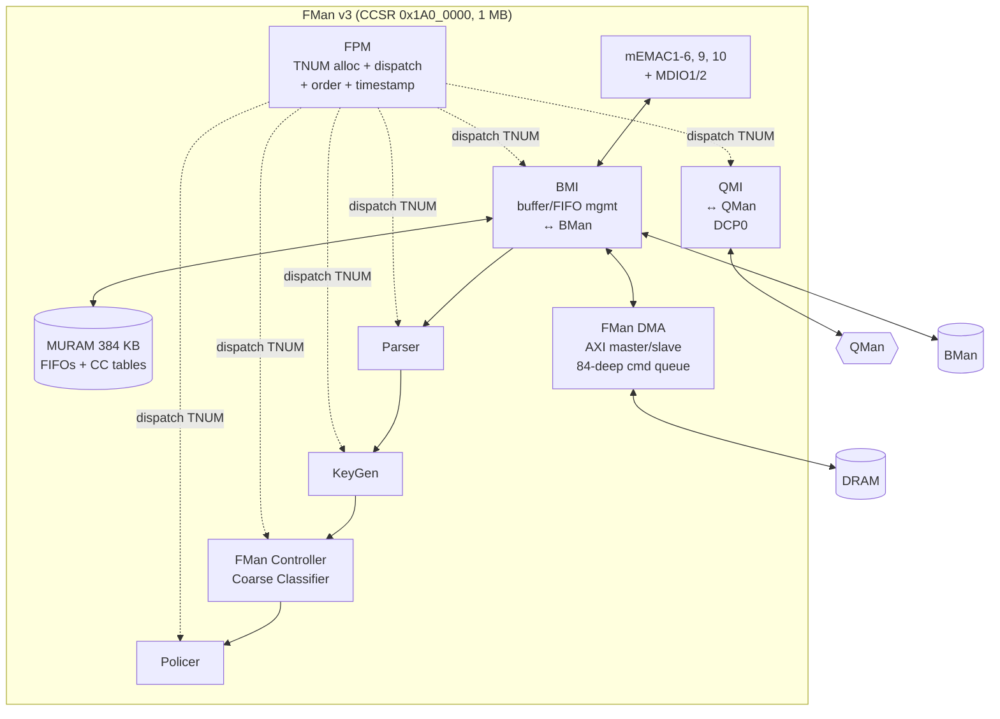
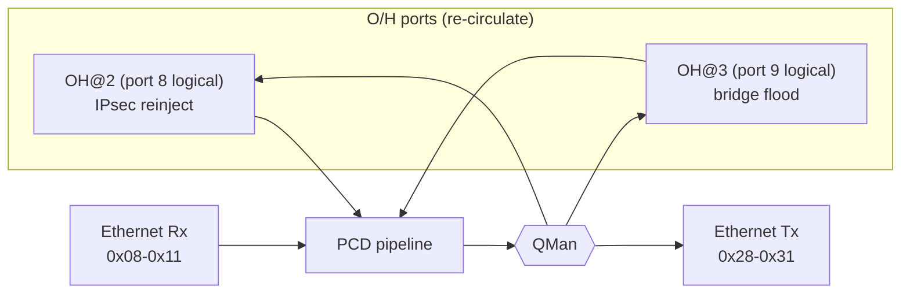

# Frame Manager (FMan v3) — Internals, Ports, mEMAC

**Version 1.0.0 · VyOS LS1046A · 2026-06-21 · HADS 1.0.0**

---

## AI READING INSTRUCTION

Read `[SPEC]` and `[BUG]` blocks for authoritative facts about FMan v3 hardware registers, port IDs, sizing rules, and pipeline mechanics. Read `[NOTE]` only for ASK2 relevance context and architectural relationships. `[?]` blocks are unverified inferences — treat with lower confidence. Preserve all register offsets, address values, and sizing constants verbatim — these are correctness-critical.

---

## 1. Block diagram

**[SPEC]**
FMan_v3 on LS1046A: 1 instance at ~700 MHz, aggregate 32 Mpps / 22 Gbps, MURAM 384 KB, 128 TNUMs.

**[SPEC]**
Source: LS1046A DPAA RM Ch.5 (§5.1–5.8, pp.467–802).

**[NOTE]**
The FMan is an autonomous packet-processing engine that integrates Ethernet MACs, buffer/queue interfaces, internal SRAM (MURAM), and a configurable parse→classify→police pipeline. Frames flow as Frame Descriptors; per-frame tasks (TNUMs) are dispatched stage to stage by the FPM, routed by a 24-bit NIA (Next Invoked Action) field in each module register.

**[NOTE]**
For the classification stages (Parser, KeyGen, Coarse Classifier, Policer, Manip, Replicator) see the flagship `fman-pcd.md`. This doc covers the plumbing: BMI, QMI, FPM, DMA, ports, FIFO/MURAM partition, mEMAC.



| Module | Role |
|---|---|
| **BMI** | Moves frames between MACs/DDR and MURAM; allocates/frees internal FIFO + external (BMan) buffers; drives pipeline entry/exit |
| **QMI** | Enqueues/dequeues FDs to/from QMan via the FMan Direct-Connect Portal (**DCP0**) |
| **FPM** | Allocates TNUMs; dispatches each task to the next module per its NIA; enforces per-port order; generates the 1588 timestamp |
| **FMan DMA** | Executes AXI read/write between MURAM and DDR; **84-entry command queue** (sum of all port MXD ≤ 84) |
| **Parser** | HW + soft parser → 32-byte Parse Result |
| **KeyGen** | Hash distribution; extracts key; computes FQID + CC base |
| **FMan Controller** | Coarse (exact-match) classifier; also runs Independent Mode + host commands |
| **Policer** | 2-rate/3-color marking (RFC 2698 / RFC 4115) |
| **mEMAC** | Multirate Ethernet MAC (100M/1G/2.5G/10G), 1588, PFC |

---

## 2. Ports & PortIDs (LS1046A)

**[SPEC]**
Hardware PortIDs are fixed in silicon. Rx and Tx are separate ports with separate IDs.

| Port | Rx ID | Tx ID | LS1046A capability |
|---|---|---|---|
| O/H 2 (host-cmd) | 0x02 | — | host command port |
| O/H 3–5 | 0x03–0x05 | — | offline/header-manip ports (re-enqueue) |
| EMAC1–4 | 0x08–0x0B | 0x28–0x2B | 1 G only (SGMII/RGMII) |
| EMAC5 | 0x0C | 0x2C | up to 2.5 G |
| EMAC6 | 0x0D | 0x2D | 1 G only |
| EMAC9 | 0x10 | 0x30 | up to 10 G (XFI) |
| EMAC10 | 0x11 | 0x31 | up to 10 G (XFI) |

**[SPEC]**
4 active O/H ports (0x02–0x05). O/H1 (0x01) and EMAC7/8 (0x0E/0x0F) are not present on LS1046A.

**[SPEC]**
Constraint: O/H1 (0x01) and 10G Rx2/Tx2 (0x11/0x31) cannot operate concurrently (moot — O/H1 absent).

**[SPEC]**
Each O/H port is rate-limited to 3.75 Mpps and draws from the same 22 Gbps aggregate budget.

**[NOTE]**
The board wires only a subset of these to PHYs — see the port-map reconciliation in `serdes-ethernet.md` and ASK2 spec §2.3.



---

## 3. MURAM — the 384 KB you must budget

**[SPEC]**
MURAM is mapped at FMan offset `0x0_0000` (512 KB window, 384 KB populated) and is shared by all modules. It is split (via `FMBM_CFG1`) into two regions:

| Region | Holds |
|---|---|
| **FIFO region** | Per-port Rx/Tx/O/H FIFOs + per-frame Internal Context, as linked lists of **256-byte** buffers |
| **Custom-classifier region** | FMan Controller exact-match (CC) tables; base per port via `FMBM_RCCB`/`FMBM_OCCB` |

**[SPEC]**
FIFO unit = 256 bytes, hardware-managed linked list; software never touches the pointers.

**[SPEC]**
Sizing rule (FMan_v3): `IFSZ ≥ roundup(max_frame, 256) + 3×256`. Violation → truncation + `FD[FSE]`.

**[NOTE]**
The tradeoff that bites ASK2: every byte of FIFO is a byte not available for CC tables. Jumbo (9 KB) FIFOs shrink the classifier budget. This is the root of the ~96 KB-usable / ~750-entry flow ceiling and the manip-chain `-ENOMEM` risk — see `muram.md`.

**[SPEC]**
Default FMan_v3 IFSZ: Rx/Tx 1G = 49×256 ≈ 12.5 KB; Rx 10G = 95×256 ≈ 24 KB; host-cmd = 9×256.

---

## 4. The pipeline & the NIA mechanism

**[SPEC]**
Each module, when done with a task, hands the FPM a 24-bit NIA telling it which module runs next. The FPM routes the TNUM accordingly. This is how the pipeline is configurable — you rewire it by writing NIA registers, not by changing hardware.

**[SPEC]**
NIA fields: `ORR` (bit 8, order-restoration required) · `ENG` (bits 9–13, engine code) · `AC` (bits 14–31, module action).

| ENG | Module |  | ENG | Module |
|---|---|---|---|---|
| 00000 | FMan Controller |  | 10011 | Policer |
| 10001 | Parser |  | 10100 | BMI |
| 10010 | KeyGen |  | 10101 / 10110 | QMI Enq / Deq |

**[SPEC]**
Typical Rx flow (driven by `FMBM_RFNE` → `FMBM_RFPNE` → `FMBM_RFENE`):


**[SPEC]**
Minimal flow (no PCD): `BMI Rx → prepare-to-enqueue → QMI → release`.

**[SPEC]**
Tx flow: `BMI alloc IC → QMI dequeue (update IC from FQD Context A/B) → BMI DMA read → MAC → [optional Tx-confirm enqueue] → release`.

**[SPEC]**
O/H flow: `BMI alloc IC → QMI dequeue → fetch (256 B or full frame) → Parser onward (FMBM_OFNE/OFPNE/OFENE) → QMI re-enqueue → release`. `EBD=1` frees the original external buffers after fetch (frame copy/move).

---

## 5. The Internal Context (IC) — per-frame scratch in MURAM

**[SPEC]**
A 256-byte structure allocated per frame at the start of processing, released at the end. It is the carrier for everything the pipeline produces. (RM §5.4.3, Table 5-19.)

| Offset | Size | Field | Meaning |
|---|---|---|---|
| 0x00 | 16 | FD | the Frame Descriptor |
| 0x10 | 8 | **ICAD** | action descriptor — FQID, policer profile, op-mode bits |
| 0x18 | 4 | CCBASE | Coarse-Classifier base (FMan Controller entry) |
| 0x1C | 1 | KS | key size (valid bytes from KeyGen) |
| 0x1D | 3 | HPNIA | parser's next-module NIA |
| 0x20 | 32 | **PR** | **Parse Result** — header types/offsets |
| 0x40 | 8 | TimeStamp | 1588 capture (Rx at recv, Tx at xmit) |
| 0x48 | 8 | HASH | 64-bit KeyGen hash (valid if KS≠0) |
| 0x50 | 56 | KEY | extracted key (valid if KS≠0) — **56-byte max key** |
| 0x90 | 112 | Debug | per-module trace dump |

**[SPEC]**
ICAD op-mode bits (the levers O/H + manip use): `EBD` (external-buffer dealloc), `EBAD` (O/H buffer-alloc disable), `FWD` (frame-write disable), `NL` (not-last/continuous mode via `FMBM_CMNE`), `CWD` (suppress IC→margin copy), `NENQ` (skip enqueue → straight to BMI release), `VSPE` (virtual storage profile enable).

**[NOTE]**
The Parse Result at IC+0x20 is the 32-byte structure consumed by KeyGen/CC/Policer (and optionally copied to the buffer margin for the CPU via `CWD`). Initial values come from `FMBM_RPRI` (includes the Logical Port ID). The soft parser can rewrite PR fields including `HPNIA`.

---

## 6. BMI essentials for implementers

**[SPEC]**
Storage profiles (FMan_v3): 64 total, 64/port. Each profile (64-byte struct in a dedicated 4 KB region) holds up to 4 BMan pool entries; BMI tries the smallest fitting pool, walks up, then falls back to scatter/gather (≤16 entries), and discards if all are depleted. Profile is chosen after classification via KeyGen `RSPID` + `FMBM_SPICID[SPBRN+SPNUM]`.

**[SPEC]**
DMA depth: sum of all port `MXD` ≤ 84. Per-port defaults: Rx 1G=2, Rx 10G=8, Tx 1G=3, Tx 10G=12, O/H=4.

**[SPEC]**
Task budget: `FMBM_CFG2[TNTSKS]` ≤ 128 (encoded value+1). Per-port `MXT` defaults: Rx 1G=4, Rx 10G=14, Tx 10G=14, O/H=6, host-cmd=1.

**[SPEC]**
Flow control / pause triggered by Rx FIFO threshold (`FMBM_RFP[FTH]`), BMan pool depletion (`FMBM_RMPD`), or a QMan congestion message. PFC class→QMan-TC map in `FMBM_TPFCM0` (reset `0x01234567`).

**[SPEC]**
Rx running checksum (one's-complement TCP/UDP) and end-of-frame chop (`CFED`, ≤16 B; `CSI+CFED ≤ 16`).

**[SPEC]**
ICID is taken from `FMBM_SPICID[ICID]` (or `FMBM_VSPICID` for virtual profiles) and put on every DMA transaction for the SMMU — software cannot forge it (see `dpaa1-architecture.md` §4).

### QMI deadlock-prevention rule (don't skip this)

**[NOTE]**
```
ENQ_THR < 64 − Σ(O/H DPDE) − Σ(Tx DPDE)
DEQ_THR > Σ(O/H DPDE) + Σ(Tx DPDE)
```

**[SPEC]**
QMI NIAs: `0x54_0000` = enqueue, `0x58_0000` = dequeue.

---

## 7. mEMAC & frame sizing

**[SPEC]**
All MACs are mEMAC (multirate: 100M / 1G / 2.5G / 10G; rate is configured per port).

**[SPEC]**
Compliance: IEEE 802.3u/x/z/ac/ab, 1588v2, 802.3az (EEE), 802.1Qbb PFC. Jumbo ≤ 9600 B.

**[SPEC]**
Two dedicated MDIO controllers: **EMI1 (Clause 22) @ 0x1AF_C000**, **EMI2 (Clause 45) @ 0x1AF_D000**. `CONFIG_FSL_XGMAC_MDIO=y` is mandatory for the 10G PHYs.

**[SPEC]**
Frame-size limits: Rx max 16,358 B (FD LENGTH); Tx/O/H = min(65,535, port FIFO). `FSE` set on HW-FIFO overflow / internal-FIFO overflow / MAXFRM violation. Parser only sees the first 256 B; `BLE` set if headers spill past the first internal buffer.

**[NOTE]**
For the SerDes lane↔MAC mapping (the `0x1133` protocol selection), 1588 timestamping details, and XFI/10GBASE-KR, see `serdes-ethernet.md`.

---

## 8. The "210 ucode" and Independent Mode

**[SPEC]**
The FMan executes microcode (ucode) loaded at boot that defines the controller's behaviour. The ASK/ASK2 stack targets the QorIQ Engine Firmware (QEF) 210 family (e.g. `fsl_fman_ucode_ls1046_r1.0_106_4_18.bin`).

**[NOTE]**
Stock QEF 210.10.1 does not implement CEV doorbell / REV events — relevant to the IRQ discussion in `soc-integration.md` and ASK2 spec §2.4.

**[SPEC]**
Independent Mode (IM) bypasses QMan and BMan entirely (BD-ring model managed by the FMan Controller). Rate-limited (≤100 Mbps/port when >1 port active; up to 1 Gbps single-port at FMan ≥500 MHz). DPAA1/ASK2 use normal mode (QMan/BMan); IM is noted only so you recognise it in the RM.

---

## 9. ASK2 relevance

| FMan facility | Why ASK2 cares |
|---|---|
| O/H ports 0x03–0x05 | OP1/OP2 (IPsec reinject, bridge flood) re-circulate frames through the PCD — the offline-port flow above |
| NIA rewiring | ASK2's `FORWARD_FQ_WITH_MANIP` and CC→Policer chaining are NIA edits, not new datapath code |
| IC `PR`/`KEY`/`HASH` | KeyGen exact-match (match_vector≠0) and CC trees read these; ASK2's flow-table key lives here (≤56 B) |
| MURAM FIFO↔CC tradeoff | directly sets ASK2's flow-table ceiling and the manip-chain `-ENOMEM` risk (`muram.md`) |
| Storage-profile/BMan-pool selection | governs where offloaded frames land; mis-sizing → out-of-buffer discards |
| DCP0 (QMI) | the FMan↔QMan path every offloaded frame traverses; `0001-caam-qi-share` uses DCP2 for SEC |

**[NOTE]**
Next: `fman-pcd.md` — the Parser/KeyGen/CC/Policer/Manip detail and its 1:1 mapping to `fman_pcd_*.c`.