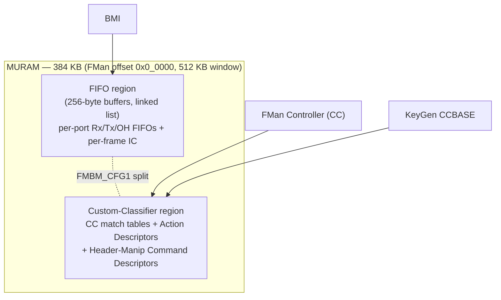
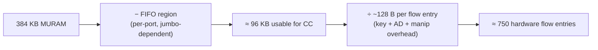
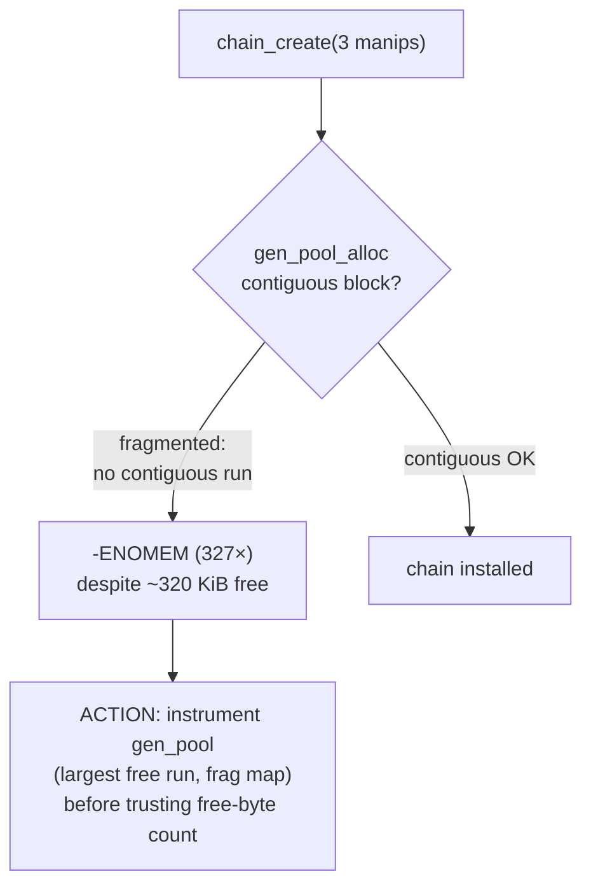

# MURAM — FMan Internal RAM & the ASK2 Flow-Table Ceiling

**Source:** LS1046A DPAA RM §5.3.13 (p.481), §5.5 (BMI), §5.12 (CC); ASK2 spec §13.3 & §16 (Risk #13).
**This doc exists because MURAM is the single scarcest resource that bounds how much ASK2 can
offload.** Read it before sizing CC trees or header-manip chains.

MURAM is the FMan's on-chip SRAM. **Every** FMan datapath structure that isn't in DRAM lives here:
port FIFOs, per-frame Internal Context, and the Coarse-Classifier exact-match tables + Action
Descriptors + header-manip command descriptors. It is **384 KB total** on LS1046A and it is shared by
all FMan modules.

---

## 1. The 384 KB budget and the split

- **Total: 384 KB** (mapped at FMan offset `0x0_0000`; the address window is 512 KB but only 384 KB is
  populated). Shared by all modules; hardware arbitrates access.
- Partitioned via `FMBM_CFG1` into two regions:

| Region | Holds | Allocator |
|---|---|---|
| **FIFO** | per-port Rx/Tx/OH FIFOs + per-frame Internal Context, as linked lists of **256-byte** buffers | BMI hardware (auto) |
| **Custom-classifier** | CC match tables, 16-byte Action Descriptors, ≤256-byte HMCD chains | software (driver `gen_pool`) |

- **The zero-sum tradeoff:** every 256-byte FIFO buffer is 256 bytes the classifier *cannot* use.
  Jumbo (9 KB) FIFOs and deep per-port FIFOs shrink the CC budget. Sizing rule:
  `IFSZ ≥ roundup(max_frame, 256) + 3×256` per port (violation → frame truncation + `FD[FSE]`).
- Default FMan_v3 FIFO allocation already consumes a large slice (Rx 10 G ≈ 24 KB/port, Rx/Tx 1 G ≈
  12.5 KB/port). **What's left for CC is on the order of ~96 KB usable** on a typical multi-port config.

---

## 2. The flow-table ceiling (the number to remember)

- A practical offloaded flow costs on the order of **~128 bytes** of MURAM once you count the CC table
  row, its 16-byte Action Descriptor, and any associated header-manip descriptor. With ~96 KB usable
  that yields a **soft ceiling of ≈ 750 simultaneous hardware flows**.
- This is *separate* from the per-table structural limits (which still apply): **≤16 CC roots/port**,
  **≤255 entries/table**, **≤3 nested lookups**, **≤128-byte table for 18 Mpps line rate**
  (see [`fman-pcd.md`](fman-pcd.md) §3). The 4096-AD IC-Index path can index more entries but those
  ADs still consume MURAM.
- **Design consequence for ASK2:** the HW flow table is a **cache, not a database**. `ask.ko` must
  treat HW slots as scarce — install the heaviest-hitting flows, age out idle ones, and fall back to
  the software path when the table is full. It must never assume "unlimited offload."

---

## 3. Risk #13 — the `-ENOMEM` manip-chain failure (ASK2 spec §16 / §13.3)

This is a **known, reproduced** failure mode that `fman_pcd_manip.c` must defend against:

- Each **header-manip chain** must total **≤ 1 KiB MURAM** (HMCD table itself is ≤256 B, but the chain
  plus its data and ADs add up).
- **Observed on the DUT** after PR14z21: `fman_pcd_manip_chain_create()` building a 3-manip chain
  failed with **`-ENOMEM` (errno 12) 327 times** — *while the MURAM `gen_pool` still reported
  ~320 KiB free*. That contradiction means the failure is **fragmentation / allocator behaviour**, not
  raw exhaustion.

**Mandatory mitigations for the implementation:**
1. **Instrument the MURAM `gen_pool`** — log *largest contiguous free run*, not just total free bytes,
   at every `chain_create`. Total-free is misleading under fragmentation.
2. **Budget AD entries** — ≤4 AD entries per manip chain (per the CC AD limits).
3. **Pre-allocate / pool manip chains** for common operations (e.g. the standard NAT rewrite) rather
   than create/destroy per flow, to avoid fragmenting the arena.
4. **Fail gracefully to the software path** when `chain_create` returns `-ENOMEM` — never drop the
   flow.

---

## 4. What else competes for MURAM

| Consumer | MURAM cost | Notes |
|---|---|---|
| Per-port Rx/Tx/OH FIFO | 12.5–24 KB/port (config) | the big one; jumbo inflates it |
| Per-frame Internal Context | 256 B × in-flight frames | transient; bounded by TNUM (128) |
| CC match tables | key-size × entries | ≤255 entries/table, key 1–56 B |
| Action Descriptors | 16 B each | one per CC entry + chained ADs |
| Header-Manip descriptors | ≤256 B HMCD + data | the Risk #13 arena |
| Policer PRAM | **separate 16 KB** (not MURAM) | 256×64 B — does **not** draw from the 384 KB |
| Parser soft-instructions | separate 2 KB parse memory | not MURAM |

> Note Policer PRAM (16 KB) and parser memory (2 KB) are **distinct** SRAMs — they do *not* reduce the
> 384 KB. Only FIFO + CC/AD/HMCD share MURAM.

---

## 5. ASK2 relevance (the whole point)

| MURAM fact | ASK2 consequence |
|---|---|
| 384 KB total, FIFO/CC split | hard ceiling on offload capacity |
| ~96 KB usable → **~750 flows** | HW flow table = cache; `ask.ko` must age/evict |
| Manip chain ≤1 KiB; Risk #13 frag | `fman_pcd_manip.c` must instrument gen_pool + pool chains + fail soft |
| FIFO vs CC zero-sum | jumbo-frame support directly cuts flow capacity — a tuning knob |
| Policer/parser RAM separate | rate-limiting & parsing don't eat the flow budget |

This single 384 KB constraint is why ASK2's design treats the hardware as a **fast cache in front of a
software slow path**, not a replacement for it. Every other arch doc's resource limit is comfortable;
**this is the one that bites.**

*Related: [`fman-pcd.md`](fman-pcd.md) (the CC/manip structures that live here), [`fman.md`](fman.md)
(the FIFO side of the split), [`../specs/ask2-rewrite-spec.md`](../specs/ask2-rewrite-spec.md) §13.3 &
§16 Risk #13.*
