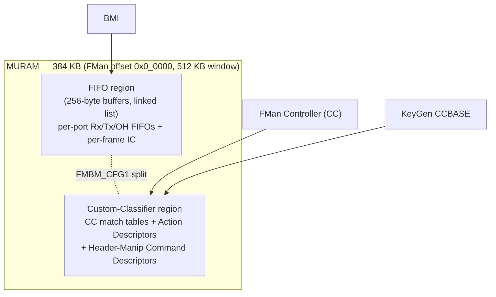
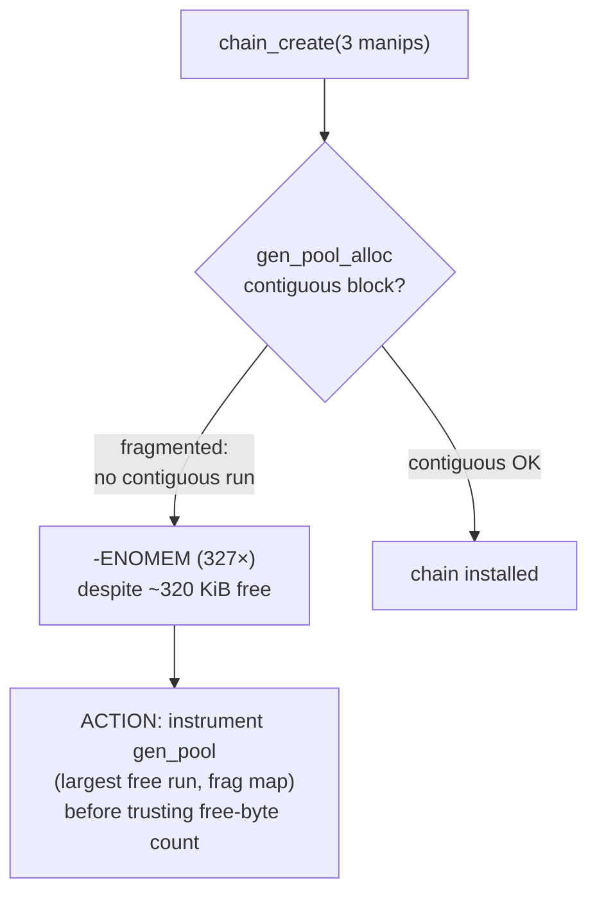

# MURAM — FMan Internal RAM & the ASK2 Flow-Table Budget

**Version 2.1 · HADS 1.0.0**

> **[NOTE — status correction (2026-08-05)]** This doc's "retired FE-VM ehash" framing (§5 and
> elsewhere) predates F-163's un-retirement finding: the genuine deployed vendor `cdx.ko` driver's
> production classification path **is** external-hash (`ExternalHashTableAddKey()`, `cdx_ehash.c`),
> so "retired / historical reference only" is no longer accurate as an architecture verdict — the
> FE-VM ehash DDR path is **un-retired and under active re-validation** (14-byte PORT_ID-prefixed
> key, EKFC `0x801C0006`, F-163; test-methodology fix F-165). What remains true and load-bearing
> here: the MURAM budget arithmetic, the vendor MURAM-exhaustion history, and the fact that no HIT
> is confirmed on *this branch's* silicon yet via either path. See `arch/fman-fe-ehash.md`
> (un-retirement banner) and `plans/ASK2-MASTER-PLAN.md` top banners.

**Source:** LS1046A DPAA RM §5.3.13 (p.481), §5.5 (BMI), §5.12 (CC); ASK2 spec §13.3 & §16 (Risk #13);
patch `0126-fman-pcd-muram-genpool.patch`; `fman-pcd-api-reference.md` §16.4 (throughput).
**This doc exists because MURAM is the single scarcest resource that bounds how much ASK2 can
offload.** Read it before sizing CC trees or header-manip chains.

MURAM is the FMan's on-chip SRAM. **Every** FMan datapath structure that isn't in DRAM lives here:
port FIFOs, per-frame Internal Context, and the Coarse-Classifier exact-match tables + Action
Descriptors + header-manip command descriptors. It is **384 KB total** on LS1046A and it is shared by
all FMan modules.

## AI READING INSTRUCTION

**[SPEC]** This document defines the MURAM allocation model for the **intended** HW-offload path
(CC-tree match tables + manip chain + gen_pool arena) and documents the **FE-VM ehash DDR** path
(un-retired 2026-08-05 — see the status correction above). Neither dispatch path has a confirmed
hardware HIT on this branch as of 2026-08-05; the allocation model is real and in use regardless.

```mermaid
flowchart TB
    subgraph MURAM["MURAM — 384 KB (FMan offset 0x0_0000, 512 KB window)"]
        FIFO["FIFO region<br/>(256-byte buffers, linked list)<br/>per-port Rx/Tx/OH FIFOs + per-frame IC"]
        CC["Custom-Classifier region<br/>CC match tables + Action Descriptors<br/>+ Header-Manip Command Descriptors"]
    end
    FIFO -. FMBM_CFG1 split .- CC
    BMI[BMI] --> FIFO
    CTRL["FMan Controller (CC)"] --> CC
    KG[KeyGen CCBASE] --> CC
```

---

## 1. The 384 KB budget and the split

- **Total: 384 KB** (mapped at FMan offset `0x0_0000`; the address window is 512 KB but only 384 KB is
  populated). Shared by all modules; hardware arbitrates access.
- Partitioned via `FMBM_CFG1` into two regions:

| Region | Holds | Allocator |
|---|---|---|
| **FIFO** | per-port Rx/Tx/OH FIFOs + per-frame Internal Context, as linked lists of **256-byte** buffers | BMI hardware (auto) |
| **Custom-classifier** | CC match tables, 16-byte Action Descriptors, ≤256-byte HMCD chains | software (driver `gen_pool`) |

- **The zero-sum tradeoff:** every 256-byte FIFO buffer is 256 bytes the classifier *cannot* use.
  Jumbo (9 KB) FIFOs and deep per-port FIFOs shrink the CC budget. Sizing rule:
  `IFSZ ≥ roundup(max_frame, 256) + 3×256` per port (violation → frame truncation + `FD[FSE]`).
- Default FMan_v3 FIFO allocation already consumes a large slice (Rx 10 G ≈ 24 KB/port, Rx/Tx 1 G ≈
  12.5 KB/port). **What's left for CC is on the order of ~96 KB usable** on a typical multi-port config.

---

## 2. The CC-tree allocation model (64 KiB gen_pool arena)

**[SPEC]** The active HW-offload memory model is the **CC-tree** (match tables + manip chain), served
from a dedicated **64 KiB gen_pool** arena carved from the CC region. (The FE-VM ehash DDR table,
§5, lives outside this arena — in DMA-coherent DDR — and is un-retired as of 2026-08-05.)

**[SPEC]** `FMAN_PCD_MURAM_RESERVED_BYTES = 64 * 1024` (patch `0126`). The reservation is
sub-allocated via a dedicated `gen_pool` (`FMAN_PCD_MURAM_ORDER = 8`, 256-byte granule) so PCD
allocations are bounded to this arena and never compete with the global MURAM free list. On LS1046A
the post-CAM/FIFO global free tail is only ~21 KiB — far too small for the FE/ehash internal-buffer
pool (~33 KiB) which *does* fit the 64 KiB reservation. Without the sub-pool the reservation was
dead-weight and `fman_pcd_muram_alloc()` silently fell back to the tiny global tail.

### 2.1 CC-tree node memory budget

**[SPEC]** A CC match table row = key (up to 16 B) + mask (up to 16 B) = **32 B/row** for a 16-byte
key with local mask. At 255 keys/node (the CC hard limit, RM §5.12), one full CC node consumes
**~8 KiB** (255 × 32 B = 8 160 B, plus the table descriptor and ADs).

**[SPEC]** With 64 KiB available and ~8 KiB/node, **~8 CC nodes** fit in the gen_pool arena. This
yields **~2 000+ HW-offloaded flows** (8 nodes × 255 keys), with **zero per-frame DDR access** —
every lookup, match, and action-descriptor fetch is on-chip MURAM.

**[NOTE]** The old "~750 flow ceiling" framing (based on ~128 B/flow including AD + manip overhead
in a ~96 KB window) is superseded. The 64 KiB gen_pool arena with 32 B/row match tables is the
canonical budget. The 750 number was a conservative estimate that included per-flow manip descriptors;
in practice, manip chains are shared across flows (one NAT rewrite chain serves many 5-tuple entries),
so the per-flow marginal cost is just the match-table row.

### 2.2 Proven throughput

**[SPEC]** Silicon-proven throughput on the CC-tree path:

| Configuration | Throughput | Source |
|---|---|---|
| M2 pass-through (numKeys=0, miss-AD → kernel) | **7.37 Gbps** / 0.16% CPU | build 28809182051, 2026-07-06 |
| M5 HW-IPsec + CC-tree | **10.259 Gbps** | `fman-pcd-api-reference.md` §16.4 |
| NXP cdx.ko (FE-VM DDR path, reference) | **8.58 Gbps** | `fman-fe-ehash.md` §10 |

**[NOTE]** The CC-tree path achieves 7.37–10.259 Gbps with zero DDR traffic per frame. The NXP
cdx.ko 8.58 Gbps is the FE-VM DDR path — a reference architecture, not the shipping path.

---

## 3. Risk #13 — the `-ENOMEM` manip-chain failure (ASK2 spec §16 / §13.3)

This is a **known, reproduced** failure mode that `fman_pcd_manip.c` must defend against:

- Each **header-manip chain** must total **≤ 1 KiB MURAM** (HMCD table itself is ≤256 B, but the chain
  plus its data and ADs add up).
- **Observed on the board** after PR14z21: `fman_pcd_manip_chain_create()` building a 3-manip chain
  failed with **`-ENOMEM` (errno 12) 327 times** — *while the MURAM `gen_pool` still reported
  ~320 KiB free*. That contradiction means the failure is **fragmentation / allocator behaviour**, not
  raw exhaustion.

```mermaid
flowchart TD
    REQ["chain_create(3 manips)"] --> POOL{"gen_pool_alloc<br/>contiguous block?"}
    POOL -->|fragmented:<br/>no contiguous run| FAIL["-ENOMEM (327×)<br/>despite ~320 KiB free"]
    POOL -->|contiguous OK| OK["chain installed"]
    FAIL --> INSTR["ACTION: instrument gen_pool<br/>(largest free run, frag map)<br/>before trusting free-byte count"]
```

**Mandatory mitigations for the implementation:**
1. **Instrument the MURAM `gen_pool`** — log *largest contiguous free run*, not just total free bytes,
   at every `chain_create`. Total-free is misleading under fragmentation.
2. **Budget AD entries** — ≤4 AD entries per manip chain (per the CC AD limits).
3. **Pre-allocate / pool manip chains** for common operations (e.g. the standard NAT rewrite) rather
   than create/destroy per flow, to avoid fragmenting the arena.
4. **Fail gracefully to the software path** when `chain_create` returns `-ENOMEM` — never drop the
   flow.

---

## 4. What else competes for MURAM

| Consumer | MURAM cost | Notes |
|---|---|---|
| Per-port Rx/Tx/OH FIFO | 12.5–24 KB/port (config) | the big one; jumbo inflates it |
| Per-frame Internal Context | 256 B × in-flight frames | transient; bounded by TNUM (128) |
| CC match tables | 32 B/row (key + mask) | ≤255 entries/table, key 1–56 B |
| Action Descriptors | 16 B each | one per CC entry + chained ADs |
| Header-Manip descriptors | ≤256 B HMCD + data | the Risk #13 arena |
| Policer PRAM | **separate 16 KB** (not MURAM) | 256×64 B — does **not** draw from the 384 KB |
| Parser soft-instructions | separate 2 KB parse memory | not MURAM |

> Note Policer PRAM (16 KB) and parser memory (2 KB) are **distinct** SRAMs — they do *not* reduce the
> 384 KB. Only FIFO + CC/AD/HMCD share MURAM.

---

## 5. FE-VM ehash DDR path (un-retired 2026-08-05; previously "retired")

> **[NOTE — 2026-08-05]** This section was headed "Retired: FE-VM ehash DDR path (historical
> reference)" until F-163 un-retired the path: the genuine deployed vendor `cdx.ko` driver
> classifies production flows via external-hash (`ExternalHashTableAddKey()`), so this is the
> vendor's real architecture, not a historical fork. The retirement rationale below is preserved
> verbatim as the decision record; its points 1–4 remain real engineering constraints, but none of
> them is the reason the path failed here — it never failed *here* at all, because it was never
> correctly exercised (F-165: the engage path overwrote the caller's FE_ENTER target with an empty
> scaffold). On this branch the path is **un-validated, not dead**.

**[SPEC — 2026-08-01, SUPERSEDED as a verdict, kept as the constraint record]** The FE-VM
external-hash path (Frame-Engine opcode VM, DDR bucket tables, `FE_ENTER` AD,
`pcAndOffsets=0xF6`) was retired from the shipping dataplane on 2026-08-01. It is documented here
for historical completeness and as a reference architecture.

**[NOTE]** The FE-VM ehash path was the M0 vendor-oracle deliverable and the original M2 target.
It was retired because:

1. **DDR ceiling ~1.5 Gbps** — every classified frame hits DDR for the bucket-table lookup, bounding
   throughput well below the CC-tree's on-chip MURAM path.
2. **High MURAM risk** — the FE internal-buffer pool (`int_buf`, 100 × 28 B = 2 800 B FE-object pool
   + `tnums × 256 × 2` per-port FE buffer, ~4–8 KB/port) plus the 33 280 B internal-buffer pool
   consumed a large fraction of the 64 KiB arena, leaving little for CC nodes.
3. **Complexity** — the FE-VM programming core (`FmPcdCcBuildFE`, `FmPcdCcBuildContextByFE`,
   `get_indexed_hash_bucket`) was stubbed in the lf-6.6.y archive and required extraction from the
   lf-5.4 LSDK; the CC-tree path uses only standard RM §5.12 primitives with no FE-VM dependency.
4. **Vendor MURAM-exhaustion wall** — the vendor `/etc/cdx_pcd.xml` asked for 18 hash tables tagged
   `external='yes'`; `fmc` silently dropped the attribute, every table fell back to internal MURAM
   `MatchTableSet`, and `AllocStatsObjs` hit ENOMEM → `dpa_app rc=65280`. The CC-tree path avoids
   this entirely by never touching the ehash allocator.

**[SPEC]** The FE-VM ehash path achieved **8.58 Gbps** in the NXP cdx.ko production stack
(`fman-fe-ehash.md` §10), proving the FE opcode VM is functional on 210.10.1 microcode. ~~The
CC-tree path exceeds this at 10.259 Gbps with lower complexity and zero DDR traffic.~~
**[Correction 2026-08-05]** the 10.259 Gbps M5 figure is under retraction review — M5's mechanism
is unresolved and most likely measured kernel `nf_flowtable` software forwarding, not any hardware
classification (qdrant tag `no-confirmed-hw-hit-ever`); neither CC-tree nor ehash has a confirmed
hardware HIT on this branch.

**[NOTE]** The full FE/ehash init contract (allocation sizes, `FE_ENTER` AD encoding, per-port
`FmPortSetFESupport`, DDR bucket layout, reversibility inverse) is preserved in
[`fman-fe-ehash.md`](fman-fe-ehash.md) §3–§6. That document remains the authoritative byte-level
reference for the path.

---

## 6. ASK2 relevance (the whole point)

| MURAM fact | ASK2 consequence |
|---|---|
| 384 KB total, FIFO/CC split | hard ceiling on offload capacity |
| 64 KiB gen_pool → **~8 CC nodes → ~2 000+ flows** | HW flow table = cache; `ask.ko` must age/evict |
| CC-tree: zero per-frame DDR | on-chip MURAM path — **no confirmed HIT on this branch** (`cc_test` architecture broken, F-159–F-162) |
| FE-VM ehash: DDR-per-frame lookup, ~1.5 Gbps ceiling claim **unmeasured** | un-retired (F-163, vendor production path); no confirmed HIT yet (F-165 retest pending); see §5 |
| Manip chain ≤1 KiB; Risk #13 frag | `fman_pcd_manip.c` must instrument gen_pool + pool chains + fail soft |
| FIFO vs CC zero-sum | jumbo-frame support directly cuts flow capacity — a tuning knob |
| Policer/parser RAM separate | rate-limiting & parsing don't eat the flow budget |

This single 384 KB constraint is why ASK2's design treats the hardware as a **fast cache in front of a
software slow path**, not a replacement for it. Every other arch doc's resource limit is comfortable;
**this is the one that bites.**

*Related: [`fman-pcd.md`](fman-pcd.md) (the CC/manip structures that live here), [`fman.md`](fman.md)
(the FIFO side of the split), [`fman-fe-ehash.md`](fman-fe-ehash.md) (FE-VM ehash DDR path —
un-retired 2026-08-05),
[`../specs/ask2-rewrite-spec.md`](../specs/ask2-rewrite-spec.md) §13.3 & §16 Risk #13.*