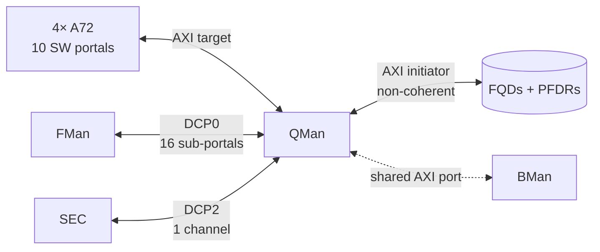
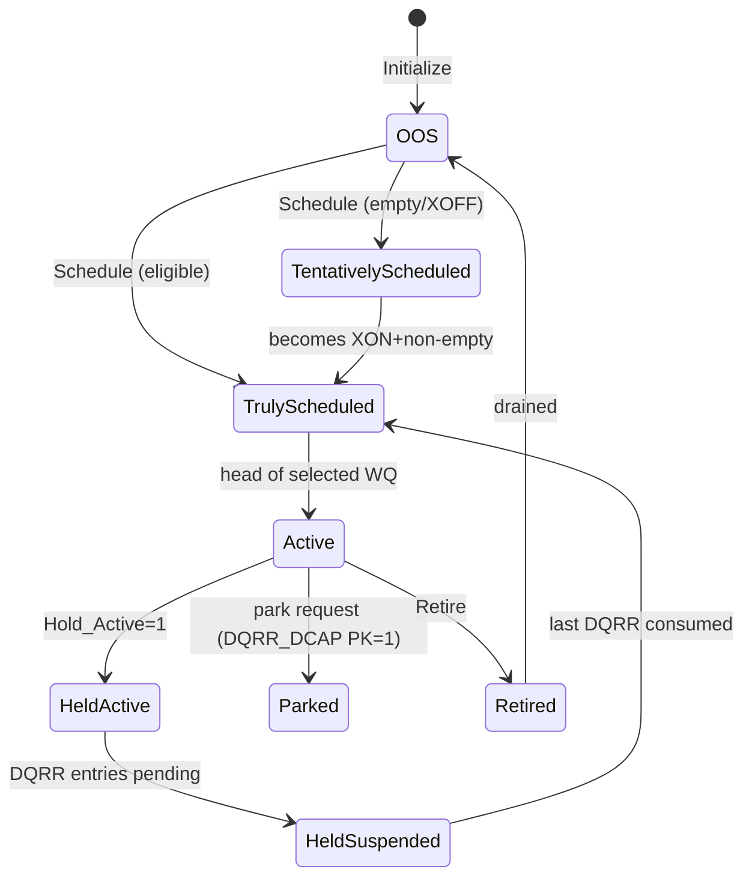
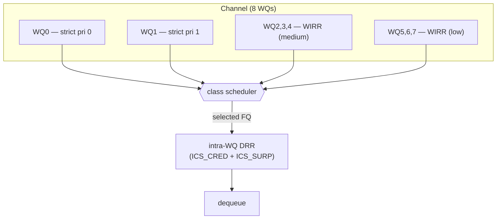
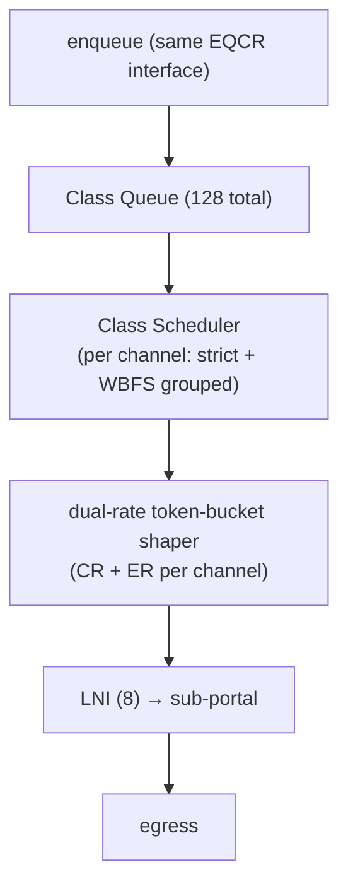

# Queue Manager (QMan) + CEETM

**Source:** LS1046A DPAA RM Ch.3 (pp.111–408). QMan is the central scheduler of DPAA1 — it arbitrates
frame flow between the 4× A72 cores, FMan, and SEC. **It holds no frame data**, only Frame Descriptors
and their 64-byte Frame Queue Descriptors (FQDs). All QMan private memory is **non-coherent** w.r.t.
the cores.

---

## 1. Resource counts (LS1046A)

| Resource | Count | Notes |
|---|---|---|
| Software portals | **10** | one dedicated channel each (0x000–0x009) |
| Direct-Connect Portals | **2** | **DCP0 = FMan** (SP0–15, ch 0x800–0x80F), **DCP2 = SEC** (ch 0x840) |
| Pool channels | **15** | channels 0x401–0x40F |
| **Congestion Group Records** | **256** | internal SRAM (Ch.14's "128" is an erratum) |
| FQID space | **16 M** (24-bit) | upper 1 M (0xF00000+) reserved for CEETM LFQIDs |
| Algorithmic sequencers | 24 | |
| FQD cache | 512 (64 B each) | hot FQDs |
| **SFDRs** | **2048** | on-chip head/tail FD storage |
| ORL records | 256 | shared with ERN records |
| WQs / channel | 8 | WQ0 highest priority |

---

## 2. Frame Queues — states & descriptor

An **FQ** is a FIFO of FDs. Software creates it; QMan allocates a 64-byte **FQD**. Short FQs (≲5
frames) live entirely in on-chip **SFDRs** (no DRAM); longer queues spill to DRAM **PFDRs**
(64-byte, 3 FDs each, linked list).

### FQ state machine

| State | Meaning |
|---|---|
| OOS | not in use (only Initialize accepted) |
| Tentatively / Truly Scheduled | under QMan control; eligibility not-yet / met |
| Active / Held Active / Held Suspended | selected for dequeue, optionally pinned to a portal |
| Parked | consumer-driven scheduling |
| Retired | draining; no new enqueues |

### FQD — the software-tunable fields (64 bytes)

| Field | What it controls |
|---|---|
| **DEST_WQ** | bits 304–316 = channel #, 317–319 = WQ 0–7 (where the FQ schedules) |
| **CONTEXT_A / B** | 64-/32-bit context returned on dequeue; A drives **stashing** if FQ_CTRL[291] set |
| **FQ_CTRL** | feature enables (below) |
| **CONG_ID** | congestion group (0–255) when CGE set |
| **ICS_CRED** | intra-WQ DRR credit (bytes/opportunity) |
| **TD_MANT / TD_EXP** | tail-drop threshold = `MANT × 2^EXP` bytes |
| **ORPRWS / OLWS / OA** | ORP restoration / late / auto-advance windows |

**FQ_CTRL bits:** 288 `Congestion_Group_Enable` · 289 `Tail_Drop_Enable` · 290 `ORP_Enable` ·
291 `Context_A_Stashing` · 292 `CPC_Stash_Enable` · 295 `Force_SFDR_Allocate` · 296 `Avoid_Blocking`
(use for pool-channel FQs) · 297 `Hold_Active` · 298 `Lock_in_Cache`.

> **ASK2:** flow FQs are created with `DEST_WQ` pointing at the consuming core's channel; **stashing**
> (CONTEXT_A) prefetches the FD + frame head into L2 so the core sees a warm cache line — critical for
> hitting line rate on the slow path. `Hold_Active`/`Avoid_Blocking` matter for pool-channel
> load-balancing across the 4 cores.

---

## 3. Work Queues, Channels & scheduling

- **WQ** = linked list of FQDs; **8 WQs per channel**, WQ0 = highest. An FQ links to its
  `DEST_WQ` tail when it becomes eligible (XON + non-empty).
- **Dedicated channel** → one portal (push). **Pool channel** → many portals, round-robin (load
  balance across cores).

### Channel map (LS1046A)

| Channel | Assignment |
|---|---|
| 0x000–0x009 | dedicated to SW portals 0–9 |
| **0x401–0x40F** | **15 pool channels** |
| 0x800–0x80F | DCP0 (FMan) sub-portals SP0–SP15 (SP0/SP1 optimised for 10 GbE) |
| 0x840 | DCP2 (SEC) dedicated channel |

### Two-level scheduler within a channel

- WQ0/WQ1 = absolute strict priority; WQ2–4 and WQ5–7 = **Weighted Interleaved Round Robin** (weights
  1–8 in `WQ_CS_CFG0/1/2/4`). Low tier gets starvation-avoidance elevation (`CS_ELEV` 1–255).
- **Intra-WQ** = modified Deficit Round Robin per FQ: allowance = `ICS_CRED + ICS_SURP`. `ICS_CRED=0`
  → basic RR; `0x7FFF` → DRR effectively off.

---

## 4. Software portals (how the core talks to QMan)

Each of the 10 portals is a **128 KB** region: **64 KB cache-enabled** (the 64-byte ring entries) +
**64 KB cache-inhibited** (32-bit registers), at the QMan SW-portal window (separate from CCSR — see
[`soc-integration.md`](soc-integration.md)).

| Ring | Entries | Dir | Purpose |
|---|---|---|---|
| **EQCR** | 8 (max 7 valid) | SW→QMan | enqueue commands |
| **DQRR** | 16 | QMan→SW | dequeue responses |
| **MR** | 8 | QMan→SW | ERN, FQPN, FQRNI messages |
| CR / RR0,RR1 | 1 / 2 | both | management cmd / response |

- **Valid-bit mode** (alternating polarity) is the default high-performance production/consumption
  notification — no explicit PI/CI writes or memory barriers needed.
- **DCA** (Discrete Consumption Acknowledgment): ack a DQRR entry *atomically with* the re-enqueue —
  this is the order-preservation primitive (defers Held-FQ release until the enqueue dispatches).
- **EQCR_CI stashing** to L2 (`QCSPi_CFG[EST]`) removes CI-polling reads.
- Dequeue commands: **SDQCR** (continuous scheduled), **VDQCR** (single-shot unscheduled from a
  parked/retired FQ), **PDQCR** (pull mode). DCT types: channel-only / channel+WQ / exact-FQID.

---

## 5. Order Restoration (ORP / ODP)

DPAA1 lets you parallelise per-flow processing across cores and **restore order before egress**:

- **ODP** (Order Definition Point) tags each frame with a 14-bit sequence number (`ODP_SEQ`) at the
  ingress FQ.
- **ORP** (Order Restoration Point) lives in an FQD; it holds back "early" frames in the **ORL** until
  the **NESN** (next-expected sequence number) reaches them.
- Windows (`ORPRWS` 32→4096; `OLWS` reject/32/RW/8192; `OA` auto-advance): early frames beyond the
  window → ERN (early-arrival reject); late frames below `OLWS` → accepted or ERN (late reject).

> **ASK2:** if flow processing is spread across cores (RPS-style), an ORP on the egress FQ keeps TCP
> from seeing reordering. Recommended: a **dedicated parked ORP FQD** (don't co-locate with an active
> FQ) to avoid FQD-cache contention.

---

## 6. Congestion management

Three independent mechanisms:

| Mechanism | Granularity | Trigger |
|---|---|---|
| **WRED** | per CGR, per colour (G/Y/R) | probabilistic drop between minTH…MaxTH; 100% above MaxTH |
| **CS Tail Drop** (CSTD) | per CGR | hard drop when congestion-state set |
| **FQ Tail Drop** (FQTD) | per FQ | `BYTE_CNT > TD_MANT·2^TD_EXP` (cap 0xE000_0000) |

- **256 CGRs** in SRAM; each FQ joins ≤1 via `CONG_ID` (+ `FQ_CTRL[CGE]`). CGR tracks byte or frame
  count; maintains an **exponential moving average** for WRED.
- **CSCN** (Congestion State Change Notification): on threshold crossing, QMan notifies SW
  (`ISR[CSCI]` → Query Congestion State → 256-bit snapshot) or a DCP (8-bit VCGID). Clear at
  ~7/8·threshold (hysteresis).
- **ERN** (Enqueue Reject Notification) carries the rejection code (WRED colour / FQTD / CSTD /
  ORP late-early / error) back to the producer's MR.

> Enqueues are **never** rejected for PFDR depletion — QMan stalls EQCR consumption until PFDRs free
> up. Plan DRAM PFDR space accordingly.

---

## 7. CEETM — egress traffic management

**CEETM** (Customer Edge Egress Traffic Management) is QMan's hierarchical class-based shaping +
scheduling mode for WAN-facing egress. On LS1046A there is **one CEETM instance, on DCP0 (FMan)
only**, the **8-channel** variant.

| Resource | Value | ⚠ |
|---|---|---|
| Channels | 8 | |
| LNIs | 8 | |
| Class queues / channel | 16 (8 independent + 8 grouped) | |
| **Total CQs** | **128** | |
| **XSFDRs** | **1024** | **NOT 4096** (that's the 32-ch variant) |
| LFQIDs | 1 K (0xF0_0000–0xF0_03FF) | |
| LFQMT entries | 1 K | |

- CEETM is an **alternate mode** per DCP sub-portal (switch only when traffic is stopped). Enqueue
  uses the *same* EQCR interface as a normal FQ — semantically compatible.
- Each CQ buffers up to 8 frames in **XSFDRs** (1024 shared across all 128 CQs). Monitor live usage at
  `CEETM_XSFDR_IN_USE` (CCSR 0x908, 13-bit, min 1).
- Class congestion via **CCGRs** (≥128). Shaping is dual-rate (committed + excess) token bucket per
  channel; LNIs aggregate channels onto a sub-portal.

> **ASK2:** CEETM is how you give the WAN port real HQoS (per-subscriber/per-class shaping) on the
> egress side, instead of the flat 8-WQ scheduler. The **1024-XSFDR** ceiling (not 4096) limits how
> many CQs can be simultaneously backlogged — size accordingly.

---

## 8. ASK2 relevance summary

| QMan facility | ASK2 use |
|---|---|
| FQID selection (from PCD/KeyGen) | the offload picks the egress FQID per flow ([`fman-pcd.md`](fman-pcd.md)) |
| CONTEXT_A stashing | warm-cache the core's slow-path receive |
| Pool channels (0x401–0x40F) | spread flow processing across the 4 A72 cores |
| DCP2 (SEC) | the IPsec dequeue/enqueue path for `0001-caam-qi-share` ([`sec-caam.md`](sec-caam.md)) |
| CGR/WRED + FQTD | backpressure & drop policy for offloaded flows |
| ORP | order-preserving multi-core forwarding |
| CEETM | per-subscriber HQoS on the WAN egress |

*Related: [`bman.md`](bman.md) (the buffers these FDs point at), [`muram.md`](muram.md) (where FMan's
side of this lives).*
