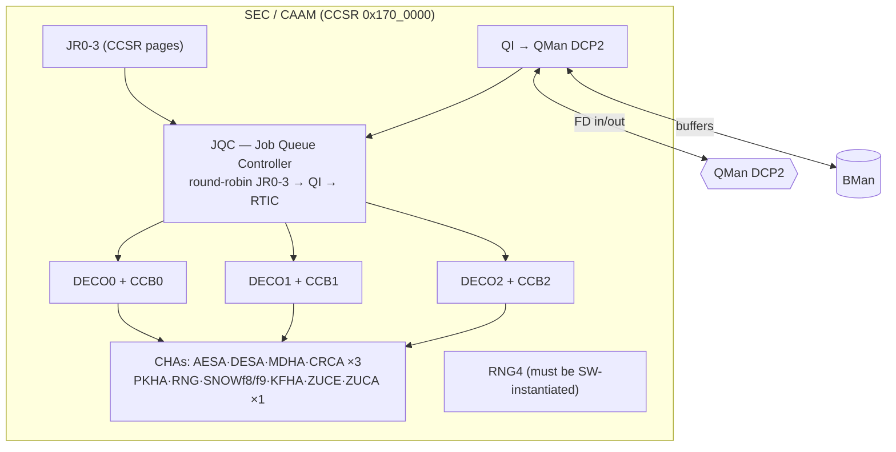
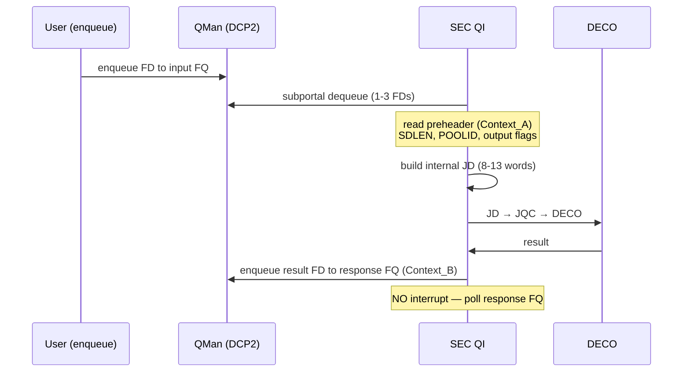

**Version 1.0 · vyos-ls1046a-build · 2026-06-21 · HADS 1.0.0**

## AI READING INSTRUCTION

This document uses HADS 1.0.0 tags. `**[SPEC]**` marks verifiable architectural facts (register addresses, protocol assignments, hardware capabilities, table data, DTS requirements). `**[NOTE]**` marks narrative, rationale, historical context, annotations, footnotes, and asides. `**[BUG] Title**` requires symptom + cause + fix (all three present). `**[?]**` marks unverified or inferred content requiring confirmation. Preserve all Mermaid diagrams, tables, and code blocks verbatim.

## 1. Overview and sources

**[NOTE]** Source: LS1046A SEC Reference Manual (`LS1046ASECRM` Rev 0, May 2017). SEC (called **CAAM** in Linux) is the LS1046A's cryptographic offload engine. It plugs into DPAA1 via a **Queue Interface (QI)** on QMan **DCP2** (frame-queue-driven crypto at wire rate) *and* offers a classic register-polled **Job Ring** interface. **3 DECO/CCB tiles** execute descriptors in parallel.

## 2. Hardware inventory (LS1046A)

**[SPEC]**
| Block | Count | Notes |
|---|---|---|
| Job Rings | **4** (JR0-JR3) | each on its own CCSR page → per-page MMU/TZ isolation |
| DECO/CCB tiles | **3** | parallel descriptor execution; each tile has local AESA/MDHA/DESA |
| Queue Interface | 1 | DPAA1 path, QMan **DCP2** |
| RTIC | 1 | run-time memory integrity (SHA-256/512, ≤4 blocks) |
| AXI master | 128-bit | ICID-tagged DMA |

**[SPEC]** CHA inventory (11 engines — memorise what's NOT here):

**[SPEC]**
| CHA | # | Implements |
|---|---|---|
| AESA | 3 | AES ECB/CBC/CTR/**GCM/CCM**/XTS/CMAC/XCBC |
| DESA | 3 | DES / 3DES |
| MDHA | 3 | MD5, SHA-1/224/256/384/512(+/224,/256), HMAC |
| CRCA | 3 | CRC32/32c/custom |
| PKHA | 1 | RSA ≤**4096-bit**, ECC ≤**1024-bit**, DH/DSA/ECDH/ECDSA |
| RNG | 1 | TRNG + SP800-90A DRBG |
| SNOWf8 / SNOWf9 | 1 / 1 | SNOW 3G enc / auth (3GPP) |
| KFHA | 1 | Kasumi f8+f9 (128-bit key) |
| ZUCE / ZUCA | 1 / 1 | ZUC enc / auth (3GPP) |

**[SPEC]** **NOT present:** **no ARC4/AFHA**, and **no dedicated 802.1AE MACsec engine**.

**[NOTE]** MACsec is built in software from **AESA GCM + CMAC** primitives — the kernel must frame the SecTAG/ICV itself. This directly shapes any MACsec plan for the board.

## 3. Two usage models — Job Ring vs QI

### Model A — Job Ring (register, look-aside)

**[SPEC]** Software writes descriptor pointers into an input ring (DRAM circular buffer), bumps "jobs added"; JQC dispatches to a free DECO; results land in the output ring `[desc_ptr \| status \| opt len]`. Per-JR registers: `IRBAR/IRSR/ORBAR/ORSR`, indices, `JRCFGR`, **`JRaICID`**. Completion order is **not** guaranteed across DECOs (use SERIAL sharing to order). Each ring = a distinct CCSR page → hypervisor/TrustZone can restrict per ring. **Trusted Descriptors are creatable only via JR.**

### Model B — Queue Interface (DPAA1, frame-queue)

**[SPEC]** FQD `Context_A` → **preheader** (8-byte; Shared Descriptor follows at +8); `Context_B` → response FQID. One IPsec SA = one preheader + SD = one FQ pair → **millions of SAs**, true multi-tenant.

**[SPEC]** **No per-job interrupt** on QI; errors in FD `STATUS/CMD[31:28]`: `5h`=QI, `4h`=DECO, `2h`=CCB/CHA.

**[SPEC]** **CRJD limitation:** first-gen DPAA SoCs (incl. LS1046A) **cannot** run CRJD via QI — JR only.

**[SPEC]** SD + QI-generated JD ≤ **64 words** → max safe SD = **51 words**.

## 4. IPsec ESP offload (the ASK2 use case)

**[SPEC]** SEC accelerates whole protocols via a **PROTOCOL OPERATION** command in the Shared Descriptor, backed by a per-SA **Protocol Data Block (PDB)** in system memory (SPI, SeqNum/ESN, IV/Salt, anti-replay scorecard). The DECO reads + writes back the PDB **every packet**.

**[SPEC]** **Cipher suites:** DES/3DES-CBC, AES-CBC, AES-CTR, **AES-CCM**, **AES-GCM** (AEAD, ICV 8/12/16); null-enc + GCM = AES-GMAC. HMAC suites need MDHA **split-key** (DKP computes it on first use).

**[SPEC]** **Modes:** Transport + Tunnel; ESP-Tunnel thread adds native **NAT-T / UDP-encap-ESP (RFC 3948)** and flexible outer-IP sourcing (PDB / memory / input frame).

**[SPEC]** **HMO byte:** `DTTL` (decrement inner TTL/HopLimit on encap), `DFC` (copy DF bit), `SNR` (seqnum rollover). **Anti-replay window** (`ARS`): none / 32 / 64 / 128 entries.

**[SPEC]** **`DPOVRD`** (DECO Protocol Override): the FD `STATUS/CMD` is loaded into DPOVRD so per-frame fields (IP header len, NH_OFFSET, ECN) override the SD without touching the PDB — **this is the inline path Linux drivers use.**

**[SPEC]** **Sharing type matters:** use **SERIAL** for IPsec so only one DECO advances the PDB SeqNum at a time. `ALWAYS` risks duplicate sequence numbers.

**[NOTE]** **ASK2 `0001-caam-qi-share-descriptors.patch`:** ASK2 reuses mainline CAAM but needs the QI shared-descriptor path so the FMan fast path can dequeue→SEC→reinject (OP1 offline port, `fman.md`) without the CPU. The xfrm packet-mode/`xfrmdev_ops` in `ask.ko` drives SA setup; SEC does the per-packet ESP. Order is preserved via SERIAL sharing + QMan ORP if spread across cores (`qman-ceetm.md` §5).

## 5. Coherency & the boot-time gotcha

**[NOTE]** These are the silicon footguns the IPsec offload depends on (cross-ref `soc-integration.md`):

**[SPEC]** **SEC DMA must snoop the A72 caches** for zero-copy IPsec: set `SCFG_SNPCNFGCR[SECRDSNP/SECWRSNP]` and `MCFGR[ARCACHE/AWCACHE]`. Without snoop you get cache-incoherent plaintext/ciphertext.

**[SPEC]** **CCI QoS:** `SCFG_QOS1/QOS2` weights for the SEC port **default to lowest** — a real performance footgun under load; raise them.

**[SPEC]** **RNG4 must be software-instantiated at boot** (the `caam` hwrng/RNG init). If it isn't, kernel crypto self-tests fail and the whole CAAM stack is unusable. Non-negotiable on bring-up.

**[BUG] DEVDISR gating is one-way/permanent** Symptom: disabling SEC via DEVDISR and later attempting to use it fails permanently without a power cycle. Cause: DEVDISR gating is one-way/permanent within a power cycle — don't disable SEC if you'll need it. Fix: do not gate DEVDISR for SEC during experiments.

## 6. Security state machine (SecMon)

**[SPEC]** SEC's mode is driven by **SecMon**: Trusted / Secure / Non-secure / Fail. Volatile keys (JDKEK, TDKEK, TDSK — generated by RNG at POR) are **zeroized on Fail**; on Fail all key/context/math registers, PKHA-E memory, FIFOs and the descriptor buffer are cleared.

**[SPEC]** Black keys (AES-ECB/CCM wrapped) and blobs (BKEK-wrapped, per-blob random key) provide key confidentiality at rest. Relevant if the board uses secure boot / trusted firmware.

## 7. ASK2 relevance

**[SPEC]**
| SEC facility | ASK2 use |
|---|---|
| QI on DCP2 | the in-silicon IPsec dequeue/enqueue path (`0001-caam-qi-share`) |
| PROTOCOL OP + PDB | per-SA ESP state; `ask.ko` xfrmdev installs SAs |
| DPOVRD via FD STATUS/CMD | per-packet override — the inline kernel path |
| SERIAL sharing | correct SeqNum ordering for offloaded tunnels |
| AESA GCM/CMAC | the only route to MACsec (no HW MACsec engine) |
| RNG4 boot-instantiate | mandatory or CAAM is dead |
| SCFG snoop + QoS | correctness + performance of zero-copy crypto |

**[NOTE]** Related: `qman-ceetm.md` (DCP2 channel, ORP), `soc-integration.md` (SCFG snoop/QoS, DEVDISR), `dpaa1-architecture.md` (compound FD for crypto).