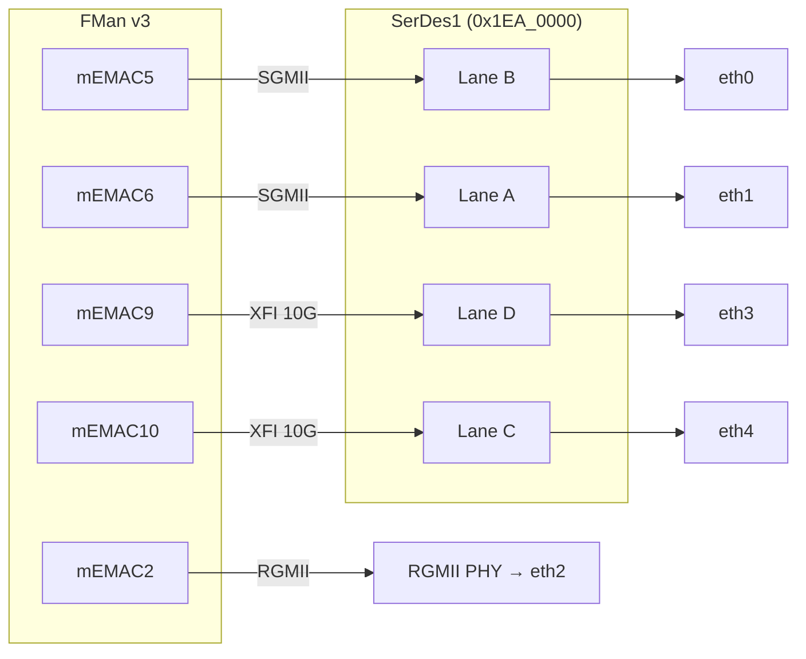

**Version 1.0 · vyos-ls1046a-build · 2026-06-21 · HADS 1.0.0**

## AI READING INSTRUCTION

This document uses HADS 1.0.0 tags. `**[SPEC]**` marks verifiable architectural facts (register addresses, protocol assignments, hardware capabilities, table data, DTS requirements). `**[NOTE]**` marks narrative, rationale, historical context, annotations, footnotes, and asides. `**[BUG] Title**` requires symptom + cause + fix (all three present). `**[?]**` marks unverified or inferred content requiring confirmation. Preserve all Mermaid diagrams, tables, and code blocks verbatim.

## 1. SerDes topology

**[NOTE]** Sources: `LS1046ARM` Rev 3 Ch.31 (SerDes); `LS1046ADPAARM` Rev 0 Ch.6–7 (mEMAC + 1588); app-notes `AN12750` (10GBASE-KR enable) / `AN12572` (KR backplane driver). This is the physical-port layer beneath `fman.md`: how FMan MACs reach copper/optics and how the board's `eth0–eth4` map to silicon.

**[SPEC]** Two SerDes blocks, **4 lanes each**, fully RCW-driven. SerDes1 carries **all FMan networking**; SerDes2 is PCIe/SATA. Lane rate 1.25–10.3125 Gbaud; two PLLs per block.

**[SPEC]**
| Block | Base | RCW protocol field |
|---|---|---|
| SerDes1 | `0x1EA_0000` | `SRDS_PRTCL_S1` (RCW[128–143]) |
| SerDes2 | `0x1EB_0000` | `SRDS_PRTCL_S2` (RCW[144–159]) |

**[SPEC]** XFI requires a 156.25 MHz reference on PLL2 (`SRDS_PLL_REF_CLK_SEL` PLL2 = `010`). This is the one clocking constraint that bites every 10G bring-up.

### MAC ↔ lane map (the canonical `0x1133` config)

**[SPEC]** `SRDS_PRTCL_S1 = 0x1133` is the RDB/Mono-Gateway default — **dual-10G + dual-1G**:

**[SPEC]**
| `0x1133` lane | Protocol | FMan MAC | PLL |
|---|---|---|---|
| Lane **D** | **XFI 10G** | **mac9** | PLL2 |
| Lane **C** | **XFI 10G** | **mac10** | PLL2 |
| Lane B | SGMII 1G | mac5 | PLL1 |
| Lane A | SGMII 1G | mac6 | PLL1 |

**[NOTE]** Hex digit per lane (D,C,B,A): `1`=XFI, `3`=SGMII. PLL-map `2211` → D/C on PLL2 (10G), B/A on PLL1.

**[SPEC]** XFI-capable MACs are only mac9 and mac10. Full MAC capability matrix:

**[SPEC]**
| MAC | RGMII | SGMII 1G | 2.5G SGMII | XFI 10G |
|---|---|---|---|---|
| 1 | – | Y | – | – |
| 2 | – | Y | – | – |
| 3 / 4 | **Y** | – | – | – |
| 5 | – | Y | Y | – |
| 6 | – | Y | – | – |
| **9 / 10** | – | Y | Y | **Y** |

**[SPEC]** mac1/5/6/10 can also form a **QSGMII** quad (e.g. `0x1040`: XFI.9 + QSGMII on lane B). FMan has **no half-duplex** at any speed.

### TX equalization for 10G (AN12750 / AN12572)

**[SPEC]** Each XFI lane has an `LNmTECR0` transmit-equalization register (cursor/pre/post taps): mac9 = lane D → **`TECR0` at 0x8D8**; mac10 = lane C → **`TECR0` at 0x898**.

**[NOTE]** `AN12750` covers enabling **10GBASE-KR** (vs default fixed XFI/10GBASE-R) and TX-eq tuning; `AN12572` is the **out-of-tree KR backplane driver** (link-training CDR/AN/DME). Mainline runs the 10G ports as **fixed XFI** — KR link-training is not in-tree. Note for the board: optics/DAC may need the TECR0 taps tuned even in plain XFI.

## 2. mEMAC — the unified MAC

**[SPEC]** Every FMan Ethernet port is a **Multirate Ethernet MAC (mEMAC)**: 10M/100M/1G/2.5G/10G, full-duplex, **2 KB** CCSR window each. Interface mode is **software-selected via `IF_MODE` (0x300) — NOT from RCW**.

**[SPEC]** CCSR bases: mEMAC1–6 at `0x1AE_0000` (+0x2000 each); **mEMAC9 `0x1AF_0000`, mEMAC10 `0x1AF_2000`**; MDIO1/2 `0x1AF_C000`/`0x1AF_D000`.

**[SPEC]**
| Reg | Off | Note |
|---|---|---|
| `COMMAND_CONFIG` | 0x008 | main enable/mode (reset 0x0000_0840) |
| `MAXFRM` | 0x014 | max Rx frame; default 1536, up to 32,736 |
| `IF_MODE` | 0x300 | `00`=10G/SerDes path, `10`=RGMII — **must init before enable** |
| `IF_STATUS` | 0x304 | RGMII in-band link/speed/duplex |
| `HASHTABLE_CTRL` | 0x02C | 64-bin multicast hash |

**[SPEC]** Features: 8 exact-match MAC addrs + 64-bin multicast hash; promiscuous; 802.3x PAUSE + **8-class PFC**; EEE (802.3az) on 10G; VLAN single+double-tag detect; full RMON/MIB-II stats; magic-packet WoL.

**[SPEC]** **10G path** (`IFMODE=00`) is used for XFI **and** SGMII/2.5G via SerDes. **RGMII** (`IFMODE=10`,`RG=1`) needs a 125 MHz `RGMII_CLKREF125` input (board mac2/3 RGMII PHY). **MDIO:** each MAC has an **internal** MDIO (on-chip PCS — Clause 22 for SGMII) and **external** MDIO (off-chip PHY). XFI/KR PCS uses **Clause 45** (`ENC45=1`). `MDIO_CLK_DIV` default 40 (ratio 81), max internal MDC 10 MHz — **don't change for internal MDIO**.

## 3. IEEE 1588 timer

**[SPEC]** A separate **256-byte** timer block feeds precise ingress/egress timestamps to **all** MAC instances — PTP, and the timestamp source FMan can stamp into the frame's internal context.

**[NOTE]** Relevant if the board ever does boundary/transparent-clock or hardware timestamping; not on the ASK2 critical path but available.

## 4. Board port map (Mono Gateway DK)

**[NOTE]** Reconciling silicon MACs → Linux netdevs (ASK2 spec §2.3). The SoC has 8 mEMACs wired on the board to 5 front ports; the two **offline ports** are FMan OH ports (no MAC — see `fman.md`):

**[SPEC]**
| netdev | MAC | PHY/lane |
|---|---|---|
| `eth0` | mac5 | SGMII (lane B) |
| `eth1` | mac6 | SGMII (lane A) |
| `eth2` | mac2 | RGMII |
| `eth3` | mac9 | XFI 10G (lane D, TECR0 0x8D8) |
| `eth4` | mac10 | XFI 10G (lane C, TECR0 0x898) |
| `OP1` | fman0-oh@2 | offline — **IPsec reinject** (SEC→FMan, `sec-caam.md`) |
| `OP2` | fman0-oh@3 | offline — **bridge flood / multicast replicate** |

## 5. ASK2 relevance

**[SPEC]**
| Layer | ASK2 impact |
|---|---|
| `0x1133` MAC↔lane | fixes which netdev is which MAC — drives PCD port wiring |
| XFI vs KR | mainline = fixed XFI; KR (AN12572) is OOT, out of ASK2 scope |
| `IF_MODE` SW-set | DTS/PHY init must set interface mode; not auto |
| OH ports OP1/OP2 | the reinject + flood ports ASK2 PCD/replicator target |
| 1588 | available for HW timestamp if ever needed |

**[NOTE]** Related: `fman.md` (MAC↔FMan port IDs, OH ports), `soc-integration.md` (RCW/SerDes protocol select), `fman-pcd.md` (per-port PCD attach).