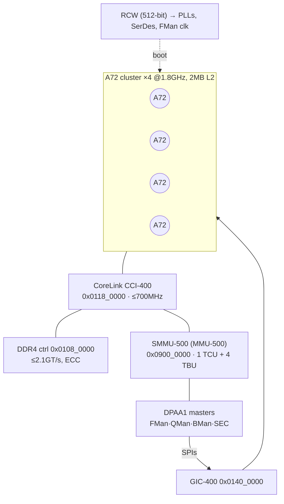

**Version 1.0 · vyos-ls1046a-build · 2026-06-21 · HADS 1.0.0**

## AI READING INSTRUCTION

This document uses HADS 1.0.0 tags. `**[SPEC]**` marks verifiable architectural facts (register addresses, protocol assignments, hardware capabilities, table data, DTS requirements). `**[NOTE]**` marks narrative, rationale, historical context, annotations, footnotes, and asides. `**[BUG] Title**` requires symptom + cause + fix (all three present). `**[?]**` marks unverified or inferred content requiring confirmation. Preserve all Mermaid diagrams, tables, and code blocks verbatim.

## 1. SoC integration overview

**[NOTE]** Sources: `LS1046ARM` Rev 3 (Ch.1–2 overview/map, Ch.4–6 reset/clock/GIC, Ch.11–13 SCFG/DCFG/RCPM, Ch.14 DPAA impl). This is the "everything that wires the DPAA blocks into the A72 cluster" layer — the CCSR map, how the chip boots/clocks the networking IP, the GIC interrupt numbers Linux binds, and the SMMU/ICID stream isolation + cache-snoop config that make zero-copy DPAA actually coherent.

## 2. Identity & core complex

**[SPEC]** **4× Cortex-A72** (ARMv8-A), single cluster, up to **1.8 GHz**; 48KB L1-I / 32KB L1-D per core; **2 MB shared L2** (16-way, ECC). 40-bit PA (1 TB). Neon + ARMv8 crypto ext.

**[SPEC]** **SVR = `0x8707_0010`** (LS1046A). **CCI-400** at `0x0118_0000` (≤700 MHz, 3 PoS).

**[SPEC]** All **DPAA blocks are big-endian**; the LE A72 must byte-swap CCSR accesses.

## 3. CCSR memory map (the addresses Linux DTS encodes)

**[SPEC]** CCSR base `0x0100_0000` (physical; Linux ALTCBAR view `0x01_0000_0000`).

**[SPEC]**
| Block | CCSR base | Notes |
|---|---|---|
| DDR controller | `0x0108_0000` | big-endian |
| CCI-400 | `0x0118_0000` | |
| GIC-400 | `0x0140_0000` | distributor `0x0141_0000`, CPU-if `0x0142_0000` |
| SCFG | `0x0157_0000` | supplemental config (snoop, QoS, ICID, clk mux) |
| **SEC / CAAM** | `0x0170_0000` | 1 MB (`sec-caam.md`) |
| **QMan cfg** | `0x0188_0000` | (`qman-ceetm.md`) |
| **BMan cfg** | `0x0189_0000` | (`bman.md`) |
| **FMan** | `0x01A0_0000` | 1 MB window (`fman.md`) |
| mEMAC1–6 | `0x01AE_0000` | +0x2000 stride |
| mEMAC9 / mEMAC10 | `0x01AF_0000` / `0x01AF_2000` | the 10G XFI MACs |
| MDIO1 / MDIO2 | `0x01AF_C000` / `0x01AF_D000` | |
| SerDes1 / SerDes2 | `0x01EA_0000` / `0x01EB_0000` | (`serdes-ethernet.md`) |
| DCFG / SCFG-clk / RCPM | `0x01EE_0000`–`0x01EE_2FFF` | DEVDISR lives here |
| TMU (thermal) | `0x01F0_0000` | ±3 °C |
| SMMU (MMU-500) | `0x0900_0000` | 16 MB |
| **QMan SW portals** | `0x05_0000_0000` | 128 MB cache-enabled window (36-bit space) |
| **BMan SW portals** | `0x05_0800_0000` | 128 MB |

**[NOTE]** **mEMAC7/8 do not exist** — the 6→9 numbering gap is real silicon. 8 mEMACs total (1–6, 9, 10).

## 4. Boot, RCW & clocking

**[SPEC]** A **512-bit RCW** is loaded by the on-chip PBL from NV memory (NOR/QSPI/SD — **NAND is NOT a valid RCW source**) at POR, then optional PBI writes CCSR pre-init pairs. RCW sets every PLL, the SerDes protocol, RGMII pin-mux and FMan clock **before any core runs**.

**[SPEC]**
| Clock | RCW field | Typical |
|---|---|---|
| Platform | `SYS_PLL_RAT` | 400–700 MHz (SYSCLK×4–7) |
| Core cluster | `CGA_PLL1/2_RAT` + `C1_PLL_SEL` | up to 1.8 GHz |
| DDR | `MEM_PLL_RAT` (`DDR_FDBK_MULT=0b10`) | 1.6 GT/s default |
| **FMan** | `HWA_CGA_M1_CLK_SEL` | CGA PLL2÷2 (e.g. 500–700 MHz) |
| eSDHC/QSPI | `HWA_CGA_M2_CLK_SEL` | |

**[SPEC]** **Networking-critical RCW fields:** `SRDS_PRTCL_S1/S2` (SerDes protocol — `0x1133` default, see `serdes-ethernet.md`), `SRDS_PLL_REF_CLK_SEL` (**XFI ⇒ 156.25 MHz on PLL2**), `EC1/EC2` (RGMII MAC3/4 pin-mux), `EM1/EM2` (MDIO mode). After reset, **check `SerDesx_PLLnRSTCTL[RST_DONE]`** before transmitting, or the link silently fails.

**[BUG] RGMII clock select gotcha** Symptom: the RGMII port (eth2/mac2) has no link or fails to transmit. Cause: the RGMII 125 MHz Tx reference is muxed by **`SCFG_ECGTXCMCR[CLK_SEL]`** (EC1 vs EC2 pad) — a common board bring-up gotcha. Fix: verify `SCFG_ECGTXCMCR[CLK_SEL]` selects the correct EC1/EC2 pad in the DTS or boot-stage config.

## 5. GIC-400 interrupt map (the SPI numbers Linux binds)

**[SPEC]** GIC-400 (256 IRQs). DPAA SPIs — bake these into DTS:

**[SPEC]**
| SPI | Source |
|---|---|
| **76** | FMan (general) |
| **77** | FMan/QMan/BMan combined **error** |
| 78 / 79 | MDIO-1G / MDIO-10G |
| 103–106 | SEC Job Rings 1–4 |
| 107 | SEC global |
| **204 + 2n** | **QMan portal n** (n=0..9 → 204,206,…,222, even) |
| **205 + 2n** | **BMan portal n** (odd: 205,207,…,223) |

**[?]** **Discrepancy to track:** ASK2 spec §2.4 cites FMan event SPI44/IRQ59 and err SPI45, which differ from the RM's 76/77. Reconcile against the actual DTS at integration time — the stock QEF 210.10.1 ucode does **not** use CEV doorbell / REV events, so the FMan "event" path may differ from the RM's generic numbering. Treat the **DTS** as ground truth and this table as the silicon reference.

## 6. SMMU / ICID stream isolation

**[SPEC]** Every DMA master carries an **ICID** (in DPAA also called LIODN/stream-ID) used by the **SMMU-500** (1 TCU + 4 TBU) for translation + isolation. SCFG holds per-master ICID registers (`SCFG_{USB,SATA,SDHC,eDMA,…}_ICID`); DPAA blocks have their own ICID config in the DPAA/portal path.

**[SPEC]** The DPAA FD carries an **8-bit ICID `{EICID[1:0], ICID[5:0]}`** so QMan/BMan/FMan/SEC DMA is attributable per-flow/per-portal — the basis for VM/container isolation.

**[SPEC]** **QMan is always a non-secure master**; its portal security `CSL6[24:16]` must be "allow all access" or enqueues fault.

**[SPEC]** Source IDs (CoreSight/fabric): FMan `0xC0–0xCF`, QMan `0x3C`, BMan `0x18`, SEC `0x21`.

## 7. Cache coherency & QoS (correctness + perf footguns)

**[NOTE]** These SCFG/DCFG settings decide whether zero-copy DPAA actually works and how fast (cross-ref `sec-caam.md` §4, `muram.md`):

**[SPEC]**
| Register | Bits | Why it matters |
|---|---|---|
| **`SCFG_SNPCNFGCR`** `0x0157_01A4` | `SECRDSNP/SECWRSNP` (+SATA/USB) | **default 0 = NOT snoopable.** Must set for SEC DMA to be cache-coherent with A72 — otherwise IPsec reads stale data |
| **`MCFGR`** (in SEC) | `ARCACHE/AWCACHE` | the AxCache half of the same coherency requirement |
| **`SCFG_QOS1`** `0x0157_016C` | FMan/SEC/PCIe/DMA CCI weights | **default 0 = lowest priority** → DPAA starves under load. Raise it |
| **`SCFG_QOS2`** `0x0157_0170` | QMan/PCIe3/USB/SATA weights | same footgun |
| **`DEVDISR`** (DCFG) | per-block enable | **gating is one-way/permanent within a power cycle** — don't disable a block you'll need |

**[NOTE]** **Bring-up rule of thumb:** if IPsec offload returns garbage → check `SNPCNFGCR` + `MCFGR`. If it's correct but slow → check `QOS1/QOS2`. If a block is "missing" → check `DEVDISR`.

**[SPEC]** `RCPM` (`0x01EE_2000`) governs low-power/retention sequencing; `SCFG_LPMCSR/COREPMCR/RETREQCR` handle per-core WFI/L2 gating — relevant only if the board does deep idle.

## 8. ASK2 relevance

**[SPEC]**
| SoC facility | ASK2 impact |
|---|---|
| CCSR map + GIC SPIs | what the DTS must encode for FMan/QMan/BMan/SEC |
| RCW `SRDS_PRTCL` `0x1133` | fixes the netdev↔MAC↔lane identity ASK2 PCD targets |
| `SCFG_SNPCNFGCR` + `MCFGR` | **mandatory** for coherent IPsec offload via SEC QI |
| `SCFG_QOS1/2` | DPAA throughput under load (raise from default) |
| ICID / SMMU | per-flow isolation; portal stream IDs |
| DEVDISR one-way | don't gate SEC/FMan during experiments |
| `RST_DONE` check | 10G links need SerDes PLL lock confirmed |

**[NOTE]** Related: all sibling docs — this is the integration substrate. See especially `serdes-ethernet.md` (RCW SerDes), `sec-caam.md` (snoop/QoS), and the spec `../specs/ask2-rewrite-spec.md` §2 (hardware context), §2.4 (interrupts).