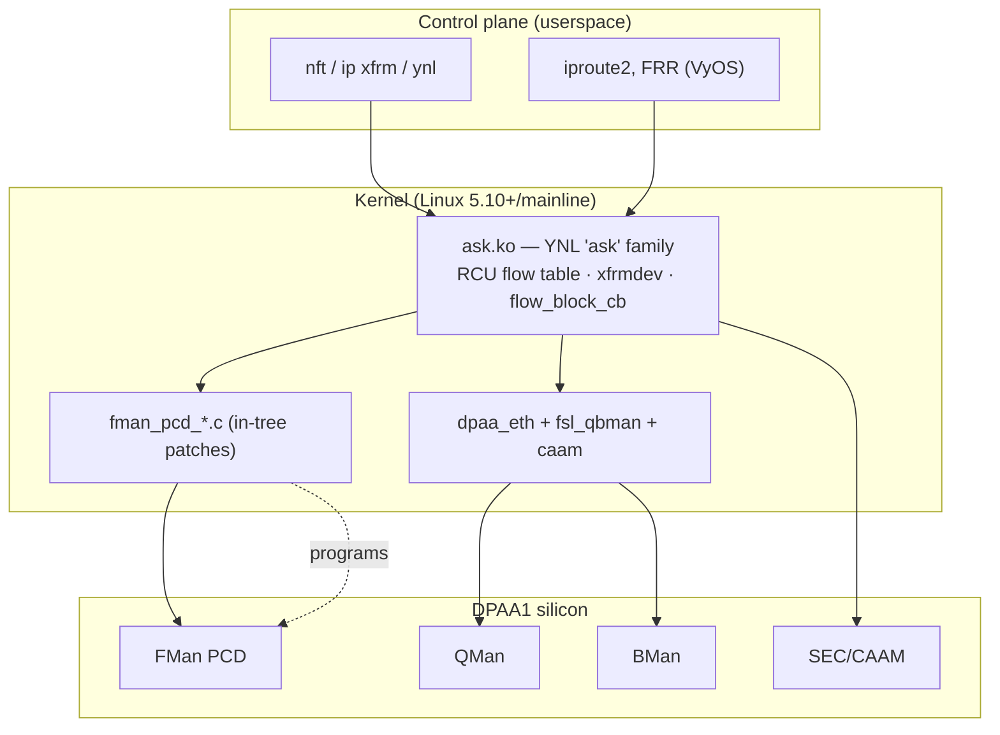
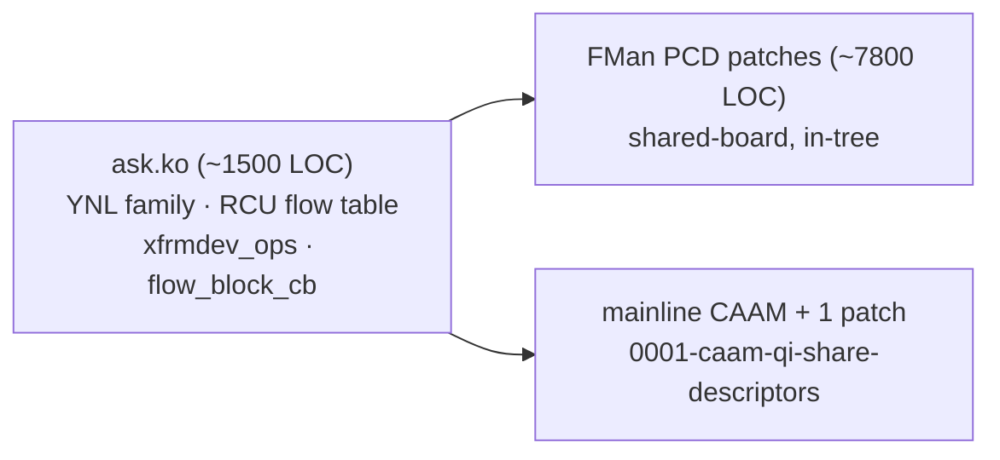
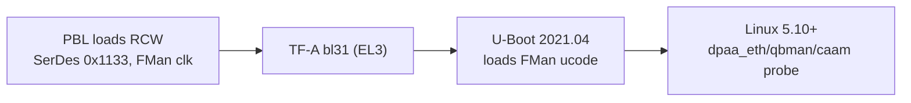

**Version 1.0 · vyos-ls1046a-build · 2026-06-21 · HADS 1.0.0**

## AI READING INSTRUCTION

This document uses HADS 1.0.0 tags. `**[SPEC]**` marks verifiable architectural facts (register addresses, protocol assignments, hardware capabilities, table data, DTS requirements). `**[NOTE]**` marks narrative, rationale, historical context, annotations, footnotes, and asides. `**[BUG] Title**` requires symptom + cause + fix (all three present). `**[?]**` marks unverified or inferred content requiring confirmation. Preserve all Mermaid diagrams, tables, and code blocks verbatim.

## 1. Software stack overview

**[NOTE]** Purpose: the bridge between the hardware reference docs (this directory) and the ASK2 implementation. It explains the *software* lineage that drives DPAA1 — vendor SDK, the legacy **ASK** reference stack, the modern **ASK2** rewrite, mainline Linux, and the NXP doc corpus (LSDK 21.08 / LLDPUG L6.1.1) — and maps each software layer onto the hardware blocks documented in `dpaa1-architecture.md`, `fman.md`, `fman-pcd.md`, `qman-ceetm.md`, `bman.md`, `sec-caam.md`.

## 2. The four software lineages (don't conflate them)

**[SPEC]**
| Lineage | What it is | Status for us |
|---|---|---|
| **NXP SDK / DPAA FLib** | Vendor C library (`libfm`, FMC, FMan Driver "FMD") that builds PCD config from XML (NetPDL/NetPCD). Userspace-driven. | reference algorithms only |
| **ASK** (legacy) | The board's existing vendor-derived offload stack (`ask-ref`/`ask`, `fmc`/`libfmc`) — the thing ASK2 replaces. | being replaced |
| **ASK2** (target) | Modern kernel-native rewrite to **ASK feature-parity**: `ask.ko` OOT module + in-tree `fman_pcd_*.c` + mainline CAAM. **No userspace daemon.** | **what we're building** |
| **LSDK 21.08 / LLDPUG L6.1.1** | NXP's documentation + release snapshots (kernel 5.10.35, U-Boot 2021.04, TF-A 2.4). Source of driver behaviour + version truth. | doc/reference corpus |

**[NOTE]** The legacy SDK path programs the FMan PCD from **userspace XML via FMC**. ASK2 deliberately moves that into the **kernel** (`fman_pcd_*.c`, `CONFIG_FSL_FMAN_PCD=y`) so policy is driven by standard Linux control planes (nftables, `ip xfrm`, YNL) instead of a vendor daemon.

## 3. ASK2 component decomposition (spec §1.3, §13)

**[SPEC]** **`ask.ko`** — the offload brain: a YNL netlink family `ask`, an RCU flow table, `xfrmdev_ops` (IPsec SA offload), and `flow_block_cb` (tc/flower hardware offload hooks). Kernel-only control.

**[SPEC]** **FMan PCD in-tree patches** (`fman_pcd_*.c`, exposed via `<linux/fsl/fman_pcd.h>`, patches 0092/0097–0100) — the per-file decomposition maps 1:1 to the hardware in `fman-pcd.md`:

**[SPEC]**
| File | HW block (`fman-pcd.md`) |
|---|---|
| `fman_pcd.c` | orchestration / port attach |
| `fman_pcd_prs.c` | Parser (HXS) |
| `fman_pcd_kg.c` | KeyGen (exact-match, `match_vector≠0`) |
| `fman_pcd_cc.c` | Coarse Classification trees (+`FORWARD_FQ_WITH_MANIP`) |
| `fman_pcd_manip.c` | Header manip (NAT/VLAN/TTL/cksum) — **Risk #13 budgeting** |
| `fman_pcd_plcr.c` | Policer (RFC4115) |
| `fman_pcd_replic.c` | Frame replicator (multicast / OP2 flood) |

**[SPEC]** **mainline CAAM + `0001-caam-qi-share-descriptors.patch`** — reuses upstream CAAM but enables the QI shared-descriptor path so the FMan fast path can dequeue→SEC→reinject without the CPU (`sec-caam.md` §3).

## 4. Classic driver stack (what ASK2 builds on)

**[SPEC]** The mainline DPAA1 drivers that remain underneath ASK2:

**[SPEC]**
| Driver | Role | HW doc |
|---|---|---|
| `fsl_qbman` (qman/bman) | portal init, FQ/BP alloc, FQD/PFDR/FBPR reserved-mem | `qman-ceetm.md`, `bman.md` |
| `fman` + `fman_port` + `fman_memac` | FMan block, BMI ports, MACs | `fman.md`, `serdes-ethernet.md` |
| `dpaa_eth` | netdev ↔ FQ binding (Rx default/error/PCD FQs, Tx conf) | `dpaa1-architecture.md` |
| `caam` (+ `caam_qi`) | crypto / IPsec via JR and QI | `sec-caam.md` |

**[NOTE]** `dpaa_eth` is the linchpin: it owns the netdev and the default/error FQs; ASK2's PCD layer steers *selected* flows into dedicated FQs/channels ahead of it, and uses the **OH (offline) ports** OP1/OP2 for IPsec reinject and bridge flood (`fman.md`, `serdes-ethernet.md` §4).

## 5. Boot → DPAA-ready (where the HW config actually lands)

**[SPEC]** **RCW** (512-bit) sets SerDes protocol `0x1133`, FMan clock (~700 MHz), RGMII mux — see `soc-integration.md` §3. **NAND is not a valid RCW source.**

**[SPEC]** **FMan microcode** (QEF/`fsl_fman_ucode…`) is loaded by U-Boot from QSPI offset `0x300000`. Stock **QEF 210.10.1** ucode does **not** use CEV doorbell/REV events — relevant to the FMan event-IRQ discrepancy noted in `soc-integration.md` §4. Ucode version **must** match the FMan driver.

**[SPEC]** **Reserved memory** (DTS): `fsl,bman-fbpr`, `fsl,qman-fqd`, `fsl,qman-pfdr` carve DDR for the HW managers — these are the FBPR/FQD/PFDR backing stores from `bman.md`/`qman-ceetm.md`.

**[SPEC]** **RNG4 instantiation** at CAAM probe is mandatory or crypto self-tests fail (`sec-caam.md` §4).

**[SPEC]** Board identity (Mono Gateway DK / RDB lineage): SoC `0x8707_0010`, default RCW dir `RR_FFPPPN_1133_5559`, console `earlycon=uart8250,mmio,0x21c0500`. Netdev map in `serdes-ethernet.md` §4.

## 6. Mainline vs SDK split (what's upstream vs patched)

**[SPEC]**
| Capability | Mainline | ASK2 adds |
|---|---|---|
| dpaa_eth / qbman / memac | ✅ upstream | — |
| CAAM (JR path) | ✅ upstream | QI share-desc patch |
| FMan **PCD** (parser/keygen/CC/policer/manip/replic) | ❌ not in mainline | **in-tree `fman_pcd_*.c` patches** |
| 10GBASE-KR link training | ❌ (fixed XFI only) | out-of-scope (OOT, AN12572) |
| Offload control plane | ❌ | **`ask.ko`** (YNL/xfrm/flower) |

**[NOTE]** The PCD layer is the single biggest gap mainline doesn't fill — which is exactly why `fman-pcd.md` is the flagship hardware doc and `fman_pcd_*.c` is the bulk of the patch set.

## 7. ASK2 relevance (summary)

**[SPEC]**
| Software layer | Maps to HW doc | ASK2 artifact |
|---|---|---|
| `ask.ko` flow table / YNL | `dpaa1-architecture.md` FQ model | the offload brain |
| `fman_pcd_*.c` | `fman-pcd.md` | in-tree PCD patches |
| `caam_qi` + share-desc patch | `sec-caam.md` | IPsec offload |
| `dpaa_eth` FQ/channel binding | `qman-ceetm.md` | scheduling/QoS |
| OH ports OP1/OP2 | `fman.md` §OH | reinject + flood |
| RCW/ucode/reserved-mem | `soc-integration.md` | bring-up DTS |

**[NOTE]** Related: every sibling doc — this one is the map from code to silicon. Primary spec: `../specs/ask2-rewrite-spec.md` (§1.3 design, §13 PCD modules, §16 Risk #13). Plans: `../plans/`.