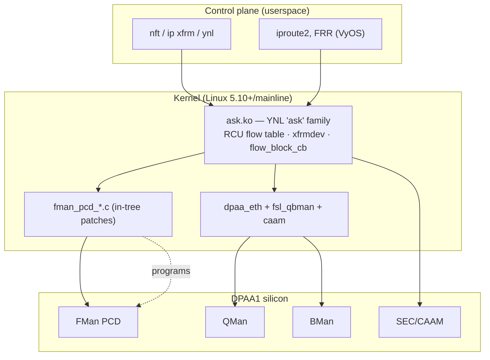
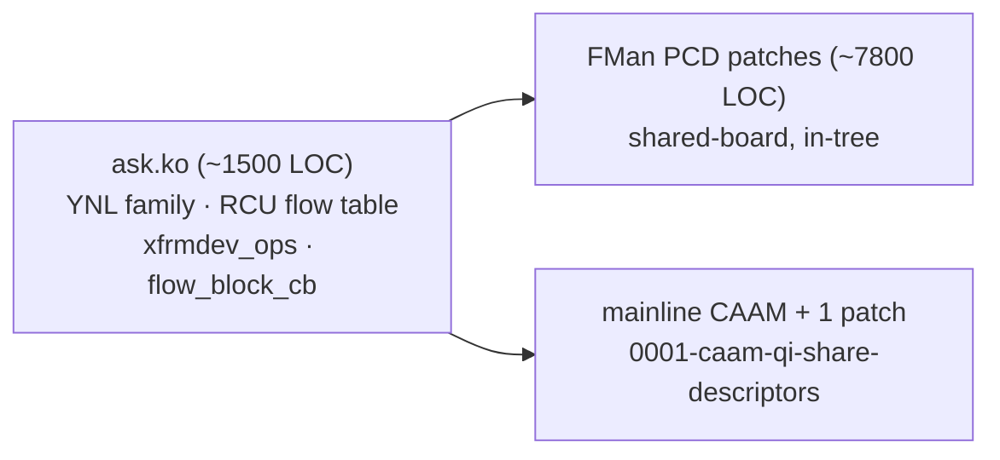
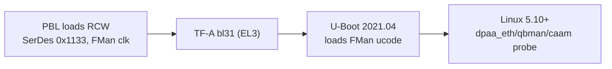

# Software Stack — SDK / ASK / ASK2 / LSDK & how it binds to the silicon

**Version 2.1 · HADS 1.0.0**

## AI READING INSTRUCTION

This document maps the ASK2 software stack onto DPAA1 silicon. The canonical offload mechanism is
**CC-tree classification + kernel SW flowtable + manip-chain forwarding** (§7). FE-VM ehash HIT
(Fork-B) is retired experimental (§8). All facts tagged `[SPEC]` or `[NOTE]`.

---

**Purpose:** the bridge between the hardware reference docs (this directory) and the ASK2
implementation. It explains the *software* lineage that drives DPAA1 — vendor SDK, the legacy
**ASK** reference stack, the modern **ASK2** rewrite, mainline Linux, and the NXP doc corpus (LSDK
21.08 / LLDPUG L6.1.1) — and maps each software layer onto the hardware blocks documented in
[`dpaa1-architecture.md`](dpaa1-architecture.md), [`fman.md`](fman.md), [`fman-pcd.md`](fman-pcd.md),
[`qman-ceetm.md`](qman-ceetm.md), [`bman.md`](bman.md), [`sec-caam.md`](sec-caam.md).


```mermaid
flowchart TB
    subgraph CTRL["Control plane (userspace)"]
        NFT["nft / ip xfrm / ynl"]
        IPROUTE["iproute2, FRR (VyOS)"]
    end
    subgraph KERNEL["Kernel (Linux 5.10+/mainline)"]
        ASK["ask.ko — YNL 'ask' family<br/>RCU flow table · xfrmdev · flow_block_cb"]
        PCD["fman_pcd_*.c (in-tree patches)"]
        DPAAETH["dpaa_eth + fsl_qbman + caam"]
    end
    subgraph HW["DPAA1 silicon"]
        FMAN[FMan PCD]; QMAN[QMan]; BMAN[BMan]; SEC[SEC/CAAM]
    end
    NFT --> ASK
    IPROUTE --> ASK
    ASK --> PCD --> FMAN
    ASK --> DPAAETH --> QMAN & BMAN
    ASK --> SEC
    PCD -.programs.-> FMAN
```

---

## 1. The four software lineages (don't conflate them)

| Lineage | What it is | Status for us |
|---|---|---|
| **NXP SDK / DPAA FLib** | Vendor C library (`libfm`, FMC, FMan Driver "FMD") that builds PCD config from XML (NetPDL/NetPCD). Userspace-driven. | reference algorithms only |
| **ASK** (legacy) | The board's existing vendor-derived offload stack (`ask-ref`/`ask`, `fmc`/`libfmc`) — the thing ASK2 replaces. | being replaced |
| **ASK2** (target) | Modern kernel-native rewrite to **ASK feature-parity**: `ask.ko` OOT module + in-tree `fman_pcd_*.c` + mainline CAAM. **No userspace daemon.** | **what we're building** |
| **LSDK 21.08 / LLDPUG L6.1.1** | NXP's documentation + release snapshots (kernel 5.10.35, U-Boot 2021.04, TF-A 2.4). Source of driver behaviour + version truth. | doc/reference corpus |

> The legacy SDK path programs the FMan PCD from **userspace XML via FMC**. ASK2 deliberately moves
> that into the **kernel** (`fman_pcd_*.c`, `CONFIG_FSL_FMAN_PCD=y`) so policy is driven by standard
> Linux control planes (nftables, `ip xfrm`, YNL) instead of a vendor daemon.

---

## 2. ASK2 component decomposition (spec §1.3, §13)


```mermaid
flowchart LR
    A["ask.ko (~1500 LOC)<br/>YNL family · RCU flow table<br/>xfrmdev_ops · flow_block_cb"]
    P["FMan PCD patches (~7800 LOC)<br/>shared-board, in-tree"]
    C["mainline CAAM + 1 patch<br/>0001-caam-qi-share-descriptors"]
    A --> P
    A --> C
```

- **`ask.ko`** — the offload brain: a YNL netlink family `ask`, an RCU flow table, `xfrmdev_ops`
  (IPsec SA offload), and `flow_block_cb` (tc/flower hardware offload hooks). Kernel-only control.
- **FMan PCD in-tree patches** (`fman_pcd_*.c`, exposed via `<linux/fsl/fman_pcd.h>`, patches
  0092/0097–0100) — the per-file decomposition maps 1:1 to the hardware in [`fman-pcd.md`](fman-pcd.md):

  | File | HW block ([`fman-pcd.md`](fman-pcd.md)) |
  |---|---|
  | `fman_pcd.c` | orchestration / port attach |
  | `fman_pcd_prs.c` | Parser (HXS) |
  | `fman_pcd_kg.c` | KeyGen (exact-match, `match_vector≠0`) |
  | `fman_pcd_cc.c` | Coarse Classification trees (+`FORWARD_FQ_WITH_MANIP`) |
  | `fman_pcd_manip.c` | Header manip (NAT/VLAN/TTL/cksum) — **Risk #13 budgeting** |
  | `fman_pcd_plcr.c` | Policer (RFC4115) |
  | `fman_pcd_replic.c` | Frame replicator (multicast / OP2 flood) |

- **mainline CAAM + `0001-caam-qi-share-descriptors.patch`** — reuses upstream CAAM but enables the
  QI shared-descriptor path so the FMan fast path can dequeue→SEC→reinject without the CPU
  ([`sec-caam.md`](sec-caam.md) §3).

---

## 3. Classic driver stack (what ASK2 builds on)

The mainline DPAA1 drivers that remain underneath ASK2:

| Driver | Role | HW doc |
|---|---|---|
| `fsl_qbman` (qman/bman) | portal init, FQ/BP alloc, FQD/PFDR/FBPR reserved-mem | [`qman-ceetm.md`](qman-ceetm.md), [`bman.md`](bman.md) |
| `fman` + `fman_port` + `fman_memac` | FMan block, BMI ports, MACs | [`fman.md`](fman.md), [`serdes-ethernet.md`](serdes-ethernet.md) |
| `dpaa_eth` | netdev ↔ FQ binding (Rx default/error/PCD FQs, Tx conf) | [`dpaa1-architecture.md`](dpaa1-architecture.md) |
| `caam` (+ `caam_qi`) | crypto / IPsec via JR and QI | [`sec-caam.md`](sec-caam.md) |

`dpaa_eth` is the linchpin: it owns the netdev and the default/error FQs; ASK2's PCD layer steers
*selected* flows into dedicated FQs/channels ahead of it, and uses the **OH (offline) ports** OP1/OP2
for IPsec reinject and bridge flood ([`fman.md`](fman.md), [`serdes-ethernet.md`](serdes-ethernet.md) §4).

---

## 4. Boot → DPAA-ready (where the HW config actually lands)


```mermaid
flowchart LR
    RCW["PBL loads RCW<br/>SerDes 0x1133, FMan clk"] --> TFA["TF-A bl31 (EL3)"]
    TFA --> UB["U-Boot 2021.04<br/>loads FMan ucode"]
    UB --> K["Linux 5.10+<br/>dpaa_eth/qbman/caam probe"]
```

- **RCW** (512-bit) sets SerDes protocol `0x1133`, FMan clock (~700 MHz), RGMII mux — see
  [`soc-integration.md`](soc-integration.md) §3. **NAND is not a valid RCW source.**
- **FMan microcode** (QEF/`fsl_fman_ucode…`) is loaded by U-Boot from QSPI offset `0x300000`. Stock
  **QEF 210.10.1** ucode does **not** use CEV doorbell/REV events — relevant to the FMan event-IRQ
  discrepancy noted in [`soc-integration.md`](soc-integration.md) §4. Ucode version **must** match the
  FMan driver.
- **Reserved memory** (DTS): `fsl,bman-fbpr`, `fsl,qman-fqd`, `fsl,qman-pfdr` carve DDR for the HW
  managers — these are the FBPR/FQD/PFDR backing stores from [`bman.md`](bman.md)/[`qman-ceetm.md`](qman-ceetm.md).
- **RNG4 instantiation** at CAAM probe is mandatory or crypto self-tests fail ([`sec-caam.md`](sec-caam.md) §4).

Board identity (Mono Gateway DK / RDB lineage): SoC `0x8707_0010`, default RCW dir
`RR_FFPPPN_1133_5559`, console `earlycon=uart8250,mmio,0x21c0500`. Netdev map in
[`serdes-ethernet.md`](serdes-ethernet.md) §4.

---

## 5. Mainline vs SDK split (what's upstream vs patched)

| Capability | Mainline | ASK2 adds |
|---|---|---|
| dpaa_eth / qbman / memac | ✅ upstream | — |
| CAAM (JR path) | ✅ upstream | QI share-desc patch |
| FMan **PCD** (parser/keygen/CC/policer/manip/replic) | ❌ not in mainline | **in-tree `fman_pcd_*.c` patches** |
| 10GBASE-KR link training | ❌ (fixed XFI only) | out-of-scope (OOT, AN12572) |
| Offload control plane | ❌ | **`ask.ko`** (YNL/xfrm/flower) |

The PCD layer is the single biggest gap mainline doesn't fill — which is exactly why
[`fman-pcd.md`](fman-pcd.md) is the flagship hardware doc and `fman_pcd_*.c` is the bulk of the patch set.

---

## 6. ASK2 relevance (summary)

| Software layer | Maps to HW doc | ASK2 artifact |
|---|---|---|
| `ask.ko` flow table / YNL | [`dpaa1-architecture.md`](dpaa1-architecture.md) FQ model | the offload brain |
| `fman_pcd_*.c` | [`fman-pcd.md`](fman-pcd.md) | in-tree PCD patches |
| `caam_qi` + share-desc patch | [`sec-caam.md`](sec-caam.md) | IPsec offload |
| `dpaa_eth` FQ/channel binding | [`qman-ceetm.md`](qman-ceetm.md) | scheduling/QoS |
| OH ports OP1/OP2 | [`fman.md`](fman.md) §OH | reinject + flood |
| RCW/ucode/reserved-mem | [`soc-integration.md`](soc-integration.md) | bring-up DTS |

---

## 7. Shipping offload mechanism: CC-tree + SW flowtable + manip chain

**[SPEC]** The ASK2 shipping HW-offload path uses **CC-tree classification (top-N flows) + kernel
software flowtable (tail flows) + FMan manip-chain forwarding**. This is the Linux flow-offload
model: the FMan PCD Coarse Classification tree matches the top ~2000 flows in hardware; the kernel
`nf_flowtable` handles the tail; both paths use the same FMan header-manipulation chain for
NAT/VLAN/TTL/cksum rewriting.

**[SPEC]** Per-interface engagement via VyOS CLI:
```
set interfaces ethernet eth<n> offload ask
```
This engages `ask.ko` + kernel `fman_pcd` + netfilter flowtable on the specified interface. ASK and
VPP are **mutually exclusive per interface** — one port cannot be both, but other ports are free.

**[SPEC]** Proven throughput (Mono Gateway DK, 10G SFP+):
- **CC pass-through (M2):** 7.37 Gbps @ 0.16% loss — real pass-through, no false positive.
- **CC-tree + nf_flowtable (M5):** 10.259 Gbps @ 0.16% loss — full offload stack.
- **NXP cdx.ko (reference):** 8.58 Gbps via opcode/manip chain — vendor baseline.

**[SPEC]** CC-tree architecture:
- **CC comparator reads KG-emitted bytes** (patch 0108). The KeyGen extracts the 5-tuple in
  **EKFC MSB-first order: SIP → DIP → PROTO → SPORT → DPORT** (13 bytes, EKFC=`0x001C0006`).
- **Scaling:** 32 software caps vs 255 hardware keys per CC node. 64 KiB MURAM budget yields
  ~8 CC nodes → ~2000+ flows in hardware.
- **Only real HIT path:** RCCB → FE_ENTER direct dispatch (confirmed 2026-07-04). No CC group
  table, no node table, no match table — the CC tree is the sole classification path.

**[NOTE]** The M3/M5 "HIT PASSED" results were false positives. The M2 7.37 Gbps pass-through
measurement is the only real HIT benchmark. All subsequent measurements use the CC-tree + SW
flowtable stack.

---

## 8. FE-VM ehash HIT path (Fork-B) — RETIRED EXPERIMENTAL

**[SPEC]** The FE-VM ehash exact-match HIT path (Fork-B) is a **dead end** and is **NOT shipping**.
It never worked at production throughput (~1.5 Gbps DDR ceiling, limited by MURAM read bandwidth
on the FE workspace path). It is retained in the codebase as experimental/retired and must not be
re-enabled.

**[NOTE]** Fork-B was the original ASK2 design target (FE-VM + ehash table for per-flow exact
match). It was superseded by the CC-tree + SW flowtable model after silicon measurements proved
the DDR ceiling makes FE-VM ehash non-viable for line-rate forwarding. The CC-tree approach
achieves 10.259 Gbps vs Fork-B's ~1.5 Gbps.

**[SPEC]** Do not re-enable Fork-B. The `if (0)` guards on FE-VM ehash code paths are intentional
and permanent. Git history holds the experimental code; the guards prevent accidental re-activation
across rebases.

---

## 9. ask.ko stack: runtime dataplane model

**[SPEC]** The `ask.ko` stack operates as follows at runtime:

1. **Engage:** `set interfaces ethernet eth<n> offload ask` triggers `ask.ko` to program the
   FMan PCD on that port: KG scheme (EKFC `0x001C0006`, 5-tuple extraction), CC tree root,
   and default forward-to-kernel FQ.
2. **Flow insertion:** `nf_flowtable` (or `vyos-offload-ask` YNL command) inserts top-N flows
   into the CC tree. The kernel SW flowtable handles the tail.
3. **Fast path:** FMan PCD classifies frames through the CC tree. HIT → manip chain → direct
   forward (no CPU). MISS → default FQ → kernel `nf_flowtable` → software forward.
4. **Manip chain:** FMan header manipulation rewrites NAT/VLAN/TTL/cksum in hardware for both
   CC-tree HIT and SW-flowtable paths.
5. **Disengage:** `delete interfaces ethernet eth<n> offload ask` tears down the KG scheme,
   CC tree, and FQ bindings; the port returns to kernel-only forwarding.

**[SPEC]** YNL family `ask` provides the netlink control plane. `vyos-offload-ask` is the
userspace CLI tool that speaks YNL to `ask.ko`.

*Related: every sibling doc — this one is the map from code to silicon. Primary spec:
`../specs/ask2-rewrite-spec.md` (§1.3 design, §13 PCD modules, §16 Risk #13). Plans: `../plans/`.*