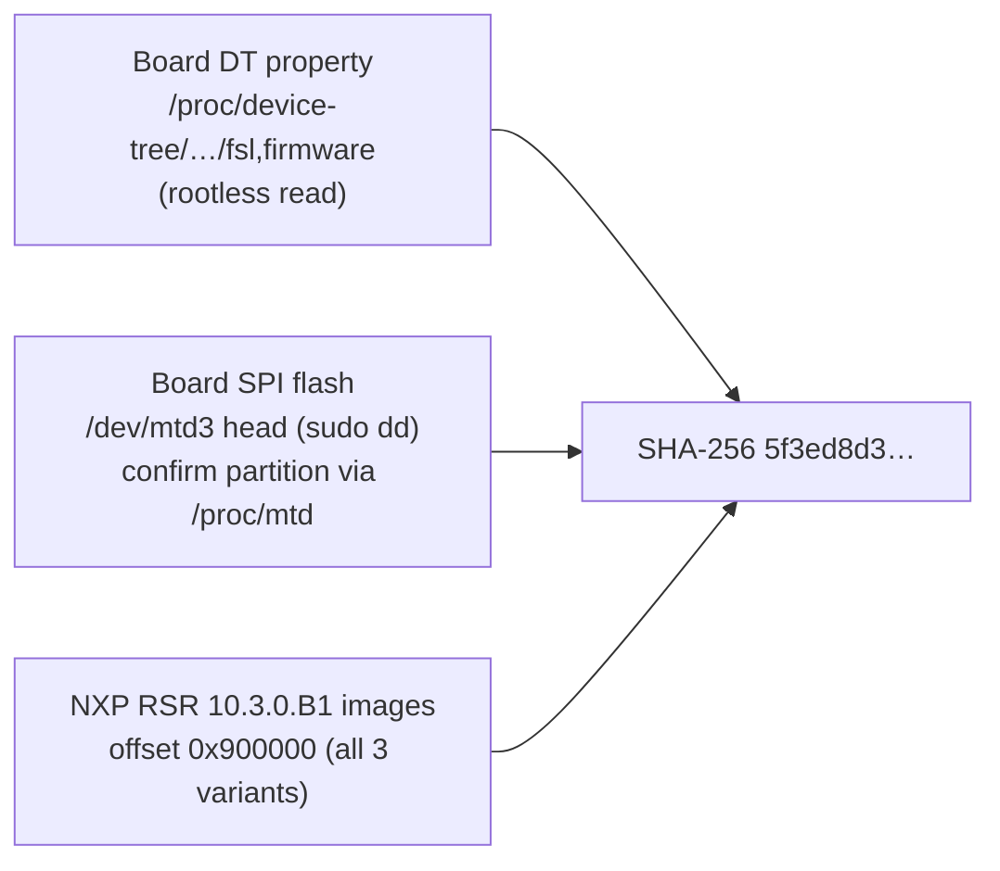

# Phase 0 — Acquisition & Corpus

**Status: DONE (2026-08-07)**

## Goal

Obtain the canonical 210.10.1 blob from multiple independent provenance
sources, hash-verify them against each other, and stage the public
same-ISA corpus used for differential analysis.

## Artifacts

| Artifact | Location | Note |
|---|---|---|
| 210.10.1 blob | `/tmp/kilo/fman-ucode-210.10.1.bin` (runner, volatile) | 51,652 B, SHA-256 `5f3ed8d3…eff0d` |
| Public corpus (23 blobs) | `/tmp/kilo/qoriq-fm-ucode/` (runner, volatile) | `git clone --depth 1` |
| Official RSR copy | Windows workstation `C:\github\vyos-ls1046a-build\RSR\ls1046a-rdb\…firmware.bin` @ `0x900000` | third provenance source |

Do **not** commit the blob to git (NXP LA_OPT EULA — proprietary
redistribution). The repo records hashes and recipes, not the binary.

## Canonical fingerprint

```
size   = 51652
md5    = 6f23090a3d5ae8b302ea41fd90a14d4d
sha256 = 5f3ed8d32b8659aafd8912d5d9920306350cae7a85884d81859152b9723eff0d
```

## Provenance sources (all three byte-identical, verified)



Re-acquisition recipes:

```bash
# 1. Live board, no root (preferred):
ssh -i ~/.ssh/vyos_key vyos@192.168.1.185 \
  'cat /proc/device-tree/soc/fman@1a00000/fman-firmware/fsl,firmware' \
  > fman-ucode-210.10.1.bin
sha256sum fman-ucode-210.10.1.bin   # expect 5f3ed8d3…eff0d

# 2. Board raw flash (needs sudo; partition number has shifted between builds):
ssh -i ~/.ssh/vyos_key vyos@192.168.1.185 'cat /proc/mtd'   # confirm fman-ucode
ssh -i ~/.ssh/vyos_key vyos@192.168.1.185 \
  'sudo dd if=/dev/mtd3 bs=1 count=51652 2>/dev/null' > fman-ucode-210.10.1.bin

# 3. Official NXP RSR image (offline):
dd if=openwrt-layerscape-armv8_64b-fsl_ls1046a-rdb-ls1046a_10.3.0.B1-squashfs-firmware.bin \
   bs=1 skip=$((0x900000)) count=51652 of=fman-ucode-210.10.1.bin

# Public corpus:
git clone --depth 1 https://github.com/nxp-qoriq/qoriq-fm-ucode.git
```

## Corpus inventory (differential set)

| Blob | SoC | FMan gen | Words | Role in analysis |
|---|---|---|---|---|
| 106.1.18 | P2041/P3041/P5020/P5040 | v2 | — | oldest 106 lineage |
| 106.2.18 | P4080 | v2 | — | HW-rev step |
| 106.4.18 | T1024/T1040/T2080/T4240/B4860/LS1043/LS1046 | v3 | 8,089 (LS1046) | **primary baseline** |
| 107.4.2 | T1024/T1040 | v3 | — | DSAR delta |
| 108.4.9 / 108.5.9 | T-series/B4860/LS1043/LS1046 | v3 | 9,328 (LS1046) | CAPWAP delta |
| 160.0.18 | P1023 | v2-lite | — | reduced ISA subset |
| **210.10.1** | LS1043/LS1046 (shared pkg) | v3 | 12,851 | **target** |

Same-generation cross-SoC pairs (e.g. LS1043 vs LS1046 106.4.18, or the five
106.1 targets) isolate SoC-specific code from core algorithms.

## Notes

- Board .185 is the acquisition/oracle board; .190 was unreachable from the
  runner on 2026-08-07 — retry .190 only for cross-board confirmation, never
  for experiments.
- `/tmp/kilo` on the runner is scratch space: re-run the recipes after any
  runner rebuild. Hashes above detect a bad re-pull.
