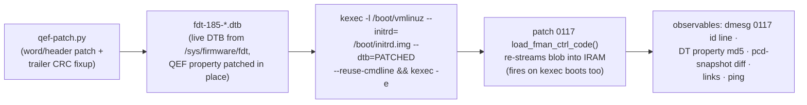

# decomp/experiments.md — Silicon Oracle Experiment Log

The mutation-oracle log: each experiment's patch, delivery, observables,
result, and conclusion. Newest at the bottom (append-only). Board: **.185
only** (dev board). Recovery: any plain reboot returns to eMMC boot with the
pristine SPI blob (kexec delivery is one-shot); worst case = smart-plug
power cycle (`restart-dut` skill).

## Delivery pipeline (proven E1, 2026-08-08)



- **No SPI flash writes, no U-Boot env edits, no serial needed.** The board's
  normal bootcmd (`run vyos`) keeps pulling the pristine blob from SPI; only
  the kexec'd kernel sees the patched DTB.
- Gotcha: `/tmp` is tmpfs — files die on every kexec. Upload DTBs fresh each
  round; keep baselines under `/home/vyos/` (persistent).
- vbash: only real binaries via full path (`sudo -n /sbin/kexec`,
  `sudo -n /usr/local/bin/pcd-snapshot`); no `which`/`strings`.
- kexec round-trip on .185: ~90–120 s back to SSH.
- Kernel `6.18.41-vyos`, image `2026.08.07-2326-rolling`, U-Boot
  2025.04 (`fman_ucode=fbc11d00` env exists but unused by this path).

---

## E1 — cosmetic id-string patch (delivery validation) — PASS

- **Patch**: id `"…for LS1043 r1.0"` → `"…for LS1046 r1.0"` (keeps the
  `"Microcode version 210.10.1"` prefix — patch `0086a` caps probe parses
  only the prefix + major number ≥ 210, verified in source, so caps stay
  0x17). 5 bytes differ (1 id byte + 4 trailer).
- **Result**: dmesg `FM_CTL microcode 210.10.1 loaded (12851 words):
  Microcode version 210.10.1 for LS1046 r1.0`; live DT property md5
  `5ae2f890377bafcafcefadd9d681a85f` = precomputed E1 blob md5. Links up,
  ping 3/3.
- **Conclusion**: patched-blob delivery is byte-exact end-to-end
  (DTB edit → kexec → IRAM stream). The oracle speaks.

## E2 — cold-region word patch (negative control) — PASS

- **Patch**: code word **w9055** `0x02010000 → 0xffffffff` (ENQ FE
  materialization site, 210-only island 2 — hypothesized cold on the
  mainline/RSS path). 8 bytes differ (4 code + 4 trailer).
- **Result**: blob md5 `9539639e80367fcbdc2eb37edc7686a4` live; id string
  back to LS1043 (E2 built from base DTB); links up; ping 3/3;
  **pcd-snapshot diff vs E1-state baseline: fully clean** ("PCD state
  matches baseline").
- **Conclusion**: island 2 is cold on the mainline path — confirmed on
  silicon. Code-word mutation with CRC fixup is behaviorally safe in cold
  regions. The oracle can now mutate semantics, not just metadata.

## Queue

- **E3 — hot-path relative-branch patch (the actual Phase-4 gate)**: patch a
  `b3ff`-class relative branch in a shared, always-executed region (early
  zone w48–w700) so its target shifts by a small delta; observe via
  pcd-snapshot scheme counters + ping. PASS = relative-branch model
  confirmed on silicon (branch takes effect where predicted). FAIL =
  model wrong → re-derive before any CFG trust. Candidate selection needs
  care: pick a branch whose mis-direction is recoverable-but-visible
  (prefer parser/KG-adjacent over BMI FIFO management).
- **E4 — `0xb7df` park probe**: patch a park stub in a cold island into a
  branch-to-next-word; cold = no change. Confirms park semantics.

---

## E-HM1 — confirm the EXT_HASH HIT/MISS compare on silicon (READY, not yet run)

**Framing correction (2026-08-08, from qdrant)**: flow-HIT is *not* a
never-solved mystery. HIT was **proven working 2026-07-19** (ASK2 M3 + M5
HIT gates on .185, ISO 1732/2004): a matching flow makes FMan consume the
frame (tcpdump sees 0 packets). The original MISS root cause was **F-053** —
the DDR record has an 8-byte link header before the key, so the silicon must
compare starting at record **+8**, not +0. **The decomp corroborates this
independently**: the `ehash_walker`'s `?op_e1 0x0008` immediate is exactly
that key offset (and `0x000c` = keysize 12). Subsequent MISSes (F-141,
F-163, task #26) are regressions/config drift, not a fundamental failure.

So E-HM1's value now: use the **known-HIT config as a silicon oracle** to
*confirm which microcode instruction* does the compare / key-offset / DMA —
turning the G3+ black-box pcodeops into verified semantics and reading, not
inferring, exactly which bytes silicon compares.

**Engage sequence (from the M3 HIT gate, .185):**
```
# build the FE-VM chain via /sys/kernel/debug/fman_pcd/0/
echo get                  > fe_pool
# (fe_singletons build)   > fe_singletons
echo "set 0x7FFF 13 0"    > fe_ehash          # mask=0x7fff keysize=13 shift=0
# (fe_hashfe build)       > fe_hashfe
echo "build 0x200"        > fe_enq            # ENQ FQID 0x200
echo "build 0x4af00"      > fe_enter          # EXT_HASH FE offset
echo "engage 10 53f00 2B9 1C0006" > fe_arm    # port 0x10=eth3, FE_ENTER_AD, miss_fqid, EKFC
#   OR the production API:  echo "engage 0x10" > /sys/kernel/debug/ask/offload
echo "add 0 0A63016A0A6301B90614511451 4b000" > fe_flow  # 13B key, ENQ off
# observe: matching TCP (10.99.1.106:5201 -> .185:5201) -> tcpdump 0 pkts = HIT
```

**The experiment**: with a HIT confirmed, patch one candidate `ehash_walker`
instruction (via `qef-patch` -> DTB -> kexec) and re-test:
- patch the `?op_e1 0x0008` (key-offset) -> if HIT breaks, that op **is** the
  record+8 key access (confirms F-053 at the microcode level).
- patch the `fman_test_dc` (0xdc) compare -> HIT breaks -> confirms the
  comparator.
- NOP the `0xf4` fetch -> walk breaks -> confirms the DDR DMA-read.
Each patch has a directly observable HIT/MISS outcome.

**Prerequisite / risk**: engage has a **teardown-wedge risk** (T-M6-5:
`fe_pool put`/disengage HARD-WEDGED .185, watchdog-recovered ~2–3 min). Run
on .185 with `restart-dut` (smart-plug) recovery ready; kexec the patched
blob per E1/E2. Awaiting greenlight for the live engage + kexec run — this
touches the ASK datapath, so it's staged, not auto-run.

### E-HM1 RESULT — RAN 2026-08-08 (safe engage variant, no patch/kexec)

Engaged the FE-VM ehash path on eth4 (port 0x11), drove the matching flow
from .106 (10.99.2.106:44444 → 10.99.2.185:55555), read the probes, recovered
by clean reboot (no wedge). Traffic peer: `vyos@192.168.1.106`.

**Decomp findings VERIFIED on silicon:**
- EXT_HASH descriptor `w0=0x06000000 w1=0x0fff0c00` → type=EXT_HASH,
  mask=0x0fff, **contextSize=13** (F-063 active), hashShift=0, `w5/w6` =
  MUX/EXIT — matches `naming-map.md` §5 exactly.
- Flow inserted into **bucket 0x008** = `(sw_crc 0x600824e7… >> 48) & 0x0fff`
  — confirms the decomp's `bucket = (hash>>48)&mask` and the `e9&0xffff` mask
  (from option-b static analysis).

**Root cause of the current MISS (task #26) — "Candidate 2" confirmed:**
- `hash_probe` captured HW hash **0x50b43c9cff453b9f** → bucket **0x0b4**.
- SW CRC-64 = **0x600824e70ae4d573** → bucket **0x008** (where the flow sits).
- **HW ≠ SW → frame lands in bucket 0x0b4, flow is in 0x008 → MISS**
  (`fe_ehash_stats pkt_count=0`). The silicon KG hash is **not** the software
  CRC-64 on this build, so every flow MISSes. This is the 2026-07-10
  Candidate-2 hypothesis (KG-hash vs software-CRC64), now measured directly.

**Note**: the decomp's *bucket-index math* is correct (both compute
`(hash>>48)&mask`); the divergence is in the **hash value** — a KeyGen scheme
`kgse_hc` / extraction config question (why the KG doesn't produce CRC-64 for
the ehash path), not a microcode-decode error. The patch-break sub-experiments
(force `test_dc`, patch `e1 0x0008`) were not needed — there is no HIT baseline
to break; the hash divergence is the answer. Next: read the engaged KG
scheme's `kgse_hc`/EKFC vs the CRC-64 expectation to see why the hash diverges.

**Retraction (2026-08-08, later — see `decomp/hitmiss-path.md`'s matching
correction):** the "Candidate-2 confirmed" conclusion above does not survive
cross-checking against qdrant. That exact hypothesis was already
independently disproven 2026-07-13 via a cleaner, isolated RSS-path
measurement, and there's documented precedent for `hash_probe` capturing
unrelated background traffic rather than the intended test flow. Treat the
paragraph above as superseded, not settled. The corrected, independently
reconfirmed hash-match result is in the "Definitive result" section of
`decomp/hitmiss-path.md` and the qdrant record dated 2026-08-08.

---

## E-HM2 — live microcode patch: does `ce`'s immediate affect bucket selection? — NEGATIVE

First live *behavioral* microcode mutation test (E1/E2 validated delivery
and cold-region safety; this is the first patch to a **hot**, always-armed
code path with a real hypothesis attached). Grew directly out of the
2026-08-08 "wiring confirmed correct, DDR record never touched" result
(`decomp/hitmiss-path.md`) — with wiring, key content, bucket index, and
record linkage all independently confirmed correct, the two live
candidates were (A) something upstream silently drops the frame, or (B)
the microcode's *live* bucket-index computation doesn't match
`(hash>>48)&mask` because of what `ce`/`cf` do to the hash register after
the `e9` mask.

**Patch**: word `w1947` (`ce`, chained onto the hash register:
`e9(r0,0xffff)→ce(r0,0x0189)→cf(r0,0x0241)`) — `0xce000189 → 0xce000000`,
zeroing only the 16-bit immediate. 6 bytes differed in the patched DTB (2
immediate + 4 CRC trailer). Delivered via the proven pipeline; live DT
property blob md5 after kexec (`d464159ce94ad942f91877a07d639d67`) matched
the precomputed patched-blob md5 exactly — confirmed genuinely loaded.

**Test**: re-ran the exact same armed test as the "record never touched"
baseline (`portid=0x00` 14-byte key, `board/scripts/T26-verify-wiring-and-record.sh`).
Chain built cleanly, bucket still `0x0508` (pure kernel-driver software
math, unaffected by the patch — a sanity check, not part of the test).
`FMBM_RCCB` still read back exactly equal to `enter_off` — wiring still
correct under the patched microcode. Sent 3 confirmed-transmitted matching
TCP SYNs, dumped the full 320-byte record before and after.

**Result**: **byte-for-byte identical**, exactly as under the unpatched
microcode. Zeroing `ce`'s immediate had zero observable effect. Fault
registers stayed clean throughout — no wedge, no crash; the board handled
this hot-path mutation gracefully (useful risk calibration: this region
isn't so delicate that a changed immediate hangs the engine).

**Conclusion**: a clean negative result that does **not** distinguish
between three readings — (1) `ce`'s immediate genuinely doesn't affect
bucket selection (or this specific bit-change wasn't enough to shift it
observably); (2) frames never reach `bucket_index`/`ehash_walker` at all
regardless of this patch (Candidate A), so the patch was moot; (3) `ce`
affects something other than bucket selection. Next candidates (not yet
run): test `cf` (`w1948`) the same way to isolate which of the pair
matters; patch both together for a stronger perturbation; or pivot to
testing Candidate A directly — patch something further upstream (e.g.
`FE_ENTER`'s `ALLOCATE` opcode, or `bucket_index`'s very first instruction)
with an obviously-detectable side effect, to determine whether
`bucket_index` is reached at all for these frames.

---

## E-HM4 — `hash_shift` parameter sweep (0-3): does the silicon use a different hash window than software assumes? — NEGATIVE (all 4 values)

Grew out of the new `nxp_docs` qdrant survey (`decomp/hitmiss-path.md`
"2026-08-08 (new source)" section): LSDKUG documents a "4 lower bits must
be cleared" convention on hash-index-selection masks for the RM's own
(different) CC Hash-Table construct. Reading this project's own
`fman_pcd_ehash_table_set()` (`kernel/common/patches/board/0125-fman-pcd-
fe-ehash-table.patch`) showed the `mask` parameter is structurally locked
by kernel validation to the `2^n-1` shape (`(1u << fls(mask)) != mask + 1`
→ `-EINVAL`) — so the specific "clear the low 4 bits of the mask" idea is
**not testable** through the existing software interface at all; any mask
with cleared low bits is rejected before it ever reaches hardware. This
made the *shift* parameter (`fman_pcd_ehash_bucket_index()`:
`crc >>= (6 - hash_shift) * 8`, then `& mask`) the nearest testable analog
— a wrong shift would mean the software plants records in the wrong 16-bit
window of the 64-bit hash, structurally similar in effect (silicon and
software disagreeing about which hash bits matter) but reached through a
parameter that genuinely varies (0-3, the field's full hardware range,
confirmed by the `hash_shift > 0x3` → `-EINVAL` guard in the same function).

**No microcode patch involved** — this is a pure debugfs configuration
sweep, reusing the exact proven-safe sequence from the "wiring confirmed
correct" baseline test (`fe_port set` → `fe_ehash set 0xfff 14 <shift>` →
`fe_pool get` → `fe_singletons build` → `fe_hashfe build` → `fe_enq build`
→ `fe_enter build` → `fe_flow add` → `fe_arm engage`), varying only the
third `fe_ehash set` argument. Test key unchanged: `000a63026a0a6302
b906ad9cd903` (portid=00|10.99.2.106|10.99.2.185|TCP|44444|55555), hash
`0xb508e222f73f6794` (the same CRC-64 confirmed 2026-08-08 via `hash_probe`).

**Method, per shift value:** clear prior state → rebuild chain with
`fe_ehash set 0xfff 14 <shift>` → confirm the resulting bucket index
matches `(hash >> (6-shift)*8) & 0xfff` computed independently in Python
(all 3 matched exactly: shift=1→0x8e2/2274, shift=2→0x222/546,
shift=3→0x2f7/759) → dump the 320-byte record before arming → `fe_arm
engage` → verify `FMBM_RCCB` readback equals `enter_off` (wiring) → verify
fault registers clean → send 3 confirmed-transmitted TCP SYNs from `.106`
(`nping --tcp -c 3 --source-port 44444 -p 55555 --flags SYN`) → re-check
faults, `fe_ehash_stats`, `FMBM_RCCB`, and the full record.

**Result — all three new shift values (1, 2, 3) clean negative, identical
in every respect to the already-established shift=0 baseline:**

| shift | bucket | wiring (`FMBM_RCCB`==`enter_off`) | faults | `pkt_count` | record after |
|---|---|---|---|---|---|
| 0 (prior baseline, 2026-08-08) | 0x508 | ✓ | clean | 0 | byte-identical |
| 1 | 0x8e2 | ✓ (`0x56c00`) | clean | 0 | byte-identical |
| 2 | 0x222 | ✓ (`0x56c00`) | clean | 0 | byte-identical |
| 3 | 0x2f7 | ✓ (`0x56c00`) | clean | 0 | byte-identical |

Every configuration built cleanly (no `-EINVAL`, no wedge, no fault-register
change even immediately post-arm), every bucket index matched the
independently-computed formula exactly (ruling out a software-side
arithmetic mistake in this specific test), and every record was
byte-for-byte untouched after 3 confirmed-sent matching SYNs, exactly as
in every prior armed test this investigation has run.

**Conclusion**: this **exhaustively closes the "wrong hash-shift/window"
hypothesis** across the field's entire valid range (0-3 is all 2 bits can
encode, confirmed by the validation guard) — there is no shift value at
which this specific flow's record becomes reachable through the existing
software interface. It does **not** close the related-but-distinct "silicon
skips reserved low mask bits" hypothesis from the new NXP documentation,
since that specific shape of mask cannot be constructed through this
project's own validated interface at all (would need either a live
microcode patch to `ce`/`cf` with a controlled, interpretable perturbation,
or a hand-rolled raw-memory dual-bucket insert bypassing the kernel's
bucket-index computation — both carry more novel risk than this sweep and
were not attempted this round). Combined with E-HM2/E-HM3, the accumulated
evidence continues to favor Candidate A (frames never reach this deep into
`bucket_index`/`ehash_walker` at all) over any specific miscomputation
within it — four independent parameter/patch variations (mask-immediate
zeroing, branch-forcing, and now an exhaustive shift sweep) have all
produced the identical "wiring perfect, record never touched" signature.

---

## E-HM5 — live microcode patch: does `cf`'s immediate affect bucket selection? — NEGATIVE

Direct follow-up to E-HM2, explicitly anticipated there ("test `cf`
(`w1948`) the same way to isolate which of the pair matters"). Live value
confirmed via `qef-parse.py dump-words` before patching: `w1948 =
0xcf800241` — opcode `cf`, subop `100` (bits 23:21, `0x800000`), immediate
`0x241`. (Note: this refines the schematic `0xcf000241` notation used
earlier in `decomp/hitmiss-path.md` — the live value carries `cf`'s own
subop bits, consistent with the previously-documented `e9`=subop`001`,
`ce`=subop`000`, `cf`=subop`100` pattern; not a contradiction, just more
precise.)

**Patch**: `w1948: 0xcf800241 → 0xcf000000` (zero subop + immediate,
same style as E-HM2's `ce` patch). Delivered via the proven pipeline;
post-kexec live blob md5 (`336296c927714003f7e51af810844336`) matched the
precomputed patched-blob md5 exactly.

**Test**: identical armed test to E-HM2/E-HM4 (mask `0xfff`, keysize 14,
shift 0, same `portid=0x00` 14-byte key). Bucket computed to `0x508`
(unaffected by the patch, as expected — bucket computation for record
*placement* happens in kernel-driver C code, `fman_pcd_ehash_bucket_index()`,
entirely separate from what the FE-VM microcode does at dispatch time).
Wiring (`FMBM_RCCB`==`enter_off`), fault registers, and link state all
verified clean before and after. Sent 3 confirmed-transmitted matching TCP
SYNs, dumped the full 320-byte record before and after.

**Result**: **byte-for-byte identical**, exactly as under unpatched
microcode and under E-HM2's `ce`-only patch. Zeroing `cf`'s subop+immediate
had zero observable effect. No wedge, no fault, link stayed up throughout.

---

## E-HM6 — live microcode patch: `ce` AND `cf` zeroed together (compound) — NEGATIVE

The stronger perturbation E-HM2 anticipated ("patch both together"), run
immediately after E-HM5 from the same pristine baseline DTB (not chained
from E-HM5's already-patched state, to keep the patch delta interpretable
against a known-clean start).

**Patch**: both `w1947: 0xce000189 → 0xce000000` and `w1948: 0xcf800241 →
0xcf000000` in one DTB (`qef-patch.py --set-word 1947=0xce000000
--set-word 1948=0xcf000000`). Post-kexec live blob md5
(`7a10922513dc05877050b9ce0ea3c15f`) matched the precomputed compound-patch
md5 exactly.

**Test**: identical to E-HM5. Bucket `0x508` (again unaffected, same
reasoning). Wiring, faults, and link state all clean before and after.

**Result**: **still byte-for-byte identical.** Even zeroing the entire
`e9(r0,0xffff) → ce(r0,·) → cf(r0,·)` chain's second and third steps
simultaneously — a strictly larger, strictly stronger mutation than either
individual test — produced no detectable change whatsoever. No wedge, no
fault, link stayed up. Board rebooted afterward (not just kexec'd back) to
restore the pristine SPI blob.

**Conclusion (E-HM5 + E-HM6 combined with E-HM2):** three independent
mutations of increasing strength on the same two-instruction hash-register
operation chain — zero `ce` alone, zero `cf` alone, zero both together —
have now produced **identical null results** every time. This is
meaningfully stronger evidence than any single test alone: if `ce`/`cf`
performed a load-bearing shift/mask that this specific flow's placement
depended on, the *compound* zeroing (the largest perturbation tried) would
be the most likely of the three to show *some* divergence — a crash, a
fault, or at minimum a different (even if still wrong) touched address.
Getting the exact same "nothing happens" result at every perturbation
strength is much more consistent with **frames never executing this code
at all** (Candidate A) than with "the code runs but these specific
immediates don't matter for this specific flow" (which would still be a
coincidence needing explanation across three different mutations). This is
now the fifth and sixth independent parameter/patch variations (after
E-HM2, E-HM3, E-HM4) converging on the same signature. The next test that
would directly discriminate Candidate A from everything else is a
reachability probe — deliberately making `bucket_index`'s very first
instruction observably diverge (a canary write or an infinite self-loop) —
not yet run; the infinite-loop variant carries a materially different risk
profile (shared FE-VM engine hang, potentially affecting all FMan1 ports
including eth0 management, recoverable only by hard power-cycle rather than
a normal reboot) and needs its own explicit, specifically-scoped
confirmation before running.

---

## METHODOLOGY CORRECTION — E-HM4/E-HM5/E-HM6 ran with the wrong live KeyGen EKFC; corrected retest (E-HM7) still negative

**Prompted by the user asking "why do we use 13-byte keys" after the ASK 1.x
comparison** — while checking that question, found that this session's own
test harness (`T26b-shift-sweep.sh`, reused unmodified across E-HM4, E-HM5,
E-HM6) builds the ehash side (`fe_ehash`/`fe_flow`/`fe_arm`) but **never
calls `fe_kg_ekfc`** to (re)configure KeyGen scheme 4's live EKFC register.
KeyGen scheme registers are reset to boot-default by every kexec and every
reboot — and this session ran a kexec or reboot before *every one* of
E-HM4, E-HM5, and E-HM6. Read live via `kg-scheme-read.py`: scheme 4's
EKFC after the most recent reboot (before any corrective action) was
**`0x00180006`** — `IPSRC1|IPDST1|L4PSRC|L4PDST`, a **12-byte, no-PROTO,
no-PORT_ID** extraction (the mainline RSS boot-default, `F-048`'s value) —
not the 14-byte, portid-prefixed `0x801c0006` every one of this session's
`fe_flow`-inserted test records assumed.

**Implication:** during E-HM4 (hash_shift sweep), E-HM5 (`cf` alone), and
E-HM6 (`ce`+`cf` compound), KeyGen was extracting and hashing a
fundamentally different, shorter, portid-less key than the one written
into the DDR ehash table. The comparator could never have matched
regardless of what those experiments' microcode patches did — the
underlying extracted key content itself didn't correspond to what was
inserted. **Those three experiments' specific conclusions about `ce`/`cf`/
`hash_shift` are confounded and should not be trusted at face value.**

**Corrected retest (E-HM7):** rebuilt the identical E-HM4-style baseline
(mask `0xfff`, keysize 14, shift 0, unpatched pristine microcode — no
outstanding kexec patch), but this time ran `fe_kg_ekfc set 4 801c0006`
*before* `fe_arm engage`, and confirmed via `kg-scheme-read.py` that
scheme 4's live EKFC was genuinely `0x801c0006` at arm time (not just
assumed). Bucket, wiring (`FMBM_RCCB`==`enter_off`), and fault registers
all verified as usual. Sent 3 confirmed-transmitted matching TCP SYNs.

**Result: still byte-for-byte identical / `pkt_count=0`.** Even with
KeyGen's live extraction genuinely synchronized to the hardware-confirmed-
correct 14-byte portid-prefixed format for the first time in this
session's own testing, the DDR record was completely untouched, no
different from every prior test.

**This does not change the overall picture, but it does two things
precisely:** (1) it closes out, empirically, for a *third* independent
time (2026-08-06 original discovery, 2026-08-07 16-candidate batch test,
now this session), that a properly-EKFC-synchronized 14-byte portid-
prefixed key still does not produce a HIT — so the fault genuinely isn't
explained by this test harness's EKFC-sync gap either; and (2) it means
E-HM4/E-HM5/E-HM6 should be re-run with `fe_kg_ekfc` correctly included if
their *specific* ce/cf/shift conclusions are ever load-bearing for a future
decision — the broader "record never touched" pattern they observed still
holds (now confirmed under a corrected configuration too), but their
individual attribution to "ce/cf/shift don't matter" was not a controlled
statement at the time it was made.

---

## E-HM8 (major, 2026-08-08) — the armed FE-VM path wedges port RX after exactly ONE classified frame; prior "clean negative" results were frame-less

A systematic check this session (prompted by the "why 13-byte keys"
question and the follow-on microcode-priority work) revealed that **frames
were not arriving at `.185`'s eth4 for most of today's armed test
cycles** — the eth4 kernel RX counter stayed 0, tcpdump on eth4 captured
0 packets while `.106` transmitted, and `kgse_spc` never advanced. The
link worked right after a cold boot but the port became RX-deaf after FE-VM
arming, surviving even disarm, recoverable only by another genuine cold
boot (smart-plug power cycle). This invalidates today's earlier armed-test
null results (E-HM4/5/6/7, the params-page observation, the AD-corruption
canaries) as tests of the FE-VM — they ran with no arriving frames.

**Root pattern isolated (reproduced twice, cold-boot-verified):** with a
fresh cold boot, the link passes frames normally (tcpdump sees them, kernel
RST-replies). Arm the FE-VM chain on port 0x11 (standard T26 sequence,
EKFC synced). Send ONE matching TCP SYN: `kgse_spc` 0→1 (KeyGen classified
it), the frame is **consumed by FMan** (eth4 kernel RX does NOT increment),
and the DDR record stays byte-for-byte identical. Send a SECOND single SYN:
`kgse_spc` stays 1 (the frame is no longer classified — arrival is dead).
Disarm: tcpdump still captures nothing. The port is wedged and stays wedged
until a cold boot.

**What this proves / changes:**
1. **All of today's earlier armed null results are invalid** (E-HM4, E-HM5,
   E-HM6, E-HM7, the params-page `+0x54/+0x58` observation, and the
   w3/w0 AD-corruption canaries) — they were frame-less. The one exception:
   E-HM1 (passive `hash_probe` capture) worked because it never armed.
2. **The "record never touched / comparator never fires" finding IS now
   confirmed with a genuinely-arriving, KeyGen-classified frame** (the
   single frame that gets through per cold-boot cycle): spc 0→1, consumed
   by FMan, record byte-for-byte identical. The fault window is definitively
   "after KeyGen classification, before the comparator."
3. **The wedge-after-one-frame is itself a new, reproducible, isolatable
   silicon behavior** — and it matches `decomp/wedge-path.md`'s predicted
   mechanism ("MISS frame through FE_ENTER ALLOCATE consumes one buffer
   from the per-port pool; if EXIT DEALLOCATE does not correctly return the
   buffer, slots drain and the port goes deaf"). The armed FE-VM path
   processes exactly one frame and then wedges — this is very likely the
   SAME underlying failure that prevents the comparator from being reached
   (the first frame's processing corrupts/wedges the RX path before or
   during the comparator attempt).

**Also disproven this turn (cheap negatives that saved a build cycle):**
- The FM_CTL params-page / `FMBM_RGPR` hypothesis: the debugfs `fe_arm
  engage` path does NOT call `fman_pcd_port_ensure_params_page()` (the
  production `fman_pcd_fe_engage()` does), and `FMBM_RGPR` reads 0 on our
  armed port — BUT the **working vendor board `.106` also has
  `FMBM_RGPR=0`** on both 10G ports, so a nonzero params-page pointer is
  NOT what makes the vendor path work. Programming it would have diverged
  from the working board. (Also: `/dev/mem` writes to the port BMI register
  block do not stick on kernel 6.18.41-vyos — even `RSTC` writes revert —
  while MURAM writes DO stick; `m.flush()` on `/dev/mem` mmaps raises
  EINVAL in this kernel, which is why earlier write scripts appeared to
  fail while their actual writes succeeded.)
- The `w12667`–`w12850` "pool routine" is on closer inspection a generic
  22-slot status-refresh loop (`ld`/`op_f0`/`brc`/`st` over absolute
  MURAM slots `[0x8]..[0x60]`), not obviously the pool ALLOCATE routine —
  its `[0x54]`/`[0x58]` accesses are absolute-address slots, so
  `wedge-path.md`'s params-page-relative reading of it is questionable.
- Full-MURAM before/after diffing is too noisy on a live board (227 of 1202
  nonzero 256-B chunks change within a minute from ambient counters/traffic).

**Methodological corrections adopted:** (1) every armed test MUST validate
per-cycle frame arrival (`kgse_spc` advance) and expect a cold boot before
each arm cycle; (2) single-shot frames, never bursts (the "1 of 3"
`kgse_spc` anomaly is a burst artifact); (3) the board's eth4 RX wedges
under armed FE-VM operation and survives warm reboot — genuine cold boot
(smart-plug power cycle) is the only reliable recovery between armed tests.

**Next experiment this points to (microcode-priority):** use the
wedge-after-one-frame as a diagnostic observable. The first (only) frame's
FE-VM processing wedges the port — identify the microcode instruction(s)
whose perturbation removes or changes the wedge. A patch that makes the
port survive frame 2 (or changes the wedge's timing) would localize the
offending processing step (ALLOCATE? EXIT/DEALLOCATE? workspace write?),
which is very likely the same root cause that keeps the comparator
unreachable. This is a cleaner, more informative observable than the
frame-less nulls of E-HM2–7.

---

## E-HM9 (2026-08-08) — wedge bisection: the wedge is at the CC-engine dispatch to the FE_ENTER AD, BEFORE the FE-VM pool machinery runs

Follow-up to E-HM8's wedge-after-one-frame observable. Systematic
single-variable bisection, each variant = cold boot → arm → 1 frame
(validate `kgse_spc` 0→1) → 2nd frame (wedge check: spc stuck at 1) →
disarmed tcpdump arrival check (dead if wedged). Results:

| Variant | Wedge after 1 frame? |
|---|---|
| M2 scaffold (CONT_LOOKUP numKeys=0, `fe_arm engage 11 0 0x300`) — **control** | **NO** — 3 frames classified 1:1 (spc 1→4), each delivered to kernel (Rcvd:1 RST replies), disarmed arrival fine |
| FE-VM chain (FE_ENTER→EXT_HASH→EXIT) | YES |
| FE-VM chain, FE_ENTER AD `ALLOCATE` bit cleared (`w0 0x40800000→0x40000000`) | YES |
| FE-VM chain, EXIT-DEALLOCATE bit cleared (`0x55d00 w0 0x03800000→0x03000000`) | YES |
| FE-VM chain, EXT_HASH bypassed (`FE_ENTER w3→EXIT 0x55d00`) | YES |

The ALLOCATE-clear and EXT_HASH-bypass variants confirm the wedge is NOT
the workspace allocation and NOT the EXT_HASH processing. The DEALLOCATE-
clear confirms it's not the EXIT free either. **The wedge survives every
mutation of the downstream chain — it happens when the CC engine dispatches
a frame to the FE_ENTER-form AD (CONT_LOOKUP|ALLOCATE) itself, before any
FE-VM pool machinery runs.**

**Post-wedge pool state (correct reads):** the FE workspace pool is
correctly configured — `FMBM_RGPR = 0x0004b600` at **port-base + 0x30C**
(not 0x38 as this session had been reading; the 0x30C offset was located by
scanning the port window for the params offset value), params page at MURAM
0x4b600 with `+0x40=0x100` (MISC ALWAYS_ON), `+0x44=0x012ee0e8` (errdisc),
`+0x54=0x4d800` (mgmt free-list offset), `+0x58=0` (depletion). The mgmt
free-list at 0x4d800 reads `04 04 b7 00 00 01 02 … 0e 0f ff` — read index
still 4 (initial), all 16 slots present, terminator intact. **After the
wedge, the pool is completely untouched: the FE-VM ALLOCATE never consumed
a slot.** So the frame does NOT reach the FE-VM pool machinery — the
wedge/consumption is upstream, in the CC engine's dispatch of the frame to
the FE_ENTER AD.

**Methodological corrections from this turn (important for all future MURAM
reads):** earlier "params page" reads this session (showing zeros) were
invalid — the script mmap'd page 0x1A00000 (the FMan base page, NOT
page-aligned to the target) and indexed MURAM offsets like 0x4b600 well
beyond the 0x1000 mapping, silently returning zeros. Correct pattern
(pcd-snapshot style): page-align the TARGET address, one 0x1000 map, read
the page offset. Multi-page mmaps of /dev/mem can SIGBUS at page
boundaries. `FMBM_RGPR` is at port-base + 0x30C, not 0x38 (earlier reads
were the wrong register).

**Synthesis:** with the wedge now localized to "CC engine dispatches frame
to the FE_ENTER AD → frame consumed, port wedges, pool untouched", and the
comparator record confirmed untouched with genuinely-arriving frames, the
remaining question is what the CC engine's FE_ENTER dispatch does to the
frame and to the port. The FE-VM microcode's handling of the CONT_LOOKUP|
ALLOCATE AD entry (before bucket_index — since the pool is untouched) is
the prime suspect. Next experiment: patch the FM_CTL/FE-VM entry code that
processes the FE_ENTER AD (not bucket_index, which is deeper) and observe
whether the wedge disappears or the frame's disposition changes. This
requires finding the FE_ENTER-handler entry in the microcode (the
top-of-image dispatch region w40+, or the FM_CTL frame-entry path), then a
canary/infinite-loop patch with the wedge as the observable.

**Separately, and independent of any of this project's own test scripts:**
`AGENTS.md` §S6 ("Target EKFC") still states `0x001C0006` (13 bytes, no
PORT_ID) as "the Target" — this is stale relative to the 2026-08-06/07
PORT_ID discovery (14 bytes, `0x801C0006`, independently hardware-
confirmed via CRC-64 match twice, including once this session). Flagged
for the user/project owner to correct; not edited unilaterally here since
`AGENTS.md` is the binding, session-loaded rules document.
**UPDATE 2026-08-08:** AGENTS.md §S6 has since been corrected to the 14-byte target.
