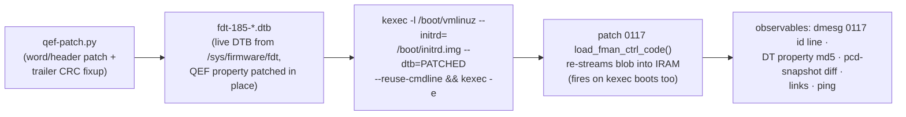

# decomp/experiments.md — Silicon Oracle Experiment Log

The mutation-oracle log: each experiment's patch, delivery, observables,
result, and conclusion. Newest at the bottom (append-only). Board: **.185
only** (dev board). Recovery: any plain reboot returns to eMMC boot with the
pristine SPI blob (kexec delivery is one-shot); worst case = smart-plug
power cycle (`restart-dut` skill).

## Delivery pipeline (proven E1, 2026-08-08)

- **No SPI flash writes, no U-Boot env edits, no serial needed.** The board's
  normal bootcmd (`run vyos`) keeps pulling the pristine blob from SPI; only
  the kexec'd kernel sees the patched DTB.
- Gotcha: `/tmp` is tmpfs — files die on every kexec. Upload DTBs fresh each
  round; keep baselines under `/home/vyos/` (persistent).
- vbash: only real binaries via full path (`sudo -n /sbin/kexec`,
  `sudo -n /usr/local/bin/pcd-snapshot`); no `which`/`strings`.
- kexec round-trip on .185: ~90–120 s back to SSH.
- Kernel `6.18.41-vyos`, image `2026.08.07-2326-rolling`, U-Boot
  2025.04 (`fman_ucode=fbc11d00` env exists but unused by this path).

---

## E1 — cosmetic id-string patch (delivery validation) — PASS

- **Patch**: id `"…for LS1043 r1.0"` → `"…for LS1046 r1.0"` (keeps the
  `"Microcode version 210.10.1"` prefix — patch `0086a` caps probe parses
  only the prefix + major number ≥ 210, verified in source, so caps stay
  0x17). 5 bytes differ (1 id byte + 4 trailer).
- **Result**: dmesg `FM_CTL microcode 210.10.1 loaded (12851 words):
  Microcode version 210.10.1 for LS1046 r1.0`; live DT property md5
  `5ae2f890377bafcafcefadd9d681a85f` = precomputed E1 blob md5. Links up,
  ping 3/3.
- **Conclusion**: patched-blob delivery is byte-exact end-to-end
  (DTB edit → kexec → IRAM stream). The oracle speaks.

## E2 — cold-region word patch (negative control) — PASS

- **Patch**: code word **w9055** `0x02010000 → 0xffffffff` (ENQ FE
  materialization site, 210-only island 2 — hypothesized cold on the
  mainline/RSS path). 8 bytes differ (4 code + 4 trailer).
- **Result**: blob md5 `9539639e80367fcbdc2eb37edc7686a4` live; id string
  back to LS1043 (E2 built from base DTB); links up; ping 3/3;
  **pcd-snapshot diff vs E1-state baseline: fully clean** ("PCD state
  matches baseline").
- **Conclusion**: island 2 is cold on the mainline path — confirmed on
  silicon. Code-word mutation with CRC fixup is behaviorally safe in cold
  regions. The oracle can now mutate semantics, not just metadata.

## Queue

- **E3 — hot-path relative-branch patch (the actual Phase-4 gate)**: patch a
  `b3ff`-class relative branch in a shared, always-executed region (early
  zone w48–w700) so its target shifts by a small delta; observe via
  pcd-snapshot scheme counters + ping. PASS = relative-branch model
  confirmed on silicon (branch takes effect where predicted). FAIL =
  model wrong → re-derive before any CFG trust. Candidate selection needs
  care: pick a branch whose mis-direction is recoverable-but-visible
  (prefer parser/KG-adjacent over BMI FIFO management).
- **E4 — `0xb7df` park probe**: patch a park stub in a cold island into a
  branch-to-next-word; cold = no change. Confirms park semantics.
