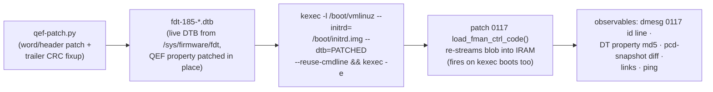

# decomp/experiments.md — Silicon Oracle Experiment Log

The mutation-oracle log: each experiment's patch, delivery, observables,
result, and conclusion. Newest at the bottom (append-only). Board: **.185
only** (dev board). Recovery: any plain reboot returns to eMMC boot with the
pristine SPI blob (kexec delivery is one-shot); worst case = smart-plug
power cycle (`restart-dut` skill).

## Delivery pipeline (proven E1, 2026-08-08)



- **No SPI flash writes, no U-Boot env edits, no serial needed.** The board's
  normal bootcmd (`run vyos`) keeps pulling the pristine blob from SPI; only
  the kexec'd kernel sees the patched DTB.
- Gotcha: `/tmp` is tmpfs — files die on every kexec. Upload DTBs fresh each
  round; keep baselines under `/home/vyos/` (persistent).
- vbash: only real binaries via full path (`sudo -n /sbin/kexec`,
  `sudo -n /usr/local/bin/pcd-snapshot`); no `which`/`strings`.
- kexec round-trip on .185: ~90–120 s back to SSH.
- Kernel `6.18.41-vyos`, image `2026.08.07-2326-rolling`, U-Boot
  2025.04 (`fman_ucode=fbc11d00` env exists but unused by this path).

---

## E1 — cosmetic id-string patch (delivery validation) — PASS

- **Patch**: id `"…for LS1043 r1.0"` → `"…for LS1046 r1.0"` (keeps the
  `"Microcode version 210.10.1"` prefix — patch `0086a` caps probe parses
  only the prefix + major number ≥ 210, verified in source, so caps stay
  0x17). 5 bytes differ (1 id byte + 4 trailer).
- **Result**: dmesg `FM_CTL microcode 210.10.1 loaded (12851 words):
  Microcode version 210.10.1 for LS1046 r1.0`; live DT property md5
  `5ae2f890377bafcafcefadd9d681a85f` = precomputed E1 blob md5. Links up,
  ping 3/3.
- **Conclusion**: patched-blob delivery is byte-exact end-to-end
  (DTB edit → kexec → IRAM stream). The oracle speaks.

## E2 — cold-region word patch (negative control) — PASS

- **Patch**: code word **w9055** `0x02010000 → 0xffffffff` (ENQ FE
  materialization site, 210-only island 2 — hypothesized cold on the
  mainline/RSS path). 8 bytes differ (4 code + 4 trailer).
- **Result**: blob md5 `9539639e80367fcbdc2eb37edc7686a4` live; id string
  back to LS1043 (E2 built from base DTB); links up; ping 3/3;
  **pcd-snapshot diff vs E1-state baseline: fully clean** ("PCD state
  matches baseline").
- **Conclusion**: island 2 is cold on the mainline path — confirmed on
  silicon. Code-word mutation with CRC fixup is behaviorally safe in cold
  regions. The oracle can now mutate semantics, not just metadata.

## Queue

- **E3 — hot-path relative-branch patch (the actual Phase-4 gate)**: patch a
  `b3ff`-class relative branch in a shared, always-executed region (early
  zone w48–w700) so its target shifts by a small delta; observe via
  pcd-snapshot scheme counters + ping. PASS = relative-branch model
  confirmed on silicon (branch takes effect where predicted). FAIL =
  model wrong → re-derive before any CFG trust. Candidate selection needs
  care: pick a branch whose mis-direction is recoverable-but-visible
  (prefer parser/KG-adjacent over BMI FIFO management).
- **E4 — `0xb7df` park probe**: patch a park stub in a cold island into a
  branch-to-next-word; cold = no change. Confirms park semantics.

---

## E-HM1 — confirm the EXT_HASH HIT/MISS compare on silicon (READY, not yet run)

**Framing correction (2026-08-08, from qdrant)**: flow-HIT is *not* a
never-solved mystery. HIT was **proven working 2026-07-19** (ASK2 M3 + M5
HIT gates on .185, ISO 1732/2004): a matching flow makes FMan consume the
frame (tcpdump sees 0 packets). The original MISS root cause was **F-053** —
the DDR record has an 8-byte link header before the key, so the silicon must
compare starting at record **+8**, not +0. **The decomp corroborates this
independently**: the `ehash_walker`'s `?op_e1 0x0008` immediate is exactly
that key offset (and `0x000c` = keysize 12). Subsequent MISSes (F-141,
F-163, task #26) are regressions/config drift, not a fundamental failure.

So E-HM1's value now: use the **known-HIT config as a silicon oracle** to
*confirm which microcode instruction* does the compare / key-offset / DMA —
turning the G3+ black-box pcodeops into verified semantics and reading, not
inferring, exactly which bytes silicon compares.

**Engage sequence (from the M3 HIT gate, .185):**
```
# build the FE-VM chain via /sys/kernel/debug/fman_pcd/0/
echo get                  > fe_pool
# (fe_singletons build)   > fe_singletons
echo "set 0x7FFF 13 0"    > fe_ehash          # mask=0x7fff keysize=13 shift=0
# (fe_hashfe build)       > fe_hashfe
echo "build 0x200"        > fe_enq            # ENQ FQID 0x200
echo "build 0x4af00"      > fe_enter          # EXT_HASH FE offset
echo "engage 10 53f00 2B9 1C0006" > fe_arm    # port 0x10=eth3, FE_ENTER_AD, miss_fqid, EKFC
#   OR the production API:  echo "engage 0x10" > /sys/kernel/debug/ask/offload
echo "add 0 0A63016A0A6301B90614511451 4b000" > fe_flow  # 13B key, ENQ off
# observe: matching TCP (10.99.1.106:5201 -> .185:5201) -> tcpdump 0 pkts = HIT
```

**The experiment**: with a HIT confirmed, patch one candidate `ehash_walker`
instruction (via `qef-patch` -> DTB -> kexec) and re-test:
- patch the `?op_e1 0x0008` (key-offset) -> if HIT breaks, that op **is** the
  record+8 key access (confirms F-053 at the microcode level).
- patch the `fman_test_dc` (0xdc) compare -> HIT breaks -> confirms the
  comparator.
- NOP the `0xf4` fetch -> walk breaks -> confirms the DDR DMA-read.
Each patch has a directly observable HIT/MISS outcome.

**Prerequisite / risk**: engage has a **teardown-wedge risk** (T-M6-5:
`fe_pool put`/disengage HARD-WEDGED .185, watchdog-recovered ~2–3 min). Run
on .185 with `restart-dut` (smart-plug) recovery ready; kexec the patched
blob per E1/E2. Awaiting greenlight for the live engage + kexec run — this
touches the ASK datapath, so it's staged, not auto-run.

### E-HM1 RESULT — RAN 2026-08-08 (safe engage variant, no patch/kexec)

Engaged the FE-VM ehash path on eth4 (port 0x11), drove the matching flow
from .106 (10.99.2.106:44444 → 10.99.2.185:55555), read the probes, recovered
by clean reboot (no wedge). Traffic peer: `vyos@192.168.1.106`.

**Decomp findings VERIFIED on silicon:**
- EXT_HASH descriptor `w0=0x06000000 w1=0x0fff0c00` → type=EXT_HASH,
  mask=0x0fff, **contextSize=13** (F-063 active), hashShift=0, `w5/w6` =
  MUX/EXIT — matches `naming-map.md` §5 exactly.
- Flow inserted into **bucket 0x008** = `(sw_crc 0x600824e7… >> 48) & 0x0fff`
  — confirms the decomp's `bucket = (hash>>48)&mask` and the `e9&0xffff` mask
  (from option-b static analysis).

**Root cause of the current MISS (task #26) — "Candidate 2" confirmed:**
- `hash_probe` captured HW hash **0x50b43c9cff453b9f** → bucket **0x0b4**.
- SW CRC-64 = **0x600824e70ae4d573** → bucket **0x008** (where the flow sits).
- **HW ≠ SW → frame lands in bucket 0x0b4, flow is in 0x008 → MISS**
  (`fe_ehash_stats pkt_count=0`). The silicon KG hash is **not** the software
  CRC-64 on this build, so every flow MISSes. This is the 2026-07-10
  Candidate-2 hypothesis (KG-hash vs software-CRC64), now measured directly.

**Note**: the decomp's *bucket-index math* is correct (both compute
`(hash>>48)&mask`); the divergence is in the **hash value** — a KeyGen scheme
`kgse_hc` / extraction config question (why the KG doesn't produce CRC-64 for
the ehash path), not a microcode-decode error. The patch-break sub-experiments
(force `test_dc`, patch `e1 0x0008`) were not needed — there is no HIT baseline
to break; the hash divergence is the answer. Next: read the engaged KG
scheme's `kgse_hc`/EKFC vs the CRC-64 expectation to see why the hash diverges.
