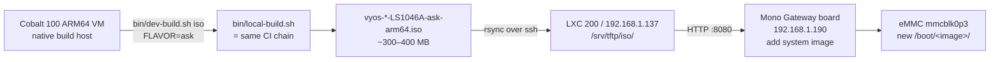

# Build a FLAVOR=ask ISO and install it on the live board

End-to-end recipe to (1) build a `FLAVOR=ask` ISO on this Cobalt 100 ARM64 VM,
(2) publish it to the LXC 200 HTTP relay, and (3) install it on the running
LS1046A board via `add system image <url>`.

> Status: HTTP relay on LXC 200 is now a proper systemd service
> (`tftp-http.service` rooted at `/srv/tftp/`, listening on `:8080`). It
> survives reboots and replaces the ad-hoc `python3 -m http.server` that was
> running interactively.

## TL;DR

```bash
# On this Cobalt 100 VM (cwd = /home/vyos/vyos-ls1046a-build, on ask20 branch):
FLAVOR=ask bin/dev-build.sh iso

# Then on the running board (vyos@192.168.1.190):
add system image http://192.168.1.137:8080/iso/latest-ask.iso
# or pin to a specific build:
add system image http://192.168.1.137:8080/iso/vyos-<version>-LS1046A-ask-arm64.iso

# After install completes:
set system image default-image vyos-<version>-LS1046A-ask-arm64
reboot
```

## Architecture



Two artefact paths coexist on `/srv/tftp/`:

| Path on LXC 200 | Purpose | Consumer |
|---|---|---|
| `/srv/tftp/vmlinuz`, `initrd.img`, `mono-gw.dtb`, `filesystem.squashfs` | TFTP / live-boot dev loop | Board's U-Boot `dev_boot` / `dev_boot_live` (kernel hot-iteration) |
| `/srv/tftp/iso/<name>.iso` | Full image install | `add system image http://…` from inside running VyOS |

The HTTP server is rooted at `/srv/tftp/`, so the same daemon serves both.

## One-time setup

These have already been done; documented here for reproducibility.

### LXC 200 HTTP service

`/etc/systemd/system/tftp-http.service` on `lxc200` (= 192.168.1.137):

```ini
[Unit]
Description=Static HTTP server for VyOS LS1046A dev-loop (squashfs + ISO downloads)
Documentation=https://github.com/mihakralj/vyos-ls1046a-build
After=network-online.target
Wants=network-online.target

[Service]
Type=exec
WorkingDirectory=/srv/tftp
ExecStart=/usr/bin/python3 -m http.server 8080 --bind 0.0.0.0 --directory /srv/tftp
Restart=on-failure
RestartSec=5
ProtectSystem=strict
ReadOnlyPaths=/srv/tftp
PrivateTmp=yes
NoNewPrivileges=yes

[Install]
WantedBy=multi-user.target
```

Enabled and active. Verify with:

```bash
ssh lxc200 'sudo systemctl is-active tftp-http && curl -sI http://localhost:8080/iso/ | head -1'
```

### `/srv/tftp/iso/` directory

```bash
ssh lxc200 'sudo install -d -m 0755 -o admin -g admin /srv/tftp/iso'
```

## The build command — `bin/dev-build.sh iso`

The `iso` subcommand of `bin/dev-build.sh` wraps the full CI chain
(`bin/local-build.sh`) with the FLAVOR pinning and the LXC-200 publish step.

```bash
FLAVOR=ask bin/dev-build.sh iso
```

What it does, in order:

1. **Re-invokes under `sudo`** if not already root (`local-build.sh` installs
   apt build-deps).
2. **Verifies LXC 200 is reachable** over SSH with the dev key.
3. **Cleans stale ISOs** at the repo root so the post-build `ls` picks up
   exactly one new artefact.
4. **Runs `bin/local-build.sh`** with `FLAVOR=$FLAVOR` exported. This runs the
   same ~15 step chain as `auto-build.yml` on CI:
   - `ci-set-version.sh` (reads `version-${FLAVOR}.json` for the next build
     number)
   - clone `vyos-build`
   - `ci-setup-vyos1x.sh` (patches vyos-1x)
   - `ci-setup-kernel.sh` (kernel config + patches + Mono DTB)
   - `ci-compile-mono-dtb.sh`
   - `ci-setup-vyos-build.sh` (rewrites `update-check` URLs to
     `version-ask.json`; for `FLAVOR=ask` the ASK2 userspace stack is skipped
     until the spec components land — board still gets vanilla VyOS)
   - `ci-build-packages.sh` (kernel + vyos-1x)
   - `ci-pick-packages.sh`
   - `ci-install-extra-packages.sh`
   - `ci-build-iso.sh` (live-build + isohybrid)
5. **rsyncs the resulting ISO** (`vyos-<v>-LS1046A-ask-arm64.iso` + its
   `.minisig` if produced) to `admin@192.168.1.137:/srv/tftp/iso/<name>.iso`.
6. **Refreshes the stable alias symlink** `/srv/tftp/iso/latest-ask.iso → <name>.iso`
   so dev workflows can hit a stable URL without knowing the exact version.
7. **Prints the exact `add system image` command** to copy-paste into the
   board's CLI.

Build wall time on the Cobalt 100:

| Cache state | Wall time |
|---|---|
| Cold (first run; clones vyos-build, builds vyos-1x, builds kernel from scratch) | ~40 min |
| Warm (vyos-1x .deb cache hit, kernel ccache hit) | ~7 min |

The kernel ccache and vyos-1x .deb cache live under `/tmp/vyos-1x-cache/` and
the user's `~/.ccache/` respectively. Both survive reboots on this VM.

## Installing on the board

Once the ISO is on `/srv/tftp/iso/`, on the board:

```bash
# From the running VyOS operational shell on 192.168.1.190
add system image http://192.168.1.137:8080/iso/latest-ask.iso

# VyOS will:
#   1. curl the ISO to /tmp
#   2. loop-mount the ISO9660 (PVD at byte 32768 is the same as for USB install)
#   3. copy /live/filesystem.squashfs to /boot/<new-image>/<new-image>.squashfs
#   4. copy vmlinuz, initrd.img, /mono-gw.dtb to /boot/<new-image>/
#   5. write /boot/grub/grub.cfg (which the U-Boot path ignores) and
#      /boot/vyos.env (which U-Boot DOES read — points at new image name)
#   6. ask whether to set the new image as default

# Confirm install:
show system image

# Optional: explicitly pick it (the install prompt already does this if
# you answered "yes"):
set system image default-image vyos-<version>-LS1046A-ask-arm64

# Reboot to land on the new image:
reboot
```

## Verifying the new image actually has ASK2 bits

After reboot, run:

```bash
sudo /usr/local/bin/ask-check    # if installed in the ISO
# or, if ask-check is not in the ISO yet (current state on ask20):
scp /home/vyos/vyos-ls1046a-build/board/scripts/ask-check vyos@192.168.1.190:/tmp/ask-check
ssh vyos sudo /tmp/ask-check
```

What you should see change vs. the default-flavor image:

| Probe | default flavor (today) | ask flavor (after `FLAVOR=ask` build) |
|---|---|---|
| `caam_qi_ext_consumer_register` in kallsyms | absent | **present** (patch 0001) |
| `ethtool -k eth0 \| grep hw-tc-offload` | `off [fixed]` | **`on [fixed]`** (patch 0002) |
| `fmd_host_cmd` in kallsyms | absent | **present** (patch 0003) |
| `/sys/kernel/debug/fman_pcd/muram_budget` | absent | **present** (patch 0004) |
| `fman_pcd_kg_scheme_create` etc. in kallsyms | absent | **present** (PRs 14b–14f bodies, 0005–0023) |
| `/sys/module/ask`, `genl_family 'ask'` | absent | **TBD** — `ask.ko` is not yet authored on `ask20` (M3 work) |
| `askd.service`, `ask-cli`, `set system ask` CLI | absent | **TBD** — userspace M5 still pending |

So a `FLAVOR=ask` ISO built off `ask20` today should flip the four in-tree
kernel patches + PCD subsystem from FAIL to OK in `ask-check`. The OOT
module and userspace TODOs will remain TODO until those PRs land.

## Troubleshooting

### Build fails at `Install host base deps` (no sudo)

`bin/dev-build.sh iso` re-invokes itself under `sudo` automatically. If you
ran it manually as root and got a permission error elsewhere, your user
isn't in `sudoers` with `NOPASSWD` for the apt steps — fix that first.

### `add system image` returns "Could not connect to ..."

Verify from the board:

```bash
curl -sI http://192.168.1.137:8080/iso/ | head -1   # expect: HTTP/1.0 200 OK
```

If that fails, on `lxc200`:

```bash
sudo systemctl status tftp-http      # should be active (running)
sudo ss -tlnp | grep :8080
```

If the unit is dead, `sudo systemctl restart tftp-http` and inspect
`journalctl -u tftp-http -n 50`.

### `add system image` succeeds but board boots into old image

`/boot/vyos.env` is what U-Boot reads (not `/boot/grub/grub.cfg`). The
VyOS installer writes `vyos.env` via patch `vyos-1x-011-vyos-env-boot.patch`.
If you suspect it didn't, on the board:

```bash
cat /boot/vyos.env                                    # vyos_image=<image>
ls /boot/                                             # one dir per image
sudo /usr/local/bin/vyos-postinstall                  # rewrites vyos.env
sudo reboot
```

### "No ISO matching vyos-\*-LS1046A-ask-arm64.iso"

Means `local-build.sh` did not produce an ISO. The ISO step is the very
last in `local-build.sh`; if a prior step failed, scroll up. Common culprits:

- `ci-build-packages.sh` fails because vyos-1x patches don't apply cleanly
  → run `bin/ci-setup-vyos1x.sh` standalone to see the patch error.
- `ci-build-iso.sh` fails in live-build because a chroot hook errored
  → check `vyos-build/build/build.log` or the most recent `*.log` under
  `vyos-build/build/`.

### `latest-ask.iso` symlink points to an old ISO

The publish step calls `ln -sfn '$iso_name' /srv/tftp/iso/latest-ask.iso`.
If you renamed or deleted the target ISO manually, the symlink dangles.
Either remove it or re-run `FLAVOR=ask bin/dev-build.sh iso`.

## Cleanup / garbage collection

`/srv/tftp/iso/` accumulates one ISO per build (~300 MB each). To garbage-
collect old builds, keeping only the 3 newest per flavor:

```bash
ssh lxc200 'cd /srv/tftp/iso && ls -1t vyos-*-LS1046A-ask-arm64.iso 2>/dev/null | tail -n +4 | xargs -r sudo rm -v'
ssh lxc200 'cd /srv/tftp/iso && ls -1t vyos-*-LS1046A-default-arm64.iso 2>/dev/null | tail -n +4 | xargs -r sudo rm -v'
ssh lxc200 'cd /srv/tftp/iso && ls -1t vyos-*-LS1046A-vpp-arm64.iso 2>/dev/null | tail -n +4 | xargs -r sudo rm -v'
```

Or just nuke everything and rebuild:

```bash
ssh lxc200 'sudo rm -f /srv/tftp/iso/*.iso /srv/tftp/iso/*.minisig /srv/tftp/iso/latest-*.iso'
```

The `tftp-http.service` keeps serving the empty directory; the next
`FLAVOR=ask bin/dev-build.sh iso` will repopulate it.