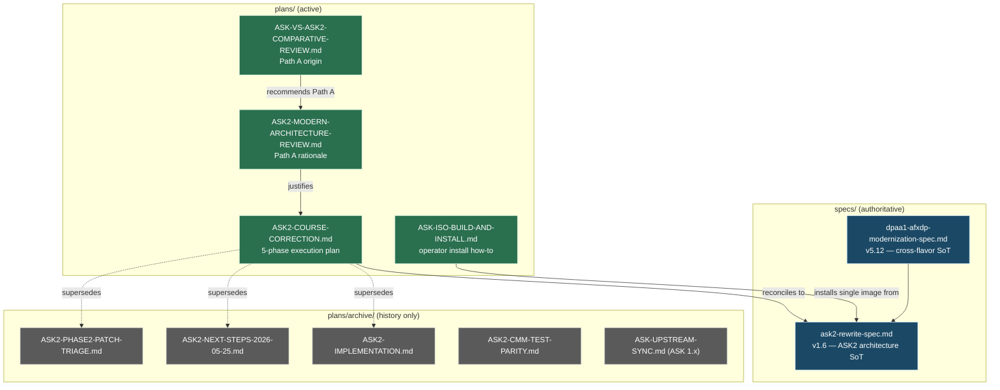

# ASK / ASK2 Documentation Hub
**Version 1.0.0** · Authoritative index · 2026-06-09 · HADS 1.0.0

---

## AI READING INSTRUCTION

This is the **single entry point** for all ASK and ASK2 planning documents.
Read `[SPEC]` and `[BUG]` blocks for authoritative facts.
Read `[NOTE]` only if additional context is needed.
`[?]` blocks are unverified — treat with lower confidence.

Do **not** consult the individual ASK plan files in isolation — start here, then
follow the canonical reading order in §5. The architectural source-of-truth is the
spec (§1), never a plan document.

---

## 1. OVERVIEW

The ASK fast-path effort spans two generations:

- **ASK 1.x** — the vendored NXP SDK FMan/QMan/BMan offload stack (`cdx.ko`,
  `auto_bridge.ko`, `cmm`, `dpa_app`, `libfci`). **Deleted** on the `ask20`
  branch. Only one ASK 1.x plan survives, archived for historical reference.
- **ASK2** — the clean-room mainline-Linux rewrite (in-tree FMan PCD subsystem +
  a small `ask.ko` OOT module + YNL-only userspace). This is the live effort.

All ASK2 planning lives under `plans/`. The architecture is fixed by the spec;
the plans only track *execution* and *history*. Active plans stay in `plans/`;
superseded / dated-snapshot plans live in `plans/archive/` (indexed by
`plans/archive/README.md`).

`[NOTE]` This hub consolidates the previously-scattered ASK plans (4 active in
`plans/`, interleaved with 12 unrelated docs; 5 archived in `plans/archive/`)
into one navigable index. It does **not** merge the documents — they serve
distinct, deliberately-layered concerns (operational how-to vs. architecture
review vs. execution plan), and merging them would violate the spec/implementation
layering invariant recorded in `AGENTS.md`.

---

## 2. SOURCE-OF-TRUTH HIERARCHY

`[SPEC]` Consult these in **descending order of authority**. A plan document never
overrides a spec.

| Rank | Document | Version / Date | Role |
|---|---|---|---|
| 1 | `specs/dpaa1-afxdp-modernization-spec.md` | v5.12 · 2026-05-31 | **Cross-flavor authoritative source-of-truth.** One DPAA1 driver core + `pcd_ops`/`qmgmt_ops`; FMan PCD subsystem is built-in for `default`/`vpp`/`ask`. |
| 2 | `specs/ask2-rewrite-spec.md` | Draft v1.6 · 2026-05-31 | **ASK2 architectural source-of-truth.** Path A + `FORWARD_FQ_WITH_MANIP` + YNL-only userspace. |
| 3 | `specs/vpp-dpaa1-ls1046a-spec.md` | — | VPP-flavor (AF_XDP) design spec (cross-reference for the shared backplane). |
| 4 | Active ASK plans (§3) | see table | Execution tracking + reviews. **Not** architectural authority. |
| 5 | Archived ASK plans (§4) | see table | History / bisect anchors only. Do not consult for current architecture. |

---

## 3. ACTIVE ASK PLANS (`plans/`)

`[SPEC]` These four documents are current. Three are the **Path A lineage**
(comparative review → architecture review → execution plan); the fourth is the
standalone operator install guide.

| File | Version / Date | Status | Purpose |
|---|---|---|---|
| [`ASK2-COURSE-CORRECTION.md`](ASK2-COURSE-CORRECTION.md) | 2026-05-24 · branch `ask20` | **Active execution plan** | The 5-phase plan that drove the spec v1.2 → v1.3 reduction (delete graft + OH-port + userspace daemon). Phases 1–3 complete; Phase 4 hardware bring-up carries the live M2 status (see §6). |
| [`ASK2-MODERN-ARCHITECTURE-REVIEW.md`](../specs/ask2-modern-architecture-review.md) | v1.3-proposal · 2026-06-09 | Driver/review (active) | The architecture review that *justified* the course-correction: collapse ASK2 to one OOT module + one in-tree PCD subsystem + one pre-`register_netdev()` hook, operator UX via `nft`/`ip xfrm`/`ynl`/`node_exporter`. |
| [`ASK-VS-ASK2-COMPARATIVE-REVIEW.md`](../specs/ask-vs-ask2-comparative-review.md) | v1.0.0 (authoritative) · 2026-06-09 | Reference (active) | Deep comparison of the original NXP ASK 1.x stack vs ASK2: module-by-module functional mapping, data-flow diagrams, 210-microcode interaction, perf prediction, completeness audit. **Origin of the Path A recommendation.** |
| [`ASK-ISO-BUILD-AND-INSTALL.md`](ASK-ISO-BUILD-AND-INSTALL.md) | v1.0.0 · 2026-06-09 | Operational (active) | Standalone how-to: build the single LS1046A image in CI, deploy the ISO to the lxc200 relay, run `add system image <url>` on the live board, and enable the offload with `set system offload ask`. Independent of the architecture docs above. |

---

## 4. ARCHIVED ASK PLANS (`plans/archive/`)

`[NOTE]` Kept for bisect/audit and to keep older Qdrant memory entries' file paths
valid. **Do not consult for current architecture.** Full index with rationale:
[`plans/archive/README.md`](archive/README.md).

| File | Topic | Why archived |
|---|---|---|
| [`archive/ASK2-IMPLEMENTATION.md`](archive/ASK2-IMPLEMENTATION.md) | ASK2 per-PR implementation tracker (target spec v1.1) | Superseded by the `specs/dpaa1-afxdp-modernization-spec.md` cross-flavor milestone table; ASK2 spec is now v1.6. |
| [`archive/ASK2-NEXT-STEPS-2026-05-25.md`](archive/ASK2-NEXT-STEPS-2026-05-25.md) | Dated forensic roadmap (KG scheme priority-race) toward ASK2 GA | Snapshot only; references spec v1.3 (now v1.6) and the pre-cross-flavor architecture. |
| [`archive/ASK2-PHASE2-PATCH-TRIAGE.md`](archive/ASK2-PHASE2-PATCH-TRIAGE.md) | KEEP/ARCHIVE/PARTIAL classification of `kernel/flavors/ask/patches/0001-0053` | The ASK 1.x patch tree it classifies was deleted on `ask20`; FMan PCD now lives in the common board stack. |
| [`archive/ASK2-CMM-TEST-PARITY.md`](archive/ASK2-CMM-TEST-PARITY.md) | Parity matrix mapping the 38 legacy `cmm/unit_tests` shell tests to ASK2 | The `cmm`/`we-are-mono/ASK` corpus was deleted; ASK2 offload has no CLI harness. |
| [`archive/ASK-UPSTREAM-SYNC.md`](archive/ASK-UPSTREAM-SYNC.md) | Legacy ASK 1.x SDK upstream-sync workflow (vs `we-are-mono/ASK@mt-6.12.y`) | ASK 1.x fork deleted; project pivoted to patching mainline 6.18 directly. See [`archive/ASK-UPSTREAM-SYNC.md.archive-note.md`](archive/ASK-UPSTREAM-SYNC.md.archive-note.md). |

`[NOTE]` Numerous `PR14*-DESIGN.md` documents in `plans/archive/` are ASK2
sub-PR design notes (graft-model and OH-port eras). They are indexed in
`plans/archive/README.md` and intentionally excluded from this table — they are
per-PR design artifacts, not standalone ASK plans.

---

## 5. CANONICAL READING ORDER

`[SPEC]` Pick the entry point that matches your task.

**New contributor (understand ASK2 from scratch):**
1. `specs/dpaa1-afxdp-modernization-spec.md` — the shared DPAA1 backplane.
2. `specs/ask2-rewrite-spec.md` — ASK2 architecture (v1.6).
3. `specs/ask-vs-ask2-comparative-review.md` — why ASK2 looks the way it does.
4. `specs/ask2-modern-architecture-review.md` — the Path A rationale.
5. `plans/ASK2-COURSE-CORRECTION.md` — what was cut and why.

**Resuming ASK2 implementation work (next-session entry point):**
1. `qdrant-find ask2 v1.3 course-correction 5-phase plan` (loads the live plan memo).
2. `plans/ASK2-COURSE-CORRECTION.md` §2 — find the first unchecked `[ ]`.
3. Current blocker is the Phase-4 M2 CPU gate (§6 below).

**Operator installing the single image and enabling ASK on the board:**
1. `plans/ASK-ISO-BUILD-AND-INSTALL.md` — start to finish. (No architecture
   reading required.)

**Historical/forensic investigation:**
1. `plans/archive/README.md` — full archived index with rationale.

---

## 6. CURRENT ASK2 STATUS SNAPSHOT

`[SPEC]` As of spec v1.8 (2026-06-14), ASK2 is **scaffold-only** at the source
level and ships **dormant in the single image**: `set system offload ask` is a
no-op until the v1.6 components land (`ask.ko` ~1500 LOC in-tree at
`drivers/net/ethernet/freescale/dpaa/ask/`, plus the FMan PCD subsystem now
built-in via the common board patches).

`[BUG]` **Live Phase-4 blocker — M2 acceptance gate: throughput PASS / CPU FAIL.**
On the mono board (kernel `6.18.31-vyos`), Path A activation is verified
(`claimed=5 declined=0 failed=0`), throughput reaches **6.955 Gbps** (PASS, gate
≥ 2 Gbps) but kernel-net CPU is **~21–30 %** (FAIL, gate ≤ 5 %). Root cause:
`327× fman_pcd_manip_chain_create(3 manips) failed: -12` (`-ENOMEM`) — every
per-flow L2-rewrite chain insert fails, so the rewrite never enters silicon and
the CPU still does it. Two candidate fixes are in flight: (a) the
`0065-fman-pcd-graft-kernel-scheme.patch` KG-scheme priority-race fix, and
(b) MURAM `gen_pool` instrumentation to find why `chain_create` cannot allocate
< 1 KiB. Full diagnosis: `plans/ASK2-COURSE-CORRECTION.md` §2 Phase 4 and the
archived `plans/archive/ASK2-NEXT-STEPS-2026-05-25.md` §0.1 (H6 verdict).

---

## 7. DOCUMENT RELATIONSHIP MAP

---

## 8. MAINTENANCE RULES

`[SPEC]` Keep this hub coherent:

- When an active ASK plan is **archived**, move its row from §3 to §4, add the
  rationale, and update `plans/archive/README.md` in the same change.
- When a new ASK plan is **authored**, add it to §3 and to the §7 Mermaid graph.
- This hub indexes plans; it does **not** carry architecture. Architectural facts
  belong in the spec (§1), per the `AGENTS.md` spec/implementation layering rule.
- Spec version references in §2/§6 must be refreshed whenever
  `specs/ask2-rewrite-spec.md` or `specs/dpaa1-afxdp-modernization-spec.md` bumps.