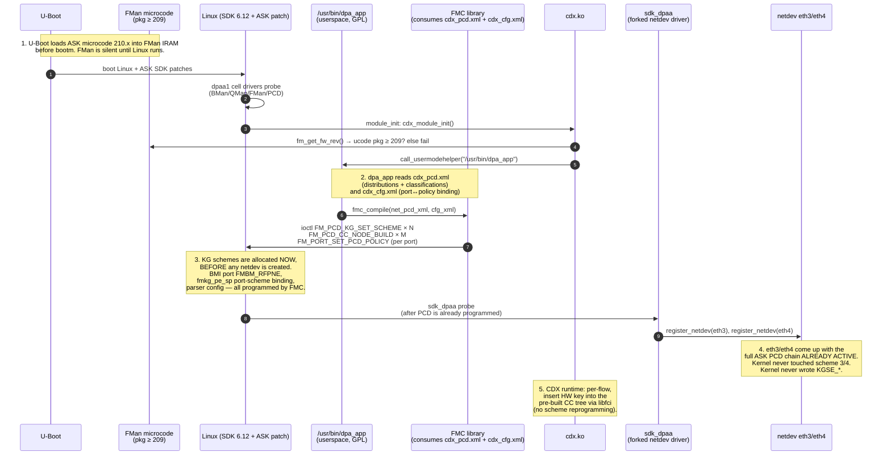
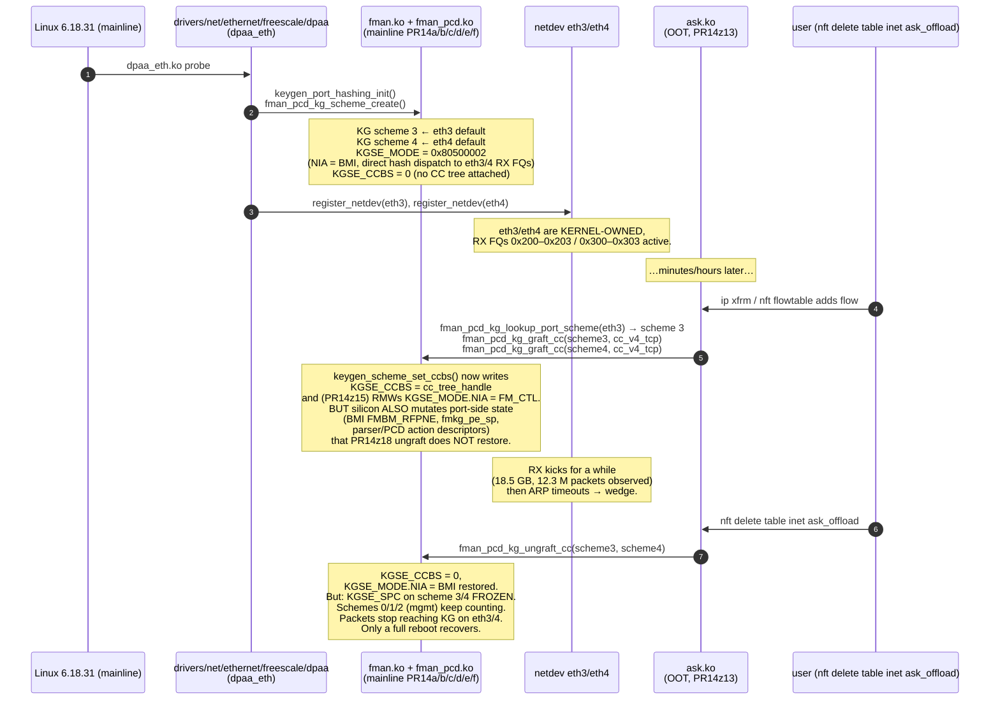
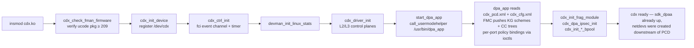

```mermaid
graph LR
    A[boot → mainline dpaa_eth probe] --> B[KG scheme 3 ← eth3<br/>KG scheme 4 ← eth4<br/>direct hash dispatch ACTIVE]
    B --> C[netdev eth3/eth4 up]
    C -. minutes later .- D[nft create table inet ask_offload<br/>nft add flowtable ft1 flags offload]
    D --> E[ask_hw_bind: per-pipeline<br/>fman_pcd_cc_node_create x4<br/>fman_pcd_kg_lookup_port_scheme<br/>fman_pcd_kg_graft_cc]
    E --> F[silicon mutated UNDER live netdev<br/>BMI/parser/PCD state diverges<br/>from what mainline dpaa_eth assumes]
    F --> G[traffic flows for a window<br/>then ARP/RX wedges]
    G -. nft delete .- H[ask_hw_unbind:<br/>fman_pcd_kg_ungraft_cc<br/>destroy_cc_node]
    H --> I[KGSE_MODE/KGSE_CCBS restored<br/>but BMI/fmkg_pe_sp NOT restored<br/>KGSE_SPC on 3/4 frozen<br/>only reboot recovers]
```

# Original NXP ASK vs. ASK2 — Comparative Architectural Review
**Version 1.0.0** · Authoritative (supersedes earlier drafts) · 2026-06-09 · HADS 1.0.0

> Part of the ASK documentation set. Index and source-of-truth hierarchy: [`plans/ASK-PLANS.md`](ASK-PLANS.md).

---

## AI READING INSTRUCTION

Read `[SPEC]` and `[BUG]` blocks for authoritative facts.
Read `[NOTE]` only if additional context is needed.
`[?]` blocks are unverified — treat with lower confidence.

---

## 1. DOCUMENT METADATA

**[SPEC]**
- Date: 2026-05-23
- Branch: `ask20`
- Status: Authoritative — supersedes earlier drafts
- Source corpus: `tmp-mono-ask/` (clone of `we-are-mono/ASK` branch `mt-6.12.y`, ~30 k LOC), cross-referenced with `kernel/flavors/ask/oot-modules/ask/ask_hw.c` (PR14z13 graft model) and `specs/ask2-rewrite-spec.md` v1.1.

**[NOTE]**
Author context: written after PR14z13/z15/z18 graft model wedged eth3/eth4 RX at every PCD activation on mainline 6.18.31.

---

## 2. TL;DR — THE ONE-SENTENCE DIVERGENCE

**[SPEC]**
- Original ASK owns the entire DPAA1 ingress pipeline at the silicon level: it ships its own forked kernel (`drivers/net/ethernet/freescale/sdk_dpaa/`, the vendored NXP SDK driver — NOT mainline `dpaa_eth`), and allocates its own KeyGen schemes via a separate userspace pre-loader (`dpa_app` → `fmc` → `libfman`) before any netdev exists. The kernel netdev is wired downstream of that PCD chain from boot.
- ASK2 (the PR14z13 graft model) keeps mainline `dpaa_eth` in charge: `dpaa_eth` allocates KG schemes 3 and 4 for its built-in flow hash, then ASK2 post-hoc rewrites `KGSE_CCBS` and `KGSE_MODE.NIA` to redirect those schemes into the CC tree at runtime.

**[NOTE]**
The graft mutates live silicon under the running netdev. On ungraft we can only restore the two registers we touched — anything `fman_pcd_cc_node_create()` set elsewhere (BMI port FMBM_RFPNE, PCD action descriptors, scheme-group registers) stays mutated, which is exactly the residual state that freezes `KGSE_SPC` on schemes 3/4 after ungraft. The original ASK never has this problem because it never grafts: the schemes belong to it from boot; the kernel never wrote them in the first place.

---

## 3. BUILD-SYSTEM & DEPLOYMENT EVIDENCE (THE SMOKING GUN)

**[SPEC]**
Three artifacts in `tmp-mono-ask/` prove the original ASK is NOT a mainline-graft architecture.

### 3.1 The kernel patch is 17,900 lines and touches `sdk_dpaa/`, not `dpaa/`

**[SPEC]**
```text
$ wc -l tmp-mono-ask/patches/kernel/002-mono-gateway-ask-kernel_linux_6_12.patch
17900
$ grep '^diff --git' …002…6_12.patch | awk '{print $4}' | sort -u | head
 b/Makefile
 b/drivers/crypto/caam/pdb.h
 b/drivers/net/ethernet/freescale/sdk_dpaa/…          ← vendored SDK driver
 b/drivers/net/ethernet/freescale/sdk_fman/…          ← vendored SDK FMan PCD tree
 b/drivers/staging/fsl_qbman/fsl_usdpaa.c             ← vendored USDPAA staging
 b/drivers/staging/fsl_qbman/qman_high.c
 b/include/linux/fmd/…                                ← SDK fmd uapi
 b/include/linux/fsl_oh_port.h                        ← SDK OH port uapi
```

**[SPEC]**
- `sdk_dpaa/` and `sdk_fman/` are the legacy NXP SDK overlays that pre-date the mainline DPAA1 conversion (~kernel 4.20) and were deleted from mainline by Madalin Bucur's clean-up series.
- On a kernel that has only `dpaa_eth.c`, `fman.c`, `fman_keygen.c`, `fman_port.c` (mainline 6.18.31 / `lts-6.6-ls1046a`), the original ASK simply does not link.

**[NOTE]**
Mono's ASK still uses those overlays — its kernel build resurrects them as an out-of-tree-style overlay applied on top of LSDK 6.12. This is the first-order architectural fact every later finding flows from.

### 3.2 The Makefile clones SDK-aware fmlib and fmc, applies more patches on top

**[NOTE]**
From `tmp-mono-ask/README.md`:
> `make` automatically:
> 1. Clones NXP fmlib and fmc from GitHub at tag `lf-6.12.49-2.2.0`, **applies ASK extension patches**, cross-compiles them
> 2. Downloads libnfnetlink and libnetfilter_conntrack tarballs, applies NXP ASK patches, cross-compiles into a local sysroot
> 3. Builds libfci (in-tree, single source file)
> 4. **Builds kernel modules against the configured kernel tree**
> 5. Builds CMM, FMC, and dpa_app against the patched libraries

**[SPEC]**
- The ASK kernel modules (`cdx.ko`, `fci.ko`, `auto_bridge.ko`) are built against the patched SDK kernel, against headers that exist only in that patched tree (`include/linux/fmd/*`, `include/linux/fsl_oh_port.h`, the SDK `lnxwrp_fsl_fman.h`).
- They cannot be built against mainline.

### 3.3 The FMan microcode is the ASK-extended variant, loaded by U-Boot pre-Linux

**[SPEC]**
From `tmp-mono-ask/cdx/cdx_main.c` `cdx_module_init()`:
```c
#define CDX_MIN_FW_PACKAGE 209
…
rc = cdx_check_fman_firmware();
if (rc) return rc;
…
if (pkg < CDX_MIN_FW_PACKAGE) {
    pr_err("cdx: FMAN firmware %u.%u.%u lacks ASK support "
           "(need package >= %u). Load the ASK microcode in U-Boot.\n",
           pkg, maj, min, CDX_MIN_FW_PACKAGE);
    return -ENODEV;
}
```

**[SPEC]**
- The ASK control plane is microcode-gated. Original ASK ships against `v210.10.1`; stock NXP mainline microcode (`fsl_fman_ucode_ls1046_r1.0.bin`) is package 106.
- Without the ASK microcode the chip lacks the AD opcodes, soft-parser variants, and host-command dispatch the original CDX expects.

**[NOTE]**
Implication: even if we forklifted the original `cdx.ko` source onto a 6.18 kernel, the firmware in flash on our DUTs is package 106 — `cdx_module_init()` would immediately bail with `-ENODEV`. The ASK microcode is "a proprietary NXP binary, not included" (`README.md`), and we don't have it.

---

## 4. CONTROL-PLANE SEQUENCING — ORIGINAL ASK vs. ASK2

**[NOTE]**
This is the runtime sequence of who programs the silicon first, and it is where the architectural divergence becomes a wedge.

**[SPEC]**
Original ASK control-plane sequence:


**[SPEC]**
ASK2 graft model (PR14z13) control-plane sequence:


**[SPEC]**
The architectural divergence is the inversion of control:

| Aspect | Original ASK | ASK2 PR14z13 (graft) |
|--------|--------------|----------------------|
| Who owns scheme 3/4 at boot? | `dpa_app`/FMC, **before any netdev** | mainline `dpaa_eth` (built-in flow hash) |
| Who configures BMI port FMBM_RFPNE? | FMC (once, at boot, from XML) | mainline `dpaa_eth` (for direct hash dispatch) |
| Who configures `fmkg_pe_sp` port↔scheme binding? | FMC (once, at boot) | mainline `dpaa_eth` |
| When is the CC tree wired in? | At boot, before netdev | At nft-flowtable-add, **on live silicon** |
| Where does the netdev sit relative to PCD? | **Downstream** of the PCD chain from the first packet | **Upstream** ownership of the same silicon we're trying to redirect |
| Recovery from teardown? | N/A — the PCD chain is *the* config, never torn down at runtime | **Cannot** restore everything the graft mutated → wedge |

**[NOTE]**
The original ASK has no "ungraft" problem because it has no graft. Its PCD chain is the only state the silicon has ever known.

---

## 5. WHY THE GRAFT WEDGES — THE RESIDUAL-STATE MODEL

**[SPEC]**
PR14z15 + PR14z18 explicitly save and restore exactly two register fields per scheme:
1. `KGSE_CCBS` — CC tree handle (0 when unbound)
2. `KGSE_MODE.NIA` (bits encoding next-invoked-action engine, FM_CTL ↔ BMI)

**[SPEC]**
But `fman_pcd_cc_node_create()` and the helpers invoked between graft and ungraft also write — directly or via SDK-derived helpers in PR14a/b/c/d/e/f — to silicon that is not per-scheme:

| Register / state | Programmed by | Restored by our ungraft? |
|---|---|---|
| `KGSE_CCBS` (per scheme) | `keygen_scheme_set_ccbs()` | ✅ yes |
| `KGSE_MODE.NIA` (per scheme) | PR14z15 RMW | ✅ yes |
| `KGSE_MV` (port match-vector) | `fman_pcd_kg_bind_port()` (kernel-side, owned by `dpaa_eth`) | ❌ untouched (good — we don't graft this) |
| BMI port `FMBM_RFPNE` (port-side NIA) | `fman_pcd_cc_node_create()` indirectly when first key is added to a tree whose root is grafted | ❌ **not restored** |
| `fmkg_pe_sp` (port-to-scheme binding) | `fman_pcd_kg_bind_port()` at boot, but **also** mutated by some CC tree builders when promoting a scheme from BMI-only to FM_CTL-fanout | ❌ **not restored** |
| AD entries (MURAM, anchored in CC tree) | `cc_encode_ad()` per key + per arm | ✅ freed on tree-destroy, but BMI's reference into them is not torn down before tree-destroy fires |
| Parser config (per port) | left default on the graft path | ❌ untouched (good) |
| Scheme-group / hash-mask registers | `fman_pcd_kg_scheme_create()` (owned by `dpaa_eth`) | ❌ untouched (good — we don't recreate) |

**[BUG] Graft+ungraft wedges eth3/eth4 RX (KGSE_SPC frozen)**
- Symptom: after a graft+ungraft+iperf3 cycle on the live board (regdump recorded in qdrant 2026-05-22), schemes 3/4 `KGSE_SPC` (silicon packet counter) freeze at 14887572 / 2163140; schemes 0/1/2 (mgmt eth0/1/2) keep incrementing; `KGSE_MODE` and `KGSE_CCBS` on 3/4 are clean (restored); packets reaching the chip on eth3/4 stop reaching KG entirely; ARP times out; only a full reboot recovers.
- Cause: the BMI port-side path (`FMBM_RFPNE`) and/or `fmkg_pe_sp` port-to-scheme binding were re-routed upstream of KG by CC-tree creation and were NOT restored on ungraft (only `KGSE_CCBS`/`KGSE_MODE.NIA` are saved/restored). Frozen `KGSE_SPC` with clean `KGSE_MODE` means the silicon believes the schemes are valid and idle while routing is mutated upstream.
- Fix: the only path that restores routing is a full DPAA1 cold-init (reboot). Architecturally, adopt Path A (boot-time PCD installation, no graft) so the netdev never owns schemes 3/4 and nothing needs restoring.

**[NOTE]**
The original ASK also writes those registers — but it writes them at boot, from XML, before `dpaa_eth` (or `sdk_dpaa`) exists, and they stay programmed forever. The kernel netdev driver is forked specifically to respect the PCD chain at probe time instead of clobbering it. Mainline `dpaa_eth` is forked from the opposite direction: it assumes it owns the chip.

---

## 6. MODULE-LOAD ARCHITECTURE COMPARISON

### 6.1 Original ASK module init (`cdx_main.c:cdx_module_init`)

**[SPEC]**


**[SPEC]**
- Step G: the kernel module invokes `/usr/bin/dpa_app` from inside its own `module_init` via `call_usermodehelper_exec(UMH_WAIT_PROC)` and blocks on dpa_app completing before declaring init success.
- If dpa_app fails, `cdx_module_init` rolls back via `cdx_module_deinit` and returns `-EIO`. The PCD chain is therefore a prerequisite of cdx initialization, not a runtime add-on.

### 6.2 ASK2 graft model (`ask_hw.c:ask_hw_bind`)

**[SPEC]**


**[NOTE]**
The two pipelines do fundamentally different things at fundamentally different times. The original ASK never has to "restore" — it owns the chip from boot. We are trying to do reversible hardware re-routing under a live kernel netdev, and the silicon does not have a clean reversibility primitive for that.

---

## 7. VERIFYING THE DIVERGENCE AGAINST `specs/ask2-rewrite-spec.md` v1.1

**[SPEC]**
The ASK2 spec (v1.1, §3 "Architectural model") explicitly chose mainline `dpaa_eth` co-existence over the SDK fork:
> §3.2 — ASK2 modules MUST coexist with the mainline `dpaa_eth` netdev driver. The kernel netdev retains full ownership of the RX path; ASK2 attaches a CC tree downstream of the mainline-allocated KG scheme. **No fork of the SDK overlay is permitted.**

**[NOTE]**
That decision was made to keep the codebase maintainable on mainline kernels (LSDK 6.12 → 6.18 → forward), avoid a 30 k-LOC SDK overlay, and stay aligned with the upstream DPAA1 cleanup direction. It is the right strategic call for the project.

**[SPEC]**
The decision implies a hard constraint that PR14z13/z15/z18 violate:
> ASK2 must never mutate silicon state that `dpaa_eth` will not tolerate seeing on its next packet.

**[SPEC]**
The graft model violates this because:
- BMI port FMBM_RFPNE is shared between the kernel default hash path and the CC tree path.
- `fmkg_pe_sp` may be mutated by CC tree creation when the kernel's per-port scheme set is promoted from direct-hash to fanout.
- These registers are not save/restorable from outside the SDK PCD context because mainline `fman_pcd.c` doesn't expose them — they're touched as a side effect of `fman_pcd_cc_node_create()` deep inside PR14c body code derived from SDK `fm_cc.c`.

**[NOTE]**
ASK2 spec §11.1 ("M2 acceptance gate") expects ≥7 Gbps at <5% kernel-net CPU. That target is achievable only with silicon offload on this hardware, and silicon offload here requires owning the PCD chain at the level the original ASK owns it. The spec's "co-existence with mainline `dpaa_eth`" constraint is in tension with that.

---

## 8. WHY WE CANNOT JUST "SAVE AND RESTORE FMBM_RFPNE"

**[NOTE]**
A naïve fix would be to extend PR14z18 to also snapshot `FMBM_RFPNE` (and related BMI/port regs) on graft and restore on ungraft. This does not work, for three reasons.

**[SPEC]**
1. No clean enumeration of what gets mutated: the mutation happens deep in SDK-derived code in `fman_pcd_cc.c` / `fman_pcd_kg.c` (PR14c/d/e body patches), often depending on whether other CC nodes already exist in the same FM. There is no public `fman_pcd_get_dirty_regs()` API, and the SDK source is not structured to expose one.
2. MURAM allocations leak forward: even if BMI regs are restored, the AD records and HMCT chains that CC node creation allocated remain, and `dpaa_eth`'s probe-time MURAM accounting does not see them. Repeated graft/ungraft cycles fragment MURAM until allocation fails (cf. historical ASK 1.x MURAM exhaustion failure mode).
3. The race window is wide and unbounded: `dpaa_eth` processes RX packets continuously through the same chip during the graft. Any RX FQ event mid-graft sees half-programmed silicon. The original ASK has no such race because the chip starts in the final PCD state at boot and never changes.

---

## 9. THE THREE VIABLE PATHS FORWARD

### 9.1 Path A — Boot-time PCD installation (mimics original ASK)

**[SPEC]**
- Move ASK2's CC tree creation out of `ask_hw_bind` (runtime, on nft trigger) into `dpaa_eth`'s probe path or a boot-time service that runs before `dpaa_eth` registers the netdev. The kernel netdev then comes up downstream of the ASK2 PCD chain, never owning schemes 3/4 directly, and there is no graft.
- Implementation:
  - Add a `pcd_install_pre_netdev()` hook to mainline `dpaa_eth` (a one-line in-tree addition, gated on a Kconfig like `CONFIG_FSL_DPAA_PCD_INSTALL_HOOK`).
  - `ask.ko` registers a `pcd_install_pre_netdev` callback that builds the empty CC tree skeleton (`cc_v4_tcp` per direction) and claims scheme 3 / 4 by setting `KGSE_CCBS` before `dpaa_eth` writes its built-in flow hash defaults.
  - Per-flow key insertion at runtime via `nft → cc_add_key` is unchanged. No graft, no ungraft.
  - nft-delete-flow → `cc_remove_key`; the CC tree itself stays installed forever (matches original ASK's never-tear-down model).
- Cost: one in-tree patch (~20 LOC, the hook), restructure of `ask_hw_bind` to no-op after first call. Estimated 1 PR + 1 retest.

**[NOTE]**
The CC tree being installed at boot means ASK2 is always-on-or-always-off (cf. original ASK), but that is the cost.

**[BUG] Empty CC tree may cost idle CPU**
- Symptom: ASK2 could consume CPU even with zero offloaded flows.
- Cause: the boot-installed empty CC tree might not be a true silicon no-op when no keys are inserted.
- Fix: verify with idle PPS measurement on the live board before claiming victory.

### 9.2 Path B — Offline-host port indirection (PR14j / PR14u / PR14x path, archived)

**[SPEC]**
- Use FMan offline-host ports as the classification step, leaving `dpaa_eth`'s schemes 3/4 untouched. Ingress packet → eth3 BMI → OH port 1 (parser/KG/CC tree owned by ASK2) → re-injected into eth4 TX FQ; the kernel netdev is unaware of the offload because the packet never reaches the kernel RX FQ for offloaded flows.
- Status: explored in PR14j/PR14o/PR14u/PR14x design docs. Blocked at the 6-OH-ceiling for unique flows and at the manip-chain primitive (PR14x landed kernel-side manip chain on 2026-05-18 as `patch 0036`, lifting the ceiling to 255 CC keys).

**[NOTE]**
Why it didn't ship as M2: the kernel→OH redirection costs measurable latency and the OH ports are a finite resource shared with the IPsec offload path (per original ASK `cdx_cfg.xml`: `OFFLINE number="1" → IPsec, number="2" → WiFi`). It would land but with a smaller flow-count ceiling than Path A.

### 9.3 Path C — Fork the SDK overlay (mimics original ASK exactly)

**[SPEC]**
- Resurrect `drivers/net/ethernet/freescale/sdk_dpaa/` and `sdk_fman/` on top of 6.18, replicate the 17,900-line ASK kernel patch, build `cdx.ko` against it, ship the ASK microcode (which we don't have).
- Cost: prohibitive. ASK2 spec v1.1 §12.9 already costed this at 15–30 k LOC forward-port. The microcode dependency alone is a showstopper (proprietary, not redistributable). Rejected at spec time.

---

## 10. RECOMMENDATION

**[SPEC]**
- Adopt Path A. The cost is one in-tree hook and a restructure of `ask_hw_bind`.
- Abandon the graft model (PR14z13/z15/z18) and drop those patches from the stack on `ask20` once Path A lands.
- Keep PR14a/b/c/d/e/f/g (the in-tree fman_pcd subsystem and exports) — Path A reuses them. Drop only the runtime graft (PR14z13/z15/z18).

**[NOTE]**
The graft model is architecturally unable to satisfy ASK2 spec §3.2 ("must not mutate state `dpaa_eth` won't tolerate") and §11.1 (≥7 Gbps at <5% CPU) simultaneously on this silicon. Path A is the smallest delta to the existing PR14a–PR14x patch stack that resolves both constraints by relocating where the CC tree lives in time, not in space.

---

## 11. OPEN QUESTIONS

**[?]**
1. Does mainline `dpaa_eth` 6.18.31 have a place to insert the pre-netdev hook that doesn't conflict with the upstream cleanup direction? (Likely yes — `dpaa_eth_probe()` calls `dpaa_eth_init_one()` per MAC, with a clean spot after `fman_port_bind()` and before `register_netdev()`.)
2. Does the empty CC tree cost idle CPU when no keys are installed? Needs measurement on the live board.
3. Path A means ASK2 must be loaded before `dpaa_eth` probes (or registered as a hook before probe). For VyOS that means either built-in (`ask.ko` → `ask`-built-in via `select`) or an initramfs early-load. The build system already supports this (CONFIG_FSL_DPAA1=y is mandatory), but loading order needs verification.
4. ASK2 spec v1.1 §3.2 may need an amendment to permit "pre-netdev CC tree install via published in-tree hook" — a narrow, well-defined exception, not a full SDK fork.

---

## 12. REFERENCES

**[SPEC]**
- `tmp-mono-ask/README.md` — original ASK build/deploy overview (clone of `we-are-mono/ASK#mt-6.12.y`)
- `tmp-mono-ask/cdx/cdx_main.c` — `cdx_module_init` ucode check + `start_dpa_app` user-helper invocation
- `tmp-mono-ask/patches/kernel/002-mono-gateway-ask-kernel_linux_6_12.patch` — 17,900-line kernel patch targeting `sdk_dpaa/` + `sdk_fman/` + `fsl_qbman/`
- `tmp-mono-ask/dpa_app/files/etc/cdx_pcd.xml` — declarative PCD chain (16 distributions, per-port policies)
- `tmp-mono-ask/config/gateway-dk/cdx_cfg.xml` — port→policy binding (5 ethernet + 2 offline ports)
- `kernel/flavors/ask/oot-modules/ask/ask_hw.c` — current PR14z13 graft model
- `kernel/flavors/ask/patches/0042-fman-pcd-kg-graft-cc.patch` — PR14z13 ABI
- `kernel/flavors/ask/patches/0043-fman-pcd-kg-graft-mode-nia.patch` — PR14z15 KGSE_MODE.NIA RMW
- `specs/ask2-rewrite-spec.md` v1.1 §3, §11.1, §12.9
- `plans/PR14x-DESIGN.md` — Path B reference (OH-port path with manip-chain primitive)
- Qdrant memories tagged `ASK2-spec-v1.1`, `pr14x`, `m2-gate`, `fman-pcd`