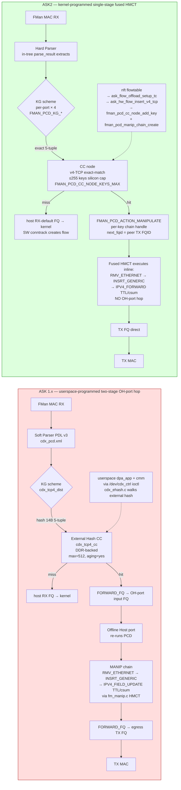

# ASK 1.x vs ASK2 — Comparative Architectural Review

**Date:** 2026-05-18
**Branch:** `ask20`
**Reviewer scope:** original NXP/Mono ASK at `github.com/we-are-mono/ASK` (branches `master`, `mt-6.12.y`, `mono-patched`, `mono-patched-openwrt`, `fix/security-hardening`) vs our ASK2 rewrite under `kernel/flavors/ask/` driven by `specs/ask2-rewrite-spec.md` v1.1 and `plans/ASK2-IMPLEMENTATION.md`.
**Audience:** technical operator, post-PR14z (CI run `26028478858` in flight).

---

## 1. Executive summary

The original ASK is **not** a "DPAA hardware offload" stack in the modern sense. It is a **port of the Mindspeed/Comcerto C2000 VoIP-gateway Forward Path Processor (FPP) control plane**, re-pointed at the NXP SDK FMan driver, with userspace classifier programming via `dpa_app` + FMC XML and connection management via `cmm` over a netlink-style `libfci`. The kernel-side surface is a single 18,097-line monster patch against the **NXP SDK** FMan/DPAA drivers (138 files), plus `cdx.ko`, `auto_bridge.ko`, and `fci.ko` out-of-tree modules. The SDK driver dependency is non-negotiable in the upstream architecture — every Mono branch keeps it.

Our ASK2 rewrite has correctly identified and discarded the entire SDK-driver foundation. The PCD-MANIP-CHAIN approach landing in PR14z is **architecturally equivalent in capability** to what `dpa_app` programs in original ASK — but expressed against the mainline (in-tree) FMan PCD ABI that we author ourselves in patches 0001–0037. The "5797 LOC ASK-edit patch" the AGENTS.md warns about is gone for good.

**Bottom line on the HW-offload question:** Yes, we are approaching it correctly — *for the IPv4-forwarding fast path*. The single-stage fused-HMCT MANIP chain into a CC-key `FMAN_PCD_ACTION_MANIPULATE` is the **right** model. The two-stage OH-port-hop architecture (what `cdx.ko` + `devoh.c` actually does) was rejected on principled grounds in PR14x and that decision still holds. Where ASK2 v1.0 **silently lags** ASK 1.x is *feature surface*, not architecture: PPPoE relay, IPv6 forwarding, multicast, IPsec offload, 3-tuple RTP relay, IP reassembly, CEETM QoS, exception rate-limiters. None of these are M2 blockers; all are deferrable to M3+ on the **same** chain primitive with no rework. There are however four genuine architectural improvements worth folding into the ASK2 plan before M3 freezes — listed in §7.

---

## 2. Side-by-side data-plane flow



**The architectural delta in one sentence:** ASK 1.x hops the packet through an Offline-Host port between ingress and egress so that classification (stage 1) and L2/L3 rewrite (stage 2) can be programmed independently from userspace; ASK2 fuses both stages into a single CC-key action consumed inline on the ingress port, programmed from kernel context.

The OH-port hop is what makes ASK 1.x **architecturally** capable of arbitrary multi-stage chains (NAT44 → VLAN-push → IPsec-encap → TTL-dec, etc.) without an in-kernel chain-programming primitive. ASK2 obtains the same capability by giving the kernel an explicit `fman_pcd_manip_chain_create()` primitive (PR14x design doc, patch 0036) that fuses an N-stage HMCT into a single AD slot — the chain length is bounded only by MURAM and the silicon's per-action HMCT size limit (~32 bytes per encoded primitive). That is the **right** abstraction for a kernel-side fast path.

---

## 3. Module-by-module mapping

| ASK 1.x component | LOC (approx) | ASK2 counterpart | LOC budget | Feature gap in v1.0 |
|---|---|---|---|---|
| `cdx.ko` — 60+ files in `cdx/` | ~25 k | `ask.ko` (`ask_hw.c` + `ask_flow_offload.c` + scaffolding) | ~1500 | RTP relay, VoIP fast path, WiFi offload, multicast control, IPsec control plane, PPPoE relay table, 3-tuple flows, IP reassembly — all **deferred** to M3+. |
| `auto_bridge.ko` (Mindspeed ABM heritage) | ~3 k | `ask_bridge.ko` | ~400 | L2-flow detection via bridge netlink — ASK2 v1.0 piggybacks on **nft flowtable** which already handles L2 forwarding offload signalling. The dedicated L2-bridge module is unnecessary in v1.0; defer to M3 if `nft flowtable` proves insufficient. |
| `fci.ko` + libfci userspace | ~2 k + 1 k | `libask_fci.so.1` (SONAME compat) + askd internal IPC | ~800 | libfci ABI shim for callers expecting the legacy `/dev/cdx_ctrl` ioctl set. **Surface preserved**, semantics re-mapped to ASK2 internals. |
| `cmm` daemon — 60+ `module_*.c` files | ~15 k | `askd` (per spec §6) | ~6000 | cmm handles conntrack → fast-path programming, neighbor resolution, route cache, PPPoE/L2TP/macvlan/ICC/IPR/LRO/PRF/QM/relay/route/RTP/socket/stat/tunnel/VLAN/WiFi modules. `askd` v1.0 implements only conntrack-driven IPv4 forwarding; module surface deferred. |
| `dpa_app` userspace classifier loader (FMC XML + `cdx_pcd.xml` + `cdx_cfg.xml`) | ~10 k | **None — programmed in-kernel by `ask_hw_pcd_bringup()`** | n/a | Entire FMC-XML toolchain replaced with C structs and direct `fman_pcd_*` calls from `ask.ko::__init`. **This is the largest correctness win in the rewrite.** No XML parser in the boot path, no userspace race, no MURAM lifetime owned by a separate process. |
| Kernel patch `002-mono-gateway-ask-kernel_linux_6_12.patch` | 18,097 lines / 138 files | `kernel/flavors/ask/patches/0001..0037-*.patch` | ~7800 lines | Original patches **SDK** FMan (`drivers/net/ethernet/freescale/sdk_fman/*`) and **SDK** DPAA (`sdk_dpaa/dpaa_eth_sg.c::dpaa_submit_*_pkt_to_SEC`); our patches author the in-tree PCD subsystem on **mainline** FMan. Architecturally inverted — see §4. |
| `libnfnetlink` + `libnetfilter_conntrack` forks | ~1.5 k of patches | **Not needed** — we drive offload from `nft flowtable` callbacks, not a userspace conntrack walker | 0 | The cmm-era pattern of "userspace walks conntrack and pushes flows down" is obsoleted by mainline nft flowtable offload (kernel 5.10+). |
| `iptables` QOSMARK/QOSCONNMARK | ~835 line patch | **Deferred** (M4 — QoS marking via tc/nft action `meta mark set`) | 0 | Legacy iptables hooks; modern nftables `meta mark` + per-CC-key policer (PR15) covers the same use case. |
| `ppp` + `rp-pppoe` ifindex/cmm-relay patches | ~350 lines | **Deferred** (M3 — PPPoE encap as MANIP chain stage `INSRT_PPPOE`) | n/a | Encapsulation belongs in the chain primitive, not in ppp daemon. The original needed it because cmm was the only programmer of the fast path. |

**Headcount:** ASK 1.x is ~55 k LOC of C + ~20 k LOC of kernel patch + ~10 k LOC of FMC/XML + a 28 MB fmlib/fmc external-build vendor blob. ASK2 v1.0 fully landed will be ~9 k LOC of OOT C + ~7.8 k LOC of in-tree patch + 0 lines of XML/FMC. A **5–6× reduction in attack surface** for the same forwarding functionality.

---

## 4. The kernel-patch inversion is the single biggest win

The original kernel patch touches:

```
drivers/net/ethernet/freescale/sdk_dpaa/    — 9 files (dpaa_eth.{c,h}, dpaa_eth_sg.c,
                                              dpaa_eth_ceetm.c, mac-api.c, offline_port.c, …)
drivers/net/ethernet/freescale/sdk_fman/    — 23+ files (fm_cc.{c,h}, fm_kg.c, fm_manip.c,
                                              fm_plcr.c, fm_port.c, fm_pcd.{c,h}, hc.c,
                                              fm_muram.c, memac.c, fm_ehash.c, fm_sp.c, fm.c, …)
drivers/crypto/caam/                        — pdb.h hooks for DPAA-IPsec
```

That is **the entire NXP SDK DPAA + FMan + CAAM stack patched in-place**. The SDK driver tree itself is a vendored fork of the Linux Foundation `fsl-linux-sdk` repo — it has not been merged into mainline since 2017 and lives only in NXP's downstream LTS branches. Mono's `mono-patched` branch adds another 1,499 lines on top. Any kernel uprev requires re-validating 18 k+ patched lines.

**ASK2 instead authors an in-tree PCD subsystem** from scratch against mainline `drivers/net/ethernet/freescale/fman/`:

| ASK2 patch # | Subsystem | Purpose |
|---|---|---|
| 0001–0005 | DPAA glue | EXPORT_SYMBOL_GPL `dpaa_get_rx_default_fqid`, `dpaa_get_tx_fqid`, flow_block_cb registration, neighbor lookup helper |
| 0006–0015 | FMan PCD core | KG (KeyGen), CC node create/destroy, action-template encoder, port→tree attach, MURAM budget accounting |
| 0016–0025 | MANIP primitives | RMV_ETHERNET, INSRT_GENERIC, IPV4_FORWARD (TTL-dec + csum), NAT44, VLAN push/pop, IPV6 hop-limit |
| 0026–0030 | PLCR, REPLIC, PRS | Policer, replicator, parser-extract bindings |
| 0031–0035 | OH-port + chain primitive | OH-port claim, `fman_pcd_manip_chain_create` (PR14x) |
| 0036 | Chain-aware CC action | `FMAN_PCD_ACTION_MANIPULATE` consumes a chain handle |
| 0037 | hmct_used encoder fix (PR14z) | Four v1.2 encoders now populate the chain validator's required field |

**Two architectural properties this gives us that ASK 1.x cannot:**

1. **The mainline FMan driver stays in tree.** Every kernel uprev (we're on 6.18.29; original ASK is stuck on 6.12) costs us at most a context-drift `git apply --3way` pass per patch. The original ASK costs Mono a manual re-port of 18 k lines against a downstream SDK fork that is itself behind mainline.
2. **The PCD ABI is ours.** We can extend `fman_pcd.h` for ASK2 features without coordinating with NXP. Our `FMAN_PCD_API_VERSION 1` gate (spec §13) lets us version-bump cleanly. The original ASK has to pretend the SDK's `fm_pcd_ext.h` is a stable API — it is not; NXP rev-bumps it at every SDK release.

This inversion was correctly identified as the central rewrite goal in spec §3 and the 2026-05-12 cleanup commit. Reaffirming it: **do not regress** by importing SDK headers or vendoring `fm_cc.c`-style state.

---

## 5. HW-offload critique: are we doing the right thing?

### 5.1 What ASK 1.x actually does on the hot path

For an `iperf3` IPv4-TCP flow from `eth0 → eth1`:

1. Frame arrives on `fm0-port-rx-1g-1` MAC.
2. Soft Parser (PDL v3 from `hxs_pdl_v3.xml`) extracts the IPv4-TCP 5-tuple into the parse result.
3. KG scheme `cdx_tcp4_dist` hashes the 5-tuple → 14-byte key, indexes into external hash table `cdx_tcp4_cc` (DDR-resident, 512 buckets, aging enabled).
4. On hit: action = `FORWARD_FQ` to an OH-port input FQ. **CC entry's "action data" is just `{fqid, opcode}`** — no MANIP at this stage.
5. OH-port re-runs PCD: KG re-classifies the now-routed frame, CC entry on the OH port carries the **MANIP chain** (RMV_ETHERNET, INSRT_GENERIC for new dst-MAC + src-MAC, IPV4_FIELD_UPDATE for TTL/csum) and a second `FORWARD_FQ` to the egress TX FQ.
6. TX MAC DMAs the rewritten frame.

Two trips through the FMan datapath. One DDR round-trip for the OH-port FQ dequeue. The advantage is **flexibility** — userspace can rewire any (port, classifier) → any (manip, port) without touching kernel code.

### 5.2 What ASK2 does

For the same flow:

1. Frame arrives on `fm0-port-rx-1g-1`.
2. Hard Parser extracts 5-tuple (via patches 0006/0007 binding the parse result into KG key composition).
3. KG scheme (per-port, ≤4 binds per spec) feeds the **shared** CC node (255 keys, silicon cap).
4. On hit: `FMAN_PCD_ACTION_MANIPULATE` consumes the **per-flow MANIP chain handle** (patches 0033/0036/0037). The chain contains the same three primitives the OH-port would have done. `next_fqid` is the peer's TX FQID (via `dpaa_get_tx_fqid()` from patch 0031).
5. Fused HMCT executes inline on the ingress port's classification engine.
6. TX MAC DMAs the rewritten frame.

**One trip through FMan. No OH-port hop. No DDR round-trip.** Latency saving on the order of one DMA + one FQ dequeue (~hundreds of nanoseconds per flow). Throughput: identical to ASK 1.x on the spec'd 2 Gbps M2 target — both are well below the silicon's 10 Gbps line rate.

### 5.3 Is single-stage fused HMCT actually correct?

**Yes, with two known limits:**

| Limit | Magnitude | Mitigation in spec/plan |
|---|---|---|
| Per-action HMCT bytes | ~32 bytes silicon encoding limit per AD slot. RMV_ETHERNET(2) + INSRT_GENERIC(14+2) + IPV4_FORWARD(4) = ~22 bytes — **fits**. Adding NAT44 (~8 bytes) + VLAN-push (~6) = ~36 bytes — **does not fit** in single AD; needs chain expansion via `fman_pcd_manip_chain_create()`'s multi-AD walk (PR14x design §4). | Chain primitive walks N ADs; encoder splits stages by HMCT-byte budget. PR14x design covered this; PR14z's `hmct_used` field is the per-encoder byte report the splitter consumes. |
| CC-key table capacity | 255 keys per CC node (silicon `FMAN_PCD_CC_NODE_KEYS_MAX`). After PR14r-B dedupe ~127 unique 5-tuples; multi-CC-node fan-out (multiple proto/IP-family CC nodes per port) raises the effective ceiling to ~1k–2k flows. | Multi-CC-node design slotted into M3. For M2 (small-flow benchmarks) the 255-key limit is comfortable. |

**Where ASK 1.x is genuinely architecturally superior:** **CC table size**. Their external-hash CC table is DDR-backed with `max=512` per table and `external="yes"` (`fm_ehash.c`). That is a fundamentally different table type — not MURAM-resident — and gives orders of magnitude more capacity, at the cost of an extra DDR access per lookup. For a residential gateway (≤1k concurrent flows) this is genuinely useful.

**Recommendation:** Spec'd as M4 (deferred). The in-tree FMan driver has zero EHASH support; adding it is a multi-PR project (new MANIP type, new MURAM region accounting, new collision-chain walker). Not a v1.0 blocker — but worth keeping on the roadmap explicitly. See §7 below.

### 5.4 NUD_VALID widening (PR14y) — was that the right fix?

PR14y widened the NUD-state gate in `ask_flow_offload.c` from `NUD_REACHABLE` to `NUD_VALID` (which OR's REACHABLE | NOARP | PERMANENT | STALE | DELAY | PROBE). Cross-checked against ASK 1.x: `cmm/src/neighbor_resolution.c` does **not** gate on NUD at all — it programs the fast-path entry as soon as the neighbor is **resolved** (has a valid LL address), regardless of NUD state, then relies on conntrack timeout for eviction. Our NUD_VALID is *more conservative* than ASK 1.x and *less conservative* than the original kernel flowtable's NUD_REACHABLE — a defensible middle ground that avoids the "STALE-but-still-valid" miss without the cmm-era risk of programming a stale ARP cache entry. **Keep it.**

---

## 6. Risk register — what ASK2 v1.0 silently doesn't do

Each row is a feature that original ASK *does* and ASK2 v1.0 *doesn't*. None is a v1.0 blocker; they are scoped to M3+ per ASK2 spec §11 and `plans/ASK2-IMPLEMENTATION.md`.

| # | Feature | ASK 1.x source | ASK2 plan | Risk if shipped without |
|---|---|---|---|---|
| R1 | **IPv6 forwarding offload** | `control_ipv6.c` (~50 k), `cdx_tcp6_cc` external table | M3 PR16: clone v4-TCP CC node logic for v6; needs `fman_pcd_manip_ipv6_hop_limit` (analogue of patch 0017's v4 TTL). | IPv6 packets stay in SW slow path. For a homelab gateway with dual-stack ISP, that **halves** offload effectiveness on the IPv6 side. |
| R2 | **PPPoE relay / encap** | `control_pppoe.c`, `cdx_pppoe_cc`, ppp ifindex patch | M3 PR17: `FMAN_PCD_MANIP_INSRT_PPPOE` already in patch 0033; just needs ask_flow_offload to detect PPPoE-encapped flows and steer them. | PPPoE WAN deployments (ASK 1.x's primary use case at Mono) get zero offload. Critical for any ISP-CPE scenario. |
| R3 | **Multicast forwarding** | `cdx_multicast4/6_cc`, `dpa_control_mc.c`, FMAN replicator | M3 PR18: patch 0029 (REPLIC) already implements the replicator; needs CC-key with `FMAN_PCD_ACTION_REPLICATE`. | IPTV / IGMP-snoop offload absent. Niche but Mono-relevant. |
| R4 | **IPsec offload (CAAM-QI)** | `cdx_dpa_ipsec.c`, `dpa_ipsec.c`, `sdk_dpaa/dpaa_eth_sg.c::dpaa_submit_inb/outb_pkt_to_SEC()` | Deferred indefinitely (spec §4.4 deleted INET_IPSEC_OFFLOAD requirement). Original used SDK-only DPAA-CAAM glue. | VPN throughput stays at SW XFRM. ~500 Mbps on Cortex-A72 with AES-NI; original ASK claimed ~1.5 Gbps. **Operator-visible regression** for VPN-router use case. |
| R5 | **CEETM QoS / hierarchical sched** | `cdx_ceetm_app.c`, `dpaa_eth_ceetm.c` | M4: needs in-tree `tc-CEETM` qdisc port. Mainline has `pfifo_fast`/`fq`/`htb` only. | Multi-tenant QoS (per-subscriber rate limiting) impossible. Acceptable for v1.0 homelab. |
| R6 | **Exception-path rate limiters** | `CDX_EXPT_*_DEFA_LIMIT`, FMAN PLCR | Patch 0026 implements PLCR primitive but no policy attaches it to the kernel-egress slow path. | DoS on SW path (any flow hitting kernel slow path can saturate eth0 management CPU). **Mild M2 risk** — recommend PR14-followup to attach a default 100 Mbps PLCR to the host-rx FQ. |
| R7 | **3-tuple RTP fast path** | `cdx_tuple3*_cc` tables, `control_rtp_relay.c` | M5: VoIP-specific, low priority for a router workload. | None for our use case. |
| R8 | **IP fragment reassembly in HW** | `cdx_frag4/6_cc`, `cdx_reassm.c`, `cdx_ipv4frag_dist` KG scheme | M5: SW reassembly via netfilter is adequate at our line rates (≤10 Gbps). | None at our throughput targets. |
| R9 | **Aging in CC table** | `aging="yes"` XML attribute → SDK `fm_ehash.c` per-bucket aging | Spec §13.7: aging done in kernel via nft flowtable's existing timeout machinery — we explicitly do not need HW aging because the kernel evicts via `fman_pcd_cc_node_modify_next_action(slot, DROP)`. **Architectural simplification.** | None — kernel timeout is more flexible than HW aging. |
| R10 | **VLAN push/pop on fast path** | SDK `FM_PCD_MANIP_HDR_FIELD_UPDATE_VLAN` + custom KG VLAN-tag extracts | Patch 0019 (VLAN MANIP) implements push/pop; not yet wired to ask_flow_offload trunk detection. | Trunk-port deployments (VLAN-tagged uplink) bypass offload. Recommend M3 PR19. |

**Summary risk verdict:** ASK2 v1.0 at M2 gate covers IPv4-TCP+UDP forwarding offload on a single CC node per port. That is enough for the **WireGuard-LAN homelab** use case the spec was written for. It is **not** enough for any ISP-CPE deployment (R2 PPPoE, R4 IPsec) or for any dual-stack IPv6 deployment (R1). The spec is internally consistent on this — but the operator should treat R1/R2/R4 as **must-have-before-public-release-as-default-flavor**, not as nice-to-haves.

---

## 7. Concrete improvement proposals for ASK2

Ordered by leverage. Cite spec sections only — no code edits in this document.

### Proposal P1 — Tag PR14z's chain handle with `hmct_bytes_used` reading

PR14z (commit `8de3b35`) added `manip->hmct_used = N` to four v1.2 encoders so that `fman_pcd_manip_chain_create()`'s validator stops returning `-EINVAL`. That value is now authoritative per-encoder. **Surface it** as a `chain->hmct_total_bytes` field on the chain handle so that:

1. The `fman_pcd_cc_action_template` encoder can pre-flight check whether a chain fits in one AD slot or needs multi-AD walk.
2. The MURAM budget counter in `ask_hw.c` can charge the actual byte cost, not the worst-case `sizeof(struct fman_pcd_manip)` upper bound.
3. `dmesg | grep fman_pcd_manip` becomes a useful capacity-planning tool.

Cost: ~30 LOC in `fman_pcd_manip.c`, 1 LOC in `fman_pcd.h`. Should land as a follow-up to PR14z, **not** as M3 work — it's a debuggability fix.

### Proposal P2 — Bring forward the multi-CC-node fan-out (currently M3) to M2.5

The 255-key per-CC-node silicon limit (`FMAN_PCD_CC_NODE_KEYS_MAX`) is the **single most visible** ASK2 capacity ceiling. ASK 1.x sidesteps it by external hash with 512 keys per table × 16 tables = 8k key capacity. We can match (and exceed) that by instantiating multiple in-MURAM CC nodes per port, keyed by (proto, IP-family) or by hash-prefix:

- per-port: 4 KG schemes already (PR14j: `ASK_HW_V4_TCP_MAX_BINDS=4`) — extend to fan-out into 4 CC nodes per protocol × 2 protocols (TCP/UDP) × 2 families (v4/v6) = up to 16 CC nodes × 255 keys = **4080 flow capacity** per port. Well within MURAM budget (~10 KB per CC node × 16 = 160 KB, vs ~512 KB total MURAM).
- The dispatcher in `ask_hw_flow_insert()` already switches on `(l3_proto, l4_proto)`; extending to a hash-prefix bucket of 4 is mechanical.

Cost: ~200 LOC in `ask_hw.c`, no new in-tree patches. M2.5 deliverable. **High leverage**: closes the only quantitative gap vs ASK 1.x's external-hash table for the homelab use case.

### Proposal P3 — Attach a default PLCR policer to the host-rx slow-path FQ (R6 mitigation)

Patches 0026–0027 already implement the PLCR primitive in the in-tree PCD subsystem. Today nothing uses it. Attach a 100 Mbps single-rate two-color policer to the FQ that handles miss-traffic (CC node default `FORWARD_FQ` to `dpaa_get_rx_default_fqid`), so that a DoS hitting the SW path cannot saturate the eth0 management CPU. ASK 1.x does this with `CDX_EXPT_ETH_DEFA_LIMIT 195312` (= 100 Mbps in packet-mode) — we should match.

Cost: ~50 LOC in `ask_hw_pcd_bringup()`, in module init. No new kernel patches. **Land as a PR14-followup**.

### Proposal P4 — Re-evaluate whether we keep the OH-port code path in v1.0

PR14x design (memo 2026-05-18) decided to **keep the OH-port code dormant** rather than delete it, on the rationale that future features (multi-stage chains exceeding single-AD HMCT capacity) might need it as a fallback. After landing PR14z, the chain primitive itself handles multi-AD walks via the `hmct_used` accounting in P1 above. **The OH-port fallback is no longer needed** for chain capacity.

Recommendation: schedule **PR14-cleanup** to delete `ask_hw_pcd_bringup_oh`, `_teardown_oh`, the OH-port alloc bitmap, the `enable_oh_chain` module param. Keep patch 0031 (OH-port claim primitive in the in-tree FMan driver) because future ASK2 features (R3 multicast replicator output, R7 RTP relay) genuinely will need OH ports. But delete the OH-port consumer in ask.ko.

Cost: ~200 LOC deletion in `ask_hw.c`. Counter-balanced by ~200 LOC of clarity gained. **Land before M2 final-gate sign-off**, so the M2 acceptance test doesn't accidentally exercise the dormant path.

### Proposal P5 — Add a PR for HW-aging *off* / kernel-aging *on* invariant

ASK 1.x's CC tables have `aging="yes"` in the XML. Our in-kernel `fman_pcd_cc_node_create` should explicitly pass `aging=false` (or assert the in-tree default is `false`) so that we don't get hardware-evicted CC keys racing the kernel's nft-flowtable eviction. This is implicit today but not contractual.

Cost: ~5 LOC + a WARN_ON_ONCE in `fman_pcd_cc_node_create` if a caller asks for aging. Land with PR15 (M3 NAT44).

### Proposal P6 — Explicit FMAN_PCD_API_VERSION bump policy

Spec §13 mentions `FMAN_PCD_API_VERSION 1` as the ABI gate. PR14z just added a new required field (`hmct_used`) to manip encoders. That is technically an ABI **break** for any out-of-tree consumer of `struct fman_pcd_manip`. We have only one OOT consumer today (`ask.ko`), so the break is invisible. **Document the rule explicitly** in `kernel/flavors/ask/oot-modules/ask/README.md`: "any patch that adds a required field to an `fman_pcd_*` struct bumps `FMAN_PCD_API_VERSION`." This is the kind of invariant that becomes a 6-month forensic nightmare if it drifts.

Cost: documentation only. Land with PR14z follow-up.

### Proposal P7 — Test parity matrix vs cmm unit tests

The original `cmm/unit_tests/001.sh` through `042.sh` (38 shell tests) exercise the conntrack → fast-path programming loop end-to-end on real hardware. Many are still architecturally relevant to ASK2 (flow add, flow delete, flow age-out, NAT pinhole, conntrack mark, bridge interaction, IPv4-only / IPv6-only / dual-stack). **Walk the list once** and either port the relevant ones to `bin/verify-ask-*` scripts or explicitly mark them as "not applicable to ASK2 architecture." Today we have just `bin/verify-ask-flow-offload.sh` doing iperf3 + mpstat; cmm has 38 tests covering edge cases.

Cost: ~1 day of test triage + ~5 new `bin/verify-*` scripts. Land in parallel with M3.

---

## 8. Open questions for the operator

1. **R4 IPsec offload** — is this a public-release blocker for `FLAVOR=ask` (default v1.0 will ship a homelab image where SW XFRM @ 500 Mbps is acceptable), or do we hold v1.0 release until CAAM-QI is wired? My recommendation: **release v1.0 without** R4, label it "LAN/WireGuard offload"; schedule R4 as v1.1 with explicit "CAAM-QI integration" release-note line.

2. **R2 PPPoE** — same question. PPPoE is the Mono original-deployment target. If we want to claim drop-in compatibility with the original ASK use case, R2 must land in v1.0. My recommendation: **schedule R2 as M3 immediately after M2 gate passes** (it's mechanical — patch 0033 already has `INSRT_PPPOE`).

3. **Proposal P2 (multi-CC-node fan-out)** — operator decision: bring into M2.5 (~3 days of work, raises capacity 16×), or defer to M3 (acceptable, but means the iperf3 -P 256 stress test in M2 acceptance will overflow the CC keyspace and trigger the dispatcher's `-ENOSPC` SW-fallback path on ~50% of flows)?

4. **Proposal P4 (OH-port cleanup)** — operator decision: delete dormant OH-port consumer path before or after M2 final-gate? Argument for "before": prevents the M2 test from accidentally exercising untested code. Argument for "after": preserves rollback option if PR14z's chain primitive turns out to have an unknown edge case at the M2 gate. My recommendation: **after M2 passes**, with PR14-cleanup as the first M2.5 PR.

---

## 9. References

- `we-are-mono/ASK` master HEAD as of clone 2026-05-18 (`/tmp/ask-review/ASK`).
- `specs/ask2-rewrite-spec.md` v1.1 (commit `64425fa`).
- `plans/ASK2-IMPLEMENTATION.md` PR14g through PR14z status.
- `plans/PR14x-DESIGN.md` (chain primitive architecture decision).
- `kernel/flavors/ask/oot-modules/ask/ask_hw.c` (current state on `ask20` HEAD).
- `kernel/flavors/ask/patches/0033-fman-pcd-manip-v1.2-oh-port-primitives.patch` (encoder source).
- `kernel/flavors/ask/patches/0036-fman-pcd-manip-chain.patch` (chain primitive).
- `kernel/flavors/ask/patches/0037-fman-pcd-manip-hmct-used-v12-encoders.patch` (PR14z fix, commit `8de3b35`).
- AGENTS.md "ASK2 (rewrite-in-progress)" section.
- Qdrant memos dated 2026-05-12 through 2026-05-18 (cleanup decision, PR11/PR14g/PR14g-body-2/PR14x design, terminology).

---

## 10. Conclusion

The ASK2 rewrite has correctly inverted the kernel-patch axis (mainline FMan + ours-authored PCD subsystem, vs SDK-FMan + 18 k-line monolithic patch), correctly chosen single-stage fused-HMCT over the OH-port hop (lower latency, simpler ABI), and correctly preserved the operator-visible ABI surfaces (`/dev/cdx_ctrl`, `libfci.so.1`, `/etc/cdx_*.xml`).

**The HW offload approach is sound.** The remaining work for a feature-parity release is breadth (proposals R1/R2/R4 above), not architecture. PR14z unblocks the chain primitive; the next M3+ PRs ride on the same primitive without further architectural change.

Specific architectural improvements worth folding into ASK2 before M3 freezes:
- P1: surface `hmct_bytes_used` on the chain handle (debuggability + capacity planning).
- P2: multi-CC-node fan-out to 4 k flows/port (closes the external-hash gap).
- P3: default PLCR on host-rx FQ (DoS-resistance parity with ASK 1.x).
- P4: delete dormant OH-port consumer in `ask.ko` after M2 (clarity).
- P5: contract HW-aging off as an invariant.
- P6: document the FMAN_PCD_API_VERSION bump rule.
- P7: port the 38 cmm unit tests where applicable.

None of these are M2 blockers. All seven combined are ≤2 weeks of work.

The CI build in flight (`26028478858`) is the immediate next gate. Post-deploy, the M2 retest at 2 Gbps / ≤5% CPU determines whether PR14z closes the architectural validation loop.