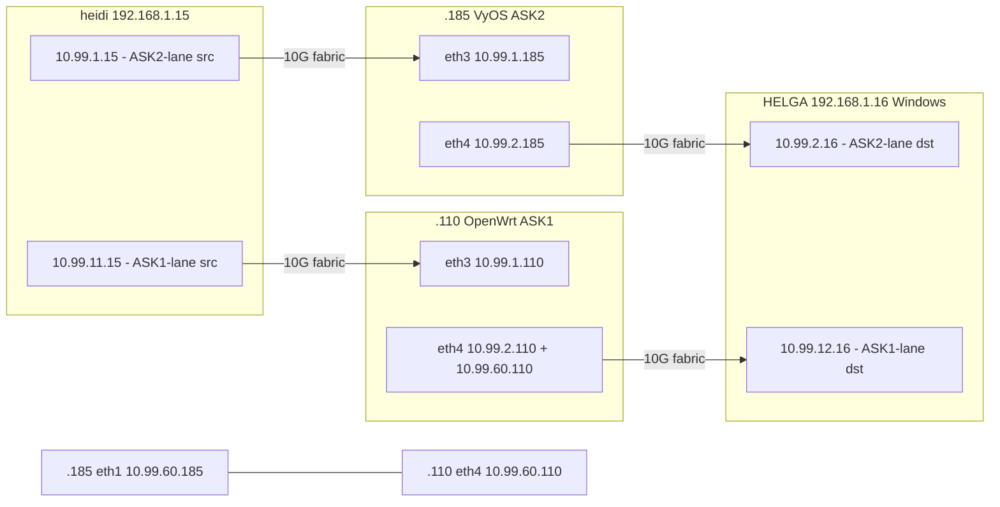

# ASK 1.0 vs ASK2 — Comparative Test Suite

Status: operational harness + test runner (2026-08-24). Boards: `.110` (ASK 1.0, OpenWrt
"Mono" with cdx.ko + cmm) and `.185` (ASK2, VyOS with ask.ko + fman_pcd). Runner:
`bin/verify-ask1-vs-ask2.sh`.

## Harness topology

Both DUTs hang off the same 10G lab fabric and share one generator pair (heidi and HELGA),
so the exact same traffic class can be pointed at either board by choosing the source subnet.
No route flapping is needed during a run — both lanes are always live.



| Path | src → dst | gateway | iperf3 server |
|---|---|---|---|
| ASK2 lane | heidi `10.99.1.15` → HELGA `10.99.2.16:5201` | heidi: `10.99.2.0/24 via 10.99.1.185` | `iperf3.exe -s -B 10.99.2.16 -p 5201` |
| ASK1 lane | heidi `10.99.11.15` → HELGA `10.99.12.16:5202` | heidi: `10.99.12.0/24 via 10.99.1.110` | `iperf3.exe -s -B 10.99.12.16 -p 5202` |

- HELGA return route: `10.99.11.0/24 via 10.99.2.110` (persistent, `route -p`). HELGA's
  `10.99.12.16/24` is a secondary address on adapter "Ethernet 4"; Windows **silently drops
  ICMP echo for secondary addresses** (replies are dropped at IP egress), so lane liveness
  checks must use TCP (iperf3), never ping.
- `.110` lane plumbing (reboot-safe via `/etc/rc.local` + UCI `network.mirror1/2`):
  fw4-top `nft insert` accept rules for `10.99.11↔10.99.12`, routes
  `10.99.11.0/24 dev eth4`, `10.99.12.0/24 dev eth4`. The fw4 zone-jump structure consumes
  wan-ingress before user rules, so the accepts must sit at the top of `inet fw4 forward`.
  (A separate `-10`-priority base chain did **not** terminate the hook — rule-order inside
  the fw4 chain is what works.)
- ASK1 fast-path master switch: `/sys/class/vwd/vwd0/vwd_fast_path_enable` (0 = kernel
  forwarding, 1 = CDX allowed). cmm CLI (`cmm -c "set ff ..."`) prints nothing over SSH;
  the sysfs file is the reliable toggle.
- `.110` observability: `/proc/fqid_stats/pcd/{eth3,eth4}/<fqid>` (frame/byte counts),
  `/proc/fci` (FCI message counters), `/sys/class/vwd/vwd0/vwd_debug_stats`.
- `.185` observability: `sudo ynl --family ask --dump dump-flows --output-json`
  (per-flow packets/bytes + `offloaded`), `conntrack -L | grep HW_OFFLOAD`, `pcd-snapshot`.

## What differs, and how each test exposes it

1. **Automatic HW flow offload from conntrack (ASK2) vs daemon-driven cdx (ASK1).**
   ASK2 installs ehash flows from the nft flowtable (`offload hardware`) with no userspace
   process; ASK1 requires cmm watching conntrack and programming cdx. Test: `offload-evidence`
   + `throughput` — dump-flows shows `offloaded:1` with per-flow silicon counters on `.185`;
   on `.110` the vwd/fqid stats show whether any packet ever took the fast path.
2. **Per-flow hardware counters with byte-exact silicon match (ASK2, T-M8-3 proven).**
   `offload-evidence ask2` prints per-direction packet totals that grow with traffic and
   match `fe_ehash_stats`.
3. **CPU cost of the dataplane.** `cpu-profile` samples `/proc/stat` on all 4 A72 cores
   during a full-rate run. HW-HIT traffic leaves the CPUs idle; kernel forwarding saturates
   them (~40–98 %).
4. **Directional HIT integrity.** The dump-flows direction split
   (eth3-ingress vs eth4-ingress) exposes asymmetries: a flow offloaded in one direction
   but software-forwarded in the other is a defect, not a silent fallback.
5. **ASK1 fast-path engagement on a routed topology.** `ask1-fastpath` A/B-tests
   `vwd_fast_path_enable` 0 vs 1 with throughput + CPU. Identical results = the CDX fast
   path never engaged for these flows (control plane talks — `/proc/fci` counters move —
   but no dataplane counters do).
6. **Reversibility and daemon-free architecture.** ASK2 has no daemon to kill (ps shows no
   offload daemon; the flowtable is kernel-internal), and its PCD state is byte-exact
   reversible (`pcd-snapshot diff` after engage/disengage). ASK1 runs cmm/cmm-supervise/
   cdx/fci as processes.

## Running

```bash
bin/verify-ask1-vs-ask2.sh check                       # harness liveness
bin/verify-ask1-vs-ask2.sh throughput ask2 8 30        # ASK2 lane, 8 streams, 30 s
bin/verify-ask1-vs-ask2.sh throughput ask1 8 30        # ASK1 lane
bin/verify-ask1-vs-ask2.sh cpu-profile ask1 4 20       # per-core busy% on the DUT
bin/verify-ask1-vs-ask2.sh offload-evidence            # offload state on both DUTs
bin/verify-ask1-vs-ask2.sh ask1-fastpath 4 15          # vwd 0 vs 1 A/B on .110
bin/verify-ask1-vs-ask2.sh all 4 20                    # full matrix
```

All iperf3 runs use `-P N` (multi-core parallel streams) and `--bidir`. Raw JSON lands in
`/tmp/ask1-vs-ask2/`.

## Why ASK2 CPU is ~20x ASK1 (root cause, 2026-08-24)

Both dataplanes forward in silicon (kernel `rx packets`/`tx packets` ≈ 0 on `.185`), yet
`.185` sits at 2.3–3.0 %/core and `.110` at 0.1–0.2 %/core. Root cause:

**ASK2's FMan-HIT frames still generate QMan TX-confirmation frame descriptors that the
mainline `fsl_dpa` driver dequeues and frees per-packet in `dpaa_tx_conf()` (NAPI/softirq).**
ASK1's cdx fast path forwards through vendor FQs whose buffers are released in silicon with
no confirmation and no kernel callback.

Evidence (`ethtool -S`, full-rate load):

| counter | ASK2 `.185` | ASK1 `.110` |
|---|---|---|
| kernel `rx packets` total | ~0 | ~0 |
| kernel `tx packets` total | ~116 | ~4,224 |
| `tx confirm` total | 49.7 M (eth3) / 177.2 M (eth4), **+180 K/s under load** | ~thousands, **flat** |
| CPU attribution (`/proc/stat`) | ~97 % idle, ~1.2 % softirq, ~0.5 % sys | ~99.9 % idle |
| QMan portal IRQs | ~33 K/s | negligible |

So the residual ASK2 CPU is TX-completion processing (~180 K confirms/s ÷ 4 cores in the
confirm-FQ NAPI poll), not packet forwarding.

Why ASK2 still pays it: the clean global TX-confirm bypass (patch `0136` /
`fman_port_set_silicon_hit_release_all`, `NIA_BMI_AC_TX_RELEASE` on all TX ports) was
**removed 2026-08-21** because it also suppressed confirmations for kernel-forwarded skbs on
`egress_fqs[]` → a 1.7 GB/s skbuff leak → OOM. The replacement is a per-egress no-confirm TX
FQ (F-198/F-199, `B0V=0/EBD=1`) resolved by `ask_hw_resolve_oif_fqid()` and targeted by the
FE record's `ENQUEUE_PKT`, with the REPLACE path failing closed to software if it can't get
one (a HIT on a confirmed FQ panics `dpaa_cleanup_tx_fd`). On this image the no-confirm FQ is
only partly effective — ~15–23 % of HIT egress frames still confirm (180 K/s while kernel
skb-TX ≈ 0), and `ask_hw_resolve_oif_fqid()`'s success log never fired since the cold boot.
**ASK2-team follow-up:** verify `dpaa_alloc_offload_tx_fq()` actually programs `B0V=0` and
that the resolver is invoked on every REPLACE — closing that gap should take ASK2's forwarding
CPU toward ASK1's ~0.1 %.

## Sustained multi-core multi-flow bidirectional results (2026-08-24)

Methodology: `bin/verify-ask1-vs-ask2.sh sustained <lane> 8 60` — iperf3 `-P 8 --bidir`
(16 data flows), 60 s, MTU 1500, both DUTs on `performance` governor at 1600 MHz, DUT CPU
sampled over the steady-state window (t=10 s..57 s), conntrack flushed on `.185` first.
ASK1 `.110` ran with `vwd_fast_path_enable=1` (as shipped).

| metric | ASK2 (.185) | ASK1 (.110) |
|---|---|---|
| aggregate throughput | 14.47 Gbit/s (7.24 + 7.23) | 14.17 Gbit/s (7.09 + 7.08) |
| steady-state CPU per core | 2.3–3.0 % | 0.1–0.2 % |
| offload path | ehash HIT, 17/17 flows `[HW_OFFLOAD]` | CDX fast path, silicon forwarding |
| direction symmetry | both directions HIT (post cold boot) | both directions in silicon |

Both boards sit at the same ~7.2 Gbit/s-per-direction ceiling — that is the DPAA1
1500-byte-MTU wire ceiling (≈600 K pps), not a DUT difference. Both dataplanes are
effectively CPU-idle at full rate. ASK1's fast path engages only on sustained flows
(cmm installs flows from established conntrack entries — 10 s runs never cross the
engagement latency, which is why short A/B runs showed kernel CPU); `vwd_debug_stats`
and `/proc/fqid_stats/pcd` counters stay 0 on this topology (they track the WiFi/bridge
fast path and PCD distribution FQs, not the wired CDX path — interface counters in
`/sys/class/net/ethN/statistics` are the ground truth).

MTU 9000 was attempted for max-rate differentiation but reverted: raising heidi's
`enp35s0f1` MTU triggers an ixgbe adapter reset and the fabric switch port took ~60 s to
re-link (NO-CARRIER window). Everything is back at MTU 1500; revisit jumbo only with
switch-side confirmation and a maintenance window.

## First-run results (2026-08-24, P=4, 10 s)

| metric | ASK2 lane (.185) | ASK1 lane (.110) |
|---|---|---|
| aggregate throughput (sent+recv) | 7.25 + 7.23 Gbit/s | 7.13 + 7.11 Gbit/s |
| DUT CPU during run | 98 % on all 4 cores | 41–63 % per core |
| HW-offloaded flows | reverse direction HITs (eth4 ingress), **forward direction (eth3 ingress) packets=0 — software-forwarded** | none — vwd 0/1 identical (no CDX engagement, no fqid frame counts) |

Open items to track down (ASK2 team):
- ~~On image 2026.08.23-1828 (F-228 present), heidi→HELGA flows (eth3 ingress) stay software
  while HELGA→heidi (eth4 ingress) HIT. T-M8-3 on 1418 counted both directions. Candidate:
  PORT_ID in the 14-byte key vs the eth3 scheme, or per-port arming asymmetry (eth3 hw_port
  0x10 vs eth4 0x11).~~ **RESOLVED 2026-08-24 by cold boot** (AGENTS S6.10.9): accumulated
  BMI/PCD/ehash silicon state was the cause, not a regression. Post-boot both directions
  HIT (eth3-ingress 7.6M pkts / eth4-ingress 1.67M pkts, 18/18 flows hw_offloaded) and
  steady-state DUT CPU drops to ~2.5–3 % (98 % pre-fix). Methodology note: always cold-boot
  `.185` before offload tests; short iperf3 runs show inflated CPU from the SW warmup tail
  while fresh flows install — sample late-window CPU or run ≥30 s.
- ASK1 (cdx/cmm) never took the fast path for routed eth3↔eth4 flows on this topology —
  plausible (PCD compiled for boot-time bridge/wan topology), but worth a cmm-eligibility
  pass if a true fast-path comparison is wanted.
