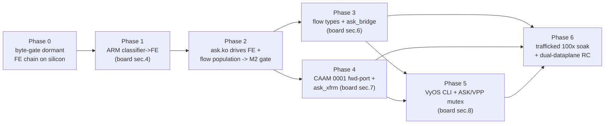

# ASK2 Development Plan — from dormant substrate to operational offload
**Version 1.0.0 · 2026-06-16 · HADS 1.0.0**

---

## AI READING INSTRUCTION

Read `[SPEC]` and `[BUG]` blocks for authoritative facts.
Read `[NOTE]` only if additional context is needed.
`[?]` blocks are unverified — treat with lower confidence.

This plan is execution-oriented and subordinate to two sources of truth: the
silicon contract in [`arch/fman-fe-ehash.md`](../arch/fman-fe-ehash.md) and the
state machine in [`plans/DUAL-DATAPLANE.md`](DUAL-DATAPLANE.md). Where this plan
and those documents disagree, they win. Section 9 is the live execution log.

---

## 1. Current state (ground truth, 2026-06-16)

**[SPEC]**
The silicon-programming substrate is complete, reversible, and HW-proven
dormant. The remaining work is five capabilities, surfaced as the five `[FAIL]`
lines of `board/scripts/ask-check` run on the lab board (192.168.1.190, image
`2026.06.17-0315-rolling`, kernel `6.18.34-vyos`):

| Layer | State | Anchor |
|---|---|---|
| FMan PCD subsystem (KeyGen / CC / HM / Policer) | DONE, shipping | board patches `0092`/`0097`–`0100` (commit `f307193`) |
| Reversible mode-switch API + `pcd-snapshot` | DONE, HW-proven (100× control-plane soak, 0 drift) | `0105`/`0106`/`0116`/`0129` |
| FE/ehash VM substrate (dormant chain) | BUILT, DORMANT | `0122`→`0131`, byte-verifiable via `fe_*` debugfs |
| ask.ko control plane (genl, flow table, debugfs, engage entry) | BUILT | `ask_flow_offload.c` 92 KB, `ask_hw.c` 32 KB, genl id 0x1e |
| Classifier→FE root link armed | **FAIL** | the single datapath gate |
| `ask_bridge.ko` (L2 switchdev) | **FAIL** (stub 417 B) | `kernel/flavors/ask/oot-modules/ask/ask_bridge.c` |
| CAAM descriptor-sharing API | **FAIL** (`0001` not in common tree) | symbol `caam_qi_ext_consumer_register` absent on board |
| ESP hardware-offload advertise | **FAIL** (stub 1 KB) | `ask_xfrm.c` |
| `set system offload ask` CLI | **FAIL** (not started) | — |

**[SPEC]**
Fork A (classic exact-match `CONT_LOOKUP`) is dead on the 210.10.1 microcode.
iter-49/50 fault-capture (2026-06-16) proved the stall latches zero hardware
fault (`fmdmsr=0`, `fmfp_ee` unchanged, every fault register clean) — it is a
disposition-less WAIT, not a fixable arming bug. Fork B (external-hash + FE
opcode VM) is the only configuration proven to flow on this silicon, and the
dormant `0122`→`0131` chain *is* Fork B fully assembled.

**[NOTE]**
The specs lag the code. `specs/ask2-rewrite-spec.md` §15.1 still lists `ask.ko`
as "NOT STARTED", but on disk its control plane is substantially built (the
~400-byte files `ask_bridge.c`/`ask_caam.c`/`ask_neigh.c`/`ask_op.c`/
`ask_stats.c` and the 1 KB `ask_xfrm.c` are the genuine stubs; everything else
is real). `plans/COMPLETION-PLAN.md` §6 still names the now-dead Fork-A
"MANIP-dedup / `FORWARD_FQ_WITH_MANIP`" as the M2 next step. Section 8 of this
plan enumerates the doc corrections.

---

## 2. Critical path

**[SPEC]**
Phase 1 (the arm) gates the other four capabilities. Nothing downstream offloads
until a classified frame reaches its egress FQ. Phases 3 and 4 parallelize once
Phase 2 passes the throughput gate.

---

## 3. Non-negotiable discipline (every kernel patch)

**[SPEC]**
From [`arch/fman-fe-ehash.md`](../arch/fman-fe-ehash.md) §8.6, mandatory because
a wrong FE image stalls with no latched fault (invisible to traffic tests):

- Mutate **eth3 only** (hw port id `0x10`). Never eth0 — it is the SSH lifeline.
- **Forward write and its inverse land in the same patch** (the §3.5
  reversibility contract). Teardown is proven by a `pcd-snapshot` byte-diff
  against the warm-S0′ baseline, never by "ping works".
- MURAM is iomem: access via `memset_io` / `memcpy_toio` / `writel` / `readl`
  only; `gen_pool` does not zero on alloc, so every alloc is followed by
  `memset_io(p, 0, size)`.
- ehash bucket arrays live in **DDR** (`dma_alloc_coherent`), never MURAM — the
  guard against the vendor 327× `-ENOMEM` wall.
- `gen_pool_avail()` before every MURAM reservation; on any failure free all
  prior allocations of that operation and fall back to SW — never half-program.
- Validate the programmed MURAM image against the oracle byte tables via the
  `fe_*` debugfs readback **before** enabling dispatch.
- Characterize new silicon paths with **pings, never floods** (watchdog-reset
  risk until the §8 traffic harness exists).

**[SPEC]**
FE-VM core fidelity: `FmPcdCcBuildFE`, `FmPcdCcBuildContextByFE`, and
`get_indexed_hash_bucket` must be ported byte-for-byte from the **lf-5.4
Layerscape SDK** (`we-are-mono/ASK` `patches/kernel/999-…patch`, L8883 / L8954 /
L7301). The lf-6.6.y archive and the shipping lf-6.12.49 mono port both stub all
three (`UNUSED()` no-ops); they are not usable sources for the datapath core.

---

## 4. Phases

### 4.1 Phase 0 — validate the dormant chain against the oracle

**[SPEC]**
Gates Phase 1; no new datapath code. With eth3 quiescent, dump every `fe_*`
debugfs node (`fe_pool`, `fe_port`, `fe_singletons`, `fe_ehash`, `fe_enq`,
`fe_enter`, `fe_flow`, `fe_hashfe`) and diff the live MURAM/DDR image against the
[`arch/fman-fe-ehash.md`](../arch/fman-fe-ehash.md) byte tables (§3–§5):
`FE_ENTER` AD `pcAndOffsets=0xF6`, `FM_PCD_AD_FE_ENTER_ALLOCATE=0x00800000`, the
`t_ExtHashFe` 7-word layout, CRC64 = reflected ECMA-182 (`0xC96C5795D7870F42`,
seed `~0`). Audit `0127`/`0128`/`0131` encoders for lf-5.4 fidelity (Risk #15).
**Gate:** a clean byte-diff report archived in-repo; any mismatch fixes the
encoder before arming.

**[NOTE]**
`pcd-snapshot` captures KeyGen / BMI / CC-tree / params-page / `gen_pool` budget
but does not yet dump the FE objects — Phase 0 uses the `fe_*` readback nodes for
the FE structures and `pcd-snapshot` for the surrounding S0 state.

**[SPEC] Phase 0 SATISFIED (2026-06-16).** Built + byte-validated + torn down on
the lab board; the chain matches the oracle byte-for-byte and `pcd-snapshot diff`
is clean. Full evidence in §9; derived Phase 1 entry conditions in §10.

### 4.2 Phase 1 — D9-B: arm the classifier→FE link  ▶ clears board §4

**[SPEC]**
The highest-value task in the program. Deliver board patch `0132` (the
explicitly-approved arm experiment): on eth3 only, switch the KeyGen scheme
RSS→AC_CC (`kgse_mode = 0x8X000006`) and point the BMI CC-root AD at the
`FE_ENTER` AD (`t_ExtHashFe`); program one test 5-tuple/FQID into the ehash store
(`fe_flow add`). Forward + inverse in the same patch; drive via the single-writer
`cc_test`/`fe_*` debugfs node.
**Gate:** snapshot-clean before arm → ping a classified flow on eth3 (never
flood) → frame reaches its egress FQ, port stays alive under sustained ping,
that flow's kernel softirq drops to ~0 → disengage → `pcd-snapshot` byte-exact to
the S0 baseline; eth0/SSH unaffected throughout.

**[BUG] Armed FE image may still WAIT with no fault**
- Symptom: after the arm, the port stalls (`FMFP_PS[0x10]=0x80800000`) yet every
  fault register reads clean — identical to the M3-3b signature.
- Cause: an infidelity in the ported FE-VM core or a wrong FE-struct byte.
- Fix: re-derive the failing builder (`FmPcdCcBuildFE` /
  `FmPcdCcBuildContextByFE` / `get_indexed_hash_bucket`) from lf-5.4, re-run the
  Phase 0 byte-gate, and only then re-arm. Do not iterate under traffic.

### 4.3 Phase 2 — ask.ko drives the FE path + flow population

**[SPEC]**
Re-point `ask_hw.c`'s `fman_pcd_offload_engage` (today the coarse `KGSE_CCBS`
graft, which parks under traffic) at the Phase-1 FE arm. Connect the existing
`ask_flow_offload.c` `flow_block_cb` to `fman_pcd` ehash add/remove on
`nf_flow_table` EST/teardown events, using the next-hop-deduped HM
(`fman_hm_nexthop_get/put`, `0120`) so MURAM use is O(next-hops) not O(flows).
**Gate:** `nft` flowtable `flags offload` on eth3 → a real IPv4 TCP/UDP flow
offloads; throughput ≥2 Gbps at ≤5% kernel-net CPU (stretch ≥7 Gbps), with
`gen_pool` MURAM accounting flat across flow churn.

**[BUG] Per-flow MANIP exhausts MURAM (the 327× -ENOMEM wall)**
- Symptom: `fman_pcd_manip_chain_create … failed: -12` at ~21% CPU under load.
- Cause: one header-manip chain allocated per flow fragments the tiny MURAM.
- Fix: de-duplicate by adjacency — one shared manip handle per
  `(egress_tx_fqid, src_mac, dst_mac)` via `fman_hm_nexthop_get/put` (`0120`);
  per-flow CC keys reference the shared handle.

### 4.4 Phase 3 — broaden flow types + ask_bridge.ko  ▶ clears board §6

**[SPEC]**
IPv4 → IPv6 → multicast (`fman_pcd_replic`) → L2 bridge. Replace the 417-byte
`ask_bridge.c` stub with the switchdev-notifier offload.
**Gate:** 2-port hardware bridge offload; SW-flowtable fallback verified when
MURAM is full; `rmmod`/`modprobe` clean.

### 4.5 Phase 4 — HW IPsec  ▶ clears board §7  *(parallel with Phase 3)*

**[SPEC]**
Three tasks: (a) forward-port `0001-caam-qi-share` from
`kernel/flavors/ask/patches/` into `kernel/common/patches/board/` and wire it
into `bin/ci-setup-kernel.sh`'s common (not `FLAVOR=ask`) path — this restores
`caam_qi_ext_consumer_register` in the single image; (b) implement `ask_xfrm.c`
(`xfrmdev_ops` packet-mode): set `netdev->xfrmdev_ops`, advertise
`NETIF_F_HW_ESP`; `xdo_dev_state_add` → `caam_qi_ext_consumer_register` + ehash
SPI flow → CAAM RX FQ; (c) fill the `ask_caam.c` descriptor-lifecycle stub.
**Gate:** `ip xfrm state … offload packet` → SA visible, `esp-hw-offload=on`;
ESP tunnel throughput at the M4 target; SA delete tears down the ehash row.

**[BUG] GCM cipher contradiction in the spec**
- Symptom: spec §11.1 sets the M4 gate at AES-GCM-128 ≥3 Gbps, but §5.3 says GCM
  MUST be refused (`-EOPNOTSUPP`).
- Cause: FMan/CAAM emits duplicate sequence numbers on the wire for GCM
  ("A24a wire-seq dupes"), breaking peer anti-replay.
- Fix: make `authenc(hmac(sha256),cbc(aes))` the primary target and re-target the
  M4 perf gate to AES-CBC-SHA256, unless GCM wire-seq is re-validated on silicon.
  Decide before writing `ask_xfrm.c`.

### 4.6 Phase 5 — operator CLI + mutual exclusion  ▶ clears board §8

**[SPEC]**
`data/vyos-1x-0NN` patch adding `set system offload ask [interface ethN]`;
op-mode `show offload ask flows` via `ynl --family ask`; a commit-time validator
enforcing global ASK↔VPP mutual exclusion (DUAL-DATAPLANE §3.2 v1).
**Gate:** the CLI engages a real offload (not a no-op); commit rejects a config
where ASK and VPP both claim a port. The `system offload ask` leaf is distinct
from the existing `system offload classify` (`vyos-1x-026`).

### 4.7 Phase 6 — productization soak  ▶ flips board to exit 0

**[SPEC]**
The trafficked 100× engage/disengage soak (Phase 1 proved control-plane
reversibility without traffic; this proves data-plane recovery): `pcd-snapshot`
clean every cycle, zero MURAM leak, VPP AF_XDP binds + iperf3 passes after the
100th disengage. 24 h soak alternating ASK and VPP hourly. Update
`INSTALL.md`/`AGENTS.md`.
**Gate:** `ask-check` exits 0 on the board; one image runs full-ASK and full-VPP
on consecutive days with two commits.

---

## 5. ask-check burndown mapping

**[SPEC]**
`board/scripts/ask-check` is the burndown chart; no script change is needed as
ASK completes — its exit code flips 1→0 at Phase 6.

| board section [FAIL] | cleared by |
|---|---|
| §4 classifier→FE root link not armed | Phase 1 |
| §6 ask_bridge.ko not loaded | Phase 3 |
| §7 CAAM descriptor-sharing API missing | Phase 4(a) |
| §7 eth0 does not advertise ESP offload | Phase 4(b) |
| §8 `set system offload ask` CLI absent | Phase 5 |

---

## 6. Acceptance gates (from the spec, corrected here)

**[SPEC]**
- M2 hard gate: ≥2 Gbps + ≤5% kernel-net CPU (stretch ≥7 Gbps). Last Fork-A run
  (PR14z21): 6.955 Gbps PASS / 21.40% CPU FAIL — the MURAM-dedup fix targets this.
- IPsec (M4): ≥3 Gbps, cipher per the §4.5 `[BUG]` resolution (not GCM).
- Reversibility: byte-identical `pcd-snapshot` after each S1→S0; 100× toggle
  clean with zero MURAM leak; VPP traffic immediately after the 100th disengage.
- Quality: kunit ≥80% on `ask_flow.c`/`ask_genl_attr.c`; `checkpatch --strict`,
  sparse clean; `MODULE_SIG_FORCE=y` signed with `LOCALVERSION=-vyos`.

---

## 7. Effort & risk

**[SPEC]**
- Net new code ≈ 2,700 LOC (the ~10,000-LOC PCD backplane already ships): the
  `0132` arm patch, FE-flow wiring in `ask_flow_offload.c`, `ask_bridge.c`
  (~400), `ask_xfrm.c` (~250) + `ask_caam.c`, the `0001` forward-port, and
  ~1,200 LOC of VyOS CLI.
- Dominant risk is Phase 0/1 FE-VM fidelity (Risk #15): a wrong byte stalls
  silently. Mitigated by the snapshot-byte-gate-before-arm discipline and strict
  lf-5.4 provenance (§3).

---

## 8. Discrepancies to resolve in the docs

**[SPEC]**
1. `COMPLETION-PLAN.md` §6 names Fork-A "MANIP-dedup" as the M2 next step — it is
   dead. Repoint to the Fork-B arm (D9-B). *(Done in this commit.)*
2. `ask2-rewrite-spec.md` §15.1 lists `ask.ko` as NOT STARTED — refresh to
   reflect the built control plane and the genuine stub set.
3. GCM contradiction (§4.5 `[BUG]`) — reconcile §5.3 and §11.1.
4. `0001`/`0002`/`0003` are "landed PR10/11/12" in the spec but absent from the
   single image; only `0001` is needed (Phase 4). Document `0002` (superseded by
   the common PCD tc path) and `0003` (dead on 210.10.1) as retired for the
   single image.

---

## 9. Execution log

**[NOTE]**
2026-06-16 — Plan created. `COMPLETION-PLAN.md` §6 repointed to Fork B. Board
confirmed on image `2026.06.17-0315-rolling` carrying the full dormant chain
(`fe_hashfe`/`0131` present).

**[SPEC] Phase 0 — PASS (2026-06-16, board 192.168.1.190, kernel 6.18.34-vyos).**
The dormant FE/ehash chain was built, byte-validated against the oracle, and torn
down via the single-writer `fe_*` debugfs verbs. Bring-up grammar (verified on
silicon): `fe_pool get|put`, `fe_singletons build|clear`, `fe_ehash set <mask>
<ksize> <shift>|clear`, `fe_enq build <fqid>|clear`, `fe_hashfe build|clear`,
`fe_enter build|clear`, `fe_flow add <tbl> <key> <enq_off>|clear`. Captured live
state matched the oracle byte-for-byte:

- `fe_pool get` → available=100, pool_bytes=2800, MURAM used 0→2800 (oracle §3).
- `fe_singletons build` → MUX `@0x4ac00`, Transition `@0x4ad00` (2 words/8 B),
  Exit `@0x4ae00` (1 word/4 B) — sizes match oracle §3.
- `fe_ehash set ff 8 0` → mask 0xff, ii=8, 256 buckets × 16 B = 4096, bucket
  array in **DDR** `0xfa803000` (not MURAM) — oracle §5 + invariant 3.
- `fe_enq build 100` → 16 B ENQ FE `@0x4af00`, word1 = fqid `0x00000100`.
- `fe_hashfe build` → `t_ExtHashFe @0x4b000` = `06000000 00ffff00 00000000
  fa803000 00000000 0004ac00 0004ae00` — **all 7 words byte-exact** vs oracle §5;
  HIT link `w5=0x4ac00`→MUX, MISS link `w6=0x4ae00`→Exit.
- `fe_enter build` → root AD `@0x59200` = `40800000 00000000 000000f6 0004b000`
  — ALLOCATE bit `0x00800000` set, **`pcAndOffsets=0xF6`**, gmask `w3=0x4b000`→the
  `t_ExtHashFe`.
- Full build MURAM used=36096 (pool 2800 + ehash int_buf 33280); buckets in DDR.
- **Teardown** (reverse order) → MURAM used 36096→0, `fe_pool` refcount 0;
  `pcd-snapshot diff` vs the boot S0 baseline = **clean (fully reversible)**;
  high-water 36096 monotonic/ignored. eth0/SSH unaffected throughout.

**[NOTE]**
Phase 0 verdict: the §8.6-item-6 byte-gate is satisfied — the dormant chain is
faithful to the lf-5.4 oracle and reversible. This unblocks Phase 1 (the D9-B
arm). Phase 1 entry conditions are recorded in §10.

**[SPEC] Phase 1 — `0132` authored + compiles clean (2026-06-17, commit
`770d882`, branch `dpaa1`).** Board patch
`0132-fman-pcd-fe-arm-debugfs.patch` delivers the classifier→FE arm via a
`fe_arm` debugfs node. Implemented as **Path 2**: the node lives in
`fman_pcd.c` (not a separate TU) so it dereferences the private
`struct fman_pcd` (`fe_refcount` / `fe_root_ad_off`) directly, like every
sibling `fe_*` node. KeyGen helpers `fman_pcd_kg_port_arm_fe()` /
`_disarm_fe()` added to `fman_pcd_kg.c` (HW-proven KGSE_CCBS approach per
`0118`: `kgse_ccbs=fe_enter_off`, BMI `fmbm_rccb=fe_enter_off`, NIA stays
BMI direct-enqueue); prototypes in `include/linux/fsl/fman_pcd.h`. Verbs:
`engage <port_hex> <off_hex>` / `disengage <port_hex>`, port range
0x08..0x28. Validated: applies cleanly in sort order via
`stage-kernel.sh` `git apply --3way` through `0132`; `fman_pcd.o` and
`fman_pcd_kg.o` compile with zero errors / zero warnings under
`LOCALVERSION=-vyos`. Not yet armed on silicon — gated on a CI ISO build.
**(The `KGSE_CCBS` arm encoding described here is a placebo that never
dispatches the CC walk; corrected to real AC_CC by board `0133` — see the
`[BUG]` immediately below.)**

**[NOTE]**
The prior pre-Path-2 iteration of `0132` (separate `fman_pcd_fe_arm.c` TU +
Makefile object + `fman_pcd_internal.h` proto) was abandoned — it tripped
three compile blockers (opaque-struct deref across TUs, missing arm/disarm
protos, dead local KGSE register mirror under `CONFIG_WERROR`). Superseded
in full by the Path 2 rewrite.

**[BUG] `0132` armed the KGSE_CCBS placebo, not real AC_CC — corrected by board
`0133` (2026-06-17)**
- Symptom: `0132`'s `fman_pcd_kg_port_arm_fe()` set `slot->next_engine=2`,
  `cc_bits_sel=fe_enter_off` → `keygen_scheme_setup` emits `KGSE_MODE`
  `0x80500002` (`ENQUEUE_KG_DFLT_NIA | CCOBASE`). Per the authoritative
  CC-dispatch truth table that encoding NEVER invokes the FMan CC walk — the
  frame bypasses straight into plain RSS enqueue. Arming eth3 through the
  `fe_arm` node would therefore *appear* to engage while silently doing
  nothing, burning the one-shot-per-boot M2 dispatch experiment on a false
  positive (and contradicting §10, which already specifies `0x8X000006`).
- Cause: the `0132` SPEC above mislabelled the `KGSE_CCBS` graft as
  "HW-proven" for *dispatch*; `0118` only proved CCBS as an implicit-walk
  *next_engine==2* path, which the M0 oracle (§8.3) and iter-50 fault-capture
  (VERDICT D — zero fault latched at the AC_CC stall) show has no terminal
  BMI-FIFO disposition. The only encoding that genuinely enters the CC walk
  (and thus the FE VM behind `FMBM_RCCB`) is the real AC_CC NIA.
- Fix: board `0133-fman-pcd-fe-arm-real-accc.patch` adds a `next_engine==3`
  branch to `keygen_scheme_setup` that ORs `NIA_ENG_FM_CTL | NIA_FM_CTL_AC_CC`
  → `KGSE_MODE` `0x80000006` with `KGSE_CCBS=0` (re-adding the two NIA defines
  `0118` dropped, used only by this branch — the `==2` CCBS graft, policer,
  M1-engage and RSS paths are byte-unchanged), and flips the arm helper to
  `next_engine=3` / `cc_bits_sel=0`. The `FMBM_RCCB` write (→ FE_ENTER root
  AD) was already correct and is unchanged; `disarm` is unchanged (forces
  `next_engine=0`). Ships DORMANT (encoding takes effect only on an explicit
  echo to `fe_arm`). This is exactly the dispatch iter-50 proved parks a bare
  exact-match leaf — the make-or-break M2 test is whether the FE VM behind
  `FMBM_RCCB` now supplies the terminal disposition the leaf lacked. Validated
  off-tree: LF-only, 6/6 hunk headers arithmetically self-consistent, brace-
  balanced, every context/removed line byte-exact vs the committed
  `0132`/`0118`/`0106`, staging guard green (85/85). Gated on a CI ISO build +
  the §8.6-item-6 dormant byte-gate before the explicit one-shot arm.

---

## 10. Phase 1 entry conditions (derived from the Phase 0 silicon capture)

**[SPEC]**
The arm (`0132`) must, on eth3 (hw port `0x10`) only, perform two writes and
their inverses, after building the dormant chain to the validated state above:

1. **BMI CC-root → FE_ENTER.** Point eth3's BMI CC-base at the `fe_enter` root AD
   (the `@0x59200`-class AD whose `w2=0x000000f6`), not the exact-match CC tree.
   The export `fman_port_set_cc_base` is the primitive; the FE_ENTER root AD must
   carry a real per-flow `fe_enq` (egress FQID) reachable from the `t_ExtHashFe`
   HIT path, and a programmed `fe_flow` key for the test 5-tuple.
2. **KeyGen scheme RSS→AC_CC.** Switch eth3's scheme `kgse_mode` to `0x8X000006`
   (the engage primitive from `0106`/`0129`), so frames dispatch to the CC root.

**[SPEC]**
Inverse (same patch): restore eth3's saved `fmbm_*` CC-base and `kgse_*` words
verbatim, then tear down the FE chain (the Phase 0 teardown sequence). Gate:
`pcd-snapshot` byte-clean before arm; ping (never flood) a programmed flow on
eth3 → reaches its egress FQ, port stays alive, that flow's kernel softirq → ~0;
disengage → `pcd-snapshot` byte-clean. eth0/SSH untouched.

**[BUG] A real fe_flow key + fe_enq must be programmed before arming**
- Symptom: arming with an empty ehash store (no `fe_flow add`) or a `t_ExtHashFe`
  whose HIT link points only at the MUX singleton (no terminal ENQ) would let a
  classified frame enter the FE VM with no egress disposition → WAIT/park.
- Cause: Phase 0 built the chain with `fe_enq fqid=0x100` and no `fe_flow` rows;
  the HIT path must resolve to a real ENQ FE and the bucket must hold the test
  key for a frame to be enqueued.
- Fix: before the KG→AC_CC switch, `fe_flow add <tbl> <key=test-5tuple>
  <enq_off=the fe_enq @0x4af00>` so a matching frame HITs → ENQ FE → egress FQ.

**[SPEC] The arm crux — reuse the existing port-attach primitive with the FE
root AD.** `fman_pcd_offload_engage` (`0129`) is the dead Fork-A path: it does
`fman_pcd_cc_static_install` → `fman_pcd_cc_static_get_base` →
`fman_pcd_kg_port_attach_cc(pcd, port, cc_base)` where `cc_base` is an
**exact-match** CC tree (`CONT_LOOKUP`, parks under traffic). The Fork-B arm
(`0132`) reuses the **same** `fman_pcd_kg_port_attach_cc` primitive but feeds it
the **`FE_ENTER` root AD offset** (the `fe_enter` `@0x59200`-class AD, `w2=0xf6`,
gmask→`t_ExtHashFe`) instead of the exact-match base. So `0132` adds a Fork-B
engage variant: build the FE chain (Phase 0 sequence) + `fe_flow add` the test
key → resolve the `fe_enter` root AD MURAM offset → `fman_pcd_kg_port_attach_cc`
to **that** offset → KG scheme→AC_CC. Inverse = detach + restore + FE-chain
teardown (Phase 0 reverse). This is a small, well-bounded delta over `0129`; the
FE-VM core it dispatches into (`0124`/`0127`/`0131`) is already byte-validated
(§9), so the residual risk is confined to the port-attach target and the live
`fe_flow`/`fe_enq` HIT→ENQ resolution.
