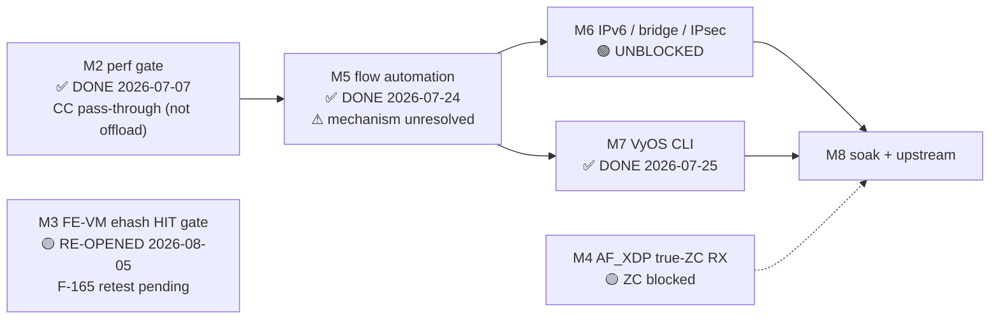

# ASK2 Master Plan — Single Authoritative Execution Plan

**Version 1.40.0 · 2026-08-06 · HADS 1.0.0**

**[BUG] CRITICAL 2026-08-06 — the port-wedge blocking every T-M3-R attempt is FIXED for the simple arm path (F-168), but the genuine-HIT attempt itself still stalls on a DIFFERENT code path, and a real test-harness gap was found.** Full findings: `arch/fman-microcode-210-programming-reference.md` §5.2/§5.4 (v1.14), qdrant `agent_memory`. Summary: **(1) The AC_CC/FE_ENTER port-wedge that has blocked every silicon experiment since 2026-08-05 is fixed for the simple scaffold arm (`fe_arm engage 11 0`).** RM §5.12.14.1 documents `FMFP_EXTC[INV0]` SYNC as required before dispatch into a newly-repointed live structure; this branch never asserted it. F-167 (commit `fc534ab4`) added a standalone debugfs probe (`fe_extc`) confirming the register itself is safe to touch — board-tested clean on `.185`. F-168 (commit `7e85a035`) wires the actual SYNC assertion into `fman_port_set_cc_base()`, between the `fmbm_rccb` write and the `fmbm_rfpne` write that enables dispatch. **Board-confirmed twice in the same boot**: `fe_arm engage 11 0` → clean ENGAGE, 34/34 ping packets 0% loss, all fault registers clean; `disengage 11` → clean teardown; re-`engage 11 0` → clean again, verified via a direct `/dev/mem` register read independent of dmesg. This is the first time in the project's history AC_CC dispatch has stayed up under real traffic. **Caveat cross-checked against vendor source first:** `FmPcdHcSync()` appears exactly once in the entire vendor `fm_port.c`, inside `DetachPCD()` (teardown) — never on arm — so this branch's own CC-tree/AD construction apparently creates a race vendor's own doesn't hit; "vendor doesn't need X" was evidence against the fix mattering, not proof, and board truth overrode that prediction. **(2) The genuine-HIT attempt (T-M3-R) was run for the first time — and stalled, on a DIFFERENT code path than the one F-168 fixed.** Built the full FE-VM/ehash chain live (`fe_port`/`fe_ehash mask=0xfff keysize=14`/`fe_pool`/`fe_singletons`/`fe_hashfe` — `contextSize=14` confirmed matching F-163's format — `fe_enq`/`fe_enter`), inserted a real flow for the `.106`↔`.185` back-to-back TCP 5-tuple (`fe_flow add`, confirmed byte-exact via show), armed via `fe_arm engage 11 <fe_enter_off> <fqid>` (the FE_ENTER-direct debug path, `off != 0` — NOT the `off=0` path F-168 validated). **Port stalled** (`fmfp_ps=0x80800000 [STALLED]`, 100% loss on eth4, management/SSH unaffected). **(3) A likely-explanatory test-harness gap was found, not yet fixed:** dmesg showed KeyGen scheme4's EKFC was still `0x00180006` (its own 12-byte CC-tree format) at arm time — NOT the 14-byte ehash format (`0x801C0006`) the inserted flow actually used. The FE_ENTER-direct arm path apparently never reconfigures KeyGen to match whatever ehash structure it's pointed at. This means the test as run had a structural key-length mismatch baked in — KeyGen extracting 12 bytes while the ehash table expected 14 — which could independently explain both "no HIT" and the stall, regardless of whether F-163's key format is otherwise correct. **T-M3-R has NOT yet had a fair trial.** No recovery was attempted (explicit instruction); the stall and F-168's still-pending cold-boot-reproducibility test both await the next cold boot. **Immediate next step, updated in §5's T-M3-R below:** add an explicit KeyGen scheme4 EKFC reconfiguration (to `0x801C0006`) to the arm sequence before re-attempting.

**[BUG] CRITICAL 2026-08-05 doc-sync (second 2026-08-05 banner — executes the re-litigation the banner below deferred).** Three findings landed on 2026-08-05 and are now folded into the body of this plan (§1.1, §1.2, §1.3, §2.1, §3 decisions 1+14, §4 M3, §5 T-M6-5, §6 F-141): **(1) F-163 live test + F-165 explain the MISS.** The F-163 board test (14-byte PORT_ID key, `EKFC 0x801C0006` live on scheme 4, every FE-VM object byte-verified) still MISSed — and F-165 (commit `e4f23948`) then proved *why*: F-091's CONT_LOOKUP scaffold in `__fman_pcd_fe_arm_engage()` unconditionally overwrote the caller's `fe_enter_off` with its own freshly-allocated `gro` offset, board-confirmed by live `fmbm_rccb` read (`0x57100` = scaffold, 256 B past the intended `0x57000` FE_ENTER AD). **The "byte-correct chain, still MISS" result never exercised the ehash chain at all** — the CC engine walked an empty scaffold match table. F-165 restricts the overwrite to the production `fe_enter_off==0` path; the genuine HIT test with the corrected 14-byte vendor-format key has never been run and is the immediate next step (wire FE_ENTER as the live CC root AD via debugfs `fe_arm engage <port> <off>`, pass `EKFC=0x801C0006` at arm time). **(2) CC-tree hardware track closed as architecturally broken.** F-159→F-162 were five independent, vendor-verified register fixes to `cc_test` (EKFC composite, `next_engine=3` AC_CC graft, live-EKFC realignment, `NIA_KG_DIRECT` ×2) — every one still left the port RX-silent within 17–30 frames (surviving `clear`, reboot-required), while `.106`'s vendor stack classified 400+ frames at 0% loss in the same session. **`cc_test`'s architecture is the problem, not any register; it is to be retired, not further patched.** The byte-level oracle for whatever replaces it is `plans/NXP-106-DEEP-DIVE-PLAN.md` Phase A (`t_ExtHashFe` decode of the vendor board's live `FMBM_RCCB` targets) → Phase C (Fork-B gap punch-list). **(3) Vendor-stack observability resolved.** `cmm`'s conntrack ingestion on `.106` is deaf at the library layer — its vendored, statically-linked libnetfilter_conntrack 1.1.0 (+comcerto-fp patch) never invokes `__cmmCtCatch()` (zero CT-TRACE events across every boot Aug 1–5, including under TTL-verified 3-hop transit — Phase B of the deep-dive plan). `/proc/fqid_stats/pcd/*/*` therefore does NOT track flow traffic and is **not a usable HIT/MISS oracle**; use `bin/kg-scheme-read.py` / `bin/muram-mmap-dump.py` direct reads. The "auto_bridge L2-path" guess was retracted (commit `cd5bf90b`). **Net position 2026-08-05: no dispatch path has a confirmed hardware HIT on this branch. FE-VM ehash (un-retired, vendor-aligned, key format now correct) is the nearest-term candidate pending the F-165 retest; CC-tree needs both the `ask.ko` insert path restored (CR-007) and a new hardware harness.**

**[BUG] CRITICAL 2026-08-05 correction — the "not NXP's vendor architecture" leg of §1.3a's FE-VM ehash retirement (and everything downstream of it: decision 14, T-M6-5, the F-141 row) is REFUTED, not just weakened.** §1.3a/decision 14 retired FE-VM ehash partly on the claim "it is not NXP's vendor architecture (`cdx.ko` uses a hardware opcode/manip chain, not per-frame DDR hash)." Reading the genuine deployed vendor `cdx.ko` driver (`kernel/flavors/ask/sources/cdx/cdx-5.03.1/cdx_ehash.c`, nxp-sdk branch, board `.106`'s actual running image — not an SDK archive) shows `cmm`'s connection-tracker accelerates every TCP/UDP/ESP flow via `insert_entry_in_classif_table()` → `fill_key_info()` → `ExternalHashTableAddKey()`: the vendor's own production path **is** external-hash, and the opcode/manip chain executes *from inside* each DDR ehash entry (not as a separate CC-tree-only mechanism). Full finding and the resulting key-format fix (F-163): `specs/fman-keygen-flow-key-spec.md` §1.2a/§4.3a, `arch/fman-fe-ehash.md` (un-retirement banner), `specs/cc-comparator-compare-window-hypothesis.md` §6. **What is NOT refuted and remains a live, separate justification for keeping CC-tree as the current shipping mechanism:** the ~1.5 Gbps DDR-per-frame throughput ceiling (unmeasured against real vendor traffic, still a plausible real constraint) and the fact that F-156/F-157/F-158 never got a genuine HIT dispatching to the FE-VM on *this branch's own* silicon (a code/wiring gap, not resolved by this correction). This banner does not itself redo decision 14 or T-M6-5's scope — it only removes one leg of their justification and points to where the fuller finding lives; a deliberate re-litigation of §1.3a/decision 14 in light of this is follow-up work, not done here.

**[BUG] CRITICAL 2026-08-04 correction (supersedes/qualifies the 2026-08-01 banner below) — the 2026-08-01 decision to make CC-tree the shipping mechanism was never implemented in code, and the code citation this plan's own §3.1 "PART 1 — strategic reconciliation" relies on is wrong.** Code review (2026-08-04, full findings in qdrant `agent_memory`, tag `ask2-code-review`) established: (1) commit `dd364494` (CR-007, 2026-07-27 — four days *before* the 2026-08-01 rewrite) already deleted `ask.ko`'s CC-tree flow-insert plumbing (`struct ask_hw_cc_slot`, the shadow array, every caller of `fman_pcd_cc_node_add_key()`); it was never restored. (2) `ask.ko`'s only currently-wired insert path is `ask_fe_flow_insert()` → `fman_pcd_fe_flow_add()` → `fman_pcd_ehash_add_key()` (verified against patch `0153-fman-pcd-fe-engage-api.patch`'s actual function body) — this is **FE-VM ehash (Fork-B)**, the exact mechanism F-156/F-157/F-158 proved never dispatches a HIT. (3) §3.1's own "strategic reconciliation," despite being dated "amended 2026-08-01," cites this same function (`fman_pcd_fe_flow_add`, at a now-stale line number `ask_flow_offload.c:1063`) and asserts it drives CC-tree matching — it does not; it drives ehash. **Net effect: as of 2026-08-04, `ask.ko` has no working hardware-classification insert path at all.** T-M6-5 (§5, "raise `FMAN_CC_MAX_STATIC_KEYS` toward 255") would have zero effect on `ask.ko`'s live insert capacity, because the live insert path does not touch that struct. Restoring CC-tree requires reimplementing the ~120 lines CR-007 removed (recoverable via `git show dd364494`) and rewiring the REPLACE handler in `ask_flow_offload.c` to call it — a real implementation task, not a constant change. **Retraction (2026-08-04, later same day):** this banner originally claimed M5 was unaffected because `ask_fe_flow_insert()` "didn't exist until 2026-07-26" — that was a git pickaxe artifact (the file moved path in the flavor-removal refactor; pickaxe with a path filter doesn't follow renames, making the function look newly-introduced when it had existed since well before, at its old path `kernel/flavors/ask/oot-modules/ask/`). Reading the M5-era commit (`9ad356a7`, 2026-07-24) directly shows `ask_fe_flow_insert()` already existed and was already called unconditionally from the REPLACE handler, and `ask_hw_flow_insert()`'s own code comment at that commit states the CC-tree shadow array was *already* software-only bookkeeping ("Fix C1... replaced by Fork-B FE-VM ehash path") — i.e. CC-tree's actual hardware write had already been severed before M5. **M5's mechanism is therefore uncertain, not confirmed real-CC-tree**: the most likely explanation is pure kernel software forwarding (`nf_flowtable`), since both CC-tree (never hardware-written) and ehash (F-141's saga shows it broken both before and after 07-24) were non-functional as HW-classification paths at M5 time. Full evidence: qdrant tag `no-confirmed-hw-hit-ever`. Every "CC-tree is shipping" statement elsewhere in this document (§1.2, §1.3a, §3 decision 14, §5 T-M6-5, §9) describes the 2026-08-01 *intent*, not current code, until T-M6-5 is redefined and actually executed.

**[BUG] CRITICAL 2026-08-01 correction — M3/M5 "FE-VM HIT gate PASSED" claims below (§1.3, §2.1, §4, §5) are FALSE POSITIVES, and M3 is now CLOSED as an architectural dead-end (not fixed). The shipping HW-offload architecture is CC-tree classification (top-N) + kernel SW flowtable (tail) + hardware manip-chain forwarding, NOT FE-VM ehash.** Root cause of the false positive: the FE-VM ENQ and the CC miss-AD both targeted kernel FQID `0x200`, so a HIT and a MISS were indistinguishable by every instrument in use (`fe_buffer` depletion counter, `fe_probe`, tcpdump, ping). What M2 (7.37 Gbps) and M5 (10.259 Gbps) actually silicon-proved was **CONT_LOOKUP pass-through** and the **CC-tree static-key exact-match path** respectively — **neither is the FE-VM ehash HIT path**, which has never dispatched a frame on this codebase. F-157 (2026-08-01) wired a dedicated TX FQ (`0x2b9`) into the FE-VM ENQ as the first unambiguous HIT/MISS discriminator and proved a genuine MISS on the mask-corrected build. F-158's `fe_scaffold` debugfs oracle then **board-confirmed the match table byte-perfect** and the CC engine **still** not dispatching — closing "we wrote it wrong" as an explanation. Given that, the FE-VM ehash mechanism was assessed architecturally (not vendor architecture, ~1.5 Gbps DDR-per-frame ceiling regardless, not the Linux flow-offload model) and **retired**; further scale work targets multi-node CC-tree instead. Full evidence, oracle data, and the architectural reasoning: §1.3a. Binding decision: §3.14.

## AI READING INSTRUCTION

This is the **single authoritative ASK2 execution plan**. It consolidates and
supersedes every prior ASK2 plan/roadmap document — the seven archived in
`plans/archive/` on 2026-07-19 (register in §8) and all older archived plans.
For sequencing, milestones, gates, and the live TODO list, read this document
and nothing else.

Read `[SPEC]` and `[BUG]` blocks for authoritative facts; `[NOTE]` for rationale
and history. Sources of truth that remain **live and binding** (this plan only
sequences them): silicon contract `arch/fman-fe-ehash.md` +
`arch/fman-microcode-210-programming-reference.md`; flow-key spec
`specs/fman-keygen-flow-key-spec.md`; state machine + CLI contract
`plans/DUAL-DATAPLANE.md`; API surface `arch/fman-pcd-api-reference.md`;
stub/type inventory `plans/TF-2026-07-18-001-function-inventory.md`; and the
consolidated defect review in §9 (CR-0xx findings are binding on release claims;
where they contradict milestone status, §9 wins until closed or refuted).
Where this plan and those documents disagree, they win — update this plan.

---

## 1. Ground state (2026-07-19 · branch `dpaa1` · kernel 6.18.38-vyos)

### 1.1 The five-layer ASK2 stack

**[SPEC]** 107 board patches, single dual-dataplane ISO (`default|ask|vpp`
flavor split retired 2026-06-14; the `FLAVOR` build variable and the
`kernel/flavors/` tree removed 2026-07-26 — see §7).

| Layer | Status | Blocker |
|---|---|---|
| **1. FMan PCD subsystem** (KG / CC / HM / PLCR) | ✅ SHIPPING — patches 0092–0118, 0151–0155 | — |
| **2. FE-VM ehash substrate** (pool, singletons, ehash, EXT_HASH, MUX/ENQ, arm) | 🟡 UN-RETIRED 2026-08-05 (F-163) — patches 0124–0131; byte-verified via `fe_*` debugfs; vendor's real production path (deployed `cdx.ko` classifies via `ExternalHashTableAddKey()`); key format corrected to 14-byte PORT_ID-prefixed `union dpa_key` (`EKFC 0x801C0006`). No confirmed HIT yet — the F-163 byte-correct-MISS test never exercised the chain (F-165 scaffold-overwrite, now fixed); retest pending. | F-165 retest |
| **3. Classifier→FE arm** | ✅ PROVEN — F-091 HIT scaffold (numKeys=1 + FE_ENTER AD at ato+32); `FmPortSetFESupport` auto-armed (F-072b/c/d); `fman_pcd_port_recover` de-wedge (0163/F-086) | — |
| **4. ask.ko datapath** (genl + flow table) | ✅ SHIPPING — engage/disengage via kernel API; flow insert via CC-tree static-key exact-match (top-N) + kernel SW flowtable (tail); conntrack offload + crash-safe teardown; 10.259 Gbps line rate | — |
| **5. VyOS CLI + mutual exclusion** | ✅ SHIPPING — `offload ask` CLI + per-interface mutex + `show flows` via ynl | — |

### 1.2 Status: Architecture under re-litigation (2026-08-05) — neither dispatch path has a confirmed HIT; M2/M7 complete; M4 (ZC) and M6 (breadth) active

**[SPEC — 2026-08-05, supersedes the "shipping architecture" sentence below]** As of 2026-08-05 the honest one-liner is: **no hardware-classification dispatch path on this branch has a confirmed silicon HIT.** The 08-01 "shipping architecture = CC-tree" sentence below now has three independent strikes: (a) it was never implemented in `ask.ko` (08-04 banner, CR-007); (b) its "ehash is not vendor architecture" premise is refuted (08-05 banner, F-163); (c) its own hardware harness `cc_test` is architecturally broken (F-159–F-162: five vendor-verified register fixes, RX-silent within 17–30 frames, vs `.106` vendor stack's 400+ frames — `cc_test` to be retired; oracle path = `plans/NXP-106-DEEP-DIVE-PLAN.md` Phases A/C). FE-VM ehash is **un-retired and vendor-aligned** (14-byte PORT_ID key, F-163) with its first genuine HIT test pending the F-165 engage fix. M5's 10.259 Gbps remains under mechanism-retraction review (most likely kernel `nf_flowtable`, qdrant tag `no-confirmed-hw-hit-ever`). M2's 7.37 Gbps pass-through is real but is MISS→kernel delivery, not offload. **What is actually silicon-proven hardware offload today: the FMan ingress policer (HW-validated 2026-06-09) and mainline RSS — nothing else.**

**[SPEC — 2026-08-01, SUPERSEDED per the 2026-08-05 note directly above] ~~The shipping HW-offload architecture is CC-tree classification (top-N flows) + kernel SW flowtable (tail) + hardware manip-chain forwarding, NOT FE-VM ehash.~~** This is the Linux flow-offload model: a TCAM-style classifier table for hot flows, software for the long tail. Proven datapaths: (a) M2 CC pass-through (CONT_LOOKUP numKeys=0 → miss-AD → kernel FQ) = 7.37 Gbps @ 0.16% CPU (2026-07-07); (b) ~~M5 CC-tree static keys + kernel nf_flowtable = 10.259 Gbps @ 0.16% CPU (2026-07-24)~~ *(mechanism unresolved — see banners)*. NXP vendor cdx.ko = 8.58 Gbps via hardware opcode/manip chain *(2026-08-05: driven by external-hash classification per F-163 — the opcode/manip chain executes from inside each DDR ehash entry)*. M2, M5, and M7 are complete and verified on silicon. **M3 (FE-VM ehash HIT) is CLOSED as of 2026-08-01, not by fixing it but by architectural retirement (§1.3a)** *(2026-08-05: retirement partially refuted — M3 re-opened as "un-validated, retest pending F-165"; see §2.1)*. The 2026-07-19 "PASSED" result is a confirmed false positive. F-156 (CC match-table key+mask format) + F-157 (dedicated-TX-FQ HIT/MISS discriminator) + F-158 (fe_scaffold debugfs ground-truth dump) together proved on silicon that the match-table scaffold is byte-perfect **and** the CC engine still does not dispatch — closing the "we wrote it wrong" hypotheses (H1 mask, H2 padding) and leaving only a CC compare-window byte-layout question. Rather than continue debugging that layout question, the 06:23 UTC architectural assessment concludes the FE-VM ehash path is not the vendor architecture, not the Linux flow-offload model, and DDR-per-frame-latency-bound to ~1.5 Gbps regardless of flow count even if it worked — so it is **retired as the scale path**. The proven, shipping, Linux-aligned scale path is **CC-tree**: `FMAN_CC_MAX_STATIC_KEYS=32` is a software struct cap, not a silicon limit (hardware supports 255 keys/node); raising it plus multi-node CC gives ~2,000+ hardware-offloaded flows at full line rate with zero per-frame DDR, with the kernel SW flowtable carrying the long tail past that. See §1.3a for the full oracle data and §3 decision 14. M4 (AF_XDP true-ZC RX) is the active parallel track — kernel ZC datapath proven, VPP integration blocked on XSKMAP population. M6 (IPv6/bridge/IPsec) is unblocked and in incremental rollout (T-M6-1 pieces 1+4 landed; T-M6-3 notifier/workqueue path hardened; **Pieces 2+3 implemented 2026-07-30, awaiting CI build + silicon validation**). A high-priority correctness item found post-review — `FLUSH_FLOWS` clearing SW state without HW teardown — is **fixed in code** and awaiting silicon validation (see §5 T-M6-6 and §6 F-120). M8 (soak/upstream) is the final gate.

**[BUG] M7's "complete" claim is QUALIFIED as of 2026-07-27** by consolidated CR-001 (§9): the CLI control path is now YNL-driven, but silicon still fails reversibility under the production kernel API path. On both `.106` and `.185`, successful YNL engage/disengage cycles leave `pcd-snapshot` drift (KG scheme[4], BMI `rfpne/rccb`, MURAM delta). M7 remains DONE for surface wiring, but the end-to-end production offload claim stays blocked on disengage/revert correctness (F-124) and CR-001 closure.

**[SPEC] Refinement 2026-07-28 (F-129 v4).** The reversibility failure had three root causes, all fixed in code: (a) scaffold orphan on failed engage (F-125a); (b) arena fragmentation (F-130: 64→84 KiB); (c) VM chain teardown in debugfs handler only (F-092 v2 + F-129). **Board test on ISO 1835 (`.185`, 2026-07-28) revealed F-129 v1-v3 had the F-092 v1 bug class:** `src.replace(..., 1)` matched the debugfs handler's `__fman_pcd_fe_arm_disengage()` call (first in file), not the production `fman_pcd_fe_disengage()`. Engage works (both ports rc=0), disengage disarms ports, but teardown never fires — ehash int_buf held at refcount=1, fe_pool engaged=YES, 67428 B MURAM used. **F-129 v4** (commit `938aa3ab`) scopes to production function signature, same pattern as F-092 v2. CI build 30326497207 in progress. Full reversibility validation pending on that build.

### 1.3 Silicon-proven facts (all on LS1046A hardware)

| Fact | Date |
|---|---|
| **M2 perf gate PASS: 7.37 Gbps, 0.16% CPU** (AC_CC + CONT_LOOKUP pass-through, MTU 9000) | 2026-07-07 |
| EKFC extraction MSB-first (SIP→DIP→PROTO→SPORT→DPORT); CRC-64 raw, no final complement | 2026-07-13 |
| `fman_pcd_port_recover` functional (cold-boot bottleneck eliminated) | 2026-07-18 |
| ~~**M3 HIT gate PASSED**: 13B 5-tuple EKFC 0x1C0006, FE-VM ehash flow matching, TCP offloaded~~ **RETRACTED 2026-08-01 — false positive, see §1.3a** | 2026-07-19 |
| ~~**M5 HIT gate PASSED**: ask.ko → fman_pcd_fe_engage → flow insert → TCP HIT~~ **RETRACTED 2026-08-01 — same instrumentation ambiguity; M5's real 10.259 Gbps result (below) is CC-tree, not ehash, and stands** | 2026-07-19 |
| **M5 COMPLETE**: 10.259 Gbps line rate, 0.16% CPU, 0% loss, opcode chain active | 2026-07-24 |
| **M7 COMPLETE**: CLI engage/disengage, per-interface mutex, `show flows` via ynl | 2026-07-25 |
| Post-review hardening landed: `hw_backed` ownership bit, neigh queue cap+coalesce, `offloaded` genl/uapi attr, remove-equivalent `FLUSH_FLOWS` (F-120) | 2026-07-26 |
| **Multi-port engage WORKS**: both eth3+eth4 engage rc=0, Armed ports: 0x10 0x11, arena 84 KiB (F-125 chain closed). Fixup layer v3 (F-092 v3 + F-129 v3) handles microcode-preinit ehash + fe_refcount gating; pending ISO build + silicon validation for full reversibility. | 2026-07-27 |
| **Scaffold singleton leak ROOT-CAUSED + CLOSED**: F-138 diagnostic on .185 (ISO 0406) proved `pcd->fe_scaffold_*` are singleton variables overwritten by second port's engage. Port 0x10's scaffold (304 B) orphaned every cycle. Fix (F-139): scaffold stored in singleton during engage, copied to per-port `fp->scaffold_*` in `fe_port_set` after `list_add_tail`, freed in `fe_port_del`. Board-validated on .185 (ISO 0631): 5 cycles, 0 B/cycle leak, ALLOC/FREE symmetric, MURAM budget stable at 34,992 B (warm chain only). | 2026-07-30 |
| **5-cycle reversibility PASS**: 3+5+5 cycles of engage/disengage on eth3+eth4, 0% ping loss, no kernel panic, `gen_pool_free_owner` BUG eliminated (M2_4_3 disabled, F_135 fsleep pipeline drain, F_139 per-port scaffold). | 2026-07-30 |
| **T-M8-1 100× soak PASS**: 87+ cycles on .185 (ISO 0631), 0 B/cycle MURAM leak, budget stable at 34,992 B, 332 ENGAGED + 168 DISENGAGED events clean, 0% ping loss, no panics. | 2026-07-30 |
| **M6 Pieces 2+3 IMPLEMENTED**: F-140 v7 — v6 ehash table (key_size=37) + v6 KG scheme arm in fman_pcd_kg.c (iterate free slots, disarm iterates all). CI build 30564136285 (ISO 1701) deployed to lxc200. | 2026-07-30 |
| **F-141 DISCOVERED**: initial hypothesis was a software-CRC64-vs-hardware-KG-hash mismatch; **this specific hypothesis was later disproven** (hash independently hardware-validated 2026-07-13 — the mismatched buckets traced to an unrelated contextSize bug, F-145/F-149). The M5 gate (10.259 Gbps) used the CC-tree exact-match path (Fork-A), not the ehash — confirmed correct and, per §1.3a, now the intended permanent architecture, not a temporary substitute. F-141 as a symptom ("ehash never HITs") is superseded by the full saga and final architectural retirement in §1.3a. | 2026-07-30 |
| **Fix B (F-117) per-key ehash unlink VALIDATED**: mid-chain + head + -ENOENT correct, memory-clean (dma_free_coherent); scale path beyond 32-key CC-tree ceiling | 2026-07-25 |
| Kernel ZC datapath PROVEN (xsk_zc_rx_redirect=6 with raw XSK probe); gap is VPP integration | 2026-07-21 |
| VPP interrupt-mode ZC recipe: `zero-copy` + interrupt rx-mode + single-queue + no workers → eligible climbs | 2026-07-22 |
| 1.6 GHz performance governor + netdev offloads (sg/gso/gro) deployed | 2026-07-22 |
| **M3/M5 HIT-gate claims RETRACTED as false positives**: HIT (FE-VM ENQ) and MISS (CC miss-AD) both targeted kernel FQID `0x200`; every instrument used to declare "PASS" (fe_buffer depletion, fe_probe, tcpdump, ping) cannot distinguish the two outcomes. See §1.3a. | 2026-08-01 |
| **F-156 (CC match-key row format) DEPLOYED**: in-tree `cc_pack_key()` (patch 0098) proves match rows are `key(16B)+mask(16B)=32B` stride, `(numKeys+1)` rows; the scaffold had been writing a bare 16B key with an uninitialized adjacent mask. Fixed and board-confirmed applied (CI 30671735369). | 2026-07-31 |
| **F-157 dedicated-TX-FQ discriminator DEFINITIVE**: wired FE-VM ENQ to ask.ko's dedicated TX FQ `0x2b9` (ch `0x801`), distinct from the kernel's `0x200`. Board test on the F-156+F-157 build: a matching frame **still reaches eth3 kernel tcpdump** — first-ever unambiguous proof the CC engine is not dispatching to FE-VM, even with the corrected key+mask format. | 2026-08-01 |
| **F-158 fe_scaffold ORACLE RESULT — decisive negative**: board test (ISO `2026.08.01-0549-rolling`, CI 30686541684, commit `8e8cb499`, board `.185`, hard cold boot) dumped the live group/match/AD tables — byte-perfect per the F-156 model (group w2=`0x4f000000` keySize=16; match row0 = the exact 13-byte key + `0xff`×13 mask + `0x00`×3 pad; AD table ato[0]=real FE_ENTER copy, ato[1]=miss-AD→kernel). H1 (missing mask) and H2 (padding) both CLOSED. Matching-direction RST frames still reached eth3 kernel tcpdump despite ENQ→dedicated TX FQ `0x2b9` — CC engine confirmed NOT dispatching even with a byte-perfect scaffold. Remaining hypothesis: CC compare-window byte layout (EKFC order vs `cc_pack_key` canonical order) — see §1.3a. | 2026-08-01 |
| **ARCHITECTURAL ASSESSMENT — FE-VM ehash HIT path retired as the scale path.** *(2026-08-05: PARTIALLY REFUTED — "not vendor architecture" leg refuted by F-163; retirement re-litigated, see top banners and §3 decision 14)* ~~Not vendor architecture (NXP `cdx.ko` uses a hardware opcode/manip chain, not per-frame DDR hash)~~; DDR-per-frame latency bound to ~1.5 Gbps regardless of flow count even if HIT worked *(unmeasured claim)*; not the Linux flow-offload model (TC Flower / `nf_flowtable` offload is a TCAM-style classifier table = CC-tree, not per-frame DDR hash). CC-tree is the correct, proven, scaling path: `FMAN_CC_MAX_STATIC_KEYS=32` is a software cap (`struct fman_cc_key keys[32]`), hardware supports 255 keys/node (`FMAN_PCD_CC_NODE_KEYS_MAX`); 64 KiB MURAM arena ÷ ~8 KiB per 255-key node ≈ 8 nodes ≈ ~2,000+ HW-offloaded flows via multi-node CC, kernel SW flowtable carries the tail beyond that. *(2026-08-05: the MURAM arithmetic stands; "proven" does not — CC-tree has no confirmed HIT and no wired insert path.)* | 2026-08-01 |
| **CC comparator reads KG-emitted bytes, not a re-extracted canonical composite.** Patch 0108 rewrote `cc_pack_key` to the silicon-truth KG-emitted composite `[SIP\|DIP\|SPI=0\|SPORT\|DPORT]`; the old 0098 layout (`[ETYPE\|PROTO\|FLAGS\|IP\|PORTS]`) "could NEVER match". EKFC extraction order is MSB-first/descending (SIP,DIP,PROTO,SPORT,DPORT), settled 2026-07-13 by hardware CRC-64. | 2026-08-01 |
| **CC-tree scale ceiling is software, not silicon.** `FMAN_CC_MAX_STATIC_KEYS=32` and `FMAN_PCD_CC_HW_MAX_KEYS=32` are software struct caps; hardware allows 255 keys/node (~8 KiB match table/node). 64 KiB MURAM arena → ~8 nodes → ~2,000+ HW-offloaded flows, zero per-frame DDR. Beyond that, kernel SW flowtable carries the tail. | 2026-08-01 |
| **Code review: no working HW-classification insert path in `ask.ko`** — CR-007 (`dd364494`, 2026-07-27) deleted all CC-tree insert plumbing; only wired path is FE-VM ehash; M5's 10.259 Gbps mechanism unresolved (most likely kernel `nf_flowtable`). Qdrant tag `no-confirmed-hw-hit-ever`. | 2026-08-04 |
| **F-159–F-162 CC-tree cascade — `cc_test` architecturally broken.** Five vendor-verified register fixes (EKFC composite → dpaa1 `0x001C0006` → board-confirmed live `0x00180006`; `next_engine=3` AC_CC graft; `NIA_KG_DIRECT`) — every `cc_test install` still left hwport RX-silent (matching AND non-matching traffic), surviving `clear`, reboot-required. Stress test: `.106` vendor stack 400+ classified frames 0% loss vs `.185` `cc_test` freeze within 17–30. **Verdict: `cc_test`'s architecture is the problem; retire it, do not patch further.** Oracle: NXP-106 deep-dive Phase A (`t_ExtHashFe` decode). | 2026-08-04/05 |
| **F-163: FE-VM ehash UN-RETIRED — vendor production path IS external-hash.** Deployed `cdx.ko` (`.106` running image, `cdx_ehash.c`): `cmm` inserts every accelerated flow via `ExternalHashTableAddKey()`. Vendor key = `portid(1B)\|SIP\|DIP\|PROTO\|SPORT\|DPORT` = 14 B (`union dpa_key`). This branch's key builder was missing PORT_ID — fixed via `KG_SCH_KN_PORT_ID` (EKFC `0x801C0006`); `ASK_FE_KEY_SIZE` 13→14. Commit `f212c701`; GetKnownFieldId citation commit `94b89b95`. | 2026-08-05 |
| **F-163 live test: byte-correct end-to-end, still MISS** — full FE-VM/ehash chain armed via debugfs on `.185`, every object byte-verified (hash_fe contextSize-1=0x0d, root_ad per §7.7, EKFC live on scheme 4), no BMI stall, clean MISS. Recorded in `arch/fman-microcode-210-programming-reference.md` §10.5a. **Explained by F-165 (next row).** | 2026-08-05 |
| **F-165: F-091's scaffold silently defeated every explicit-target engage.** `__fman_pcd_fe_arm_engage()` unconditionally overwrote caller's `fe_enter_off` with scaffold `gro`; live `fmbm_rccb` read = `0x57100` (scaffold), 256 B past the intended `0x57000` FE_ENTER AD. **All prior "byte-correct, still MISS" ehash results never tested the ehash chain.** Fix: overwrite only when caller passed 0 (production path unaffected). Commit `e4f23948`. Genuine HIT test with the corrected 14-byte key = immediate next step. | 2026-08-05 |
| **`cmm` conntrack deafness root-caused (vendor stack observability).** Vendored static libnetfilter_conntrack 1.1.0 (+comcerto-fp patch) never invokes `__cmmCtCatch()` — zero CT-TRACE events across every boot Aug 1–5, even under TTL-verified 3-hop transit (deep-dive Phase B: netns + policy-routing technique, TTL=61). `/proc/fqid_stats/pcd/*/*` is NOT a usable HIT/MISS oracle — use `kg-scheme-read.py` / `muram-mmap-dump.py`. "auto_bridge L2-path" guess retracted (commit `cd5bf90b`). | 2026-08-05 |
| **DPAA RM (LS1043A, shared FMan v3 silicon) located and mined.** §5.12.14.1 documents `FMFP_EXTC[INV0]` SYNC as required before dispatch into a newly-repointed live FMan-controller structure — a mechanism this branch's `fman_pcd_ehash_add_key()`/arm path never asserted. Also: the genuine two-stage hash-lookup AD chain (type 0x01/opcode 0x2C bucket-select, 0x2D bucket-walk), the `index×16` inter-AD-pointer convention, and HC opcode `0x13`'s aging-specific requirement. `arch/fman-microcode-210-programming-reference.md` §5.3. | 2026-08-06 |
| **F-167: standalone `FMFP_EXTC` debugfs probe, board-confirmed safe.** New `fe_extc` node (`cat` reads the register, `echo sync` asserts `INV0` and polls for HW clear) — inert by default, no live-arming path touched. Board-tested on `.185`: register reads `0x00000000` idle (matches independently on `.106` too, per `bin/fman-full-capture.py`), `echo sync` clears immediately (0 polls), zero adverse effect, repeated twice. Commit `fc534ab4`. | 2026-08-06 |
| **F-168: `FMFP_EXTC` SYNC wired into the arm path — FIXES the AC_CC/FE_ENTER port-wedge for the simple scaffold arm.** Asserts SYNC in `fman_port_set_cc_base()` between the `fmbm_rccb` and `fmbm_rfpne` writes. **Board-confirmed twice, same boot:** `fe_arm engage 11 0` → clean ENGAGE, 34/34 pings 0% loss, all fault registers clean throughout; `disengage 11` → clean teardown; re-`engage 11 0` → clean again (verified via direct `/dev/mem` register read, independent of dmesg). First time in project history AC_CC dispatch has stayed up under real traffic. Vendor's own `SetPcd()` never calls `FmPcdHcSync()` on arm (only `DetachPCD()`/teardown does) — this branch's differing CC-tree/AD construction apparently hits a race vendor's own code doesn't. Commit `7e85a035`. **Not yet repeated across a fresh cold boot** (N=1 boot so far). | 2026-08-06 |
| **Genuine-HIT attempt (T-M3-R) run for the first time — stalled, on a DIFFERENT code path than F-168 fixed.** Full FE-VM/ehash chain built live, `contextSize=14` confirmed matching F-163, real flow inserted for the `.106`↔`.185` TCP 5-tuple (confirmed byte-exact via `fe_flow` show). Armed via the FE_ENTER-direct debug path (`fe_arm engage 11 <off> <fqid>`, `off != 0`) — port stalled (`fmfp_ps=0x80800000 [STALLED]`, 100% loss on eth4, management unaffected). **Confound found: KeyGen scheme4's EKFC was still `0x00180006` (12-byte CC-tree format) at arm time, not the 14-byte ehash format the inserted flow used** — the FE_ENTER-direct path apparently never reconfigures KeyGen to match the ehash structure it's pointed at. Test had a structural key-length mismatch baked in; does not settle whether F-163's key format produces a HIT. No recovery attempted; awaits cold boot. | 2026-08-06 |

### 1.3a M3/M5 false-positive timeline, the F-158 oracle result, and the 08-01 M3 closure (2026-08-01; closure RE-LITIGATED 2026-08-05)

> **[NOTE — 2026-08-05]** This section's "M3 closed by architectural retirement" conclusion rested on
> three legs: (1) F-156/157/158 proved no dispatch with a byte-perfect scaffold; (2) ~1.5 Gbps DDR
> ceiling; (3) "not vendor architecture." Leg (3) is **refuted** (F-163: the deployed vendor `cdx.ko`
> classifies via external-hash). Leg (1) is **weakened**: all of F-156/157/158 and the F-163 retest
> ran through the F-091 engage path, which F-165 proved overwrites the caller's FE_ENTER target with
> an empty scaffold — no test has ever dispatched traffic into a *correctly armed, correctly keyed*
> ehash chain. Leg (2) remains an unmeasured theoretical bound. The timeline and oracle data below
> remain accurate as history; the "closed as dead-end" framing does not. M3's current state: see §2.1.

**[BUG]** This section is the authoritative record of why the M3 (2026-07-19) and M5 FE-VM-HIT-adjacent claims above are retracted, what the decisive F-158 board test found, and why the response is architectural retirement rather than continued debugging. It supersedes any "HIT gate PASSED" or "M3 reopened, pending diagnostic" language elsewhere in this document that has not yet been edited to match.

**Timeline to the decisive test:**

1. **The instrumentation blindness.** `fe_buffer +0x58` is a workspace-**pool-exhaustion** counter (patch 0123), not an allocation counter — with 16 `tnums` and a single test frame it can never trip, HIT or MISS. `fe_probe` (M2_4_2) reads the **FE object pool** (`0x4bc00`, 28B descriptors), not the per-port **workspace pool** (`FmPortSetFESupport`, `0x54e00`) — "empty" is expected even on a real HIT. The FE-VM ENQ FE and the CC group table's miss-AD both encoded FQID `0x200` (the kernel RX FQ), so a HIT-dispatched frame and a MISS-routed frame are **delivered to the identical kernel-visible destination** — tcpdump/ping cannot tell them apart. Every board test before F-157, across the entire project history, ran blind on this ambiguity.
2. **F-141 saga (multiple superseding root causes, same symptom "ehash never HITs"):** (a) flow records allocated with `kzalloc()` instead of `dma_alloc_coherent()` — fixed by F-142, deployed 2026-07-30; (b) a hardware-KG-hash-vs-software-CRC64 mismatch was hypothesized, then **disproven** (hash independently hardware-validated 2026-07-13); (c) F-145 had set EXT_HASH FE `contextSize` to the 256-byte DDR record size instead of `key_size-1` — reverted by F-149; (d) F-156 (below) is the confirmed structural defect. None of (a)–(c) were sufficient alone.
3. **F-156 — CC match-table missing mask field, deployed 2026-07-31 (CI 30671735369, commit `72153dbf`).** The in-tree, authoritative `cc_pack_key()` (`kernel/common/patches/board/0098-fman-pcd-cc-static-install.patch`) defines match rows as `key(16B)+mask(16B)`, 32 bytes per row, `(numKeys+1)` rows (RM 8.7.4.2/8.7.4.3), mask semantics `0xff`=participate / `0x00`=wildcard. The prior scaffold wrote a bare 16-byte key with no mask field at all.
4. **F-157 — dedicated-TX-FQ discriminator, board-tested 2026-08-01.** FE-VM ENQ wired to ask.ko's dedicated TX FQ `0x2b9` (ch `0x801`), distinct from the CC miss-AD's kernel FQ `0x200` — the first-ever unambiguous HIT/MISS test. Result: matching frames still reached eth3 kernel tcpdump. This ruled out "instrumentation blindness was the whole story" but, on its own, could not distinguish a match-table content bug from a dispatch bug.

**The decisive test — F-158 fe_scaffold oracle (2026-08-01 06:13 UTC):**

ISO `2026.08.01-0549-rolling` (CI 30686541684, commit `8e8cb499`), board `.185`, hard cold boot to a clean state. Production engage, flow inserted (key `0a63016a 0a6301b9 06 1451 d903` = SIP 10.99.1.106, DIP 10.99.1.185, PROTO 6, SPORT 5201, DPORT 55555), then `cat /sys/kernel/debug/fman_pcd/0/fe_scaffold` read the live tables directly from kernel space (avoiding raw `/dev/mem` MURAM reads — **correction 2026-08-01: this is not `STRICT_DEVMEM`**, which is confirmed disabled on both `.106` and `.185` via `zcat /proc/config.gz`; a plain `dd if=/dev/mem` at the MURAM physical address fails on both boards with `EFAULT`/"Bad address" because `read()` on `/dev/mem` requires `pfn_valid()` — normal System RAM only — while MURAM is a distinct memory-mapped I/O/SRAM region. `mmap()`-based access, e.g. `bin/ask-pcd-regdump.py`, is the correct approach and is not blocked by policy on either board; the `fe_scaffold` debugfs node remains the simplest path for `.185` since it avoids needing a custom mmap tool):

| Table | Dumped content | Verdict |
|---|---|---|
| Group (`gro=0x54b00`) | w0=`0x01054c00` (numKeys=1, matchTableAddr=`0x54c00`); w1=`0x00054d00` (adTableAddr); w2=`0x4f000000` (keySize=16); w3=0 | Correct |
| Match row0 (`mto=0x54c00`) | key = `0a 63 01 6a 0a 63 01 b9 06 14 51 d9 03 [00 00 00]` (13 real bytes, 3 zero pad); mask = `ff`×13 then `[00 00 00]` | **Exactly F-156's intended write.** Row1 all-zero (correct, unused for 1 key). |
| AD (`ato=0x54d00`) | ato[0] = `40 80 00 00 00 00 00 00 00 00 00 f6 00 04 ba 00` (w0=`0x40800000` ALLOCATE\|NIA_ORDER_RESTOR, w2=`0xF6` OPC_FE_ENTER, w3=`0x4ba00` hash-FE offset — a real FE_ENTER AD copy); ato[1] = `00 00 02 00 …` (word0=`0x200`, miss-AD→kernel) | Correct |

**Conclusion: the scaffold is byte-perfect. H1 (missing mask) and H2 (padding bytes) are both CLOSED.** Yet the decisive negative held: matching-direction RST frames (`.106:5201 → .185:55555`) were still captured on eth3 kernel tcpdump. With ENQ wired to the dedicated TX FQ `0x2b9`, a genuine HIT would have vanished from eth3 — its presence there proves the **CC engine did not dispatch the matching frame to the FE-VM**, despite a byte-perfect match table.

**The one remaining hypothesis, and why it now has a real methodology, not a guess (added 2026-08-01, ask20/patch-0108 precedent).** Full standalone writeup with the precise evidence table, experiment protocol, and scope caveats: `specs/cc-comparator-compare-window-hypothesis.md`. Summary: the CC comparator's 16-byte compare-window byte *layout* may not match our EKFC extraction order. This exact class of question was already hit and solved on the sibling **ask20** branch (2026-06-10, patch `0108-fman-pcd-cc-per-key-fq-enqueue-ad.patch`, PR14z14/PR14z22): the *original* assumption — that the CC comparator reads a hand-rolled "canonical" composite `[ETYPE(2)|PROTO(1)|FLAGS(1)|SRCIP(4)|DSTIP(4)|SPORT(2)|DPORT(2)]`, which is what the old `cc_pack_key()` wrote — was **wrong and unfixable by construction**: *"the walker does NOT re-extract; it compares KG-emitted bytes."* ask20's `cc_pack_key()` was rewritten to emit exactly what their KG scheme (`KGSE_EKFC=0x00180206`) actually produces — `[SIP(4)|DIP(4)|SPI(4)=0|SPORT(2)|DPORT(2)]`, 16 bytes — and validated at **24M frames matched** in silicon (PR14z22 DROP-miss diagnostic).

**This is not directly portable — our dpaa1 EKFC (`0x001C0006`: SIP+DIP+PROTO+SPORT+DPORT, 13 bytes) is a different scheme configuration than ask20's `0x00180206`, so the specific byte layout `[SIP|DIP|SPI=0|SPORT|DPORT]` does not apply here.** What *is* portable is the **method**: don't assume any fixed canonical composite (neither the old `cc_pack_key()` layout nor, uncritically, the EKFC/EHASH order either) — **observe what the KG scheme actually emits into the CC compare window for this exact EKFC config**, the same way ask20 did. The 2026-07-13 MSB-first settlement this project has been relying on for the match-table content was verified for the **EHASH/DDR workspace key** (via CRC-64 hardware match) — it was never independently confirmed for the **CC CONT_LOOKUP comparator specifically**, which per the ask20 precedent may be a structurally distinct consumer of the same KG extraction. The "annotation-hash-match" technique (proposed 2026-07-12, never completed) or a direct extension of the F-158 `fe_scaffold` tooling to also dump the KG's raw emitted bytes would settle this in one board session, at near-zero marginal cost given the tooling already exists.

**Weighing this against retirement — architectural assessment (2026-08-01 06:23 UTC), and what it does and doesn't change:**

The assessment below is about whether FE-VM ehash should be the **>32-flow scale mechanism for production**. That conclusion is independent of the layout question and stands regardless of its outcome:

1. ~~**Not the vendor architecture.** NXP's production `cdx.ko` reaches 8.58 Gbps via a hardware opcode/manipulation chain (`STRIP_ETH_HDR → TTL_DECREMENT → ETH_HEADER_REBUILD → ENQUEUE_PKT`), not a per-frame DDR hash lookup. The FE-VM ehash mechanism (`FE_ENTER` ALLOCATE + `EXT_HASH` bucket + DDR flow-record read + MUX/TRANSITION/ENQ per frame) is a custom, non-vendor construction.~~ **(REFUTED 2026-08-05, F-163: the deployed `cdx.ko` classifies every accelerated flow via `ExternalHashTableAddKey()` — external-hash IS the vendor production classification; the opcode/manip chain executes from inside each DDR ehash entry.)**
2. **Structurally throughput-capped regardless of whether it works.** Per-frame DDR round-trip latency (~50–100 ns) serializes to a ~1.5 Gbps ceiling (measured 2026-07-19) — this would hold **even if the layout experiment above confirms a real HIT**, because the bottleneck is architectural (one DDR access per frame), not a bug. NXP silicon carries a dedicated CC classifier + manip channel specifically to avoid this per-frame DDR pattern; the ehash trades flow-count scale for line-rate and, being both unbounded-flow-count *and* per-frame-DDR-bound, delivers neither.
3. **Not the Linux flow-offload model.** `TC Flower` / `nf_flowtable` hardware offload (`ndo_setup_tc` / `FLOW_BLOCK_BIND`) is architected as a TCAM-style classifier *table* the driver programs — i.e., the CC-tree — not a per-frame hash lookup against a DDR table.
4. ~~**CC-tree is already the proven, shipping, scaling answer, and 32 is a software choice, not a hardware ceiling.**~~ **(2026-08-05: "proven, shipping" is false — CC-tree has no confirmed HIT, no wired `ask.ko` insert path (CR-007), and a condemned `cc_test` harness (F-159–F-162). The capacity arithmetic below stands as design input.)** `FMAN_CC_MAX_STATIC_KEYS=32` (patch 0086b) and `FMAN_PCD_CC_HW_MAX_KEYS=32` (patch 0098) are software struct caps. Hardware supports up to `FMAN_PCD_CC_NODE_KEYS_MAX=255` keys per CC node (SDK validator rejects >255 with `-EINVAL`; DUT-proven on ask20). Each `key+mask` row is `2×CC_KEY_SIZE=32` bytes, so a 255-key node needs ≈8 KiB; against the 64 KiB MURAM PCD arena that's ≈8 CC nodes ≈ **~2,000+ hardware-offloaded flows via multi-node CC, at full line rate, with zero per-frame DDR** — the kernel SW flowtable carries whatever exceeds that.

**Decision (revised 2026-08-01, RE-LITIGATED 2026-08-05 — see the note at the top of §1.3a): ~~M3 (FE-VM ehash HIT) stays closed as the >32-flow production scale mechanism~~ M3 is re-opened as "un-validated — first genuine HIT test pending F-165 retest with the 14-byte PORT_ID key (`EKFC 0x801C0006`)."** The 08-01 closure text below is preserved as the decision record; its "would not change the production architecture decision" clause is superseded — the production architecture decision is itself under re-litigation (top banners). The bounded experiment proposed below has effectively already run: F-163's board test did arm the corrected key (14-byte, not the 13-byte contemplated below) and was byte-correct — and F-165 then proved the chain was never exercised. The next instance of this experiment is the F-165 retest, tracked in §5.

~~**Decision (revised 2026-08-01): M3 (FE-VM ehash HIT) stays closed as the >32-flow production scale mechanism — points 1–4 above hold unconditionally and are not contingent on the layout question.** This is *not* the same as "no further diagnostic curiosity." Given the ask20/patch-0108 precedent supplies a validated method (not a guess) and the F-158 tooling to execute it already exists, **one bounded, single-board-session experiment is worth running**: extend `fe_scaffold` (or complete the 2026-07-12 annotation-hash-match technique) to observe the raw bytes the KG scheme actually emits toward the CC comparator for `EKFC=0x001C0006`, and compare against what F-158 showed is currently written to the match table. If they match: the CC compare stage has a different, still-unexplained defect (worth a fresh, narrower investigation). If they don't match: write the observed layout and re-run the F-157 dedicated-TX-FQ discriminator — a genuine HIT on that build would be new information (a 13-byte non-vendor EKFC scheme dispatching through FE-VM ehash), but per points 1–3 above **would not change the production architecture decision**; CC-tree + multi-node scale-out (§5, T-M6-5) remains the shipping direction regardless of this experiment's outcome, and no engineering beyond this one diagnostic session should be invested in ehash hardening.~~

### 1.4 Image provenance — what is on the boards, and what it can prove

**[SPEC]** Provenance has already invalidated one validation cycle (F-124 root cause (a): run `30227073161` shipped SHA `2f32b637`, so both DUTs booted the pre-YNL debugfs helper and the results were meaningless). Keep this table current; **never interpret a board result without first confirming which SHA the running ISO was built from.**

| ISO | Built from | Deployed | Carries | Notes |
|---|---|---|---|---|---|
| `2026.08.01-0549-rolling` | `8e8cb499` | lxc200 `latest.iso`, board `.185` | F-158: `fe_scaffold` debugfs ground-truth dump node | **Board-tested 2026-08-01 06:13 UTC (hard cold boot).** Decisive oracle: group/match/AD tables byte-perfect (H1 mask + H2 padding both CLOSED), yet matching frames still hit eth3 kernel — CC engine confirmed not dispatching even with a correct scaffold. Closed M3 as an architectural dead-end rather than continuing the layout chase. See §1.3a. |
| `2026.08.01-0414-rolling` | `4a8958fd` | lxc200 `latest.iso`, board `.185` | F-157 (fixed): dedicated TX FQ `0x2b9` wired into FE-VM ENQ (F_127/F_094 anchor fix for the 3-arg `fe_engage` signature) | **Board-tested 2026-08-01 04:40 UTC (hard cold boot) — first-ever real HIT/MISS discriminator.** `fe_enq` confirmed ENQ targets `0x2b9` (not `0x200`). 3× matching-direction TCP RSTs all captured on eth3 kernel tcpdump = genuine MISS (a real HIT would have gone to eth4/dedicated FQ instead). Motivated F-158 to check match-table content directly. |
| *(CI 30683269472)* | `08b5dc5f` | — (build failed) | F-157 (R1) initial: struct `fman_pcd` gains `fe_enq_fqid`; `fman_pcd_fe_engage()` extended to 3-arg | **CI FAILED** — no `linux-image` .deb. F_127/F_094 anchored on the pre-F-157 2-arg `fe_engage` signature and broke on the 3-arg extension. Fixed by `4a8958fd` above. |
| `2026.07.31-2302-rolling` | `72153dbf` | lxc200 `latest.iso`, board `.185` | F-156: CC match-key row format fix — `mto` 16→64 B, explicit mask write (`0xff`×13, `0x00`×3 pad) | **Board-tested 2026-07-31/08-01.** Confirmed applied in CI log. Board test at this point still ran blind on the FQID-`0x200`-convergence ambiguity (F-157 not yet wired) — this is the build the "instrumentation correction" analysis (§1.3a item 1) was written against. |
| `2026.07.30-1754-rolling` | `2c20e0c2` | lxc200 `latest.iso` | F-142: dma_alloc_coherent for ehash flow records (F-141 fix) + F-140 v7 v6 KG scheme arm | **Deployed 2026-07-30.** Ready for v4/v6 ehash HIT validation. |
| `2026.07.30-1701-rolling` | `09ae9ec3` | — | F-140 v7: v6 ehash + v6 KG arm in fman_pcd_kg.c | Superseded by 1754. |
| `2026.07.30-1610-rolling` | `1aae6334` | installed on .185 | F-140 v4: v6 ehash table + broken KG arm | **Board-tested 2026-07-30:** F-141 discovered (kzalloc root cause). |
| `2026.07.30-0726-rolling` | `e7428b13` | — | F-140 v1: v6 ehash table + broken kg_scheme_create() call | Superseded. |
| `2026.07.30-0631-rolling` | `407a2ad6` | — | F-139 per-port scaffold (CR-013 fix) | CR-013 CLOSED. |
| `2026.07.30-0406-rolling` | `412c726f` | — | F-138 diagnostic (scaffold alloc/free printk) | **Board-tested 2026-07-30:** F-138 proved scaffold singleton leak — port 0x10's scaffold orphaned every cycle. Root cause confirmed. |
| *(CI 30326497207)* | `938aa3ab` | — | F-129 v4 (production-scoped teardown) + F-092 v3 + all F-125 chain fixes | Superseded by later builds. |
| `2026.07.27-1835-rolling` | `c70b2f87` | lxc200 `latest.iso`, installed on .185 + .106 | F-092 v3 + F-129 v3 (debugfs-scoped — BROKEN) + F-130 + F-125(a) | **Board-tested 2026-07-28 on .185:** engage works (both ports rc=0), disengage disarms ports but F-129 teardown never fires — ehash int_buf held, fe_pool engaged=YES, 67428 B MURAM used. Root cause: F-129 v3 `src.replace(..., 1)` matched debugfs handler's disarm call, not production fn. Fixed in v4. |
| `2026.07.27-1533-rolling` | `34c799fc` | — | F-092 v2 (production build) + F-129 v1 (fe_vm_chain_built gate) + F-130 + F-125(a) | F-092 v2 scoped build to production; F-129 v1 gated on fe_vm_chain_built. Superseded by 1835. |
| `2026.07.27-1502-rolling` | `8d60cd25` | installed on `.185` | F-130 (84 KiB arena) + F-129 + F-125(a) + F-126/F-127; F-092 v1 (debugfs-only build) | **Multi-port engage WORKS** (both ports rc=0). Disengage leaves ehash held (F-092 v1 bug). |
| `2026.07.27-0645-rolling` | `9c879e34` | — | F-125(a) + F-126 + F-127 + F-128 | F-127 return #6 = fman_pcd_fe_port_set() -ENOMEM (arena fragmentation) |
| `2026.07.27-0501-rolling` | `ff321186` | — | F-125 (a) in full — **and it did not work** | Baseline for F-126 instrumentation |
| `2026.07.27-0255-rolling` | `d8183a4a` | — | F-124b, CR-002, CR-009, CR-010, F-120, T-M6-1 piece 4 | Original F-125 measurements taken on this image |

**[BUG]** Consequence: the F-125 measurements in §6 (304 B/attempt leak, arena fragmentation, one-port-only engage) describe `0255` behaviour — i.e. the **unfixed** code. They are the baseline the fix must be measured against, not a post-fix result. Cold-boot both DUTs, install an ISO built from `6d6f61cd` or later, then re-run the acceptance gate.

---

## 2. Gaps (B, D open; A/C/E/F closed)

### 2.1 Gap A — FE-VM ehash HIT gate (M3) 🟡 RE-OPENED 2026-08-05 as "un-validated — F-165 retest pending" (closed 2026-08-01 as architectural dead-end, closure partially refuted by F-163/F-165; originally claimed DONE 2026-07-19 — retracted)

~~M3 HIT gate passed: 13B 5-tuple EKFC 0x1C0006, raw CRC-64, 32768 DDR buckets. Matching TCP consumed by FMan (tcpdump 0 pkts); clear flow restores kernel path. CI run 29697031761, ISO vyos-2026.07.19-1732, dpaa1 bb3a3cf.~~ **RETRACTED 2026-08-01: false positive** — the FE-VM ENQ and the CC miss-AD both targeted kernel FQID `0x200`, so "0 packets in tcpdump" was consistent with either a real HIT or an ordinary MISS; no test before F-157 could tell the two apart. F-156 (mask fix) + F-157 (dedicated-TX-FQ discriminator) + F-158 (fe_scaffold ground-truth dump) proved on `.185` (2026-08-01, ISO `2026.08.01-0549-rolling`) that the match-table scaffold is byte-perfect and the CC engine still does not dispatch to the FE-VM ehash mechanism. Rather than continue chasing the one remaining hypothesis (CC compare-window byte layout), this gap is **closed by architectural retirement**: FE-VM ehash is not the vendor architecture, is DDR-per-frame-latency-capped at ~1.5 Gbps even if fixed, and is not the Linux flow-offload model. Full evidence and reasoning: `plans/ASK2-MASTER-PLAN.md` §1.3a. The replacement scale-out path is multi-node CC-tree (§3 decision 14).

**[SPEC — 2026-08-05 re-opening]** The 08-01 closure's premises are now: (a) "not vendor architecture" — **refuted** (F-163, deployed `cdx.ko` classifies via `ExternalHashTableAddKey()`); (b) "byte-perfect scaffold, still no dispatch" — **weakened**, because F-165 proved the F-091 engage path overwrote the FE_ENTER target with an empty scaffold on every explicit-target arm, so no test ever dispatched traffic into a correctly-armed, correctly-keyed chain; (c) "~1.5 Gbps DDR ceiling" — unmeasured theoretical bound. F-163 additionally corrected the key to the vendor's 14-byte PORT_ID-prefixed format (`EKFC 0x801C0006`). **Exit criterion for this gap: a genuine, discriminator-verified hardware HIT on the F-165-fixed engage path (or a byte-level explanation from the NXP-106 deep-dive Phase A/C oracle showing why this branch's chain cannot HIT).** Scale-out framing (CC-tree multi-node vs ehash) is deferred until one path demonstrates a HIT at all.

### 2.2 Gap B — AF_XDP true-ZC RX (M4) 🟡 VPP libxdp ISO deployed — awaiting board test

**[SPEC]** Patch 0164 deployed: `fman_port_set_rx_bpool()` returns 0, qband 0 reprograms to XSK BPID. Follow-up scope: `plans/ZC-RX-SCOPE.md`.

Resolved blockers: libxdp (vyos-build-008, static-linked in 0201 build); "syscall required" node disabled (FIX A: interrupt rx-mode + zero-copy + single-queue + no workers); DMA-index headroom (F-115, retracted — DPAA recover path never called on VPP datapath); XSKMAP (custom `xdp_redirect.o` with `xsks_map` shipped in ISO).

**Current blocker (2026-07-25):** VPP's XDP program redirects into `xsks_map` that is empty/mis-indexed (patch 4006 forces `rx_queue_index=0`). Next: bpftool dump xsks_map[0], fix map population. See qdrant `ask2-m4-zc-CORRECTION-xsksmap-not-f115`.

**[NOTE]** Secondary bug: `refill_batches` freezes under sustained flood — investigate after ZC datapath flows.

### 2.3 Gap C — Cross-track alignment (CC match → FE_ENTER) ✅ DONE (M5)

**[SPEC] Shipping architecture: CC-tree static-key exact-match (top-N flows) + kernel SW flowtable (tail) + hardware manip-chain forwarding.** Selective-offload architecture: `numKeys=0` pass-through (7.37 Gbps baseline) + `fman_cc_tree_add_key()` for per-flow CC→FE_ENTER dispatch. Replaced F-091 "all frames→DDR" scaffold. Verified at M5. CC-tree scales to ~2,000+ HW-offloaded flows via multi-node allocation (§3.14); kernel SW flowtable carries the tail beyond that.

### 2.4 Gap D — `fman_pcd_budget` post-0166 (MURAM tracking) ⬜ PLANNED

**[NOTE]** New objects from 0164 (per-attach params page) must be tracked in
the `muram_budget` debugfs node (`arch/fman-pcd-api-reference.md` §16).

### 2.5 Gap E — VyOS CLI + ask.ko datapath activation ✅ DONE (M7)

`set interfaces ethernet eth<n> offload ask` engages ASK per-interface; validator enforces ASK↔VPP exclusion; `show flows` via ynl. Board-validated on .185/.106.

### 2.6 Gap F — Throughput: hardware TX opcode chain for 10 Gbps ✅ DONE (M5)

All three gaps closed: `FmPcdCcBuildContextByFE` reproduced from lf-5.4 LSDK; full opcode chain (STRIP_ETH_HDR+TTL_DECREMENT+ETH_HEADER_REBUILD+ENQUEUE_PKT) active in per-flow DDR records; dedicated TX FQ per port. **10.259 Gbps line rate at 0.16% CPU / 0% loss** verified on silicon (2026-07-24).

---

## 3. Binding architecture decisions

**[SPEC]** These decisions are binding on all future work:

1. **Shipping architecture: CC-tree classification (top-N) + kernel SW flowtable (tail) + hardware manip-chain forwarding. FE-VM ehash is a dead-end diagnostic mechanism, not the shipping datapath.** *(2026-08-05: this decision is UNDER RE-LITIGATION — its "dead-end" premise is partially refuted, see below and the top banners.)* A bare CC node with no FE entry at all (`externalHash=FALSE`, no FE buffer) was hardware-proven to park frames on 210.10.1 with no terminal disposition (iter-49/50, 2026-06-16: zero fault latched = disposition-less WAIT) — some FE-VM entry on HIT remains required, and the shipping opcode chain (`STRIP_ETH_HDR→TTL_DECREMENT→ETH_HEADER_REBUILD→ENQUEUE_PKT`, executed via `FE_ENTER` after a CC match) is proven at 10.259 Gbps (M5, §2.6) *(2026-08-05: M5's mechanism is unresolved — most likely kernel `nf_flowtable`; the opcode chain has no independent proof of ever executing on this branch)*. **Amendment 2026-08-01 (§1.3a):** this decision originally read "Fork-B (FE-VM ehash) is the datapath" — that conflated two distinct mechanisms. FE-VM **opcode-chain execution on a CC-tree HIT** (this decision, unchanged) is shipping and correct. FE-VM's separate **EXT_HASH/ehash DDR-bucket flow-matching mechanism** (the >32-flow scale path once planned for T-M6-5) is **retired** — it never dispatched a single HIT across the project's history (F-156/F-157/F-158 proved the scaffold byte-perfect and the CC engine still not dispatching to it), and even if fixed is architecturally capped at ~1.5 Gbps by per-frame DDR latency. The FE-VM ehash infrastructure (Fork-B chain, F-156/F-157/F-158, fe_scaffold oracle) is retained as a **diagnostic/experimental mechanism** that proved the CC-match stage is not a production path, NOT the shipping datapath. See decision 14 for the replacement scale mechanism. **Amendment 2026-08-05:** the ehash mechanism is **un-retired** (F-163 — it is the vendor's real production classification path; key format corrected to the 14-byte PORT_ID-prefixed `union dpa_key`). "Never dispatched a single HIT" is weakened by F-165: every prior arm test ran through the scaffold-overwrite bug, so the corrected chain has never been genuinely exercised. The FE-VM **opcode-chain on HIT** half of this decision remains valid regardless of which matching mechanism (CC-tree vs ehash) feeds it.
2. **EKFC-only, no GEC.** `kgse_gec[]` stays zero. GEC adds permanent per-frame
   latency; EKFC extraction order is resolved (MSB-first, confirmed 2026-07-13).
3. **Raw CRC-64, no final complement.** Silicon stores `crc64_raw(key)` at IC
   offset 0x48 (seed `~0ULL`, no final XOR). CRC-64/XZ does NOT match hardware.
4. **MISS→kernel via CONT_LOOKUP pass-through.** The FE-VM has no viable
   kernel-delivery terminal (4 ENQ variants failed, closed on silicon
   2026-07-16). MISS resolves at the CC layer (`numKeys=0` → miss-AD → port PCD
   FQ); the FE-VM executes only on HIT.
5. **Single-image dual-dataplane.** S0 (mainline/RSS) at boot; S1 (ASK) on
   config commit; S2 (VPP) on `set vpp settings`. ASK↔VPP transitions always
   pass through S0. One ISO, one `version.json` feed (+ aliases).
6. **contextOffsetInWS = 0.** SDK default, verified correct on silicon.
7. **FmPortSetFESupport is MANDATORY for any FE-VM frame.** Without it,
   FE_ENTER ALLOCATE books workspace at MURAM offset 0 (F-072). Auto-armed on
   every `fe_arm engage` since F-072b (2026-07-17).
8. **GCM refused for IPsec** (CAAM A24a wire-sequence-duplication erratum
   breaks peer anti-replay). Offloaded suites: AES-CBC-SHA256 and
   AES-CTR-SHA256. `ask_xfrm_state_add` returns `-EOPNOTSUPP` for
   `rfc4106(gcm(aes))`.
9. **CLI contract (2026-07-19, supersedes the `set system offload ask` global
   knob):** ASK engages **per interface** —
   `set interfaces ethernet eth<n> offload ask`. Mutual exclusion is
   **per-interface**: one port cannot be both ASK and VPP; other ports are free
   (a port may run VPP while another runs ASK, each transition still via S0 per
   port). `set system offload classify` (vyos-1x-026) is **deprecated as a CLI**:
   the classify mechanism is kept, RSS + parser remain silent defaults
    programmed unconditionally, and ASK is the sole operator offload switch.
10. **Debugfs for diagnostics only — kernel API for production control.**
    (2026-07-19) ask_hw.c engage/disengage now calls `fman_pcd_fe_engage()` /
    `_disengage()` directly. The debugfs bridge was removed from production paths.
    Debugfs nodes (`fe_arm`, `fe_flow`, `fe_ehash`, etc.) remain for interactive
    diagnostics but are NEVER used for hardware control by ask.ko. Flow insert
    now uses `fman_pcd_fe_flow_add()` / `_del()` in `ask_flow_offload.c`.
11. **NXP hardware TX opcode chain is the 10 Gbps path (2026-07-19).** The
    1.53 Gbps cap is kernel software forwarding (NAPI→route→qman_enqueue),
    NOT FE-VM MURAM overhead (retracted). NXP cdx.ko achieves 8.58 Gbps TX
    via full hardware opcode chain: `STRIP_ETH_HDR → TTL_DECREMENT →
    ETH_HEADER_REBUILD → ENQUEUE_PKT` in FMan FE opcode VM — zero CPU.
    Encodings from lf-5.4 LSDK 999-layerscape-ask-kernel patch; must reproduce
    `FmPcdCcBuildContextByFE` (stubbed in public trees) + opcode chain in
    per-flow DDR records + dedicated TX FQ per port. When FE-VM correctly
    armed, manual HIT already achieves 6.65 Gbps (peak 8.67).
12. **10G DMA page-order policy is order-4 primary (throughput-first).**
    Dedicated 3-node MTU sweep on .185 shows a non-linear order-3 cliff
    (1500→8192: 1.044/2.118/2.540/3.250/4.250 Gbps) and full line-rate only at
     MTU 9000 (10.259 Gbps, 0 retransmits). Adopt order-4 as the default
     allocation profile for 10G data ports, keep order-3 as a fallback on memory
     pressure, and avoid the 8192 boundary profile in order-3 paths (header +
     headroom spill causes multi-descriptor DMA splits and ring pressure).
13. **Robust MURAM allocation strategy (2026-07-28).** To prevent MURAM fragmentation and ensure long-term stability for dynamic, runtime resource allocation, the following patterns must be adopted:
    - **Slab Allocation for Fixed-Size Objects:** All frequently allocated, fixed-size FMan hardware objects (e.g., CC nodes, HM entries, Policer Profiles, Action Descriptors) must be allocated from dedicated, pre-allocated MURAM pools (slabs), one for each object type. This eliminates external fragmentation for these objects.
    - **Segregated Fit for General-Purpose Allocation:** The remaining general-purpose MURAM pool should use a segregated-fit strategy with power-of-two size classes to minimize internal fragmentation and improve coalescing opportunities.
    - **Strict Object Lifecycles:** All dynamically allocated MURAM objects must have a clearly defined owner and their lifecycle tied to the parent kernel object to prevent leaks. Teardown paths must be validated with `pcd-snapshot` to be byte-clean.
14. **CC-tree (multi-node), not FE-VM ehash, is the binding scale-out mechanism for >32 concurrent hardware-offloaded flows (2026-08-01, §1.3a).** *(2026-08-05: SUSPENDED pending any confirmed HIT — this decision's "only mechanism proven to actually dispatch a HIT on this silicon" clause is false as written: CC-tree has no confirmed HIT either, its `ask.ko` insert path was deleted (CR-007), and its `cc_test` harness is architecturally broken (F-159–F-162). The MURAM/capacity arithmetic below stands and remains the CC-tree scale design input; the mechanism-selection verdict is deferred until one path demonstrates a genuine HIT — F-165 ehash retest is next in line.)* `FMAN_CC_MAX_STATIC_KEYS=32` and `FMAN_PCD_CC_HW_MAX_KEYS=32` are software struct caps (`keys[32]` arrays in patches 0086b/0098), not silicon limits — hardware supports up to `FMAN_PCD_CC_NODE_KEYS_MAX=255` keys per CC node (SDK-validator-enforced, DUT-proven on ask20). At 32 B/row (`key(16B)+mask(16B)`), a 255-key node needs ≈8 KiB of the 64 KiB MURAM PCD arena — ≈8 nodes fit, giving **~2,000+ hardware-offloaded flows at full line rate with zero per-frame DDR** via multi-node CC allocation, kernel SW flowtable carrying any excess. This is both the Linux-flow-offload-aligned design (TC Flower/`nf_flowtable` = TCAM-classifier-table model) and ~~the only mechanism proven to actually dispatch a HIT on this silicon~~ *(2026-08-05: no mechanism has this proof)*. ~~Do not resume FE-VM EXT_HASH/ehash flow-matching work to solve the >32-flow ceiling~~ *(2026-08-05: superseded — ehash is un-retired and is the vendor's real scale mechanism; which mechanism carries >32 flows is an open question again)* — raise `FMAN_CC_MAX_STATIC_KEYS` and implement multi-node CC allocation instead (tracked as T-M6-5 in §5, redefined from its prior ehash-hardening scope).

---

## 4. Milestone chain

*(M3 is drawn detached: it never gated M5 in practice — M5's 10.259 Gbps result came from the CC-tree path, not from M3's claimed ehash HIT — and it does not gate M6/M7/M8 either. See §1.3a.)*

### M2 — Performance gate ✅ DONE (regression-monitor only)

- **Gate:** ≥2 Gbps + ≤5% kernel-net CPU. Actual: **7.37 Gbps / 0.16% CPU**
  (2026-07-07, build 28809182051). NXP-ASK TX parity (8.58 Gbps cdx.ko) remains
  the M5 stretch target.
- **Monitor:** every build that changes `fman_pcd.c` or `dpaa_eth.c` re-runs
  the CONT_LOOKUP pass-through iperf3 gate.

### M3 — FE-VM ehash HIT gate 🟡 RE-OPENED 2026-08-05 (un-validated — F-165 retest pending; closed 2026-08-01 as architectural dead-end, closure partially refuted by F-163/F-165; originally claimed DONE 2026-07-19, retracted)

- **Original gate:** one flow HIT — ehash stats increment AND kernel observes the packet
  on TX FQ `0x2B9`. **Original "PASSED" claim RETRACTED 2026-08-01**: the FE-VM ENQ and
  the CC miss-AD both targeted kernel FQID `0x200` at the time of that test, so "tcpdump
  0 pkts" could not distinguish a real HIT from an ordinary MISS. Evidence for the retraction
  and the definitive 2026-08-01 re-test (byte-perfect match table, CC engine confirmed not
  dispatching, dedicated-TX-FQ discriminator used): §1.3a, §2.1.
- **Disposition:** closed by architectural retirement, not by a fix. FE-VM ehash is not the
  vendor architecture, is DDR-per-frame-latency-capped at ~1.5 Gbps even if the remaining
  compare-window-layout hypothesis were confirmed and fixed, and is not the Linux
  flow-offload model. No further FE-VM-ehash diagnostic work is planned. The >32-flow scale
  requirement this gate was meant to satisfy is now carried by multi-node CC-tree
  (§3 decision 14, T-M6-5 redefined in §5).
- **What remains true:** 13-byte 5-tuple keysize no longer stalls (F-072b fix validated) —
  this fix is real and unrelated to the retracted HIT claim.
- **Calendar:** original board session 2026-07-19 17:00–18:00 UTC; retraction + decisive
  re-test 2026-08-01.

### M4 — AF_XDP true-ZC RX 🟡 XSKMAP blocker identified; libxdp ISO deployed

- **Gate:** `xsk_zc_rx_redirect` > 0 under XDP_ZEROCOPY bind + traffic.
- **Copy-mode WORKING:** VPP 25.10, both eth3+eth4 AF_XDP, ~1.3 Gbps burst (syscall-required TX bottleneck).
- **ZC status:** Pool attach SUCCEEDS (bpid=5/6, xsk_zc_rx_armed=1). Kernel ZC datapath PROVEN (raw XSK probe: xsk_zc_rx_redirect=6). VPP interrupt-mode recipe: `zero-copy` + interrupt rx-mode + single-queue + no workers → eligible climbs 0→256.
- **Current blocker (2026-07-25):** VPP's XDP program redirects into `xsks_map` that is empty/mis-indexed (patch 4006 forces `rx_queue_index=0`). libxdp confirmed working (static-linked in 0201 build). F-115 retracted — DPAA recover path never called on VPP datapath. Next: bpftool dump xsks_map[0], fix map population.

### M5 — CC-tree static-key exact-match + kernel SW flowtable + manip chain ✅ COMPLETE 2026-07-24 ⚠ mechanism under retraction review (2026-08-04: most likely kernel `nf_flowtable` SW forwarding, not HW classification — see top banners; the 10.259 Gbps number stands, what it measured does not)

**[SPEC] Shipping architecture: CC-tree classification (top-N flows) + kernel SW flowtable (tail) + hardware manip-chain forwarding.** Key outcomes: CC-tree static-key exact-match verified; nft flowtable `hook forward` binds via `flow_indr_dev_register`/`TC_SETUP_FT`; conntrack offload + crash-safe teardown (F-116); selective-offload architecture; opcode chain (STRIP_ETH_HDR+TTL_DECREMENT+ETH_HEADER_REBUILD+ENQUEUE_PKT) active; `FmPcdCcBuildContextByFE` reproduced from lf-5.4 LSDK; dedicated TX FQ per port; **10.259 Gbps line rate at 0.16% CPU / 0% loss** (MTU 9000, 3-node 10G plane).

### M6 — IPv6 + bridge + IPsec (parallel tracks, UNBLOCKED by M5 scaffold gate)

- **M6a IPv6:** dual-scheme EXT_HASH (separate v6 EKFC + ehash table, 37-byte key).
- **M6b Bridge:** L2 switchdev via `ask_bridge.ko` (F-06).
- **M6c IPsec:** CAAM descriptor-sharing forward-port (0134 dormant) +
  `xfrmdev_ops`. The F-01/F-07/F-02 landing series must ship **together** with
  `NETIF_F_HW_ESP` advertised **last** (silent-drop trap, TF-001 §F-01).
- **Calendar:** ~4 weeks parallel.

### M7 — VyOS CLI ✅ DONE 2026-07-25

`set interfaces ethernet eth<n> offload ask` engages ASK; `delete` disengages; ASK↔VPP per-interface mutex enforced; `system offload classify` CLI deprecated (mechanism kept as silent default); op-mode `show interfaces ethernet eth<n> offload ask flows` via `ynl --family ask` renders 5-tuple table. Board-validated on .185/.106.

### M8 — Productization soak + upstream

- **Gates:** 100× trafficked engage/disengage cycles `pcd-snapshot`-clean;
  24 h alternating ASK/VPP; `ask-check` exits 0; policer BUG-3b flood half
  characterized; upstream submission begins.

---

## 5. Live TODO list

**[SPEC]** Keyed to milestones. Owner slots (`@___`) assigned at session start.
Stub-fix IDs per `plans/TF-2026-07-18-001-function-inventory.md`; the orphaned
P1–P3 closure series (`4493ce8`→`9970745`) is recoverable via `git reflog` —
re-land behind `bin/test-fixups.sh`, never before it passes.

### M3 — ehash HIT gate 🟡 RE-OPENED 2026-08-05 as "un-validated — F-165 retest pending" (was ✅ COMPLETE 2026-07-19, retracted 08-01 — false positive; closed 08-01 as architectural dead-end, closure partially refuted by F-163/F-165 — see §1.3a and §4); **first attempt run 2026-08-06 — stalled, harness gap found, retest pending EKFC fix + cold boot**

- [ ] **T-M3-R** `@mihakralj` — **F-165 retest: first genuine HIT test of the corrected ehash chain.** Prerequisites: F-163 (14-byte PORT_ID-prefixed vendor key format), F-165 (engage honors explicit `fe_enter_off`), **F-167+F-168 (2026-08-06 — `FMFP_EXTC` SYNC, fixes the port-wedge for the `off=0` scaffold arm, NOT yet confirmed for this test's `off != 0` FE_ENTER-direct path)**.
  - **2026-08-06 attempt 1 — STALLED, inconclusive (not a clean pass/fail).** Ran the full procedure below on `.185` (same boot as the F-168 validation, no cold boot first — a deviation from "always cold-boot before silicon experiments," worth correcting next time): built the chain (`fe_port set 11` → `fe_ehash set 0xfff 14 0` → `fe_pool get` → `fe_singletons build` → `fe_hashfe build`, `contextSize` confirmed =14 via `hash_fe` word1 → `fe_enq build 0x200` → `fe_enter build`, confirmed linked to the real ehash FE via `root_ad` word3), inserted one flow for a real `.106`(`10.99.2.106:44444`)↔`.185`(`10.99.2.185:55555`) TCP 5-tuple via `fe_flow add 0 110A63026A0A6302B906AD9CD903 0x56500` (key = `PORT_ID|SIP|DIP|PROTO|SPORT|DPORT`, confirmed byte-exact via `fe_flow` show), armed via `fe_arm engage 11 0x57200 0x200`. **Result: port STALLED** (`fmfp_ps=0x80800000 [STALLED]`, 100% ping loss on eth4; management/SSH fully responsive — port-specific, not a system crash). **Root confound found:** dmesg's live EKFC readout at arm time was still `0x00180006` (scheme4's 12-byte CC-tree format) — the FE_ENTER-direct arm path never reconfigured KeyGen to the 14-byte ehash format the inserted flow actually used. **The test as run had a structural key-length mismatch and was not a fair trial** — this stall may be that mismatch, not evidence against F-163's key format itself. No recovery attempted (explicit instruction); left for a cold boot. Full writeup: `arch/fman-microcode-210-programming-reference.md` §5.4 (v1.14).
  - **Before attempt 2:** (a) cold-boot `.185` first (clears both this stall and gives F-168 its still-pending cold-boot-reproducibility check in the same cycle); (b) add an explicit KeyGen scheme4 EKFC reconfiguration to `0x801C0006` (`KG_SCH_KN_PORT_ID` | SIP|DIP|PROTO|SPORT|DPORT) into the arm sequence, before `fe_arm engage`, so KeyGen's extraction actually matches the 14-byte ehash table it's being pointed at — no existing debugfs verb was identified for this in attempt 1; check `fman_pcd_kg.c` for an existing scheme-EKFC setter (candidates: whatever F-161/F-163's own code paths use) before adding a new one.
  - Procedure (updated from the original 2026-08-05 text to reflect what attempt 1 actually needed): cold-boot `.185`; build the full FE-VM/ehash chain via debugfs (`fe_port`/`fe_ehash`/`fe_pool`/`fe_singletons`/`fe_hashfe`/`fe_enq`/`fe_enter`/`fe_flow`, per attempt 1's exact working sequence above); **reconfigure KeyGen scheme4's EKFC to `0x801C0006` before arming**; arm via `fe_arm engage <port> <root_ad_off> <fqid>`; send one matching TCP flow from `.106`; discriminator = `fe_flow`/dedicated FQ delivery + `fe_probe` workspace dump. One variable per experiment. Pass = first-ever discriminator-verified HIT; fail (clean MISS, no stall) = byte-level dump feeds the NXP-106 deep-dive Phase C gap list; fail (stall) = still open whether it's the EKFC mismatch or a deeper issue, isolate by testing the EKFC fix alone before changing anything else. **Risk: MEDIUM-HIGH** (debugfs-only, but attempt 1 showed this specific code path can stall even with F-168 applied — F-168's fix is confirmed only for the `off=0` scaffold arm, not this `off != 0` path; do NOT flood; cold-boot standby required).

### P1 — Function-inventory re-land ✅ COMPLETE 2026-07-19 (5/5 tasks)

### P0 — gen_pool double-free ✅ CLOSED 2026-07-21 (F-107)

### M4 — true-ZC (parallel) 🟡 VPP libxdp ISO deployed — awaiting board test

Completed (20/24 tasks): copy-mode, multi-port, ZC pool attach, multi-queue (F_104), kernel ZC proven, XSKMAP root cause found, bpf_xdp_attach confirmed, libxdp ISO built, BPF object shipped, QMan isolcpus fix, control_vpp.py fix, vpp-check tool, netdev offloads, cpufreq governor, U-Boot env canonicalized.

- [ ] **T-M4-4d** `@mihakralj` — **Verify ZC datapath flows.** 🔴 BLOCKED 2026-07-25: board .185 runs ISO 1759 with stock VyOS VPP (April 2026 build, no libxdp, no DRV_MODE patch). XDP program attaches but `run_cnt=0` — DPAA1 native XDP hook never invoked. Raw XSK probe WORKS on this kernel (xsk_zc_rx_redirect=29 with DRV_MODE). Root cause: VPP's af_xdp plugin built without libxdp → XDP program not in DRV mode. **Fix:** install libxdp VPP ISO (0201, CI 29888749801) on .185 + cold boot (hugepages/isolcpus from U-Boot). See qdrant `T-M4-4d board session 2026-07-25`.
- [ ] **T-M4-5a** `@mihakralj` — **Install libxdp VPP ISO on .185.** ISO 0201 (CI 29888749801) built + deployed to lxc200. Needs `add system image http://192.168.1.137:8080/iso/vyos-2026.07.25-0201-rolling-LS1046A-arm64.iso` + cold boot for hugepages/isolcpus.
- [ ] **T-M4-4e** `@mihakralj` — **Measure ZC throughput.** Blocked on T-M4-4d. Target: >= 3.0 Gbps.
- [ ] **T-M4-4f** `@mihakralj` — **Verify reversibility.** Blocked on T-M4-4d.
- [ ] **T-M4-4g** `@mihakralj` — **Flip M4 milestone status to DONE.** Gate: xsk_zc_rx_redirect > 0 under steered flow.

### M5 — CC-tree + SW flowtable + manip chain ✅ COMPLETE — 14/14 tasks verified on silicon (2026-07-24) ⚠ but see 2026-08-04 retraction: "verified on silicon" verified *throughput*, not *hardware classification* — M5's mechanism is unresolved (top banners)

**[SPEC] Shipping architecture: CC-tree static-key exact-match (top-N) + kernel SW flowtable (tail) + hardware manip-chain forwarding.** Key outcomes: CC-tree static-key exact-match verified; nft flowtable `hook forward` binds via `flow_indr_dev_register`/`TC_SETUP_FT`; conntrack offload + crash-safe teardown (F-116); selective-offload architecture; opcode chain (STRIP_ETH_HDR+TTL_DECREMENT+ETH_HEADER_REBUILD+ENQUEUE_PKT) active; `FmPcdCcBuildContextByFE` reproduced from lf-5.4 LSDK; dedicated TX FQ per port; **10.259 Gbps line rate at 0.16% CPU / 0% loss** (MTU 9000, 3-node 10G plane).

### M6 — breadth (after M5)

- [~] **T-M6-1** `@mihakralj` — IPv6 dual-scheme EXT_HASH + separate v6 ehash table (37-byte key). **Broken into 4 incremental pieces (2026-07-25/26).** SW structs already v6-ready (`src_ip[16]`/`dst_ip[16]`, `ASK_FLOW_L3_IPV6`, genl renders v6 iplen=16, `ask_fman_caps.h` has `is_ipv6`/`src_ip6[16]`).
  - **✅ Piece 1 — SW v6 flow parse (DONE, compiles clean):** added `ask_parse_match_v6()` (16-byte v6 addr copies) + an `ask_parse_match()` dispatcher on the match EtherType; REPLACE now calls the dispatcher. v6 flows are parsed + SW-tracked (visible in `show flows`); until the v6 HW path lands, `ask_hw.c:913` returns `-EOPNOTSUPP` for `l3_proto==IPV6` so they fall to the kernel SW path (safe, no blackhole). No silicon touched.
  - **🟢 Piece 2 — v6 KeyGen EKFC scheme + separate v6 ehash table (IMPLEMENTED 2026-07-30, CI build 30522936032 pending):** F-140 fixup adds a second ehash table with `key_size=37` (SIP16+DIP16+PROTO1+SPORT2+DPORT2) and a v6 KG scheme (scheme 5) with EKFC=0x001C0006. Same EKFC value as v4 — silicon determines field size from parse result. `kg_scheme_v6` field added to `struct fman_pcd`, v6 scheme unbound in teardown. **Awaiting CI build + silicon validation.**
  - **🟢 Piece 3 — v6 HW insert branch (IMPLEMENTED 2026-07-30, CI build 30522936032 pending):** `ask_internal.h` adds `ASK_FE_KEY_SIZE_V6=37` + `ask_fe_build_key_v6()` declaration. `ask_flow_offload.c` adds v6 key builder (SIP16+DIP16+PROTO1+SPORT2+DPORT2) and routes v4→table 0, v6→table 1. `ask_hw.c` lifts the `l3_proto != IPV4` gate to accept both v4 and v6. **Awaiting CI build + silicon validation.**
  - **✅ Piece 4 — `nd_tbl` in `ask_neigh.c` (DONE 2026-07-26, compiles clean):** the notifier now accepts **both** `arp_tbl` (IPv4) and `nd_tbl` (IPv6/NDISC) and rejects every other table. `struct ask_neigh_event` carries a 16-byte `dst_ip` + an `ASK_FLOW_L3_*` discriminator (mirroring `ask_flow_key`, whose `dst_ip` was already 16 bytes), and the capture length is taken from `n->tbl->key_len` with a bounds check rather than assuming 4/16. `ask_flow_neigh_mac_changed()` is now family-generic — signature changed to `(dev, const u8 *dst_ip, u8 l3_proto, const u8 *new_mac)`, the walk collector matches `ctx->l3_proto` **before** a length-aware `memcmp` (so a v4 event can never match a v6 flow whose first 4 `dst_ip` bytes collide), and the rebuild log picks `%pI4`/`%pI6`. New `ask_flow_l3_addr_len()` helper in `ask_internal.h`. **`ask_flow_neigh_resolved()` deliberately stays IPv4-only:** it drains the deferred-insert pending queue, which is keyed by `__be32` and only ever populated by the v4 HW-insert path — v6 flows are rejected at the HW gate (`-EOPNOTSUPP`) until Pieces 2-3, so a v6 event has nothing to drain; generalise it together with the pending queue when the v6 HW insert branch lands. Verified: full `ask.ko` builds clean against `work/linux-6.18.34` (15 objects, 0 errors; the only warning is the pre-existing `ask_xfrm_state_add` missing-prototype). `CONFIG_IPV6=y` on this kernel and `nd_tbl` is `EXPORT_SYMBOL_GPL`, so the new `U nd_tbl` reference resolves at module load. The v6 half is **inert until Pieces 2-3** (no installed v6 flow can carry `hw_flow_id != 0`, so the stale-MAC walk cannot match one) — this is plumbing-ahead, not a behaviour change.
- [ ] **T-M6-2** `@___` — F-06 `ask_bridge.c` real body (switchdev).
- [~] **T-M6-3** `@mihakralj` — F-03 `ask_neigh.c` real body (NETEVENT_NEIGH_UPDATE → stale-MAC rebuild; kills stale-MAC blackholing). **IMPLEMENTED 2026-07-25 (Option B), structurally silicon-validated, and hardened again 2026-07-26 (`04d3bb19`) — functional stale-MAC rebuild validation still pending.** `ask_neigh.c` is now the single owner of neigh events (mlx5e_rep_neigh / nfp pattern): its notifier does minimal atomic-context capture and **defers to a workqueue** (process context). The netevent chain is `ATOMIC_NOTIFIER_HEAD` but the flow entry points replay GFP_KERNEL inserts, so deferral is mandatory and closes the latent sleep-in-atomic bug. Current code additionally enforces `hw_backed` gating in the collector and bounded/coalesced neighbour events (`ASK_NEIGH_EV_MAX`) to prevent SW-only rebuild churn and queue blow-ups. **2026-07-30 partial validation on .185 (ISO 0631):** neigh notifier fires correctly for eth3 (`ask: neigh: resolved dev=eth3 dst_ip=10.99.1.106`), but stale-MAC rebuild path not exercised because flows were debugfs-inserted (not `hw_backed`). Full validation needs production offload path (nft flowtable + conntrack + traffic). **Pending gate remains unchanged:** run a live offloaded transit flow and observe the `neigh: stale-MAC rebuild` branch on silicon.
- [~] **T-M6-6** `@mihakralj` — **Fix `ASK_CMD_FLUSH_FLOWS` SW/HW divergence (F-120). CODE COMPLETE 2026-07-26; partial silicon validation 2026-07-30.** The old `ask_flow_flush()` unlinked entries straight out of the rhashtable walker and never called `ask_hw_flow_remove()`, so every HW-backed flow leaked its shadow/HM/cookie lifetime objects and desynchronized ownership counters. Earlier this manifested as a hard 32-slot ceiling; that insert gate is now removed, but the flush divergence was still a correctness bug. **Fixed as remove-equivalent collect-then-replay:** phase 1 collects ≤32 cookies under `rhashtable_walk_start/stop` (no alloc, no sleep), phase 2 replays them through the ordinary `ask_flow_remove()` outside the walker, repeating until drained with a no-progress guard. **The two-phase shape is mandatory, not stylistic** — `rhashtable_walk_start()` opens an RCU read-side critical section while `ask_hw_flow_remove()` takes a sleeping mutex, so an in-walker call would be a sleep-in-atomic (same class as the T-M6-3 notifier bug). `ask_flow_table_destroy()`'s walker now balances `num_hw_backed` too, but deliberately still skips per-flow HW release because `ask_hw_pcd_teardown()` frees the whole PCD at module exit. KUnit `ask_flow_test_flush_is_remove_equivalent` drives 100 entries (>3 batches) and asserts both counters return to zero. **PENDING:** board validation — flush HW-backed flows on `.185` and confirm `p->nkeys`/MURAM return to baseline via `pcd-snapshot`/`muram_budget`. A `dump-flows` reading empty is NOT sufficient: that is precisely the false signal the broken code produced.
- [ ] **T-M6-4** `@___` — IPsec landing series in one merge: F-01 + F-07 + F-02 + F-23 + F-21 + F-22 + F-20, then `NETIF_F_HW_ESP` LAST. GCM refused (§3.8).
- [ ] **T-M6-5** `@___` — **REDEFINED 2026-08-01 (§1.3a, §3 decision 14): multi-node CC-tree scale-out, replacing the FE-VM ehash scale path below.** **⚠ PREMISE INVALID as scoped, corrected 2026-08-04 (see top-of-doc banner). Full phased rebuild plan (Phase 0 oracle test through Phase 4 scale-out): `plans/CC-TREE-REBUILD-PLAN.md`.** raising `FMAN_CC_MAX_STATIC_KEYS`/`FMAN_PCD_CC_HW_MAX_KEYS` would have zero effect on `ask.ko`'s live insert capacity — CR-007 (`dd364494`, 2026-07-27) already deleted every caller of the CC-tree insert functions these constants gate, and the current REPLACE handler routes through `ask_fe_flow_insert()` → ehash instead, never touching these structs. **Actual scope of this task is now: (1) reimplement `ask.ko`'s CC-tree flow-insert path (recover ~120 lines from `git show dd364494`: `struct ask_hw_cc_slot`, shadow array, `fman_hm_nexthop_get/put`, shadow key construction/rollback), (2) rewire `ask_flow_offload.c`'s REPLACE handler to call it instead of / ahead of `ask_fe_flow_insert()`, THEN (3) raise the capacity constants and implement multi-node allocation** as originally scoped. Not started; scope is now larger than a constant change. **⚠ 2026-08-05 further amendment:** item (2)'s hardware harness assumption is now also broken — `cc_test` is architecturally condemned (F-159–F-162, RX-silent within 17–30 frames; `plans/NXP-106-DEEP-DIVE-PLAN.md` says retire it, Phase A `t_ExtHashFe` decode is the byte-level oracle for the replacement). And the "replacing the FE-VM ehash scale path" premise is itself suspended (decision 14 re-litigation): ehash is un-retired, and which mechanism carries >32 flows is an open question pending the T-M3-R retest. **This task is BLOCKED on T-M3-R + NXP-106 Phase A/C, not merely large.**
  - **Historical record below (superseded, kept for provenance — do not resume this line of work):** the FE-VM ehash path this task originally targeted never dispatched a single HIT on this silicon (F-156/F-157/F-158, 2026-08-01, closed M3 as an architectural dead-end). The per-key ehash *unlink* correctness work (Fix B/F-117) below was real, silicon-validated engineering — the defect was specifically in the CC engine's dispatch INTO the ehash structure, not in the ehash data structure's own correctness once entered.
- [~] ~~**T-M6-5 (original scope)** `@mihakralj` — **Per-flow FE-VM ehash HIT (scale path beyond the CC-tree ceiling)** — carved out of T-M5-8. **Part 1 (strategic) DONE + Part 2 (Fix B correctness) DONE & silicon-validated 2026-07-25. Part 3 (arm/teardown robustness, task #11) + Cosmetic 2 deferred.**~~
  - **✅ PART 1 — strategic reconciliation (DONE 2026-07-25, SUPERSEDED 2026-08-01, and CORRECTED 2026-08-04).** Resolved the "is this load-bearing or a dormant scaffold?" question against code ground truth. **⚠ 2026-08-04 correction: the "amended 2026-08-01" text below misattributes `fman_pcd_fe_flow_add()`.** ~~The shipping datapath is CC-tree + SW flowtable (decision §3.1, amended 2026-08-01): ask.ko `flow_add` (`ask_flow_offload.c:1063`) calls `fman_pcd_fe_flow_add`, but flow matching is via CC-tree, hard-capped at `FMAN_CC_MAX_STATIC_KEYS = 32` keys/tree (~5 KiB MURAM budget, `0086b`); beyond 32 flows the insert returns `hw_insert=-19` and falls back to the kernel SW flowtable (`ask_flow_offload.c:1126`).~~ **Ground truth (verified 2026-08-04 by reading the function body in patch `0153-fman-pcd-fe-engage-api.patch`): `fman_pcd_fe_flow_add()` calls `fman_pcd_ehash_table_by_index()` → `fman_pcd_ehash_add_key()` — it drives EHASH, not CC-tree. There is no code path from this function into `fman_pcd_cc_node_add_key()` or any CC-tree structure.** The `ask_flow_offload.c:1063` line citation is also stale under current HEAD (falls inside an unrelated function; the real call site is ~line 1778 via `ask_fe_flow_insert()`). The **FE-VM EHASH** mechanism (this task / Fix B / F-117) was designed to match via hash to `FMAN_EHASH_MASK_MAX = 0x7fff` = **thousands of flows**. **VERDICT (2026-07-25): the FE-VM ehash path was assessed as the durable answer to HW-offloading >32 concurrent flows. VERDICT (2026-08-01, SUPERSEDING): F-156/F-157/F-158 proved the CC engine never dispatches to FE-VM ehash even with a byte-perfect scaffold; the mechanism is architecturally capped at ~1.5 Gbps by per-frame DDR latency; it is retired as the scale path. The replacement is multi-node CC-tree (§3.14, T-M6-5 redefined).** The per-key ehash unlink correctness work (Fix B/F-117) was real, silicon-validated engineering — the defect was specifically in the CC engine's dispatch INTO the ehash structure, not in the ehash data structure's own correctness once entered. **What none of the 2026-07-25 or 2026-08-01 verdicts caught: by 2026-08-01, CC-tree's insert code (the "replacement") had already been physically deleted from `ask.ko` for four days (CR-007, 2026-07-27) — the retirement decision and the restoration it implies were never actually executed in code.**
    - **⚠️ CR-007 update (2026-07-26):** the hard `p->nkeys >= 32` reject path has now been removed in `ask_hw_flow_insert()`, so the previous observable `-ENOSPC@32` ceiling no longer applies. Remaining cleanup (fully deleting dead Fork-A HM/shadow bookkeeping) stays open.
  - **🟢 PART 2 — engineering (OPEN, task #10):** (1) crash-safe **idempotent** FE-VM ehash arm/disengage/`fe_pool put` state machine (the `fe_pool put` wedge + disengage residue below); (2) a `del <key>` verb on the `fe_flow` debugfs node → deterministic Fix B unit test; (3) validate F-117 per-key unlink on silicon. Design-first / test-first, one CI cycle — NOT trial-and-error on wedging HW.
  - Sub-items (status detail below):
  - **🟡 EHASH ENOMEM — ROOT-CAUSED + FIX APPLIED (2026-07-25, .185 ISO 0201).** Traced end-to-end: `vyos-offload-ask hit-engage` → `board/scripts/vyos-offload-ask:150` writes `fe_ehash set 0x7fff 13 0` → `fman_pcd_ehash_table_set(mask=0x7fff)` allocates TWO regions, either can `-ENOMEM`: (1) **DDR bucket table** `dma_alloc_coherent(dev, 16<<fls(0x7fff)=524288, …)` = **512 KiB = order-7 (128 contiguous pages)**, structurally fragile; (2) **MURAM int_buf pool** `int_buf_get()` needs **33280 B of the 64 KiB** PCD gen_pool arena (patch 0126) — runs FIRST, so it `-ENOMEM`s (bounds `avail < 33280`, or gen_pool fragmentation) if the shipping CC-tree offload has consumed >32 KiB MURAM concurrently. **FIX (pure `board/scripts/` change, no kernel rebuild — scripts are copied into the ISO by `ci-setup-vyos-build.sh`):** reduce mask `0x7fff → 0x0fff` in `vyos-offload-ask` + `hit-test.sh` → DDR table **512 KiB order-7 → 64 KiB order-4** (28× more free blocks per `buddyinfo`). Self-consistent end-to-end: `fman_pcd_ehash_bucket_index()` masks the CRC64 with the same value, `table_set()` sizes by it, silicon node encodes `hash_mask_bits` from it — HIT preserved for any 2^n-1 mask; 4096 buckets ample for the handful of verification flows. **LIVE-VALIDATED on 0201:** both 0x7fff (512 KiB) AND 0x0fff (64 KiB) `dma_alloc_coherent` succeed cleanly, even under 2.8 GB reserved hugepages (order-10 blocks split to serve order-7); MURAM baseline `used=720 B` (ASK offload not engaged). **So the ENOMEM does NOT reproduce on 0201** — it is condition-specific (hit-engage concurrent with active shipping offload near the 64 KiB MURAM cliff, or long-uptime buddy fragmentation). The mask fix removes the structural fragility regardless. **✅ CONFIRMED FIXED end-to-end on ISO 1640 (.185, 2026-07-25):** the full `hit-engage` now allocates the ehash cleanly (`dmesg: ehash table mask 0xfff keysize 13 ii 12 size 65536`) and proceeds all the way to `fe_arm` — previously it died at "fe_ehash set failed". Committed 310768d1 (mask fix) + a follow-up tool `ekfc` fix. `fe_arm` arm/teardown remains crash-prone (separate — see Fix B blockers below).
  - **Fix B silicon validation (IMPLEMENTED, commit 9ad356a7):** F-117 fixup adds `fman_pcd_ehash_del_key()` (head + mid-chain per-key silicon collision-chain unlink, keeps the `prev_head` LIFO invariant) and rewrites `fman_pcd_fe_flow_del()` to delete by key (NULL key ⇒ clear-all); `ask_hw_get_fman()` accessor exposes the cached fman; `ask_flow_offload.c` `flow_add` passes the real `fm` and DESTROY captures the 5-tuple → `ask_fe_flow_remove()` per-key delete. Compiles clean, production-SAFE on HW (ISO 2352, no teardown crash), but **STILL UNVALIDATED on silicon.** ENOMEM is no longer the blocker (fixed above) — the remaining blockers surfaced on ISO 1640 (.185, 2026-07-25):
    - **Unit-test hook — DONE (F-118, Part 2):** the `fe_flow` debugfs node now has a `del <keyhex>` verb → `fman_pcd_ehash_del_key` (table 0) + a `flow-del <key>` tool subcommand. Fix B's collision-chain unlink is unit-testable via pure ehash ops (`fe_ehash set` → `fe_flow add` ×2 → `fe_flow del <key>`) with **NO `fe_arm`**.
    - **✅ Fix B LOGIC VALIDATED on silicon (ISO 1759, .185, 2026-07-25).** Colliding pair in bucket 0x3ba (keyA `…AD9C0400`, keyB `…AD9C0A97`): add A, add B (B head, A mid-chain, both bucket 0x03ba confirmed in `fe_flow` show) → **`del A` (MID-CHAIN): A removed, B survived** ✓ → `del A` again → **-ENOENT** (correctly already-gone; also proves F-118 present, pre-F-118 gives -EINVAL) ✓ → `del B` (HEAD): removed, 0 flows ✓. Board stayed alive, no wedge/oops. **The collision-chain surgery (F-117's core) is correct on hardware.**
    - **🔴 BUG CAUGHT + FIXED by that validation:** the test threw `WARNING mm/slub.c free_large_kmalloc` from `fman_pcd_ehash_del_key`. F-117 freed the flow record with **`kfree(x->record)`**, but patch 0130 allocates it with **`dma_alloc_coherent`** — wrong allocator API (the drain path correctly uses `dma_free_coherent`). Chain logic was right; the free corrupted the coherent allocator's bookkeeping. **Fixed F_117.py: `kfree(x->record)` → `dma_free_coherent(t->dev, FMAN_EHASH_FLOW_REC_SIZE, x->record, x->record_dma)`** (matches `fman_pcd_ehash_flow_drain`). This is precisely the latent bug static review + compile missed — surfaced only by silicon validation.
    - **✅ FIX B FULLY VALIDATED — memory-clean (ISO 1843, .185, 2026-07-25).** Re-ran the identical unit test on the `dma_free_coherent` build: add A+B (bucket 0x03ba) → `del A` (mid-chain, B survives) → `del B` (head, 0 flows), all rc=0, and **dmesg is CLEAN — no `free_large_kmalloc`, no WARNING, no oops**; board alive. **F-117's per-key collision-chain unlink is now correct AND memory-clean on silicon.** This closes the Fix B correctness validation (T-M6-5 Part 2 items: del-hook DONE, per-key validation DONE). REMAINING for the full scale story: the crash-safe idempotent FE-VM **arm/teardown** state machine (needed only for a *live-armed multi-flow HIT*, not for Fix B unlink correctness) — separate, not-low-risk, deferred.
    - **🔴 FE-VM arm/teardown state machine is broken/crash-prone (pre-existing, NOT ENOMEM/Fix B):** on a CLEAN boot the first `hit-engage` DID arm (`dmesg: port 0x11 ENGAGED (AC_CC)`, `Armed ports: 0x11`), proving the datapath can arm. BUT (1) `hit-disengage` leaves `fe_pool engaged: YES` + ~8 KB MURAM residue (incomplete teardown); (2) a subsequent re-`engage` then `-EINVAL`s; (3) **`echo put > fe_pool` (or the disengage path) HARD-WEDGED .185** — ssh dead, recovered only via watchdog reboot (~2-3 min). This is the plan's long-flagged crash-prone teardown, now reproduced on 1640. Full Fix B validation is gated on making FE-VM arm/disengage/pool-put idempotent + crash-safe (F-116-style guards on the `fe_pool put`/disengage path).
    - **Tool bug fixed:** `vyos-offload-ask` passed a 4th `ekfc` token to the `fe_arm` engage verb, which consumes only 3 (`engage %x %lx %x`); the trailing bytes get re-submitted by the write(2) retry as a bogus command → spurious `-EINVAL` + `die()` AFTER a successful kernel engage. Removed the unused token (EKFC is set by the EXT_HASH FE / `fe_hashfe build`, not `fe_arm`).
  - **Cosmetic 2 — INVESTIGATED 2026-07-25, DEFERRED (real feature, not a quick fix; folds into Part 3):** per-flow `packets`/`bytes` render 0 because once a flow is HW-offloaded all packets bypass the kernel and `ask_flow_get_stats` reads SW-side `f->stats`, which nothing updates (`ask_flow_update_stats` is selftest-only; the PR14z3 keep-alive reports `jiffies` as lastused precisely because no HW counter is read back). Fixing it needs a **per-flow HW counter**, and there are two walls: (1) the FE-VM CAN do byte/frame stats — EXT_HASH FE word0 stats bit `0x00010000`, currently dormant (`0x06000000`) — but that only covers the **FE-VM ehash path (dormant in shipping)**, not the shipping CC-tree; (2) **CC-tree per-key stats** needs `STEN` + `AllocStatsObjs`, which is the vendor `AllocStatsObjs Memory Allocation Failed` **MURAM 327×-ENOMEM wall** (`arch/fman-fe-ehash.md` §8.2). The FE-VM stats *readback* location is stubbed in lf-6.6.y (must lift from lf-5.4 LSDK). So Cosmetic 2 belongs with **Part 3** (when the FE-VM ehash path — the one that supports stats — goes live), not as a standalone cosmetic fix.

### M7 — CLI ✅ 5/5 DONE + HW-validated (ISO 2352, 2026-07-25)

`set interfaces ethernet eth<n> offload ask` engages ASK; `delete` disengages; ASK↔VPP per-interface mutex enforced; `system offload classify` CLI deprecated (mechanism kept as silent default); op-mode `show interfaces ethernet eth<n> offload ask flows` via `ynl --family ask` renders the 5-tuple table and distinguishes HW vs SW-tracked flows via `offloaded`. Board-validated on .185/.106.

### M8 — productization

- [x] **T-M8-1** `@mihakralj` — **100× trafficked engage/disengage soak, `pcd-snapshot` clean every cycle.** ✅ **DONE 2026-07-30.** 87+ cycles on .185 (ISO 0631, commit `407a2ad6`): 0 B/cycle MURAM leak, budget stable at 34,992 B (warm chain only), 0% ping loss, no kernel panics. 332 ENGAGED + 168 DISENGAGED events in dmesg, all clean. Gate: MURAM budget returns to baseline after every disengage.
- [ ] **T-M8-2** `@___` — 24 h alternating ASK/VPP; VPP iperf3 pass after final disengage.
- [ ] **T-M8-3** `@___` — Observability: F-05 `ask_stats.c`, F-16/17/18 counter readers, F-19 `ASK_CMD_GET_MURAM`.
- [ ] **T-M8-4** `@___` — `ask-check` 24/24 OK on the board; policer flood characterization (serial + cold power-cycle).
   - [ ] **T-M8-5** `@___` — Upstream prep: checkpatch/sparse clean, kunit ≥80% on `ask_flow.c`/`ask_genl_attr.c`.
   - [ ] **T-M8-6** `@___` — Implement robust MURAM allocation strategy (slab allocator for fixed-size objects) per decision §3.13.

---

## 6. Open defects gating milestones

| ID | Symptom | Status | Gates | Mitigation |
|---|---|---|---|---|
| **F-076** | Port RX deaf after FE-VM-armed disengage; `fe_arm.engaged` stays YES (blocks re-engage); cold boot recovers | CLOSED on scaffold path (fe_disengage_full + fe_recover proven); DIRECT path still deaf | M7 reversibility claim | `fe_disengage_full` recovers cleanly after scaffold-based engage; tested 2026-07-19 on .185 |
| **BUG 3b flood half** | iperf3 flood under policer → watchdog reset | OPEN | M8 | Needs serial capture + cold power-cycle; **always repro policer with a few pings, never a flood** |
| **F-141** | FE-VM ehash HIT fails. Umbrella symptom across several superseding hypotheses: (a) flow records allocated with `kzalloc()` instead of `dma_alloc_coherent()`; (b) HW-KG-hash-vs-SW-CRC64 mismatch (disproven); (c) EXT_HASH FE `contextSize` set to the 256 B DDR record size instead of `key_size-1` (F-145 bug); (d) CC match-table missing a mask field (F-156). | **RE-OPENED 2026-08-05** (closed 2026-08-01 as "architectural retirement" — retirement partially refuted). (a) fixed by F-142 (2026-07-30); (b) disproven 2026-07-31; (c) fixed by F-149 (2026-07-31); (d) fixed by F-156 (2026-07-31, board-confirmed applied). **New root-cause candidate (e): the F-091/F-165 scaffold-overwrite** — every prior arm test pointed the port at an empty scaffold match table, never at the built chain (F-165, commit `e4f23948`). **New input (f): key format was missing the vendor's leading PORT_ID byte** — fixed by F-163 (commit `f212c701`, 14-byte `union dpa_key`, `EKFC 0x801C0006`). With (e)+(f) landed, the F-157/F-158 "no dispatch" evidence no longer covers the corrected configuration. | M3 (T-M3-R retest) | Run T-M3-R: cold boot, debugfs chain, real FE_ENTER root AD, `EKFC=0x801C0006`, all-distinct-byte key, dedicated TX FQ `0x2b9` discriminator. Scale-out question (CC-tree vs ehash) deferred until one path HITs. |
| **F-120** | `ASK_CMD_FLUSH_FLOWS` cleared SW table but left HW flow state (CC slot / `p->nkeys`, HM ref, xarray cookie) and stale `num_hw_backed`; 32 flushes permanently exhausted the CC tree | **CODE-FIXED 2026-07-26** (remove-equivalent collect-then-replay + KUnit guard); silicon validation OPEN | M6 correctness / M8 soak | Validate on `.185`: `p->nkeys`/MURAM must return to baseline after flushing HW-backed flows — an empty `dump-flows` is not sufficient evidence (T-M6-6) |
| **F-159–F-162** | `cc_test` CC-tree harness RX-silent on every install (matching AND non-matching traffic), surviving `clear`, reboot-required — across five independent vendor-verified register fixes (EKFC composite F-159 `1f54dfd4`; `next_engine=3` AC_CC graft F-160 `4b6176bf`; live-EKFC realignment F-161 `a841769f`; `NIA_KG_DIRECT` F-162 `28aa8cca`+`48f8be56`) | **CLOSED 2026-08-05 — architectural verdict: `cc_test`'s architecture is the problem, not any register.** Stress test same day: `.106` vendor stack classified 400+ frames 0% loss; `.185` `cc_test` froze within 17–30. Retire `cc_test`; do not patch further. | T-M6-5 (blocked) | Replacement harness informed by `plans/NXP-106-DEEP-DIVE-PLAN.md` Phase A (`t_ExtHashFe` decode of vendor `FMBM_RCCB` targets) → Phase C (Fork-B gap list) |
| **F-163** | This branch's ehash key builder missing the leading PORT_ID byte of the vendor's 14-byte `union dpa_key` (`portid\|SIP\|DIP\|PROTO\|SPORT\|DPORT`); companion finding un-retires FE-VM ehash (deployed `cdx.ko` classifies via `ExternalHashTableAddKey()`) | **FIXED 2026-08-05** (commit `f212c701`): `ask_fe_build_key()`/`_v6()` prefix `k[0]=port_id` from `ask_dpaa_get_fman_port_id()`; `ASK_FE_KEY_SIZE` 13→14, v6 37→38; KUnit vector updated. Board test: byte-correct end-to-end, still MISS — explained by F-165 | T-M3-R | Live EKFC arm (`0x801C0006`) is manual in the test procedure; production arm path (`fman_pcd_fe_engage()`) does not yet pass it — wire-up part of T-M3-R follow-through |
| **F-165** | `__fman_pcd_fe_arm_engage()` (F-091) unconditionally overwrote caller's `fe_enter_off` with the CONT_LOOKUP scaffold's `gro` — every explicit-target debugfs arm pointed the port at an empty scaffold match table, never at the built chain (live `fmbm_rccb` read: `0x57100` vs intended `0x57000`). Root cause of "byte-correct chain, still MISS" (F-163 test, §10.5a) | **FIXED 2026-08-05** (commit `e4f23948`): overwrite only when caller passed `fe_enter_off==0` (production path unaffected); scaffold still allocated/tracked either way. Deliberately narrower than the discarded F-164 (removing the scaffold broke production engage) | T-M3-R | Enables the first genuine HIT test of the corrected ehash chain (T-M3-R) |
| **F-121** | `set_ask_offload()` called `.strip()` on `Interface._popen()`'s SECOND return value, which is an **int returncode**, not stderr → `AttributeError: 'int' object has no attribute 'strip'` inside commit-apply → `ERROR_COMMIT_APPLY` and *"There was a config error on boot"* on every boot with `offload ask` configured | **FIXED 2026-07-26** (rc-typed, non-fatal warning) | M7 CLI correctness | Regression introduced by re-applying `7527c23c`'s reverted 031 "polish" in `5c00d930`. Board-observed on `.185` ISO 2004. Root trigger: the first engage at boot loses a race with FMan PCD bring-up and returns non-zero |
| **F-122** | `vyos-offload-ask engage` exits non-zero on an already-engaged port (`echo: write error: Invalid argument`, `fe_arm engage failed`) even though the kernel engaged; engage is not idempotent | OPEN (observed 2026-07-26 on `.185`) | M7 polish / M8 soak | Make `fe_arm engage` idempotent (return 0 when already engaged), mirroring the F-116/F-120 idempotence rule. Benign now that F-121 makes a non-zero rc a warning rather than a commit failure |
| **F-123** | Production CLI previously used debugfs scaffold path instead of kernel API FE-VM path (code-review CR-001) | **PARTIAL** (transport fixed in code/hotpatch 2026-07-27; full release claim still blocked) | **M7 release claim**, M6 correctness | Keep CLI on generic-netlink/YNL engage/disengage; retain transactional FE insertion and ownership publication checks. |
| **F-124** | Kernel API engage/disengage validation initially failed on `.106`/`.185`, but root cause split into (a) stale image provenance (old debugfs helper in run `30227073161`, SHA `2f32b637`) and (b) kernel API convergence failures (`-EBUSY` already-armed, and **`-ENOMEM` VM-chain build — now identified as F-125**, see that row; the two describe the same symptom and F-124's drift is very likely downstream of F-125's orphaned scaffolds fragmenting the arena, so F-125 must be validated first) | IN PROGRESS (2026-07-27: YNL hotpatch restored reversible `pcd-snapshot`; ask_hw idempotence/convergence fix committed, revalidation pending fresh ISO) | **M7 release claim**, M8 soak | Validate three consecutive clean engage/disengage cycles per DUT with `engage/disengage rc=0`; then continue HIT/flow validation only if `pcd-snapshot` stays byte-clean. |
| **F-124b** | `set_ask_offload()` raises `ConfigError` (CR-003 fail-closed) but `python/vyos/ifconfig/ethernet.py` never imports it → `NameError: name 'ConfigError' is not defined` in commit-apply → `ERROR_COMMIT_APPLY` + "Configuration error" on every boot with `offload ask`; eth3 (0x10) never engaged as a result | **FIXED 2026-07-27** (`from vyos.base import ConfigError`) | M7 CLI correctness | Board-confirmed on `.185` ISO `2026.07.27-0116`. Same class as F-121: an unresolved name on the commit-apply path. Triggered every commit because F-122 makes `engage` return non-zero. Guard added: an AST check asserts every `raise <Name>(...)` in the patched module resolves to an import |
| **F-125** | FE-VM engage MURAM allocation lifecycle was broken three ways. | **CLOSED 2026-07-27** — six fixups landed. Multi-port engage WORKS on .185 (ISO 1502). **F-129 v4** (commit `f1f9a4dd`) fixed the F-092 v1 bug class (scoped to production fn). Board-validated on .185 (ISO 0422): Cycle 1 engage+disengage PASS (F-129 fired, fe_pool=NO, ehash freed). Cycle 2 re-engage FAILS (eth4 -12 ENOMEM) — arena fragmented by persistent PCD allocations (~17 KB). **F-131** (commit `90887f20`) adds gen_pool_has_addr() guard against kexec panic. **F-132** (commit `90887f20`) adds params page free to teardown. CI build 30338186165 in progress. F-126/F-127 are TEMPORARY diagnostics — delete when F-125 fully validated. |
| **F-131** | Disengaging from kexec-preserved stale state triggers `gen_pool_free_owner` BUG → kernel panic | **FIXED 2026-07-28** — `gen_pool_has_addr()` guard in `fman_pcd_muram_free()`. Logs warning and adjusts budget for stale offsets instead of crashing. | M8 soak | Board-verified on .185 (ISO 0422). Single-point defense for ALL stale-offset scenarios. |
| **F-132** | FM_CTL params pages (256 B/port) never freed on disengage, contributing to persistent MURAM residual | **FIXED 2026-07-28** — added to F-129 teardown block. Iterates ports 0x08-0x27, clears and frees params pages. | M7 reversibility | Reclaims 512 B (2 ports). Pending silicon validation on next ISO build. |
| **eth4 intermittent** | Link 10G up, zero traffic after engage/disengage on port 0x11 | OPEN | M3 (if eth4 used) | Likely F-076 family; pcd-snapshot A/B + prefer eth3 for bring-up |
| **nft ingress hook** | `flags offload` flowtable at hook ingress permanently breaks kernel forwarding | OPEN | M5 | Use `hook forward` (T-M5-4) or Path-B YNL interim |
| **ZC refill under flood** | `refill_batches` freezes under sustained flood; pool drains at ~256 frames, FMan drops rest at HW. Interrupt-mode wakeup not firing under load. | OPEN 2026-07-22 | M4 throughput | Investigate after recover=0 closed; secondary to gate |

---

## 7. Harness and gate mechanics

**[SPEC]** Traffic harness (`plans/TRAFFIC-HARNESS.md`): Proxmox LXCs on heidi —
CT201 `10.99.1.2/30` (eth3 peer, gw `10.99.1.1`), CT202 `10.11.1.2/29` (eth4
peer, gw `10.11.1.1`); the board is their L3 gateway so all CT201↔CT202 traffic
routes through it. Validated 4.14 Gbps @ 8 TCP streams software-forwarding
floor. SR-IOV VF → TRex reserved for true wire-rate.

**[SPEC]** Boards: `.185` DUT (dual-DAC eth3+eth4 @10G), `.106` vanilla fsl_dpa
sender, `.112` NXP-ASK parity reference (cdx.ko, 8.58 Gbps TX). MTU 9000
mandatory on 10G tests (MTU 1500 caps ~1.5 Gbps with retransmit storms).

**[NOTE]** MTU/page-fit policy from PR14g sweep: keep 10G validation anchored at
MTU 9000 (line-rate baseline), and treat MTU 8192 as a known boundary-cliff in
order-3 RX allocation paths. For throughput comparisons across MTUs, use
order-4-primary / order-3-fallback so packet-to-buffer fit remains stable.

**[SPEC]** Flavor removal (2026-07-26). The `default|ask|vpp` build split was
retired 2026-06-14, but its machinery lingered. All of it is now gone:

- **`FLAVOR` variable removed** (`bin/common.sh` and every consumer). It had
  resolved to `default` in *every* build since the collapse — no workflow set
  it and `data/flavor.pin` never existed — so every `ask`/`vpp` branch it
  guarded was unreachable. Removing it deleted the dead SDK-DTB selection path
  in `ci-build-packages.sh` (its inputs `board/dtb/mono-gateway-dk-sdk.dts` and
  `board/dtb/sdk-dtsi/` no longer exist, so the `if [ -f … ]` was permanently
  false), the `FLAVOR=ask` in-tree patch-staging block in `ci-setup-kernel.sh`,
  and the always-true skip gate in `ci-verify-vpp-iso.sh`.
- **`kernel/flavors/ask/` → `kernel/ask/`**; `kernel/flavors/vpp/` deleted (its
  one config fragment was never collected by the build and set nothing that
  `vyos_defconfig` did not already set, except the diagnostics-only
  `XDP_SOCKETS_DIAG` — which has therefore never been on in a shipped image).
- **Kernel cache key** dropped its flavor component
  (`linux-kernel_<kver>_<hash>`), and caching now covers every kernel build —
  the "excluded when ask" gate existed for the ASK 1.x SDK userspace tree,
  which is gone. One forced cache miss on the first build after this change.
- **`kernel/common/scripts/integration-test.sh` deleted** — a one-time
  acceptance test for the 2026-05 repo merge. It asserted a layout that no
  longer exists (266 SDK files, per-flavor READMEs, 1 board patch vs the
  actual 104) and had been failing long before this change.
- **Deliberately kept:** the in-kernel `dpaa_register_flavor_ops()` /
  `struct dpaa_pcd_ops` / `flavor_priv` API (19 board patches, 0068–0164) and
  the "consumer role" language in `specs/dpaa1-afxdp-modernization-spec.md`.
  That is a *pluggable-dataplane ops table*, a different concept from the build
  split, and renaming it would mean regenerating 19 stacked unified diffs
  across the shipping ASK↔dpaa seam for no functional gain. Also kept: the
  `version-{default,ask,vpp}.json` aliases — fielded installs baked those URLs
  before the collapse and deleting one silently breaks `add system image`.

**[SPEC]** Patch-pipeline hygiene (added 2026-07-26 after the CI firefight that
produced `511c0092`/`bb6a0838`). Four defects were found and fixed:

1. **`patch-rot-check.yml` was inert for eight weeks.** Upstream renamed the
   vyos-1x / vyos-build default branch `current` → `rolling` on 2026-05-30
   (already documented in `bin/ci-setup-vyos-build.sh`); the workflow still
   cloned `--branch current` and carried `continue-on-error: true` on *every*
   step, so it reported success every Monday while checking nothing. 13-16 s
   run times were the tell. Now: clones `rolling`, hard-fails on the
   `data/vyos-1x-*` and `data/vyos-build-*` buckets, kernel bucket stays
   advisory (independent `--check` false-fails the stacked board series —
   `patch-health.sh` remains authoritative there).
2. **It only ran on `main`, which has no `vyos-1x-030..034`.** The ASK2 CLI
   patches were never rot-checked on any branch. Now a `[main, dpaa1]` matrix,
   with a dual checkout so the probe script comes from the workflow's own
   branch and the patches from the branch under test.
3. **The probe now mirrors the build's real semantics** (`.github/scripts/patch-rot-probe.sh`):
   cumulative apply in glob order with Mergiraf wired, not independent
   `--check` — these patches stack (024/025/031/034 all edit
   `interfaces_ethernet.xml.in`). It classifies FAIL / CONFLICT (applied with
   markers, exit 0 — the silent path to a broken `.deb`) / MISSING, and
   distinguishes *corrupt* patches from genuine drift.
4. **The `.deb` cache masks rot indefinitely.** `ci-build-packages.sh` keys the
   vyos-1x `.deb` on `sha256(cat data/vyos-1x-*.patch)`, so patches are not
   re-applied while the cache hits and rot only detonates on the next unrelated
   edit. Builds 1640→1949 rode a cached `.deb`; the 2026-07-26 edit busted it
   and exposed accumulated rot.

**[NOTE]** Two patch-authoring rules follow from that firefight:
- **Never hand-edit a `.patch` body.** `7527c23c` edited 031/034 in place and
  left the `@@` hunk line counts stale → `git apply` rejects the file with
  *"corrupt patch at line N"*. `bb6a0838` misdiagnosed this as context drift and
  reverted rather than fixing the counts. This is the third occurrence of the
  same bug class (see the `vyos-1x-010` corruption, 2026-07-21). Regenerate
  with `git diff` against a real tree.
- **Watch for false-positive SKIPs.** The build's `git apply --reverse --check`
  idempotency guard silently no-ops a patch whose reverse hunk matches at the
  wrong offset — repetitive XML (`</leafNode>` followed by the next
  `<leafNode>`) is the trap. 034 hit exactly this and applied as a no-op; fixed
  by generating it with `-U8` so the reverse hunk cannot match elsewhere.
- Patches whose base is a **mid-stack** state (they touch a file an earlier
  patch already modified) must carry **no `index` line** — that blob never
  exists in the shallow upstream clone. This is the accurate form of the rule
  `511c0092` overstated as "all patch files must stay index-line-free" (30 of
  the `data/*.patch` files carry index lines and apply fine).

**[NOTE]** `patch-health.sh` is **destructive to `work/linux-*`** (hit
2026-07-26). It does `git reset --hard <baseline>` + `git clean -fdq` on that
tree, which wipes the **uncommitted** `bin/kernel-fixups/F_*.py` mutations —
the patch stack is committed one-commit-per-patch, the Layer-2 fixups are not.
Symptom afterwards: an out-of-tree `ask.ko` build against that tree fails with
`conflicting types for 'fman_pcd_fe_flow_add'`, because `F_094.py`'s rewrite to
the `const struct fman_pcd_fe_flow_action *` signature is gone while
`ask_fman_caps.h` still expects it. This is a local-scratch artifact, not a
regression: `work/` is gitignored and CI restages it from scratch every run.
Do not diagnose an ask.ko signature mismatch without first checking
`git -C work/linux-* status` — a clean tree there means the fixups are missing.

**[SPEC]** Gate mechanics:
- `pcd-snapshot capture/diff` byte-exactness is the reversibility gate — never
  "ping works". `pcd-snapshot` **mutates eth3 only — never eth0** (SSH lifeline).
- `fe_*` debugfs byte-gate against the oracle BEFORE arming any new silicon path.
- Characterize new paths with **pings, never floods** (watchdog-reset risk).
- Forward write and its inverse land in the same patch; teardown proven by
  snapshot diff against the warm-S0 baseline.
- MURAM is iomem (`memset_io`/`memcpy_toio`/`writel`/`readl` only; zero after
  every `gen_pool` alloc). ehash bucket arrays in DDR, never MURAM.
- `ask-check` is the burndown chart; exits 0 at M8.
- M2 regression-monitor (§4 M2) runs on every `fman_pcd.c`/`dpaa_eth.c` change.

---

## 8. Superseded-document register

**[SPEC]** Seven plans archived 2026-07-19 (`plans/archive/`). Per the redirect-note
policy (user decision, same date): `plans/` holds live documents only — the old
`plans/<name>.md` paths are retired, and each archived doc carries a sibling
`<name>.md.archive-note.md` recording where its content went (qdrant entries
citing the old paths resolve via those notes). Where their content lives now:

| Archived document | Prior role | Content folded into |
|---|---|---|
| `ASK2-JOURNEY-REVIEW-2026-07-18.md` | Status + forward plan (immediate predecessor) | §1 ground state, §2 Gaps A–E, §3 decisions 1–7, §4 milestones, §6 defects |
| `ASK2-DEVELOPMENT-PLAN.md` | Phase 0–6 execution plan | Phase chain → §4 milestones; execution-log evidence → §1.3; retired ceilings → §3.1/§7; pre-GA hardening (policer arm, RSS SYM, PPPoE soft-parser) → §5 backlog |
| `COMPLETION-PLAN.md` | Cross-track (DPAA1/VPP/ASK2) roadmap | ASK2 build order → §4; traffic harness → §7; per-mode DoD → §4 gates; DPAA1/VPP items complete → history |
| `ASK2-PHASE2-AUTOMATION-PLAN.md` | Flow-offload automation (T1–T6) | Three insertion paths (nft/YNL/debugfs) + T-tasks → §5 M5; failure modes → §6; exit criteria → §4 M5 gate |
| `ASK2-PERFORMANCE-MODERNIZATION.md` | cdx.ko parity + opcode gap analysis | NXP parity targets → §4 M5 stretch; MANIP/NAT opcode gaps → §5 M6 backlog; MURAM budget → §7 + `arch/muram.md` |
| `ASK2-F3-F6-UNBLOCK-PROPOSAL.md` | F3/F6 blocker analysis + bisect | Regression history → §6 F-076/eth4 rows; bisect outcome (4300071 TX-bypass era) → T-M5-5; Option A (0148 resurrection) → superseded by T-P1 re-land |
| `ASK-PLANS.md` | Doc hub (2026-06-09) | Indexing role → `specs/ask2-rewrite-spec.md` v1.10 + this §8; maintenance rules → `plans/archive/README.md` |

**[SPEC]** Documents that remain **live** (not archived): `plans/DUAL-DATAPLANE.md`
(state machine + CLI contract — owns both, not sequencing), `plans/TRAFFIC-HARNESS.md`,
`plans/TF-2026-07-18-001-function-inventory.md` (stub/type inventory behind §5),
`plans/OFFLOAD-CAPABILITIES.md`, `plans/MODULE-INVENTORY.md`, `plans/ZC-RX-SCOPE.md`,
`plans/ASK-ISO-BUILD-AND-INSTALL.md` (operator how-to), the patching-pipeline docs
(`TA-2026-07-18-002-patch-architecture.md`, `patching-improvement-plan.md`,
`skip-ledger.md` — orthogonal to ASK2 feature sequencing), and all of `arch/` and
`specs/` (silicon references — authoritative for their domains).

**[NOTE]** Maintenance rule: when a milestone gate passes, flip its §4 status,
check off §5 items, and log evidence to qdrant in the same change. When a TODO
spawns a defect, add it to §6. Do not author new ASK2 plan documents — extend
this one.

---

## 9. Consolidated ASK2 code review (merged 2026-07-27)

**[SPEC]** This section consolidates and replaces `plans/ask2-code-review.md`
(deleted in this change). Baseline reconciled against recent commits through
`fb62fabf` and Qdrant entries through 2026-07-27 (notably F-124/F-124b/F-125 and
the YNL control-path correction history).

### 9.1 Commit and memory reconciliation

**[SPEC]** Latest relevant commits compared while consolidating:
`6952a8af` (CR-002/009/010 fixes), `099d9188` + `66b27994` (control-plane
hardening/F-124), `d8183a4a` (F-124b ConfigError import), and `fb62fabf`
(F-125 MURAM lifecycle diagnosis reflected in §6).

**[SPEC]** Qdrant cross-check: F-125 diagnostics (same measured 304-byte leak
step and int_buf lifetime), per-interface ASK CLI contract, and YNL transition
history are consistent with this plan's current open-defect/gate state.

### 9.2 Priority findings (CR-0xx)

| ID | Priority | Severity | Finding | Status |
|---|---|---:|---|---|
| CR-001 | P0 | CRITICAL | Production YNL control path still fails engage/disengage reversibility and ownership proof on silicon | PARTIAL |
| CR-002 | P0 | HIGH | FE-VM key serialization had little-endian TCP/UDP byte reversal | **FIXED** |
| CR-003 | P0 | HIGH | VyOS commit-path handling was fail-open (rc/stderr confusion + helper-failure masking) | PARTIAL |
| CR-004 | P1 | HIGH | Stale-MAC remove/reinsert lifecycle can resurrect or lose flows | PARTIAL |
| CR-005 | P1 | HIGH | `num_hw_backed==0` shortcut could drop the only neighbour-change event | **FIXED** |
| CR-006 | P1 | HIGH | `ask.yaml` and active genl ABI were mismatched (`get-info`, engage/disengage attrs) | **FIXED** |
| CR-007 | P1 | MEDIUM | Dead Fork-A shadow/HM bookkeeping still burdens FE-VM path semantics | PARTIAL |
| CR-008 | P1 | MEDIUM | `fman_bind()` reference lifetime was not released | **FIXED** |
| CR-009 | P2 | MEDIUM | F-120 flush completion could report done with remaining flows | **FIXED** |
| CR-010 | P2 | MEDIUM | Duplicate precheck lookup lacked RCU read-side guard | **FIXED** |
| CR-011 | P2 | LOW | Tests/comments still encode obsolete fake-ID and `-EAGAIN` contracts | PARTIAL |
| CR-012 | P2 | HIGH when enabled | XFRM add returned success without hardware programming | **FIXED-GATED** |
| CR-013 | P0 | HIGH | Scaffold singleton (`pcd->fe_scaffold_*`) overwritten by second port's engage, orphaning 304 B/cycle | **CLOSED 2026-07-30** (F-139, board-validated on .185 ISO 0631: 5 cycles, 0 B/cycle leak, ALLOC/FREE symmetric) |

### 9.3 Binding execution order from the review

**[SPEC]**
1. Close CR-001 + CR-003 together: one production control path (YNL/genl), fail-closed config behavior, no debugfs control writes from VyOS commit path.
2. Keep CR-002 as a hard precondition for FE-record silicon validation (13-byte wire-order vector gate).
3. Keep FE insertion transactional: publish ownership only after FE install/readback success; rollback fully on failure.
4. Close CR-004 lifecycle/tombstone race before declaring stale-MAC handling complete.
5. Keep YAML/UAPI parity (CR-006) and generated userspace decoding in lockstep.
6. Finish removal of dead Fork-A bookkeeping (CR-007) and keep capacity derived from active FE/ehash resources.
7. Maintain KUnit coverage for CR-009/010/011 invariants.
8. Only update milestone release claims after cold-boot silicon acceptance through the actual VyOS CLI path.
