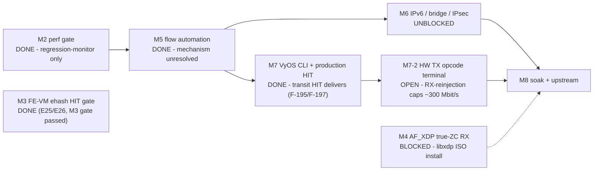

# ASK2 Master Plan — Single Authoritative Execution Plan

**Version 2.22.0 · 2026-08-15 · HADS 1.0.0**

## AI READING INSTRUCTION

This is the **single authoritative ASK2 execution plan**. For sequencing,
milestones, gates, and the live work program, read this document and nothing
else. `[SPEC]` = binding facts and requirements; `[NOTE]` = rationale;
`[BUG]` = defect (symptom + cause + fix).

Sources of truth that remain **live and binding** (this plan only sequences
them): silicon contract `arch/fman-microcode-210-programming-reference.md` +
`arch/fman-fe-ehash.md`; flow-key spec `specs/fman-keygen-flow-key-spec.md`;
state machine + CLI contract `plans/DUAL-DATAPLANE.md`; API surface
`arch/fman-pcd-api-reference.md`; CC-tree rebuild `plans/CC-TREE-REBUILD-PLAN.md`;
vendor oracle `plans/NXP-106-DEEP-DIVE-PLAN.md`; stub/type inventory
`plans/TF-2026-07-18-001-function-inventory.md`. Where this plan and those
documents disagree, they win — update this plan.

---

## 1. Current state (branch `dpaa1` · diagnostic DUT `.185`: kernel `6.18.44-vyos`)

### 1.1 Position

**[SPEC]** The FE-VM ehash path has discriminator-verified manual silicon HITs
(E25/E26) and a production nft/YNL flowtable HIT (F-195/F-197, 2026-08-15).
The production path carries end-to-end transit loss-free through 200 Mbit/s,
but all HIT reinjection currently targets one literal PCD base FQID and one
QMan portal/CPU; loss starts near 300 Mbit/s and 500 Mbit/s can hard-wedge the
FMan. The only release-ready silicon offload remains the **FMan ingress
policer** and **mainline RSS** until T-M7-2 replaces RX reinjection with the
hardware TX opcode terminal.

| Dispatch path | Status |
|---|---|
| **FE-VM ehash** (the vendor's production mechanism) | Code complete. **Topology resolved 2026-08-07: direct `RCCB→FE_ENTER` (not the `CONT_LOOKUP` group-AD RM §7.11 suggested) is vendor's real mechanism** — confirmed by reading `fm_cc.c`'s `copy_td_to_ccbase()`, which writes the ehash node directly into the CC-tree root's own AD slot, no group-AD indirection. Group-AD topology independently confirmed dead 3 ways (F-157/158, T-M3-R attempt 5, this session's F-175). **Key-format CLOSED (2026-08-06/07/08) and full-path VERIFIED (2026-08-12, E25/E26): the vendor's 14-byte `portid`-prefixed key (EKFC=`0x801C0006`, `PORT_ID=0x00` for eth4/port 0x11) is HW-confirmed via CRC-64 hash match, and the complete HIT path (extraction → hash → bucket → chain walk → opcode-script enqueue → kernel) delivers on silicon.** **Production nft/YNL flowtable HIT now delivers too (2026-08-15, F-195/F-197): eth3→`0x200`, eth4→`0x300` own-port targets, `[HW_OFFLOAD]` transit loss-free ≤200 Mbit/s.** M3 gate passed. **OPEN throughput defect (2026-08-15): every HIT enqueues to the single literal PCD base FQID, serviced by one QMan portal/CPU — loss onset ~300 Mbit/s, hard FMan wedge ≥500 Mbit/s (§4.2 T-M7-2).** See §3/§4.1/§4.2 and `decomp/fman-ehash-process.md` (E24–E27 evidence).
| **CC-tree classification** | No confirmed HIT. `ask.ko` insert path deleted (CR-007). `cc_test` harness architecturally broken — **retired, do not patch further**. Replacement harness pending the NXP-106 deep-dive oracle (§4.2). |
| M5's 10.259 Gbps | Real throughput number; **mechanism unresolved** — most likely kernel `nf_flowtable` software forwarding, not hardware classification. Do not cite it as HW-offload proof. |
| M2's 7.37 Gbps CC pass-through | Real — but it is MISS→kernel delivery (CONT_LOOKUP numKeys=0), not offload. |

**[SPEC]** Which mechanism carries >32 concurrent hardware-offloaded flows
(CC-tree multi-node vs FE-VM ehash) is an **open question**, deferred until one
path demonstrates a genuine, discriminator-verified HIT (§4.1, §4.4).

### 1.2 Layer status

| Layer | Status |
|---|---|
| 1. FMan PCD subsystem (KG / CC / HM / PLCR) | Shipping — patches 0092–0118, 0151–0155 |
| 2. FE-VM ehash substrate (pool, singletons, ehash, EXT_HASH, MUX/ENQ, arm) | Code complete. Manual E25/E26 proved a discriminator-verified silicon HIT, but F-192 production-adjacent diagnostics remain incomplete; the warm shared diagnostic chain is singleton-global and must be reused rather than rebuilt. |
| 3. Classifier→FE arm | Direct vendor-node arm is proven. The manual `.185` eth3 arm explicitly applies scheme-4 EKFC and tears down safely; the retained chain is byte-readable. The fixed-tuple SPC capture proves KeyGen scheme-4 traversal but not the succeeding FE workspace/writeback stage. |
| 4. ask.ko datapath (genl + flow table) | Control plane and production insert path are wired: YNL/genl engage/disengage; nft flowtable `REPLACE`; 14-byte ehash insertion; both directions `[HW_OFFLOAD]`. **Transit HIT now delivers end-to-end (2026-08-15, F-195/F-197):** F-195 passes the real ingress port (`0x10`/`0x11`, not the table index), F-197 resolves the own-port PCD base FQID when the params-page default is zero (eth3→`0x200`, eth4→`0x300`), and bounded UDP transit is loss-free through 200 Mbit/s. **Remaining defect is throughput, not correctness:** the FE terminal reinjects each HIT to the port's own kernel RX FQ, so the frame re-enters single-CPU software forwarding (binding-fact-9 ~1.5 Gbps ceiling). The production terminal is the hardware TX opcode chain to a dedicated per-port TX FQ (§4.2 T-M7-2). |
| 5. VyOS CLI + mutual exclusion | Shipping — `offload ask` per-interface, ASK↔VPP mutex, `show flows` via ynl. Release claim gated by CR-001 (§5) |

### 1.3 Binding silicon facts (settled on LS1046A hardware — do not re-litigate)

**[SPEC]**

- **EKFC extraction is MSB-first:** SIP→DIP→PROTO→SPORT→DPORT (+PORT_ID
  sorting first as the highest set bit, when present).
- **KG hash = raw CRC-64** (ECMA-182, reflected poly `0xC96C5795D7870F42`),
  seed `~0ULL`, **no final complement**; stored at IC offset `0x48`.
  CRC-64/XZ does NOT match hardware.
- **This branch's flow key is 14 bytes, CLOSED 2026-08-06/07/08:**
  `PORT_ID|SIP|DIP|PROTO|SPORT|DPORT`, EKFC `0x801C0006`, `PORT_ID=0x00` for
  eth4/port 0x11 — hardware-CRC-64-validated 3 independent times (2026-08-06
  184,320-candidate brute force discovery; 2026-08-07 16-candidate 0x00-0x0f
  batch test; 2026-08-08 independent re-confirmation via passive
  `hash_probe`, bit-for-bit identical hash across sessions). **F-163's
  14-byte `portid`-prefixed variant (EKFC `0x801C0006`, commit `f212c701`)
  was RIGHT, not wrong** — the 2026-08-06 "reverted, GEC conflation" episode
  (below) was itself corrected the next day: `<combine portid="true".../>`
  was proven (2026-08-07, reading vendor's real FMC source —
  `FMCPCDReader.cpp`/`FMCPCDModel.cpp`/`FMCCModelOutput.cpp`) to build the
  KeyGen "extractedOrs"/OR-Data-Vector array (FQID-only, unrelated to the raw
  comparison key), a structurally different mechanism from
  `KG_SCH_KN_PORT_ID` (EKFC bit 31), which genuinely IS part of the raw
  comparison key via `GetKnownFieldId()` sorting it first. Vendor's own key
  IS 14 bytes (`union dpa_key`) — and this branch's key now matches it
  exactly, byte-for-byte, HW-confirmed. **A properly-EKFC-synchronized
  14-byte key still does not HIT** (tested 3 independent times, same
  result each time) — key format is a CLOSED lead, not the open one.
- Vendor `cdx.ko` classifies every accelerated flow via
  `ExternalHashTableAddKey()` — external-hash **is** the vendor production
  classification; the opcode/manip chain executes from inside each DDR ehash
  entry.
- **`FMFP_EXTC[INV0]` SYNC is required** before dispatch into a
  newly-repointed live FMan-controller structure (RM §5.12.14.1). Asserted in
  `fman_port_set_cc_base()` between the `fmbm_rccb` and `fmbm_rfpne` writes
  (F-168, commit `7e85a035`). Board-confirmed for the `off=0` scaffold arm
  only; the `off != 0` FE_ENTER-direct path is not covered by that
  confirmation.
- `__fman_pcd_fe_arm_engage()` overwrites the caller's `fe_enter_off` with the
  CONT_LOOKUP scaffold **only when the caller passed 0** (F-165, commit
  `e4f23948`). Explicit-target arms reach the built chain.
- `fman_pcd_kg_scheme_set_ekfc()` is **broken dead code** (`-EINVAL` on any
  already-bound scheme — the only case anyone would call). Do not use it. The
  working sequence is F-169's `fe_kg_ekfc` debugfs verb (commit `a84e5fe5`):
  `keygen_scheme_setup(false)` → mutate `scheme->ekfc` →
  `keygen_scheme_setup(true)` against `fman->keygen->schemes[]` via
  `fman_keygen_internal.h`.
- **KeyGen scheme 4 boots with EKFC `0x00180006`** (12-byte CC-tree format).
  Any ehash arm must reconfigure it to `0x801C0006` first, or KeyGen extracts
  12 bytes against a 14-byte table key (structural mismatch — stalled the
  first T-M3-R attempt).
- CC match rows are `key(16B)+mask(16B)` = 32 B stride, `(numKeys+1)` rows;
  mask `0xff`=participate / `0x00`=wildcard.
- The CC comparator reads **KG-emitted bytes**, not a re-extracted canonical
  composite (ask20 patch 0108 precedent).
- `FMAN_CC_MAX_STATIC_KEYS=32` / `FMAN_PCD_CC_HW_MAX_KEYS=32` are **software
  struct caps**; hardware allows 255 keys/node
  (`FMAN_PCD_CC_NODE_KEYS_MAX`). A 255-key node ≈ 8 KiB; 64 KiB MURAM arena →
  ~8 nodes → ~2,000-flow capacity. **Design input only — no CC HIT is
  proven.**
- MISS→kernel resolves at the CC layer (CONT_LOOKUP numKeys=0 → miss-AD →
  port PCD FQ). The FE-VM has no viable kernel-delivery terminal (4 ENQ
  variants failed on silicon).
- A bare CC node with no FE entry parks frames with no terminal disposition
  (210.10.1 silicon). Some FE-VM entry on HIT is required.
- `cmm`'s conntrack ingestion on `.106` is deaf (vendored
  libnetfilter_conntrack 1.1.0 never invokes `__cmmCtCatch()`).
  `/proc/fqid_stats/pcd/*/*` is **NOT a HIT/MISS oracle**. Use
  `bin/kg-scheme-read.py` / `bin/muram-mmap-dump.py`.
- `fe_probe` reads the FE **object pool** (`0x4bc00`, 28 B descriptors), not
  the per-port **workspace pool** (`FmPortSetFESupport`, `0x54e00`) — "empty"
  is expected even on a real HIT. `fe_buffer +0x58` is a
  workspace-pool-exhaustion counter, not an allocation counter. Neither
  distinguishes HIT from MISS on its own.
- **`EXIT`-`DEALLOCATE` (the ehash MISS disposition) is a silent frame DROP,
  not kernel delivery** (§7.4 of the microcode reference). 100% ping/ARP
  loss on an armed port is *expected* for any non-matching frame, not a
  malfunction — do not read connectivity loss alone as a fault.
- **eth4's real kernel-delivery FQID is `0x300`** (traced live via
  `dpaa_rx_fd`, 2026-08-06) — not `0x200` (eth3's) or `0x2B9` (`ask.ko`'s
  unrelated TX-bypass queue, no RX consumer in a raw-debugfs test). The
  discriminator for a genuine HIT is an ordinary `dpaa_rx_fd` event on the
  target FQID: a real HIT dispatches through the same dequeue point as
  normal traffic, so its *absence* on a matching frame is evidence of a
  MISS, not an inconclusive result. `fe_arm`'s 3rd argument is inert on the
  `off != 0` path — the live dispatch target is `fe_enq build <fqid>`.
- **[SPEC] Production HIT currently reinjects to a kernel RX FQ, which is the
  ~1.5 Gbps ceiling by design (2026-08-15).** F-197 resolves eth3 to `0x200`
  and eth4 to `0x300`. These are kernel-delivery RX FQIDs: the E25/E26 gate
  used own-port RX enqueue precisely so a HIT is observable as ordinary NAPI
  traffic. On silicon this funnels every HIT to one QMan portal/CPU (portal 0),
  so loss starts near 300 Mbit/s and 500 Mbit/s can wedge the FMan. This is not
  a distribution bug to patch by RSS-spreading the RX FQ — binding fact 9 is
  the intended production terminal: the per-flow opcode chain (vendor-verified)
  `PREEMPTIVE_CHECKS_ON_PKT(0x05) → STRIP_ALL_VLAN_HDRS(0x12) → UPDATE_TTL(0x21)
  → INSERT_L2_HDR(0x41) → ENQUEUE_PKT(0x01)` to a **per-egress-interface TX
  FQ**, bypassing the kernel forward path entirely (vendor cdx.ko 8.58 Gbps).
  T-M7-2 is to build that TX terminal, not to
  spread RX reinjection. Own-port constraint still holds; cross-port enqueue
  remains invalid (E25).
- **The direct `RCCB→FE_ENTER` topology, not the `CONT_LOOKUP` group-AD RM
  §7.11 describes, is vendor's real dispatch mechanism (2026-08-07).**
  Reading `we-are-mono/ASK`'s `fm_cc.c` completely found `copy_td_to_ccbase()`
  writes the ehash table's `en_exthash_node` 4-word descriptor **directly
  into the CC-tree root's own AD slot** — the exact MURAM location `RCCB`
  points at — with no group-AD/match-table indirection anywhere in the
  `USE_ENHANCED_EHASH` path. This independently confirms F-147/F-148's
  direct-topology work (done without ever having read this vendor function)
  was correct, and further confirms the group-AD topology (F-171/F-172,
  §4.1's old attempt 6 plan) was never the right thing to chase.
- **`FMFP_EXTC`/Host-Command sync is NOT what vendor asserts around a plain
  ehash insert (2026-08-07).** Read `fm_ehash.c` (complete, 1924 lines) and
  `hc.c` (both the ASK diff and pristine base) in full: `ExternalHashTableAddKey()`'s
  fast path (fresh insert into an empty bucket) calls no sync of any kind —
  not `FmPcdHcSync()`, nothing. `FmPcdHcSync()`/`FmHcPcdSync()` is a genuine
  Host Command **frame dispatch** (enqueued via `EnQFrm()` to the FMan's HC
  port) — structurally unavailable on this board's microcode regardless
  (`caps=0x17` bit 3 clear). `F_167`'s `FMFP_EXTC` register-level probe
  remains untested on the insert path specifically, but is now a weaker
  hypothesis than before this reading — vendor doesn't need any sync there.
- **Vendor forces `TIMESTAMP_EN` on every ehash key unconditionally, backed
  by a live, periodically-refreshed MURAM pool (`extHashTsInfo`) kept alive
  by a userspace timer (`cdx/cdx_timer.c`) entirely outside `sdk_fman`
  (2026-08-07).** `F-176` (this branch's new stats/HIT-discriminator debugfs
  node, `fe_ehash_stats`) reproduces the forced-on flag bit
  (`flags=0x3000`, `STATS_EN|TIMESTAMP_EN`) with **no** corresponding pool.
  **The 2026-08-07 "clean negative" result (13-byte key + direct topology,
  `pkt_count` stayed 0) was produced using this tainted discriminator and
  cannot yet be trusted** — see §4.1's Phase 1 for the required retest with
  `TIMESTAMP_EN` cleared before this result is treated as real. Full
  function-level catalogue of everything read: `arch/fman-microcode-210-programming-reference.md`
  §12.1.

---

## 2. Binding architecture decisions

**[SPEC]** Binding on all future work:

1. **EKFC-only, no GEC.** `kgse_gec[]` stays zero (per-frame latency).
2. **Raw CRC-64, no final complement** (§1.3).
3. **MISS→kernel via CONT_LOOKUP pass-through.** The FE-VM executes only on
   HIT.
4. **Single-image dual-dataplane.** S0 (mainline/RSS) at boot; S1 (ASK)
   per-interface on `set interfaces ethernet eth<n> offload ask`; S2 (VPP) on
   `set vpp settings`. ASK↔VPP transitions always pass through S0, with a
   per-interface mutex. One ISO, one `version.json` feed (+ fielded aliases).
   `set system offload classify` is deprecated as a CLI; the classify
   mechanism stays as silent default (RSS + parser programmed
   unconditionally).
5. **`contextOffsetInWS = 0`** (SDK default, silicon-verified).
6. **`FmPortSetFESupport` is MANDATORY for any FE-VM frame** (auto-armed on
   every `fe_arm engage`). Without it, FE_ENTER ALLOCATE books workspace at
   MURAM offset 0.
7. **GCM refused for IPsec** (CAAM A24a wire-sequence-duplication erratum
   breaks peer anti-replay). Offloaded suites: AES-CBC-SHA256,
   AES-CTR-SHA256. `ask_xfrm_state_add` returns `-EOPNOTSUPP` for
   `rfc4106(gcm(aes))`.
8. **Debugfs for diagnostics only — kernel API for production control.**
   ask.ko engages/disengages via `fman_pcd_fe_engage()`/`_disengage()` and
   inserts via `fman_pcd_fe_flow_add()`/`_del()`; it never writes debugfs
   control nodes.
9. **The hardware TX opcode chain is the 10 Gbps path** (vendor-verified
   2026-08-15 against `we-are-mono/ASK@fe36f30` `cdx/cdx_ehash.c` +
   `fm_ehash.h`): a plain routed IPv4 unicast HIT emits, in order,
   `PREEMPTIVE_CHECKS_ON_PKT(0x05) → STRIP_ALL_VLAN_HDRS(0x12) →
   UPDATE_TTL(0x21) → INSERT_L2_HDR(0x41) → ENQUEUE_PKT(0x01)`. Opcodes are
   1-byte values written into the record's opcode-list region (NOT the 32-bit
   words in `arch/fman-fe-ehash.md` §10, which are a microcode-internal form).
   `STRIP_ETH_HDR(0x11)` is emitted ONLY when VLAN/PPPoE/tunnel/IPsec header
   ops are present; for a plain forward `INSERT_L2_HDR` alone rewrites the
   14-byte L2 header (dst=next-hop MAC, src=egress MAC, EtherType). The
   `ENQUEUE_PKT` FQID is a PER-EGRESS-INTERFACE TX FQ (vendor
   `eth_info->fwd_tx_fqinfo[quenum]`, resolved by output-interface name), not a
   single shared FQ. Kernel software forwarding (NAPI→route→qman_enqueue) caps
   ~1.5 Gbps; vendor cdx.ko reaches 8.58 Gbps via this terminal.
10. **10G DMA page-order policy:** order-4 primary (throughput-first),
    order-3 fallback on memory pressure; avoid the MTU 8192 boundary in
    order-3 paths (multi-descriptor DMA splits). MTU 9000 mandatory for 10G
    validation.
11. **MURAM allocation strategy:** slab pools for fixed-size FMan objects (CC
    nodes, HM entries, policer profiles, ADs); segregated-fit power-of-two
    classes for general-purpose allocation; strict object lifecycles tied to
    the parent kernel object; teardown validated byte-clean with
    `pcd-snapshot`.
12. **Scale-out mechanism (>32 flows) is UNDECIDED** pending a confirmed HIT
    on either path. CC-tree capacity arithmetic (§1.3) stands as design
    input. Do not invest in ehash hardening or CC-tree scale-out engineering
    before T-M3-R + NXP-106 Phase A/C produce a verdict.
13. **Per-flow stats require a HW counter:** FE-VM EXT_HASH stats bit
    `0x00010000` (currently dormant), or CC-tree `STEN` + `AllocStatsObjs`
    (the vendor MURAM 327×-ENOMEM wall). Deferred until a HIT path exists.

---

## 3. Milestone chain



**[NOTE]** M3 gates nothing downstream; it is the validation track for the
ehash mechanism, not a sequencing blocker for M6/M7/M8.

**[NOTE] Production-path follow-up — 2026-08-15.** E25/E26 closes the manual
debugfs ehash mechanism only; it does not prove the `nft`/YNL flowtable path.
The first F-192 production-adjacent E2 discriminator on `.185` inserted TCP
source port `51283` while `iperf3` used ephemeral source port `57184`; that
run was not a lookup result. A second eth3-only fixed-tuple run also remained
invalid because `vyos-offload-ask hit-engage 14 801c0006` displayed its EKFC
argument but invoked `fe_arm` only as `<port> <fe_enter_off>`, leaving scheme
4 at boot-default `0x00180006` (12-byte extraction).

**[NOTE] Corrected F-192 E2 result — 2026-08-15.** The harness now explicitly
writes F-169 `echo "set 4 <ekfc>" > fe_kg_ekfc` before the arm operation and
uses only guarded `fe_port del` then `fe_arm disengage` cleanup. On `.185`,
eth3/port `0x10` armed with the exact 14-byte key
`000a6301c90a63026a06c8531451` (`00|10.99.1.201|10.99.2.106|TCP|51283|5201`),
bucket `1431`, and `EKFC=0x801c0006`. The independent KeyGen register reader
confirmed scheme 4 `ekfc=0x801c0006`; dmesg confirmed F-169's write, zeroed
`dv0/dv1`, F-190's root-AD write at `0x56c00`, and the AC_CC vendor-node arm.
A prior bounded exact-tuple injection returned zero and eth3 RX advanced, but
F-192 workspace remained untouched and F-189 ehash writeback stayed
`pkt_count=0`, `pkt_bytes=0`. This is a valid negative observation for the
correct configuration but did not localize the drop because scheme-4 `kgse_spc`
and raw IC/hash were absent from that capture.

**[NOTE] F-192 SPC discriminator — 2026-08-15.** The retained F-136 shared
chain is byte-readable and reusable: singleton descriptors, a 14-byte ehash
table, the key record, `FE_ENTER=0x56c00`, and the eth3 workspace exist.
Rebuilding it is invalid: `fe_singletons build` returns `-EEXIST` after an
additional `fe_port set`/`fe_pool get`, because the objects are global. The
actual controlled source is **lxc202**, not lxc201: on Proxmox `.15`,
`pct exec 202 -- ip addr` shows `10.99.1.201/24`, with `10.99.2.0/24` routed
through `.185`; lxc201 instead has only `10.99.1.2/30`. The exact one-shot
injection is `printf X | nc -n -s 10.99.1.201 -p 51283 -w 1 10.99.2.106 5201`.

**[NOTE] Bounded result.** With scheme 4 explicitly set/read as
`EKFC=0x801c0006`, eth3/port `0x10` armed against `0x56c00`, and the exact
14-byte record installed, a direct read of the hardware-native `kgse_spc`
changed `0 → 5` across one `nc` attempt. Its value is an aggregate sample,
not a literal one-packet count: normal control/background traffic is also
classified while eth3 is armed. Nevertheless, the zero baseline immediately
after arm and nonzero post-injection value, plus `hash_probe` changing from
`994d63058e39b76f` to `50b43c9cff453b9f`, proves scheme-4 KeyGen traversal.
F-192 workspace index/pool and depletion remained unchanged, and F-189
`pkt_count`, `pkt_bytes`, and timestamp remained zero. Eth3 RX rose
`9345 → 9419` and drops `444 → 450`. Thus the fault is now bracketed after
KeyGen scheme classification and before observable FE workspace allocation or
ehash writeback. It is not a source-access, tuple-width, EKFC, or pre-KeyGen
dispatch failure. This does not identify the post-KeyGen AC_CC/FE handoff
versus EXT_HASH comparator substage; do not change F-185/F-186 from it.

**[SPEC] F-192 discriminator superseded by production proof (2026-08-15).**
F-195 corrected the OOT caller to pass the actual ingress hardware port;
F-196 proved params-page FQID zero with same-port scheme bases `0x200`/`0x300`;
F-197 added the unique same-port scheme fallback. Image
`2026.08.15-1855-rolling` then produced `hw_insert OK`, conntrack
`[HW_OFFLOAD]`, own-port F-193 targets, and end-to-end loss-free transit
through 200 Mbit/s. The post-KeyGen handoff and production ehash HIT are no
longer open. Keep F-192/F-193 as diagnostics only; do not modify
F-185/F-186/F-190. The remaining production blocker is T-M7-2's hardware TX
opcode terminal, not comparator correctness.

- **M2 — Performance gate. DONE.** ≥2 Gbps + ≤5% kernel-net CPU; actual 7.37
  Gbps / 0.16% CPU. Regression-monitor: every build changing `fman_pcd.c` or
  `dpaa_eth.c` re-runs the CONT_LOOKUP pass-through iperf3 gate.
- **M3 — FE-VM ehash HIT gate. DONE (2026-08-12, E25/E26).** Gate: one flow
  HIT — a matching frame visibly dispatches through the flow record's target
  FQID with a discriminator that cannot confuse HIT with MISS delivery.
  Passed on .185 (6.18.44-vyos): record (fqid 0x300, opcode script
  `ENQUEUE_PKT`) HIT delivers to the kernel (RST, `curl rc=7`), discriminated
  by the split-target test (miss fqid 0x200/eth3 vs record fqid 0x300/eth4),
  single-pass `kgse_spc`, and bucket/chain/writeback verification. The old
  "MISS is a silent `EXIT`-`DEALLOCATE` drop, not kernel delivery" clause is
  OBSOLETE: E25 proved the miss action (ENQUE, own-port fqb) delivers to the
  kernel like HIT — the discriminator is the target-FQID split, not
  drop-vs-deliver. Full E26 matrix (collision chain, per-key delete, UDP,
  ~780 pps sustained, eth3/0x10 structural) all pass; work: §4.1.
- **M4 — AF_XDP true-ZC RX. BLOCKED.** Gate: `xsk_zc_rx_redirect` > 0 under
  XDP_ZEROCOPY bind + steered flow. Work: §4.5.
- **M5 — CC-tree + SW flowtable + manip chain. DONE (throughput), mechanism
  unresolved.** 10.259 Gbps line rate at 0.16% CPU / 0% loss (MTU 9000,
  3-node 10G plane). Treat as a throughput result, not HW-classification
  proof (§1.1).
- **M6 — IPv6 + bridge + IPsec. UNBLOCKED.** Work: §4.6.
- **M7 — VyOS CLI + production transit HIT. PARTIAL.** Surface wiring is DONE:
  `set interfaces ethernet eth<n> offload ask` engage/disengage,
  per-interface ASK↔VPP mutex, and `show flows` via ynl. Production nft/YNL
  transit HIT is now proven (F-195/F-197, own-port targets, `[HW_OFFLOAD]`,
  loss-free through 200 Mbit/s). Release claim remains blocked by T-M7-2:
  literal-base-FQ enqueue sends every HIT to one QMan portal/CPU, with loss
  onset near 300 Mbit/s and a hard wedge at 500 Mbit/s. CR-001 MURAM leak is
  closed; F-133's stale diagnostic tracker caused the false leak signal.
- **M8 — Productization soak + upstream.** Work: §4.7.

---

## 4. Work program

**[SPEC]** Ordered by priority. Owner slots (`@___`) assigned at session
start. Stub-fix IDs per `plans/TF-2026-07-18-001-function-inventory.md`. The
orphaned P1–P3 closure series (`4493ce8`→`9970745`) is recoverable via
`git reflog` — re-land behind `bin/test-fixups.sh`, never before it passes.

### 4.1 T-M3-R — first genuine HIT test of the corrected ehash chain (PASSED 2026-08-12, E25/E26)

**[SPEC — updated 2026-08-12]** T-M3-R is PASSED. The structural blocker
(wrong AD species at `FMBM_RCCB`) was resolved by F-185 (vendor VARIANT B
`en_exthash_node` at RCCB, E23 Ghidra decode) and the miss action corrected
by F-186 (ENQUE + own-port fqb — the NIA form infinitely loops on 210.10.1).
E25 delivered the first confirmed HIT (record match → opcode script →
fqid 0x300 → kernel, `curl rc=7`, unambiguous split-target discriminator);
E26 extended it across collision chains, per-key delete, UDP, and ~780 pps
sustained with 0% loss. Attempts 2–6 and the three course-correction deltas
are superseded: Delta 2 (`t_ExtHashResult` record payload) was NOT needed —
the F-181/F-182 inline opcode-script record delivers; Delta 3
(`OFFLOAD_SUPPORT_EN`) was proven not a dispatch gatekeeper (E24). Evidence:
`decomp/experiments.md` E24–E27, `decomp/fman-ehash-process.md`, qdrant.

**Prerequisites (all landed):**

| Fixup | Commit | What it closes |
|---|---|---|
| F-163 | `f212c701` | 14-byte PORT_ID-prefixed vendor key (`ASK_FE_KEY_SIZE` 13→14, v6 37→38) — **now believed WRONG, see below** |
| F-165 | `e4f23948` | Engage honors explicit `fe_enter_off` (scaffold overwrite restricted to `==0`) |
| F-167 | `fc534ab4` | `fe_extc` standalone probe (inert; register confirmed safe) |
| F-168 | `7e85a035` | `FMFP_EXTC` SYNC in the arm path — fixes the port-wedge for the `off=0` scaffold arm, **and confirmed cold-boot-reproducible on the `off!=0` path too across attempts 2–4: port `0x11` itself never stalled again after this fixup** |
| F-169 | `a84e5fe5` | `fe_kg_ekfc` debugfs verb — live EKFC reconfiguration of a bound KG scheme |
| F-170 | (this session) | Widened the `hash_probe` capture hook (`F-072`) from eth4-only to eth3+eth4, for the PORT_ID characterization below (see caveat: turned out not to be needed) |
| F-171 | (this session) | `fe_group` debugfs verb — wraps the existing FE_ENTER chain in a genuine `CONT_LOOKUP` group AD (RM §7.11) with an all-wildcard match row, instead of writing FE_ENTER directly to `RCCB`. Attempt 5's test vehicle — conclusive negative, see below. |
| F-172 | (this session) | Extends `fe_group` to accept an explicit key+mask instead of F-171's hardcoded wildcard. Attempt 6's test vehicle — closes the F-158/F-168 temporal confound (real key+mask, never before tested with F-168 present). |

**[BUG] T-M3-R attempt 1 (2026-08-06) — stalled.** `fe_arm engage 11 0x57200 0x200`
→ port `0x11` STALLED (`fmfp_ps=0x80800000`). Root confound: KeyGen scheme4's
EKFC was still `0x00180006` (12-byte) against the 14-byte ehash key at arm
time — F-169 was built to close this.

**Attempt 2 (F-169 ISO) — clean engage, but wrong discriminator FQID.**
Built the full chain, armed with `fe_arm engage 11 <off> 0x200` then `0x2b9`
— neither is eth4's real kernel-delivery FQID (`0x200` is eth3's; `0x2b9` is
`ask.ko`'s unrelated TX-bypass queue). Traced live `dpaa_rx_fd` events during
an idle board to find the true value: **eth4's FQID is `0x300`.** Also found,
by reading `__fman_pcd_fe_arm_engage()` directly, that the `fe_arm` 3rd
argument is **inert** on the `off != 0` path (only written into hardware
inside the `off == 0` scaffold branch) — the real dispatch target is
`fe_enq build <fqid>`, not `fe_arm`'s argument.

A separate, reproducible side-effect appeared on every arm this session:
**port `0x17`** (an internal engine port with no netdev — not a real
LS1046A silicon port per §2 of `arch/fman.md`, likely a phantom/reserved
register-array artifact) flips to `STALLED` a few seconds after every arm,
independent of FQID/key format. Isolation testing (build-only, no arm →
stays healthy; arm → flips within seconds, before any deliberate traffic)
narrowed the trigger to `fe_arm` activation + ambient traffic, but it is
assessed as **benign and unrelated to the HIT/MISS question** — confirmed on
`.106` (vendor stack) that this same port slot is never even brought to
"ready" state (`fmfp_ps=0`), so there is no vendor equivalent to compare
against, and it does not explain any of the MISS results below.

**Attempt 3 (correct FQID `0x300`) — clean engage, genuine matching SYN
sent, no signal either way.** Sent a byte-exact matching TCP SYN from `.106`
while tracing `dpaa_rx_fd` on `.185` — confirmed transmitted (TX counters,
tcpdump on `.106`), but zero `dpaa_rx_fd` events fired on eth4. Initially
read as inconclusive; **reinterpreted below** once the `EXIT`-disposition
semantics were connected to this result.

**Key insight — 100% connectivity loss on every arm this session is
EXPECTED, not a bug.** `arch/fman-microcode-210-programming-reference.md`
§7.4 (documented since mid-July): `EXIT`-`DEALLOCATE` is `fe_singletons`'s
MISS disposition, and it is **a frame DROP, not kernel delivery** — any
non-matching frame on an armed port silently vanishes by design. This means
every ping/ARP failure this session was the chain working as designed, not
malfunctioning. It also reframes attempt 3: since a genuine HIT would
deliver via `fe_enq`→`0x300` and **must** surface as an ordinary
`dpaa_rx_fd` event (same dequeue point regardless of arrival mechanism), and
it produced zero events — **that is evidence of a MISS, not an
inconclusive result.**

**Control experiment (attempt 4) — ruled out key format entirely.** Rebuilt
the identical clean chain with the **old, already-hardware-validated
13-byte key** (`SIP|DIP|PROTO|SPORT|DPORT`, `EKFC=0x001C0006`, no PORT_ID)
instead of F-163's 14-byte format. Same result: matching SYN confirmed
transmitted, zero `dpaa_rx_fd` events. **A key format independently
confirmed correct via real hardware CRC-64 (2026-07-13, and re-confirmed
this session) also misses under identical conditions — the bug is not in
key content.**

**PORT_ID resolved as unnecessary, 2026-08-06 (see
`arch/fman-microcode-210-programming-reference.md` §10.5a for full
writeup).** The annotation-hash-match technique (brute-force the real
hardware CRC-64 against every plausible key layout) found silicon extracts
`KG_SCH_KN_PORT_ID = 0x00` for eth4, not the raw hw_port_id `0x11` F-163
assumed (unique match, 184,320 candidates). Newly-added qdrant material
(vendor's official `/etc/cdx_pcd.xml`) explains why: vendor's portid byte
comes from a `<combine portid="true".../>` **GEC** directive, a different
register block from `kgse_ekfc` entirely — this branch's own §2 decision 1
("EKFC-only, no GEC") means it can never replicate that mechanism regardless
of which EKFC value is chosen. It also turns out not to matter: vendor needs
portid because their ehash tables are `shared="true"` across many
ports/schemes; this branch's `fe_ehash` tables are per-scheme, not shared,
so there is no collision to disambiguate. **F-163 should be reverted (or
gated off) for the single-port ehash path; the 13-byte key is correct as-is.**

> **SUPERSEDED 2026-08-07/08 — do not act on the paragraph above.** The
> `<combine portid="true".../>` = GEC premise this conclusion rests on was
> itself wrong: reading vendor's real FMC source (`FMCPCDReader.cpp`/
> `FMCPCDModel.cpp`/`FMCCModelOutput.cpp`, 2026-08-07) proved `<combine>`
> builds the KeyGen "extractedOrs"/OR-Data-Vector array (FQID-only), a
> structurally different mechanism from `KG_SCH_KN_PORT_ID` (EKFC bit 31),
> which genuinely IS part of the raw comparison key. F-163's 14-byte
> `portid`-prefixed key (with `PORT_ID=0x00`, not `0x11`) is HW-confirmed
> correct — see §1.3 at the top of this document. The 13-byte key is not
> "correct as-is"; it is superseded. Left in place for the historical
> record of how this conclusion was reached and revised, not as guidance.

**Suspected real blocker, board-test pending: wrong AD species at
`FMBM_RCCB`.** `arch/fman-microcode-210-programming-reference.md` §7.11
documents the settled topology (2026-07-16): `RCCB` must point to a
`CONT_LOOKUP` **group AD** (`numKeys|matchTableAddr`, `adTableAddr`,
`0x40000000|(keySize-1)<<24`, `0`); `FE_ENTER` is reached only *indirectly*,
via a match on that group's table. Every `off != 0` arm this session (and,
per code inspection, every debug-harness arm in this project's history) has
instead written a bare `FE_ENTER`-species AD **directly** to `RCCB` — the
deprecated "RCCB→FE_ENTER direct" topology the RM explicitly superseded
weeks before this campaign started. Neither the production scaffold
(`off==0`, always `numKeys=0`) nor any debug harness has ever assembled the
documented `numKeys>0` HIT topology. **Caveat:** F-158 (2026-08-01) already
built and byte-verified an equivalent group/match/AD-table structure via a
*different* tool (`cc_test`) and got a decisive negative (CC comparator
confirmed not dispatching) — so this is not guaranteed to be the fix, but it
is the most concrete untested structural gap.

**[BUG] Attempt 5 (F-171, `fe_group`, all-wildcard) — conclusive negative:
the group-AD topology does not discriminate HIT from MISS at all.** Built
the chain exactly as attempts 2–4, wrapped in the genuine `CONT_LOOKUP`
group AD (`fe_group build 0x300`), armed at the group AD's offset. First
pass (miss_fqid=`0x300`, same as the HIT target) looked like a HIT — ping
worked for the first time all session, and the matching SYN produced a
`dpaa_rx_fd` event on `0x300`. This was a false positive: because miss and
hit shared the same FQID, it couldn't distinguish "dispatched via a genuine
HIT" from "dispatched via MISS regardless." A proper discriminator rebuild
(disengage → full teardown → rebuild with a deliberately different
`miss_fqid=0x2b9`) showed **ping (a non-matching frame) also landing on
`0x300`**, the designated HIT-only target — proving every frame, matching
or not, passes through the same path. The CC/EXT_HASH HIT/MISS branch is
not discriminating in this configuration; **the topology fix alone did not
produce a genuine HIT.**

**Confound discovered during doc review, 2026-08-06: F-158 and F-171 are
opposite-polarity tests, and neither ran with F-168 present.** F-158
(2026-08-01) built a near-identical group/match/AD-table structure via
`cc_test`, using a **real key + full participate-mask**, and got "always
MISS" (matching frames never reached the FE_ENTER chain) — the opposite
symptom from F-171's "always HIT" (all-wildcard mask, everything reaches
it). Critically, **F-158 predates F-168** (the `FMFP_EXTC` SYNC fix,
board-confirmed 2026-08-06 to fix a real dispatch defect on the `off!=0`
arm path) — F-158's "decisive negative" was never re-tested with that fix
in place, so it cannot be trusted as a clean data point. **No test has ever
combined a real key + real mask with F-168's fix present.** That is now
identified as the only genuinely untested configuration of this dispatch
shape.

**Attempt 6 test vehicle: F-172 (extends `fe_group`), built, CI triggered
2026-08-06.** Widens `fe_group`'s write handler to accept an explicit
16-byte key + 16-byte mask instead of always defaulting to F-171's
wildcard row (`echo "build <miss_fqid_hex> <key_hex> <mask_hex>" >
fe_group`; omitting key/mask reproduces F-171's behavior exactly, fully
backward compatible). Purely additive on top of F-171.

**Procedure for attempt 6:** build the chain exactly as attempts 2–5
(`fe_port`/`fe_ehash`/`fe_pool`/`fe_singletons`/`fe_hashfe`/`fe_enq build
0x300`/`fe_enter build`), using the **13-byte key** (no PORT_ID,
`fe_kg_ekfc set 4 001c0006`) — then build the group with the **real key +
full participate-mask** matching F-158's construction (`0xff` on the 13
real key bytes, `0x00` on the 3 trailing pad bytes, both padded to the
16-byte compare window), e.g.:
`echo "build 300 <13-byte-key-hex>000000 ffffffffffffffffffffffffff000000" > fe_group`,
read back the group AD's offset via `cat fe_group`, and arm with
`fe_arm engage 11 <group_ad_off> 0x300`, using a distinct miss_fqid (e.g.
`0x2b9`) so a HIT is unambiguous from the start — no separate discriminator
rebuild needed this time. If ping (non-matching) still lands on the HIT
FQID, or the matching SYN never produces a `dpaa_rx_fd` event at all, this
closes out the group-AD topology entirely (both polarities now tested with
F-168 present) — proceed to the NXP-106 Phase A/C oracle (§4.2) for
byte-level ground truth instead of guessing further.

**Risk: MEDIUM.** Port `0x11` itself has stayed healthy across every attempt
since F-168 (2026-08-06); port `0x17`'s cosmetic stall requires a cold boot
to clear between attempts but has no observed functional consequence. Pings
only, never flood. Explicit user go-ahead before arming.

**[SPEC — superseded by 2026-08-07 events, attempt 6 never run as planned.]**
The vendor-source read (binding facts above) confirmed the direct topology
is correct and the group-AD topology is not, making attempt 6's planned
"real key+mask through the group AD" test moot before it was scheduled.
Instead, this session (T-M3-R attempts 7–8, below) went straight to testing
the now-fully-corrected direct-topology combination, using a new
dispatch-independent discriminator (`F-176`) that attempt 6's plan didn't
have available. Attempts 7–8 superseded attempt 6's queued procedure; it is
not going to be run.

**Attempt 7 (2026-08-07) — F-176 built: `fe_ehash_stats` debugfs node.**
Adds hardware-writeback `packet_count`/`packet_bytes`/`timestamp` readback
(`en_ehash_entry`'s second union view, 320B entries, `SET_STATS_ENABLE`/
`SET_TIMESTAMP_ENABLE` flags — set unconditionally, **later found to be the
taint, see Phase 1 below**). First dispatch/FQID-independent HIT signal
this project has ever had. CI-built, board-validated functional.

**Attempt 8 (2026-08-07) — the fully-corrected combination, clean negative,
not yet trustworthy.** Rebuilt on a freshly cold-booted, confirmed-healthy
board: 13-byte key (no PORT_ID, `EKFC=0x001C0006`), direct `FE_ENTER`
topology (`fe_arm engage 11 <off> <fqid>`), `F-168`'s SYNC fix present,
clean arm (fault registers clean). Sent the genuinely-matching TCP SYN three
times, confirmed physically transmitted via `tcpdump` on the peer's own
interface. `fe_ehash_stats`' `pkt_count` stayed `0` all three times. Bucket
index (`0x6008`) independently cross-checked against the 2026-07-13
silicon-measured hash for this exact key (`hash >> 48 = 0x6008`) — the
insertion side is validated as thoroughly as software reasoning allows.
**This is the cleanest negative this project has produced — every
construction-level variable individually corrected and combined for the
first time — but it used `F-176` with `TIMESTAMP_EN` forced on, which the
vendor deep-read (binding facts above) found requires backing MURAM
infrastructure this branch doesn't have. Cannot be trusted until retested
without that taint (Phase 1, immediately below).**

Post-test, direct-`FE_ENTER` engage/disengage reliably required a cold boot
to restore plain RSS afterward — confirmed 2/2 this session, independent of
traffic volume (one single frame was enough the second time). Budget one
cold boot per test cycle on this topology as a standing operational cost,
not an occasional fallback.

**T-M3-R Phase 1 — COMPLETE, 2026-08-07: un-tainted `F-176`, retested,
negative confirmed real.** `F-176` changed from flags `0x3000` to `0x1000`
(`STATS_EN` only — `TIMESTAMP_EN` dropped). CI build (run `31195846141`)
deployed to `.185`, cold-booted, full attempt-8 chain rebuilt (`fe_pool` →
`fe_singletons` → `fe_ehash set 7fff 13 0` → `fe_hashfe` → `fe_enq` →
`fe_enter`, `fe_kg_ekfc set 4 001c0006`, `fe_flow add` at bucket `0x6008`),
armed (`fe_arm engage 11 54900 300`), 3× matching TCP SYN sent and confirmed
on the wire via `tcpdump` on `.106` itself. **`fe_ehash_stats` after: `pkt_count`
still `0`.** Disengaged cleanly. **This closes the Phase 1 question: the
clean-negative HIT result is genuine, not an artifact of `TIMESTAMP_EN`
lacking its backing pool. Proceeding to Phase 2.**

**T-M3-R Phase 2, item 1 — COMPLETE, 2026-08-07: byte-for-byte re-verify
`en_exthash_node.word_1`, CLOSED, no fix.** Read vendor's real
`ExternalHashTableSet()` (`fm_ehash.c`) and `FM_PCD_Init()`'s MURAM-pool
allocation (`hc.c`) directly. Confirmed bit-exact against this project's
`fman_pcd_ehash_encode_node()` (patch 0125): `int_buf_pool_addr` = vendor's
`p_FmPcd->InternalBufMgmtMuramArea`, which `FM_PCD_Init()` right-shifts by 8
(`>>= 8`) at allocation time before `ExternalHashTableSet()` assigns it
verbatim — identical to this project's `(int_buf_off >> 8) & 0xffff`.
`global_mem_offset` = vendor's `EN_INTERNAL_BUFF_POOL_SIZE >> 8` (a
compile-time constant, not a runtime address) — identical to this project's
`(FMAN_EHASH_INT_BUF_POOL_SIZE >> 8) & 0xfff` with the same `256*128`
pool-size constant. Bit-position layout (`global_mem_offset:12 |
hash_mask_bits:4 | int_buf_pool_addr:16`, LSB-first) confirmed against the
real `fm_ehash.h` `EXCLUDE_FMAN_IPR_OFFLOAD` struct variant (this board's
config) — exact match. **Not the gap.**

**T-M3-R Phase 2, item 2 — COMPLETE, 2026-08-07: negative, Phase 2 fully
closed.** `F-177` (`bin/kernel-fixups/F_177.py`) wires the same
`FMFP_EXTC[INV0]` SYNC assertion `F-168` uses on `FMBM_RCCB` (RM
§5.12.14.1) into `fman_pcd_ehash_add_key()`'s own bucket-head publish
(right after `F-173`'s `wmb()`-then-`*flow->bucket_h = swab64(...)`), on
both call sites (`fe_flow` debugfs write, `fman_pcd_fe_flow_add()`
ask.ko API). Two CI builds needed: the first failed a pre-flight gate
(`F_177.py` unregistered in `bin/kernel-fixups/manifest.json`); the
second failed to compile (`FMAN_FPM_EXTC_INV0`/`POLL_MAX` are `#define`d
later in `fman_pcd.c`, near `fe_arm`'s fops — not visible at
`fman_pcd_fe_flow_write()`'s earlier position; fixed by using
self-contained local consts, matching `F-168`'s own established pattern
for the same register). Third build (CI run `31199999991`) succeeded,
deployed to lxc200, installed on `.185`. Board retest, same Phase 1
procedure: fresh boot confirmed (kernel `Fri Aug 7 16:59:31 UTC 2026`),
clean 0% ping baseline, full chain rebuilt — `node` AD word_2 read back
as `0x04c6f080` on-board, independently confirming Phase 2 item 1's
code-review finding live (`gmo=0x080 | mask_bits=0xf<<12 |
int_buf=0x4c6<<16` — bit-exact). Flow inserted at bucket `0x6008` (same
bucket every test with this key). Armed cleanly — dmesg confirmed
`FMFP_EXTC SYNC cleared after 0 poll(s)` (F-177 fired). 3 matching TCP
SYNs sent, confirmed on the wire via `tcpdump` on `.106`. **`fe_ehash_stats`
after: `pkt_count` still `0`.** Disengaged cleanly. **Phase 2 is now fully
negative — neither the buffer-pool encoding nor an FMan-walker sync nudge
on the bucket-head publish was the gap. Proceeding to Phase 3.** (RX
went deaf after disengage, per this session's established direct-`FE_ENTER`
pattern — needs a cold boot to restore, operator action, not itself a new
finding.)

**T-M3-R "999 patch" forensic finding (2026-08-07) — `F-053` almost certainly
programs the wrong value, ⬅ NEXT ACTION, supersedes Phase 3 framing below.**
Full read of `~/ask-ref/ask/patches/kernel/999-layerscape-ask-kernel_linux_5_4_3_00_0.patch`
(the complete SDK diff vendor's production ASK stack is built from — kernel
5.4, genuinely different snapshot from `we-are-mono/ASK`'s 6.12 diff, per
user instruction to forensically analyze it directly) surfaced a concrete,
previously-undetected discrepancy:

- `t_FmPcdHashTableParams.hashShift` (pristine `fm_pcd_ext.h`, NOT
  ASK-modified) is documented: *"Byte offset from the beginning of the
  KeyGen hash result to the 2-bytes to be used as hash index."* This is a
  **separate field from the similarly-named, genuinely obsolete
  `kgHashShift`** (`ASK` marks that one "will be considered as 0" — a
  different field this project was never using anyway). `fm_ehash.c`'s
  `ExternalHashTableSet()` assigns it directly: `node->hash_bytes_offset =
  info->hashshift = p_Param->hashShift` — i.e. `hash_bytes_offset` (`en_exthash_node.word_0`
  bits 17:16) is HARDWARE's own byte-offset selector into an 8-byte KeyGen
  hash result for **live bucket-index derivation** — not a DDR-record
  layout offset.
- Vendor's real `cdx_pcd.xml` (FMC-parsed via `01-mono-ask-extensions.patch`'s
  `htNode.hashShift = refnode.hashShift`) sets **`hashshift="0"` on every
  single one of its 16 real `<hashtable>` distributions**, regardless of key
  size (14, 38, 10, 22, 34, 15, 11, 8, 20, 12 bytes all use `hashshift="0"`).
  Vendor's own `en_ehash_entry` DDR layout has the **identical** 8-byte
  link-chain header before the key that this project's does — and vendor
  still uses 0, proving the field has nothing to do with skipping that
  header.
- **`F-053`** (commit `9bc98ea4`, 2026-07-10 — an early fixup, predating all
  of this session's deep vendor-source reads) hardcodes
  `en_exthash_node.word_0`'s `hash_bytes_offset` to **`1`** unconditionally,
  overriding whatever `t->hash_shift` the caller configured (`fe_ehash set
  <mask> <keysize> <hash_shift>`'s 3rd argument — every test this whole
  project has ever run used `0` there). Its original rationale ("DDR record
  has an 8-byte header before the key, so hardware needs `hash_bytes_offset=1`
  to skip it") is a plausible-sounding but, per the above, **factually
  incorrect model of what this field controls** — discovered via a
  `/dev/mem` DDR dump, before any vendor source was available to check
  against.
- **The mechanism this would break:** this project's own **software**
  bucket-index computation (`fman_pcd_ehash_bucket_index()`, patch 0128) is
  fully independent of the AD word — it computes `crc >>= ((6 -
  hash_shift) << 3)` directly from `t->hash_shift` (0, unaffected by
  `F-053`) to decide which DDR bucket to insert a flow record into. If
  hardware's **live** bucket-index derivation genuinely uses the same
  shift-of-a-64-bit-CRC formula keyed off `hash_bytes_offset` from the AD
  word (1, forced by `F-053`), then insert-time software and live-time
  hardware would be computing **two different buckets for the same key** —
  a silent, structural, always-present mismatch that would produce exactly
  the persistent zero-HIT symptom this entire investigation has chased,
  regardless of how correct every other construction-level detail is (and
  every other detail HAS independently checked out correct — see Phase 1/2
  above).

**Tested, 2026-08-07 — negative.** `F-053` retracted (commit `ee276acb`),
CI build `31206787307`, deployed to lxc200, installed on `.185`. Board
retest, identical Phase 1/2 procedure: fresh boot confirmed (kernel `Fri
Aug 7 18:27:00 UTC 2026`), clean baseline, chain rebuilt — `node` word_0
read back as `0d000000` (bit 16 clear, confirming `hash_bytes_offset=0`
on-board, vs. the pre-fix `0d010000`), flow inserted at bucket `0x6008`
(unchanged, as expected — the fix touches hardware's live derivation, not
software's own insert-time computation, so the bucket didn't move). Armed
cleanly, 3 matching TCP SYNs confirmed transmitted via `tcpdump` on
`.106`. **`fe_ehash_stats` after: `pkt_count` still `0`.** Disengaged
cleanly (RX deaf afterward, per the established direct-`FE_ENTER` pattern
— cold boot needed, not itself a new finding).

**Verdict:** `hash_bytes_offset=1` was a real, vendor-contradicted bug —
fixing it was correct and the fix is confirmed applied on-board — but it
was **not** (or not the sole) blocker for the ehash-HIT symptom. The value
mismatch theory, however compelling mechanistically, doesn't explain the
whole picture by itself. Ledger updated
(`arch/fman-config-value-ledger.md`).

**`PORT_ID`/EKFC question — RESOLVED FROM THE INSERT SIDE, 2026-08-07,
directly testable, ⬅ NEXT ACTION.** Deep-read `cdx_ehash.c`'s
`insert_entry_in_classif_table()` → `fill_key_info()` and `cdx_common.h`'s
`union dpa_key` in full (primary source, not inference): vendor's real
DDR-stored comparison key for TCP/IPv4 is unambiguously **14 bytes**,
`uint8_t portid` at byte 0 followed by the 13-byte 5-tuple —
`key_size = sizeof(struct ipv4_tcpudp_key) + 1`, matching `cdx_pcd.xml`'s
`keysize="14"` exactly. This also *explains* (not just co-occurs with)
`fm_kg.c`'s unconditional `KG_SCH_KN_PORT_ID` force — KeyGen needs to
extract the byte the DDR key expects to find. `portid` itself is a small
(0–10 observed), application-assigned **logical** index from
`cdx_cfg.xml`, not this project's FMan hardware port ID — no direct value
correspondence, so the right test value isn't obvious and needs empirical
testing (start with `0`, the universal default across every real vendor
config).

**This no longer needs new tooling.** The earlier plan (capture and
compare KG hashes for `EKFC=0x001c0006` vs `0x801c0006`) needed the
missing 2026-07-13 hash-capture mechanism. A **direct HIT test** doesn't:
build the ehash table with a 14-byte `portid`-prefixed key,
`EKFC=0x801c0006`, run the exact same `fe_ehash`/`fe_flow`/`fe_arm`/
`fe_ehash_stats` procedure already used and validated for Phase 1, Phase
2, and `F-053` — if `pkt_count` increments, this closes T-M3-R.

**Explicitly NOT reconciled, flagged not overridden**: this directly
contradicts the 2026-07-13 "13-byte no-`PORT_ID`, CRC-64 bit-exact match
on two independent flows" measurement that this project's current test
config is built on. That measurement was a strong signal (a 64-bit CRC
match twice is not plausible by chance) — see
`arch/fman-vendor-source-extraction-2026-08-07.md` §5 for the open
question. A successful 14-byte HIT test would falsify that old
measurement's conclusion outright (regardless of why it was wrong); a
negative result leaves both explanations equally unresolved.

**Tested, 2026-08-07, `portid=0` — negative.** No CI build needed (`fe_ehash`'s
key-size validation already allows up to 56 bytes). Board test on the
already-installed `F-053`-fixed image: `fe_ehash set 7fff 14 0` (confirmed
`node` word_0 `0e000000`, `keysize=14`), flow inserted with `portid=0x00`
prepended (`000a63026a0a6302b906ad9cd903`, bucket `0x3508` — correctly
re-derived for the new 14-byte content), `fe_kg_ekfc set 4 801c0006`
(dmesg confirmed `EKFC write: ekfc=0x801c0006` on arm). 3 matching TCP
SYNs confirmed transmitted. `fe_ehash_stats` after: `pkt_count` still `0`.
Disengaged cleanly, RX deaf afterward (established pattern).

**Batch-tested, 2026-08-07, all 16 candidates — negative.** `portid=0`
alone doesn't rule out the 14-byte-key theory (no direct correspondence
between vendor's application-assigned `portid` and this project's own
hardware port numbering), so a single-cycle batch test inserted one flow
record per possible 4-bit `portid` value (`0x00`–`0x0f`, the full range
implied by `<combine mask="0xF">`) for the identical 5-tuple. First
required correcting the boot procedure mid-test: an agent-issued `sudo
reboot` is a **warm** reboot and does not clear BMI/MURAM state (RM
warning, §10.9 in the microcode doc) — the user corrected this and
provided the smart-plug REST API (`192.168.1.187`, device 10) for a
genuine power-cycle cold boot, which was then used. Fresh cold boot
confirmed, chain rebuilt, all 16 candidate flows re-inserted at their
(deterministic, unchanged) buckets, baseline confirmed clean across all
16, armed (`EKFC=0x801c0006` confirmed via dmesg), 3 matching TCP SYNs
confirmed transmitted. **`fe_ehash_stats` after: all 16 candidates stayed
`pkt_count=0`.** Disengaged cleanly.

**This exhausts the plausible `portid` value space for a 4-bit field on
this board.** Combined with the earlier structural/sync/value-cross-check
work (Phase 1, Phase 2, `F-053`), every concrete, evidence-backed
hypothesis this project has generated for the FE-VM ehash zero-HIT
symptom — construction-level, sync-related, config-value, and now
key-content — has been tested and found negative. The 14-byte-`portid`
theory remains directly, unreconciled contradictory with the 2026-07-13
13-byte measurement (see `arch/fman-vendor-source-extraction-2026-08-07.md`
§5) — neither is confirmed correct, both remain open questions, but
neither currently produces a HIT on this silicon either way.

**`NIA_KG_DIRECT` finding, `F-178` (2026-08-07) — ⬅ NEXT ACTION, potentially
supersedes everything above.** Written in direct response to the user's
challenge: vendor's real ASK code demonstrably works on this exact
board/microcode — so what is this project's approach actually doing
differently, structurally, not just field-by-field? Full read of
vendor's real `FM_PORT_SetPCD()`/`SetPcd()` (`fm_port.c`) for the exact
single-bound-scheme-per-port case this project's FE-VM model matches:

```
case (e_FM_PORT_PCD_SUPPORT_PRS_AND_KG_AND_CC):
    tmpReg = NIA_KG_CC_EN;
    fallthrough;
case (e_FM_PORT_PCD_SUPPORT_PRS_AND_KG):
    if (p_PcdParams->p_KgParams->directScheme)
        tmpReg |= (NIA_KG_DIRECT | physicalSchemeId);
    WRITE_UINT32(*p_BmiPrsNia, NIA_ENG_KG | tmpReg);
```

Vendor **always** ORs `NIA_KG_DIRECT | physicalSchemeId` into `fmbm_rfpne`
for a directScheme port. Without it, KeyGen falls back to the generic
SI/match-vector walk (RM §4.4: first scheme where `SI=1 AND (QLCV &
kgse_mv)==kgse_mv` wins) instead of being told deterministically which
scheme governs this port's dispatch.

**`F-162` (2026-08-05) already found and fixed exactly this gap once** —
but wired the fix only into `fman_pcd_kg_port_attach_cc()`/`detach_cc()`,
the `CONT_LOOKUP`/group-AD "CC-graft" mechanism this project's own
history has since abandoned (group-AD topology confirmed dead 3 ways;
direct `RCCB→FE_ENTER`, established later via F-147/F-148, is what every
T-M3-R test this project has ever actually run uses). **The real arm
path, `fman_pcd_kg_port_arm_fe()`/`_disarm_fe()` (patch 0132), is a
completely separate function pair that never calls F-162's helper at
all** — confirmed directly, by reading the function body, not inference.
This is independently, empirically confirmed by **this session's own
dmesg on every single arm, all day**: `rfpne 0x00480200` — `NIA_ENG_HWK |
AC_CC`, generic SI/match-vector selection — **never**
`0x00480200 | NIA_KG_DIRECT | scheme_id` (e.g. `0x00480304` for scheme
4), the vendor-required encoding already documented in this doc's §5.1.

**Why this could explain the entire pattern of today's results**: every
T-M3-R test this session ran (Phase 1, Phase 2, `F-053`, the full
`PORT_ID` batch) carefully configured EKFC/key-format/`hash_bytes_offset`
on "scheme 4" specifically — and every one of them independently verified
correct against vendor source. But none of that matters if live traffic
never actually dispatches *through* scheme 4 in the first place. If the
generic SI/match-vector walk selects a different scheme (or none —
scheme 4's own `mv=0x00000000`, confirmed via this session's own dmesg,
consistent with it being a mainline "direct"-style RSS scheme never
meant to be reached via generic matching), every other correctly-tuned
field would sit unconsulted. This would mechanistically explain a
uniform zero-HIT result independent of every other hypothesis already
tested and found negative today.

**Fix (`F-178`, `bin/kernel-fixups/F_178.py`)**: call
`fman_port_set_kg_direct_scheme(rxport, id)` — F-162's own existing,
already-CI-wired helper, `id` already in scope via
`kg_find_port_scheme()` — at the end of `arm_fe()`'s success path;
symmetric `fman_port_clear_kg_direct_scheme(rxport)` in `disarm_fe()`.
No new register-level code — two new call sites reusing a mechanism
already written and already applied by CI.

**Board-tested 2026-08-07 — fix confirmed applied, result negative.** CI
build `31215715970`, deployed to lxc200, installed on `.185`, verified
via a genuine power-cycle cold boot (not just `sudo reboot` — see the
operational correction earlier this session). Chain rebuilt with the
original 13-byte key / `EKFC=0x001c0006` combination (the exact config
from the very first Phase 1 test, to isolate this one variable). On arm,
dmesg confirmed the fix fired exactly as designed: `"KG direct-scheme
addressing set, scheme 4 (rfpne 0x00480304)"` — `rfpne` moved from the
generic `0x00480200` every prior test showed to `0x00480200 |
NIA_KG_DIRECT | 4`, byte-for-byte the vendor-required encoding. 3
matching TCP SYNs confirmed transmitted. **`fe_ehash_stats` after:
`pkt_count` still `0`.** Disengaged cleanly.

**This was the strongest structural hypothesis this investigation
produced, and it did not resolve the symptom.** KeyGen now deterministically
dispatches to scheme 4 (confirmed, not assumed), and the result is
identical to every value-level test run today. This significantly
narrows what's left: dispatch topology, dispatch determinism, DDR
structures, buffer-pool/sync mechanisms, and key content have all now
been independently verified correct or fixed, and none of it changes the
outcome.

**`KGSE_SPC` diagnostic, 2026-08-07 — genuinely new capability, genuinely
new result: the frame reaches KeyGen, scheme 4 classifies it, and the
trail goes cold immediately after.** In response to "does vendor ASK
source include additional diagnostic capabilities" — `kgse_spc` (KeyGen
per-scheme packet counter, RM-documented, already known to this project
via `bin/kg-scheme-read.py`, built earlier for reading `.106`'s live
scheme table) is a genuine, **persistent, hardware-native** counter,
unlike `fe_probe`/`fe_hash_probe`'s transient async-populated workspace —
it increments "for every frame the scheme classifies" and can be read at
any time without racing a window.

Test (same genuinely-cold-booted board, same 13-byte key/`EKFC=0x001c0006`
as the `F-178` test — isolating one new observation, not a new
construction variable): built the identical chain, confirmed `kgse_spc`
reset to `0` by the `fe_kg_ekfc` write (a full scheme-register rewrite
clears it — a clean baseline for free), armed (`kgse_mode=0x80000006`
confirming AC_CC dispatch active, `rfpne=0x00480304` confirming
`NIA_KG_DIRECT` fired), confirmed `spc=0` immediately post-arm (before
traffic). Sent 3 matching TCP SYNs, confirmed transmitted via `tcpdump`
on `.106`. **`kgse_spc` read back as `1`** (only one of the three SYN
retransmits registered — noted, not yet explained, secondary to the main
result). **`fe_ehash_stats`: `pkt_count` still `0`, same test cycle.**

**This is the most load-bearing single result of the whole
investigation.** It proves, for the first time with a reliable
hardware-native counter rather than inference: the frame genuinely
reaches KeyGen, genuinely gets classified by scheme 4 specifically (the
correct scheme, per `NIA_KG_DIRECT`'s now-confirmed dispatch), using the
correctly-configured `EKFC`. Parser→KeyGen dispatch, scheme selection,
and KeyGen-level classification are no longer hypotheses — they are
directly observed working. **The trail goes cold somewhere between
KeyGen's own classification completing and the ehash comparator's
stats-writeback becoming visible** — either the AC_CC hand-off after
KeyGen, the bucket/key comparison inside the FE-VM microcode itself, or
(less likely, given the offset was independently verified against
vendor's own header) the stats write-back mechanism specifically. This
directly answers Phase 3's original ask ("a synchronous way to observe
the FE-VM's actual comparator behavior") — not by observing the
comparator itself, but by bracketing precisely where between two known
points the frame stops behaving as expected, for the first time all
session.

**Follow-up, same day — `FMBM_RSTC` combined test, single-shot frame:
the trail narrows further and the 1-of-3 anomaly resolves as an
artifact, not a finding.** In response to "which direction is most
aligned to track vendor ASK SDK" — pursued the one genuinely vendor-used
mechanism already flagged (§5.2's register comparison table: `FMBM_RSTC`
is `0x80000000` on `.106`, `0x00000000` on `.185` — a real, known
divergence, not an invented probe), alongside a source re-read of
`fm_cc.c`/`fm_cc_dbg.h` for any AC_CC-dispatch-verification mechanism not
yet found (found `display_stats_ad()`, a debug dump for the **standard
CC match-table**'s own stats-AD type — a different PCD feature from
`ExternalHashTableSet()`/ehash, not directly applicable here).

`FMBM_RSTC` (offset `0x200`, port `0x11` BMI block) was confirmed safe to
enable live via `/dev/mem` (already reasoned safe in this doc's own §5.2:
"a disabled counter cannot block RX" — confirmed true: RX stayed healthy
immediately after enabling, on a fresh cold boot). This unlocks
`fmbm_rfrc`/`rfbc`/`rlfc`/`rffc`/`rfdc`/`rfldec`/`rodc` — genuine BMI RX
counters (frame-received, bad-frame, large-frame, filter, **discard**,
DMA-error, other-discard).

Rebuilt the identical chain, this time sending a **single** matching
frame (not a 3-in-a-row burst) specifically to control for the earlier
"only 1 of 3 registered" observation. Result, all three layers read
together in one cycle:

- `fmbm_rfrc`: `3 → 4` (the single frame, cleanly 1:1 — plus the 3 prior
  baseline pings, confirming the counter genuinely tracks RX frames)
- `fmbm_rfbc`/`rlfc`/`rffc`/`rfdc`/`rfldec`/`rodc`: **all stayed `0`** —
  the frame was not flagged bad, oversized, filtered, **discarded**, a
  DMA error, or any other BMI-level anomaly
- `kgse_spc`: `0 → 1`, cleanly 1:1 with the frame and with `fmbm_rfrc`'s
  delta — **the earlier "1 of 3" result is now explained as an artifact
  of the 3-in-a-row burst (likely BMI/QMan-level backpressure or
  retransmit handling on a rapid triple-send), not a KeyGen-level
  anomaly.** Single-shot testing gives a clean, unambiguous 1:1 signal.
- `fe_ehash_stats`: `pkt_count` still `0`

**Consequence:** `fmbm_rfdc` (the BMI's own discard counter) staying `0`
rules out a generic BMI-level drop as the disposition of this frame —
whatever happens to it (most likely `EXIT`+`DEALLOCATE`, this branch's
MISS path) happens entirely inside FE-VM microcode processing, invisible
to this counter. Combined with `kgse_spc`, this is now a **clean,
three-layer, single-frame-resolution trace**: BMI reception → KeyGen
classification, both confirmed with zero anomalies anywhere visible at
these layers → and the ehash comparator shows no activity. The remaining
window (AC_CC hand-off after KeyGen, or the FE-VM microcode's own
bucket/key comparison) has no further persistent, hardware-native counter
this project has found to narrow it beyond this point.

**T-M3-R Phase 3 — still the honest fallback if no further narrowing is
found, but no longer "no remaining untested concrete hypothesis":
`kgse_spc` + `FMBM_RSTC` together opened genuinely new, reliable
observation points this session didn't have before, and used them to
produce the most precise characterization yet of exactly where the
frame's trail goes cold.**
Every construction-level hypothesis this project has ever generated will be
exhausted. Needs a genuinely new diagnostic capability (a synchronous way to
observe the FE-VM's actual comparator behavior — `fe_probe`/`fe_hash_probe`
structurally cannot do this, transient workspace + async CPU read) rather
than another register/key/topology permutation. If no such capability
materializes, this is the point to treat Fork-B as non-viable on this
silicon/microcode and reallocate effort to Fork-A (CC-tree) — noting Fork-A
carries its own unresolved, unrelated trust problem (M5's throughput number,
CR-007, §1.1) that would need its own honest re-verification first.

**`<combine>`/`kgse_dv0`/`kgse_dv1` resolution, same day (2026-08-07) —
user-directed "work in small steps, HOW does vendor NXP ASK offload packets
to hw, analyze where do we deviate," followed by "keep digging."**

Step 1 (approved plan item 1): resolved `<combine portid="true" offset="16"
mask="0xF"/>`'s actual mechanism from vendor's real, pristine, public FMC
source (`github.com/nxp-qoriq/fmc` @ `5b9f4b16a864e9dfa58cdcc860be278a7f66ac18`,
the exact commit this project's own `meta-ask/recipes-ask/fmc/fmc_git.bb`
pins). Traced `FMCPCDReader.cpp` → `FMCPCDModel.cpp` → `FMCCModelOutput.cpp`:
`<combine>` builds the KeyGen **"extractedOrs"** array (AN4760's "OR Data
Vector"), which affects the computed **FQID**, not the raw ehash comparison
key. **This corrects an earlier doc conclusion (§10.5a, pre-2026-08-07) that
wrongly called `<combine>` a "GEC" (`kgse_gec[]`) key-extraction mechanism.**
Full detail and the corrected recommendation: `arch/fman-microcode-210-programming-reference.md`
§10.5a.

Natural follow-up while finishing that trace: what does `KG_SCH_KN_PORT_ID`
(EKFC bit 31, the actual key-extraction path, a genuinely separate mechanism
from `<combine>`) draw its value from? `fm_pcd_ext.h`'s `t_FmPcdExtractEntry`
has no dedicated union member for `PORT_PRIVATE_INFO`; `fm_kg.c`'s
`BuildSchemeRegs()` assigns `kgse_dv0 = privateDflt0` / `kgse_dv1 =
privateDflt1` — the same "scheme default" registers `t_FmPcdKgKeyExtractAndHashParams`
exposes. Live-read on `.185` scheme 4: `kgse_dv0 = 0x0a0a0a0a`,
`kgse_dv1 = 0x0b0b0b0b` — an **exact byte-for-byte match** to this project's
own mainline-derived `work/linux-6.18.34/.../fman_keygen.c`'s
`DEFAULT_HASH_KEY_IPv4_ADDR`/`DEFAULT_HASH_KEY_L4_PORT` (`0x0A0A0A0A`/
`0x0B0B0B0B`) — RSS-hashing-fallback constants, set unconditionally inside
that file's `if (scheme->use_hashing) { ... }` branch for a purpose entirely
unrelated to port ID. This project's `//bmr`-equivalent hack never
reprograms these registers, so `KG_SCH_KN_PORT_ID` (when forced on) very
likely extracts whatever coincidental value mainline's unrelated RSS logic
left there — never an intentional portid value.

**Implication: both this branch's existing negative `KG_SCH_KN_PORT_ID`
measurements are confounded, not conclusive.** The 184,320-candidate
brute-force (§10.5a, pre-2026-08-07) found silicon extracts `0x00` — but no
byte within `0x0a0a0a0a`/`0x0b0b0b0b` is `0x00`, so that measurement's board
session must have had these registers in a different state than today's
read (the two facts don't reconcile as one constant). Today's 16-candidate
`portid=0x00`–`0x0f` sweep (§4.1 above, `F-cross-checked... comprehensively
NEGATIVE` row) tested single-byte DDR-key values against a comparator keyed
off whatever `kgse_dv0`/`dv1` happened to hold during that run — not a value
the test controlled or accounted for. Neither result rules out
`KG_SCH_KN_PORT_ID` on its own merits.

**Not yet fully closed**: exactly why `kgse_dv0`/`dv1` were non-zero
(matching the `if (scheme->use_hashing)` branch) while `kgse_ekdv` read back
zero (matching the `else` branch that would also zero `dv0`/`dv1`) is an
unreconciled timing/branch detail — worth understanding before implementing
a fix, but doesn't change the core finding (the live values are an
unambiguous, exact match to unrelated mainline constants, definitely not an
intentional portid value).

**Fix implemented and CI-validated, same day (`F-179`,
`bin/kernel-fixups/F_179.py`)**: zeroes `kgse_dv0`/`kgse_dv1`/`kgse_ekdv`
inside `fman_keygen.c`'s existing `if (scheme->ekfc) { ... }` override
block, right where this project's own EKFC value already overwrites
mainline's `kgse_ekfc`. Closes the confound outright — any `KG_SCH_KN_PORT_ID`
extraction now reads a known `0x00` instead of a leftover, uncontrolled RSS
constant, making a `portid=0x00` retest genuinely controlled for the first
time. Dry-run tested for correctness and idempotency against the exact
reconstructed source text; `python3 bin/test-fixups.sh` passes (REPLACEMENT
bash syntax valid, all 86 fixups py_compile clean, manifest in sync).
**Not yet board-tested** — needs a CI build + arm + retest cycle before its
effect on the `portid` hypothesis can be assessed.

**Plan item 2 RESOLVED, same day, no board action needed** — independently
verified whether the T-M3-R test methodology's HIT-visibility signal
(`fe_ehash_stats`'s `pkt_count`, `F-176`) actually depends on the ENQ FE's
target FQID (`0x2b9`) being polled by anything. It does not: traced
`fman_pcd_fe_ehash_stats_show()`'s `pkt_count = be64_to_cpu(*(const __be64
*)(r + 256))`, where `r = flow->record` is a plain CPU pointer into a
`dma_alloc_coherent()`-backed DDR buffer (confirmed at the allocation site,
`fman_pcd.c`) — a raw, synchronous memory read of hardware-writeback state
that never touches QMan, FQID delivery, or kernel RX polling. **Every
`pkt_count=0` result this project has ever observed, including today's, can
only mean the ehash comparator itself never matched — it cannot be
explained by a frame reaching the comparator, matching, and then being lost
after ENQ to an un-polled FQID.** (Historical note, surfaced but not
overturned by this check: `0x2b9` does have a real, separately-documented
history of silently blackholing frames *when used as a kernel-RX
miss-target* — `specs/fman-keygen-flow-key-spec.md` line ~492,
`arch/fman-pcd-api-reference.md` T8 — but that is a different signal
(wire/kernel visibility) from `pkt_count` (hardware DDR writeback), and does
not affect this investigation's fault-localization.) Full detail: qdrant tag
`step2-fqid-visibility-resolved-fe-ehash-stats-independent`.

**Both items of the user's approved "do 1 and then 2" plan are now fully
closed.** The fault remains cleanly localized to: after KeyGen
classification (`kgse_spc` confirmed incrementing), before the ehash
comparator's hardware writeback (`pkt_count` stays `0`) — i.e. inside the
FE-VM microcode's own bucket-walk/key-compare logic, or a construction-level
input to that stage not yet found. `F-179`'s `kgse_dv0`/`dv1` fix is the
most concrete untested candidate for the latter.

### 4.2 PR-001 / T-M7-1 — production transit HIT (DONE 2026-08-15) + T-M7-2 HW TX opcode terminal (CRITICAL PATH)

**[SPEC]** T-M7-1 is complete: the production nft/YNL flowtable flow now
delivers a real end-to-end HIT via kernel RX reinjection. The remaining sole
critical path to an honest M7 release claim is **T-M7-2**, replacing that
RX-reinjection terminal with the hardware TX opcode chain to a dedicated
per-port TX FQ. Do not start M6 breadth or M8 soak work that assumes
multi-Gbps production forwarding until T-M7-2 has passed.

- [x] **T-M7-1.1 — F-193 observability build. DONE.** The diagnostic build logs
  the `fman_pcd_fe_flow_add()` supplied `hw_port_id`, action key size, table-0
  key size, and resolved target FQID for every insert.

- [x] **T-M7-1.2 — classify the flow-add rejection. DONE.** F-193 showed
  `hw_port=0x00 target_fqid=0x200`: `ask_fe_flow_insert()` had passed its IPv4
  table index as the FMan RX-port argument. F-195 corrected the OOT caller in
  `kernel/ask/oot-modules/ask/ask_flow_offload.c` to pass `key->port_id`
  (`0x10` eth3, `0x11` eth4); table 0 is still selected internally by
  `fman_pcd_fe_flow_add()`.

- [x] **T-M7-1.3 — own-port FQID resolution. DONE.** F-196 proved the FM_CTL
  params-page default FQID is zero for both ports while the same-port KeyGen
  scheme base is `0x200`/`0x300`. F-197 (`bin/kernel-fixups/F_197.py`) keeps a
  non-zero params-page value authoritative and otherwise falls back to a unique
  non-zero base FQID from a used scheme bound to the ingress port; conflicting
  candidates fail closed. Deployed in image `2026.08.15-1855-rolling`
  (CI `31902476844`, commit `e8692203`).

- [x] **T-M7-1.4 — production transit HIT gate. DONE (2026-08-15).** On `.185`,
  both ports engaged, `hw_insert OK`, conntrack `[HW_OFFLOAD]`, F-193
  own-port targets (eth3→`0x200`, eth4→`0x300`), and bounded UDP transit
  lxc202 (`10.99.1.201`) → eth3 → eth4 → `.106` is **0% loss through
  200 Mbit/s**. Clean YNL disengage; MURAM returns to the 34,992 B warm-chain
  baseline (no leak — the earlier "leak" was F-133's stale diagnostic tracker).

- [ ] **T-M7-2 — hardware TX opcode terminal (CRITICAL PATH, OPEN).**
  **[BUG] RX-reinjection HIT terminal caps at the kernel-forward ceiling.**
  **Symptom:** production transit is loss-free ≤200 Mbit/s, 0.19% loss at
  300 Mbit/s (1 s) / 2.42% (3 s); 500 Mbit/s produces 39% loss then a hard
  FMan wedge requiring a cold power cycle. At 300 Mbit/s `rx dropped [CPU 0]`
  rises ~1 per packet with all QMan interrupts on portal 0 / CPU 0; portals
  1–3 idle; no BMan/QMan/FMan congestion or taildrop error; BMan pool healthy.
  **Cause:** the current FE record enqueues each HIT to the port's own kernel
  **RX** FQ (`0x200`/`0x300`), so the frame re-enters NAPI→route→qman_enqueue
  on a single core — binding fact 9's software-forwarding ~1.5 Gbps ceiling,
  concentrated on one CPU because a single FQ is serviced by one portal. This
  matches the E25/E26 gate design (RX enqueue chosen for observability), not a
  production forwarding terminal.
  **Fix (direction verified 2026-08-15 against NXP RM + local
  `we-are-mono/ASK@fe36f30`; live `.106` was unreachable):** replace the
  RX-reinjection terminal with the vendor plain-forward opcode bytes
  `PREEMPTIVE_CHECKS_ON_PKT(0x05) → STRIP_ALL_VLAN_HDRS(0x12) → UPDATE_TTL(0x21)
  → INSERT_L2_HDR(0x41) → ENQUEUE_PKT(0x01)`. `STRIP_ETH_HDR(0x11)` is not
  present in a plain forward; it is conditional on VLAN/PPPoE/tunnel/IPsec
  header operations. `INSERT_L2_HDR` writes dst=`key.next_hop_mac`,
  src=`key.egress_mac`, and IPv4/IPv6 EtherType. `ENQUEUE_PKT` targets a
  **per-egress-interface TX FQ** on that port's FMan TX DC-portal; the vendor
  resolves `eth_info->fwd_tx_fqinfo[quenum]` by output-interface name. The
  flow record already carries an inline opcode script (F-181) and the key
  already carries both MACs. The current P4.1 ask.ko implementation is not
  sufficient: it allocates ONE global FQ hardwired to eth4 channel `0x801`
  and returns it for all flows, so reverse eth3 egress is wrong. Allocate/init
  one TX FQ per egress port and set any no-TX-confirm/context-A policy in the
  FQ descriptor (the ehash enqueue-param carries no such bit). The enqueue
  param's `bpid` is the shared fragmentation spill-pool ID in vendor code,
  not a no-confirm control. Preserve ingress/egress port scoping.
  **Validation:** bounded rate sweep (10/50/100/200/300/500 Mbit/s), per-CPU
  `rx dropped`, `/proc/interrupts` portal spread, and per-port TX-FQ counters;
  the pass bar is multi-Gbps with no RX reinjection. Never flood before the
  terminal is in place. Implement one opcode/FQ variable per cold-boot build.

- [ ] **T-M7-3 — three clean cycles + release gate.** After T-M7-2, repeat
  three engage/disengage cycles with byte-clean `pcd-snapshot` and bounded
  multi-Gbps transit before declaring CR-001 closed or M7 release-ready.

**[NOTE]** F-193/F-196 are diagnostic and should be folded into durable
flow-add observability once T-M7-2 lands. F-195/F-197 are real behavior fixes
and stay: they make the RX-reinjection terminal correct, which is the
prerequisite the TX terminal builds on. F-133's `muram_allocations` tracker is
diagnostic-only, does not decrement on free, and produced the false "MURAM
leak / pcd-snapshot drift" signal in the F-197 validation session — fix or
remove it so it stops emitting false reversibility failures.

### 4.3 NXP-106 deep-dive — vendor oracle track (parallel; unblocks CC-tree)

**[SPEC]** Owned by `plans/NXP-106-DEEP-DIVE-PLAN.md`. Phase A: `t_ExtHashFe`
decode of `.106`'s live `FMBM_RCCB` targets — the byte-level oracle for this
branch's chain. Phase C: Fork-B gap punch-list. Feeds both T-M3-R failure
analysis and the CC-tree replacement harness.

**[NOTE — 2026-08-11]** Phases A/B of the NXP-106 oracle are now **answered**
and stored in qdrant (the live `.106` ASK stack was fully mapped over SSH
2026-08-11): complete arming/offload process (`qdrant: ask-arm-offload-every-step`),
HIT/PASS encoding decode from the 999-patch source (`qdrant:
hit-pass-flow-encoding-decoded`), and the ASK2↔vendor difference inventory
(`qdrant: ask2-vendor-diff-inventory`). The `t_ExtHashFe` decode + the DDR
record-side `t_ExtHashResult` encoding are written into `arch/fman-fe-ehash.md`
§5.1/§5.2. **Phase C (Fork-B gap punch-list) is the live work** — it is what
`plans/ASK2-PRODUCTION-ARCHITECTURE.md` Phase 2 (M3 attempt 5) executes. The
CC-tree replacement harness is no longer gated on Phase A/C; it follows the
same three-delta attempt-5.

### 4.4 T-M6-5 — CC-tree scale-out ⛔ BLOCKED on T-M3-R + Phase A/C

**[SPEC]** Raising `FMAN_CC_MAX_STATIC_KEYS` alone has zero effect: CR-007
(commit `dd364494`) deleted every caller of the CC-tree insert functions
those constants gate. Actual scope when unblocked:

1. Reimplement ask.ko's CC-tree flow-insert path (~120 lines, recover via
   `git show dd364494`: `struct ask_hw_cc_slot`, shadow array,
   `fman_hm_nexthop_get/put`, shadow key construction/rollback).
2. Rewire `ask_flow_offload.c`'s REPLACE handler to call it instead of /
   ahead of `ask_fe_flow_insert()`.
3. Build a new hardware harness — `cc_test` is retired (F-159–F-162: five
   vendor-verified register fixes, RX-silent within 17–30 frames on every
   install, reboot-required, while `.106`'s vendor stack classified 400+
   frames at 0% loss in the same session).
4. Then raise the capacity constants and implement multi-node allocation per
   `plans/CC-TREE-REBUILD-PLAN.md` (Phase 0 oracle test → Phase 4 scale-out).

### 4.5 M4 — AF_XDP true-ZC RX

- [ ] **T-M4-5a** `@___` — **Install the libxdp VPP ISO on `.185` + cold
  boot** (hugepages/isolcpus come from U-Boot). ISO 0201 (CI 29888749801)
  deployed to lxc200. Root cause chain: stock VyOS VPP is built without
  libxdp → its XDP program never enters DRV mode (`run_cnt=0`); the raw XSK
  probe works on this kernel (`xsk_zc_rx_redirect=29` with DRV_MODE), so the
  kernel ZC datapath is proven and the gap is VPP integration.
- [ ] **T-M4-4d** `@___` — **Verify the ZC datapath flows.** After the
  install: `bpftool` dump `xsks_map[0]`, fix map population (patch 4006
  forces `rx_queue_index=0`; VPP's XDP program redirects into an
  empty/mis-indexed `xsks_map`).
- [ ] **T-M4-4e** `@___` — Measure ZC throughput. Target ≥ 3.0 Gbps. Blocked
  on T-M4-4d.
- [ ] **T-M4-4f** `@___` — Verify reversibility. Blocked on T-M4-4d.
- [ ] **T-M4-4g** `@___` — Flip M4 to DONE. Gate: `xsk_zc_rx_redirect` > 0
  under a steered flow.

### 4.6 M6 — breadth

- [~] **T-M6-1** `@___` — **IPv6 dual-scheme EXT_HASH.** Pieces 1+4 done (SW
  v6 flow parse; `nd_tbl` in `ask_neigh.c`). Pieces 2+3 implemented (F-140
  v7: v6 ehash table + v6 KG scheme 5 arm in `fman_pcd_kg.c`; v6 HW insert
  branch routing v4→table 0 / v6→table 1). **Pending: silicon validation.**
  Verify first that F-140's v6 table carries the post-F-163 38-byte key
  (37-byte pre-PORT_ID format is stale).
- [ ] **T-M6-2** `@___` — F-06 `ask_bridge.c` real body (switchdev).
- [~] **T-M6-3** `@___` — F-03 `ask_neigh.c` stale-MAC rebuild. Implemented
  and hardened (atomic-context capture → workqueue deferral; `hw_backed`
  gating; bounded/coalesced events). **Pending: a live offloaded transit flow
  exercising the stale-MAC rebuild branch on silicon** — requires the
  production offload path (nft flowtable + conntrack + traffic);
  debugfs-inserted flows are not `hw_backed` and cannot trigger it. CR-004's
  lifecycle/tombstone race must be closed before declaring this complete.
- [~] **T-M6-6** `@___` — F-120 flush remove-equivalence. Code complete
  (two-phase collect-then-replay; KUnit guard). **Pending: board validation —
  flush HW-backed flows on `.185` and confirm `p->nkeys`/MURAM return to
  baseline via `pcd-snapshot`/`muram_budget`.** An empty `dump-flows` is NOT
  sufficient evidence (that is precisely the false signal the broken code
  produced).
- [ ] **T-M6-4** `@___` — **IPsec landing series in one merge:** F-01 + F-07
  + F-02 + F-23 + F-21 + F-22 + F-20, then `NETIF_F_HW_ESP` advertised
  **LAST** (silent-drop trap). CAAM descriptor-sharing forward-port (0134
  dormant) + `xfrmdev_ops`. GCM refused (§2.7).

### 4.7 M8 — productization

- [x] **T-M8-1** — 100× trafficked engage/disengage soak: DONE (87+ cycles,
  0 B/cycle MURAM leak, budget stable at 34,992 B, 0% ping loss, no panics).
- [ ] **T-M8-2** `@___` — 24 h alternating ASK/VPP; VPP iperf3 pass after the
  final disengage.
- [ ] **T-M8-3** `@___` — Observability: F-05 `ask_stats.c`, F-16/17/18
  counter readers, F-19 `ASK_CMD_GET_MURAM`.
- [ ] **T-M8-4** `@___` — `ask-check` 24/24 OK on the board; policer BUG-3b
  flood characterization (serial capture + cold power-cycle).
- [ ] **T-M8-5** `@___` — Upstream prep: checkpatch/sparse clean; KUnit ≥80%
  on `ask_flow.c`/`ask_genl_attr.c` (maintains the CR-009/010/011
  invariants).
- [ ] **T-M8-6** `@___` — Slab allocator for fixed-size MURAM objects
  (§2.11).

---

## 5. Open defects

**[SPEC]** Only open or partially-closed defects are listed here; each gates
the milestone shown.

**[NOTE] Closed 2026-08-15.** F-141/M3 remains closed by E25/E26. PR-001 and
T-M7-1 are closed by F-195/F-197 production transit proof. The CR-001 "MURAM
leak" signal was false: authoritative `muram_budget` returns to the intentional
34,992 B F-136 warm-chain baseline; F-133's diagnostic allocation tracker does
not decrement on free and over-reports 52,634 B. Fix or delete F-133, but do
not change datapath teardown based on that stale node.

| ID | Symptom | Status | Gates | Next action |
|---|---|---|---|---|
| **F-076** | Port RX deaf after FE-VM-armed disengage; `fe_arm.engaged` stays YES | CLOSED on the scaffold path (`fe_disengage_full` + `fe_recover` proven); **DIRECT path still deaf** | M3 (T-M3-R uses the direct path) | Observe during T-M3-R; `fman_pcd_port_recover` de-wedge (0163) if hit |
| **T-M7-2 / RX-reinjection ceiling** | Production HIT delivers, but the FE terminal enqueues to the port's own kernel RX FQ (`0x200`/`0x300`), re-entering software forwarding on one CPU (portal 0). 0% loss ≤200 Mbit/s; loss starts near 300 Mbit/s; 500 Mbit/s can hard-wedge FMan. | OPEN — root cause confirmed 2026-08-15; TX-terminal direction vendor-verified | **M7 release claim**, M8 soak | Build the vendor TX terminal: opcode bytes `PREEMPTIVE_CHECKS(0x05)→STRIP_ALL_VLAN(0x12)→UPDATE_TTL(0x21)→INSERT_L2_HDR(0x41)→ENQUEUE_PKT(0x01)` to a per-egress-interface TX FQ; per-port FQ alloc in ask.ko; validate portal spread + TX-FQ counters + bounded rate sweep. |
| **F-133 diagnostic tracker** | `muram_allocations` reports freed per-port objects and falsely contradicts authoritative `muram_budget`, producing a fake leak/CR-001 signal. | OPEN — diagnostic-only | M7/M8 evidence quality | Scope tracker removal to the normal `fman_pcd_muram_free()` path or remove F-133 entirely; require `muram_allocations total == muram_budget used` after a cycle if retained. |
| **CR-003** | VyOS commit-path handling was fail-open (rc/stderr confusion + helper-failure masking) | PARTIAL | M7 release claim | Close with T-M7-3: one production control path (YNL/genl), fail-closed config behavior, no debugfs control writes from the VyOS commit path |
| **CR-004** | Stale-MAC remove/reinsert lifecycle can resurrect or lose flows | PARTIAL | M6 (T-M6-3) | Close the lifecycle/tombstone race before declaring stale-MAC handling complete |
| **CR-007** | Dead Fork-A shadow/HM bookkeeping burdens the FE-VM path; CC-tree insert plumbing deleted | PARTIAL | M6 (T-M6-5) | Finish dead-bookkeeping removal; reimplementation tracked in §4.4 |
| **CR-011** | Tests/comments still encode obsolete fake-ID and `-EAGAIN` contracts | PARTIAL | M8 (T-M8-5) | Clean with upstream prep |
| **F-120** | `ASK_CMD_FLUSH_FLOWS` SW/HW divergence | CODE-FIXED; silicon validation OPEN | M6 / M8 | T-M6-6 (§4.5) |
| **F-122** | `fe_arm engage` returns `-EINVAL` on an already-engaged port (not idempotent) | OPEN | M7 polish / M8 soak | Return 0 when already engaged, mirroring the F-116/F-120 idempotence rule |
| **BUG 3b flood half** | iperf3 flood under policer → watchdog reset | OPEN | M8 | Serial capture + cold power-cycle. **Always repro the policer with a few pings, never a flood** |
| **eth4 intermittent** | Link 10G up, zero traffic after engage/disengage on port 0x11 | OPEN | M3 (if eth4 used) | Likely F-076 family; `pcd-snapshot` A/B; prefer eth3 for bring-up |
| **nft ingress hook** | `flags offload` flowtable at hook ingress permanently breaks kernel forwarding | OPEN | M5 | Use `hook forward` |
| **ZC refill under flood** | `refill_batches` freezes under sustained flood; pool drains at ~256 frames | OPEN | M4 throughput | Investigate after the ZC datapath flows (T-M4-4d) |

---

## 6. Experiment and gate rules (binding)

**[SPEC]**

- **Always cold-boot before silicon experiments** — a warm reboot does not
  clear BMI/MURAM. Record the boot type per result.
- **One variable per experiment.** One key, one flow, one packet class.
- **Pings, never floods**, when characterizing new paths (watchdog-reset
  risk; BUG 3b).
- **`pcd-snapshot capture/diff` byte-exactness is the reversibility gate** —
  never "ping works". `pcd-snapshot` mutates eth3 only — **never eth0** (SSH
  lifeline).
- `fe_*` debugfs byte-gate against the oracle **before** arming any new
  silicon path.
- Forward write and its inverse land in the same patch; teardown proven by
  snapshot diff against the warm-S0 baseline.
- MURAM is iomem (`memset_io`/`memcpy_toio`/`writel`/`readl` only; zero after
  every `gen_pool` alloc). ehash bucket arrays live in DDR, never MURAM.
- Read back every unreporting silicon write; fail engage on mismatch.
- Never write MURAM at an unowned offset — only addresses from
  `fman_muram_alloc()` for this object, offset < size.
- Key length comes from ONE constant: the kernel exports `key_len` via
  debugfs; no literal byte counts in scripts.
- A build that cannot verify its key layout MUST refuse engage: `-EPROTO`
  unless `fman_pcd_key_selftest()` passed since boot (override
  `fman_pcd.force_unverified=1` for experiments only).
- Never change known-good on a hypothesis — require a contradicting
  observation or an A/B measurement.
- FE insertion is transactional: publish ownership only after FE
  install/readback success; roll back fully on failure.
- Keep `ask.yaml`/UAPI parity and generated userspace decoding in lockstep.
- **Never interpret a board result without first confirming which SHA the
  running ISO was built from.**
- Milestone release claims are updated only after cold-boot silicon
  acceptance through the actual VyOS CLI path.
- `ask-check` is the burndown chart; exits 0 at M8.
- The M2 regression monitor runs on every `fman_pcd.c`/`dpaa_eth.c` change.
- **Image deployment is the operator's task.** The agent provides the URL
  only; it never runs `add system image` or `install image` on a board.

---

## 7. Environment

**[SPEC]**

- **Boards:** `.185` DUT (dual-DAC eth3+eth4 @10G); `.106` vanilla `fsl_dpa`
  sender + vendor ASK production stack (`cdx.ko`); `.112` NXP-ASK parity
  reference (8.58 Gbps TX).
- **Traffic harness** (`plans/TRAFFIC-HARNESS.md`): Proxmox LXCs — CT201
  `10.99.1.2/30` (eth3 peer, gw `10.99.1.1`), CT202 `10.11.1.2/29` (eth4
  peer, gw `10.11.1.1`); the board is their L3 gateway. Validated 4.14 Gbps
  @ 8 TCP streams software-forwarding floor. SR-IOV VF → TRex reserved for
  true wire-rate.
- **MTU 9000 mandatory on 10G tests** (MTU 1500 caps ~1.5 Gbps with
  retransmit storms). Per decision §2.10: order-4-primary / order-3-fallback
  across MTU sweeps; MTU 8192 is a known order-3 boundary cliff.
- **ISO deployment invariant:** every successful CI ISO → lxc200
  `/srv/tftp/iso/<versioned>.iso`; refresh **both** symlinks —
  `latest.iso` **and** `latest.iso.minisig` (a stale sidecar fails signature
  verification on a good image). Operator URL:
  `http://192.168.1.137:8080/iso/latest.iso`.

---

## 8. Live reference documents

**[SPEC]** These documents are live and own their domains; do not author new
ASK2 plan documents — extend this plan or the owning reference.

| Document | Owns |
|---|---|
| `arch/fman-microcode-210-programming-reference.md` | 210.10.1 registers, FE types, opcodes, ceilings, invariants; §5.2/§5.4 hold the F-167–F-169 / T-M3-R findings |
| `arch/fman-fe-ehash.md` | FE-VM ehash silicon contract |
| `arch/fman-pcd-api-reference.md` | PCD API surface (incl. §16 `muram_budget`) |
| `specs/fman-keygen-flow-key-spec.md` | Flow-key formats, EKFC encodings, CRC-64 contract |
| `specs/cc-comparator-compare-window-hypothesis.md` | CC compare-window hypothesis + experiment protocol |
| `plans/DUAL-DATAPLANE.md` | S0/S1/S2 state machine + CLI contract |
| `plans/CC-TREE-REBUILD-PLAN.md` | CC-tree phased rebuild (Phase 0 → Phase 4) |
| `plans/NXP-106-DEEP-DIVE-PLAN.md` | Vendor-stack oracle (Phase A `t_ExtHashFe` decode → Phase C gap list) |
| `plans/TRAFFIC-HARNESS.md` | Traffic harness topology and operation |
| `plans/TF-2026-07-18-001-function-inventory.md` | Stub/type inventory behind §4 task IDs |
| `plans/ZC-RX-SCOPE.md` | M4 follow-up scope |
| `plans/ASK-ISO-BUILD-AND-INSTALL.md` | Operator build/install how-to |

**[NOTE]** Maintenance rule: when a milestone gate passes, flip its §3
status, check off §4 items, and log evidence to qdrant in the same change.
When a task spawns a defect, add it to §5.
