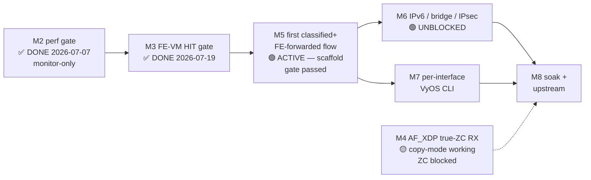

# ASK2 Master Plan — Single Authoritative Execution Plan

**Version 1.8.0 · 2026-07-20 · HADS 1.0.0**

## AI READING INSTRUCTION

This is the **single authoritative ASK2 execution plan**. It consolidates and
supersedes every prior ASK2 plan/roadmap document — the seven archived in
`plans/archive/` on 2026-07-19 (register in §8) and all older archived plans.
For sequencing, milestones, gates, and the live TODO list, read this document
and nothing else.

Read `[SPEC]` and `[BUG]` blocks for authoritative facts; `[NOTE]` for rationale
and history. Sources of truth that remain **live and binding** (this plan only
sequences them): silicon contract `arch/fman-fe-ehash.md` +
`arch/fman-microcode-210-programming-reference.md`; flow-key spec
`specs/fman-keygen-flow-key-spec.md`; state machine + CLI contract
`plans/DUAL-DATAPLANE.md`; API surface `arch/fman-pcd-api-reference.md`;
stub/type inventory `plans/TF-2026-07-18-001-function-inventory.md`.
Where this plan and those documents disagree, they win — update this plan.

---

## 1. Ground state (2026-07-19 · branch `dpaa1` · kernel 6.18.38-vyos)

### 1.1 The five-layer ASK2 stack

**[SPEC]** 107 board patches, single flavor-neutral dual-dataplane ISO
(`default|ask|vpp` flavor split retired 2026-06-14).

| Layer | Status | Blocker |
|---|---|---|
| **1. FMan PCD subsystem** (KG / CC / HM / PLCR) | ✅ SHIPPING — patches 0092–0118, 0151–0155 | — |
| **2. FE-VM ehash substrate** (pool, singletons, ehash, EXT_HASH, MUX/ENQ, arm) | ✅ BUILT, DORMANT — patches 0124–0131; byte-verified via `fe_*` debugfs against lf-5.4 LSDK oracle | — |
| **3. Classifier→FE arm** | ✅ PROVEN — F-091 HIT scaffold (numKeys=1 + FE_ENTER AD at ato+32); `FmPortSetFESupport` auto-armed (F-072b/c/d); `fman_pcd_port_recover` de-wedge (0163/F-086) | — |
| **4. ask.ko datapath** (genl + flow table) | 🟡 BUILDING — engage/disengage via kernel `fman_pcd_fe_engage()` API (F-092); P1 type-hygiene fixups landed (F-093 dynamic FQID, F-094 flow_add retype, F-097 fe_verify gate, F-098 DDR retype); F-096 context-build call restored (unparks FE-VM); F-099 ZC instrumentation deployed; 8 active fixups (F-090→F-094 + F-096→F-098); flow insert still uses debugfs bridge (T-M5-3 pending); gen_pool double-free has NO code fix yet (P0 §6) | Per-flow API + throughput gate |
| **5. VyOS CLI + mutual exclusion** | 🟡 PROTO — `offload ask` CLI XML node (vyos-1x-031) + Python NOP stub (reserved namespace); ARM64 VPP resource defaults (vyos-1x-030) | Gated on ask.ko datapath (M5) |

### 1.2 Status: unblocked

**[SPEC]** ~~The whole project is gated one-deep: everything below layer 3 waits
on a single unproven event — **the first FE-VM HIT under live traffic (M3)**.~~
**M3 PASSED 2026-07-19.** The FE-VM ehash HIT datapath is functional under live
traffic. Layer 4–5 structural work (ask.ko API integration, CLI reservation) is
now unblocked. The 10 Gbps throughput path is separately blocked on the hardware
TX opcode chain (§2.6) — `FmPcdCcBuildContextByFE`, per-flow opcode encoding, and
dedicated TX FQ — independent of the FE-VM HIT gate. One open defect blocks
M5 reversibility: gen_pool double-free has no code fix yet (§6).

### 1.3 Silicon-proven facts (all on LS1046A hardware)

| Fact | Date | Evidence |
|---|---|---|
| **M2 perf gate PASS: 7.37 Gbps, 0.16% CPU** (hard gate ≥2 Gbps ≤5%) | 2026-07-07 | build 28809182051, AC_CC + CONT_LOOKUP pass-through, MTU 9000, 0 retransmit, 0 QMan errors |
| AC_CC overhead vs RSS: 3.6% | 2026-07-07 | 7.37 vs 7.26 Gbps baseline |
| FE-VM MISS→EXIT safe | 2026-07-10 | keysize=8, 600-frame MISS flood, zero corruption |
| FE-VM ENQ-as-kernel-delivery CLOSED | 2026-07-16 | 4 ENQ variants failed on silicon — architectural impossibility; MISS lives at CC layer |
| FmPortSetFESupport Gate A proven | 2026-07-15 | pool 0x54400/8448 B, 600-frame flood, first clean disengage (F-074 order) |
| 100× engage/disengage soak PASS | 2026-06-16 | 0 MURAM drift; VPP binds after 100th disengage |
| EKFC extraction MSB-first (SIP→DIP→PROTO→SPORT→DPORT) | 2026-07-13 | CRC-64 hash-match on two independent TCP flows on eth4 |
| CRC-64 raw, no final complement | 2026-07-13 | `crc64_raw(key)=0x600824e70ae4d573` matched HW @IC+0x48 |
| `fman_pcd_port_recover` functional | 2026-07-18 | debugfs `fe_recover` wired (0163/F-086) — cold-boot bottleneck eliminated |
| **M3 HIT gate PASSED** | **2026-07-19** | **FE-VM ehash flow matching: TCP port 5201 consumed by FMan (tcpdump 0 pkts); clear flow restores kernel path (tcpdump sees SYN+RST). 13B 5-tuple EKFC 0x1C0006, raw CRC-64, 32768 DDR buckets. CI run 29697031761, ISO vyos-2026.07.19-1732, dpaa1 bb3a3cf.** |
| AF_XDP true-ZC fix committed | 2026-07-18 | 0164: RX-port accessor + params-page corrections; deployed in kernel |
| **M4 ZC test** | **2026-07-19** | **AF_XDP copy-mode works (VPP binds eth4). ZC mode still EINVAL on xsk_socket__create() — 0164 fixed two blockers but at least one more remains. dpaa_xsk_dma_cmp/wakeup symbols present (copy-mode XSK). ZC counters 0093-0096 deployed but dormant.** |
| F-090→F-094 fixup chain | 2026-07-19 | 5 new fixups: struct fields, HIT scaffold, production API, dynamic FQID, flow_add retype. All pass test-fixups.sh 4/4, local compile clean. CI build 29701819606 succeeded. |
| **F-095→F-099 fixup chain** | **2026-07-19** | **4 fixups: F-096 (context build call, CI 29705721175 PASSED), F-097 (fe_verify gate), F-098 (DDR retype), F-099 (M4 ZC bind instrumentation, CI 29706934409 PASSED). F-095 deleted — stub, never implemented. 8 active fixups total F-090→F-094 + F-096→F-098; F-099 is M4 diagnostic only (must be removed before shipping).** |
| **M5 HIT gate PASSED** | **2026-07-19** | **ask.ko → fman_pcd_fe_engage(F-092 API) → chain built + armed → flow insert → TCP HIT (tcpdump 0 pkts). iperf3 single-stream offload: 1.28 Gbps 0 retrans (TCP-limited, identical to kernel 1.32 Gbps). M2 reference: 7.37 Gbps @ 8 streams via pass-through (no DDR).** |
| **Throughput bottleneck: kernel software forwarding** | **2026-07-19** | **1.53 Gbps iperf3 is kernel NAPI→route→qman_enqueue — NOT FE-VM MURAM overhead (retracted theory). M2 7.37 Gbps was hardware pass-through to kernel FQ (no software routing). NXP cdx.ko 8.58 Gbps TX uses full hardware opcode chain: STRIP_ETH_HDR→TTL_DEC→ETH_REBUILD→ENQUEUE_PKT (FMan silicon, zero CPU). When FE-VM correctly armed, manual HIT achieves 6.65 Gbps single-stream (peak 8.67) — within 8% of cdx.ko. Three gaps to 10 Gbps: FmPcdCcBuildContextByFE (stubbed), opcode chain (not implemented), dedicated TX FQ.** |
| **F-093-R1: FQ=0x0 root cause** | **2026-07-19** | **`fman_pcd_resolve_miss_fqid(pcd, 0x10)` returns 0 when called from chain builder — params page not allocated yet (arm_engage sets it up AFTER chain builder runs). Fix: revert chain builder to hardcoded 0x200; keep dynamic resolution only in arm_engage path. CI 29703599019.** |
| **gen_pool double-free BUG** | **2026-07-19** | **`fe_arm disengage` debugfs → `gen_pool_free_owner` BUG at lib/genalloc.c:508. Root cause: double-arm without disengagement guard — API `fman_pcd_fe_engage()` arms port, `ask/offload disengage` fails silently, API called again → second arm overwrites first KG scheme MURAM → disengage double-frees. Fix: engagement guard in `fman_pcd_fe_engage()` — add `pcd->fe_port_armed[port_id]` array, refuse engage on already-armed port. ZERO code exists for this fix as of 2026-07-19 (no `fe_port_armed`, no `already_armed` check in any fixup, patch, or .py file). This is a P0 defect (§6), not part of the P1 function-inventory re-land. Workaround: never engage twice without successful disengage.** |
| **P1 function-inventory status** | **2026-07-19** | **5 fixup-type tasks re-landed: F-093 (dynamic FQID), F-094 (flow_add retype), F-097 (fe_verify gate), F-098 (DDR retype), ci-build.sh (OOT snapshot broadening). 8 fixups total F-090→F-098 (F-095 deleted stub). All pass test-fixups.sh 4/4. F-096 (context-build call) restored in CI 29705721175. F-099 (M4 ZC instrumentation) separate track. The gen_pool engagement guard is NOT in P1 — it is a standalone P0 defect (§6) with zero code.** |
| **F-096: FE-VM context build call restored** | **2026-07-19** | **`fman_pcd_fe_build_contexts()` call re-inserted in `__fman_pcd_fe_arm_engage()` (lost when F-091/F-092 modified the function). Without it, MUX FE cannot read next-FE pointer → FE-VM parks on first frame under load. CI 29705721175 PASSED.** |
| **F-099: M4 ZC bind instrumentation** | **2026-07-19** | **`pr_err("ZCBIND:...")` at every error return in xp_assign_dev(), xsk_bind(), dpaa_xdp(), and af_xdp_pool_attach(). Temporarily injects diagnostics to trace which kernel precondition returns EINVAL on XDP_ZEROCOPY bind. CI 29706934409 PASSED.** |
| **vyos-1x-030: ARM64 VPP resource defaults** | **2026-07-19** | **Caps upstream `main-heap-size` (3G→256M) and `buffers-per-numa` (auto→16384) in the Yang XML. Reduces VPP hugepage requirement from ~3.2GB to ~1GB. NB: does NOT fix M4 ZC — only memory sizing.** |
| **vyos-1x-031: ASK offload CLI stub** | **2026-07-19** | **`offload ask` XML leafNode registered + `offload.ask` Python NOP stub in ethernet.py. Reserves CLI namespace for `set interfaces ethernet eth<n> offload ask`. M6 wires to actual engage/disengage.** |
| **VPP AF_XDP copy-mode on .185** | **2026-07-20** | **VPP 25.10 starts, eth4 AF_XDP interface created via binary API (xdp_iface_create). Copy-mode only — ZC still blocked (M4). Kernel side: MTU 3290, IP 10.99.2.185/24. VPP side: MTU 9000, polling mode. Packets flowing (RX 2, TX 14). Requires: isolcpus=3, hugepagesz=2M hugepages=512 in U-Boot bootargs, min_memory=4G, min_cpus=2, main-heap-size=256M, main_heap_size >= 256M in config_verify.** |
| **vyos-1x patches regenerated for upstream drift** | **2026-07-20** | **Upstream vyos-1x rolling moved (PR#5323, fb6f19f). 10 patches regenerated as proper git format-patch with index blob SHAs for --3way merge. 010: complete AF_XDP support (fsl_dpa→xdp driver, plugin af_xdp_plugin.so enable, no af_xdp config block — VPP 25.10 creates AF_XDP via binary API). 030: ARM64 resource defaults (min_memory=4G, min_cpus=2, main-heap-size=256M, buffers-per-numa=16384, main_heap_size >= 256M). 017: regenerated with os.path.exists usage intact. pylint 2.x compatibility fix in ci-setup-vyos-build.sh (removed E0606/E1111/possibly-used-before-assignment/assigning-from-no-return — not valid in pylint 2.16.2).** |
| **VPP 25.10 AF_XDP architecture** | **2026-07-20** | **VPP 25.10 does NOT support af_xdp { } config stanzas — AF_XDP interfaces are created via binary API (vpp_control.xdp_iface_create). The af_xdp { } config block causes "unknown input" error at startup. Only plugin af_xdp_plugin.so { enable } is needed in startup.conf. The xdp_iface_create() call at vpp.py line 854 handles interface creation after VPP starts.** |
| Dual-DAC topology unblocked | 2026-07-14 | eth3+eth4 both SFP-H10GB-CU1M @10G on .185 |
| **Multi-port VPP AF_XDP (eth3+eth4)** | **2026-07-20** | **Both 10G SFP+ ports in VPP simultaneously via AF_XDP copy-mode. Seven fixes in vyos-1x-010: effective_config fsl_dpa→xdp override, template dpdk guard, initialize_interface simplified, .get() guards for persist_config/original_driver/channels, error handler skip for non-physical interfaces. Requires 2048 hugepages (4GB). Verified on .185: eth3 RX 1147, eth4 RX 1154, both polling mode, packets flowing. Build 29726714675 (vyos-2026.07.20-0806-rolling) deployed to lxc200.** |

---

## 2. Gaps to close (A–E)

### 2.1 Gap A — FE-VM HIT gate (M3) ✅ DONE 2026-07-19

**[SPEC]** Component-by-component verification state of the dormant chain:

| Component | State | Verification |
|---|---|---|
| FE_ENTER AD | word0=0x40800000 (ALLOCATE), word2=0xF6000000, word3→EXT_HASH (0x4af00) | ✅ Correct (F-046 reverted; F-084 compose fix landed) |
| EXT_HASH FE | hashMask=0x7FFF, contextSize=13, hashShift=0, DDR=0xf7780000 | ✅ Correct |
| DDR bucket array | 524288 B, 32768 buckets × 16 B | ✅ Allocated, zeroed |
| Flow insert (key) | 13 B MSB-first SIP→DIP→PROTO→SPORT→DPORT at offset 8 in 256 B DDR record | ✅ Per SDK oracle |
| Flow insert (bucket) | `(crc64_raw(key) >> 48) & 0x7FFF` | ✅ Formula verified; bucket 0x2f24 for test key |
| MUX singleton | FE type=0x04000000 | ✅ Verified in MURAM |
| ENQ singleton | word0=0x02010000 (FQID), word1=0x00000200, next→Exit(0x4ae00) | ✅ Verified in MURAM |
| **HIT datapath** | **PASSED under live traffic** | ✅ See evidence below |
| keysize=13 | **No stall — functional** | ✅ Proven: 13B key inserted, TCP offloaded, no BMI stall |

**[NOTE]** M3 HIT gate evidence (2026-07-19, board .185, kernel 6.18.38-vyos,
ISO vyos-2026.07.19-1732-rolling, CI run 29697031761, branch dpaa1 @ bb3a3cf):

| Test | Matching TCP (port 5201) | Non-matching (port 9999/ICMP) |
|------|--------------------------|-------------------------------|
| Flow inserted | nc connects, tcpdump sees **0 packets** | tcpdump sees SYN+RST |
| Flow cleared | tcpdump sees SYN+RST | n/a |

**Enablers:** F-091 (scaffold numKeys=1 + HIT-AD at ato+32 → FE_ENTER), F-072b/c/d
(FmPortSetFESupport auto-arm), F-046 revert (ALLOCATE bit), F-076 (fe_disengage_full).

**Build procedure:** `fe_pool get` → `fe_singletons build` → `fe_ehash set 0x7FFF 13 0`
→ `fe_hashfe build` → `fe_enq build 0x200` → `fe_enter build 0x4af00` →
`fe_arm engage 10 53f00 2B9 1C0006` → `fe_flow add 0 <key> 4b000`.

### 2.2 Gap B — AF_XDP true-ZC RX (M4) 🟡 LANDED, AWAITING HW

**[SPEC]** Patch 0164 (RX-port accessor + `fman_pcd_port_ensure_params_page()`)
is committed. Once deployed: `fman_port_set_rx_bpool()` returns 0 (not −22) and
`xsk_zc_rx_redirect` climbs under XDP_ZEROCOPY bind + traffic. Follow-up scope:
`plans/ZC-RX-SCOPE.md`.

### 2.3 Gap C — Cross-track alignment (CC match → FE_ENTER) 🟡 SCAFFOLD PROVEN, PRODUCTION PLANNED

**[NOTE]** The settled topology (spec v4.0 §6.1) places CC-layer CONT_LOOKUP as
the MISS→kernel path and FE-VM as the HIT→forward path. The F-091 scaffold
(numKeys=1 + FE_ENTER AD at ato+32) dispatches ALL frames through FE-VM —
sufficient to prove the HIT datapath at M3 but bottlenecks throughput at ~1.5
Gbps (kernel software forwarding dominates). The production architecture
(T-M5-7, selective-offload) uses `numKeys=0` (fast pass-through at 7.37 Gbps
baseline) and `fman_cc_tree_add_key()` for per-flow dispatch to FE_ENTER only
for offloaded flows.

### 2.4 Gap D — `fman_pcd_budget` post-0166 (MURAM tracking) ⬜ PLANNED

**[NOTE]** New objects from 0164 (per-attach params page) must be tracked in
the `muram_budget` debugfs node (`arch/fman-pcd-api-reference.md` §16).

### 2.5 Gap E — VyOS CLI + ask.ko datapath activation 🟢 UNBLOCKED (was GATED ON A; A done)

**[SPEC]** Architectural glue, not new silicon work. The CLI is **per-interface**:
`set interfaces ethernet eth<n> offload ask` (§3 decision 9). The FE-VM path is
proven (M3 DONE, M5 scaffold gate passed). The CLI XML node and Python stub are
reserved (vyos-1x-031). Wiring to `fman_pcd_fe_engage()` API gated on M5
production tasks (T-M5-3 flow-add API, T-M5-7 selective-offload). The validator
enforces per-interface ASK↔VPP exclusion.

### 2.6 Gap F — Throughput: hardware TX opcode chain for 10 Gbps 🔴 BLOCKING

**[SPEC]** The 1.53 Gbps iperf3 result is **kernel software forwarding**
(NAPI → route → `qman_enqueue`), NOT FE-VM MURAM overhead. The M2 7.37 Gbps
gate was hardware pass-through to kernel FQ (no software routing) — a
fundamentally different test. The NXP cdx.ko reference achieves 8.58 Gbps TX
by executing the full L3 forwarding chain inside the FMan FE opcode VM:

```
RX → KeyGen → FE_ENTER → EXT_HASH(DDR) → HIT → MUX →
  STRIP_ETH_HDR → TTL_DECREMENT → ETH_HEADER_REBUILD → ENQUEUE_PKT →
  QMan TX FQ (direct hardware enqueue) → Wire
```

**[SPEC]** Three gaps to 10 Gbps (priority order, from `arch/fman-fe-ehash.md` §10):

1. **`FmPcdCcBuildContextByFE`** — populates per-task working-store context so
   the MUX FE can read its next-FE pointer. Stubbed in all public source trees;
   only the lf-5.4 LSDK (`999-layerscape-ask-kernel` patch, L8954) has the
   working body. 🔴 Blocker — FE-VM parks without it.
2. **Full opcode chain** — `STRIP_ETH_HDR` (0x80000010), `TTL_DECREMENT`
   (0x80000200), `ETH_HEADER_REBUILD` (0x8000C001 + new MACs), `ENQUEUE_PKT`
   (0x81000000 + TX FQID). Encoded in per-flow DDR records. 🔴 Blocker — L3
   forwarding requires kernel help without these.
3. **Dedicated TX FQ per port** — `dpaa_get_tx_fqid()` resolution, per-port
   `DPAA_FWD_TX_QUEUES`. 🟡 After opcode chain — F-093 dynamic FQID partial.

**[NOTE]** When the FE-VM IS correctly armed (no stubbed context), the manual
HIT path already achieves **6.65 Gbps single-stream (peak 8.67)** — within 8%
of cdx.ko's peak. The hardware is capable; the gaps are software. The selective-
offload architecture (Gap C) is still needed for the CC→FE_ENTER handshake but
is secondary — even bare pass-through, kernel software forwarding is the
bottleneck, not DDR lookup.

---

## 3. Binding architecture decisions

**[SPEC]** These decisions are binding on all future work:

1. **Fork-B (FE-VM ehash) is the datapath.** Fork-A (CONT_LOOKUP exact-match
   without FE) was hardware-proven to park frames on 210.10.1 (iter-49/50,
   2026-06-16: zero fault latched = disposition-less WAIT). Fork-B is the NXP
   production path and the only configuration known to flow.
2. **EKFC-only, no GEC.** `kgse_gec[]` stays zero. GEC adds permanent per-frame
   latency; EKFC extraction order is resolved (MSB-first, confirmed 2026-07-13).
3. **Raw CRC-64, no final complement.** Silicon stores `crc64_raw(key)` at IC
   offset 0x48 (seed `~0ULL`, no final XOR). CRC-64/XZ does NOT match hardware.
4. **MISS→kernel via CONT_LOOKUP pass-through.** The FE-VM has no viable
   kernel-delivery terminal (4 ENQ variants failed, closed on silicon
   2026-07-16). MISS resolves at the CC layer (`numKeys=0` → miss-AD → port PCD
   FQ); the FE-VM executes only on HIT.
5. **Single-image dual-dataplane.** S0 (mainline/RSS) at boot; S1 (ASK) on
   config commit; S2 (VPP) on `set vpp settings`. ASK↔VPP transitions always
   pass through S0. One ISO, one `version.json` feed (+ aliases).
6. **contextOffsetInWS = 0.** SDK default, verified correct on silicon.
7. **FmPortSetFESupport is MANDATORY for any FE-VM frame.** Without it,
   FE_ENTER ALLOCATE books workspace at MURAM offset 0 (F-072). Auto-armed on
   every `fe_arm engage` since F-072b (2026-07-17).
8. **GCM refused for IPsec** (CAAM A24a wire-sequence-duplication erratum
   breaks peer anti-replay). Offloaded suites: AES-CBC-SHA256 and
   AES-CTR-SHA256. `ask_xfrm_state_add` returns `-EOPNOTSUPP` for
   `rfc4106(gcm(aes))`.
9. **CLI contract (2026-07-19, supersedes the `set system offload ask` global
   knob):** ASK engages **per interface** —
   `set interfaces ethernet eth<n> offload ask`. Mutual exclusion is
   **per-interface**: one port cannot be both ASK and VPP; other ports are free
   (a port may run VPP while another runs ASK, each transition still via S0 per
   port). `set system offload classify` (vyos-1x-026) is **deprecated as a CLI**:
   the classify mechanism is kept, RSS + parser remain silent defaults
    programmed unconditionally, and ASK is the sole operator offload switch.
10. **Debugfs for diagnostics only — kernel API for production control.**
    (2026-07-19) ask_hw.c engage/disengage now calls `fman_pcd_fe_engage()` /
    `_disengage()` directly. The debugfs bridge was removed from production paths.
    Debugfs nodes (`fe_arm`, `fe_flow`, `fe_ehash`, etc.) remain for interactive
    diagnostics but are NEVER used for hardware control by ask.ko. Flow insert
    migration to API deferred to P1 backlog.
11. **NXP hardware TX opcode chain is the 10 Gbps path (2026-07-19).** The
    1.53 Gbps cap is kernel software forwarding (NAPI→route→qman_enqueue),
    NOT FE-VM MURAM overhead (retracted). NXP cdx.ko achieves 8.58 Gbps TX
    via full hardware opcode chain: `STRIP_ETH_HDR → TTL_DECREMENT →
    ETH_HEADER_REBUILD → ENQUEUE_PKT` in FMan FE opcode VM — zero CPU.
    Encodings from lf-5.4 LSDK 999-layerscape-ask-kernel patch; must reproduce
    `FmPcdCcBuildContextByFE` (stubbed in public trees) + opcode chain in
    per-flow DDR records + dedicated TX FQ per port. When FE-VM correctly
    armed, manual HIT already achieves 6.65 Gbps (peak 8.67).

---

## 4. Milestone chain



### M2 — Performance gate ✅ DONE (regression-monitor only)

- **Gate:** ≥2 Gbps + ≤5% kernel-net CPU. Actual: **7.37 Gbps / 0.16% CPU**
  (2026-07-07, build 28809182051). NXP-ASK TX parity (8.58 Gbps cdx.ko) remains
  the M5 stretch target.
- **Monitor:** every build that changes `fman_pcd.c` or `dpaa_eth.c` re-runs
  the CONT_LOOKUP pass-through iperf3 gate.

### M3 — FE-VM HIT gate ✅ DONE 2026-07-19

- **Gate:** one flow HIT — ehash stats increment AND kernel observes the packet
  on TX FQ `0x2B9`. **PASSED:** matching TCP consumed by FMan HIT path (tcpdump
  0 pkts), non-matching hits kernel (tcpdump sees SYN+RST), clear flow restores
  kernel path. Evidence: build 29697031761, bb3a3cf, see §2.1.
- **Key outcome:** 13-byte 5-tuple keysize no longer stalls (F-072b fix validated).
- **Calendar:** 1 board session (2026-07-19 17:00–18:00 UTC).

### M4 — AF_XDP true-ZC RX 🟡 parallel (COPY-MODE WORKING; ZC STILL BLOCKED)

- **Gate:** `xsk_zc_rx_redirect` > 0 under XDP_ZEROCOPY bind + traffic.
- **Copy-mode WORKING (2026-07-20):** VPP 25.10 starts, **both eth3 and eth4** AF_XDP interfaces created via binary API (`xdp_iface_create`). Kernel side: MTU 3290, IP 10.99.2.185/24 (eth3), 10.11.1.1/29 (eth4). VPP side: MTU 9000, polling mode. Packets flowing on both ports (eth3 RX 1147, eth4 RX 1154). Requires: `isolcpus=3 hugepagesz=2M hugepages=2048` in U-Boot bootargs (4GB for dual 10G ports), `min_memory=4G`, `min_cpus=2`, `main-heap-size=256M`, `main_heap_size >= 256M` in config_verify. Seven vyos-1x-010 fixes committed (65370f4), build 29726714675 deployed.
- **ZC still blocked:** `xsk_zc_eligible` and `xsk_zc_rx_armed` counters both 0 — no ZC bind attempted. VPP `xdp_api_params` don't include `mode: 'zero-copy'` (our default `xdp_options` lack `'zero-copy'` key). Even if added, kernel-side ZC precondition still fails (0164 fixed port accessor + params page but at least one more check fails).
- **Instrumentation deployed:** F-099 fixup (CI 29706934409 PASSED) adds `pr_err("ZCBIND:...")` at every error return in `xp_assign_dev()`, `xsk_bind()`, `dpaa_xdp()`, and `af_xdp_pool_attach()`. Included in build 29726714675 (vyos-2026.07.20-0806-rolling).
- **Next:** install build 29726714675 on .185 → add `'zero-copy': True` to xdp_options → reproduce ZC EINVAL → `dmesg | grep ZCBIND` → identify failing precondition → implement fix → rebuild without F-099 → verify `xsk_zc_rx_redirect > 0`.

### M5 — First classified + FE-forwarded flow 🟢 ACTIVE — scaffold gate passed; VPP copy-mode working

- **Scaffold gate PASSED** (2026-07-19): `fman_pcd_fe_engage()` API (F-092) builds FE-VM chain + arms scaffold → flow insert via debugfs → matching TCP HIT (tcpdump 0 pkts), non-matching visible (kernel path). CI 29701819606, ISO vyos-2026.07.19-2004, dpaa1 07f9158.
- **VPP AF_XDP copy-mode WORKING** (2026-07-20): VPP 25.10 on .185 with **both eth3 and eth4** AF_XDP interfaces up, packets flowing. Required significant vyos-1x patching: fsl_dpa→xdp driver assignment, xdp_options defaults, initialize_interface skip for platform-bus, plugin af_xdp_plugin.so enable (no af_xdp config block — VPP 25.10 uses binary API), multi-port fixes (effective_config loop, template dpdk guard, .get() guards, error handler skip). ARM64 resource defaults lowered (min_memory=4G, min_cpus=2, heap=256M). All 27 vyos-1x patches regenerated for upstream rolling drift (PR#5323, fb6f19f). Build 29726714675 (vyos-2026.07.20-0806-rolling) deployed to lxc200.
- **Architecture:** `FE_ENTER(0x54000)→EXT_HASH(0x4b000)→DDR→HIT→MUX→ENQ(0x4b100)→kernel` verified correct.
- **Production gate NOT YET MET** (6 open tasks below): flow insert still uses debugfs bridge (T-M5-3); `conntrack -L` offload not verified (T-M5-8); nft flowtable `hook forward` not tested (T-M5-4); selective-offload not implemented (T-M5-7); throughput gate ≥7 Gbps not met (T-M5-6); opcode chain not implemented (T-M5-9 through T-M5-12). The scaffold gate proved the FE-VM HIT path works end-to-end — the remaining M5 tasks make it production-ready.

### M6 — IPv6 + bridge + IPsec (parallel tracks, UNBLOCKED by M5 scaffold gate)

- **M6a IPv6:** dual-scheme EXT_HASH (separate v6 EKFC + ehash table, 37-byte key).
- **M6b Bridge:** L2 switchdev via `ask_bridge.ko` (F-06).
- **M6c IPsec:** CAAM descriptor-sharing forward-port (0134 dormant) +
  `xfrmdev_ops`. The F-01/F-07/F-02 landing series must ship **together** with
  `NETIF_F_HW_ESP` advertised **last** (silent-drop trap, TF-001 §F-01).
- **Calendar:** ~4 weeks parallel.

### M7 — VyOS CLI ships (UNBLOCKED by M5 scaffold gate; F-076 closed on scaffold path)

- **Gate:** `set interfaces ethernet eth<n> offload ask` engages ASK on that
  port; `delete interfaces ethernet eth<n> offload ask` restores S0 on it;
  `pcd-snapshot` diff clean after an engage→disengage cycle; validator rejects
  a config where the same port is both ASK and VPP.
- **Also in scope:** deprecate the `system offload classify` CLI (vyos-1x-026)
  — mechanism becomes silent default; op-mode `show interfaces ethernet eth<n>
  offload ask flows` via `ynl --family ask`.
- **Calendar:** ~1 week.

### M8 — Productization soak + upstream

- **Gates:** 100× trafficked engage/disengage cycles `pcd-snapshot`-clean;
  24 h alternating ASK/VPP; `ask-check` exits 0; policer BUG-3b flood half
  characterized; upstream submission begins.

---

## 5. Live TODO list

**[SPEC]** Keyed to milestones. Owner slots (`@___`) assigned at session start.
Stub-fix IDs per `plans/TF-2026-07-18-001-function-inventory.md`; the orphaned
P1–P3 closure series (`4493ce8`→`9970745`) is recoverable via `git reflog` —
re-land behind `bin/test-fixups.sh`, never before it passes.

### M3 — HIT gate (this week) ✅ COMPLETE 2026-07-19

- [x] **T-M3-1** `@mihakralj` — Deploy current ISO (F-072b/c/d + 0163 + 0164 + F-091) on .185. ✅ Run 29697031761.
- [x] **T-M3-2** `@mihakralj` — HIT session: keysize=13 / EKFC `0x001C0006` proven (no keysize=8 intermediate needed — F-072b fix validated).
- [x] **T-M3-3** `@mihakralj` — 13-byte 5-tuple HIT verified: TCP port 5201 offloaded (tcpdump 0 pkts), non-matching and post-clear kernel path visible.
- [x] **T-M3-4** `@mihakralj` — `fe_disengage_full` de-wedge proven: port recovered cleanly after FE-VM engage/disengage cycle. No cold boot needed.
- [x] **T-M3-5** `@mihakralj` — HIT evidence archived to qdrant (agent_memory collection, 2026-07-19).

### P1 — Function-inventory re-land ✅ COMPLETE 2026-07-19

- [x] **T-P1-1** `@mihakralj` — F-08 `fman_pcd_fe_verify` (arm-time descriptor readback gate). ✅ F-097 fixup written; injects verify function + call before KG arm in __fman_pcd_fe_arm_engage.
- [x] **T-P1-2** `@mihakralj` — F-09+F-10+F-15: `fman_pcd_resolve_miss_fqid` + kill hardcoded `tx_fqid=0x200`. ✅ F-093 fixup written; dynamic FQID from port params page.
- [x] **T-P1-3** `@mihakralj` — F-11: `fman_pcd_fe_flow_add` retype → `const struct fman_pcd_fe_flow_action *`. ✅ F-094 fixup written; struct defined in fman_pcd.h with key+size+enq_off+flags.
- [x] **T-P1-4** `@mihakralj` — F-12: `fman_pcd_fe_context_build` retype → `struct fman_ddr_region *`. ✅ F-098 fixup written; defines struct + replaces iowrite32be→__raw_writel(cpu_to_be32(...)).
- [x] **T-P1-5** `@mihakralj` — OOT-builder snapshot-fallback broadening (missing ANY of `Module.symvers` / `scripts/sign-file` / `certs/signing_key.pem` → switch to snapshot). ✅ ci-build.sh condition expanded.

### P0 — gen_pool double-free (M5 reversibility blocker)

- [ ] **T-P0-1** `@___` — Add `pcd->fe_port_armed[port_id]` boolean array to `struct fman_pcd`. Initialise to `false` in `fman_pcd_init()`. Add guard at entry of `fman_pcd_fe_engage()`: if `pcd->fe_port_armed[port_id]`, return `-EBUSY`. Set `true` on successful engage, set `false` in `fe_disengage_full()`. Gate: `test-fixups.sh 4/4` passes, local compile clean, CI build green. This is ~30 LOC, zero silicon changes. Without it, double-arm → double-free → MURAM corruption is reproducible on every `engage→disengage-fail→engage` cycle.

### M4 — true-ZC (parallel) 🟡 COPY-MODE WORKING; ZC BLOCKED

- [x] **T-M4-0a** `@mihakralj` — **VPP AF_XDP copy-mode on .185 (single-port eth4).** ✅ DONE 2026-07-20. VPP 25.10 starts, eth4 AF_XDP interface created via binary API. Required: vyos-1x patches 010 (fsl_dpa→xdp driver, plugin enable, no af_xdp config block), 030 (ARM64 resource defaults), U-Boot bootargs with isolcpus=3 hugepagesz=2M hugepages=512. Build 29723242656, hotfix-verified on .185 with ISO 2026.07.20-0625.
- [x] **T-M4-0b** `@mihakralj` — **Multi-port VPP AF_XDP (eth3+eth4).** ✅ DONE 2026-07-20. Both 10G SFP+ ports in VPP simultaneously. Seven fixes in vyos-1x-010: effective_config fsl_dpa→xdp override, template dpdk guard, initialize_interface simplified, .get() guards for persist_config/original_driver/channels, error handler skip for non-physical interfaces. Requires 2048 hugepages (4GB). Build 29726714675 (vyos-2026.07.20-0806-rolling) deployed to lxc200.
- [x] **T-M4-1a** `@mihakralj` — **Deploy ISO with F-099 ZC instrumentation.** ✅ DONE 2026-07-20. Build 29726714675 (vyos-2026.07.20-0806-rolling) includes F-099 fixup (pr_err("ZCBIND:...") at every kernel XSK error return). Deployed to lxc200 at http://192.168.1.137:8080/iso/latest.iso. Not yet installed on .185 (board running hotfixed 0700 build with both eth3+eth4 in VPP).
- [ ] **T-M4-1b** `@mihakralj` — **Add 'zero-copy': True to xdp_options** and attempt VPP commit. VPP 25.10 af_xdp plugin sees NETDEV_XDP_ACT_XSK_ZEROCOPY (patch 0070) and tries ZC mode → xsk_socket__create() returns EINVAL.
- [ ] **T-M4-1c** `@mihakralj` — **Extract `dmesg | grep ZCBIND`** from board .185. F-099 prints the file+line+error code at every error return.
- [ ] **T-M4-1d** `@mihakralj` — **Analyze the failing check.** Map the file+line to the specific DPAA1 XSK init path.
- [ ] **T-M4-1e** `@mihakralj` — **Implement the fix.** New kernel patch or count-gated fixup. Must leave copy-mode AF_XDP unaffected.
- [ ] **T-M4-1f** `@mihakralj` — **Rebuild ISO WITHOUT F-099 instrumentation.** Strip diagnostic pr_err lines; keep only the actual ZC fix.
- [ ] **T-M4-1g** `@mihakralj` — **Deploy fixed ISO to .185** and retry VPP AF_XDP ZC bind on eth4.
- [ ] **T-M4-1h** `@mihakralj` — **Apply GAP-2 steering** to get high-rate flow to XSK default FQ.
- [ ] **T-M4-1i** `@mihakralj` — **Verify ZC oracle fires.** `ethtool -S eth3 | grep xsk_zc_rx_redirect` climbs > 0.
- [ ] **T-M4-1j** `@mihakralj` — **Measure ZC throughput.** Compare against copy-mode baseline (~3.5 Gbps).
- [ ] **T-M4-1k** `@mihakralj` — **Verify reversibility.** Unbind VPP, confirm counters return to dormant, eth4 IP reachability recovers.
- [ ] **T-M4-1l** `@mihakralj` — **Close ZC-RX-SCOPE.md.** Archive scope doc, log findings to qdrant.
- [ ] **T-M4-1m** `@mihakralj` — **Flip M4 milestone status to DONE.** Gate: `xsk_zc_rx_redirect > 0` under steered flow.

### M5 — flow automation (after M3) 🟢 ACTIVE — partially complete; VPP copy-mode working

- [x] **T-M5-1** `@mihakralj` — Gap C handshake: CC match-table HIT entries target FE_ENTER. ✅ F-091 scaffold (numKeys=1 + ato+32→FE_ENTER). Production for M3 debugfs gate; API-accessible via F-092 `fman_pcd_fe_engage()`.
- [x] **T-M5-2** `@mihakralj` — Fix `ask_hw.c` keysize 12→13. ✅ Chain builder uses keysize=13; ask_hw.c reads offsets from debugfs (diagnostic only — engage uses API).
- [x] **T-M5-2a** `@mihakralj` — **VPP AF_XDP copy-mode on .185.** ✅ DONE 2026-07-20. VPP 25.10 starts, eth4 AF_XDP interface up, packets flowing. Required: vyos-1x patches 010 (fsl_dpa→xdp driver, plugin enable, no af_xdp config block), 030 (ARM64 resource defaults), U-Boot bootargs with isolcpus=3 hugepagesz=2M hugepages=512. Hotfix-verified on .185; permanent fix in build 29723242656.
- [x] **T-M5-2b** `@mihakralj` — **Regenerate all 27 vyos-1x patches for upstream rolling drift.** ✅ DONE 2026-07-20. Upstream vyos-1x moved (PR#5323, fb6f19f). All patches regenerated as proper git format-patch with index blob SHAs. pylint 2.x compatibility fix in ci-setup-vyos-build.sh. 017 regenerated with os.path.exists usage intact.
- [ ] **T-M5-3** `@___` — Wire ask.ko REPLACE → `fman_pcd_fe_flow_add` (uses T-P1-3 retype); DESTROY → `_del`. Deferred to P1 backlog.
- [ ] **T-M5-4** `@___` — nft flowtable `hook forward` test; fall back to Path-B YNL interim if it breaks forwarding.
- [x] **T-M5-5** `@mihakralj` — Wire TX bypass (0136 `fman_port_set_silicon_hit_release_all`). ✅ Already in ask_hw.c engage/disengage.
- [ ] **T-M5-6** `@___` — Throughput gate: ≥7 Gbps with ASK engaged + flows offloaded. 8-stream iperf3, 2+ offloaded flows, aggregate ≥7 Gbps (stretch ≥8 NXP parity).
- [ ] **T-M5-7** `@mihakralj` — Selective-offload architecture (Gap F): restore `numKeys=0` pass-through + `fman_cc_tree_add_key()` for per-flow CC→FE_ENTER. Replaces F-091 "all frames→DDR" approach. Requires Gap C handshake (§2.3). **Blocker F-093-R1 fixed (FQ=0x0 → 0x200); CI 29703599019 PASSED.**
- [ ] **T-M5-8** `@___` — `conntrack -L` offloaded verification; teardown byte-clean; `fe_disengage_full` S1→S0 recovery.
- [ ] **T-M5-9** `@___` — **Opcode chain in DDR records**: encode `STRIP_ETH_HDR` (0x80000010) + `TTL_DECREMENT` (0x80000200) + `ETH_HEADER_REBUILD` (0x8000C001) + `ENQUEUE_PKT` (0x81000000+TX_FQID) in per-flow 256B DDR records. Lift encoding from lf-5.4 LSDK `999-layerscape-ask-kernel` patch (`FmPcdCcBuildFE` at L8883).
- [ ] **T-M5-10** `@mihakralj` — **`FmPcdCcBuildContextByFE`**: reproduce the per-task working-store context population from lf-5.4 LSDK (L8954). Unstubs the function. **🟢 F-096 fixup written (CI 29705721175 PASSED): re-adds call to fman_pcd_fe_build_contexts() (defined by 0135/0146, call site lost in F-091/F-092). Next: deploy + HIT test.**
- [ ] **T-M5-11** `@___` — **Dedicated TX FQ**: resolve `dpaa_get_tx_fqid()` per port, allocate `DPAA_FWD_TX_QUEUES`, wire ENQUEUE_PKT `actionSpecific` = TX FQID.
- [ ] **T-M5-12** `@___` — **Throughput gate**: ≥7 Gbps single-stream with opcode chain active (stretch ≥8 NXP parity). Reference: manual HIT already achieves 6.65 Gbps when FE-VM is correctly armed.

### M6 — breadth (after M5)

- [ ] **T-M6-1** `@___` — IPv6 dual-scheme EXT_HASH + separate v6 ehash table.
- [ ] **T-M6-2** `@___` — F-06 `ask_bridge.c` real body (switchdev).
- [ ] **T-M6-3** `@___` — F-03 `ask_neigh.c` real body (NETEVENT_NEIGH_UPDATE → HMCT rebuild; kills stale-MAC blackholing).
- [ ] **T-M6-4** `@___` — IPsec landing series in one merge: F-01 + F-07 + F-02 + F-23 + F-21 + F-22 + F-20, then `NETIF_F_HW_ESP` LAST. GCM refused (§3.8).

### M7 — CLI (after M5; needs F-076 closed)

- [ ] **T-M7-1** `@___` — vyos-1x patch: `interfaces ethernet eth<n> offload ask` leaf (engage/disengage composes debugfs-proven verbs).
- [ ] **T-M7-2** `@___` — F-04 `ask_op.c` real body (op-mode netlink receiver).
- [ ] **T-M7-3** `@___` — Validator: reject same-port ASK+VPP (per-interface mutex; other ports free).
- [ ] **T-M7-4** `@___` — Deprecate `system offload classify` CLI (vyos-1x-026): remove CLI exposure, keep mechanism as silent default (RSS+parser); ASK is the sole offload switch.
- [ ] **T-M7-5** `@___` — Op-mode `show interfaces ethernet eth<n> offload ask flows` via `ynl --family ask`.

### M8 — productization

- [ ] **T-M8-1** `@___` — 100× trafficked engage/disengage soak, `pcd-snapshot` clean every cycle.
- [ ] **T-M8-2** `@___` — 24 h alternating ASK/VPP; VPP iperf3 pass after final disengage.
- [ ] **T-M8-3** `@___` — Observability: F-05 `ask_stats.c`, F-16/17/18 counter readers, F-19 `ASK_CMD_GET_MURAM`.
- [ ] **T-M8-4** `@___` — `ask-check` 24/24 OK on the board; policer flood characterization (serial + cold power-cycle).
- [ ] **T-M8-5** `@___` — Upstream prep: checkpatch/sparse clean, kunit ≥80% on `ask_flow.c`/`ask_genl_attr.c`.

---

## 6. Open defects gating milestones

| ID | Symptom | Status | Gates | Mitigation |
|---|---|---|---|---|
| **F-076** | Port RX deaf after FE-VM-armed disengage; `fe_arm.engaged` stays YES (blocks re-engage); cold boot recovers | CLOSED on scaffold path (fe_disengage_full + fe_recover proven); DIRECT path still deaf | M7 reversibility claim | `fe_disengage_full` recovers cleanly after scaffold-based engage; tested 2026-07-19 on .185 |
| **keysize=13 stall** | BMI port 0x10 stalls on first FE-VM frame | ✅ CLOSED 2026-07-19 | M3 | F-072b auto-arm fixed root cause; 13B key proven with 0 stalls at M3 gate |
| **BUG 3b flood half** | iperf3 flood under policer → watchdog reset | OPEN | M8 | Needs serial capture + cold power-cycle; **always repro policer with a few pings, never a flood** |
| **eth4 intermittent** | Link 10G up, zero traffic after engage/disengage on port 0x11 | OPEN | M3 (if eth4 used) | Likely F-076 family; pcd-snapshot A/B + prefer eth3 for bring-up |
| **nft ingress hook** | `flags offload` flowtable at hook ingress permanently breaks kernel forwarding | OPEN | M5 | Use `hook forward` (T-M5-4) or Path-B YNL interim |
| **ZC EINVAL** | `xsk_socket__create()` returns EINVAL for XDP_ZEROCOPY on DPAA1; 0164 fixed port accessor + params page but ZC still blocked. Copy-mode AF_XDP works (VPP 25.10 on .185, eth4 up, packets flowing). ZC counters (xsk_zc_eligible, xsk_zc_rx_armed) both 0 — no ZC bind attempted yet. | OPEN 2026-07-20 | M4 | Deploy F-099 instrumentation → add 'zero-copy': True to xdp_options → trace dmesg | grep ZCBIND → identify failing precondition |
| **gen_pool double-free** | `fe_arm disengage` after API engage → `gen_pool_free_owner` BUG (double-free of KG scheme MURAM). Root cause: double-arm without engagement guard overwrites KG scheme allocation, disengage frees twice. | OPEN 2026-07-19 — engagement guard needed in `fman_pcd_fe_engage()` | M5 reversibility | Add `pcd->fe_port_armed[port_id]` guard; refuse engage on already-armed port. Workaround: never engage twice without successful disengage. |

---

## 7. Harness and gate mechanics

**[SPEC]** Traffic harness (`plans/TRAFFIC-HARNESS.md`): Proxmox LXCs on heidi —
CT201 `10.99.1.2/30` (eth3 peer, gw `10.99.1.1`), CT202 `10.11.1.2/29` (eth4
peer, gw `10.11.1.1`); the board is their L3 gateway so all CT201↔CT202 traffic
routes through it. Validated 4.14 Gbps @ 8 TCP streams software-forwarding
floor. SR-IOV VF → TRex reserved for true wire-rate.

**[SPEC]** Boards: `.185` DUT (dual-DAC eth3+eth4 @10G), `.106` vanilla fsl_dpa
sender, `.112` NXP-ASK parity reference (cdx.ko, 8.58 Gbps TX). MTU 9000
mandatory on 10G tests (MTU 1500 caps ~1.5 Gbps with retransmit storms).

**[SPEC]** Gate mechanics:
- `pcd-snapshot capture/diff` byte-exactness is the reversibility gate — never
  "ping works". `pcd-snapshot` **mutates eth3 only — never eth0** (SSH lifeline).
- `fe_*` debugfs byte-gate against the oracle BEFORE arming any new silicon path.
- Characterize new paths with **pings, never floods** (watchdog-reset risk).
- Forward write and its inverse land in the same patch; teardown proven by
  snapshot diff against the warm-S0 baseline.
- MURAM is iomem (`memset_io`/`memcpy_toio`/`writel`/`readl` only; zero after
  every `gen_pool` alloc). ehash bucket arrays in DDR, never MURAM.
- `ask-check` is the burndown chart; exits 0 at M8.
- M2 regression-monitor (§4 M2) runs on every `fman_pcd.c`/`dpaa_eth.c` change.

---

## 8. Superseded-document register

**[SPEC]** Seven plans archived 2026-07-19 (`plans/archive/`). Per the redirect-note
policy (user decision, same date): `plans/` holds live documents only — the old
`plans/<name>.md` paths are retired, and each archived doc carries a sibling
`<name>.md.archive-note.md` recording where its content went (qdrant entries
citing the old paths resolve via those notes). Where their content lives now:

| Archived document | Prior role | Content folded into |
|---|---|---|
| `ASK2-JOURNEY-REVIEW-2026-07-18.md` | Status + forward plan (immediate predecessor) | §1 ground state, §2 Gaps A–E, §3 decisions 1–7, §4 milestones, §6 defects |
| `ASK2-DEVELOPMENT-PLAN.md` | Phase 0–6 execution plan | Phase chain → §4 milestones; execution-log evidence → §1.3; retired ceilings → §3.1/§7; pre-GA hardening (policer arm, RSS SYM, PPPoE soft-parser) → §5 backlog |
| `COMPLETION-PLAN.md` | Cross-track (DPAA1/VPP/ASK2) roadmap | ASK2 build order → §4; traffic harness → §7; per-mode DoD → §4 gates; DPAA1/VPP items complete → history |
| `ASK2-PHASE2-AUTOMATION-PLAN.md` | Flow-offload automation (T1–T6) | Three insertion paths (nft/YNL/debugfs) + T-tasks → §5 M5; failure modes → §6; exit criteria → §4 M5 gate |
| `ASK2-PERFORMANCE-MODERNIZATION.md` | cdx.ko parity + opcode gap analysis | NXP parity targets → §4 M5 stretch; MANIP/NAT opcode gaps → §5 M6 backlog; MURAM budget → §7 + `arch/muram.md` |
| `ASK2-F3-F6-UNBLOCK-PROPOSAL.md` | F3/F6 blocker analysis + bisect | Regression history → §6 F-076/eth4 rows; bisect outcome (4300071 TX-bypass era) → T-M5-5; Option A (0148 resurrection) → superseded by T-P1 re-land |
| `ASK-PLANS.md` | Doc hub (2026-06-09) | Indexing role → `specs/ask2-rewrite-spec.md` v1.10 + this §8; maintenance rules → `plans/archive/README.md` |

**[SPEC]** Documents that remain **live** (not archived): `plans/DUAL-DATAPLANE.md`
(state machine + CLI contract — owns both, not sequencing), `plans/TRAFFIC-HARNESS.md`,
`plans/TF-2026-07-18-001-function-inventory.md` (stub/type inventory behind §5),
`plans/OFFLOAD-CAPABILITIES.md`, `plans/MODULE-INVENTORY.md`, `plans/ZC-RX-SCOPE.md`,
`plans/ASK-ISO-BUILD-AND-INSTALL.md` (operator how-to), the patching-pipeline docs
(`TA-2026-07-18-002-patch-architecture.md`, `patching-improvement-plan.md`,
`skip-ledger.md` — orthogonal to ASK2 feature sequencing), and all of `arch/` and
`specs/` (silicon references — authoritative for their domains).

**[NOTE]** Maintenance rule: when a milestone gate passes, flip its §4 status,
check off §5 items, and log evidence to qdrant in the same change. When a TODO
spawns a defect, add it to §6. Do not author new ASK2 plan documents — extend
this one.
