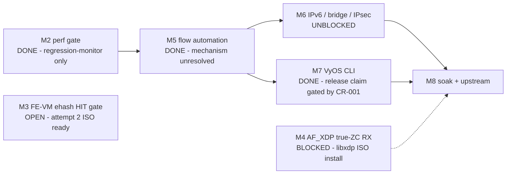

# ASK2 Master Plan — Single Authoritative Execution Plan

**Version 2.1.0 · 2026-08-06 · HADS 1.0.0**

## AI READING INSTRUCTION

This is the **single authoritative ASK2 execution plan**. For sequencing,
milestones, gates, and the live work program, read this document and nothing
else. `[SPEC]` = binding facts and requirements; `[NOTE]` = rationale;
`[BUG]` = defect (symptom + cause + fix).

Sources of truth that remain **live and binding** (this plan only sequences
them): silicon contract `arch/fman-microcode-210-programming-reference.md` +
`arch/fman-fe-ehash.md`; flow-key spec `specs/fman-keygen-flow-key-spec.md`;
state machine + CLI contract `plans/DUAL-DATAPLANE.md`; API surface
`arch/fman-pcd-api-reference.md`; CC-tree rebuild `plans/CC-TREE-REBUILD-PLAN.md`;
vendor oracle `plans/NXP-106-DEEP-DIVE-PLAN.md`; stub/type inventory
`plans/TF-2026-07-18-001-function-inventory.md`. Where this plan and those
documents disagree, they win — update this plan.

---

## 1. Current state (branch `dpaa1` · kernel 6.18.38-vyos)

### 1.1 Position

**[SPEC]** No hardware-classification dispatch path on this branch has a
confirmed silicon HIT. The only silicon-proven hardware offload today is the
**FMan ingress policer** and **mainline RSS**.

| Dispatch path | Status |
|---|---|
| **FE-VM ehash** (the vendor's production mechanism) | Code complete. **F-163's 14-byte PORT_ID key format is WRONG and should be reverted — the 13-byte format is correct (§4.1).** Attempts 2–4 (2026-08-06) ruled out FQID choice and key content as explanations for the continuing MISS; suspected real blocker is the AD species written to `FMBM_RCCB` (§4.1, §7.11), not yet tested. |
| **CC-tree classification** | No confirmed HIT. `ask.ko` insert path deleted (CR-007). `cc_test` harness architecturally broken — **retired, do not patch further**. Replacement harness pending the NXP-106 deep-dive oracle (§4.2). |
| M5's 10.259 Gbps | Real throughput number; **mechanism unresolved** — most likely kernel `nf_flowtable` software forwarding, not hardware classification. Do not cite it as HW-offload proof. |
| M2's 7.37 Gbps CC pass-through | Real — but it is MISS→kernel delivery (CONT_LOOKUP numKeys=0), not offload. |

**[SPEC]** Which mechanism carries >32 concurrent hardware-offloaded flows
(CC-tree multi-node vs FE-VM ehash) is an **open question**, deferred until one
path demonstrates a genuine, discriminator-verified HIT (§4.1, §4.3).

### 1.2 Layer status

| Layer | Status |
|---|---|
| 1. FMan PCD subsystem (KG / CC / HM / PLCR) | Shipping — patches 0092–0118, 0151–0155 |
| 2. FE-VM ehash substrate (pool, singletons, ehash, EXT_HASH, MUX/ENQ, arm) | Code complete — patches 0124–0131; byte-verified via `fe_*` debugfs; no confirmed HIT |
| 3. Classifier→FE arm | Scaffold arm (`fe_arm engage <port> 0`) works, cold-boot reproducible (F-168); FE_ENTER-direct arm (`off != 0`) stalled once (§4.1) |
| 4. ask.ko datapath (genl + flow table) | Shipping — engage/disengage via kernel API; conntrack offload + crash-safe teardown; flow insert currently ehash-only (`ask_fe_flow_insert()` → `fman_pcd_fe_flow_add()` → `fman_pcd_ehash_add_key()`) |
| 5. VyOS CLI + mutual exclusion | Shipping — `offload ask` per-interface, ASK↔VPP mutex, `show flows` via ynl. Release claim gated by CR-001 (§5) |

### 1.3 Binding silicon facts (settled on LS1046A hardware — do not re-litigate)

**[SPEC]**

- **EKFC extraction is MSB-first:** SIP→DIP→PROTO→SPORT→DPORT.
- **KG hash = raw CRC-64** (ECMA-182, reflected poly `0xC96C5795D7870F42`),
  seed `~0ULL`, **no final complement**; stored at IC offset `0x48`.
  CRC-64/XZ does NOT match hardware.
- **Vendor flow key** = `portid(1B)|SIP|DIP|PROTO|SPORT|DPORT` = **14 bytes**
  (`union dpa_key`), EKFC **`0x801C0006`** (adds `KG_SCH_KN_PORT_ID`). IPv6
  variant = **38 bytes**. `ASK_FE_KEY_SIZE`=14. (F-163, commit `f212c701`.)
- Vendor `cdx.ko` classifies every accelerated flow via
  `ExternalHashTableAddKey()` — external-hash **is** the vendor production
  classification; the opcode/manip chain executes from inside each DDR ehash
  entry.
- **`FMFP_EXTC[INV0]` SYNC is required** before dispatch into a
  newly-repointed live FMan-controller structure (RM §5.12.14.1). Asserted in
  `fman_port_set_cc_base()` between the `fmbm_rccb` and `fmbm_rfpne` writes
  (F-168, commit `7e85a035`). Board-confirmed for the `off=0` scaffold arm
  only; the `off != 0` FE_ENTER-direct path is not covered by that
  confirmation.
- `__fman_pcd_fe_arm_engage()` overwrites the caller's `fe_enter_off` with the
  CONT_LOOKUP scaffold **only when the caller passed 0** (F-165, commit
  `e4f23948`). Explicit-target arms reach the built chain.
- `fman_pcd_kg_scheme_set_ekfc()` is **broken dead code** (`-EINVAL` on any
  already-bound scheme — the only case anyone would call). Do not use it. The
  working sequence is F-169's `fe_kg_ekfc` debugfs verb (commit `a84e5fe5`):
  `keygen_scheme_setup(false)` → mutate `scheme->ekfc` →
  `keygen_scheme_setup(true)` against `fman->keygen->schemes[]` via
  `fman_keygen_internal.h`.
- **KeyGen scheme 4 boots with EKFC `0x00180006`** (12-byte CC-tree format).
  Any ehash arm must reconfigure it to `0x801C0006` first, or KeyGen extracts
  12 bytes against a 14-byte table key (structural mismatch — stalled the
  first T-M3-R attempt).
- CC match rows are `key(16B)+mask(16B)` = 32 B stride, `(numKeys+1)` rows;
  mask `0xff`=participate / `0x00`=wildcard.
- The CC comparator reads **KG-emitted bytes**, not a re-extracted canonical
  composite (ask20 patch 0108 precedent).
- `FMAN_CC_MAX_STATIC_KEYS=32` / `FMAN_PCD_CC_HW_MAX_KEYS=32` are **software
  struct caps**; hardware allows 255 keys/node
  (`FMAN_PCD_CC_NODE_KEYS_MAX`). A 255-key node ≈ 8 KiB; 64 KiB MURAM arena →
  ~8 nodes → ~2,000-flow capacity. **Design input only — no CC HIT is
  proven.**
- MISS→kernel resolves at the CC layer (CONT_LOOKUP numKeys=0 → miss-AD →
  port PCD FQ). The FE-VM has no viable kernel-delivery terminal (4 ENQ
  variants failed on silicon).
- A bare CC node with no FE entry parks frames with no terminal disposition
  (210.10.1 silicon). Some FE-VM entry on HIT is required.
- `cmm`'s conntrack ingestion on `.106` is deaf (vendored
  libnetfilter_conntrack 1.1.0 never invokes `__cmmCtCatch()`).
  `/proc/fqid_stats/pcd/*/*` is **NOT a HIT/MISS oracle**. Use
  `bin/kg-scheme-read.py` / `bin/muram-mmap-dump.py`.
- `fe_probe` reads the FE **object pool** (`0x4bc00`, 28 B descriptors), not
  the per-port **workspace pool** (`FmPortSetFESupport`, `0x54e00`) — "empty"
  is expected even on a real HIT. `fe_buffer +0x58` is a
  workspace-pool-exhaustion counter, not an allocation counter. Neither
  distinguishes HIT from MISS on its own; the dedicated TX FQ `0x2B9` is the
  discriminator.

---

## 2. Binding architecture decisions

**[SPEC]** Binding on all future work:

1. **EKFC-only, no GEC.** `kgse_gec[]` stays zero (per-frame latency).
2. **Raw CRC-64, no final complement** (§1.3).
3. **MISS→kernel via CONT_LOOKUP pass-through.** The FE-VM executes only on
   HIT.
4. **Single-image dual-dataplane.** S0 (mainline/RSS) at boot; S1 (ASK)
   per-interface on `set interfaces ethernet eth<n> offload ask`; S2 (VPP) on
   `set vpp settings`. ASK↔VPP transitions always pass through S0, with a
   per-interface mutex. One ISO, one `version.json` feed (+ fielded aliases).
   `set system offload classify` is deprecated as a CLI; the classify
   mechanism stays as silent default (RSS + parser programmed
   unconditionally).
5. **`contextOffsetInWS = 0`** (SDK default, silicon-verified).
6. **`FmPortSetFESupport` is MANDATORY for any FE-VM frame** (auto-armed on
   every `fe_arm engage`). Without it, FE_ENTER ALLOCATE books workspace at
   MURAM offset 0.
7. **GCM refused for IPsec** (CAAM A24a wire-sequence-duplication erratum
   breaks peer anti-replay). Offloaded suites: AES-CBC-SHA256,
   AES-CTR-SHA256. `ask_xfrm_state_add` returns `-EOPNOTSUPP` for
   `rfc4106(gcm(aes))`.
8. **Debugfs for diagnostics only — kernel API for production control.**
   ask.ko engages/disengages via `fman_pcd_fe_engage()`/`_disengage()` and
   inserts via `fman_pcd_fe_flow_add()`/`_del()`; it never writes debugfs
   control nodes.
9. **The hardware TX opcode chain is the 10 Gbps path:**
   `STRIP_ETH_HDR → TTL_DECREMENT → ETH_HEADER_REBUILD → ENQUEUE_PKT`,
   reproduced from lf-5.4 LSDK `FmPcdCcBuildContextByFE` + per-flow DDR
   records + dedicated TX FQ per port. Kernel software forwarding
   (NAPI→route→qman_enqueue) caps ~1.5 Gbps.
10. **10G DMA page-order policy:** order-4 primary (throughput-first),
    order-3 fallback on memory pressure; avoid the MTU 8192 boundary in
    order-3 paths (multi-descriptor DMA splits). MTU 9000 mandatory for 10G
    validation.
11. **MURAM allocation strategy:** slab pools for fixed-size FMan objects (CC
    nodes, HM entries, policer profiles, ADs); segregated-fit power-of-two
    classes for general-purpose allocation; strict object lifecycles tied to
    the parent kernel object; teardown validated byte-clean with
    `pcd-snapshot`.
12. **Scale-out mechanism (>32 flows) is UNDECIDED** pending a confirmed HIT
    on either path. CC-tree capacity arithmetic (§1.3) stands as design
    input. Do not invest in ehash hardening or CC-tree scale-out engineering
    before T-M3-R + NXP-106 Phase A/C produce a verdict.
13. **Per-flow stats require a HW counter:** FE-VM EXT_HASH stats bit
    `0x00010000` (currently dormant), or CC-tree `STEN` + `AllocStatsObjs`
    (the vendor MURAM 327×-ENOMEM wall). Deferred until a HIT path exists.

---

## 3. Milestone chain

**[NOTE]** M3 gates nothing downstream; it is the validation track for the
ehash mechanism, not a sequencing blocker for M6/M7/M8.

- **M2 — Performance gate. DONE.** ≥2 Gbps + ≤5% kernel-net CPU; actual 7.37
  Gbps / 0.16% CPU. Regression-monitor: every build changing `fman_pcd.c` or
  `dpaa_eth.c` re-runs the CONT_LOOKUP pass-through iperf3 gate.
- **M3 — FE-VM ehash HIT gate. OPEN.** Gate: one flow HIT — ehash stats
  increment AND the packet observed on the dedicated TX FQ `0x2B9`, with a
  discriminator that cannot confuse HIT with MISS→kernel delivery. Work:
  §4.1.
- **M4 — AF_XDP true-ZC RX. BLOCKED.** Gate: `xsk_zc_rx_redirect` > 0 under
  XDP_ZEROCOPY bind + steered flow. Work: §4.4.
- **M5 — CC-tree + SW flowtable + manip chain. DONE (throughput), mechanism
  unresolved.** 10.259 Gbps line rate at 0.16% CPU / 0% loss (MTU 9000,
  3-node 10G plane). Treat as a throughput result, not HW-classification
  proof (§1.1).
- **M6 — IPv6 + bridge + IPsec. UNBLOCKED.** Work: §4.5.
- **M7 — VyOS CLI. DONE (surface wiring).** `set interfaces ethernet eth<n>
  offload ask` engage/disengage, per-interface ASK↔VPP mutex, `show flows`
  via ynl (HW vs SW via `offloaded` attr). Board-validated on .185/.106.
  Release claim gated by CR-001 reversibility (§5).
- **M8 — Productization soak + upstream.** Work: §4.6.

---

## 4. Work program

**[SPEC]** Ordered by priority. Owner slots (`@___`) assigned at session
start. Stub-fix IDs per `plans/TF-2026-07-18-001-function-inventory.md`. The
orphaned P1–P3 closure series (`4493ce8`→`9970745`) is recoverable via
`git reflog` — re-land behind `bin/test-fixups.sh`, never before it passes.

### 4.1 T-M3-R — first genuine HIT test of the corrected ehash chain ⬅ NEXT ACTION

**[SPEC — updated 2026-08-06, attempts 2–4 executed]** Attempts 2–4 ran on
silicon this session (F-169/F-170 ISOs, all with explicit operator go-ahead).
None produced a confirmed HIT, but they collectively closed out FQID choice,
key format, and PORT_ID as explanations, and surfaced what is now believed to
be the actual structural blocker (below). **T-M3-R is not yet passed.**

**Prerequisites (all landed):**

| Fixup | Commit | What it closes |
|---|---|---|
| F-163 | `f212c701` | 14-byte PORT_ID-prefixed vendor key (`ASK_FE_KEY_SIZE` 13→14, v6 37→38) — **now believed WRONG, see below** |
| F-165 | `e4f23948` | Engage honors explicit `fe_enter_off` (scaffold overwrite restricted to `==0`) |
| F-167 | `fc534ab4` | `fe_extc` standalone probe (inert; register confirmed safe) |
| F-168 | `7e85a035` | `FMFP_EXTC` SYNC in the arm path — fixes the port-wedge for the `off=0` scaffold arm, **and confirmed cold-boot-reproducible on the `off!=0` path too across attempts 2–4: port `0x11` itself never stalled again after this fixup** |
| F-169 | `a84e5fe5` | `fe_kg_ekfc` debugfs verb — live EKFC reconfiguration of a bound KG scheme |
| F-170 | (this session) | Widened the `hash_probe` capture hook (`F-072`) from eth4-only to eth3+eth4, for the PORT_ID characterization below (see caveat: turned out not to be needed) |
| F-171 | (this session) | `fe_group` debugfs verb — wraps the existing FE_ENTER chain in a genuine `CONT_LOOKUP` group AD (RM §7.11) with an all-wildcard match row, instead of writing FE_ENTER directly to `RCCB`. This is attempt 5's test vehicle. |

**[BUG] T-M3-R attempt 1 (2026-08-06) — stalled.** `fe_arm engage 11 0x57200 0x200`
→ port `0x11` STALLED (`fmfp_ps=0x80800000`). Root confound: KeyGen scheme4's
EKFC was still `0x00180006` (12-byte) against the 14-byte ehash key at arm
time — F-169 was built to close this.

**Attempt 2 (F-169 ISO) — clean engage, but wrong discriminator FQID.**
Built the full chain, armed with `fe_arm engage 11 <off> 0x200` then `0x2b9`
— neither is eth4's real kernel-delivery FQID (`0x200` is eth3's; `0x2b9` is
`ask.ko`'s unrelated TX-bypass queue). Traced live `dpaa_rx_fd` events during
an idle board to find the true value: **eth4's FQID is `0x300`.** Also found,
by reading `__fman_pcd_fe_arm_engage()` directly, that the `fe_arm` 3rd
argument is **inert** on the `off != 0` path (only written into hardware
inside the `off == 0` scaffold branch) — the real dispatch target is
`fe_enq build <fqid>`, not `fe_arm`'s argument.

A separate, reproducible side-effect appeared on every arm this session:
**port `0x17`** (an internal engine port with no netdev — not a real
LS1046A silicon port per §2 of `arch/fman.md`, likely a phantom/reserved
register-array artifact) flips to `STALLED` a few seconds after every arm,
independent of FQID/key format. Isolation testing (build-only, no arm →
stays healthy; arm → flips within seconds, before any deliberate traffic)
narrowed the trigger to `fe_arm` activation + ambient traffic, but it is
assessed as **benign and unrelated to the HIT/MISS question** — confirmed on
`.106` (vendor stack) that this same port slot is never even brought to
"ready" state (`fmfp_ps=0`), so there is no vendor equivalent to compare
against, and it does not explain any of the MISS results below.

**Attempt 3 (correct FQID `0x300`) — clean engage, genuine matching SYN
sent, no signal either way.** Sent a byte-exact matching TCP SYN from `.106`
while tracing `dpaa_rx_fd` on `.185` — confirmed transmitted (TX counters,
tcpdump on `.106`), but zero `dpaa_rx_fd` events fired on eth4. Initially
read as inconclusive; **reinterpreted below** once the `EXIT`-disposition
semantics were connected to this result.

**Key insight — 100% connectivity loss on every arm this session is
EXPECTED, not a bug.** `arch/fman-microcode-210-programming-reference.md`
§7.4 (documented since mid-July): `EXIT`-`DEALLOCATE` is `fe_singletons`'s
MISS disposition, and it is **a frame DROP, not kernel delivery** — any
non-matching frame on an armed port silently vanishes by design. This means
every ping/ARP failure this session was the chain working as designed, not
malfunctioning. It also reframes attempt 3: since a genuine HIT would
deliver via `fe_enq`→`0x300` and **must** surface as an ordinary
`dpaa_rx_fd` event (same dequeue point regardless of arrival mechanism), and
it produced zero events — **that is evidence of a MISS, not an
inconclusive result.**

**Control experiment (attempt 4) — ruled out key format entirely.** Rebuilt
the identical clean chain with the **old, already-hardware-validated
13-byte key** (`SIP|DIP|PROTO|SPORT|DPORT`, `EKFC=0x001C0006`, no PORT_ID)
instead of F-163's 14-byte format. Same result: matching SYN confirmed
transmitted, zero `dpaa_rx_fd` events. **A key format independently
confirmed correct via real hardware CRC-64 (2026-07-13, and re-confirmed
this session) also misses under identical conditions — the bug is not in
key content.**

**PORT_ID resolved as unnecessary, 2026-08-06 (see
`arch/fman-microcode-210-programming-reference.md` §10.5a for full
writeup).** The annotation-hash-match technique (brute-force the real
hardware CRC-64 against every plausible key layout) found silicon extracts
`KG_SCH_KN_PORT_ID = 0x00` for eth4, not the raw hw_port_id `0x11` F-163
assumed (unique match, 184,320 candidates). Newly-added qdrant material
(vendor's official `/etc/cdx_pcd.xml`) explains why: vendor's portid byte
comes from a `<combine portid="true".../>` **GEC** directive, a different
register block from `kgse_ekfc` entirely — this branch's own §2 decision 1
("EKFC-only, no GEC") means it can never replicate that mechanism regardless
of which EKFC value is chosen. It also turns out not to matter: vendor needs
portid because their ehash tables are `shared="true"` across many
ports/schemes; this branch's `fe_ehash` tables are per-scheme, not shared,
so there is no collision to disambiguate. **F-163 should be reverted (or
gated off) for the single-port ehash path; the 13-byte key is correct as-is.**

**Suspected real blocker, not yet board-tested: wrong AD species at
`FMBM_RCCB`.** `arch/fman-microcode-210-programming-reference.md` §7.11
documents the settled topology (2026-07-16): `RCCB` must point to a
`CONT_LOOKUP` **group AD** (`numKeys|matchTableAddr`, `adTableAddr`,
`0x40000000|(keySize-1)<<24`, `0`); `FE_ENTER` is reached only *indirectly*,
via a match on that group's table. Every `off != 0` arm this session (and,
per code inspection, every debug-harness arm in this project's history) has
instead written a bare `FE_ENTER`-species AD **directly** to `RCCB` — the
deprecated "RCCB→FE_ENTER direct" topology the RM explicitly superseded
weeks before this campaign started. Neither the production scaffold
(`off==0`, always `numKeys=0`) nor any debug harness has ever assembled the
documented `numKeys>0` HIT topology. **Caveat:** F-158 (2026-08-01) already
built and byte-verified an equivalent group/match/AD-table structure via a
*different* tool (`cc_test`) and got a decisive negative (CC comparator
confirmed not dispatching) — so this is not guaranteed to be the fix, but it
is the most concrete untested structural gap. Building a debugfs primitive
to test this directly is real, not-yet-started engineering work.

**Immediate next step for T-M3-R attempt 5:** revert to the 13-byte key (no
PORT_ID) — already correct — and either (a) build a `numKeys>0` group/match
AD-table primitive to test the RM-documented topology directly, or (b) run
the NXP-106 Phase A/C oracle first per §4.2. Do not spend further board
cycles on FQID or key-content variations; both are closed.

**Risk: MEDIUM.** Port `0x11` itself has stayed healthy across every attempt
since F-168 (2026-08-06); port `0x17`'s cosmetic stall requires a cold boot
to clear between attempts but has no observed functional consequence. Pings
only, never flood. Explicit user go-ahead before arming.

### 4.2 NXP-106 deep-dive — vendor oracle track (parallel; unblocks CC-tree)

**[SPEC]** Owned by `plans/NXP-106-DEEP-DIVE-PLAN.md`. Phase A: `t_ExtHashFe`
decode of `.106`'s live `FMBM_RCCB` targets — the byte-level oracle for this
branch's chain. Phase C: Fork-B gap punch-list. Feeds both T-M3-R failure
analysis and the CC-tree replacement harness.

### 4.3 T-M6-5 — CC-tree scale-out ⛔ BLOCKED on T-M3-R + Phase A/C

**[SPEC]** Raising `FMAN_CC_MAX_STATIC_KEYS` alone has zero effect: CR-007
(commit `dd364494`) deleted every caller of the CC-tree insert functions
those constants gate. Actual scope when unblocked:

1. Reimplement ask.ko's CC-tree flow-insert path (~120 lines, recover via
   `git show dd364494`: `struct ask_hw_cc_slot`, shadow array,
   `fman_hm_nexthop_get/put`, shadow key construction/rollback).
2. Rewire `ask_flow_offload.c`'s REPLACE handler to call it instead of /
   ahead of `ask_fe_flow_insert()`.
3. Build a new hardware harness — `cc_test` is retired (F-159–F-162: five
   vendor-verified register fixes, RX-silent within 17–30 frames on every
   install, reboot-required, while `.106`'s vendor stack classified 400+
   frames at 0% loss in the same session).
4. Then raise the capacity constants and implement multi-node allocation per
   `plans/CC-TREE-REBUILD-PLAN.md` (Phase 0 oracle test → Phase 4 scale-out).

### 4.4 M4 — AF_XDP true-ZC RX

- [ ] **T-M4-5a** `@___` — **Install the libxdp VPP ISO on `.185` + cold
  boot** (hugepages/isolcpus come from U-Boot). ISO 0201 (CI 29888749801)
  deployed to lxc200. Root cause chain: stock VyOS VPP is built without
  libxdp → its XDP program never enters DRV mode (`run_cnt=0`); the raw XSK
  probe works on this kernel (`xsk_zc_rx_redirect=29` with DRV_MODE), so the
  kernel ZC datapath is proven and the gap is VPP integration.
- [ ] **T-M4-4d** `@___` — **Verify the ZC datapath flows.** After the
  install: `bpftool` dump `xsks_map[0]`, fix map population (patch 4006
  forces `rx_queue_index=0`; VPP's XDP program redirects into an
  empty/mis-indexed `xsks_map`).
- [ ] **T-M4-4e** `@___` — Measure ZC throughput. Target ≥ 3.0 Gbps. Blocked
  on T-M4-4d.
- [ ] **T-M4-4f** `@___` — Verify reversibility. Blocked on T-M4-4d.
- [ ] **T-M4-4g** `@___` — Flip M4 to DONE. Gate: `xsk_zc_rx_redirect` > 0
  under a steered flow.

### 4.5 M6 — breadth

- [~] **T-M6-1** `@___` — **IPv6 dual-scheme EXT_HASH.** Pieces 1+4 done (SW
  v6 flow parse; `nd_tbl` in `ask_neigh.c`). Pieces 2+3 implemented (F-140
  v7: v6 ehash table + v6 KG scheme 5 arm in `fman_pcd_kg.c`; v6 HW insert
  branch routing v4→table 0 / v6→table 1). **Pending: silicon validation.**
  Verify first that F-140's v6 table carries the post-F-163 38-byte key
  (37-byte pre-PORT_ID format is stale).
- [ ] **T-M6-2** `@___` — F-06 `ask_bridge.c` real body (switchdev).
- [~] **T-M6-3** `@___` — F-03 `ask_neigh.c` stale-MAC rebuild. Implemented
  and hardened (atomic-context capture → workqueue deferral; `hw_backed`
  gating; bounded/coalesced events). **Pending: a live offloaded transit flow
  exercising the stale-MAC rebuild branch on silicon** — requires the
  production offload path (nft flowtable + conntrack + traffic);
  debugfs-inserted flows are not `hw_backed` and cannot trigger it. CR-004's
  lifecycle/tombstone race must be closed before declaring this complete.
- [~] **T-M6-6** `@___` — F-120 flush remove-equivalence. Code complete
  (two-phase collect-then-replay; KUnit guard). **Pending: board validation —
  flush HW-backed flows on `.185` and confirm `p->nkeys`/MURAM return to
  baseline via `pcd-snapshot`/`muram_budget`.** An empty `dump-flows` is NOT
  sufficient evidence (that is precisely the false signal the broken code
  produced).
- [ ] **T-M6-4** `@___` — **IPsec landing series in one merge:** F-01 + F-07
  + F-02 + F-23 + F-21 + F-22 + F-20, then `NETIF_F_HW_ESP` advertised
  **LAST** (silent-drop trap). CAAM descriptor-sharing forward-port (0134
  dormant) + `xfrmdev_ops`. GCM refused (§2.7).

### 4.6 M8 — productization

- [x] **T-M8-1** — 100× trafficked engage/disengage soak: DONE (87+ cycles,
  0 B/cycle MURAM leak, budget stable at 34,992 B, 0% ping loss, no panics).
- [ ] **T-M8-2** `@___` — 24 h alternating ASK/VPP; VPP iperf3 pass after the
  final disengage.
- [ ] **T-M8-3** `@___` — Observability: F-05 `ask_stats.c`, F-16/17/18
  counter readers, F-19 `ASK_CMD_GET_MURAM`.
- [ ] **T-M8-4** `@___` — `ask-check` 24/24 OK on the board; policer BUG-3b
  flood characterization (serial capture + cold power-cycle).
- [ ] **T-M8-5** `@___` — Upstream prep: checkpatch/sparse clean; KUnit ≥80%
  on `ask_flow.c`/`ask_genl_attr.c` (maintains the CR-009/010/011
  invariants).
- [ ] **T-M8-6** `@___` — Slab allocator for fixed-size MURAM objects
  (§2.11).

---

## 5. Open defects

**[SPEC]** Only open or partially-closed defects are listed here; each gates
the milestone shown.

| ID | Symptom | Status | Gates | Next action |
|---|---|---|---|---|
| **F-141** | FE-VM ehash never HITs (umbrella). Root causes fixed: flow-record allocator (F-142), EXT_HASH `contextSize` (F-149), CC match-row mask (F-156), scaffold overwrite (F-165), EKFC reconfiguration (F-169). **F-163 (PORT_ID key) was itself wrong, not a fix — reverted 2026-08-06 (§4.1).** FQID choice and key content both ruled out as explanations (attempts 2–4). Suspected remaining cause: wrong AD species at `FMBM_RCCB` (§4.1, §7.11), not yet tested | OPEN — attempt 5 needed | M3 | T-M3-R attempt 5 (§4.1) |
| **F-076** | Port RX deaf after FE-VM-armed disengage; `fe_arm.engaged` stays YES | CLOSED on the scaffold path (`fe_disengage_full` + `fe_recover` proven); **DIRECT path still deaf** | M3 (T-M3-R uses the direct path) | Observe during T-M3-R; `fman_pcd_port_recover` de-wedge (0163) if hit |
| **CR-001 / F-123** | Production YNL engage/disengage cycles leave `pcd-snapshot` drift (KG scheme[4], BMI `rfpne`/`rccb`, MURAM delta) | PARTIAL | **M7 release claim**, M8 soak | Validate three consecutive clean engage/disengage cycles per DUT with `engage/disengage rc=0` and byte-clean `pcd-snapshot`; continue HIT/flow validation only if clean |
| **CR-003** | VyOS commit-path handling was fail-open (rc/stderr confusion + helper-failure masking) | PARTIAL | M7 release claim | Close together with CR-001: one production control path (YNL/genl), fail-closed config behavior, no debugfs control writes from the VyOS commit path |
| **CR-004** | Stale-MAC remove/reinsert lifecycle can resurrect or lose flows | PARTIAL | M6 (T-M6-3) | Close the lifecycle/tombstone race before declaring stale-MAC handling complete |
| **CR-007** | Dead Fork-A shadow/HM bookkeeping burdens the FE-VM path; CC-tree insert plumbing deleted | PARTIAL | M6 (T-M6-5) | Finish dead-bookkeeping removal; reimplementation tracked in §4.3 |
| **CR-011** | Tests/comments still encode obsolete fake-ID and `-EAGAIN` contracts | PARTIAL | M8 (T-M8-5) | Clean with upstream prep |
| **F-120** | `ASK_CMD_FLUSH_FLOWS` SW/HW divergence | CODE-FIXED; silicon validation OPEN | M6 / M8 | T-M6-6 (§4.5) |
| **F-122** | `fe_arm engage` returns `-EINVAL` on an already-engaged port (not idempotent) | OPEN | M7 polish / M8 soak | Return 0 when already engaged, mirroring the F-116/F-120 idempotence rule |
| **BUG 3b flood half** | iperf3 flood under policer → watchdog reset | OPEN | M8 | Serial capture + cold power-cycle. **Always repro the policer with a few pings, never a flood** |
| **eth4 intermittent** | Link 10G up, zero traffic after engage/disengage on port 0x11 | OPEN | M3 (if eth4 used) | Likely F-076 family; `pcd-snapshot` A/B; prefer eth3 for bring-up |
| **nft ingress hook** | `flags offload` flowtable at hook ingress permanently breaks kernel forwarding | OPEN | M5 | Use `hook forward` |
| **ZC refill under flood** | `refill_batches` freezes under sustained flood; pool drains at ~256 frames | OPEN | M4 throughput | Investigate after the ZC datapath flows (T-M4-4d) |

---

## 6. Experiment and gate rules (binding)

**[SPEC]**

- **Always cold-boot before silicon experiments** — a warm reboot does not
  clear BMI/MURAM. Record the boot type per result.
- **One variable per experiment.** One key, one flow, one packet class.
- **Pings, never floods**, when characterizing new paths (watchdog-reset
  risk; BUG 3b).
- **`pcd-snapshot capture/diff` byte-exactness is the reversibility gate** —
  never "ping works". `pcd-snapshot` mutates eth3 only — **never eth0** (SSH
  lifeline).
- `fe_*` debugfs byte-gate against the oracle **before** arming any new
  silicon path.
- Forward write and its inverse land in the same patch; teardown proven by
  snapshot diff against the warm-S0 baseline.
- MURAM is iomem (`memset_io`/`memcpy_toio`/`writel`/`readl` only; zero after
  every `gen_pool` alloc). ehash bucket arrays live in DDR, never MURAM.
- Read back every unreporting silicon write; fail engage on mismatch.
- Never write MURAM at an unowned offset — only addresses from
  `fman_muram_alloc()` for this object, offset < size.
- Key length comes from ONE constant: the kernel exports `key_len` via
  debugfs; no literal byte counts in scripts.
- A build that cannot verify its key layout MUST refuse engage: `-EPROTO`
  unless `fman_pcd_key_selftest()` passed since boot (override
  `fman_pcd.force_unverified=1` for experiments only).
- Never change known-good on a hypothesis — require a contradicting
  observation or an A/B measurement.
- FE insertion is transactional: publish ownership only after FE
  install/readback success; roll back fully on failure.
- Keep `ask.yaml`/UAPI parity and generated userspace decoding in lockstep.
- **Never interpret a board result without first confirming which SHA the
  running ISO was built from.**
- Milestone release claims are updated only after cold-boot silicon
  acceptance through the actual VyOS CLI path.
- `ask-check` is the burndown chart; exits 0 at M8.
- The M2 regression monitor runs on every `fman_pcd.c`/`dpaa_eth.c` change.
- **Image deployment is the operator's task.** The agent provides the URL
  only; it never runs `add system image` or `install image` on a board.

---

## 7. Environment

**[SPEC]**

- **Boards:** `.185` DUT (dual-DAC eth3+eth4 @10G); `.106` vanilla `fsl_dpa`
  sender + vendor ASK production stack (`cdx.ko`); `.112` NXP-ASK parity
  reference (8.58 Gbps TX).
- **Traffic harness** (`plans/TRAFFIC-HARNESS.md`): Proxmox LXCs — CT201
  `10.99.1.2/30` (eth3 peer, gw `10.99.1.1`), CT202 `10.11.1.2/29` (eth4
  peer, gw `10.11.1.1`); the board is their L3 gateway. Validated 4.14 Gbps
  @ 8 TCP streams software-forwarding floor. SR-IOV VF → TRex reserved for
  true wire-rate.
- **MTU 9000 mandatory on 10G tests** (MTU 1500 caps ~1.5 Gbps with
  retransmit storms). Per decision §2.10: order-4-primary / order-3-fallback
  across MTU sweeps; MTU 8192 is a known order-3 boundary cliff.
- **ISO deployment invariant:** every successful CI ISO → lxc200
  `/srv/tftp/iso/<versioned>.iso`; refresh **both** symlinks —
  `latest.iso` **and** `latest.iso.minisig` (a stale sidecar fails signature
  verification on a good image). Operator URL:
  `http://192.168.1.137:8080/iso/latest.iso`.

---

## 8. Live reference documents

**[SPEC]** These documents are live and own their domains; do not author new
ASK2 plan documents — extend this plan or the owning reference.

| Document | Owns |
|---|---|
| `arch/fman-microcode-210-programming-reference.md` | 210.10.1 registers, FE types, opcodes, ceilings, invariants; §5.2/§5.4 hold the F-167–F-169 / T-M3-R findings |
| `arch/fman-fe-ehash.md` | FE-VM ehash silicon contract |
| `arch/fman-pcd-api-reference.md` | PCD API surface (incl. §16 `muram_budget`) |
| `specs/fman-keygen-flow-key-spec.md` | Flow-key formats, EKFC encodings, CRC-64 contract |
| `specs/cc-comparator-compare-window-hypothesis.md` | CC compare-window hypothesis + experiment protocol |
| `plans/DUAL-DATAPLANE.md` | S0/S1/S2 state machine + CLI contract |
| `plans/CC-TREE-REBUILD-PLAN.md` | CC-tree phased rebuild (Phase 0 → Phase 4) |
| `plans/NXP-106-DEEP-DIVE-PLAN.md` | Vendor-stack oracle (Phase A `t_ExtHashFe` decode → Phase C gap list) |
| `plans/TRAFFIC-HARNESS.md` | Traffic harness topology and operation |
| `plans/TF-2026-07-18-001-function-inventory.md` | Stub/type inventory behind §4 task IDs |
| `plans/ZC-RX-SCOPE.md` | M4 follow-up scope |
| `plans/ASK-ISO-BUILD-AND-INSTALL.md` | Operator build/install how-to |

**[NOTE]** Maintenance rule: when a milestone gate passes, flip its §3
status, check off §4 items, and log evidence to qdrant in the same change.
When a task spawns a defect, add it to §5.
