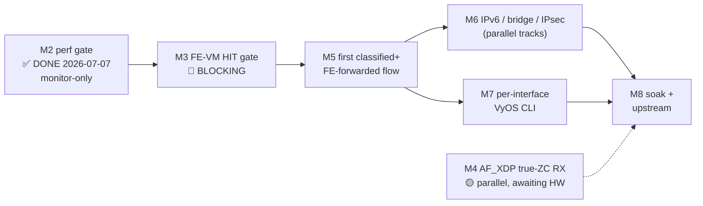

# ASK2 Master Plan — Single Authoritative Execution Plan

**Version 1.0.0 · 2026-07-19 · HADS 1.0.0**

## AI READING INSTRUCTION

This is the **single authoritative ASK2 execution plan**. It consolidates and
supersedes every prior ASK2 plan/roadmap document — the seven archived in
`plans/archive/` on 2026-07-19 (register in §8) and all older archived plans.
For sequencing, milestones, gates, and the live TODO list, read this document
and nothing else.

Read `[SPEC]` and `[BUG]` blocks for authoritative facts; `[NOTE]` for rationale
and history. Sources of truth that remain **live and binding** (this plan only
sequences them): silicon contract `arch/fman-fe-ehash.md` +
`arch/fman-microcode-210-programming-reference.md`; flow-key spec
`specs/fman-keygen-flow-key-spec.md`; state machine + CLI contract
`plans/DUAL-DATAPLANE.md`; API surface `arch/fman-pcd-api-reference.md`;
stub/type inventory `plans/TF-2026-07-18-001-function-inventory.md`.
Where this plan and those documents disagree, they win — update this plan.

---

## 1. Ground state (2026-07-19 · branch `dpaa1` · kernel 6.18.38-vyos)

### 1.1 The five-layer ASK2 stack

**[SPEC]** 107 board patches, single flavor-neutral dual-dataplane ISO
(`default|ask|vpp` flavor split retired 2026-06-14).

| Layer | Status | Blocker |
|---|---|---|
| **1. FMan PCD subsystem** (KG / CC / HM / PLCR) | ✅ SHIPPING — patches 0092–0118, 0151–0155 | — |
| **2. FE-VM ehash substrate** (pool, singletons, ehash, EXT_HASH, MUX/ENQ, arm) | ✅ BUILT, DORMANT — patches 0124–0131; byte-verified via `fe_*` debugfs against lf-5.4 LSDK oracle | — |
| **3. Classifier→FE arm** | ✅ Conditional scaffold (0161); `FmPortSetFESupport` auto-armed (F-072b/c/d, 2026-07-17); `fman_pcd_port_recover` de-wedge (0163/F-086) | FE-VM HIT path never activated under traffic |
| **4. ask.ko datapath** (genl + flow table + debugfs, ships dormant) | 🔴 DORMANT | Needs FE-VM HIT to function → blocked on M3 |
| **5. VyOS CLI + mutual exclusion** | 🔴 NOT STARTED | Gated on ask.ko datapath (M5) |

### 1.2 The one-deep gate

**[SPEC]** The whole project is gated one-deep: everything below layer 3 waits
on a single unproven event — **the first FE-VM HIT under live traffic (M3)**.
Every descriptor in the chain is byte-verified (§2 Gap A table); the HIT
datapath itself has never been tested. Until one flow HITs (stats increment +
kernel sees the packet on TX FQ `0x2B9`), layers 4–5 cannot start.

### 1.3 Silicon-proven facts (all on LS1046A hardware)

| Fact | Date | Evidence |
|---|---|---|
| **M2 perf gate PASS: 7.37 Gbps, 0.16% CPU** (hard gate ≥2 Gbps ≤5%) | 2026-07-07 | build 28809182051, AC_CC + CONT_LOOKUP pass-through, MTU 9000, 0 retransmit, 0 QMan errors |
| AC_CC overhead vs RSS: 3.6% | 2026-07-07 | 7.37 vs 7.26 Gbps baseline |
| FE-VM MISS→EXIT safe | 2026-07-10 | keysize=8, 600-frame MISS flood, zero corruption |
| FE-VM ENQ-as-kernel-delivery CLOSED | 2026-07-16 | 4 ENQ variants failed on silicon — architectural impossibility; MISS lives at CC layer |
| FmPortSetFESupport Gate A proven | 2026-07-15 | pool 0x54400/8448 B, 600-frame flood, first clean disengage (F-074 order) |
| 100× engage/disengage soak PASS | 2026-06-16 | 0 MURAM drift; VPP binds after 100th disengage |
| EKFC extraction MSB-first (SIP→DIP→PROTO→SPORT→DPORT) | 2026-07-13 | CRC-64 hash-match on two independent TCP flows on eth4 |
| CRC-64 raw, no final complement | 2026-07-13 | `crc64_raw(key)=0x600824e70ae4d573` matched HW @IC+0x48 |
| `fman_pcd_port_recover` functional | 2026-07-18 | debugfs `fe_recover` wired (0163/F-086) — cold-boot bottleneck eliminated |
| AF_XDP true-ZC fix committed | 2026-07-18 | 0164: RX-port accessor + params-page; awaiting HW deploy |
| Dual-DAC topology unblocked | 2026-07-14 | eth3+eth4 both SFP-H10GB-CU1M @10G on .185 |

---

## 2. Gaps to close (A–E)

### 2.1 Gap A — FE-VM HIT gate (M3) 🔴 BLOCKING

**[SPEC]** Component-by-component verification state of the dormant chain:

| Component | State | Verification |
|---|---|---|
| FE_ENTER AD | word0=0x40800000, word2=0xF6000000, word3→EXT_HASH | ✅ Correct (F-046 reverted; F-084 compose fix landed) |
| EXT_HASH FE | hashMask=0x7FFF, contextSize=13, hashShift=0, DDR=0xf7780000 | ✅ Correct |
| DDR bucket array | 524288 B, 32768 buckets × 16 B | ✅ Allocated, zeroed |
| Flow insert (key) | 13 B MSB-first at offset 8 in 256 B DDR record | ✅ Per SDK oracle |
| Flow insert (bucket) | `(crc64_raw(key) >> 48) & 0x7FFF` | ✅ Formula verified |
| MUX singleton | FE type=0x04000000, enq_off at word1 | ✅ F-060 v3d confirmed |
| ENQ singleton | word0=0x02810000 (ALLOCATE), word1=0x00000200 (FQID) | ✅ F-062d v2 confirmed |
| MISS terminal | hash FE word6 = EXIT at 0x55300 | ✅ Correct |
| **HIT datapath** | **NEVER TESTED** | 🔴 Test with FmPortSetFESupport auto-armed |
| keysize=13 stall | Unknown current status | 🔴 Prior results INVALIDATED — retest required |

**[NOTE]** All prior keysize=13 BMI-stall results are **invalidated**: they
predate F-072b/c/d (2026-07-17 23:47), which auto-arms the FE workspace pool on
every `fe_arm engage`. Without the pool, FE_ENTER ALLOCATE booked workspace at
garbage MURAM offset 0 — that root cause is fixed. Retest on the current build,
starting at keysize=8 / 4-tuple EKFC `0x00180006`, then scale to 13-byte
5-tuple EKFC `0x001C0006`.

### 2.2 Gap B — AF_XDP true-ZC RX (M4) 🟡 LANDED, AWAITING HW

**[SPEC]** Patch 0164 (RX-port accessor + `fman_pcd_port_ensure_params_page()`)
is committed. Once deployed: `fman_port_set_rx_bpool()` returns 0 (not −22) and
`xsk_zc_rx_redirect` climbs under XDP_ZEROCOPY bind + traffic. Follow-up scope:
`plans/ZC-RX-SCOPE.md`.

### 2.3 Gap C — Cross-track alignment (CC match → FE_ENTER) ⬜ PLANNED

**[NOTE]** The settled topology (spec v4.0 §6.1) places CC-layer CONT_LOOKUP as
the MISS→kernel path and FE-VM as the HIT→forward path. The CC match-table
insert path must target `FE_ENTER` for HIT entries (`numKeys>0`), not the
group-table miss-AD — the architectural handshake between the shipped CC
subsystem and the dormant FE-VM.

### 2.4 Gap D — `fman_pcd_budget` post-0166 (MURAM tracking) ⬜ PLANNED

**[NOTE]** New objects from 0164 (per-attach params page) must be tracked in
the `muram_budget` debugfs node (`arch/fman-pcd-api-reference.md` §16).

### 2.5 Gap E — VyOS CLI + ask.ko datapath activation ⬜ GATED ON A

**[SPEC]** Architectural glue, not new silicon work. The CLI is **per-interface**:
`set interfaces ethernet eth<n> offload ask` (§3 decision 9). Ready to wire once
the FE-VM path is proven; the validator enforces per-interface ASK↔VPP exclusion.

---

## 3. Binding architecture decisions

**[SPEC]** These decisions are binding on all future work:

1. **Fork-B (FE-VM ehash) is the datapath.** Fork-A (CONT_LOOKUP exact-match
   without FE) was hardware-proven to park frames on 210.10.1 (iter-49/50,
   2026-06-16: zero fault latched = disposition-less WAIT). Fork-B is the NXP
   production path and the only configuration known to flow.
2. **EKFC-only, no GEC.** `kgse_gec[]` stays zero. GEC adds permanent per-frame
   latency; EKFC extraction order is resolved (MSB-first, confirmed 2026-07-13).
3. **Raw CRC-64, no final complement.** Silicon stores `crc64_raw(key)` at IC
   offset 0x48 (seed `~0ULL`, no final XOR). CRC-64/XZ does NOT match hardware.
4. **MISS→kernel via CONT_LOOKUP pass-through.** The FE-VM has no viable
   kernel-delivery terminal (4 ENQ variants failed, closed on silicon
   2026-07-16). MISS resolves at the CC layer (`numKeys=0` → miss-AD → port PCD
   FQ); the FE-VM executes only on HIT.
5. **Single-image dual-dataplane.** S0 (mainline/RSS) at boot; S1 (ASK) on
   config commit; S2 (VPP) on `set vpp settings`. ASK↔VPP transitions always
   pass through S0. One ISO, one `version.json` feed (+ aliases).
6. **contextOffsetInWS = 0.** SDK default, verified correct on silicon.
7. **FmPortSetFESupport is MANDATORY for any FE-VM frame.** Without it,
   FE_ENTER ALLOCATE books workspace at MURAM offset 0 (F-072). Auto-armed on
   every `fe_arm engage` since F-072b (2026-07-17).
8. **GCM refused for IPsec** (CAAM A24a wire-sequence-duplication erratum
   breaks peer anti-replay). Offloaded suites: AES-CBC-SHA256 and
   AES-CTR-SHA256. `ask_xfrm_state_add` returns `-EOPNOTSUPP` for
   `rfc4106(gcm(aes))`.
9. **CLI contract (2026-07-19, supersedes the `set system offload ask` global
   knob):** ASK engages **per interface** —
   `set interfaces ethernet eth<n> offload ask`. Mutual exclusion is
   **per-interface**: one port cannot be both ASK and VPP; other ports are free
   (a port may run VPP while another runs ASK, each transition still via S0 per
   port). `set system offload classify` (vyos-1x-026) is **deprecated as a CLI**:
   the classify mechanism is kept, RSS + parser remain silent defaults
   programmed unconditionally, and ASK is the sole operator offload switch.

---

## 4. Milestone chain



### M2 — Performance gate ✅ DONE (regression-monitor only)

- **Gate:** ≥2 Gbps + ≤5% kernel-net CPU. Actual: **7.37 Gbps / 0.16% CPU**
  (2026-07-07, build 28809182051). NXP-ASK TX parity (8.58 Gbps cdx.ko) remains
  the M5 stretch target.
- **Monitor:** every build that changes `fman_pcd.c` or `dpaa_eth.c` re-runs
  the CONT_LOOKUP pass-through iperf3 gate.

### M3 — FE-VM HIT gate 🔴 BLOCKING

- **Gate:** one flow HIT — ehash stats increment AND kernel observes the packet
  on TX FQ `0x2B9`.
- **Dependencies:** F-072b auto-arm ✅, `fman_pcd_port_recover` ✅.
- **Key risk:** keysize=13 may still stall post-F-072b (BMI mechanics beyond
  the workspace pool). Mitigation: start keysize=8 / EKFC 4-tuple `0x00180006`
  → prove HIT → scale to 13-byte 5-tuple `0x001C0006`.
- **Calendar:** ~1 day of board sessions (was 5–10 sessions before
  `port_recover` eliminated the 2+ min cold-boot bottleneck).
- **HIT test sequence (board .185):**

```bash
# 1. Engage FE-VM on eth3 (hw port 0x10) — verify dmesg shows pool allocation
echo 'engage 10 0 2B9 1C0006' > /sys/kernel/debug/fman_pcd/0/fe_arm
# 2. Insert test flow (SIP=10.99.1.106 DIP=10.99.1.185 PROTO=6 SPORT=55002 DPORT=9999)
echo 'add 0A99016A0A9901B906D6DA270F 0x55500' > /sys/kernel/debug/fman_pcd/0/fe_flow
# 3. Send matching TCP SYN from peer .106: echo test | nc -w1 10.99.1.185 9999
# 4. PASS = stats increment + packet on TX FQ 0x2B9
# 5. If stall: echo '10' > /sys/kernel/debug/fman_pcd/0/fe_recover   (cold boot only if recover fails)
```

### M4 — AF_XDP true-ZC RX 🟡 parallel (AWAITING-HW)

- **Gate:** `xsk_zc_rx_redirect` > 0 under XDP_ZEROCOPY bind + traffic.
- **Dependencies:** 0164 deployed ✅, builder available. ~1 board session.

### M5 — First classified + FE-forwarded flow (GATED on M3)

- **Gate:** ask.ko inserts a flow → traffic HITs → kernel receives on TX FQ;
  `conntrack -L` shows the flow offloaded; teardown byte-clean.
- **Architecture:** `CONT_LOOKUP numKeys=1 match entry → FE_ENTER → EXT_HASH →
  DDR lookup → HIT → MUX → ENQ → TX FQ` (Gap C handshake).
- **Stretch:** automated nft flowtable offload ≥7 Gbps; NXP TX parity ≥8 Gbps.
- **Calendar:** ~1 week after M3.

### M6 — IPv6 + bridge + IPsec (parallel tracks, GATED on M5)

- **M6a IPv6:** dual-scheme EXT_HASH (separate v6 EKFC + ehash table, 37-byte key).
- **M6b Bridge:** L2 switchdev via `ask_bridge.ko` (F-06).
- **M6c IPsec:** CAAM descriptor-sharing forward-port (0134 dormant) +
  `xfrmdev_ops`. The F-01/F-07/F-02 landing series must ship **together** with
  `NETIF_F_HW_ESP` advertised **last** (silent-drop trap, TF-001 §F-01).
- **Calendar:** ~4 weeks parallel.

### M7 — VyOS CLI ships (GATED on M5; F-076 must be closed)

- **Gate:** `set interfaces ethernet eth<n> offload ask` engages ASK on that
  port; `delete interfaces ethernet eth<n> offload ask` restores S0 on it;
  `pcd-snapshot` diff clean after an engage→disengage cycle; validator rejects
  a config where the same port is both ASK and VPP.
- **Also in scope:** deprecate the `system offload classify` CLI (vyos-1x-026)
  — mechanism becomes silent default; op-mode `show interfaces ethernet eth<n>
  offload ask flows` via `ynl --family ask`.
- **Calendar:** ~1 week.

### M8 — Productization soak + upstream

- **Gates:** 100× trafficked engage/disengage cycles `pcd-snapshot`-clean;
  24 h alternating ASK/VPP; `ask-check` exits 0; policer BUG-3b flood half
  characterized; upstream submission begins.

---

## 5. Live TODO list

**[SPEC]** Keyed to milestones. Owner slots (`@___`) assigned at session start.
Stub-fix IDs per `plans/TF-2026-07-18-001-function-inventory.md`; the orphaned
P1–P3 closure series (`4493ce8`→`9970745`) is recoverable via `git reflog` —
re-land behind `bin/test-fixups.sh`, never before it passes.

### M3 — HIT gate (this week)

- [ ] **T-M3-1** `@___` — Deploy current ISO (F-072b/c/d + 0163 + 0164) on .185.
- [ ] **T-M3-2** `@___` — HIT session per §4 sequence at keysize=8 / EKFC `0x00180006`.
- [ ] **T-M3-3** `@___` — Scale to keysize=13 / EKFC `0x001C0006`; record stall-or-HIT.
- [ ] **T-M3-4** `@___` — On stall: `fe_recover` de-wedge, capture mode, cold boot only if recover fails.
- [ ] **T-M3-5** `@___` — Archive HIT evidence (stats + TX-FQ packet) to qdrant + journey log.

### P1 — Function-inventory re-land (before next board session, ~400 LOC)

- [ ] **T-P1-1** `@___` — F-08 `fman_pcd_fe_verify` (arm-time descriptor readback gate).
- [ ] **T-P1-2** `@___` — F-09+F-10+F-15: `dpaa_get_rx_default_fqid` + `_pcd_fqid_range`; kill hardcoded `tx_fqid=0x200`.
- [ ] **T-P1-3** `@___` — F-11: `fman_pcd_fe_flow_add` retype → `const struct fman_pcd_fe_flow_action *`.
- [ ] **T-P1-4** `@___` — F-12: `fman_pcd_fe_context_build` retype → `struct fman_ddr_region *`.
- [ ] **T-P1-5** `@___` — OOT-builder snapshot-fallback broadening (missing ANY of `Module.symvers` / `scripts/sign-file` / `certs/signing_key.pem`).

### M4 — true-ZC (parallel)

- [ ] **T-M4-1** `@___` — Deploy 0164; verify `xsk_zc_rx_redirect` > 0; measure throughput; close ZC-RX-SCOPE GAP-2.

### M5 — flow automation (after M3)

- [ ] **T-M5-1** `@___` — Gap C handshake: CC match-table HIT entries target FE_ENTER (`numKeys>0`).
- [ ] **T-M5-2** `@___` — Fix `ask_hw.c:581` keysize 12→13 for the ehash path.
- [ ] **T-M5-3** `@___` — Wire ask.ko REPLACE → `fman_pcd_fe_flow_add` (uses T-P1-3 retype); DESTROY → `_del`.
- [ ] **T-M5-4** `@___` — nft flowtable `hook forward` test; fall back to Path-B YNL interim if it breaks forwarding.
- [ ] **T-M5-5** `@___` — Wire TX bypass (0136 `fman_port_set_silicon_hit_release_all`) into engage/disengage.
- [ ] **T-M5-6** `@___` — Throughput gate: ≥7 Gbps automated (stretch ≥8 NXP parity), `conntrack -L` offloaded, teardown byte-clean.

### M6 — breadth (after M5)

- [ ] **T-M6-1** `@___` — IPv6 dual-scheme EXT_HASH + separate v6 ehash table.
- [ ] **T-M6-2** `@___` — F-06 `ask_bridge.c` real body (switchdev).
- [ ] **T-M6-3** `@___` — F-03 `ask_neigh.c` real body (NETEVENT_NEIGH_UPDATE → HMCT rebuild; kills stale-MAC blackholing).
- [ ] **T-M6-4** `@___` — IPsec landing series in one merge: F-01 + F-07 + F-02 + F-23 + F-21 + F-22 + F-20, then `NETIF_F_HW_ESP` LAST. GCM refused (§3.8).

### M7 — CLI (after M5; needs F-076 closed)

- [ ] **T-M7-1** `@___` — vyos-1x patch: `interfaces ethernet eth<n> offload ask` leaf (engage/disengage composes debugfs-proven verbs).
- [ ] **T-M7-2** `@___` — F-04 `ask_op.c` real body (op-mode netlink receiver).
- [ ] **T-M7-3** `@___` — Validator: reject same-port ASK+VPP (per-interface mutex; other ports free).
- [ ] **T-M7-4** `@___` — Deprecate `system offload classify` CLI (vyos-1x-026): remove CLI exposure, keep mechanism as silent default (RSS+parser); ASK is the sole offload switch.
- [ ] **T-M7-5** `@___` — Op-mode `show interfaces ethernet eth<n> offload ask flows` via `ynl --family ask`.

### M8 — productization

- [ ] **T-M8-1** `@___` — 100× trafficked engage/disengage soak, `pcd-snapshot` clean every cycle.
- [ ] **T-M8-2** `@___` — 24 h alternating ASK/VPP; VPP iperf3 pass after final disengage.
- [ ] **T-M8-3** `@___` — Observability: F-05 `ask_stats.c`, F-16/17/18 counter readers, F-19 `ASK_CMD_GET_MURAM`.
- [ ] **T-M8-4** `@___` — `ask-check` 24/24 OK on the board; policer flood characterization (serial + cold power-cycle).
- [ ] **T-M8-5** `@___` — Upstream prep: checkpatch/sparse clean, kunit ≥80% on `ask_flow.c`/`ask_genl_attr.c`.

---

## 6. Open defects gating milestones

| ID | Symptom | Status | Gates | Mitigation |
|---|---|---|---|---|
| **F-076** | Port RX deaf after FE-VM-armed disengage; `fe_arm.engaged` stays YES (blocks re-engage); cold boot recovers | OPEN | M7 reversibility claim | Suspected `detach_cc` KG-scheme restore on 10G ports + missing `disarm_fe` software-state sync; `fman_pcd_port_recover` untested as de-wedge. CONT_LOOKUP pass-through disengage without FE pool already clean (2026-07-06) |
| **keysize=13 stall** | BMI port 0x10 stalls on first FE-VM frame | RETEST (§2.1) | M3 | Prior results invalidated by F-072b; start keysize=8 |
| **BUG 3b flood half** | iperf3 flood under policer → watchdog reset | OPEN | M8 | Needs serial capture + cold power-cycle; **always repro policer with a few pings, never a flood** |
| **eth4 intermittent** | Link 10G up, zero traffic after engage/disengage on port 0x11 | OPEN | M3 (if eth4 used) | Likely F-076 family; pcd-snapshot A/B + prefer eth3 for bring-up |
| **nft ingress hook** | `flags offload` flowtable at hook ingress permanently breaks kernel forwarding | OPEN | M5 | Use `hook forward` (T-M5-4) or Path-B YNL interim |

---

## 7. Harness and gate mechanics

**[SPEC]** Traffic harness (`plans/TRAFFIC-HARNESS.md`): Proxmox LXCs on heidi —
CT201 `10.99.1.2/30` (eth3 peer, gw `10.99.1.1`), CT202 `10.11.1.2/29` (eth4
peer, gw `10.11.1.1`); the board is their L3 gateway so all CT201↔CT202 traffic
routes through it. Validated 4.14 Gbps @ 8 TCP streams software-forwarding
floor. SR-IOV VF → TRex reserved for true wire-rate.

**[SPEC]** Boards: `.185` DUT (dual-DAC eth3+eth4 @10G), `.106` vanilla fsl_dpa
sender, `.112` NXP-ASK parity reference (cdx.ko, 8.58 Gbps TX). MTU 9000
mandatory on 10G tests (MTU 1500 caps ~1.5 Gbps with retransmit storms).

**[SPEC]** Gate mechanics:
- `pcd-snapshot capture/diff` byte-exactness is the reversibility gate — never
  "ping works". `pcd-snapshot` **mutates eth3 only — never eth0** (SSH lifeline).
- `fe_*` debugfs byte-gate against the oracle BEFORE arming any new silicon path.
- Characterize new paths with **pings, never floods** (watchdog-reset risk).
- Forward write and its inverse land in the same patch; teardown proven by
  snapshot diff against the warm-S0 baseline.
- MURAM is iomem (`memset_io`/`memcpy_toio`/`writel`/`readl` only; zero after
  every `gen_pool` alloc). ehash bucket arrays in DDR, never MURAM.
- `ask-check` is the burndown chart; exits 0 at M8.
- M2 regression-monitor (§4 M2) runs on every `fman_pcd.c`/`dpaa_eth.c` change.

---

## 8. Superseded-document register

**[SPEC]** Seven plans archived 2026-07-19 (`plans/archive/`, pointer stubs at
the old paths). Where their content lives now:

| Archived document | Prior role | Content folded into |
|---|---|---|
| `ASK2-JOURNEY-REVIEW-2026-07-18.md` | Status + forward plan (immediate predecessor) | §1 ground state, §2 Gaps A–E, §3 decisions 1–7, §4 milestones, §6 defects |
| `ASK2-DEVELOPMENT-PLAN.md` | Phase 0–6 execution plan | Phase chain → §4 milestones; execution-log evidence → §1.3; retired ceilings → §3.1/§7; pre-GA hardening (policer arm, RSS SYM, PPPoE soft-parser) → §5 backlog |
| `COMPLETION-PLAN.md` | Cross-track (DPAA1/VPP/ASK2) roadmap | ASK2 build order → §4; traffic harness → §7; per-mode DoD → §4 gates; DPAA1/VPP items complete → history |
| `ASK2-PHASE2-AUTOMATION-PLAN.md` | Flow-offload automation (T1–T6) | Three insertion paths (nft/YNL/debugfs) + T-tasks → §5 M5; failure modes → §6; exit criteria → §4 M5 gate |
| `ASK2-PERFORMANCE-MODERNIZATION.md` | cdx.ko parity + opcode gap analysis | NXP parity targets → §4 M5 stretch; MANIP/NAT opcode gaps → §5 M6 backlog; MURAM budget → §7 + `arch/muram.md` |
| `ASK2-F3-F6-UNBLOCK-PROPOSAL.md` | F3/F6 blocker analysis + bisect | Regression history → §6 F-076/eth4 rows; bisect outcome (4300071 TX-bypass era) → T-M5-5; Option A (0148 resurrection) → superseded by T-P1 re-land |
| `ASK-PLANS.md` | Doc hub (2026-06-09) | Indexing role → `specs/ask2-rewrite-spec.md` v1.10 + this §8; maintenance rules → `plans/archive/README.md` |

**[SPEC]** Documents that remain **live** (not archived): `plans/DUAL-DATAPLANE.md`
(state machine + CLI contract — owns both, not sequencing), `plans/TRAFFIC-HARNESS.md`,
`plans/TF-2026-07-18-001-function-inventory.md` (stub/type inventory behind §5),
`plans/OFFLOAD-CAPABILITIES.md`, `plans/MODULE-INVENTORY.md`, `plans/ZC-RX-SCOPE.md`,
`plans/ASK-ISO-BUILD-AND-INSTALL.md` (operator how-to), the patching-pipeline docs
(`TA-2026-07-18-002-patch-architecture.md`, `patching-improvement-plan.md`,
`skip-ledger.md` — orthogonal to ASK2 feature sequencing), and all of `arch/` and
`specs/` (silicon references — authoritative for their domains).

**[NOTE]** Maintenance rule: when a milestone gate passes, flip its §4 status,
check off §5 items, and log evidence to qdrant in the same change. When a TODO
spawns a defect, add it to §6. Do not author new ASK2 plan documents — extend
this one.
