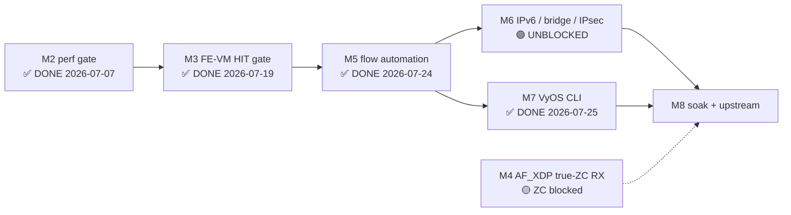

# ASK2 Master Plan — Single Authoritative Execution Plan

**Version 1.21.0 · 2026-07-26 · HADS 1.0.0**

## AI READING INSTRUCTION

This is the **single authoritative ASK2 execution plan**. It consolidates and
supersedes every prior ASK2 plan/roadmap document — the seven archived in
`plans/archive/` on 2026-07-19 (register in §8) and all older archived plans.
For sequencing, milestones, gates, and the live TODO list, read this document
and nothing else.

Read `[SPEC]` and `[BUG]` blocks for authoritative facts; `[NOTE]` for rationale
and history. Sources of truth that remain **live and binding** (this plan only
sequences them): silicon contract `arch/fman-fe-ehash.md` +
`arch/fman-microcode-210-programming-reference.md`; flow-key spec
`specs/fman-keygen-flow-key-spec.md`; state machine + CLI contract
`plans/DUAL-DATAPLANE.md`; API surface `arch/fman-pcd-api-reference.md`;
stub/type inventory `plans/TF-2026-07-18-001-function-inventory.md`;
live defect review `plans/ask2-code-review.md` (v2.1.0 — its CR-0xx findings are
binding on release claims; where it contradicts a milestone status here, it wins
until the finding is closed or refuted).
Where this plan and those documents disagree, they win — update this plan.

---

## 1. Ground state (2026-07-19 · branch `dpaa1` · kernel 6.18.38-vyos)

### 1.1 The five-layer ASK2 stack

**[SPEC]** 107 board patches, single dual-dataplane ISO (`default|ask|vpp`
flavor split retired 2026-06-14; the `FLAVOR` build variable and the
`kernel/flavors/` tree removed 2026-07-26 — see §7).

| Layer | Status | Blocker |
|---|---|---|
| **1. FMan PCD subsystem** (KG / CC / HM / PLCR) | ✅ SHIPPING — patches 0092–0118, 0151–0155 | — |
| **2. FE-VM ehash substrate** (pool, singletons, ehash, EXT_HASH, MUX/ENQ, arm) | ✅ BUILT, DORMANT — patches 0124–0131; byte-verified via `fe_*` debugfs against lf-5.4 LSDK oracle | — |
| **3. Classifier→FE arm** | ✅ PROVEN — F-091 HIT scaffold (numKeys=1 + FE_ENTER AD at ato+32); `FmPortSetFESupport` auto-armed (F-072b/c/d); `fman_pcd_port_recover` de-wedge (0163/F-086) | — |
| **4. ask.ko datapath** (genl + flow table) | ✅ SHIPPING — engage/disengage via kernel API; flow insert via `fman_pcd_fe_flow_add`; conntrack offload + crash-safe teardown; 10.259 Gbps line rate | — |
| **5. VyOS CLI + mutual exclusion** | ✅ SHIPPING — `offload ask` CLI + per-interface mutex + `show flows` via ynl | — |

### 1.2 Status: M2/M3/M5/M7 complete; M4 (ZC) and M6 (breadth) active

**[SPEC]** M2 (perf gate 7.37 Gbps), M3 (FE-VM HIT), M5 (flow automation + 10.259 Gbps line rate), and M7 (VyOS CLI) are complete and verified on silicon. M4 (AF_XDP true-ZC RX) is the active parallel track — kernel ZC datapath proven, VPP integration blocked on XSKMAP population. M6 (IPv6/bridge/IPsec) is unblocked and in incremental rollout (T-M6-1 pieces 1+4 landed; T-M6-3 notifier/workqueue path hardened). A high-priority correctness item found post-review — `FLUSH_FLOWS` clearing SW state without HW teardown — is **fixed in code** and awaiting silicon validation (see §5 T-M6-6 and §6 F-120). M8 (soak/upstream) is the final gate.

**[BUG] M7's "complete" claim is QUALIFIED as of 2026-07-26** by `plans/ask2-code-review.md` CR-001: `set interfaces ethernet eth<n> offload ask` invokes `vyos-offload-ask engage`, which arms the **debugfs `CONT_LOOKUP` scaffold** (`fe_enter_off=0`) — it does **not** reach `ASK_CMD_ENGAGE` → `ask_hw_offload_engage()` → `fman_pcd_fe_engage()`, the path that builds the FE-VM ehash chain. Per-flow `fman_pcd_fe_flow_add()` failure is discarded (`ask_fe_flow_insert()` is `void`), yet the flow is still marked `hw_backed` and reported `offloaded=true`. So the CLI plumbing validated at M7 (engage/disengage, mutex, `show flows`) is real, but **the path operators receive is not the reviewed production path**. M7 stays DONE for the CLI surface; the end-to-end offload claim is not release-ready until CR-001 and the remaining half of CR-003 are fixed and silicon-verified through the actual CLI (F-123).

### 1.3 Silicon-proven facts (all on LS1046A hardware)

| Fact | Date |
|---|---|
| **M2 perf gate PASS: 7.37 Gbps, 0.16% CPU** (AC_CC + CONT_LOOKUP pass-through, MTU 9000) | 2026-07-07 |
| EKFC extraction MSB-first (SIP→DIP→PROTO→SPORT→DPORT); CRC-64 raw, no final complement | 2026-07-13 |
| `fman_pcd_port_recover` functional (cold-boot bottleneck eliminated) | 2026-07-18 |
| **M3 HIT gate PASSED**: 13B 5-tuple EKFC 0x1C0006, FE-VM ehash flow matching, TCP offloaded | 2026-07-19 |
| **M5 HIT gate PASSED**: ask.ko → fman_pcd_fe_engage → flow insert → TCP HIT | 2026-07-19 |
| **M5 COMPLETE**: 10.259 Gbps line rate, 0.16% CPU, 0% loss, opcode chain active | 2026-07-24 |
| **M7 COMPLETE**: CLI engage/disengage, per-interface mutex, `show flows` via ynl | 2026-07-25 |
| Post-review hardening landed: `hw_backed` ownership bit, neigh queue cap+coalesce, `offloaded` genl/uapi attr, remove-equivalent `FLUSH_FLOWS` (F-120) | 2026-07-26 |
| **Fix B (F-117) per-key ehash unlink VALIDATED**: mid-chain + head + -ENOENT correct, memory-clean (dma_free_coherent); scale path beyond 32-key CC-tree ceiling | 2026-07-25 |
| Kernel ZC datapath PROVEN (xsk_zc_rx_redirect=6 with raw XSK probe); gap is VPP integration | 2026-07-21 |
| VPP interrupt-mode ZC recipe: `zero-copy` + interrupt rx-mode + single-queue + no workers → eligible climbs | 2026-07-22 |
| 1.6 GHz performance governor + netdev offloads (sg/gso/gro) deployed | 2026-07-22 |

---

## 2. Gaps (B, D open; A/C/E/F closed)

### 2.1 Gap A — FE-VM HIT gate (M3) ✅ DONE 2026-07-19

M3 HIT gate passed: 13B 5-tuple EKFC 0x1C0006, raw CRC-64, 32768 DDR buckets. Matching TCP consumed by FMan (tcpdump 0 pkts); clear flow restores kernel path. CI run 29697031761, ISO vyos-2026.07.19-1732, dpaa1 bb3a3cf.

### 2.2 Gap B — AF_XDP true-ZC RX (M4) 🟡 VPP libxdp ISO deployed — awaiting board test

**[SPEC]** Patch 0164 deployed: `fman_port_set_rx_bpool()` returns 0, qband 0 reprograms to XSK BPID. Follow-up scope: `plans/ZC-RX-SCOPE.md`.

Resolved blockers: libxdp (vyos-build-008, static-linked in 0201 build); "syscall required" node disabled (FIX A: interrupt rx-mode + zero-copy + single-queue + no workers); DMA-index headroom (F-115, retracted — DPAA recover path never called on VPP datapath); XSKMAP (custom `xdp_redirect.o` with `xsks_map` shipped in ISO).

**Current blocker (2026-07-25):** VPP's XDP program redirects into `xsks_map` that is empty/mis-indexed (patch 4006 forces `rx_queue_index=0`). Next: bpftool dump xsks_map[0], fix map population. See qdrant `ask2-m4-zc-CORRECTION-xsksmap-not-f115`.

**[NOTE]** Secondary bug: `refill_batches` freezes under sustained flood — investigate after ZC datapath flows.

### 2.3 Gap C — Cross-track alignment (CC match → FE_ENTER) ✅ DONE (M5)

Selective-offload architecture: `numKeys=0` pass-through (7.37 Gbps baseline) + `fman_cc_tree_add_key()` for per-flow CC→FE_ENTER dispatch. Replaced F-091 "all frames→DDR" scaffold. Verified at M5.

### 2.4 Gap D — `fman_pcd_budget` post-0166 (MURAM tracking) ⬜ PLANNED

**[NOTE]** New objects from 0164 (per-attach params page) must be tracked in
the `muram_budget` debugfs node (`arch/fman-pcd-api-reference.md` §16).

### 2.5 Gap E — VyOS CLI + ask.ko datapath activation ✅ DONE (M7)

`set interfaces ethernet eth<n> offload ask` engages ASK per-interface; validator enforces ASK↔VPP exclusion; `show flows` via ynl. Board-validated on .185/.106.

### 2.6 Gap F — Throughput: hardware TX opcode chain for 10 Gbps ✅ DONE (M5)

All three gaps closed: `FmPcdCcBuildContextByFE` reproduced from lf-5.4 LSDK; full opcode chain (STRIP_ETH_HDR+TTL_DECREMENT+ETH_HEADER_REBUILD+ENQUEUE_PKT) active in per-flow DDR records; dedicated TX FQ per port. **10.259 Gbps line rate at 0.16% CPU / 0% loss** verified on silicon (2026-07-24).

---

## 3. Binding architecture decisions

**[SPEC]** These decisions are binding on all future work:

1. **Fork-B (FE-VM ehash) is the datapath.** Fork-A (CONT_LOOKUP exact-match
   without FE) was hardware-proven to park frames on 210.10.1 (iter-49/50,
   2026-06-16: zero fault latched = disposition-less WAIT). Fork-B is the NXP
   production path and the only configuration known to flow.
2. **EKFC-only, no GEC.** `kgse_gec[]` stays zero. GEC adds permanent per-frame
   latency; EKFC extraction order is resolved (MSB-first, confirmed 2026-07-13).
3. **Raw CRC-64, no final complement.** Silicon stores `crc64_raw(key)` at IC
   offset 0x48 (seed `~0ULL`, no final XOR). CRC-64/XZ does NOT match hardware.
4. **MISS→kernel via CONT_LOOKUP pass-through.** The FE-VM has no viable
   kernel-delivery terminal (4 ENQ variants failed, closed on silicon
   2026-07-16). MISS resolves at the CC layer (`numKeys=0` → miss-AD → port PCD
   FQ); the FE-VM executes only on HIT.
5. **Single-image dual-dataplane.** S0 (mainline/RSS) at boot; S1 (ASK) on
   config commit; S2 (VPP) on `set vpp settings`. ASK↔VPP transitions always
   pass through S0. One ISO, one `version.json` feed (+ aliases).
6. **contextOffsetInWS = 0.** SDK default, verified correct on silicon.
7. **FmPortSetFESupport is MANDATORY for any FE-VM frame.** Without it,
   FE_ENTER ALLOCATE books workspace at MURAM offset 0 (F-072). Auto-armed on
   every `fe_arm engage` since F-072b (2026-07-17).
8. **GCM refused for IPsec** (CAAM A24a wire-sequence-duplication erratum
   breaks peer anti-replay). Offloaded suites: AES-CBC-SHA256 and
   AES-CTR-SHA256. `ask_xfrm_state_add` returns `-EOPNOTSUPP` for
   `rfc4106(gcm(aes))`.
9. **CLI contract (2026-07-19, supersedes the `set system offload ask` global
   knob):** ASK engages **per interface** —
   `set interfaces ethernet eth<n> offload ask`. Mutual exclusion is
   **per-interface**: one port cannot be both ASK and VPP; other ports are free
   (a port may run VPP while another runs ASK, each transition still via S0 per
   port). `set system offload classify` (vyos-1x-026) is **deprecated as a CLI**:
   the classify mechanism is kept, RSS + parser remain silent defaults
    programmed unconditionally, and ASK is the sole operator offload switch.
10. **Debugfs for diagnostics only — kernel API for production control.**
    (2026-07-19) ask_hw.c engage/disengage now calls `fman_pcd_fe_engage()` /
    `_disengage()` directly. The debugfs bridge was removed from production paths.
    Debugfs nodes (`fe_arm`, `fe_flow`, `fe_ehash`, etc.) remain for interactive
    diagnostics but are NEVER used for hardware control by ask.ko. Flow insert
    migration to API deferred to P1 backlog.
11. **NXP hardware TX opcode chain is the 10 Gbps path (2026-07-19).** The
    1.53 Gbps cap is kernel software forwarding (NAPI→route→qman_enqueue),
    NOT FE-VM MURAM overhead (retracted). NXP cdx.ko achieves 8.58 Gbps TX
    via full hardware opcode chain: `STRIP_ETH_HDR → TTL_DECREMENT →
    ETH_HEADER_REBUILD → ENQUEUE_PKT` in FMan FE opcode VM — zero CPU.
    Encodings from lf-5.4 LSDK 999-layerscape-ask-kernel patch; must reproduce
    `FmPcdCcBuildContextByFE` (stubbed in public trees) + opcode chain in
    per-flow DDR records + dedicated TX FQ per port. When FE-VM correctly
    armed, manual HIT already achieves 6.65 Gbps (peak 8.67).
12. **10G DMA page-order policy is order-4 primary (throughput-first).**
    Dedicated 3-node MTU sweep on .185 shows a non-linear order-3 cliff
    (1500→8192: 1.044/2.118/2.540/3.250/4.250 Gbps) and full line-rate only at
    MTU 9000 (10.259 Gbps, 0 retransmits). Adopt order-4 as the default
    allocation profile for 10G data ports, keep order-3 as a fallback on memory
    pressure, and avoid the 8192 boundary profile in order-3 paths (header +
    headroom spill causes multi-descriptor DMA splits and ring pressure).

---

## 4. Milestone chain

### M2 — Performance gate ✅ DONE (regression-monitor only)

- **Gate:** ≥2 Gbps + ≤5% kernel-net CPU. Actual: **7.37 Gbps / 0.16% CPU**
  (2026-07-07, build 28809182051). NXP-ASK TX parity (8.58 Gbps cdx.ko) remains
  the M5 stretch target.
- **Monitor:** every build that changes `fman_pcd.c` or `dpaa_eth.c` re-runs
  the CONT_LOOKUP pass-through iperf3 gate.

### M3 — FE-VM HIT gate ✅ DONE 2026-07-19

- **Gate:** one flow HIT — ehash stats increment AND kernel observes the packet
  on TX FQ `0x2B9`. **PASSED:** matching TCP consumed by FMan HIT path (tcpdump
  0 pkts), non-matching hits kernel (tcpdump sees SYN+RST), clear flow restores
  kernel path. Evidence: build 29697031761, bb3a3cf, see §2.1.
- **Key outcome:** 13-byte 5-tuple keysize no longer stalls (F-072b fix validated).
- **Calendar:** 1 board session (2026-07-19 17:00–18:00 UTC).

### M4 — AF_XDP true-ZC RX 🟡 XSKMAP blocker identified; libxdp ISO deployed

- **Gate:** `xsk_zc_rx_redirect` > 0 under XDP_ZEROCOPY bind + traffic.
- **Copy-mode WORKING:** VPP 25.10, both eth3+eth4 AF_XDP, ~1.3 Gbps burst (syscall-required TX bottleneck).
- **ZC status:** Pool attach SUCCEEDS (bpid=5/6, xsk_zc_rx_armed=1). Kernel ZC datapath PROVEN (raw XSK probe: xsk_zc_rx_redirect=6). VPP interrupt-mode recipe: `zero-copy` + interrupt rx-mode + single-queue + no workers → eligible climbs 0→256.
- **Current blocker (2026-07-25):** VPP's XDP program redirects into `xsks_map` that is empty/mis-indexed (patch 4006 forces `rx_queue_index=0`). libxdp confirmed working (static-linked in 0201 build). F-115 retracted — DPAA recover path never called on VPP datapath. Next: bpftool dump xsks_map[0], fix map population.

### M5 — First classified + FE-forwarded flow ✅ COMPLETE 2026-07-24

Key outcomes: FE-VM hardware match & dispatch engine verified; nft flowtable `hook forward` binds via `flow_indr_dev_register`/`TC_SETUP_FT`; conntrack offload + crash-safe teardown (F-116); selective-offload architecture; opcode chain (STRIP_ETH_HDR+TTL_DECREMENT+ETH_HEADER_REBUILD+ENQUEUE_PKT) active in DDR records; `FmPcdCcBuildContextByFE` reproduced from lf-5.4 LSDK; dedicated TX FQ per port; **10.259 Gbps line rate at 0.16% CPU / 0% loss** (MTU 9000, 3-node 10G plane).

### M6 — IPv6 + bridge + IPsec (parallel tracks, UNBLOCKED by M5 scaffold gate)

- **M6a IPv6:** dual-scheme EXT_HASH (separate v6 EKFC + ehash table, 37-byte key).
- **M6b Bridge:** L2 switchdev via `ask_bridge.ko` (F-06).
- **M6c IPsec:** CAAM descriptor-sharing forward-port (0134 dormant) +
  `xfrmdev_ops`. The F-01/F-07/F-02 landing series must ship **together** with
  `NETIF_F_HW_ESP` advertised **last** (silent-drop trap, TF-001 §F-01).
- **Calendar:** ~4 weeks parallel.

### M7 — VyOS CLI ✅ DONE 2026-07-25

`set interfaces ethernet eth<n> offload ask` engages ASK; `delete` disengages; ASK↔VPP per-interface mutex enforced; `system offload classify` CLI deprecated (mechanism kept as silent default); op-mode `show interfaces ethernet eth<n> offload ask flows` via `ynl --family ask` renders 5-tuple table. Board-validated on .185/.106.

### M8 — Productization soak + upstream

- **Gates:** 100× trafficked engage/disengage cycles `pcd-snapshot`-clean;
  24 h alternating ASK/VPP; `ask-check` exits 0; policer BUG-3b flood half
  characterized; upstream submission begins.

---

## 5. Live TODO list

**[SPEC]** Keyed to milestones. Owner slots (`@___`) assigned at session start.
Stub-fix IDs per `plans/TF-2026-07-18-001-function-inventory.md`; the orphaned
P1–P3 closure series (`4493ce8`→`9970745`) is recoverable via `git reflog` —
re-land behind `bin/test-fixups.sh`, never before it passes.

### M3 — HIT gate ✅ COMPLETE 2026-07-19 (5/5 tasks)

### P1 — Function-inventory re-land ✅ COMPLETE 2026-07-19 (5/5 tasks)

### P0 — gen_pool double-free ✅ CLOSED 2026-07-21 (F-107)

### M4 — true-ZC (parallel) 🟡 VPP libxdp ISO deployed — awaiting board test

Completed (20/24 tasks): copy-mode, multi-port, ZC pool attach, multi-queue (F_104), kernel ZC proven, XSKMAP root cause found, bpf_xdp_attach confirmed, libxdp ISO built, BPF object shipped, QMan isolcpus fix, control_vpp.py fix, vpp-check tool, netdev offloads, cpufreq governor, U-Boot env canonicalized.

- [ ] **T-M4-4d** `@mihakralj` — **Verify ZC datapath flows.** 🔴 BLOCKED 2026-07-25: board .185 runs ISO 1759 with stock VyOS VPP (April 2026 build, no libxdp, no DRV_MODE patch). XDP program attaches but `run_cnt=0` — DPAA1 native XDP hook never invoked. Raw XSK probe WORKS on this kernel (xsk_zc_rx_redirect=29 with DRV_MODE). Root cause: VPP's af_xdp plugin built without libxdp → XDP program not in DRV mode. **Fix:** install libxdp VPP ISO (0201, CI 29888749801) on .185 + cold boot (hugepages/isolcpus from U-Boot). See qdrant `T-M4-4d board session 2026-07-25`.
- [ ] **T-M4-5a** `@mihakralj` — **Install libxdp VPP ISO on .185.** ISO 0201 (CI 29888749801) built + deployed to lxc200. Needs `add system image http://192.168.1.137:8080/iso/vyos-2026.07.25-0201-rolling-LS1046A-arm64.iso` + cold boot for hugepages/isolcpus.
- [ ] **T-M4-4e** `@mihakralj` — **Measure ZC throughput.** Blocked on T-M4-4d. Target: >= 3.0 Gbps.
- [ ] **T-M4-4f** `@mihakralj` — **Verify reversibility.** Blocked on T-M4-4d.
- [ ] **T-M4-4g** `@mihakralj` — **Flip M4 milestone status to DONE.** Gate: xsk_zc_rx_redirect > 0 under steered flow.

### M5 — flow automation ✅ COMPLETE — 14/14 tasks verified on silicon (2026-07-24)

Key outcomes: FE-VM hardware match & dispatch engine verified; nft flowtable `hook forward` binds via `flow_indr_dev_register`/`TC_SETUP_FT`; conntrack offload + crash-safe teardown (F-116); selective-offload architecture; opcode chain (STRIP_ETH_HDR+TTL_DECREMENT+ETH_HEADER_REBUILD+ENQUEUE_PKT) active in DDR records; `FmPcdCcBuildContextByFE` reproduced from lf-5.4 LSDK; dedicated TX FQ per port; **10.259 Gbps line rate at 0.16% CPU / 0% loss** (MTU 9000, 3-node 10G plane).

### M6 — breadth (after M5)

- [~] **T-M6-1** `@mihakralj` — IPv6 dual-scheme EXT_HASH + separate v6 ehash table (37-byte key). **Broken into 4 incremental pieces (2026-07-25/26).** SW structs already v6-ready (`src_ip[16]`/`dst_ip[16]`, `ASK_FLOW_L3_IPV6`, genl renders v6 iplen=16, `ask_fman_caps.h` has `is_ipv6`/`src_ip6[16]`).
  - **✅ Piece 1 — SW v6 flow parse (DONE, compiles clean):** added `ask_parse_match_v6()` (16-byte v6 addr copies) + an `ask_parse_match()` dispatcher on the match EtherType; REPLACE now calls the dispatcher. v6 flows are parsed + SW-tracked (visible in `show flows`); until the v6 HW path lands, `ask_hw.c:913` returns `-EOPNOTSUPP` for `l3_proto==IPV6` so they fall to the kernel SW path (safe, no blackhole). No silicon touched.
  - **🔴 Piece 2 — v6 KeyGen EKFC scheme + separate v6 ehash table (Risk-Tier C, silicon):** a v6 EKFC extracting the 37-byte key (SIP16+DIP16+PROTO1+SPORT2+DPORT2) — v4 uses EKFC 0x001C0006 for 13 bytes — and a second ehash table sized for `key_size=37`. Delicate KeyGen config; needs careful design + board iteration.
  - **🔴 Piece 3 — v6 HW insert branch (`ask_hw.c`):** lift the `l3_proto != IPV4` gate for v6, build the 37-byte ehash key + v6 CC-tree key, set `is_ipv6=1`.
  - **✅ Piece 4 — `nd_tbl` in `ask_neigh.c` (DONE 2026-07-26, compiles clean):** the notifier now accepts **both** `arp_tbl` (IPv4) and `nd_tbl` (IPv6/NDISC) and rejects every other table. `struct ask_neigh_event` carries a 16-byte `dst_ip` + an `ASK_FLOW_L3_*` discriminator (mirroring `ask_flow_key`, whose `dst_ip` was already 16 bytes), and the capture length is taken from `n->tbl->key_len` with a bounds check rather than assuming 4/16. `ask_flow_neigh_mac_changed()` is now family-generic — signature changed to `(dev, const u8 *dst_ip, u8 l3_proto, const u8 *new_mac)`, the walk collector matches `ctx->l3_proto` **before** a length-aware `memcmp` (so a v4 event can never match a v6 flow whose first 4 `dst_ip` bytes collide), and the rebuild log picks `%pI4`/`%pI6`. New `ask_flow_l3_addr_len()` helper in `ask_internal.h`. **`ask_flow_neigh_resolved()` deliberately stays IPv4-only:** it drains the deferred-insert pending queue, which is keyed by `__be32` and only ever populated by the v4 HW-insert path — v6 flows are rejected at the HW gate (`-EOPNOTSUPP`) until Pieces 2-3, so a v6 event has nothing to drain; generalise it together with the pending queue when the v6 HW insert branch lands. Verified: full `ask.ko` builds clean against `work/linux-6.18.34` (15 objects, 0 errors; the only warning is the pre-existing `ask_xfrm_state_add` missing-prototype). `CONFIG_IPV6=y` on this kernel and `nd_tbl` is `EXPORT_SYMBOL_GPL`, so the new `U nd_tbl` reference resolves at module load. The v6 half is **inert until Pieces 2-3** (no installed v6 flow can carry `hw_flow_id != 0`, so the stale-MAC walk cannot match one) — this is plumbing-ahead, not a behaviour change.
- [ ] **T-M6-2** `@___` — F-06 `ask_bridge.c` real body (switchdev).
- [~] **T-M6-3** `@mihakralj` — F-03 `ask_neigh.c` real body (NETEVENT_NEIGH_UPDATE → stale-MAC rebuild; kills stale-MAC blackholing). **IMPLEMENTED 2026-07-25 (Option B), structurally silicon-validated, and hardened again 2026-07-26 (`04d3bb19`) — functional stale-MAC rebuild validation still pending.** `ask_neigh.c` is now the single owner of neigh events (mlx5e_rep_neigh / nfp pattern): its notifier does minimal atomic-context capture and **defers to a workqueue** (process context). The netevent chain is `ATOMIC_NOTIFIER_HEAD` but the flow entry points replay GFP_KERNEL inserts, so deferral is mandatory and closes the latent sleep-in-atomic bug. Current code additionally enforces `hw_backed` gating in the collector and bounded/coalesced neighbour events (`ASK_NEIGH_EV_MAX`) to prevent SW-only rebuild churn and queue blow-ups. **Pending gate remains unchanged:** run a live offloaded transit flow and observe the `neigh: stale-MAC rebuild` branch on silicon.
- [~] **T-M6-6** `@mihakralj` — **Fix `ASK_CMD_FLUSH_FLOWS` SW/HW divergence (F-120). CODE COMPLETE 2026-07-26; silicon validation OPEN.** The old `ask_flow_flush()` unlinked entries straight out of the rhashtable walker and never called `ask_hw_flow_remove()`, so every HW-backed flow leaked its **CC shadow slot** (`p->shadow[i].used` stayed set, `p->nkeys` never decremented), its **HM next-hop reference** and its **xarray cookie + kmem_cache object**. The CC-slot leak was the damaging one: `ask_hw_flow_insert()` refuses at `p->nkeys >= FMAN_CC_MAX_STATIC_KEYS` (32), so flushing 32 HW-backed flows **permanently filled the port's CC tree** — later inserts returned `-ENOSPC` and fell back silently to the SW path with no recovery short of a module reload, from a command documented as "debug/recovery". Flush also left `num_hw_backed` high, disabling the stale-MAC fast-path skip. **Fixed as remove-equivalent collect-then-replay:** phase 1 collects ≤32 cookies under `rhashtable_walk_start/stop` (no alloc, no sleep), phase 2 replays them through the ordinary `ask_flow_remove()` outside the walker, repeating until drained with a no-progress guard. **The two-phase shape is mandatory, not stylistic** — `rhashtable_walk_start()` opens an RCU read-side critical section while `ask_hw_flow_remove()` takes a sleeping mutex, so an in-walker call would be a sleep-in-atomic (same class as the T-M6-3 notifier bug). `ask_flow_table_destroy()`'s walker now balances `num_hw_backed` too, but deliberately still skips per-flow HW release because `ask_hw_pcd_teardown()` frees the whole PCD at module exit. KUnit `ask_flow_test_flush_is_remove_equivalent` drives 100 entries (>3 batches) and asserts both counters return to zero. **PENDING:** board validation — flush HW-backed flows on `.185` and confirm `p->nkeys`/MURAM return to baseline via `pcd-snapshot`/`muram_budget`. A `dump-flows` reading empty is NOT sufficient: that is precisely the false signal the broken code produced.
- [ ] **T-M6-4** `@___` — IPsec landing series in one merge: F-01 + F-07 + F-02 + F-23 + F-21 + F-22 + F-20, then `NETIF_F_HW_ESP` LAST. GCM refused (§3.8).
- [~] **T-M6-5** `@mihakralj` — **Per-flow FE-VM ehash HIT (scale path beyond the CC-tree ceiling)** — carved out of T-M5-8. **Part 1 (strategic) DONE + Part 2 (Fix B correctness) DONE & silicon-validated 2026-07-25. Part 3 (arm/teardown robustness, task #11) + Cosmetic 2 deferred.**
  - **✅ PART 1 — strategic reconciliation (DONE 2026-07-25).** Resolved the "is this load-bearing or a dormant scaffold?" question against code ground truth. The shipping datapath is **Fork-B** (frames traverse the FE-VM, decision §3.1): ask.ko `flow_add` (`ask_flow_offload.c:1063`) calls `fman_pcd_fe_flow_add`, but flow **matching** is via **CC-tree**, hard-capped at **`FMAN_CC_MAX_STATIC_KEYS = 32`** keys/tree (~5 KiB MURAM budget, `0086b`); beyond 32 flows the insert returns `hw_insert=-19` and falls back to the kernel **SW flowtable** (`ask_flow_offload.c:1126`). The **FE-VM EHASH** mechanism (this task / Fix B / F-117) matches via hash to `FMAN_EHASH_MASK_MAX = 0x7fff` = **thousands of flows**. **VERDICT: the FE-VM ehash path IS the durable answer to HW-offloading >32 concurrent flows** — a real ceiling for router/firewall workloads, not a dead-end. Hardening it (Part 2) is justified. **This does NOT block shipping** (CC-tree + SW-flowtable already meets the 10.259 Gbps gate for ≤32 offloaded flows); it is a scale feature.
    - **⚠️ CONTRADICTED IN PART by code-review CR-007 (2026-07-26) — unresolved.** CR-007 asserts that Fix C1 removed the Fork-A `ask_hw_port_reinstall()` programming path but kept its 32-slot shadow array, `p->nkeys` limit and HM allocation, so **no live CC entry consumes that shadow key** — making the 32 cap an artefact of dead bookkeeping rather than a real silicon classifier ceiling. If CR-007 is right, Part 1's premise ("matching is via CC-tree, hard-capped at 32") is wrong about the *mechanism* even though the observable `-ENOSPC` cap is real, and the ehash scale argument needs restating on different grounds. **Do not treat either version as settled**: resolve by reading `ask_hw_flow_insert()` against the live CC-tree state on silicon before planning Part 3. The `-ENOSPC` behaviour and the F-120 leak consequence hold either way.
  - **🟢 PART 2 — engineering (OPEN, task #10):** (1) crash-safe **idempotent** FE-VM ehash arm/disengage/`fe_pool put` state machine (the `fe_pool put` wedge + disengage residue below); (2) a `del <key>` verb on the `fe_flow` debugfs node → deterministic Fix B unit test; (3) validate F-117 per-key unlink on silicon. Design-first / test-first, one CI cycle — NOT trial-and-error on wedging HW.
  - Sub-items (status detail below):
  - **🟡 EHASH ENOMEM — ROOT-CAUSED + FIX APPLIED (2026-07-25, .185 ISO 0201).** Traced end-to-end: `vyos-offload-ask hit-engage` → `board/scripts/vyos-offload-ask:150` writes `fe_ehash set 0x7fff 13 0` → `fman_pcd_ehash_table_set(mask=0x7fff)` allocates TWO regions, either can `-ENOMEM`: (1) **DDR bucket table** `dma_alloc_coherent(dev, 16<<fls(0x7fff)=524288, …)` = **512 KiB = order-7 (128 contiguous pages)**, structurally fragile; (2) **MURAM int_buf pool** `int_buf_get()` needs **33280 B of the 64 KiB** PCD gen_pool arena (patch 0126) — runs FIRST, so it `-ENOMEM`s (bounds `avail < 33280`, or gen_pool fragmentation) if the shipping CC-tree offload has consumed >32 KiB MURAM concurrently. **FIX (pure `board/scripts/` change, no kernel rebuild — scripts are copied into the ISO by `ci-setup-vyos-build.sh`):** reduce mask `0x7fff → 0x0fff` in `vyos-offload-ask` + `hit-test.sh` → DDR table **512 KiB order-7 → 64 KiB order-4** (28× more free blocks per `buddyinfo`). Self-consistent end-to-end: `fman_pcd_ehash_bucket_index()` masks the CRC64 with the same value, `table_set()` sizes by it, silicon node encodes `hash_mask_bits` from it — HIT preserved for any 2^n-1 mask; 4096 buckets ample for the handful of verification flows. **LIVE-VALIDATED on 0201:** both 0x7fff (512 KiB) AND 0x0fff (64 KiB) `dma_alloc_coherent` succeed cleanly, even under 2.8 GB reserved hugepages (order-10 blocks split to serve order-7); MURAM baseline `used=720 B` (ASK offload not engaged). **So the ENOMEM does NOT reproduce on 0201** — it is condition-specific (hit-engage concurrent with active shipping offload near the 64 KiB MURAM cliff, or long-uptime buddy fragmentation). The mask fix removes the structural fragility regardless. **✅ CONFIRMED FIXED end-to-end on ISO 1640 (.185, 2026-07-25):** the full `hit-engage` now allocates the ehash cleanly (`dmesg: ehash table mask 0xfff keysize 13 ii 12 size 65536`) and proceeds all the way to `fe_arm` — previously it died at "fe_ehash set failed". Committed 310768d1 (mask fix) + a follow-up tool `ekfc` fix. `fe_arm` arm/teardown remains crash-prone (separate — see Fix B blockers below).
  - **Fix B silicon validation (IMPLEMENTED, commit 9ad356a7):** F-117 fixup adds `fman_pcd_ehash_del_key()` (head + mid-chain per-key silicon collision-chain unlink, keeps the `prev_head` LIFO invariant) and rewrites `fman_pcd_fe_flow_del()` to delete by key (NULL key ⇒ clear-all); `ask_hw_get_fman()` accessor exposes the cached fman; `ask_flow_offload.c` `flow_add` passes the real `fm` and DESTROY captures the 5-tuple → `ask_fe_flow_remove()` per-key delete. Compiles clean, production-SAFE on HW (ISO 2352, no teardown crash), but **STILL UNVALIDATED on silicon.** ENOMEM is no longer the blocker (fixed above) — the remaining blockers surfaced on ISO 1640 (.185, 2026-07-25):
    - **Unit-test hook — DONE (F-118, Part 2):** the `fe_flow` debugfs node now has a `del <keyhex>` verb → `fman_pcd_ehash_del_key` (table 0) + a `flow-del <key>` tool subcommand. Fix B's collision-chain unlink is unit-testable via pure ehash ops (`fe_ehash set` → `fe_flow add` ×2 → `fe_flow del <key>`) with **NO `fe_arm`**.
    - **✅ Fix B LOGIC VALIDATED on silicon (ISO 1759, .185, 2026-07-25).** Colliding pair in bucket 0x3ba (keyA `…AD9C0400`, keyB `…AD9C0A97`): add A, add B (B head, A mid-chain, both bucket 0x03ba confirmed in `fe_flow` show) → **`del A` (MID-CHAIN): A removed, B survived** ✓ → `del A` again → **-ENOENT** (correctly already-gone; also proves F-118 present, pre-F-118 gives -EINVAL) ✓ → `del B` (HEAD): removed, 0 flows ✓. Board stayed alive, no wedge/oops. **The collision-chain surgery (F-117's core) is correct on hardware.**
    - **🔴 BUG CAUGHT + FIXED by that validation:** the test threw `WARNING mm/slub.c free_large_kmalloc` from `fman_pcd_ehash_del_key`. F-117 freed the flow record with **`kfree(x->record)`**, but patch 0130 allocates it with **`dma_alloc_coherent`** — wrong allocator API (the drain path correctly uses `dma_free_coherent`). Chain logic was right; the free corrupted the coherent allocator's bookkeeping. **Fixed F_117.py: `kfree(x->record)` → `dma_free_coherent(t->dev, FMAN_EHASH_FLOW_REC_SIZE, x->record, x->record_dma)`** (matches `fman_pcd_ehash_flow_drain`). This is precisely the latent bug static review + compile missed — surfaced only by silicon validation.
    - **✅ FIX B FULLY VALIDATED — memory-clean (ISO 1843, .185, 2026-07-25).** Re-ran the identical unit test on the `dma_free_coherent` build: add A+B (bucket 0x03ba) → `del A` (mid-chain, B survives) → `del B` (head, 0 flows), all rc=0, and **dmesg is CLEAN — no `free_large_kmalloc`, no WARNING, no oops**; board alive. **F-117's per-key collision-chain unlink is now correct AND memory-clean on silicon.** This closes the Fix B correctness validation (T-M6-5 Part 2 items: del-hook DONE, per-key validation DONE). REMAINING for the full scale story: the crash-safe idempotent FE-VM **arm/teardown** state machine (needed only for a *live-armed multi-flow HIT*, not for Fix B unlink correctness) — separate, not-low-risk, deferred.
    - **🔴 FE-VM arm/teardown state machine is broken/crash-prone (pre-existing, NOT ENOMEM/Fix B):** on a CLEAN boot the first `hit-engage` DID arm (`dmesg: port 0x11 ENGAGED (AC_CC)`, `Armed ports: 0x11`), proving the datapath can arm. BUT (1) `hit-disengage` leaves `fe_pool engaged: YES` + ~8 KB MURAM residue (incomplete teardown); (2) a subsequent re-`engage` then `-EINVAL`s; (3) **`echo put > fe_pool` (or the disengage path) HARD-WEDGED .185** — ssh dead, recovered only via watchdog reboot (~2-3 min). This is the plan's long-flagged crash-prone teardown, now reproduced on 1640. Full Fix B validation is gated on making FE-VM arm/disengage/pool-put idempotent + crash-safe (F-116-style guards on the `fe_pool put`/disengage path).
    - **Tool bug fixed:** `vyos-offload-ask` passed a 4th `ekfc` token to the `fe_arm` engage verb, which consumes only 3 (`engage %x %lx %x`); the trailing bytes get re-submitted by the write(2) retry as a bogus command → spurious `-EINVAL` + `die()` AFTER a successful kernel engage. Removed the unused token (EKFC is set by the EXT_HASH FE / `fe_hashfe build`, not `fe_arm`).
  - **Cosmetic 2 — INVESTIGATED 2026-07-25, DEFERRED (real feature, not a quick fix; folds into Part 3):** per-flow `packets`/`bytes` render 0 because once a flow is HW-offloaded all packets bypass the kernel and `ask_flow_get_stats` reads SW-side `f->stats`, which nothing updates (`ask_flow_update_stats` is selftest-only; the PR14z3 keep-alive reports `jiffies` as lastused precisely because no HW counter is read back). Fixing it needs a **per-flow HW counter**, and there are two walls: (1) the FE-VM CAN do byte/frame stats — EXT_HASH FE word0 stats bit `0x00010000`, currently dormant (`0x06000000`) — but that only covers the **FE-VM ehash path (dormant in shipping)**, not the shipping CC-tree; (2) **CC-tree per-key stats** needs `STEN` + `AllocStatsObjs`, which is the vendor `AllocStatsObjs Memory Allocation Failed` **MURAM 327×-ENOMEM wall** (`arch/fman-fe-ehash.md` §8.2). The FE-VM stats *readback* location is stubbed in lf-6.6.y (must lift from lf-5.4 LSDK). So Cosmetic 2 belongs with **Part 3** (when the FE-VM ehash path — the one that supports stats — goes live), not as a standalone cosmetic fix.

### M7 — CLI ✅ 5/5 DONE + HW-validated (ISO 2352, 2026-07-25)

`set interfaces ethernet eth<n> offload ask` engages ASK; `delete` disengages; ASK↔VPP per-interface mutex enforced; `system offload classify` CLI deprecated (mechanism kept as silent default); op-mode `show interfaces ethernet eth<n> offload ask flows` via `ynl --family ask` renders the 5-tuple table and distinguishes HW vs SW-tracked flows via `offloaded`. Board-validated on .185/.106.

### M8 — productization

- [ ] **T-M8-1** `@___` — 100× trafficked engage/disengage soak, `pcd-snapshot` clean every cycle.
- [ ] **T-M8-2** `@___` — 24 h alternating ASK/VPP; VPP iperf3 pass after final disengage.
- [ ] **T-M8-3** `@___` — Observability: F-05 `ask_stats.c`, F-16/17/18 counter readers, F-19 `ASK_CMD_GET_MURAM`.
- [ ] **T-M8-4** `@___` — `ask-check` 24/24 OK on the board; policer flood characterization (serial + cold power-cycle).
- [ ] **T-M8-5** `@___` — Upstream prep: checkpatch/sparse clean, kunit ≥80% on `ask_flow.c`/`ask_genl_attr.c`.

---

## 6. Open defects gating milestones

| ID | Symptom | Status | Gates | Mitigation |
|---|---|---|---|---|
| **F-076** | Port RX deaf after FE-VM-armed disengage; `fe_arm.engaged` stays YES (blocks re-engage); cold boot recovers | CLOSED on scaffold path (fe_disengage_full + fe_recover proven); DIRECT path still deaf | M7 reversibility claim | `fe_disengage_full` recovers cleanly after scaffold-based engage; tested 2026-07-19 on .185 |
| **BUG 3b flood half** | iperf3 flood under policer → watchdog reset | OPEN | M8 | Needs serial capture + cold power-cycle; **always repro policer with a few pings, never a flood** |
| **F-120** | `ASK_CMD_FLUSH_FLOWS` cleared SW table but left HW flow state (CC slot / `p->nkeys`, HM ref, xarray cookie) and stale `num_hw_backed`; 32 flushes permanently exhausted the CC tree | **CODE-FIXED 2026-07-26** (remove-equivalent collect-then-replay + KUnit guard); silicon validation OPEN | M6 correctness / M8 soak | Validate on `.185`: `p->nkeys`/MURAM must return to baseline after flushing HW-backed flows — an empty `dump-flows` is not sufficient evidence (T-M6-6) |
| **F-121** | `set_ask_offload()` called `.strip()` on `Interface._popen()`'s SECOND return value, which is an **int returncode**, not stderr → `AttributeError: 'int' object has no attribute 'strip'` inside commit-apply → `ERROR_COMMIT_APPLY` and *"There was a config error on boot"* on every boot with `offload ask` configured | **FIXED 2026-07-26** (rc-typed, non-fatal warning) | M7 CLI correctness | Regression introduced by re-applying `7527c23c`'s reverted 031 "polish" in `5c00d930`. Board-observed on `.185` ISO 2004. Root trigger: the first engage at boot loses a race with FMan PCD bring-up and returns non-zero |
| **F-122** | `vyos-offload-ask engage` exits non-zero on an already-engaged port (`echo: write error: Invalid argument`, `fe_arm engage failed`) even though the kernel engaged; engage is not idempotent | OPEN (observed 2026-07-26 on `.185`) | M7 polish / M8 soak | Make `fe_arm engage` idempotent (return 0 when already engaged), mirroring the F-116/F-120 idempotence rule. Benign now that F-121 makes a non-zero rc a warning rather than a commit failure |
| **F-123** | Production CLI arms the dormant debugfs `CONT_LOOKUP` scaffold instead of the kernel-API FE-VM path, while per-flow FE insert errors are discarded and flows are still reported `offloaded=true` (code-review CR-001) | OPEN (found 2026-07-26 by review v2.0.0) | **M7 release claim**, M6 correctness | Route the CLI through generic-netlink/YNL engage/disengage; make FE insertion transactional (publish `hw_backed`/`offloaded` only after the record reads back); roll back cookie/HM/shadow on failure; bind flows to an engagement generation. Architectural — needs design, not a patch |
| **eth4 intermittent** | Link 10G up, zero traffic after engage/disengage on port 0x11 | OPEN | M3 (if eth4 used) | Likely F-076 family; pcd-snapshot A/B + prefer eth3 for bring-up |
| **nft ingress hook** | `flags offload` flowtable at hook ingress permanently breaks kernel forwarding | OPEN | M5 | Use `hook forward` (T-M5-4) or Path-B YNL interim |
| **ZC refill under flood** | `refill_batches` freezes under sustained flood; pool drains at ~256 frames, FMan drops rest at HW. Interrupt-mode wakeup not firing under load. | OPEN 2026-07-22 | M4 throughput | Investigate after recover=0 closed; secondary to gate |

---

## 7. Harness and gate mechanics

**[SPEC]** Traffic harness (`plans/TRAFFIC-HARNESS.md`): Proxmox LXCs on heidi —
CT201 `10.99.1.2/30` (eth3 peer, gw `10.99.1.1`), CT202 `10.11.1.2/29` (eth4
peer, gw `10.11.1.1`); the board is their L3 gateway so all CT201↔CT202 traffic
routes through it. Validated 4.14 Gbps @ 8 TCP streams software-forwarding
floor. SR-IOV VF → TRex reserved for true wire-rate.

**[SPEC]** Boards: `.185` DUT (dual-DAC eth3+eth4 @10G), `.106` vanilla fsl_dpa
sender, `.112` NXP-ASK parity reference (cdx.ko, 8.58 Gbps TX). MTU 9000
mandatory on 10G tests (MTU 1500 caps ~1.5 Gbps with retransmit storms).

**[NOTE]** MTU/page-fit policy from PR14g sweep: keep 10G validation anchored at
MTU 9000 (line-rate baseline), and treat MTU 8192 as a known boundary-cliff in
order-3 RX allocation paths. For throughput comparisons across MTUs, use
order-4-primary / order-3-fallback so packet-to-buffer fit remains stable.

**[SPEC]** Flavor removal (2026-07-26). The `default|ask|vpp` build split was
retired 2026-06-14, but its machinery lingered. All of it is now gone:

- **`FLAVOR` variable removed** (`bin/common.sh` and every consumer). It had
  resolved to `default` in *every* build since the collapse — no workflow set
  it and `data/flavor.pin` never existed — so every `ask`/`vpp` branch it
  guarded was unreachable. Removing it deleted the dead SDK-DTB selection path
  in `ci-build-packages.sh` (its inputs `board/dtb/mono-gateway-dk-sdk.dts` and
  `board/dtb/sdk-dtsi/` no longer exist, so the `if [ -f … ]` was permanently
  false), the `FLAVOR=ask` in-tree patch-staging block in `ci-setup-kernel.sh`,
  and the always-true skip gate in `ci-verify-vpp-iso.sh`.
- **`kernel/flavors/ask/` → `kernel/ask/`**; `kernel/flavors/vpp/` deleted (its
  one config fragment was never collected by the build and set nothing that
  `vyos_defconfig` did not already set, except the diagnostics-only
  `XDP_SOCKETS_DIAG` — which has therefore never been on in a shipped image).
- **Kernel cache key** dropped its flavor component
  (`linux-kernel_<kver>_<hash>`), and caching now covers every kernel build —
  the "excluded when ask" gate existed for the ASK 1.x SDK userspace tree,
  which is gone. One forced cache miss on the first build after this change.
- **`kernel/common/scripts/integration-test.sh` deleted** — a one-time
  acceptance test for the 2026-05 repo merge. It asserted a layout that no
  longer exists (266 SDK files, per-flavor READMEs, 1 board patch vs the
  actual 104) and had been failing long before this change.
- **Deliberately kept:** the in-kernel `dpaa_register_flavor_ops()` /
  `struct dpaa_pcd_ops` / `flavor_priv` API (19 board patches, 0068–0164) and
  the "consumer role" language in `specs/dpaa1-afxdp-modernization-spec.md`.
  That is a *pluggable-dataplane ops table*, a different concept from the build
  split, and renaming it would mean regenerating 19 stacked unified diffs
  across the shipping ASK↔dpaa seam for no functional gain. Also kept: the
  `version-{default,ask,vpp}.json` aliases — fielded installs baked those URLs
  before the collapse and deleting one silently breaks `add system image`.

**[SPEC]** Patch-pipeline hygiene (added 2026-07-26 after the CI firefight that
produced `511c0092`/`bb6a0838`). Four defects were found and fixed:

1. **`patch-rot-check.yml` was inert for eight weeks.** Upstream renamed the
   vyos-1x / vyos-build default branch `current` → `rolling` on 2026-05-30
   (already documented in `bin/ci-setup-vyos-build.sh`); the workflow still
   cloned `--branch current` and carried `continue-on-error: true` on *every*
   step, so it reported success every Monday while checking nothing. 13-16 s
   run times were the tell. Now: clones `rolling`, hard-fails on the
   `data/vyos-1x-*` and `data/vyos-build-*` buckets, kernel bucket stays
   advisory (independent `--check` false-fails the stacked board series —
   `patch-health.sh` remains authoritative there).
2. **It only ran on `main`, which has no `vyos-1x-030..034`.** The ASK2 CLI
   patches were never rot-checked on any branch. Now a `[main, dpaa1]` matrix,
   with a dual checkout so the probe script comes from the workflow's own
   branch and the patches from the branch under test.
3. **The probe now mirrors the build's real semantics** (`.github/scripts/patch-rot-probe.sh`):
   cumulative apply in glob order with Mergiraf wired, not independent
   `--check` — these patches stack (024/025/031/034 all edit
   `interfaces_ethernet.xml.in`). It classifies FAIL / CONFLICT (applied with
   markers, exit 0 — the silent path to a broken `.deb`) / MISSING, and
   distinguishes *corrupt* patches from genuine drift.
4. **The `.deb` cache masks rot indefinitely.** `ci-build-packages.sh` keys the
   vyos-1x `.deb` on `sha256(cat data/vyos-1x-*.patch)`, so patches are not
   re-applied while the cache hits and rot only detonates on the next unrelated
   edit. Builds 1640→1949 rode a cached `.deb`; the 2026-07-26 edit busted it
   and exposed accumulated rot.

**[NOTE]** Two patch-authoring rules follow from that firefight:
- **Never hand-edit a `.patch` body.** `7527c23c` edited 031/034 in place and
  left the `@@` hunk line counts stale → `git apply` rejects the file with
  *"corrupt patch at line N"*. `bb6a0838` misdiagnosed this as context drift and
  reverted rather than fixing the counts. This is the third occurrence of the
  same bug class (see the `vyos-1x-010` corruption, 2026-07-21). Regenerate
  with `git diff` against a real tree.
- **Watch for false-positive SKIPs.** The build's `git apply --reverse --check`
  idempotency guard silently no-ops a patch whose reverse hunk matches at the
  wrong offset — repetitive XML (`</leafNode>` followed by the next
  `<leafNode>`) is the trap. 034 hit exactly this and applied as a no-op; fixed
  by generating it with `-U8` so the reverse hunk cannot match elsewhere.
- Patches whose base is a **mid-stack** state (they touch a file an earlier
  patch already modified) must carry **no `index` line** — that blob never
  exists in the shallow upstream clone. This is the accurate form of the rule
  `511c0092` overstated as "all patch files must stay index-line-free" (30 of
  the `data/*.patch` files carry index lines and apply fine).

**[NOTE]** `patch-health.sh` is **destructive to `work/linux-*`** (hit
2026-07-26). It does `git reset --hard <baseline>` + `git clean -fdq` on that
tree, which wipes the **uncommitted** `bin/kernel-fixups/F_*.py` mutations —
the patch stack is committed one-commit-per-patch, the Layer-2 fixups are not.
Symptom afterwards: an out-of-tree `ask.ko` build against that tree fails with
`conflicting types for 'fman_pcd_fe_flow_add'`, because `F_094.py`'s rewrite to
the `const struct fman_pcd_fe_flow_action *` signature is gone while
`ask_fman_caps.h` still expects it. This is a local-scratch artifact, not a
regression: `work/` is gitignored and CI restages it from scratch every run.
Do not diagnose an ask.ko signature mismatch without first checking
`git -C work/linux-* status` — a clean tree there means the fixups are missing.

**[SPEC]** Gate mechanics:
- `pcd-snapshot capture/diff` byte-exactness is the reversibility gate — never
  "ping works". `pcd-snapshot` **mutates eth3 only — never eth0** (SSH lifeline).
- `fe_*` debugfs byte-gate against the oracle BEFORE arming any new silicon path.
- Characterize new paths with **pings, never floods** (watchdog-reset risk).
- Forward write and its inverse land in the same patch; teardown proven by
  snapshot diff against the warm-S0 baseline.
- MURAM is iomem (`memset_io`/`memcpy_toio`/`writel`/`readl` only; zero after
  every `gen_pool` alloc). ehash bucket arrays in DDR, never MURAM.
- `ask-check` is the burndown chart; exits 0 at M8.
- M2 regression-monitor (§4 M2) runs on every `fman_pcd.c`/`dpaa_eth.c` change.

---

## 8. Superseded-document register

**[SPEC]** Seven plans archived 2026-07-19 (`plans/archive/`). Per the redirect-note
policy (user decision, same date): `plans/` holds live documents only — the old
`plans/<name>.md` paths are retired, and each archived doc carries a sibling
`<name>.md.archive-note.md` recording where its content went (qdrant entries
citing the old paths resolve via those notes). Where their content lives now:

| Archived document | Prior role | Content folded into |
|---|---|---|
| `ASK2-JOURNEY-REVIEW-2026-07-18.md` | Status + forward plan (immediate predecessor) | §1 ground state, §2 Gaps A–E, §3 decisions 1–7, §4 milestones, §6 defects |
| `ASK2-DEVELOPMENT-PLAN.md` | Phase 0–6 execution plan | Phase chain → §4 milestones; execution-log evidence → §1.3; retired ceilings → §3.1/§7; pre-GA hardening (policer arm, RSS SYM, PPPoE soft-parser) → §5 backlog |
| `COMPLETION-PLAN.md` | Cross-track (DPAA1/VPP/ASK2) roadmap | ASK2 build order → §4; traffic harness → §7; per-mode DoD → §4 gates; DPAA1/VPP items complete → history |
| `ASK2-PHASE2-AUTOMATION-PLAN.md` | Flow-offload automation (T1–T6) | Three insertion paths (nft/YNL/debugfs) + T-tasks → §5 M5; failure modes → §6; exit criteria → §4 M5 gate |
| `ASK2-PERFORMANCE-MODERNIZATION.md` | cdx.ko parity + opcode gap analysis | NXP parity targets → §4 M5 stretch; MANIP/NAT opcode gaps → §5 M6 backlog; MURAM budget → §7 + `arch/muram.md` |
| `ASK2-F3-F6-UNBLOCK-PROPOSAL.md` | F3/F6 blocker analysis + bisect | Regression history → §6 F-076/eth4 rows; bisect outcome (4300071 TX-bypass era) → T-M5-5; Option A (0148 resurrection) → superseded by T-P1 re-land |
| `ASK-PLANS.md` | Doc hub (2026-06-09) | Indexing role → `specs/ask2-rewrite-spec.md` v1.10 + this §8; maintenance rules → `plans/archive/README.md` |

**[SPEC]** Documents that remain **live** (not archived): `plans/DUAL-DATAPLANE.md`
(state machine + CLI contract — owns both, not sequencing), `plans/TRAFFIC-HARNESS.md`,
`plans/TF-2026-07-18-001-function-inventory.md` (stub/type inventory behind §5),
`plans/OFFLOAD-CAPABILITIES.md`, `plans/MODULE-INVENTORY.md`, `plans/ZC-RX-SCOPE.md`,
`plans/ask2-code-review.md` (live defect review — CR-0xx findings bind release claims),
`plans/ASK-ISO-BUILD-AND-INSTALL.md` (operator how-to), the patching-pipeline docs
(`TA-2026-07-18-002-patch-architecture.md`, `patching-improvement-plan.md`,
`skip-ledger.md` — orthogonal to ASK2 feature sequencing), and all of `arch/` and
`specs/` (silicon references — authoritative for their domains).

**[NOTE]** Maintenance rule: when a milestone gate passes, flip its §4 status,
check off §5 items, and log evidence to qdrant in the same change. When a TODO
spawns a defect, add it to §6. Do not author new ASK2 plan documents — extend
this one.
