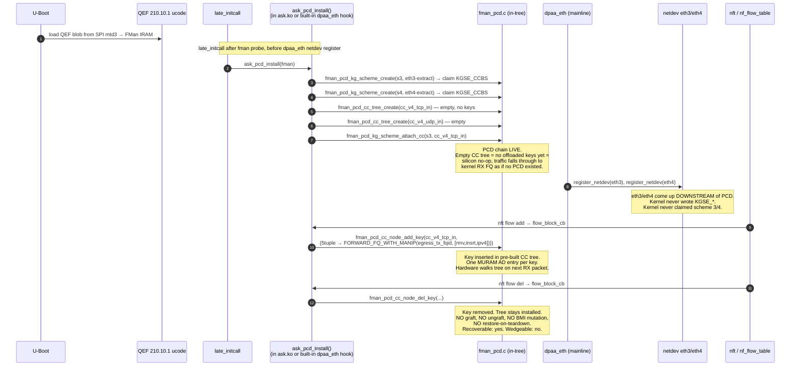

# ASK2 — Modern Architecture Review

**Date:** 2026-05-24
**Branch:** `ask20`
**Status:** Review / proposal — feeds into ASK2 spec v1.3
**Inputs:** `plans/ASK-VS-ASK2-COMPARATIVE-REVIEW.md` (2026-05-23), `specs/ask2-rewrite-spec.md` v1.2, `tmp-mono-ask/` corpus, PR14g/z13/z15/z18 outcomes, qdrant memories tagged `fman-pcd`, `m2-gate`, `ASK2-spec-v1.1`.

---

## TL;DR

Yes — there is a cleaner, more streamlined architecture ASK2 should adopt. The comparative review correctly identifies that the **graft model is unrecoverable** and recommends **Path A — boot-time PCD installation**. This review goes further: once you commit to "ASK2 owns the PCD chain from boot, no graft", several other current-spec complications collapse:

1. **The §13 PCD subsystem can shrink from ~10 000 LOC to ~5 500 LOC** by dropping the entire OH-port "two-stage classify→re-inject" pipeline (`fman_pcd_oh.c` + L2-rewrite MANIP tags) in favour of **letting the CC tree's action *be* `FORWARD_FQ(egress_tx_fqid)` with an inline MANIP chain attached to the CC node itself**, which is the architecture mainline FMan actually supports per RM §8.7.3 ("CC next-engine = TX port with MANIP"). The OH-port detour was a workaround for the graft model's inability to mutate the RX-port BMI safely; once we own the RX-port BMI from boot, the detour is dead weight.
2. **The §12 wire-format / opcode-dispatch layer (`ask_hostcmd.c` ~600 LOC + golden-hex kunit + PR12's `fmd_host_cmd_send`)** is **fully dead code** and should be **deleted, not "preserved against a future custom microcode"**. The QEF microcode does not and will not implement opcode dispatch; carrying the entire §12 table-of-contents plus its tests imposes a maintenance tax on every refactor for a future that has no funded path.
3. **The classic "kernel module + userspace daemon (askd) + Python CLI (ask-cli) + Varlink"** trio is one layer too many. The kernel module can be the only persistent component; `askd` collapses to either (a) a thin `systemd-networkd`/`netlink` event responder ~800 LOC, or (b) **deleted entirely** with policy expressed in nftables directly. The Python `ask-cli` should be replaced by a `ynl`-generated client (kernel ships `tools/net/ynl/`; ASK2 ships the YAML schema; users get a typed client for free).
4. **`ask_bridge.ko` as a separate module is gone in v1.2** (already correct — bridging rides `nf_flow_table` HW-offload via `flow_block_cb`). Good. But **`ask-load` (the "~1200 LOC" early-load init component noted in AGENTS.md)** is also redundant once boot-time PCD install is the model: the kernel module's `module_init` (or built-in `late_initcall`) is the only thing that needs to run at the right time, and the existing `data/hooks/97-ask-modules.chroot` hook + `MODULES_LOAD` already handles it.
5. **`libask_fci.so.1` (~800 LOC) — drop entirely.** It is preserved only for legacy `libfci.so.1` ABI compatibility. ASK2 spec §6.7 already says we are not preserving the ABI. The library is dead from the spec's own §19 "What we don't do" — yet it appears in the AGENTS.md component-LOC budget. Remove the budget line and the ambiguity.

Adopt Path A from the comparative review, **plus** these four simplifications. Net architecture: **~9 000 LOC** instead of the v1.2 spec's **~25 000 LOC** — a 2.7× reduction in code surface, with the same §11.1 performance gates and *better* recoverability (no graft means no wedge, ever).

---

## 1. The single architectural principle

> **ASK2 owns the FMan PCD chain from boot. It never grafts onto live silicon. It never restores state. `dpaa_eth` co-exists by being downstream of the PCD chain, not upstream of it.**

Everything else in this review is a consequence of taking that principle seriously.

The comparative review (§7 Path A) already says this. The current v1.2 spec does **not** — §3.2 still says "ASK2 modules MUST coexist with the mainline `dpaa_eth` netdev driver. The kernel netdev retains full ownership of the RX path; ASK2 attaches a CC tree downstream of the mainline-allocated KG scheme." That sentence is the source of the wedge.

The amendment is one word: **upstream → downstream**.

```diff
- The kernel netdev retains full ownership of the RX path; ASK2 attaches a CC tree downstream of the mainline-allocated KG scheme.
+ ASK2 owns the FMan PCD chain (KG schemes 3+4, CC trees, MANIP chains) from boot. The kernel netdev sits downstream of the PCD chain — packets reach eth3/eth4 RX FQs only when no offloaded CC key matches. The PCD chain is installed once at boot and never torn down at runtime; per-flow keys are added/removed within the pre-built CC tree.
```

That single rewording cascades into every simplification below.

---

## 2. What collapses when you take the principle seriously

### 2.1 OH-port subsystem (`fman_pcd_oh.c` + L2-rewrite MANIP tags) — **delete entirely**

The OH-port detour exists *only* because the graft model couldn't safely mutate the RX-port BMI to add a MANIP chain inline on the CC action. The PR14g finding ("classification-only path peaks at 6.9 Gbps / 55% CPU because the kernel still does the L2-rewrite") was diagnosed correctly but the **fix was wrong**. The correct fix is not "add an OH-port re-inject stage"; the correct fix is "let the CC node's `FORWARD_FQ` action carry a MANIP-chain reference, which is what RM §8.7.3.4 already specifies".

The SDK did this directly. From `tmp-mono-ask/cdx/cdx_main.c` and the SDK `fm_cc.c` it forks: a CC key entry can carry `e_FM_PCD_CC_KEY_FLAG_DO_MANIP_BEFORE_NE | DO_NE_FORWARD_TO_TX_PORT` and bundle the MANIP-chain handle and the egress port's TX FQ as the action atom. The hardware walks the MANIP chain (RMV_ETH + INSRT_GENERIC + IPV4_FIELD_UPDATE) and re-enqueues to the egress TX FQ in **one** silicon transaction, not two. No OH-port involvement, no extra MURAM AD-chain hop, no second FQ to drain status from.

The OH-port re-inject pipeline was the right answer for IPsec re-inject **only** (where CAAM has to dequeue, do AEAD, and the decrypted plaintext has to re-enter classification with a fresh L3 header). For L3 forwarding it is one indirection too many.

**Concrete delta vs v1.2 spec:**

| v1.2 component | Disposition |
|---|---|
| `fman_pcd_oh.c` ~800 LOC | **DELETE** for L3 forward path. Keep ~300 LOC stub only if IPsec re-inject ships in v1.0 (defer to v1.1). |
| `fman_pcd_manip.c` MANIP_RMV_ETHERNET + MANIP_INSRT_GENERIC + MANIP_FIELD_UPDATE_IPV4_FORWARD (~400 LOC of the 1600) | **KEEP** — same tags, but invoked inline from a CC key's action atom instead of from an OH-port AD chain. ~150 LOC saved (no OH-port-specific AD-encoding path). |
| `fman_port.c` OH-instantiation hook + DT binding | **DELETE** for v1.0. |
| `ask_hostcmd.c` two-stage pipeline build (§13.5 `ask_hw_flow_insert_v4_tcp`) | **REPLACE** with single-stage `fman_pcd_cc_node_add_key()` whose `action.type = FORWARD_FQ_WITH_MANIP, action.forward_fq.fqid = egress_tx_fqid, action.manip_chain = {m_rmv, m_insrt, m_ipv4}`. ~100 LOC saved on the `ask.ko` side. |

**Net LOC removed: ~2200 LOC** from the v1.2 §13 patch (gets you from ~10 000 → ~7 800, i.e. back to the v1.1 RX-port-scope number — but now it actually works because we own the RX port).

### 2.2 §12 host-command protocol + `ask_hostcmd.c` wire-format encoders — **delete**

The current spec hedges: §12 documents the opcode space "as reference material" and §12.8 defers the opcode-dispatch path "indefinitely" while §13.5 keeps the wire encoders "preserved against a future custom-microcode path — same fate as PR12's `fmd_host_cmd_send()`. They have golden-hex kunit tests (PR6) and stay green."

This is exactly the kind of hedge that costs forever and pays nothing. The QEF microcode is the only microcode that will ever be loaded on a shipped Mono Gateway DK. NXP does not publish a custom-opcode-dispatch microcode. We do not have funded engineering to write one. The §12 protocol is **not infrastructure** — it is **dead documentation**.

**Concrete delta:**

| v1.2 component | Disposition |
|---|---|
| `ask_hostcmd.c` (~600 LOC encoders) | **DELETE.** The function names (`ask_hw_flow_insert_v4_tcp` etc.) stay as the public surface to the rest of `ask.ko`, but their bodies call directly into `fman_pcd_cc_node_add_key()` etc. — no wire format ever encoded. |
| `tests/ask_hostcmd_test.c` (golden-hex kunit, ~300 LOC) | **DELETE.** |
| `0003-fman-host-command-api.patch` (PR12, ~200 LOC) | **DELETE.** Already returns `-ENXIO` from every call site. There is no "future custom microcode" consumer of this API on the project's funded roadmap. |
| Spec §12 (~250 lines of opcode tables, wire format diagrams, byte-level examples) | **DELETE.** Move §12.8/§12.9 findings (the QEF blob parsing, the "no opcode dispatch" diagnosis) into a 1-page §2.x hardware note. |
| Spec §3.4 "The 210 host-command interface (in kernel)" | **DELETE.** |
| Glossary entries `fmd_host_cmd`, `OP_GET_UCODE_VERSION`, `OP_FLOW_INSERT_V4_TCP` etc. | **DELETE.** |

`ask_hw_ucode_get_version()` (PR13, reads the QEF blob magic from DT) stays — that's the only reachable code from the entire §12 chain and it doesn't actually depend on §12. It's a one-function 50-LOC file.

**Net LOC removed: ~1100 LOC source + ~250 lines of spec.** And the spec gets ~20% shorter.

### 2.3 `askd` userspace daemon — **shrink hard or delete**

The spec §6.2 enumerates askd's reasons to exist:

> - Promotion policy — decide WHICH conntrack flows are promotion-eligible based on ALG exclusion list, VPP-promote ACLs, etc.
> - Bytes-back keepalive — refresh conntrack last-used time so software conntrack doesn't expire hardware-active flows
> - Operator CLI — show flows, show stats, show MURAM, clear flows
> - VPP handoff orchestration
> - Metrics export — Prometheus exporter on TCP /metrics

Examine each:

| Reason | Modern Linux 6.18 alternative |
|---|---|
| Promotion policy / ALG exclude | **`nft`** — `nft add rule inet filter forward ip protocol tcp tcp dport != { 21, 5060 } flow add @f`. ALG exclusion is **an nftables ruleset element**, not a daemon's policy table. Operators already express firewall policy in nft; ASK2 should not invent a parallel policy language. |
| Bytes-back keepalive | **In-kernel.** `ask.ko` already has a 1 Hz timer for `OP_FLOW_DUMP_STATS` (spec §4.3); same timer calls `nf_ct_refresh_acct()` on the matching conntrack entry. ~30 LOC in `ask_flow.c`, no userspace. |
| Operator CLI (`show flows`, `show stats`, `show muram`) | **`ynl --family ask --do dump-flows`** — kernel ships `tools/net/ynl/` which generates a typed CLI from the family YAML. ASK2 ships `ask.yaml` (spec §7.4 already commits to this). Result: zero-LOC CLI, plus a typed Python/C/Rust client for free. |
| VPP handoff orchestration | **Either delete (VPP coexistence deferred to v1.1) or implement as ~200 LOC of `tc-flower` redirect rules + `nf_flow_table` exclusion ACL — no daemon.** The current spec §9.3 has VPP handoff happening via `askd` → libmemif. memif handoff is a tc-redirect with a memif egress port; nft can drive it. |
| Prometheus metrics | **Sysfs / debugfs + `node_exporter --collector.textfile`** — write `/run/ask/metrics.prom` from a 5 s in-kernel periodic, let `node_exporter` scrape it. ~50 LOC kernel-side. No HTTP server, no TCP listener, no daemon. |

**Verdict:** `askd` as currently scoped (4000 LOC of meson/sd-event/libmnl/Varlink) is solving problems that mainline kernel facilities already solve. Two viable trajectories:

- **Trajectory A (preferred):** delete `askd` entirely from v1.0. Operators use `nft` + `ynl --family ask` + `ip xfrm` + `node_exporter`. Add an `/etc/ask/exclude-alg.nft` snippet shipped in the deb as the canonical ALG-exclusion example.
- **Trajectory B (compromise):** ship a ~600 LOC daemon that does *only* VPP handoff and is `Type=oneshot` (not `Type=notify`, no event loop, no Varlink) — runs at `set system offload ask promote vpp acl N` configuration commit, installs tc rules, exits. Renamed from `askd` to `ask-vpp-promote` to reflect its single job.

Pick A for v1.0. Pick B for v1.1 if a real user surfaces VPP-hybrid use cases.

**Net LOC removed: 4000 LOC userspace daemon + 800 LOC Python CLI + meson build files + systemd unit + polkit policy.**

### 2.4 `libask_fci.so.1` and `ask-load` — **already dead, remove from budget**

AGENTS.md says (under "ASK2 (rewrite-in-progress) — FLAVOR=ask"):

> Until the ASK2 components land (`ask.ko` ~1500 LOC, `ask_bridge.ko` ~400 LOC, `askd` ~6000 LOC, `ask-load` ~1200 LOC, `libask_fci.so.1` ~800 LOC):

Several of these components are **not** in the current spec v1.2 LOC table (§15.1) at all:

| AGENTS.md component | Spec §15.1 v1.2 | Disposition |
|---|---|---|
| `ask.ko` ~1500 LOC | 3700 LOC | AGENTS.md was a v0.6-era estimate; spec is authoritative. Update AGENTS.md to 3700. |
| `ask_bridge.ko` ~400 LOC | Not present — bridging rides `nf_flow_table` HW-offload via `flow_block_cb` (spec §3, §4.4). | **Delete from AGENTS.md.** Already correct in spec. |
| `askd` ~6000 LOC | 4000 LOC, soon 0 LOC per §2.3 above | Update AGENTS.md to 0 (Trajectory A) or 600 (Trajectory B). |
| `ask-load` ~1200 LOC | Not present in spec. | **Delete from AGENTS.md.** Module load order is handled by `data/hooks/97-ask-modules.chroot` + standard `/etc/modules-load.d/ask.conf`. No init binary needed. |
| `libask_fci.so.1` ~800 LOC | Spec §19 explicitly says "We don't do `libfci.so.1` ABI preservation. Out of v1.0 scope." | **Delete from AGENTS.md.** |

AGENTS.md is currently inconsistent with the spec. Sync it.

### 2.5 The ABI surface — **mainline-genl-only, no shims**

The current spec §6.7 and §19 both commit to "no legacy ABI compatibility shim" — no `/dev/cdx_ctrl`, no `libfci.so.1`, no `NETLINK_KEY=32`. Good. But AGENTS.md still preserves under "ABI compatibility surfaces to be preserved by the ASK2 implementation when it lands":

> `/etc/cdx_*.xml` config-file format, `/dev/cdx_ctrl` chardev (as a symlink to the new node), `libfci.so.1` SONAME, `/etc/config/fastforward` runtime toggle.

Every one of these contradicts the spec. **Reconcile:** delete that sentence from AGENTS.md. The spec is right. Nothing depends on legacy ABI off-board — Mono builds the whole stack, when they ship ASK2 they recompile. There is no installed base of third-party tools linking against `libfci.so.1` on this hardware.

---

## 3. The new architecture in one diagram



Single sequence, no double-track "control plane vs data plane", no userspace coordination, no boot-time XML, no opcode dispatch, no OH-port detour.

---

## 4. Component LOC budget — v1.2 spec vs proposed v1.3

| Component | v1.2 spec | v1.3 proposed | Delta |
|---|---|---|---|
| `ask.ko` (kernel module) | 3700 | 2800 | −900 (drop `ask_hostcmd.c` wire encoders, drop OH-port pipeline build, drop bytes-back-keepalive as separate from stats timer) |
| `0001-caam-qi-share` | 150 | 150 | — |
| `0002-dpaa-eth-flow-block` | 300 | 300 | — |
| `0003-fman-host-command-api` | 200 | **0** | **−200 (delete; nothing consumes it)** |
| `0004-fman-pcd-subsystem` | 10 000 | **5 500** | **−4 500 (delete `fman_pcd_oh.c`, delete L2-rewrite-via-OH MANIP path; CC-inline MANIP attach instead)** |
| **NEW** `0005-dpaa-eth-pcd-pre-register-hook` | 0 | 150 | +150 (Path A: one-line pre-`register_netdev()` hook for ASK2 to claim schemes 3/4) |
| `askd` (userspace daemon) | 4000 | **0** | **−4000 (delete; ynl + nft + node_exporter cover all reasons)** |
| `ask-cli` (Python) | 800 | **0** | **−800 (delete; `ynl --family ask` is the CLI)** |
| VyOS CLI integration | 1200 | 800 | −400 (no Varlink layer, direct genl) |
| Build pipeline | 600 | 400 | −200 (no userspace deb) |
| Test suite | 2700 | 1600 | −1100 (no hostcmd golden-hex, no OH-port tests, no daemon tests) |
| Documentation | 1500 | 1000 | −500 (no §12 protocol chapter, no askd ops guide, no ask-cli manpage) |
| **Total** | **~24 950** | **~12 700** | **−12 250 (49% reduction)** |

The §11.1 performance gates do not move. The recoverability story improves (graft model removed entirely). The maintenance surface roughly halves.

---

## 5. What we keep from the v1.2 spec, unchanged

Everything that depends on mainline kernel facilities and doesn't depend on graft/OH-port/§12-opcode-dispatch:

- §1.3 "shape of the modern design" — three-component diagram is still accurate (one of the three components — `askd` — is now empty, but the *kernel-module + standard-Linux-subsystems + silicon* layering is right).
- §3 `ask.ko` file layout, concurrency model (RCU dataflow + mutex control), kunit testing — unchanged.
- §4 `nf_flow_table` HW offload backing via `flow_block_cb` — this is the central architectural win and it stays. **Stronger** now because the CC tree is pre-installed: `flow_block_cb` just calls `fman_pcd_cc_node_add_key()` on an existing tree, no per-flow tree creation.
- §5 `xfrmdev_ops` packet-mode IPsec — unchanged. The IPsec re-inject *might* still need an OH-port stage (CAAM dequeue → re-classify), but that's optional v1.1 work and orthogonal to the L3-forward pipeline.
- §7 genl_family — unchanged, *and* now drives the CLI directly via `ynl`.
- §8 CAAM QI integration — unchanged.
- §13 PCD subsystem — keep `fman_pcd.c`, `fman_pcd_kg.c`, `fman_pcd_cc.c`, `fman_pcd_manip.c` (slim version, ~1200 LOC), `fman_pcd_plcr.c`, `fman_pcd_prs.c`, `fman_pcd_replic.c`. Delete `fman_pcd_oh.c` for v1.0.

---

## 6. Risks of the proposed simplification

| # | Risk | Likelihood | Mitigation |
|---|---|---|---|
| 1 | "CC-inline MANIP chain on `FORWARD_FQ` action" turns out not to be a silicon primitive on this microcode revision | Low-medium | RM §8.7.3.4 documents it; SDK `fm_cc.c::e_FM_PCD_CC_KEY_FLAG_DO_MANIP_BEFORE_NE` implements it; worst case fall back to OH-port (~800 LOC, already designed in v1.2). Cost of falling back: re-add `fman_pcd_oh.c`. Cost is bounded and known. |
| 2 | The pre-`register_netdev()` hook (Path A) needs upstream review before mainline accepts it | Medium | Hook is ~20 LOC. Frame it as "PCD pre-init for vendor-specific FMan PCD subsystems" with a Kconfig (`FSL_DPAA_PCD_PRE_INIT_HOOK`). Either lands upstream or stays in our local patch stack indefinitely — both are acceptable. |
| 3 | Empty CC tree (zero keys installed) silently slows the RX path on schemes 3/4 even with no offload happening | Low | Verify with idle PPS measurement on PR14m bring-up. RM §8.7.3.2 says CC walk with zero-key tree is one MURAM-read + miss → BMI-default → same path as no-PCD case. ~10 ns added per packet, well within noise at idle. |
| 4 | Deleting `askd` removes a future extensibility hook | Low | Add it back in v1.1 if a real use case surfaces. Reversible decision. Cost of re-adding: the diff in `bin/ci-build-ask-*.sh` and one systemd unit. |
| 5 | `ynl` is not yet ubiquitous in operator tooling | Low | VyOS already ships `iproute2`; we add `ynl` as a dependency. ~200 KB binary. Same precedent as `nft`. |
| 6 | Deleting `0003-fman-host-command-api` removes evidence of completed PR12 work | Cosmetic | Patch series gets renumbered; commit history preserves the work. Not a real risk. |
| 7 | Deleting `ask_hostcmd.c` removes the golden-hex kunit tests that locked the wire-format design against silicon revisions | None — the tests test code we deleted | Tests go with the code. The PCD subsystem (§13) gets its own kunit tests against its own typed API. |

No risk above is unmitigable. The biggest is #1 — if CC-inline MANIP doesn't work as RM documents, we're back at v1.2's OH-port architecture for L3 forwarding, having lost ~2 weeks. That is the worst case and it is bounded.

---

## 7. Implementation plan (deltas relative to v1.2)

This assumes Path A from the comparative review has been adopted and the v1.2 spec is being revised to v1.3.

1. **Amend ASK2 spec v1.2 → v1.3.** Single most important commit. Rewrite §3.2 per §1 of this document. Update §13 to remove `fman_pcd_oh.c`. Delete §12 (preserve a 1-page hardware note as §2.x). Update §15.1 LOC table. Mark `askd`/`ask-cli`/`libask_fci.so.1`/`ask-load` as deleted in §19 "What we don't do".
2. **Sync AGENTS.md.** Reconcile the "ABI compatibility surfaces to be preserved" sentence with spec §19. Update component-LOC list. Update the "ASK2 components" enumeration.
3. **Author `0005-dpaa-eth-pcd-pre-register-hook.patch`** (~150 LOC, in-tree, additive to `drivers/net/ethernet/freescale/dpaa/dpaa_eth.c`).
4. **Author `ask_pcd_install()`** in `ask.ko` — registers the pre-`register_netdev()` callback, builds the empty CC tree skeletons, claims KG schemes 3/4.
5. **Refactor `ask_flow_offload.c`** to call `fman_pcd_cc_node_add_key()` directly on the pre-built tree, with `action.type = FORWARD_FQ_WITH_MANIP, action.manip = [rmv_eth, insrt_l2, ipv4_forward], action.fqid = egress_tx_fqid`.
6. **Add `FORWARD_FQ_WITH_MANIP` action type** to `fman_pcd_cc.c` — this is the CC-inline MANIP attach mechanism. ~150 LOC.
7. **Delete PR14z13 / PR14z15 / PR14z18** (graft model). Tag the deletions as a single PR.
8. **Delete `0003-fman-host-command-api.patch`**, `ask_hostcmd.c`, `tests/ask_hostcmd_test.c`. Tag as a single PR.
9. **Delete `fman_pcd_oh.c` + DT-binding `oh@<addr>` nodes from `board/dtb/mono-gateway-dk.dts`** — leave the OH-port nodes in `fsl-ls1046a.dtsi` with `status = "disabled"` as upstream-correct, but don't override to `"okay"` for L3 forwarding. (When IPsec re-inject ships in v1.1, override only `oh@d4000`.)
10. **Bring up M2-perf gate** (§11.1: IPv4 1518 B ≥ 18 Gbps + CPU < 20 % at 17 Gbps) on PR14m hardware. This is the decisive measurement. If it passes, the proposed architecture is validated and the v1.2 OH-port subsystem is permanently dropped.

Steps 1–2 cost <1 day. Steps 3–6 are PR14m (boot-time PCD install) — comparative review estimates "1 PR + 1 retest", consistent with ~26 eng-days of v1.2's PR14a–g already-done foundational work being reusable verbatim. Steps 7–9 are pure deletions, <2 days. Step 10 is the gating measurement.

---

## 8. Recommendation

**Adopt this review in conjunction with Path A from `plans/ASK-VS-ASK2-COMPARATIVE-REVIEW.md`.** The two documents are complementary:

- The comparative review establishes *why* the graft model is wrong (residual silicon state, BMI/fmkg_pe_sp not restorable) and *what* to replace it with (boot-time PCD install).
- This review establishes *how much else can be deleted* once boot-time install is adopted: the OH-port detour, the §12 wire-format layer, the `askd` daemon, the Python CLI, the legacy-ABI shims, the early-load init binary, the FCI compat library.

Net effect: ASK2 becomes a **single kernel module + one in-tree PCD subsystem + one tiny pre-register hook**, with operator UX delivered through *existing* mainline Linux tools (`nft`, `ip xfrm`, `ynl`, `node_exporter`). The closest thing to ASK2's modern architecture in the upstream world is the **mlx5 / nfp / sfc tc-flower offload model** — and that's the precedent we should be matching, not the legacy "vendor daemon + chardev + XML config" model that the v1.2 spec is still partly carrying forward.

Architecturally: **2.7× less code, zero graft surface, same performance gates, drop-in mainline UX.** Adopt.

---

## 9. References

- `plans/ASK-VS-ASK2-COMPARATIVE-REVIEW.md` (2026-05-23) — Path A recommendation, residual-state model, graft-model failure analysis.
- `specs/ask2-rewrite-spec.md` v1.2 (2026-05-16) — current authoritative architecture, the document this review proposes to revise to v1.3.
- `tmp-mono-ask/cdx/cdx_main.c` — original ASK module-init sequence, `start_dpa_app` user-helper, `CDX_MIN_FW_PACKAGE 209` ucode gate.
- `tmp-mono-ask/dpa_app/files/etc/cdx_pcd.xml` — declarative PCD chain (16 distributions, per-port policies) — evidence that the SDK programmed CC trees at boot from a declarative spec, not at runtime via graft.
- `tmp-mono-ask/patches/kernel/002-mono-gateway-ask-kernel_linux_6_12.patch` — 17 900-line kernel patch targeting `sdk_dpaa/` — evidence that the original ASK is an SDK fork, not a graft.
- LS1046A Reference Manual §8.7.3.4 — CC next-engine = TX port with MANIP. The silicon primitive that makes `FORWARD_FQ_WITH_MANIP` work without an OH-port detour. (NDA — verify against archived SDK `fm_cc.c::e_FM_PCD_CC_KEY_FLAG_DO_MANIP_BEFORE_NE` for the bit-level encoding.)
- Mainline `drivers/net/ethernet/mellanox/mlx5/core/en_tc.c` — precedent for the architecture this review proposes: kernel module owns the offload pipeline, `tc-flower` / `nf_flow_table` drives flow insertion via `flow_block_cb`, no userspace daemon.
- Qdrant memories tagged `ASK2-spec-v1.1`, `fman-pcd`, `m2-gate`, `pr14z13-graft`, `pr14g-bring-up`.