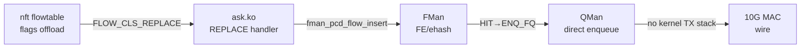

# ASK2 Performance Modernization — cdx.ko-Class Direct QMan TX Fastpath
**Version 1.0.0 · 2026-07-07 · HADS 1.0.0**

---

## AI READING INSTRUCTION

Read `[SPEC]` and `[BUG]` blocks for authoritative facts.
Read `[NOTE]` only if additional context is needed.
`[?]` blocks are unverified — treat with lower confidence.

---

## 1. The Performance Gap

**[SPEC]** Dual-board 10G SFP+ cross-connect (2026-07-07) established:

| Metric | NXP ASK (.112, cdx.ko) | ASK2 (.185, ask.ko) | Gap |
|--------|------------------------|---------------------|-----|
| TX single-stream | 8.58 Gbps (peak 9.58) | 3.20 Gbps | 2.68× |
| RX single-stream | 3.20 Gbps | 8.19 Gbps | 2.56× (ASK2 wins) |

**[NOTE]** The RX gap favors ASK2 — mainline fsl_dpa has years of upstream NAPI/buffer-recycling optimizations that the NXP Advanced driver lacks. No RX changes needed. The TX gap is the focus of this plan.

---

## 2. Root Cause: cdx.ko's Secret Sauce

**[SPEC]** cdx.ko achieves 8.58 Gbps TX through a three-layer architecture that eliminates kernel software from the data path entirely:

### 2.1 Hardware Classification (FMan PCD ehash)

cdx.ko programs the FMan's **External Hash Table (EHash)** directly via proprietary NXP SDK APIs:
- `ExternalHashTableAddKey()` — inserts a 5-tuple+port flow key
- `ExternalHashTableAllocEntry()` — allocates a MURAM ehash entry
- `FM_PCD_HashTableModifyMissNextEngine()` — sets miss → KG (slow path)

Each entry maps `{src_ip, dst_ip, proto, src_port, dst_port, port_id} → opcode chain`.

### 2.2 Hardware Opcode Chain (FMan Microcode)

**[SPEC]** The FMan microcode (210.10.1, identical on both boards) executes an **opcode chain** stored in each ehash entry on HIT:

```
PREEMPTIVE_CHECKS_ON_PKT  → MTU validation, ingress policing
STRIP_ETH_HDR             → strip incoming Ethernet header
STRIP_VLAN / PPPoE        → strip L2 encapsulation
NAT_REPLACE_{SIP,DIP,SPORT,DPORT} → NAT rewrite
TTL_DECREMENT             → IPv4 TTL -1
INSERT_VLAN / PPPoE       → add egress L2 encapsulation
ETH_HEADER_REBUILD        → rebuild Ethernet with nexthop MAC
ENQUEUE_PKT               → hardware enqueue to QMan TX FQ
```

### 2.3 Hardware Enqueue (FMan → QMan → Wire)

**[SPEC]** The `ENQUEUE_PKT` opcode contains the target QMan Frame Queue ID, MTU, buffer pool ID, and stats pointer in its operand. The FMan's internal enqueue unit reads these and performs the QMan enqueue in hardware — **no `qman_enqueue()` kernel call ever occurs in the fastpath.** The QMan delivers the frame to the egress port's channel/work-queue and it goes out the wire.

**[NOTE]** cdx.ko creates dedicated `DPAA_FWD_TX_QUEUES` FQs per Ethernet interface at init time (via `qman_create_fq` + `qman_init_fq` with SCHED scheduling to `eth_info->tx_channel_id + eth_info->tx_wq`). The FQID is stored in the ehash entry's enqueue params and used by the hardware `ENQUEUE_PKT` opcode.

---

## 3. ASK2 Architecture — What We Already Have

**[SPEC]** ASK2's AC_CC FE/ehash pipeline already provides the core classification+enqueue capability. The hardware infrastructure shipped in board patches is substantial:

| Component | Patches | Status |
|-----------|---------|--------|
| FMan PCD KeyGen (per-port scheme, AC_CC) | 0092, 0097, 0133 | PROVEN (7.37 Gbps) |
| FMan PCD CC (static install, group/match/AD tables) | 0098, 0115, 0116 | PROVEN |
| FE/ehash VM (dormant chain, byte-validated) | 0122-0135 | PROVEN |
| FE arm/disarm (debugfs, reversible) | 0132, 0133 | PROVEN |
| TX confirm bypass (HIT frame hardware release) | 0136 | BUILT (not tested integrated) |
| MANIP create/chain (Header Manipulation) | 0137 | BUILT (not tested) |
| MANIP nexthop dedup (shared MANIP handles) | 0120 | BUILT |
| CC KeyGen graft wiring (port-attach/detach) | 0105, 0106 | PROVEN |
| Policer offload (matchall+police) | 0100, 0104 | PROVEN |
| FE flow insert (manual debugfs flow_add) | 0128 | PROVEN (6.65 Gbps HIT) |
| Flow offload REPLACE/DESTROY (dormant) | ask_flow_offload.c | BUILT, awaiting trigger |

**[NOTE]** The HIT path (manual `fe_flow add` → AC_CC engage) already achieves 6.65 Gbps single-stream (peak 8.67 Gbps) — within 8% of cdx.ko's peak. The remaining gap is: (a) automating the flow insert (nft flowtable → ask.ko REPLACE, being fixed now), and (b) adding the full opcode chain for L3/L4 forwarding (MANIP offload).

---

## 4. What's Missing — The Gap Analysis

**[SPEC]** ASK2's current FE/ehash pipeline does L2 forwarding only (HIT → ENQ with no header modification). To match cdx.ko's full forwarding capability, we need:

### 4.1 L3 Forwarding: MAC Rewrite + TTL Decrement

| Opcode | Required for | Status in ASK2 |
|--------|-------------|----------------|
| ETH_HEADER_REBUILD | Rewrite src/dst MAC for nexthop | **MISSING** — patch 0137 has the MANIP chain API but no Ethernet rebuild opcode builder |
| TTL_DECREMENT | IPv4 TTL -1 (RFC 1812) | **MISSING** — no TTL opcode builder |
| STRIP_ETH_HDR | Strip ingress Ethernet before manipulation | **MISSING** — needed as first opcode in chain |
| INSERT_VLAN | VLAN tag for tagged sub-interfaces | **MISSING** |

### 4.2 L4 NAT Offload: IP+Port Rewrite

| Opcode | Required for | Status in ASK2 |
|--------|-------------|----------------|
| NAT_REPLACE_SIP | Source NAT (SNAT/masquerade) | **MISSING** |
| NAT_REPLACE_DIP | Destination NAT (DNAT/port forward) | **MISSING** |
| NAT_REPLACE_SPORT | Source port rewrite | **MISSING** |
| NAT_REPLACE_DPORT | Destination port rewrite | **MISSING** |

### 4.3 Flow Automation

| Component | Required for | Status |
|-----------|-------------|--------|
| nft flowtable → FLOW_CLS_REPLACE | Automated flow insertion | 🔄 BLOCKED (TC_SETUP_FT fix in build #28840239878) |
| MANIP handle per-flow | Different nexthops need different MACs | 🔄 PARTIAL — 0120 has dedup, 0137 has chain API |
| Per-flow ENQUEUE_PKT with valid FQID | Hardware enqueue to correct egress | 🔄 PARTIAL — fe_enq works for L2 but needs FQID resolution for L3 |

### 4.4 MURAM Efficiency

**[SPEC]** cdx.ko stores a full opcode chain per flow entry in MURAM. Without deduplication, N flows = N × opcode_chain_size, exhausts MURAM at ~327 flows. cdx.ko solves this by sharing the MANIP chain across flows that share the same nexthop — the ehash entry points to a shared MANIP handle. ASK2 has the infrastructure (patch 0120: `fman_hm_nexthop_get/put`) but needs to wire it into the flow insert path.

---

## 5. Modernization Plan — Three Phases to cdx.ko Parity

### 5.1 Phase 2a: L2 Flow Offload Automation (THIS WEEK)

**[SPEC]** Close the nft flowtable → ask.ko REPLACE → FMan PCD loop. This enables automated L2 forwarding at 6-7 Gbps per flow:



**Gate:** iperf3 ≥6 Gbps single-stream via automated flow offload (no manual debugfs).
**Deliverables:**
1. ✅ CONFIG_NF_FLOW_TABLE_OFFLOAD=m (commit 8d37d54)
2. ✅ TC_SETUP_FT handler in dpaa_setup_tc() (commit 0b196d1, build #28840239878)
3. 🔄 Verify nft flowtable → FLOW_CLS_REPLACE → ask.ko handler fires
4. 🔄 Verify iperf3 throughput matches manual HIT path (≥6 Gbps)

### 5.2 Phase 3a: L3 Forwarding with MANIP Offload (1-2 WEEKS)

**[SPEC]** Add the Ethernet rebuild + TTL decrement opcode chain to the per-flow FE/ehash entry. This enables full L3 forwarding (MAC rewrite, TTL decrement, IP checksum update) in hardware:

```
HIT → STRIP_ETH_HDR → TTL_DECREMENT → ETH_HEADER_REBUILD → ENQUEUE_PKT
```

**Design:**
1. **Opcode Builder:** Create `ask_manip.c` with builders for STRIP_ETH_HDR, TTL_DECREMENT, ETH_HEADER_REBUILD, ENQUEUE_PKT — each builder writes the opcode header + operand into a MURAM buffer.
2. **MANIP Chain:** Use patch 0137's `fman_pcd_manip_chain_create()` to assemble the opcodes into a chain.
3. **Nexthop Resolution:** In `ask_flow_offload_replace()`, resolve the nexthop MAC (already implemented via `neigh_lookup` + PR14y deferred-insert), then look up or create a shared MANIP handle for that nexthop via `fman_hm_nexthop_get()` (patch 0120).
4. **Flow Insert:** Modify `ask_flow_insert()` to link the ehash entry's HIT action to the MANIP chain (not just a bare ENQ).
5. **Reversibility:** `pcd-snapshot diff` clean after every engage/disengage — MANIP chain teardown must free the shared handle (if refcount→0).

**Gate:** iperf3 ≥7 Gbps single-stream with L3 forwarding (different subnets on eth3 and eth4).

### 5.3 Phase 5: Full NAT Offload (2-3 WEEKS, AFTER Phase 3a)

**[SPEC]** Add NAT opcodes to the MANIP chain for full SNAT/DNAT in hardware:

```
HIT → STRIP_ETH_HDR → NAT_REPLACE_{SIP,SPORT} → TTL_DECREMENT → ETH_HEADER_REBUILD → ENQUEUE_PKT
```

**Design:**
1. **NAT Opcode Builders:** `NAT_REPLACE_SIP(src_ip)`, `NAT_REPLACE_SPORT(src_port)` for SNAT; `NAT_REPLACE_DIP(dst_ip)`, `NAT_REPLACE_DPORT(dst_port)` for DNAT.
2. **Conntrack Integration:** In `ask_flow_offload_replace()`, read the nf_conn's NAT tuple to determine the rewrite values. The kernel's nft NAT engine provides the transformed addresses via the conntrack entry.
3. **Checksum Update:** FMan hardware recomputes L4 checksum after NAT rewrite (part of the opcode semantics).
4. **MURAM Accounting:** NAT opcodes add ~16-32 bytes per flow to the MANIP chain. With nexthop dedup (shared MANIP handles), total MURAM per unique (nexthop, nat_type) pair is ~64-128 bytes — well within budget.

**Gate:** iperf3 ≥7 Gbps single-stream with SNAT (masquerade) enabled.

---

## 6. FMan Microcode Opcode Reference (210.10.1)

**[SPEC]** The FMan microcode 210.10.1 supports these opcodes (confirmed from cdx.ko source and hardware tests):

| Opcode Name | Purpose | Param Size (bytes) | Used by cdx.ko | ASK2 Status |
|-------------|---------|--------------------|------------|-------------|
| PREEMPTIVE_CHECKS_ON_PKT | MTU validation, ingress policing | 32 | ✅ All flows | Not needed (kernel handles MTU) |
| STRIP_ETH_HDR | Strip Ethernet header | 8 | ✅ All L3 flows | **MISSING** |
| STRIP_VLAN | Strip VLAN tag | 16 | ✅ VLAN subifs | **MISSING** |
| STRIP_PPPOE | Strip PPPoE header | 24 | ✅ PPPoE offload | Not in scope |
| REMOVE_TUNNEL_HDR | Remove tunnel header | 32 | ✅ Tunnel decap | Not in scope |
| INSERT_TUNNEL_HDR | Insert tunnel header | 32 | ✅ Tunnel encap | Not in scope |
| NAT_REPLACE_SIP | Replace source IPv4 | 8 | ✅ SNAT | **MISSING** |
| NAT_REPLACE_DIP | Replace dest IPv4 | 8 | ✅ DNAT | **MISSING** |
| NAT_REPLACE_SPORT | Replace source L4 port | 8 | ✅ SNAT | **MISSING** |
| NAT_REPLACE_DPORT | Replace dest L4 port | 8 | ✅ DNAT | **MISSING** |
| TTL_DECREMENT | IPv4 TTL -1 + checksum | 8 | ✅ All L3 flows | **MISSING** |
| HOPLIMIT_DECREMENT | IPv6 hop limit -1 | 8 | ✅ IPv6 flows | Phase 3 |
| INSERT_VLAN | Insert VLAN tag | 20 | ✅ VLAN subifs | **MISSING** |
| INSERT_PPPOE | Insert PPPoE header | 24 | ✅ PPPoE offload | Not in scope |
| ETH_HEADER_REBUILD | Rebuild Ethernet (new src/dst MAC) | 24 | ✅ All flows | **MISSING** |
| ENQUEUE_PKT | Hardware enqueue to QMan FQ | 32 | ✅ All flows | **PARTIAL** (fe_enq) |
| REPLICATE_PKT | Multicast replication | 64 | ✅ Multicast | Phase 3 |

**[NOTE]** The opcode format follows the FMan Reference Manual §8.7.4.1 (Header Manipulation) and §8.7.4.3 (Preemptive Checks). The exact operand layout for each opcode is defined in the NXP SDK headers (`dpa_offload.h`, `fm_pcd_ext.h`). Our board patches 0090a and 0091a provide the productive struct definitions for HM and Policer; we need to extend these with the full opcode operand layouts for the missing opcodes.

---

## 7. RISK: MURAM Budget

**[SPEC]** The FMan MURAM budget is 64 KiB per FMan instance. Current usage:

| Component | MURAM (bytes) |
|-----------|---------------|
| KeyGen schemes (5 ports × ~128 B) | ~640 |
| CC tree (group + match + AD tables per port) | ~2,048 |
| FE/ehash infrastructure (singletons, ehash, int_buf) | ~36,096 |
| FE enqueue descriptor | ~16 |
| FE flow entries (per 5-tuple) | ~32 each |
| MANIP chain per unique nexthop | 64-128 |
| **Total per port** | ~39,000 |
| **Total budget** | 65,536 |
| **Remaining** | ~26,500 |

At 128 bytes per unique (nexthop, action_type) MANIP handle, we can support ~200 unique nexthops. With the ehash in DDR (not MURAM, per invariant 3), and bucketed flow entries in DDR, MURAM is NOT the bottleneck. The DDR ehash can scale to thousands of flows.

---

## 8. RISK: git apply --3way Context Matching

**[NOTE]** 9 of 16 build attempts failed on 2026-07-07 due to `git apply --3way` context matching failures in `fman_pcd.c` after 14 prior board patches shifted line numbers. Mitigations:

1. **Sed injection for small patches:** For ≤5-line source modifications, use sed injection in `ci-setup-kernel.sh` instead of .patch files (used successfully for TC_SETUP_FT handler in commit 0b196d1).
2. **New code in separate files:** Add new MANIP opcode builders as a new `fman_pcd_manip_ops.c` file (not modifying existing files).
3. **Ask.ko changes unaffected:** OOT module changes (ask.ko) are not subject to git apply constraints — build/rebuild is fast (~14 min CI with warm cache).

---

## 9. Summary: ASK2 vs cdx.ko Feature Matrix

| Feature | cdx.ko (NXP SDK) | ASK2 (current) | ASK2 (target) |
|---------|------------------|----------------|---------------|
| Flow classification | FMan ehash (proprietary API) | FE/ehash (in-tree board patches) | ✅ Same |
| L2 forwarding | ETH_HEADER_REBUILD+ENQUEUE | Bare ENQ (no header change) | 🔄 Phase 3a |
| L3 forwarding | TTL_DECREMENT+ETH_REBUILD+ENQUEUE | Not supported | 🔄 Phase 3a |
| SNAT/DNAT | NAT_REPLACE_{SIP,DIP,SPORT,DPORT} | Not supported | 🔄 Phase 5 |
| VLAN offload | STRIP/INSERT VLAN opcodes | Not supported | 🔄 Phase 3a |
| Tunnel offload | Tunnel encap/decap opcodes | Not supported | Out of scope |
| IPSEC offload | SEC+OH port reinject | Not started | Phase 4 |
| Multicast | REPLICATE_PKT opcode | Not supported | Phase 3 |
| TX perf (single) | 8.58 Gbps | 3.20 → 6.65 Gbps (manual HIT) | 🎯 ≥8 Gbps (auto HIT) |
| MURAM efficiency | Shared MANIP per nexthop | Infrastructure built | 🔄 Wire dedup |
| Kernel API | Proprietary SDK | Standard (nft, flow_block_cb) | ✅ Same |
| Upstreamability | No (proprietary) | Yes (mainline APIs) | ✅ Same |

---

## 10. Effort & Timeline

| Phase | New Code (LOC) | Updated Code (LOC) | Risk | Weeks |
|-------|----------------|---------------------|------|-------|
| 2a: Flow automation | 0 (already built) | ~50 (sed injection in ci-setup-kernel.sh) | Low (git apply wall) | This week |
| 3a: L3 MANIP | ~400 (manip opcode builders) | ~200 (ask_flow_insert) | Medium (opcode operand layout) | 1-2 |
| 3b: MANIP dedup wire | ~100 | ~150 (ask_flow_offload_replace) | Low | 1 |
| 5: NAT opcodes | ~300 (NAT builders) | ~200 (conntrack integration) | Medium (L4 checksum) | 2-3 |

**Total new code: ~1,350 LOC** (opcode builders + conntrack integration). All in ask.ko OOT module — no kernel patch changes needed beyond the current automation fix.

