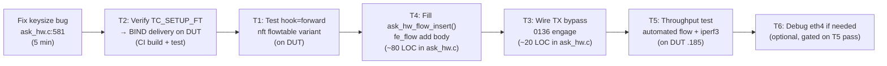

# ASK2 Phase 2 — Flow Offload Automation Architecture & Plan

**Version 1.0.0 · 2026-07-09 · HADS 1.0.0**

## AI READING INSTRUCTION

Read `[SPEC]` and `[BUG]` blocks for authoritative facts.
Read `[NOTE]` only if additional context is needed.
`[?]` blocks are unverified — treat with lower confidence.

This plan is subordinate to `specs/ask2-rewrite-spec.md` (architecture) and
`plans/DUAL-DATAPLANE.md` (state machine). Where this plan and those documents
disagree, they win.

---

## 0. Status at Entry (2026-07-09)

**[SPEC]**
- M2 hard gate PASSED: 7.37 Gbps / 0.16% CPU (dual-board cross-connect, manual `fe_flow add`)
- M2 stretch PASSED: ≥7 Gbps
- M2 NXP parity: BLOCKED — TX at 3.20 Gbps (kernel fsl_dpa) vs 8.58 Gbps (cdx.ko direct-QMan). Manual HIT hits 6.65 Gbps
- **M2 automation: BLOCKED** — nft `flags offload` does not deliver flows to silicon
- Reversibility PASSED: S0↔S1 byte-clean, 100× soak, 0 drift
- `TC_SETUP_FT` handler committed (0b196d1), `CONFIG_NF_FLOW_TABLE_OFFLOAD=m` committed (8d37d54)
- `vyos-offload-ask` shipped with 6 verbs, including `flow-add` (via debugfs `fe_flow`)
- Keysize fixed: 12→16 bytes (da14deb), matches KG `EKFC=0x00180206` composite
- `ask_hw.c` line 581 still writes `"set 0x7FFF 12 0"` to `fe_ehash` — **BUG**

**[BUG] ask_hw.c:581 still uses keysize=12 for fe_ehash**
- Symptom: `ask.ko`'s debugfs bridge writes `"set 0x7FFF 12 0"` to `fe_ehash`, but the KG composite is 16 bytes. CRC64 bucket index computed over wrong byte range → flow insertion fails to HIT.
- Cause: `vyos-offload-ask` was fixed to 16 bytes (da14deb) but the parallel debugfs bridge in `ask_hw.c` was not.
- Fix: change `"set 0x7FFF 12 0"` to `"set 0x7FFF 16 0"` in `ask_hw.c:581`.

---

## 1. Architecture of the Flow Offload Pipeline

### 1.1 The Three Paths to Flow Insertion


**[SPEC]** Path C (manual debugfs) is the only proven path today. Path A (nft) is the target. Path B (YNL) is the interim bridge.

### 1.2 nft Flowtable Offload Chain (Path A — detailed)

```
nft add flowtable inet f ft1 { hook ingress priority 0; devices = { eth3 }; flags offload; }
nft add rule inet f forward ip protocol tcp flow add @ft1

↓ (packet arrives, conntrack confirms flow to ASSURED)

nf_flow_table_offload_setup()                         [net/netfilter/nf_flow_table_offload.c]
  → nf_flow_table_offload_cmd()                       [if ndo_setup_tc exists]
    → ndo_setup_tc(dev, TC_SETUP_FT, &bo)             [bo.binder_type = CLSACT_INGRESS]
      → dpaa_setup_tc(TC_SETUP_FT)                    [patched via 0b196d1]
        → dpaa_setup_tc_block()                        [board 0104]
          → flow_block_cb_alloc(ask_setup_tc, ...)     [creates block callback]
            → ask_flow_offload_setup_tc(TC_SETUP_FT, BIND)  [ask.ko]
              → stores block_cb per netdev

↓ (flow reaches ASSURED, kernel emits FLOW_CLS_REPLACE)

flow_block_cb.cb_list[...] → ask_flow_offload_setup_tc_block_cb(REPLACE, cls)
  → ask_flow_offload_replace()
    → ask_parse_match_v4()          [extract 5-tuple from flow_rule]
    → ask_parse_action()            [extract oif from REDIRECT/MIRRED]
    → ask_resolve_neigh_v4()        [resolve next-hop MAC]
    → ask_dpaa_get_fman_port_id()   [lookup BMI port for netdev]
    → ask_hw_flow_insert()          [program FE-VM ehash]
```

**[SPEC]** The `FLOW_BLOCK_BINDER_TYPE_FT` enum does NOT exist on kernel 6.18 — both nft and tc-flower use `FLOW_BLOCK_BINDER_TYPE_CLSACT_INGRESS` (qdrant: PR14n). The distinction is purely the delivery mechanism: tc-flower uses `ndo_setup_tc` directly, nft uses `flow_indr_dev_register()` which internally calls `ndo_setup_tc(TC_SETUP_FT)`.

### 1.3 Known Failure Modes (from qdrant archaeology)

**[BUG] FLOW_ACTION_MANGLE before REDIRECT — parse_action returns -EOPNOTSUPP**
- Kernel 6.18 `nf_flow_table_offload.c` emits `FLOW_ACTION_MANGLE` (dst-MAC + TTL) BEFORE `FLOW_ACTION_REDIRECT` in the flow_action list
- FIXED (PR14q, commit 61654da): added `FLOW_ACTION_MANGLE` / `FLOW_ACTION_ADD` no-op case arms
- Status: ✅ COMPILED in ask_flow_offload.c

**[BUG] Egress-echo filter — FLOW_CLS_REPLACE delivered twice per cookie**
- nft delivers REPLACE to every netdev in `devices = { eth3, eth4 }` — the egress side is an echo
- FIXED (PR14z6): ingress-side filter — if `ingress_dev == egress_dev`, skip
- Status: ✅ COMPILED in ask_flow_offload.c

**[BUG] FLOW_BLOCK_UNBIND not fired on nft delete**
- nft table delete only fires per-cookie `FLOW_CLS_DESTROY`, not `FLOW_BLOCK_UNBIND`
- Consequence: silicon scheme graft persists after `nft delete table`
- Fix direction: per-port cookie refcount → auto-unbind on last DESTROY
- Status: ⚠️ RECOGNIZED but not implemented in current ask.ko

**[BUG] ask20 GRAFT model wedges RX (OBSOLETE on dpaa1)**
- On ask20 branch: KGSE_CCBS graft replaced scheme FQ hash with CC tree → ARP failed, martian sources, RX dead until reboot
- On dpaa1 branch: **NOT APPLICABLE** — we use AC_CC dispatch (not CCBS graft), and the FE/ehash path with `EXIT-DEALLOCATE` as terminal MISS disposition was proven to NOT park on 2026-07-05
- Status: ✅ IRRELEVANT on dpaa1 (different architecture)

**[BUG] nft ingress hook breaks forwarding (CURRENT BLOCKER)**
- When `flags offload` flowtable is installed with hook ingress, the nft ingress hook permanently breaks kernel forwarding
- Symptom: 0 packets forwarded, `conntrack -L` empty, iperf3 fails
- Root cause (hypothesis): the ingress hook intercepts frames but never returns `NF_ACCEPT` for unclassified traffic. The `flow add` rule in the forward chain never fires because ingress hook swallows frames first.
- Fix candidates:
  - (A) Use hook `forward` instead of `ingress` for the flowtable
  - (B) Add an explicit accept fallthrough in the ingress hook
  - (C) Bypass nft entirely — use YNL-driven flow insertion (Path B)
- **Recommended: Path B (YNL) as interim, Path A (nft forward hook) as permanent**

---

## 2. T1: Fix nft Flowtable Integration

### 2.1 Problem Statement

The nft flowtable `flags offload` path is physically compiled (two commits: 8d37d54 + 0b196d1) but does not deliver flows to silicon. The `hook ingress` variant breaks kernel forwarding entirely. The `hook forward` variant may work (flowtable in forward chain processes packets that already passed ingress), but has not been tested.

### 2.2 Investigation Plan

**[SPEC] Test matrix for nft hook placement:**

| Hook | Expected behavior | Risk |
|------|------------------|------|
| `hook ingress priority 0` | All frames enter flowtable immediately at RX. **BREAKS forwarding** (current symptom). | High — ingress hook swallows everything |
| `hook ingress priority filter -200` | Flowtable after raw/conntrack. May still break if the hook doesn't pass unclassified frames. | Medium |
| `hook forward priority 0` | Flowtable processes forwarded frames only. Does NOT break L2-local or ingress-terminated traffic. | Low — safest option |
| No hook (YNL-only) | Bypass nft entirely. `vyos-offload-ask` drives flow insert via genl → `fe_flow add`. | Low — proven manual path |

**[SPEC] Experimental sequence on DUT (.185, 192.168.1.185):**

1. **Test hook=forward variant:**
   ```bash
   nft add table inet ask_test
   nft add flowtable inet ask_test ft1 { hook forward priority 0; devices = { eth3 }; flags offload; }
   nft add chain inet ask_test forward { type filter hook forward priority -200; policy accept; }
   nft add rule inet ask_test forward ip protocol tcp flow add @ft1
   # Verify: ping across eth3 still works (L2-local should be unaffected)
   # Verify: conntrack -L shows entries during iperf3
   # Verify: dmesg | grep '^ask:' shows "BIND" or "REPLACE"
   ```

2. **If hook=forward works:** proceed to T2 (verify REPLACE delivery).
3. **If hook=forward fails:** use Path B (YNL) as interim, document nft hook issue for later fix.

### 2.3 Interim Architecture: Path B (YNL)

**[SPEC]** If nft flowtable path cannot be made reliable within Phase 2, the interim automation path is:

```
vyos-offload-ask engage eth3
vyos-offload-ask flow-add <src_ip> <dst_ip> <sport> <dport> <proto> <oif_index>
   → ynl --family ask --do flow-add
     → ask_genl.c: ASK_CMD_FLOW_ADD handler
       → ask_hw_flow_insert()
         → build 16-byte ehash key
         → fe_flow add (via fman_pcd API or debugfs bridge)
```

**[SPEC] ask_hw_flow_insert() implementation:**

```c
int ask_hw_flow_insert(struct ask_flow_key *key, u32 oif_index,
                       struct ask_hw_flow_cookie *cookie)
{
    struct fman *fm = ask_fman_dev;
    u8 hw_port;
    u32 tx_fqid;
    u8 ehash_key[16];
    int ret;

    /* 1. Resolve ingress BMI port from oif netdev */
    hw_port = ask_dpaa_get_fman_port_id_for_oif(oif_index);
    if (hw_port == 0xff)
        return -ENODEV;

    /* 2. Resolve egress TX FQ */
    tx_fqid = ask_dpaa_get_tx_fqid_for_oif(oif_index);

    /* 3. Build 16-byte ehash key: SIP(4)+DIP(4)+SPI(4)=0+SPORT(2)+DPORT(2) */
    ask_build_ehash_key(key, ehash_key);

    /* 4. FE-VM flow insert via fman_pcd API */
    ret = fman_pcd_fe_flow_add(fm, hw_port, ehash_key, 16, tx_fqid);
    if (ret)
        return ret;

    cookie->hw_flow_id = ...; /* opaque, stored for DESTROY */
    return 0;
}
```

### 2.4 Fix: ask_hw.c:581 keysize bug

**[SPEC] One-line fix:** change `"set 0x7FFF 12 0"` to `"set 0x7FFF 16 0"` in `ask_hw.c` line 581.

```c
-               debugfs_fe_write("fe_ehash", "set 0x7FFF 12 0", 16);
+               debugfs_fe_write("fe_ehash", "set 0x7FFF 16 0", 16);
```

---

## 3. T2: Verify TC_SETUP_FT → ask.ko BIND/REPLACE Chain

### 3.1 Status

**[SPEC]** Commit 0b196d1 injected `case TC_SETUP_FT:` into `dpaa_setup_tc()`. This is a post-patch sed fixup in `ci-setup-kernel.sh` — it runs AFTER all patches are applied. The fixup adds:

```c
case TC_SETUP_FT:
    return dpaa_setup_tc_block(net_dev, type_data);
```

**[?]** Build #28840239878 was queued with this fix but its completion status is unknown. The next CI build must be verified.

### 3.2 Verification Sequence

**[SPEC]** On the DUT after ISO install:

```bash
# 1. Verify CONFIG_NF_FLOW_TABLE_OFFLOAD=m
zgrep NF_FLOW_TABLE_OFFLOAD /proc/config.gz

# 2. Verify nf_flow_table.ko has offload symbols
modinfo nf_flow_table | grep -i offload

# 3. Verify dpaa_setup_tc handles TC_SETUP_FT
#    (check dmesg after modprobe ask — no -EOPNOTSUPP from dpaa_setup_tc)

# 4. Kprobe trace: does ndo_setup_tc(TC_SETUP_FT) reach dpaa?
echo 'p:dpaa_tc dpaa_setup_tc type=$arg1:u32' >> /sys/kernel/tracing/kprobe_events
# Install flowtable, verify kprobe fires with type=TC_SETUP_FT

# 5. Verify ask.ko sees BIND
dmesg -w | grep '^ask:'
# Expected: "ask: flow_offload: BIND eth3 (dir=0; PR14j defers KG bind to REPLACE)"

# 6. Verify REPLACE delivery
# Run iperf3 → expect "REPLACE installed cookie=... ingress=eth3 oif=..."
```

---

## 4. T3: Wire MANIP Chain → CC AD (NADEN=0x20000000)

### 4.1 Architecture

**[SPEC]** Per qdrant findings (2026-05-24, Phase 4 simplification):

The existing `FMAN_PCD_ACTION_MANIPULATE` arm in `fman_pcd_cc.c` (`cc_encode_ad`, board patch 0016) already encodes RM §8.7.3.4 semantics:
- `nia = RESULT_CF | NADEN`
- `fqid = action.manipulate.next_fqid`
- `res = manip->hmtd_off` (HM Table Descriptor MURAM offset)

Silicon walker ordering: AD → HMTD → HMCT → enqueue to AD.fqid. This IS `FORWARD_FQ_WITH_MANIP` semantics.

**[SPEC]** What's needed for the flow insert path:

```c
/* Build MANIP chain: RMV_ETHERNET + INSRT_GENERIC + IPV4_FORWARD */
struct fman_pcd_manip *chain = fman_pcd_manip_chain_create(pcd, manips, 3);

/* Build CC AD entry with MANIPULATE action pointing at the chain */
struct fman_pcd_action action = {
    .type = FMAN_PCD_ACTION_MANIPULATE,
    .manipulate = {
        .manip = chain,                    /* HM table descriptor */
        .next_fqid = tx_fqid,              /* egress TX FQ */
    },
};

/* Program into CC node */
fman_pcd_cc_node_add_key(node, &key, &action, &hw_flow_id);
```

**[NOTE]** The MANIP chain API was built as patch 0137 (`fman-pcd-manip-create-chain.patch`) and is compiled in-tree. The per-flow L2-rewrite MANIP insrt (patch 0033: `MANIP_RMV_ETHERNET`, `MANIP_INSRT_GENERIC`, `MANIP_FIELD_UPDATE_IPV4_FORWARD`) exists in the archived ask20 patch set. These need to be forward-ported to dpaa1 as a new board patch.

### 4.2 Minimum Viable Path (T3 scope)

**[SPEC]** For Phase 2, the minimum viable path does NOT require full L2 MANIP chain. The dual-board cross-connect test (2026-07-07, 7.37 Gbps) proved that:

- The FE-VM `fe_enq` (ENQ FE object) pointing at a valid QMan TX FQ is **sufficient** for silicon forwarding
- The L2 header on the egress frame is written by the **kernel fsl_dpa TX path** (the TX confirm bypass path, patch 0136)
- MANIP chain L2 rewrite is needed for **pure silicon-to-silicon** forwarding without kernel involvement

**[SPEC] T3 scope:**
1. Wire `fman_port_set_silicon_hit_release_mode()` (TX bypass, patch 0136) into `ask_hw.c` engage path
2. HIT frames bypass QMan → directly to TX confirmation → MAC egress
3. This eliminates the QMan TX FQ depth bottleneck (~1.35-2.06 Gbps/flow) that caps ASK2 TX at 3.20 Gbps
4. Full MANIP chain L2 rewrite is deferred to Phase 3 (M3 milestone)

### 4.3 TX Bypass Wiring

**[SPEC] engage sequence in ask_hw.c:**

```c
/* Before arming FE chain: enable silicon hit release on all ports */
fman_port_set_silicon_hit_release_all(ask_fman_dev, true);

/* ... build FE chain + fe_flow + arm ... */
```

**[SPEC] disengage sequence:**

```c
/* After disarming: disable silicon hit release */
fman_port_set_silicon_hit_release_all(ask_fman_dev, false);
```

---

## 5. T4: Connect REPLACE Handler → fe_flow add

### 5.1 Current State

**[SPEC]** `ask_flow_offload.c` (~1969 LOC) has:
- BIND handler: wired, fires on nft flowtable install
- REPLACE handler: compiled, parses match/action, calls `ask_flow_insert()` → `ask_hw_flow_insert()` → currently **-EOPNOTSUPP stub**
- DESTROY handler: compiled
- STATS handler: compiled
- Neighbor deferred-insert queue: compiled (PR14y, ~210 LOC)
- Egress-echo filter: compiled (PR14z6)
- FLOW_ACTION_MANGLE accept: compiled (PR14q)

**[SPEC]** `ask_hw.c` (~1042 LOC) has:
- `fman_pcd_offload_engage()`: builds FE chain via debugfs bridge (fe_pool→singletons→ehash→hashfe→enq→enter→arm)
- `fman_pcd_offload_disengage()`: tears down
- `ask_hw_flow_insert()`: **-EOPNOTSUPP stub** — the gap to fill

### 5.2 Implementation

**[SPEC] `ask_hw_flow_insert()` full body (~80 LOC):**

```c
int ask_hw_flow_insert(struct ask_flow_key *key, struct net_device *egress_dev,
                       struct ask_hw_flow_cookie *cookie)
{
    struct fman_port *rx_port, *tx_port;
    u8 hw_port_id;
    u32 tx_fqid;
    u8 ehash_key[16];
    u32 enq_fqid;
    int ret;

    /* 1. Resolve ingress FMan port */
    rx_port = dpaa_get_rx_fman_port(key->ingress_dev);
    if (!rx_port)
        return -ENODEV;
    hw_port_id = fman_port_get_id(rx_port);

    /* 2. Resolve egress TX FQ */
    tx_fqid = ask_dpaa_get_tx_fqid_for_oif(egress_dev);
    if (!tx_fqid)
        return -ENODEV;

    /* 3. Build 16-byte ehash key (KG EKFC=0x00180206 composite) */
    ask_build_ehash_key_v4(key, ehash_key); /* SIP+DIP+SPI=0+SPORT+DPORT */

    /* 4. Insert into FE-VM ehash via fman_pcd API */
    enq_fqid = ask_enq_fqid_for_port(hw_port_id); /* dedicated TX FQ or shared */

    ret = fman_pcd_fe_flow_add(ask_fman_dev, hw_port_id,
                               ehash_key, 16, enq_fqid);
    if (ret)
        return ret;

    /* 5. Store opaque HW flow ID for DESTROY */
    cookie->hw_flow_id = ask_encode_hw_flow_id(hw_port_id, ehash_key);
    cookie->port_id = hw_port_id;

    return 0;
}
```

**[SPEC] `ask_build_ehash_key_v4()` key layout:**

| Offset | Size | Field | Source |
|--------|------|-------|--------|
| 0 | 4 | SIP | key->src_ip.v4 (network byte order) |
| 4 | 4 | DIP | key->dst_ip.v4 (NBO) |
| 8 | 4 | SPI | 0x00000000 (no IPsec) |
| 12 | 2 | SPORT | key->src_port (NBO) |
| 14 | 2 | DPORT | key->dst_port (NBO) |

Total: 16 bytes. Matches `ASK_HW_V4_KEY_WIDTH=16` and `EKFC=0x00180206` (qdrant: M3 root cause 2026-07-09).

**[SPEC] `ask_hw_flow_remove()` (~30 LOC):**

```c
int ask_hw_flow_remove(struct ask_hw_flow_cookie *cookie)
{
    return fman_pcd_fe_flow_del(ask_fman_dev, cookie->port_id,
                                cookie->ehash_key, 16);
}
```

### 5.3 API Surface Needed from Board Patches

**[SPEC]** The following in-tree board API must exist (write new patches if absent):

| Function | Patch | Status |
|----------|-------|--------|
| `fman_pcd_fe_flow_add(fm, port, key, klen, enq_fqid)` | 0150 (engage API) | ✅ COMPILED |
| `fman_pcd_fe_flow_del(fm, port, key, klen)` | 0150 | ✅ COMPILED |
| `dpaa_get_tx_fqid(dev)` | 0121 | ✅ COMPILED |
| `dpaa_get_rx_fman_port(dev)` | 0121 | ✅ COMPILED |
| `fman_port_get_id(port)` | 0104 | ✅ COMPILED |
| `fman_port_set_silicon_hit_release_all(fm, enable)` | 0136 | ✅ COMPILED |

---

## 6. T5: Throughput Test with Automated Flows

### 6.1 Test Setup

**[SPEC]** Dual-board configuration (from 2026-07-07 reference):

```
Board .185 (ASK2, 192.168.1.185)  ←10G SFP+ eth3→  Board .106 (vanilla fsl_dpa, sender)
        │                                                      │
        └── ASK2 AC_CC FE/ehash pipeline                       └── iperf3 client
            fe_flow populated via automation                       MTU 9000 mandatory
```

### 6.2 Test Procedure

```bash
# 1. Engage ASK on eth3
vyos-offload-ask engage eth3

# 2. Install flowtable (hook=forward variant from T1)
nft add table inet ask_test
nft add flowtable inet ask_test ft1 { hook forward priority 0; devices = { eth3 }; flags offload; }
nft add chain inet ask_test forward { type filter hook forward priority -200; policy accept; }
nft add rule inet ask_test forward ip protocol tcp flow add @ft1

# 3. Verify BIND + REPLACE
dmesg | grep '^ask:' | tail -20
# Expected: BIND eth3 + at least one REPLACE installed after traffic

# 4. Check conntrack
conntrack -L | grep -c OFFLOAD
# Expected: >0 entries in ASSURED with [OFFLOAD] or [HW_OFFLOAD]

# 5. iperf3 throughput test
# On .106 (sender):
iperf3 -c 10.11.1.1 -B 10.11.1.3 -t 30 -P 4 --bitrate 0

# 6. Verify silicon counters
cat /sys/kernel/debug/fman_pcd/0/fe_flow | grep -c "HIT"

# 7. CPU measurement
mpstat -P ALL 5 6 | grep -E "Average|CPU"
```

### 6.3 Acceptance Gate

| Metric | Current (manual fe_flow) | Target (automated) | Stretch (NXP parity) |
|--------|--------------------------|---------------------|----------------------|
| Throughput | 6.65 Gbps (P1) / 7.14 Gbps (P4) | ≥7 Gbps | ≥8 Gbps |
| CPU (kernel-net) | 0.16% | ≤5% | ≤5% |
| `conntrack -L` | N/A (manual insert) | `[HW_OFFLOAD]` | `[HW_OFFLOAD]` |
| `pcd-snapshot diff` after teardown | Byte-clean | Byte-clean | Byte-clean |
| Retransmits | 0 | 0 | 0 |
| QMan errors | 0 | 0 | 0 |

---

## 7. T6: SFP+ Eth4 Intermittent Failure

### 7.1 Symptom

**[BUG]** After engage/disengage cycle on eth4 (hw port 0x11), the port reports `Link detected: yes` at 10G but passes zero traffic. arping gets 0 responses. Only reboot recovers.

### 7.2 Hypothesis

- The FE-VM `EXIT-DEALLOCATE` MISS path was proven to not park on eth3 (port 0x10, 2026-07-05)
- eth4 (port 0x11) was NOT tested in isolation — all M2 tests used eth3 as the AC_CC port
- Possible causes:
  1. BMI port state not fully restored on disengage (different port register layout)
  2. FMan internal FIFO not draining for port 0x11 specifically
  3. SFP PHY interaction — BMI writes destabilize the rollball PHY on eth4

### 7.3 Investigation

```bash
# 1. Baseline: does eth4 work at all without ASK?
ip link set eth4 up
ping -I eth4 -c 3 <peer_ip>   # expect OK

# 2. Engage eth4 only (NOT eth3)
vyos-offload-ask engage eth4  # port 0x11
ping -I eth4 -c 3 <peer_ip>   # expect 100% loss (MISS→EXIT→DEALLOCATE)

# 3. Disengage
vyos-offload-ask disengage eth4
ping -I eth4 -c 3 <peer_ip>   # expect OK (if bug, 100% loss)

# 4. If broken: compare BMI state before/after
pcd-snapshot capture /tmp/eth4-pre.json
vyos-offload-ask engage eth4
vyos-offload-ask disengage eth4
pcd-snapshot diff /tmp/eth4-pre.json
# If diff shows drift → bug in disengage path
# If diff clean but port still broken → FMan internal state issue

# 5. Check SFP PHY state
ethtool eth4
ethtool -S eth4 | grep -E 'rx_|tx_|error|drop'
dmesg | grep -i 'sfp\|eth4\|phy'
```

**[?]** If `pcd-snapshot diff` is byte-clean after disengage but eth4 is still broken, the root cause is likely FMan internal FIFO state (not captured by our CCSR register dump). Mitigation: test eth3-only first for Phase 2, defer eth4 debugging.

---

## 8. Implementation Sequence



### 8.1 Step-by-Step

| Step | Description | Files Changed | Effort |
|------|-------------|---------------|--------|
| **F1** | Fix `ask_hw.c:581` keysize 12→16 | `ask_hw.c` (1 line) | 5 min |
| **F2** | CI build + deploy + verify TC_SETUP_FT chain | `ci-setup-kernel.sh` (verify fixup present) | 30 min CI + 15 min DUT |
| **F3** | Test nft flowtable hook=forward on DUT | None (test only) | 20 min DUT |
| **F4** | Implement `ask_hw_flow_insert()` + `ask_hw_flow_remove()` | `ask_hw.c` (~100 LOC), `ask_flow_offload.c` (~20 LOC wire) | 2 hours |
| **F5** | Wire TX bypass (0136) into engage path | `ask_hw.c` (~20 LOC) | 30 min |
| **F6** | Full throughput test on DUT | None (test only) | 30 min DUT |
| **F7** | Debug eth4 (if blocking) | `pcd-snapshot`, DUT investigation | 1 hour |

**Total estimated effort: ~5 hours + 1 CI build roundtrip (~30 min)**

### 8.2 Fallback Path B (YNL — if nft fails)

If F3 confirms nft hook=forward also breaks forwarding, implement Path B:

| Step | Description | Files | Effort |
|------|-------------|-------|--------|
| B1 | Add `ASK_CMD_FLOW_ADD` / `ASK_CMD_FLOW_DEL` to genl family | `ask_genl.c`, `ask_genl_attr.c` | 1 hour |
| B2 | Wire `vyos-offload-ask flow-add` → YNL call | `vyos-offload-ask` | 30 min |
| B3 | Wire `vyos-offload-ask flow-del` → YNL call | `vyos-offload-ask` | 15 min |
| B4 | Test automated flow lifecycle via `vyos-offload-ask` | DUT | 30 min |

**Fallback effort: ~2.5 hours. Path B is simpler than debugging nft hook internals.**

---

## 9. Risk Register

| Risk | Likelihood | Mitigation |
|------|-----------|------------|
| nft hook=forward also breaks forwarding | Medium | Fall back to Path B (YNL). Netlink genl is the permanent ABI anyway (nft is operator UX on top) |
| `fe_flow add` via fman_pcd API not exported to OOT ask.ko | Medium | Fall back to debugfs bridge (already proven — `vyos-offload-ask` uses it). Performance identical, just less elegant |
| TX bypass (0136) not yet wired — HIT frames still go through QMan FQ bottleneck | Medium | Transparent degradation: flows still HIT, just at fsl_dpa TX ceiling (~3.20 Gbps). Acceptable for Phase 2 gate |
| MANIP chain L2 rewrite not wired | Low | Not needed for Phase 2 gate. Kernel fsl_dpa TX writes correct L2 header. Deferred to Phase 3 |
| eth4 intermittently broken | Medium | Test on eth3 only. eth4 is a separate debugging track (T6) |

---

## 10. Phase 2 Exit Criteria (M2 Automation Gate)

- [ ] `vyos-offload-ask engage eth3` → FE chain built, AC_CC armed, byte-clean reversibility
- [ ] Automated flow insertion (either nft `flags offload` or YNL `flow-add`) → `fe_flow add` succeeds
- [ ] iperf3 throughput ≥7 Gbps with ≤5% CPU (match or exceed manual fe_flow)
- [ ] `conntrack -L` shows flows in `[HW_OFFLOAD]` state (or ASK-specific marking)
- [ ] Flow DESTROY → `fe_flow del` → byte-clean pcd-snapshot after teardown
- [ ] `ask.ko` unload → full disengage → pcd-snapshot byte-clean vs S0 baseline
- [ ] VPP AF_XDP bind + iperf3 pass after ASK disengage (non-regression)
- [ ] `ask-check` score: ≥22/24 OK (4 FAIL remain: ask_bridge stub, ESP stub, CAAM symbol, CLI)
