# Boot Process Specification — VyOS LS1046A (Mono Gateway DK)
**Version 1.0.0** · 2026-06-09 · HADS 1.0.0

---

## AI READING INSTRUCTION

Read `[SPEC]` and `[BUG]` blocks for authoritative facts.
Read `[NOTE]` only if additional context is needed.
`[?]` blocks are unverified — treat with lower confidence.

---

## 1. OVERVIEW

**[SPEC]**
Two distinct boot paths share the same U-Boot environment:

| Path | Trigger | Use case |
|------|---------|---------|
| **USB live boot** | USB FAT32 drive present | Initial install, recovery |
| **eMMC installed boot** | No USB, eMMC p3 ext4 present | Normal operation |

- Both paths use `booti` (raw ARM64 `Image` format).
- `bootm` (uImage) and `bootefi` (EFI) are not used; GRUB is not involved on this board.

---

## 2. U-BOOT ENVIRONMENT

**[SPEC]**
- Stored in SPI NOR flash at `/dev/mtd2` ("uboot-env", QSPI, 4 KiB erase sector, 8 KiB env size).
- Written automatically by `vyos-postinstall` Phase 1 (`setup_uboot_env_once`) via `fw_setenv` on first boot. Manual U-Boot console setup (INSTALL.md Step 4) is the fallback if `fw_setenv` fails.
- Config: `/etc/fw_env.config` → `/dev/mtd2 0x0 0x2000 0x1000`.

### 2.1 Variables

**[SPEC]**
```
bootcmd    = run usb_vyos || run vyos || run recovery
```

```
usb_vyos   = usb start;
             if fatload usb 0:2 ${kernel_addr_r} live/vmlinuz; then
               fatload usb 0:2 ${fdt_addr_r} mono-gw.dtb;
               fatload usb 0:2 ${ramdisk_addr_r} live/initrd.img;
               setenv bootargs "BOOT_IMAGE=/live/vmlinuz
                 console=ttyS0,115200 earlycon=uart8250,mmio,0x21c0500
                 boot=live live-media=/dev/sda components noeject
                 nopersistence noautologin nonetworking union=overlay
                 net.ifnames=0 fsl_dpaa_fman.fsl_fm_max_frm=9600 quiet";
               booti ${kernel_addr_r} ${ramdisk_addr_r}:${filesize} ${fdt_addr_r};
             fi
```

```
vyos = ext4load mmc 0:3 ${load_addr} /boot/vyos.env;
              env import -t ${load_addr} ${filesize};
              ext4load mmc 0:3 ${kernel_addr_r} /boot/${vyos_image}/vmlinuz;
              ext4load mmc 0:3 ${fdt_addr_r}    /boot/${vyos_image}/mono-gw.dtb;
              ext4load mmc 0:3 ${ramdisk_addr_r} /boot/${vyos_image}/initrd.img;
              setenv bootargs "BOOT_IMAGE=/boot/${vyos_image}/vmlinuz
                console=ttyS0,115200 earlycon=uart8250,mmio,0x21c0500
                net.ifnames=0 boot=live rootdelay=5 noautologin
                fsl_dpaa_fman.fsl_fm_max_frm=9600
                panic=60
                vyos-union=/boot/${vyos_image}";
              booti ${kernel_addr_r} ${ramdisk_addr_r}:${filesize} ${fdt_addr_r}
```

```
recovery    = sf probe 0:0;
              sf read ${kernel_addr_r} ${kernel_addr} ${kernel_size};
              sf read ${fdt_addr_r} ${fdt_addr} ${fdt_size};
              booti ${kernel_addr_r} - ${fdt_addr_r}
```

### 2.2 Memory Map

**[SPEC]**

| Variable | Address | Size | Contents |
|----------|---------|------|---------|
| `kernel_addr_r` | `0x82000000` | ~30 MB | Kernel `Image` |
| `fdt_addr_r` | `0x88000000` | ~100 KB | DTB |
| `ramdisk_addr_r` | `0x88080000` | ~200 MB | initrd |
| `load_addr` | `0xa0000000` | 4 KB | `vyos.env` scratch |

- `fdt_addr_r = 0x88000000` is fixed. Never use `0x90000000` (`kernel_comp_addr_r`) for the DTB — that is the kernel decompression scratch space and will be overwritten.

### 2.3 Load ordering constraint

**[BUG] "Wrong Ramdisk Image Format" when initrd is not loaded last**
- Symptom: `booti` fails with "Wrong Ramdisk Image Format".
- Cause: U-Boot's `${filesize}` holds the byte count of the most recently loaded file; `booti` requires `${ramdisk_addr_r}:${filesize}` (address:size). If initrd is not loaded last, `${filesize}` captures the wrong file's size.
- Fix: always load initrd last so `${filesize}` is the initrd size.

---

## 3. PATH A: USB LIVE BOOT

### 3.1 Prerequisites

**[SPEC]**
- USB drive contains a whole-disk FAT32 image (no MBR partition table, `usb 0:0`) with:
  ```
  /live/vmlinuz              ← kernel Image
  /live/initrd.img           ← initrd
  /live/filesystem.squashfs  ← VyOS squashfs (live root)
  /mono-gw.dtb               ← compiled device tree blob
  /boot.scr                  ← U-Boot boot script (one-line manual boot shortcut)
  ```
- USB image is written with `dd` (or Rufus DD mode). ISO9660 format is not readable by U-Boot.

### 3.2 Boot sequence

**[SPEC]**


```mermaid
flowchart TD
    P[Power on] --> POST[U-Boot POST + memory init]
    POST --> BC["bootcmd: run usb_vyos"]
    BC --> U1["usb start (enumerate USB)"]
    U1 --> U2["fatload usb 0:2 live/vmlinuz → 0x82000000"]
    U2 --> U3["fatload usb 0:2 mono-gw.dtb → 0x88000000"]
    U3 --> U4["fatload usb 0:2 live/initrd.img → 0x88080000 (LAST, captures filesize)"]
    U4 --> U5["setenv bootargs 'BOOT_IMAGE=/live/vmlinuz ... boot=live live-media=/dev/sda ...'"]
    U5 --> U6["booti 0x82000000 0x88080000:${filesize} 0x88000000"]
    U6 --> K[Linux kernel decompresses at 0x0; initramfs mounts]
    K --> L1["live-boot: mount /dev/sda (whole-disk FAT32)"]
    L1 --> L2["find /live/filesystem.squashfs on /dev/sda"]
    L2 --> L3["loopback-mount squashfs → /run/live/rootfs/"]
    L3 --> L4["overlay: squashfs (ro) + tmpfs (rw) → /"]
    L4 --> SD["systemd starts; vyos-postinstall.service (After=local-fs.target)"]
    SD --> P1["Phase 1 setup_uboot_env_once(): fw_printenv vyos → if 'vyos.env' NOT present, fw_setenv vyos/usb_vyos/bootcmd (writes SPI NOR env for all future eMMC boots)"]
    P1 --> P2["Phase 2 find_root() → '' (no installed images on USB); skip vyos.env write, print info"]
    P2 --> LOGIN["VyOS login: vyos / vyos"]
```

### 3.3 Kernel bootargs (USB live)

**[SPEC]**
```
BOOT_IMAGE=/live/vmlinuz
console=ttyS0,115200
earlycon=uart8250,mmio,0x21c0500
boot=live
live-media=/dev/sda
components
noeject
nopersistence
noautologin
nonetworking
union=overlay
net.ifnames=0
fsl_dpaa_fman.fsl_fm_max_frm=9600
quiet
```

**[SPEC]**
Key parameters:
- `boot=live` — activates live-boot initramfs scripts.
- `live-media=/dev/sda` — USB whole-disk FAT32 containing squashfs (no partition table).
- `BOOT_IMAGE=/live/vmlinuz` — required for VyOS `is_live_boot()` detection (patch 009 adds `vyos-union=` fallback for older builds).
- `nonetworking` — skips DHCP on live boot; user configures manually.
- `fsl_dpaa_fman.fsl_fm_max_frm=9600` — enables jumbo frames on RJ45 ports (FMan module parameter; wrong modname = silently no effect).

---

## 4. PATH B: eMMC INSTALLED BOOT

### 4.1 Prerequisites

**[SPEC]**
- eMMC (`mmc 0`) partitioned by `install image`:

  | Partition | U-Boot | Type | Size | Contents |
  |-----------|--------|------|------|---------|
  | *(reserved)* | — | — | 32 MiB | NXP firmware boundary — no partitions |
  | p1 | `mmc 0:1` | raw | 1 MiB | BIOS boot gap — no filesystem |
  | p2 | `mmc 0:2` | FAT32 | 256 MiB | EFI — present but unused |
  | **p3** | **`mmc 0:3`** | **ext4** | remainder | **VyOS root** |

- eMMC p3 ext4 layout:
  ```
  /boot/
  ├── vyos.env                         ← image selector (plain text)
  └── 2026.03.27-0142-rolling/         ← image directory (name varies)
      ├── vmlinuz                      ← kernel Image
      ├── mono-gw.dtb                  ← device tree blob
      ├── initrd.img                   ← initrd
      └── 2026.03.27-0142-rolling.squashfs  ← VyOS squashfs
  ```
- `/boot/vyos.env` content (single line, written by `vyos-postinstall`):
  ```
  vyos_image=2026.03.27-0142-rolling
  ```

### 4.2 Boot sequence

**[SPEC]**
```mermaid
flowchart TD
    P[Power on] --> POST[U-Boot POST + memory init]
    POST --> BC["bootcmd: run usb_vyos"]
    BC --> U1["usb start"]
    U1 --> U2["fatload usb 0:2 live/vmlinuz → FAIL (no USB)"]
    U2 -->|falls through via '||'| V0["bootcmd: run vyos"]
    V0 --> V1["ext4load mmc 0:3 0xa0000000 /boot/vyos.env"]
    V1 --> V2["env import -t 0xa0000000 ${filesize} → sets ${vyos_image}=2026.03.27-0142-rolling"]
    V2 --> V3["ext4load mmc 0:3 0x82000000 /boot/${vyos_image}/vmlinuz"]
    V3 --> V4["ext4load mmc 0:3 0x88000000 /boot/${vyos_image}/mono-gw.dtb"]
    V4 --> V5["ext4load mmc 0:3 0x88080000 /boot/${vyos_image}/initrd.img (LAST)"]
    V5 --> V6["setenv bootargs 'BOOT_IMAGE=/boot/${vyos_image}/vmlinuz ... boot=live panic=60 vyos-union=/boot/${vyos_image}'"]
    V6 --> V7["booti 0x82000000 0x88080000:${filesize} 0x88000000"]
    V7 --> K[Linux kernel decompresses at 0x0; initramfs mounts]
    K --> L1["boot=live → activates live-boot path"]
    L1 --> L2["vyos-union=/boot/2026.03.27-0142-rolling → overlayfs squashfs (ro) + ext4 persistent (rw) → /"]
    L2 --> L3["squashfs at /boot/${vyos_image}/${vyos_image}.squashfs"]
    L3 --> SD["systemd starts; vyos-postinstall.service (After=local-fs.target)"]
    SD --> P1["Phase 1 setup_uboot_env_once(): fw_printenv vyos → 'vyos.env' found → SKIP (already configured)"]
    P1 --> P2["Phase 2 find_root() → '/' (installed); write_vyos_env(image_name, '/')"]
    P2 --> LOGIN["VyOS fully boots (~82s to login)"]
```

### 4.3 Kernel bootargs (eMMC installed)

**[SPEC]**
```
BOOT_IMAGE=/boot/2026.03.27-0142-rolling/vmlinuz
console=ttyS0,115200
earlycon=uart8250,mmio,0x21c0500
net.ifnames=0
boot=live
rootdelay=5
noautologin
fsl_dpaa_fman.fsl_fm_max_frm=9600
panic=60
vyos-union=/boot/2026.03.27-0142-rolling
```

**[SPEC]**
Key parameters:
- `BOOT_IMAGE=/boot/<image>/vmlinuz` — required first argument; enables `is_live_boot()` detection (patch 009). Must be first in bootargs.
- `boot=live` — required even on installed system; VyOS initramfs depends on it.
- `vyos-union=/boot/<image>` — tells live-boot where the squashfs is on the installed ext4 partition.
- `panic=60` — a `MANAGED_PARAMS` parameter; must match `config.boot` default to prevent kexec double-boot.

**[SPEC]**
- Hugepages: NOT pre-allocated in bootargs. VPP dynamically adds `hugepagesz=2M hugepages=512` via `set vpp settings`, which triggers a one-time kexec. Without VPP, no hugepages are needed.
- MANAGED_PARAMS: VyOS `system_option.py` compares `/proc/cmdline` against `config.boot` for `panic` (and `hugepagesz`/`hugepages` if VPP is configured). If they differ before config apply, a kexec reboot is triggered; bootargs include `panic=60` to match `config.boot.default`.

---

## 5. IMAGE SELECTION MECHANISM (`vyos.env`)

**[SPEC]**
- `/boot/vyos.env` is a plain-text key=value file read by U-Boot's `env import -t`. This is the entire image selection mechanism — no GRUB, no `grub.cfg`, no EFI variables.

**[SPEC]**
Write paths (all call `vyos-postinstall` or `grub.set_default()`):

| Event | Trigger | What writes vyos.env |
|-------|---------|---------------------|
| First USB boot | (none) | No vyos.env written — live boot only, no installed images yet |
| `install image` | `image_installer.install_image()` | `grub.set_default()` patch + `run('vyos-postinstall')` |
| `add system image` | `image_installer.add_image()` | `grub.set_default()` patch |
| `set system image default-boot` | VyOS CLI → `grub.set_default()` | `grub.set_default()` patch |
| Every boot | `vyos-postinstall.service` | Phase 2 writes current image name |

**[SPEC]**
Format — single line, LF-terminated:
```
vyos_image=2026.03.27-0142-rolling
```
- `env import -t` treats `\0` as end-of-file and `\n` as field separator. The file is always overwritten atomically by `printf 'vyos_image=%s\n' "$name"`.

---

## 6. DTB DELIVERY

**[SPEC]**
The device tree blob `mono-gw.dtb` must be present in two locations:

| Location | Used by | Written by |
|----------|---------|-----------|
| `/live/mono-gw.dtb` on USB FAT32 | U-Boot `usb_vyos` (`fatload usb 0:2 mono-gw.dtb`) | Build: `mcopy` into FAT32 USB image |
| `/boot/<image>/mono-gw.dtb` on eMMC p3 | U-Boot `vyos` (`ext4load mmc 0:3 /boot/${vyos_image}/mono-gw.dtb`) | `install_image()`: copies all files from squashfs `/boot/` (where `mono-gw.dtb` was placed at build time) |

- For `add system image` (upgrade), patch 011 copies all `.dtb` files from the ISO root into the new image directory during `add_image()`.

---

## 7. kexec / DOUBLE-BOOT PREVENTION

**[SPEC]**
- VyOS `system_option.py` may trigger a kexec reboot if `/proc/cmdline` doesn't match `MANAGED_PARAMS` from `config.boot`.
- `kexec-load.service` and `kexec.service` are NOT masked — the mainline QBMan kexec fix (`bman_requires_cleanup()` in `drivers/soc/fsl/qbman/`, present in the 6.18.x kernel) allows kexec on DPAA1, so VyOS managed-params self-healing works normally.
- The managed param `panic=60` is pre-baked into U-Boot bootargs to match `config.boot.default`. Hugepages are NOT in bootargs by default — added dynamically when VPP is configured via `set vpp settings`, which triggers a one-time kexec.

---

## 8. SPI NOR FLASH LAYOUT

**[SPEC]**
- QSPI NOR flash (Micron mt25qu512a, 64 MiB, 4 KiB erase sector). Verified against live `/proc/mtd` (2026-03-29). mtd0 is the whole flash device; mtd1–mtd8 are DTS-defined partitions.

| MTD | Offset | Name | Size | Contents |
|-----|--------|------|------|---------|
| mtd0 | `0x000000` | `rcw-bl2` | 1 MiB | RCW + BL2 |
| mtd1 | `0x100000` | `uboot` | 2 MiB | U-Boot |
| **mtd2** | **`0x300000`** | **`uboot-env`** | **1 MiB** | **U-Boot environment** (8 KiB env, 4 KiB sector) |
| mtd3 | `0x400000` | `fman-ucode` | 1 MiB | FMan microcode (injected by U-Boot into DTB) |
| mtd4 | `0x500000` | `recovery-dtb` | 1 MiB | Recovery device tree |
| mtd5 | `0x600000` | `backup` | 4 MiB | Backup |
| mtd6 | `0xa00000` | `kernel-initramfs` | 22 MiB | Recovery kernel + initramfs |
| mtd7 | `0x2000000` | `unallocated` | 32 MiB | Remaining space |

- `/etc/fw_env.config` → `/dev/mtd2 0x0 0x2000 0x1000` (8 KiB env size, 4 KiB sector). Used by `fw_setenv`/`fw_printenv` from `libubootenv-tool`.

**[BUG] MTD numbering drift across builds**
- Symptom: `fw_setenv`/`fw_printenv` target the wrong partition.
- Cause: older builds placed `uboot-env` at `mtd3`; current builds have it at `mtd2`.
- Fix: always verify with `cat /proc/mtd` (current: `mtd0=rcw-bl2 … mtd2=uboot-env … mtd3=fman-ucode`).

---

## 9. FAILURE MODES

**[BUG] `No partition table - usb 0` / `Couldn't find partition usb 0:1`**
- Symptom: U-Boot cannot find a USB partition.
- Cause: old `usb_vyos` env uses `0:1` but the USB image is whole-disk FAT32 (no MBR).
- Fix: use `usb 0:0`, or boot via `boot.scr`: `usb start; fatload usb 0:2 ${load_addr} boot.scr; source ${load_addr}`.

**[BUG] Kernel stuck after earlycon enabled**
- Symptom: boot hangs once earlycon output starts.
- Cause: `live-media=/dev/sda1` in bootargs — there is no partition 1 on a whole-disk FAT USB.
- Fix: use `live-media=/dev/sda` (whole disk); fix `usb_vyos` env from the U-Boot console per INSTALL.md Step 4.

**[BUG] `Can't set block device`**
- Symptom: U-Boot fails to set the eMMC block device.
- Cause: `emmc=mmc 0:1` — wrong partition (p1 is raw BIOS boot, no ext4).
- Fix: run the manual U-Boot setup from INSTALL.md.

**[BUG] `Bad Linux ARM64 Image magic!`**
- Symptom: kernel won't boot.
- Cause: factory env uses `bootm` (expects uImage); the VyOS kernel requires `booti` (raw Image).
- Fix: run the manual U-Boot setup.

**[BUG] `ERROR: Did not find a cmdline Flattened Device Tree`**
- Symptom: kernel reports no DTB.
- Cause: DTB loaded at `0x90000000` (`kernel_comp_addr_r`) — overwritten by kernel decompression.
- Fix: always use `${fdt_addr_r}` = `0x88000000`.

**[BUG] `Wrong Ramdisk Image Format`**
- Symptom: `booti` rejects the ramdisk.
- Cause: `booti addr addr:size fdt` missing the `:${filesize}` colon-size suffix.
- Fix: ensure initrd loads last; use `${ramdisk_addr_r}:${filesize}`.

**[BUG] Boot loops (kexec)**
- Symptom: the system reboots in a loop.
- Cause: `panic` in bootargs doesn't match `config.boot`.
- Fix: verify bootargs include `panic=60`. Hugepages are added dynamically by VPP — not needed in base bootargs.

**[BUG] `fw_setenv` fails**
- Symptom: `fw_setenv` cannot write the env.
- Cause: `/dev/mtd2` missing — `CONFIG_SPI_FSL_QSPI` not built-in.
- Fix: verify `CONFIG_SPI_FSL_QSPI=y` in the kernel config.

**[BUG] `fw_printenv` CRC error**
- Symptom: `fw_printenv` reports a CRC error.
- Cause: DTS partition offsets don't match the actual flash layout.
- Fix: verify `cat /proc/mtd` matches DTS; check `fw_env.config` env_size matches U-Boot `CONFIG_ENV_SIZE`.

**[BUG] No network interfaces after boot**
- Symptom: no netdevs appear.
- Cause: DPAA1 stack built as modules instead of `=y`.
- Fix: all `CONFIG_FSL_FMAN/DPAA/BMAN/QMAN/PAMU` must be `=y`.

**[BUG] CPU locked at 700 MHz**
- Symptom: CPU never scales above 700 MHz.
- Cause: `CONFIG_QORIQ_CPUFREQ=m` — the module loads too late, after PLLs are released.
- Fix: set `CONFIG_QORIQ_CPUFREQ=y`.