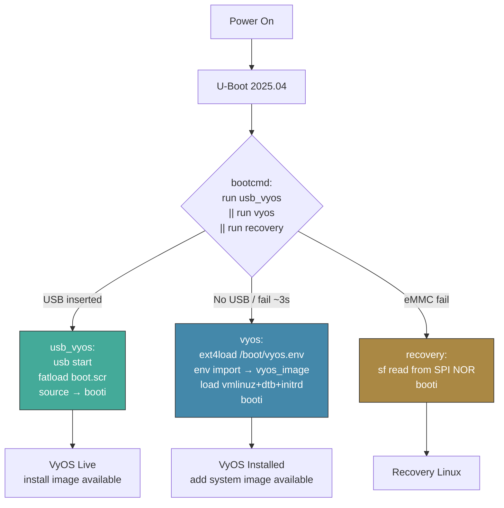
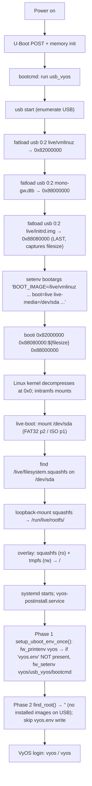

# Boot Process & U-Boot Reference — VyOS LS1046A (Mono Gateway DK)
**Version 1.1.0** · 2026-07-22 · HADS 1.0.0

---

## AI READING INSTRUCTION

Read `[SPEC]` and `[BUG]` blocks for authoritative facts.
Read `[NOTE]` only if additional context is needed.
`[?]` blocks are unverified — treat with lower confidence.

---

## 1. OVERVIEW & SEAMLESS BOOT ARCHITECTURE

**[SPEC]**
- Authoritative specification for U-Boot configuration, hardware memory map, clock tree, interface mapping, and boot sequence for the NXP LS1046A (Mono Gateway Development Kit).
- Supersedes `plans/UBOOT.md` (archived). For low-level kernel driver architecture, see `NETWORKING-DEEP-DIVE.md` and `PORTING.md`. For initial board setup, see `INSTALL.md`.
- Two primary boot paths share the same static U-Boot environment:

| Path | Trigger | Primary Use Case |
|------|---------|------------------|
| **USB Live Boot** | USB drive with FAT32 partition 2 inserted | Initial install, system recovery |
| **eMMC Installed Boot** | No USB; eMMC p3 ext4 present | Normal operational boot |

- Both paths use `booti` (raw ARM64 `Image` format).
- `bootm` (uImage) and `bootefi` (EFI) are NOT used. GRUB is not involved on this board.

**[NOTE]**
The legacy installation approach wrote the default image name into U-Boot's SPI flash via `fw_setenv` on every install and upgrade. The seamless boot architecture uses `/boot/vyos.env` on eMMC partition 3, so image selection happens in userspace without touching SPI NOR flash after initial provision.

### 1.1 Seamless Boot Chain

**[SPEC]**

```mermaid
flowchart TD
    PO["Power On"] --> UB["U-Boot 2025.04"]
    UB --> CMD{"bootcmd:\nrun usb_vyos\n|| run vyos\n|| run recovery"}

    CMD -->|"USB inserted"| USB_TRY["usb_vyos:\nusb start\nfatload boot.scr\nsource → booti"]
    CMD -->|"No USB / fail ~3s"| EMMC["vyos:\next4load /boot/vyos.env\nenv import → vyos_image\nload vmlinuz+dtb+initrd\nbooti"]
    CMD -->|"eMMC fail"| REC["recovery:\nsf read from SPI NOR\nbooti"]

    USB_TRY --> LIVE["VyOS Live\ninstall image available"]
    EMMC --> INSTALLED["VyOS Installed\nadd system image available"]
    REC --> RECOVERY["Recovery Linux"]

    style USB_TRY fill:#4a9,stroke:#333,color:#fff
    style EMMC fill:#48a,stroke:#333,color:#fff
    style REC fill:#a84,stroke:#333,color:#fff
```

### 1.2 User Experience Matrix

**[SPEC]**

| Operation | User Action | Automated System Action |
|-----------|------------|------------------------|
| First USB boot (factory board) | Interrupt U-Boot, paste setup lines | — |
| `install image` | Run command, accept defaults | Writes `/boot/vyos.env` + one-time `fw_setenv` |
| Reboot after install | Remove USB, reboot | U-Boot reads `vyos.env`, boots from eMMC |
| `add system image URL` | Run command | Writes `/boot/vyos.env` (no `fw_setenv`) |
| Reboot after upgrade | Reboot | U-Boot reads `vyos.env`, boots new image |
| USB re-install | Insert USB, power cycle | U-Boot auto-detects USB |
| `set system image default-boot` | Run command | Updates `/boot/vyos.env` |

---

## 2. U-BOOT ENVIRONMENT (TARGET STATE)

**[SPEC]**
- Stored in SPI NOR flash at `/dev/mtd2` ("uboot-env", QSPI, 4 KiB erase sector, 8 KiB env size).
- Written automatically by `vyos-postinstall` Phase 1 (`setup_uboot_env_once`) via `fw_setenv` on first boot. Manual U-Boot console setup is the fallback if `fw_setenv` fails.
- Config: `/etc/fw_env.config` → `/dev/mtd2 0x0 0x2000 0x1000`.
- Only 3 variables are written to SPI flash:

```bash
# Boot priority: USB → eMMC → SPI recovery
bootcmd=run usb_vyos || run vyos || run recovery

# USB live boot — delegates to boot.scr on FAT32 partition 2
# boot.scr handles all file loading, bootargs, and booti.
# If no USB or no boot.scr, the 'if fatload' fails cleanly and
# || in bootcmd falls through to 'run vyos'.
usb_vyos=usb start; if fatload usb 0:2 ${load_addr} boot.scr; then source ${load_addr}; fi

# eMMC boot — single combined variable: load vyos.env, import image name,
# load kernel/dtb/initrd, set bootargs, booti. Initrd loaded LAST so
# ${filesize} captures its size for the ramdisk addr:size format.
vyos=ext4load mmc 0:3 ${load_addr} /boot/vyos.env; env import -t ${load_addr} ${filesize}; ext4load mmc 0:3 ${kernel_addr_r} /boot/${vyos_image}/vmlinuz; ext4load mmc 0:3 ${fdt_addr_r} /boot/${vyos_image}/mono-gw.dtb; ext4load mmc 0:3 ${ramdisk_addr_r} /boot/${vyos_image}/initrd.img; setenv bootargs BOOT_IMAGE=/boot/${vyos_image}/vmlinuz console=ttyS0,115200 loglevel=4 systemd.show_status=true net.ifnames=0 boot=live rootdelay=5 noautologin fsl_dpaa_fman.fsl_fm_max_frm=9600 panic=60 sysctl.net.core.default_qdisc=fq usbcore.autosuspend=-1 vyos-union=/boot/${vyos_image}; booti ${kernel_addr_r} ${ramdisk_addr_r}:${filesize} ${fdt_addr_r}

# SPI flash recovery (factory, always available)
recovery=sf probe 0:0; sf read ${kernel_addr_r} ${kernel_addr} ${kernel_size}; sf read ${fdt_addr_r} ${fdt_addr} ${fdt_size}; booti ${kernel_addr_r} - ${fdt_addr_r}
```

**[SPEC]**
- Hugepages are NOT in default bootargs — added dynamically when VPP is configured via `set vpp settings`, which triggers a one-time kexec to apply `hugepagesz=2M hugepages=512`.
- `loglevel=4` (KERN_WARNING) limits kernel console spam to match stock VyOS on amd64. `earlycon` is omitted in normal operation to prevent pre-userspace console flooding.

### 2.1 Memory Map & Addresses

**[SPEC]**

| Variable | Address | Size | Notes / Contents |
|----------|---------|------|------------------|
| `kernel_addr_r` | `0x82000000` | ~30 MB | Kernel load address (`Image`) |
| `fdt_addr_r` | `0x88000000` | `0x100000` (1 MB) | Device tree load address (DTB) |
| `ramdisk_addr_r` | `0x88080000` | ~200 MB | Initrd load address (512KB after FDT) |
| `kernel_comp_addr_r` | `0x90000000` | — | Compressed kernel decompress area |
| `load_addr` | `0xa0000000` | 4 KB | Generic load address / `vyos.env` scratch |

**[SPEC]**
- System DRAM: 8 GB total.
  - Bank 0: `0x80000000` – `0xfbdfffff` (1982 MB)
  - Bank 1: `0x880000000` – `0x9ffffffff` (6144 MB)
- `fdt_addr_r = 0x88000000` is fixed. NEVER use `0x90000000` (`kernel_comp_addr_r`) for the DTB — that is the kernel decompression scratch space and will be overwritten during `booti` decompress (`0xa0000000` → `0x0`), causing `ERROR: Did not find a cmdline Flattened Device Tree`.

### 2.2 Load Ordering Constraint

**[BUG] "Wrong Ramdisk Image Format" when initrd is not loaded last**
- Symptom: `booti` fails with "Wrong Ramdisk Image Format / Ramdisk image is corrupt or invalid".
- Cause: U-Boot's `${filesize}` holds the byte count of the most recently loaded file; `booti` requires `${ramdisk_addr_r}:${filesize}` (address:size). If initrd is not loaded last, `${filesize}` captures the DTB or kernel size.
- Fix: Always load initrd last so `${filesize}` represents the initrd byte count.

---

## 3. PATH A: USB LIVE BOOT

### 3.1 Prerequisites

**[SPEC]**
- The USB drive is a hybrid ISO written via `dd` (or Rufus DD mode):
  - Partition 1 (ISO9660): contains squashfs.
  - Partition 2 (FAT32): contains boot files (`boot.scr`, `vmlinuz`, `initrd.img`, `mono-gw.dtb`).
- USB layout:
  ```
  boot.scr                     (U-Boot boot script)
  live/vmlinuz                 (~10 MB, kernel Image)
  live/initrd.img              (~33 MB, initramfs)
  live/filesystem.squashfs     (~526 MB, VyOS root filesystem)
  mono-gw.dtb                  (94 KB, device tree blob)
  ```
- Manual USB boot shortcut:
  ```bash
  usb start; fatload usb 0:2 ${load_addr} boot.scr; source ${load_addr}
  ```

### 3.2 Boot Sequence

**[SPEC]**

```mermaid
flowchart TD
    P[Power on] --> POST[U-Boot POST + memory init]
    POST --> BC["bootcmd: run usb_vyos"]
    BC --> U1["usb start (enumerate USB)"]
    U1 --> U2["fatload usb 0:2 live/vmlinuz → 0x82000000"]
    U2 --> U3["fatload usb 0:2 mono-gw.dtb → 0x88000000"]
    U3 --> U4["fatload usb 0:2 live/initrd.img → 0x88080000 (LAST, captures filesize)"]
    U4 --> U5["setenv bootargs 'BOOT_IMAGE=/live/vmlinuz ... boot=live live-media=/dev/sda ...'"]
    U5 --> U6["booti 0x82000000 0x88080000:${filesize} 0x88000000"]
    U6 --> K[Linux kernel decompresses at 0x0; initramfs mounts]
    K --> L1["live-boot: mount /dev/sda (FAT32 p2 / ISO p1)"]
    L1 --> L2["find /live/filesystem.squashfs on /dev/sda"]
    L2 --> L3["loopback-mount squashfs → /run/live/rootfs/"]
    L3 --> L4["overlay: squashfs (ro) + tmpfs (rw) → /"]
    L4 --> SD["systemd starts; vyos-postinstall.service"]
    SD --> P1["Phase 1 setup_uboot_env_once(): fw_printenv vyos → if 'vyos.env' NOT present, fw_setenv vyos/usb_vyos/bootcmd"]
    P1 --> P2["Phase 2 find_root() → '' (no installed images on USB); skip vyos.env write"]
    P2 --> LOGIN["VyOS login: vyos / vyos"]
```

### 3.3 Kernel Bootargs (USB Live)

**[SPEC]**
```
BOOT_IMAGE=/live/vmlinuz
console=ttyS0,115200
earlycon=uart8250,mmio,0x21c0500
boot=live
live-media=/dev/sda
components
noeject
nopersistence
noautologin
nonetworking
union=overlay
net.ifnames=0
fsl_dpaa_fman.fsl_fm_max_frm=9600
quiet
```

**[SPEC]**
Key parameters:
- `boot=live` — activates live-boot initramfs scripts.
- `live-media=/dev/sda` — USB whole-disk FAT32 containing squashfs.
- `BOOT_IMAGE=/live/vmlinuz` — required first arg for VyOS `is_live_boot()` detection.
- `fsl_dpaa_fman.fsl_fm_max_frm=9600` — enables jumbo frames on RJ45 ports (module name `fsl_dpaa_fman` is mandatory; wrong modname silently has no effect).
- `usbcore.autosuspend=-1` — required on LS1046A DWC3 xHCI to prevent USB autosuspend stalls.

---

## 4. PATH B: eMMC INSTALLED BOOT

### 4.1 Prerequisites

**[SPEC]**
- eMMC (`mmc 0`) partitioned by `install image`:

  | Partition | U-Boot | Type | Size | Contents |
  |-----------|--------|------|------|----------|
  | *(reserved)* | — | — | 32 MiB | NXP firmware boundary — no partitions |
  | p1 | `mmc 0:1` | raw | 1 MiB | BIOS boot gap — no filesystem |
  | p2 | `mmc 0:2` | FAT32 | 256 MiB | EFI — present but unused |
  | **p3** | **`mmc 0:3`** | **ext4** | remainder | **VyOS root** |

- eMMC p3 ext4 layout:
  ```
  /boot/
  ├── vyos.env                         ← image selector (plain text)
  └── 2026.03.27-0142-rolling/         ← image directory
      ├── vmlinuz                      ← kernel Image
      ├── mono-gw.dtb                  ← device tree blob
      ├── initrd.img                   ← initrd
      └── 2026.03.27-0142-rolling.squashfs  ← VyOS squashfs
  ```
- `/boot/vyos.env` content (single line, written by `vyos-postinstall`):
  ```
  vyos_image=2026.03.27-0142-rolling
  ```

### 4.2 Boot Sequence

**[SPEC]**
```mermaid
flowchart TD
    P[Power on] --> POST[U-Boot POST + memory init]
    POST --> BC["bootcmd: run usb_vyos"]
    BC --> U1["usb start"]
    U1 --> U2["fatload usb 0:2 live/vmlinuz → FAIL (no USB)"]
    U2 -->|falls through via '||'| V0["bootcmd: run vyos"]
    V0 --> V1["ext4load mmc 0:3 0xa0000000 /boot/vyos.env"]
    V1 --> V2["env import -t 0xa0000000 ${filesize} → sets ${vyos_image}=2026.03.27-0142-rolling"]
    V2 --> V3["ext4load mmc 0:3 0x82000000 /boot/${vyos_image}/vmlinuz"]
    V3 --> V4["ext4load mmc 0:3 0x88000000 /boot/${vyos_image}/mono-gw.dtb"]
    V4 --> V5["ext4load mmc 0:3 0x88080000 /boot/${vyos_image}/initrd.img (LAST)"]
    V5 --> V6["setenv bootargs 'BOOT_IMAGE=/boot/${vyos_image}/vmlinuz ... boot=live panic=60 vyos-union=/boot/${vyos_image}'"]
    V6 --> V7["booti 0x82000000 0x88080000:${filesize} 0x88000000"]
    V7 --> K[Linux kernel decompresses at 0x0; initramfs mounts]
    K --> L1["boot=live → activates live-boot path"]
    L1 --> L2["vyos-union=/boot/2026.03.27-0142-rolling → overlayfs squashfs (ro) + ext4 persistent (rw) → /"]
    L2 --> SD["systemd starts; vyos-postinstall.service"]
    SD --> P1["Phase 1 setup_uboot_env_once(): 'vyos.env' found → SKIP"]
    P1 --> P2["Phase 2 find_root() → '/' (installed); write_vyos_env(image_name, '/')"]
    P2 --> LOGIN["VyOS fully boots (~82s to login)"]
```

### 4.3 Kernel Bootargs (eMMC Installed)

**[SPEC]**
```
BOOT_IMAGE=/boot/2026.03.27-0142-rolling/vmlinuz
console=ttyS0,115200
net.ifnames=0
boot=live
rootdelay=5
noautologin
fsl_dpaa_fman.fsl_fm_max_frm=9600
panic=60
sysctl.net.core.default_qdisc=fq
usbcore.autosuspend=-1
vyos-union=/boot/2026.03.27-0142-rolling
```

**[SPEC]**
Key parameters:
- `BOOT_IMAGE=/boot/<image>/vmlinuz` — required first argument; enables `is_live_boot()` detection.
- `boot=live` — required even on installed system; VyOS initramfs depends on it.
- `vyos-union=/boot/<image>` — points to squashfs on eMMC partition 3.
- `panic=60` — a `MANAGED_PARAMS` parameter; must match `config.boot` default to prevent kexec double-boot.

---

## 5. IMAGE SELECTION MECHANISM (`vyos.env`)

**[SPEC]**
- `/boot/vyos.env` is a plain-text key=value file read by U-Boot's `env import -t`.
- Write paths (all call `vyos-postinstall` or `grub.set_default()`):

| Event | Trigger | Action |
|-------|---------|--------|
| First USB boot | (none) | No `vyos.env` written — live boot only |
| `install image` | `image_installer.install_image()` | `grub.set_default()` patch + `run('vyos-postinstall')` |
| `add system image` | `image_installer.add_image()` | `grub.set_default()` patch |
| `set system image default-boot` | VyOS CLI → `grub.set_default()` | `grub.set_default()` patch |
| Every boot | `vyos-postinstall.service` | Phase 2 writes current image name |

- Format — single line, LF-terminated:
  ```
  vyos_image=2026.03.27-0142-rolling
  ```
- `env import -t` treats `\0` as EOF and `\n` as field separator.

---

## 6. DTB DELIVERY

**[SPEC]**
The device tree blob `mono-gw.dtb` must be present in two locations:

| Location | Used by | Written by |
|----------|---------|------------|
| `/mono-gw.dtb` on USB FAT32 | U-Boot `usb_vyos` (`fatload usb 0:2 mono-gw.dtb`) | Build: `mcopy` into FAT32 USB image |
| `/boot/<image>/mono-gw.dtb` on eMMC p3 | U-Boot `vyos` (`ext4load mmc 0:3 /boot/${vyos_image}/mono-gw.dtb`) | `install_image()`: copies all files from squashfs `/boot/` |

- For `add system image` (upgrade), patch 011 copies all `.dtb` files from the ISO root into the new image directory during `add_image()`.

---

## 7. KEXEC & DOUBLE-BOOT MECHANISM

**[SPEC]**
- VyOS `system_option.py` compares `/proc/cmdline` against `config.boot` `MANAGED_PARAMS` (hugepages, panic, mitigations).
- `kexec-load.service` and `kexec.service` are NOT masked — the 6.18.x kernel carries the QBMan kexec cleanup fix (`bman_requires_cleanup()` in `drivers/soc/fsl/qbman/`), allowing clean kexec on DPAA1.
- `panic=60` is pre-baked into U-Boot bootargs to match `config.boot.default`.
- Hugepages: NOT pre-allocated in bootargs by default. When VPP is enabled via `set vpp settings`, VPP adds `hugepagesz=2M hugepages=512` to managed params, triggering a one-time kexec reboot.

---

## 8. SPI NOR FLASH (MTD) LAYOUT

**[SPEC]**
- QSPI NOR flash (Micron mt25qu512a, 64 MiB, 4 KiB erase sector). Verified against live `/proc/mtd`.
- `mtd0` is the whole flash device; `mtd1`–`mtd7` are DTS-defined partitions:

| MTD | Offset | Name | Size | Contents |
|-----|--------|------|------|----------|
| mtd0 | `0x000000` | `rcw-bl2` | 1 MiB | RCW + BL2 |
| mtd1 | `0x100000` | `uboot` | 2 MiB | U-Boot binary |
| **mtd2** | **`0x300000`** | **`uboot-env`** | **1 MiB** | **U-Boot environment** (8 KiB env, 4 KiB sector) |
| mtd3 | `0x400000` | `fman-ucode` | 1 MiB | FMan microcode (injected by U-Boot into DTB) |
| mtd4 | `0x500000` | `recovery-dtb` | 1 MiB | Recovery device tree |
| mtd5 | `0x600000` | `backup` | 4 MiB | Backup partition |
| mtd6 | `0xa00000` | `kernel-initramfs` | 22 MiB | Recovery kernel + initramfs |
| mtd7 | `0x2000000` | `unallocated` | 32 MiB | Unallocated space |

- `/etc/fw_env.config` configuration: `/dev/mtd2 0x0 0x2000 0x1000` (8 KiB env size, 4 KiB sector). Used by `fw_setenv`/`fw_printenv` from `libubootenv-tool`.

**[BUG] `/proc/mtd` empty and `fw_setenv` fails without `CONFIG_SPI_FSL_QSPI=y`**
- Symptom: `/proc/mtd` is empty and `fw_setenv` fails with "Configuration file wrong or corrupted."
- Cause: `CONFIG_SPI_FSL_QSPI` missing from kernel config.
- Fix: `CONFIG_SPI_FSL_QSPI=y` forced in `00-board.config`.

---

## 9. HARDWARE CLOCK TREE & CPU FREQUENCY

**[SPEC]**
- System Reference Clock (sysclk): 100 MHz oscillator.

| Clock | Rate | Source | Notes |
|-------|------|--------|-------|
| `cg-pll1-div1` | 1600 MHz | PLL1 | Max CPU frequency |
| `cg-pll1-div2` | 800 MHz | PLL1 | |
| `cg-pll1-div3` | 533 MHz | PLL1 | |
| `cg-pll1-div4` | 400 MHz | PLL1 | |
| `cg-pll2-div1` | 1400 MHz | PLL2 | HWACCEL1 |
| `cg-pll2-div2` | 700 MHz | PLL2 | Minimum CPU clock |
| `cg-cmux0` | 1600–1800 MHz | PLL1-div1 | **CPU clock mux (all 4 cores)** |
| `cg-hwaccel0` | 700 MHz | PLL2-div2 | FMan clock |
| `cg-pll0-div2` | 300 MHz | PLL0 | DSPI controller clock |

**[BUG] CPU stuck at 700 MHz if CPUFREQ is a module**
- Symptom: CPU stays at 700 MHz instead of 1600–1800 MHz (raid6 neonx8 ~2056 MB/s vs ~4816 MB/s).
- Cause: `CONFIG_QORIQ_CPUFREQ=m` loads after `clk: Disabling unused clocks` (T+12s) releases PLL parents.
- Fix: `CONFIG_QORIQ_CPUFREQ=y` (built-in) claims PLL parents before unused clock disable runs.

---

## 10. ETHERNET INTERFACE & MAC MAPPING

**[SPEC]**

| Physical Position | DT Node | MAC Address (board default) | PHY / SerDes | VyOS Interface | Type |
|-------------------|---------|-----------------------------|--------------|----------------|------|
| Port 1 (leftmost RJ45) | `1ae8000.ethernet` | `ethaddr` (`...:15:FF`) | MDIO :00 | **eth0** | SGMII 1G |
| Port 2 (center RJ45) | `1aea000.ethernet` | `eth1addr` (`...:16:00`) | MDIO :01 | **eth1** | SGMII 1G |
| Port 3 (rightmost RJ45) | `1ae2000.ethernet` | `eth2addr` (`...:16:01`) | MDIO :02 | **eth2** | SGMII 1G |
| SFP1 (left SFP+ cage) | `1af0000.ethernet` | `eth3addr` (`...:16:02`) | fixed-link / XFI | **eth3** | XGMII 10G |
| SFP2 (right SFP+ cage) | `1af2000.ethernet` | `eth4addr` (`...:16:03`) | fixed-link / XFI | **eth4** | XGMII 10G |

**[SPEC]**
- Physical RJ45 port order differs from DT unit-address order (`e2000`, `e8000`, `ea000`, `f0000`, `f2000`).
- Rename layer `vyos-1x-027` `vyos_net_name` maps DT node address to physical port name (`eth0`–`eth4`). On installed systems, `config.boot` `hw-id` MAC matching takes precedence.

---

## 11. U-BOOT BUILD REFERENCE & FACTORY BOOT

**[SPEC]**
Target U-Boot build output on Mono Gateway DK:
```
U-Boot 2025.04-g9f13d11658f6 (Feb 06 2026 - 09:41:56 +0000)
aarch64-oe-linux-gcc (GCC) 14.3.0
GNU ld (GNU Binutils) 2.44.0.20250715
```

### 11.1 Factory Boot Commands (OpenWrt Pre-Install)

**[SPEC]**
```bash
# Factory default: try eMMC OpenWrt, then SPI recovery
bootcmd=run emmc || run recovery

# eMMC (OpenWrt on partition 1) — destroyed after install image
emmc=setenv bootargs "${bootargs_console} root=/dev/mmcblk0p1 rw rootwait rootfstype=ext4";
    ext4load mmc 0:1 ${kernel_addr_r} /boot/Image.gz &&
    ext4load mmc 0:1 ${fdt_addr_r} /boot/mono-gateway-dk-sdk.dtb &&
    booti ${kernel_addr_r} - ${fdt_addr_r}

# SPI flash recovery (always available)
recovery=sf probe 0:0; sf read ${kernel_addr_r} ${kernel_addr} ${kernel_size};
    sf read ${fdt_addr_r} ${fdt_addr} ${fdt_size};
    booti ${kernel_addr_r} - ${fdt_addr_r}
```

---

## 12. EFI & GRUB STATUS

**[SPEC]**
- U-Boot on this board is compiled without EFI debug support (`CONFIG_CMD_EFIDEBUG` disabled):
  ```
  => efidebug devices
  Unknown command 'efidebug' - try 'help'
  ```
- `bootefi` is a command stub; EFI runtime is not functional. Even if compiled in, GRUB permanently OOMs due to DPAA1 `reserved-memory` nodes consuming EFI memory pools.
- Permanent boot method: `booti` via U-Boot environment / `boot.scr`.

---

## 13. FAILURE MODES & TROUBLESHOOTING

**[BUG] Missing `boot=live` or `vyos-union=` drops to BusyBox**
- Symptom: Boot lands in an initramfs BusyBox shell (`(initramfs)` prompt).
- Cause: `boot=live` or `vyos-union=` missing from bootargs — live-boot initramfs cannot mount squashfs.
- Fix: Verify `boot=live` and `vyos-union=/boot/${vyos_image}` are in bootargs.

**[BUG] `booti` without `:${filesize}` on ramdisk**
- Symptom: "Wrong Ramdisk Image Format / Ramdisk image is corrupt or invalid".
- Cause: `booti` requires `addr:size` format for ramdisk.
- Fix: Ensure initrd is loaded last and specify `${ramdisk_addr_r}:${filesize}`.

**[BUG] `usb 0:0` auto-detection fails on hybrid MBR**
- Symptom: USB boot fails when using `usb 0:0`.
- Cause: LS1046A U-Boot auto-detection (`usb 0:0`) fails on hybrid MBR ISOs.
- Fix: Explicitly specify partition 2: `usb 0:2` (`fatload usb 0:2 ...`).

**[BUG] `No partition table - usb 0` / `Couldn't find partition usb 0:1`**
- Symptom: U-Boot cannot find USB partition 1.
- Cause: Hybrid ISO partition 1 is ISO9660, partition 2 is FAT32.
- Fix: Use `fatload usb 0:2 ${load_addr} boot.scr`.

**[BUG] `Can't set block device`**
- Symptom: U-Boot fails to set eMMC block device.
- Cause: Attempting to load from `mmc 0:1` (partition 1 is raw BIOS boot gap).
- Fix: Use `mmc 0:3` for VyOS root filesystem.

**[BUG] `ERROR: Did not find a cmdline Flattened Device Tree`**
- Symptom: Kernel reports no DTB present.
- Cause: DTB loaded at `0x90000000` (`kernel_comp_addr_r`), overwritten by kernel decompression.
- Fix: Load DTB at `${fdt_addr_r}` = `0x88000000`.

**[BUG] Kexec boot loop**
- Symptom: System reboots continuously after kernel start.
- Cause: `panic` parameter in bootargs doesn't match `config.boot`.
- Fix: Include `panic=60` in U-Boot bootargs.

---

## 14. RELATED DOCUMENTS

- `plans/DEV-LOOP.md` — Fast dev loop (TFTP / network boot without re-flashing)
- `plans/DUAL-DATAPLANE.md` — Dual-dataplane architecture (S0/S1/S2 runtime model)
- `plans/NETWORKING-DEEP-DIVE.md` — Silicon deep-dive (FMan, BMan, QMan, VPP, ASK)
- `specs/dpaa1-afxdp-modernization-spec.md` — Authoritative cross-flavor DPAA1 spec
- `INSTALL.md` — Step-by-step physical installation guide