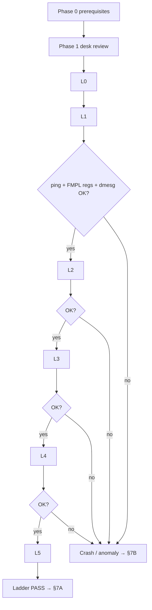

# BUG 3b Flood-Crash Characterization Plan — ingress-policer under sustained load
**Version 1.0.0** · 2026-06-09 · HADS 1.0.0

---

## AI READING INSTRUCTION

Read `[SPEC]` and `[BUG]` blocks for authoritative facts.
Read `[NOTE]` only if additional context is needed.
`[?]` blocks are unverified — treat with lower confidence.

---

## 1. OBJECTIVE

**[SPEC]**
- Close the last open half of BUG 3b: characterize (and if necessary fix) the **flood-crash** behaviour of the DPAA1 hardware ingress-policer under sustained iperf3 load on the current fixed image.
- BUG 3b's **non-revert half is already FIXED + HW-verified** (kernel `0104` `flow_block_cb_alloc(... release ...)` + `vyos-1x-025` filter-del reorder; delete → ping 5/5, delete→re-apply clean). See `specs/dpaa1-afxdp-modernization-spec.md` §5.6.
- **Bonus on success:** the final ladder step doubles as the §8.3 quantitative throughput-cap measurement (goodput ≈ CIR on offered ≫ CIR) — closing the last open M3-3d acceptance item in the same session.

**[BUG]**
- The crash evidence is from a **reverted** build: the `4e0cd6f` `FMPL_PMR`-window build watchdog-reset the board under a policed `iperf3 -R` flood (2026-06-09). That build wrote `0x80000000` to `0x1AC0240` — suspected wrong/misdocumented CCSR register.
- The **current shipped build** (`1a48948`, board patch `0100` `plcr_enable_block()` GCR-enable, RELATIVE addressing, **no** PMR write) has **never been flood-tested**. Hypothesis H1: the crash was specific to the bogus PMR write and the current build is flood-safe. Hypothesis H2: the crash is in the shared red-discard / congestion path and will reproduce.

---

## 2. KNOWN FACTS & RISK MODEL

**[SPEC]**
- A stuck-PLCR KeyGen scheme **survives a warm/watchdog reset**; only a clean **cold power-cycle** clears it. Worst case after a crash: eth3 stays dead across warm reboots until an operator power-cycles the board.
- DUT is the dev board (`192.168.1.190`, branch `dpaa1` stream) — an eth3 outage is tolerable; prod (`192.168.1.2`) is untouched.
- `panic=60` is in U-Boot bootargs → a kernel panic auto-reboots in 60 s; installed-system boot ≈ 82 s → self-recovery to SSH in ≈ 2.5 min for panic-class crashes.
- **pstore/ramoops is built in** (`kernel/common/kernel-config/10-pstore-ramoops.config`: `CONFIG_PSTORE_RAM=y`, `CONFIG_PSTORE_CONSOLE=y`; DTS `ramoops@b0000000`, 1 MB) — panic backtraces + console output survive the reboot in `/sys/fs/pstore`. Must be live-verified in Phase 0 (never yet exercised by a real crash).
- Serial relay `telnet 192.168.1.16:5555` is **single-client**; a background TCP reader gives a live console record independent of pstore.
- Repro/characterize the policer with a few ping packets by default; floods ONLY inside this plan's escalation protocol.

**[NOTE]**
Crash self-recovery matrix: panic → `panic=60` reboot (pstore captures). Hard lockup → imx2-wdt reset *if armed* (Phase 1 verifies the reset agent of the original crash). Either way the board reboots into the **saved** config — which is why the safety rail below forbids saving the policer config.

---

## 3. SAFETY RAILS (mandatory, all phases)

**[SPEC]**
1. **Ephemeral policer config — NEVER `save`.** Apply via vbash commit only (`/tmp/kilo/set_policer.sh` on DUT). A crash-reboot then returns with **no policer** in `config.boot` → clean FMan/KeyGen state programmed from scratch at boot.
2. **Serial logger running before any policed flood:** background `socat - TCP:192.168.1.16:5555 > /tmp/kilo/serial-bug3b.log` (or python TCP reader) from this VM. Verify nothing else holds the single-client relay.
3. **Pre-staged teardown:** `/tmp/kilo/del_policer.sh` already on DUT; run it after every ladder step.
4. **Operator power-cycle standby:** schedule the flood session while someone can physically power-cycle the board, OR explicitly accept a possible multi-day eth3 outage before starting.
5. **Thermal guard:** `fan-check` before the session and between L4/L5; abort if any zone reports `[HOT]`/`[CRIT]`.
6. **Between EVERY ladder step:** `ping 10.99.1.2 -c 3` from DUT, `sudo python3 /tmp/kilo/fmpl-status-read.py`, `dmesg | tail -30`, then proceed/abort per criteria.

---

## 4. PHASE 0 — PREREQUISITES (no traffic)

**[SPEC]**
- [ ] DUT on image `2026.06.09-2032-rolling` (kernel `6.18.34-vyos`) or later; `dpaa1` HEAD deployed.
- [ ] Verify pstore live: `ls /sys/fs/pstore/` mounts; `dmesg | grep -i ramoops` shows the `0xb0000000` region registered. Optional canary: `echo bug3b-canary | sudo tee /dev/pmsg0`, `sudo reboot` (warm), confirm `pmsg-ramoops-0` appears post-boot.
- [ ] Determine watchdog posture: is `/dev/watchdog0` opened by anything (`sudo lsof /dev/watchdog0`; systemd `RuntimeWatchdogSec`)? Record — this identifies the reset agent if a hard lockup occurs.
- [ ] Traffic harness healthy per `plans/TRAFFIC-HARNESS.md` §2–3: lxc201 (10.99.1.2, gw eth3) ↔ lxc202 (10.11.1.2, gw eth4) ping through DUT with TTL=63, 0% loss; iperf3 server up on lxc202.
- [ ] Serial logger attached and logging (rail 2).
- [ ] `fan-check` clean.

---

## 5. PHASE 1 — DESK REVIEW (no traffic)

**[SPEC]**
- [ ] **Build delta audit:** `git diff 4e0cd6f..1a48948 -- kernel/common/patches/board/0100-fman-pcd-plcr-install.patch kernel/common/patches/board/0097-fman-pcd-keygen.patch` — enumerate every register-write difference between the crashing PMR build and the current GCR build. Expected: PMR writes (`0x1AC0240/44`) removed, GCR RMW added, KeyGen mode unchanged RELATIVE. Confirms/refutes H1 on paper.
- [ ] **Red-path review:** walk the red-discard NIA path (`PERNIA = 0x805000c1` [DISCARD]) for buffer-pool / congestion interaction under sustained discard; identify which FMPL error registers (`EVR @0x008`, `SERC @0x100`, `UPCR @0x104`) capture anomalies for post-step readout (already in `fmpl-status-read.py`).
- [ ] Do NOT guess register bits — anything new must come from the LS1046A RM §8.7.6 / SDK refs in `/tmp/kilo/sdk_*.c`.

---

## 6. PHASE 2 — ESCALATION LADDER

**[SPEC]**
Router-path flood per `plans/TRAFFIC-HARNESS.md`: lxc201 → DUT eth3 (ingress, **policed**) → forward → eth4 → lxc202. UDP gives precise offered-load control; TCP reproduces the original crash profile. Policer under test: `set interfaces ethernet eth3 ingress-policer bandwidth 1gbit` (ephemeral, rail 1).

| Step | Policer | Load (lxc201 → lxc202) | Dur | Expected | Pass criteria |
|------|---------|------------------------|-----|----------|---------------|
| L0 | none | UDP `-b 500M` | 10 s | harness sanity | iperf3 completes, 0 dmesg errors |
| L1 | 1gbit | UDP `-b 500M` (< CIR) | 5 s | all green | TPC↑, RPC≈0, ping 3/3 |
| L2 | 1gbit | UDP `-b 1.5G` (1.5× CIR) | 5 s | red discards begin | RPC↑, ping 3/3, dmesg clean |
| L3 | 1gbit | UDP `-b 3G` (3× CIR) | 10 s | heavy red discard | as L2; EVR/SERC clean |
| L4 | 1gbit | TCP (default, orig crash profile) | 10 s | goodput ≈ CIR | survives; ping 3/3 |
| L5 | 1gbit | TCP sustained | 60 s | **quantitative cap gate** | goodput ≈ 1 Gbit/s ±25%; no crash; thermal OK |

After the ladder (pass or crash recovery): run `del_policer.sh`, re-verify ping + one short unpoliced iperf3, confirm eth3 fully healthy.

---

## 7. PHASE 3 — OUTCOME BRANCHES

### 7A. Ladder passes (H1 confirmed)

**[SPEC]**
- BUG 3b flood-crash half → **CLOSED** (crash was specific to the reverted bogus PMR write).
- Record the L5 measured cap → closes the §8.3 policer quantitative gate.
- Doc-sync: spec §5.6 BUG 3b paragraph, `plans/COMPLETION-PLAN.md` §4.4, `AGENTS.md` policer paragraph (drop "flood-crash half OPEN"; record the cap number). `qdrant-store` the result.

### 7B. Crash reproduces (H2)

**[SPEC]**
1. Wait ≤ 3 min for self-recovery (`panic=60` + boot); SSH retry loop.
2. Collect: `/sys/fs/pstore/*` (console + dmesg records), the serial log, `dmesg`.
3. Stuck-scheme check: `sudo python3 /tmp/kilo/fman-kg-read.py` — does the eth3 scheme MODE still carry the PLCR engine bits? `fmpl-status-read.py` for GCR/EVR/SERC. Ping test.
4. If eth3 dead across warm reboot → operator **cold power-cycle**, re-verify clean boot.
5. Root-cause from the backtrace; author fix as a board-patch revision (durable patch file, NOT work-tree edit — `dev-build.sh kernel` wipes `$KSRC`); rebuild via `bin/dev-build.sh kernel` or CI; redeploy; **restart the ladder from L1**.
6. `qdrant-store` the crash fingerprint immediately (dense prose: signature, step, registers, date).

---

## 8. ACCEPTANCE — "BUG 3b cleared" means

**[SPEC]**
- Full ladder L1–L5 passes on the shipped image with zero crash/oops/watchdog signatures in dmesg + serial + pstore, AND
- post-ladder `delete ingress-policer` leaves eth3 fully healthy (ping + iperf3 sanity), AND
- the L5 throughput cap is recorded in spec §5.6/§8.3, AND
- docs + qdrant synced per §7A.

---

## 9. CROSS-REFERENCES

**[SPEC]**
- `specs/dpaa1-afxdp-modernization-spec.md` §5.6 (BUG 3a/3b authoritative narrative), §8 (validation matrix).
- `plans/COMPLETION-PLAN.md` §4.4 (policer status), §6.
- `plans/TRAFFIC-HARNESS.md` (topology, access, iperf3 invocation).
- `AGENTS.md` ingress-policer paragraph (update on close-out).
- Board patches: `kernel/common/patches/board/0100-fman-pcd-plcr-install.patch` (GCR fix), `0104-dpaa-ingress-policer-tc-matchall-bridge.patch` (release callback), `data/vyos-1x-025-ingress-policer.patch`.
- DUT tooling: `/tmp/kilo/{set_policer.sh,del_policer.sh,fmpl-status-read.py,fman-kg-read.py}`.
- Qdrant: `topic=dpaa1-ingress-policer-bug3a-3b date=2026-06-09` (register dumps from the crashing build's session).
---

## EXECUTED 2026-06-09 — RESULT: PASSED (flood-crash half CLOSED, cap MEASURED)

Run on image `2026.06.09-2032-rolling`, kernel `6.18.34-vyos`, DUT `192.168.1.190`, serial logger attached (zero console output during all floods), per-step health checks all clean (FMPL EEVR/SERC/UPCR = 0 throughout, thermal COOL, ping 0% loss between every step).

| Step | Profile | Result |
|---|---|---|
| L0 | UDP 500M, no policer (sanity) | 474 Mbit/s delivered (~5% routing floor) — PASS |
| apply | `ingress-policer bandwidth 1gbit` | `in_hw`, `FMPL_GCR=0xC0500002`, `FMPL_PMR[15]=0x80000000` (V=1) |
| L1 | UDP 500M < CIR, 5 s | survived; RPC counts below CIR (15Kb tc burst vs 10G microbursts — srTCM artifact, not a fault) — PASS |
| L2 | UDP 1.5G, 5 s | 690 Mbit/s delivered, enforcing — PASS |
| L3 | UDP 3G, 10 s | 924 Mbit/s ≈ CIR, 1.6M red drops — PASS |
| L4 | TCP single, 10 s (orig crash profile) | 319 Mbit/s (TCP backs off under red-drop), no crash — PASS |
| L5 | TCP `-P 8`, 60 s sustained | 645 Mbit/s aggregate, no crash, thermal COOL — PASS |
| L5b | UDP 3G, 30 s (definitive cap) | **934 Mbit/s on 1 Gbit CIR (93.4%)**, RPC 3.58M — **GATE PASS** |
| teardown | `delete ingress-policer` | filter empty, PMR V=0, GCR stays enabled (by design), ping 5/5, unpoliced 1.87 Gbit/s — PASS |

**Failure-model refinement:** the shipped `0100` build programs the `FMPL_PMR` per-port window live (`plcr_set_port_window` on install / `plcr_clear_port_window` on destroy — observed V=1↔V=0 on hardware). The historical watchdog reset under flood was an artifact of the **GCR-disabled** (`FMPL_GCR.EN` clear) pre-fix state, **not** the PMR window write. Both halves of BUG 3b are closed; **M3-3d is functionally complete.**
