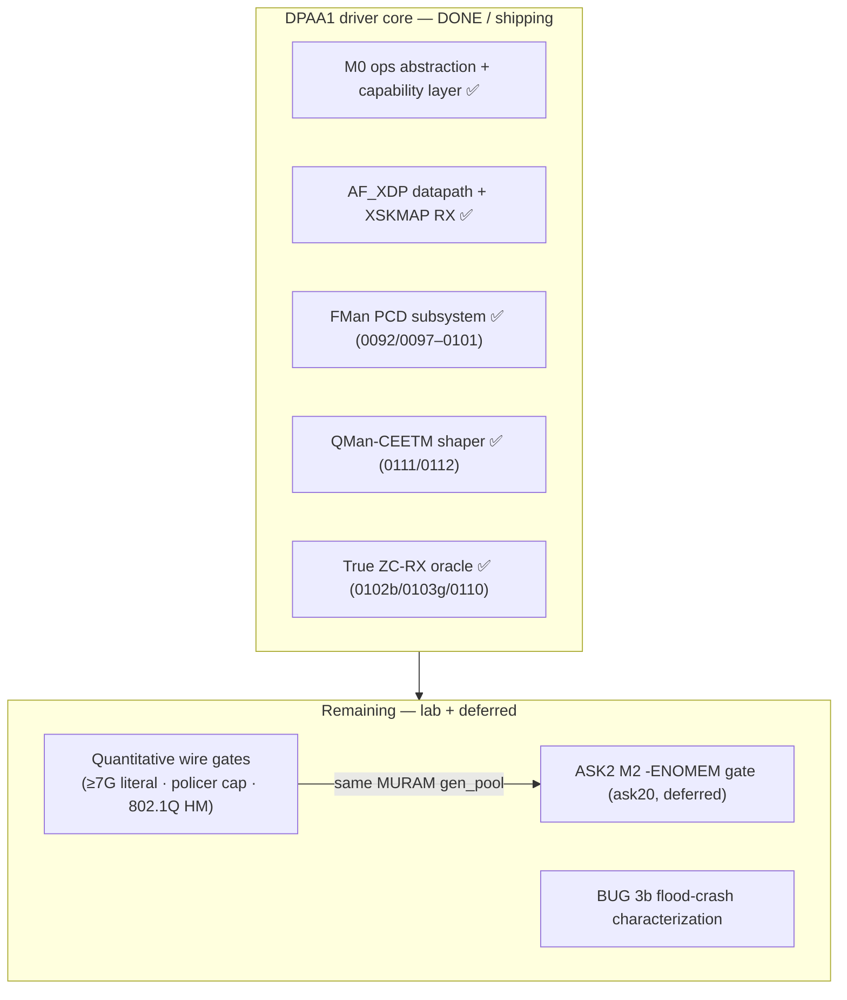

# DPAA1 + VPP + ASK2 — Consolidated Completion Plan
**Version 1.2.0** · 2026-06-14 · HADS 1.0.0

---

## AI READING INSTRUCTION

Read `[SPEC]` and `[BUG]` blocks for authoritative facts.
Read `[NOTE]` only if additional context is needed.
`[?]` blocks are unverified — treat with lower confidence.

---

## 1. METADATA & SOURCE-OF-TRUTH

**[SPEC]**
- Date: 2026-06-08.
- Branch: `dpaa1` (default/vpp work) · `ask20` (ASK2 work).
- Status: Active roadmap — single cross-flavor view of all remaining work.

**[SPEC]**
Authoritative specs (source-of-truth; this doc only sequences them):
- `specs/dpaa1-afxdp-modernization-spec.md` (v5.22) — the cross-flavor DPAA1 driver. One driver core + two ops tables (`pcd_ops`, `qmgmt_ops`); the FMan PCD subsystem lives in the common board stack (built-in for `default`/`vpp`/`ask`).
- `specs/vpp-dpaa1-ls1046a-spec.md` (v0.2) — VPP flavor over AF_XDP (native DPDK plugin rejected, Appendix A).
- `specs/ask2-rewrite-spec.md` (v1.7) — ASK2 modern FMan-210 offload (`ask.ko` consumes the common PCD stack via `pcd_ops`).

**[NOTE]**
This plan is a router, not a second source-of-truth. Where it disagrees with a spec, the spec wins — update this doc. All structural/architectural decisions are already settled in the specs; what remains is forward-port volume, datapath debug, and lab/harness provisioning.

---

## 2. ONE-PARAGRAPH SUMMARY

**[NOTE]**
The DPAA1 driver core is DUT-validated and shipping in the `default`/`vpp` ISOs. The two big kernel forward-ports are **DONE**: the FMan PCD subsystem (common board stack, `0092`/`0097`–`0101`) and the QMan-CEETM driver (`0111`/`0112`, shipped + closed). M3-3b CC steering, M3-3c HM, M3-3d policer BUG 3a + 3b-non-revert, true-ZC RX, and M3-3e CEETM are all closed / HW-validated. What remains is (1) lab/harness quantitative gates — the literal ≥7 Gbps figure, the policer 2.5 Gbps cap number, the M3-3c 802.1Q wire gate; (2) the BUG 3b flood-crash characterization (serial + cold power-cycle); and (3) the ASK2 `ask20` work-stream (M2 `-ENOMEM` MURAM gate, then `ask.ko`), deferred until DPAA1 is fully closed.

---

## 3. STATUS AT A GLANCE

**[SPEC]**

**[SPEC]**

| Flavor | Substrate | Functional state | Single biggest blocker |
|---|---|---|---|
| **default** | common DPAA1 core ✅ | M3-3b/3c/3d/3e all closed / HW-validated; true-ZC RX closed | quantitative wire gates + the BUG 3b flood-crash characterization (lab) |
| **vpp** | common DPAA1 core ✅ (AF_XDP) | plumbed + shipping in CI; **not benchmarked on HW after the patch-022 AF_XDP cutover** | a HW benchmark run |
| **ask** | scaffold-only (builds vanilla VyOS today) | Path A activation verified on a prior ask20 build; **M2 CPU gate FAILED** (327× `chain_create -ENOMEM`) | PCD MURAM-budget fix (deferred work-stream) |

---

## 4. DPAA1 (`default`) COMPLETION

**[SPEC]**
Remaining items in dependency order (mirrors the spec's "What remains for a complete DPAA1 driver" table, §60–75).

### 4.1 FMan PCD subsystem forward-port ✅ DONE

**[SPEC]**
Landed in the common board stack (`0092`/`0097`–`0101`, bridge idiom; 64 KiB MURAM reserved, `caps = 0x17`). Unblocked M3-3b CC steering (CLOSED 2026-06-12) and underpins the live M3-3c/M3-3d productive paths. Same PCD/MURAM substrate ASK2 will consume via `pcd_ops`.

### 4.2 QMan-CEETM shaper ✅ SHIPPED + CLOSED (2026-06-14)

**[SPEC]**
`0111` (`qman_ceetm.c` object model + MC helper) + `0112` (`TC_SETUP_QDISC_HTB` offload consumer) supersede the `0104b` stub. DEFECT A FIXED; DEFECT B closed as a documented LS1046A silicon limitation (product-impact NONE — see spec §5.7). HW hierarchical egress shaping live as a stock `tc htb offload` qdisc; the literal rate-cap accuracy number wants the §8 generator.

### 4.3 True ZC-RX productive oracle ✅ DONE (2026-06-10)

**[SPEC]**
`xsk_zc_rx_redirect` fires + reproducible; BMI BPID flip proven (`0102b`), NULL-`xdp.rxq` crash fixed (`0103g`), NAPI-only flush (`0110`). Crash-free + reversible. **Open:** GAP 2 — the literal high-rate true-ZC throughput number (needs the §8 peer-flood harness; NOT gate-3-blocking).

### 4.4 Policer datapath (M3-3d) — BUG 3a + 3b-non-revert FIXED + HW-validated; flood-crash half OPEN

**[SPEC]**
Steering + BUG 3a (FMPL block master-enable `GCR.EN|STEN` clear at boot) + the BUG 3b non-revert half (release-cb scheme revert) all FIXED + HW-validated (image `2032`, `1a48948`, `0100`/`0104` + `vyos-1x-025`). Register-proof trail in Qdrant `topic=dpaa1-ingress-policer-bug3a-3b`. **Open:** (1) the iperf3 flood-crash half of BUG 3b (serial capture + cold power-cycle; watchdog-reset risk — always characterize with pings, never a flood); (2) the literal 2.5 Gbps cap + red-drop number on the §8 harness.

### 4.5 HM functional datapath gate (M3-3c) — lab-blocked

**[SPEC]**
- State: feature live on hardware (cap `0x17`, `rx-vlan-offload: on`, MURAM 0→144→0 proven 2026-06-07); `vyos-1x-024` CLI shipped + live on the DUT. No kernel work, no CLI work.
- Remaining: a controllable 802.1Q tagged source to prove the §5.5 strip/insert gate. Lower silent-fail risk than the policer (VLAN-strip has a normal kernel SW fallback).

### 4.6 Literal ≥7 Gbps gate-3 figure — ≥7G PROVEN; single-stream line-rate deferred

**[SPEC]**
- gate-3 ≥7 Gbps PROVEN (7.41 Gbit/s @4 flows, 2026-06-12, §8 harness). A literal single-stream line-rate figure still wants a multi-process iperf3 server (split receiver across cores) or a wire-rate generator (TRex / DPDK-pktgen). No kernel work.

### 4.7 DCSR error observability (§5.8) — incremental

**[SPEC]**
- `0079` landed; remaining debugfs error-window taps (`{bmi,parser,kg,pol}_err`, §4.9) are incremental, no blocker.

---

## 5. VPP CONSUMER-MODE COMPLETION

**[SPEC]**
- State: plumbed and shipping in every image. AF_XDP datapath on the SFP+ ports (`fsl_dpa` → `driver='xdp'`, patch `vyos-1x-022`); native VyOS CLI (`set vpp settings …`); dormant until configured. Native DPDK plugin path is rejected (RC#31; spec Appendix A).
- Remaining (no architecture work):
  1. HW benchmark — the flavor has not been benchmarked on hardware since the patch-022 AF_XDP cutover. Confirm the ~3.5 Gbps SFP+ figure, thermal behaviour (`poll-sleep-usec 100` mandatory), and the MTU ≤3290 AF_XDP constraint hold.
  2. Hugepage / kexec one-shot — verify the `set vpp settings`-triggered hugepage kexec still lands cleanly on the 6.18.x kernel.
  3. Feeds the shared §8 generator dependency for any literal throughput claim.

---

## 6. ASK2 COMPLETION (`ask20` BRANCH)

**[SPEC]**
- State: `kernel/flavors/ask/` is scaffold-only; the single image ships `ask.ko` **dormant in every ISO** — until the ASK2 components land, the offload is a no-op and the image is functionally vanilla VyOS for ASK. Spec is **v1.8** (single-image flavor collapse adopted; architecture frozen; dual-dataplane state machine S0/S1/S2). Path A is **config-driven late-bind**: `ask.ko` loads on a `set system offload ask` commit and `pcd_ops->install` late-binds under quiesce on already-registered netdevs (NOT boot-unconditional).
- Components to land: the ~10k-LOC FMan-PCD substrate is **already largely landed in the common board stack** (`0092`/`0097`–`0101`, consumed via `pcd_ops`) — not a fresh build. ASK2-specific NEW code (per spec §15.1): `ask.ko` ~1500 + `ask_bridge.ko` ~400 + `dpaa_flavor_ops` ~100 + YNL `ask` family ~300 (≈ 2.3k LOC kernel/OOT) **+** VyOS CLI ~1200 LOC (Python, `set system offload ask`). Userspace daemon = 0 (single YNL family; no `askd`, no `libfci` ABI — opnsense-deps keeps the legacy daemon, we delete it).

**[BUG] ASK2 M2 CPU gate FAILED — 327× manip_chain_create -ENOMEM**
- Symptom (v1.4 status): Path A activation is verified (`claimed=5 declined=0 failed=0`), but the M2 CPU gate FAILED — 6.955 Gbps at 21.40% kernel-net CPU (need ≤5%; baseline 0.08%). 327× `fman_pcd_manip_chain_create(3 manips) failed: -12` (`-ENOMEM`) — every per-flow L2-rewrite chain fails to allocate, so the rewrite stays on the CPU.
- Root cause (Qdrant `topic=muram-exhaustion / share-manip-per-nexthop`, 2026-06-13, HIGH confidence — supersedes the earlier 3-hypothesis gen_pool theory): we attach **one MANIP chain PER FLOW** (`rmv_eth`+`insrt_l2`+`ipv4_forward`) plus one MURAM AD per CC key. MURAM is tiny and shared (AD + CC tree + KG + parser + BMI); O(flows) MANIP allocation **exhausts and fragments it** → `-ENOMEM` → SW rewrite → CPU gate fails. `gen_pool` fails because MURAM is FULL, not because of a sub-1 KiB-alloc bug.
- Fix: **dedup the MANIP chain** — cache + refcount ONE manip-chain handle per next-hop adjacency (key `egress_tx_fqid + src_mac + dst_mac`); every per-flow CC-key `FORWARD_FQ_WITH_MANIP` action references the SHARED handle. MURAM manip consumption drops O(flows)→O(next-hops) (thousands→dozens), so the rewrite enters silicon and the CPU gate clears. Mirrors CDX's route/conntrack split + the mlx5/nfp adjacency-table indirection; `nf_flow_table`'s `flow_block_cb` already carries the next-hop at insert time. **Microcode-independent** — do NOT clone CDX's eHash-with-opcodes (≥209 proprietary-ucode-gated). Keep the `gen_pool_size()` / `gen_pool_avail()` taps as a confirm-diagnostic, not the fix.

**[NOTE]**
Cross-flavor leverage: the PCD-subsystem forward-port is already shared in common (consumed via `pcd_ops`). The per-next-hop MANIP-dedup cache lives in `ask.ko`'s flow-offload path, but the underlying shared-MANIP refcount API (`fman_pcd_manip_*`) belongs in the common board stack so the default-flavor CC tree can reuse it.

### 6.1 ASK2 build order (verified 2026-06-14 vs Qdrant + spec §14)

**[SPEC]**
Build order is **bottom-up by dependency layer**, NOT module-by-module. `ask.ko` is built incrementally in layers and `ask_bridge.ko` lands late. The spec §14 numbered list still names the deleted `ask_hostcmd.c` (step 4) and `askd` (step 12) — both removed in v1.3 (YNL-only); ignore them.

1. **Substrate (mostly DONE, common / `main`)** — the FMan-PCD subsystem (`0092`/`0097`–`0101`) + `dpaa_flavor_ops` RCU hooks; `ask.ko` is a `pcd_ops` consumer. Remaining substrate task = the productive CC-forwarding wiring (group_off getter → `fman_port_set_cc_base` call-site → `attach_cc` on the RSS scheme) + the shared-MANIP refcount API. Gates M2; shared with DPAA1.
2. **`ask.ko` skeleton** — builds, **signs** (`MODULE_SIG_FORCE`), loads with `LOCALVERSION=-vyos`; in-tree patches applied (0004 stub OK).
3. **`ask.ko` control plane** — `ask_main.c` + `ask_genl.c` → YNL family `ask` (`ASK_CMD_GET_INFO`); verify `ynl --family ask --do get-info`.
4. **`ask.ko` flow core** — `ask_flow.c` (rhashtable+RCU) → `ask_flow_offload.c` (`flow_block_cb`; nft `flow add` reaches the callback).
5. **Wire to silicon → M2 gate (current blocker)** — couple flow-offload to `fman_pcd_cc_node_add_key()` + `FORWARD_FQ_WITH_MANIP` using the **per-next-hop shared-MANIP dedup** (§6 [BUG] fix). End-to-end on HW → **M2: ≥ 2 Gbps + ≤ 5% CPU** (last run 6.955 Gbps / 21.4% CPU FAIL).
6. **Broaden flow types + `ask_bridge.ko`** — IPv6, mcast, then L2-bridge. `ask_bridge.ko` lands **after** the IPv4 datapath passes M2 — it is NOT a peer of `ask.ko`.
7. **`ask_xfrm.c`** — `xdo_dev_state_add` + CAAM shared descriptors (CAAM HW already live). **M4: AES-GCM-128 @ 3 Gbps.**
8. **YNL schema finalize + VyOS CLI** — `set system offload ask`; op_mode calls `ynl` from Python (no daemon).
9. **VPP coexistence + soak** — global ASK↔VPP mutex; the Reversibility-Contract gate (100× toggle, pcd-snapshot diff clean, VPP works after the 100th teardown) → v1.0 RC.

**[SPEC]**
Direct answer: **`ask.ko` first** (built in layers 2–5), **`ask_bridge.ko` later** (step 6) — but the true prerequisite to both is the common PCD substrate (step 1, already landed via DPAA1) + the MURAM MANIP-dedup, which is the immediate next step and shared leverage with DPAA1.

---

## 7. RECOMMENDED SEQUENCING

**[SPEC]**
The forward-ports and datapath debug are DONE (PCD, CEETM, true-ZC, CC steering, policer 3a/3b-non-revert all closed). What remains is sequencing-free:
1. Run the quantitative wire gates on the §8 harness (≥7 Gbps literal, policer 2.5 Gbps cap + red-drops, M3-3c 802.1Q tagged source).
2. Characterize the BUG 3b flood-crash (serial capture + cold power-cycle) — riskiest, do last.
3. VPP HW benchmark on 6.18.x.
4. ASK2 `ask20` (deferred until DPAA1 is fully closed): follow the **§6.1 build order** — the common PCD substrate productive-wiring + the M2 MANIP-dedup `-ENOMEM` fix first, then the `ask.ko` layers, then `ask_bridge.ko`.

---

## 8. THE TRAFFIC HARNESS — PROVISIONED 2026-06-08

**[SPEC]**
- Five separate acceptance gates were lab-blocked on the same missing piece — a controllable traffic generator on the DUT SFP+ peers. Now resolved.
- The harness is two purpose-built Proxmox LXCs on heidi (`192.168.1.15`, root via `ssh heidi`), one per DUT SFP+ subnet, with the DUT as their L3 gateway so all CT201↔CT202 traffic is forced through the DUT router (eth3 → ip_forward → eth4).
- Full reference: `plans/TRAFFIC-HARNESS.md`.

| Peer | LXC | IP / gw | DUT port |
|---|---|---|---|
| eth3 peer | CT201 `lxc201` | `10.99.1.2/30` → `10.99.1.1` | DUT eth3 |
| eth4 peer | CT202 `lxc202` | `10.11.1.2/29` → `10.11.1.1` | DUT eth4 |

**[SPEC]**
- Both Debian 12 with iperf3 preinstalled, on the 10G `vmbr0`→`enp35s0f1` (ixgbe) bridge.
- Validated end-to-end 2026-06-08: `TTL=63` one-hop, 0% loss, 4.14 Gbit/s @ 8 TCP streams routed through the DUT (default-flavor software-forwarding floor).

| Gate | Needs | Harness coverage |
|---|---|---|
| M3-3c HM wire test | controllable 802.1Q tagged source | needs scapy/TRex (bridge is untagged) — see SR-IOV upgrade in harness doc |
| M3-3d policer throughput cap | >2.5 Gbps offered source, red-drop visibility | `iperf3 -u -b 9G` ✅ |
| Gate-3 ≥7 Gbps literal | multi-core iperf3 / wire-rate generator | `iperf3 -P`; TRex via SR-IOV VF for true line-rate |
| VPP flavor benchmark | sustained >3.5 Gbps SFP+ source | ✅ (MTU ≤3290 on AF_XDP) |
| ASK2 M2 (≥7 Gbps @ ≤5% CPU) | eth3↔eth4 forwarding load at line rate | CT201→DUT→CT202 ✅ |

**[SPEC]**
- Wire-rate / 802.1Q upgrade (deferred): `enp35s0f1` exposes 63 SR-IOV VFs; pass a VF into a dedicated LXC for TRex/DPDK-pktgen when iperf3 cannot hit the literal ≥7 Gbps figure or when precise 802.1Q stateless generation is required.
- Do NOT bind the PF to DPDK (would drop the bridge + existing harness). `main` (production gateway) is off-limits as a generator.

---

## 9. DEFINITION OF DONE (PER CONSUMER MODE)

**[SPEC]**
- default: M3-3b CC steering productive tree installs + steers on DUT; M3-3c/3d/3e wire gates pass on the generator; gate-3 literal ≥7 Gbps measured; DCSR error taps complete. (Core already done.)
- vpp: HW benchmark recorded (throughput + thermal + MTU constraint verified) on 6.18.x; hugepage-kexec one-shot confirmed.
- ask: ASK2 components landed (`ask.ko`/`ask_bridge.ko` + PCD patch `0004` + YNL `ask` family); M2 gate PASSES (≥7 Gbps at ≤5% kernel-net CPU) after the MURAM-budget fix; `set system offload ask` engages a real offload (no longer a no-op).