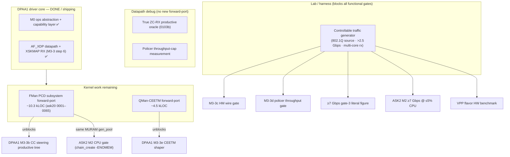
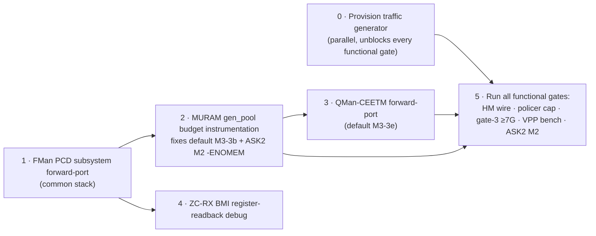

# DPAA1 + VPP + ASK2 — Consolidated Completion Plan

**Date:** 2026-06-08
**Branch:** `dpaa1` (default/vpp work) · `ask20` (ASK2 work)
**Status:** Active roadmap — single cross-flavor view of all remaining work

**Authoritative specs (source-of-truth; this doc only sequences them):**

- `specs/dpaa1-afxdp-modernization-spec.md` (v5.12) — the cross-flavor DPAA1 driver. **One driver core + two ops tables** (`pcd_ops`, `qmgmt_ops`); the FMan PCD subsystem lives in the **common board stack** (built-in for `default`/`vpp`/`ask`).
- `specs/vpp-dpaa1-ls1046a-spec.md` (v0.2) — VPP flavor over AF_XDP (native DPDK plugin **rejected**, Appendix A).
- `specs/ask2-rewrite-spec.md` (v1.6) — ASK2 modern FMan-210 offload (`ask.ko` consumes the common PCD stack via `pcd_ops`).

> This plan is a **router**, not a second source-of-truth. Where it disagrees with a spec, the spec wins — update this doc. All structural/architectural decisions are already settled in the specs; what remains is **forward-port volume**, **datapath debug**, and **lab/harness provisioning**.

---

## 0. The one-paragraph summary

The DPAA1 driver **core** (M0–M3-3 step 6: ops abstraction, capability layer, AF_XDP datapath, XSKMAP RX delivery) is DUT-validated and shipping in the `default` and `vpp` ISOs. Everything left is one of three kinds of work: (1) **two real kernel forward-ports** — the FMan **PCD subsystem** (~10.3 kLOC, the ask20 `0001–0065` chain) and the **QMan-CEETM** driver (~4.5 kLOC); (2) **datapath debug** with no new code — the true-ZC-RX productive oracle and the policer throughput measurement; and (3) **lab/harness provisioning** — a controllable traffic generator, which blocks *every* remaining functional acceptance gate across all three flavors. The PCD forward-port is the **keystone**: it unblocks DPAA1 M3-3b (CC steering) **and** is the same MURAM substrate whose exhaustion is currently failing the ASK2 M2 CPU gate.

---

## 1. Status at a glance

| Flavor | Substrate | Functional state | Single biggest blocker |
|---|---|---|---|
| **default** | common DPAA1 core ✅ | M3-3c HM live; M3-3d policer bind-gate MET; M3-3b/3e blocked on forward-ports | FMan PCD subsystem forward-port |
| **vpp** | common DPAA1 core ✅ (AF_XDP) | plumbed + shipping in CI; **not benchmarked on HW after the patch-022 AF_XDP cutover** | a HW benchmark run |
| **ask** | scaffold-only (builds vanilla VyOS today) | Path A activation verified on a prior ask20 build; **M2 CPU gate FAILED** (327× `chain_create -ENOMEM`) | PCD MURAM-budget fix (shared with default M3-3b) |

---

## 2. DPAA1 (`default`) completion

Remaining items in **dependency order** (mirrors the spec's "What remains for a complete DPAA1 driver" table, §60–75).

### 2.1 — Keystone: FMan PCD subsystem forward-port (unblocks M3-3b)
- **What:** finish the ~10,342-line ask20 `0001–0065` re-anchor chain into the **common board stack**. Today `fman_cc_tree_*` bodies are `-ENOTSUPP`; the MURAM CONT_LOOKUP AD encoding is pending.
- **Unblocks:** M3-3b CC steering productive tree (exact-match HW classifier), and underpins the already-live M3-3c/M3-3d productive paths.
- **Shared benefit:** this is the *same* PCD/MURAM substrate ASK2 needs (see §4) — do it once, in common, gated by `pcd_ops` capability.
- **Acceptance:** CC tree installs an exact-match key, RX FQ steers, MURAM allocate→free proven on DUT; non-regression on the AF_XDP datapath.

### 2.2 — QMan-CEETM forward-port (M3-3e productive shaper)
- **What:** the **largest single forward-port** — `qman_ceetm.c` (~2600 LOC) into `include/soc/fsl/qman.h`, `dpaa_eth_ceetm.{c,h}` (~1900 LOC), and `ndo_setup_tc`/mqprio wiring in `dpaa_eth.c`. Absent from mainline 6.18.
- **Already landed:** scaffold `0104b-dpaa-ceetm-stub.patch` (DUT-validated 2026-06-07) — `CONFIG_DPAA_HW_CEETM=y`, opaque config, three `-ENOTSUPP`/`false`/no-op entry points. The CLI consumer compiles against a stable contract today.
- **Acceptance:** HW hierarchical egress shaping as a `tc` qdisc; rate caps verifiable on the wire (needs the §6 generator).

### 2.3 — True ZC-RX productive oracle (M3-3 step 7, `0103b`) — *debug, no new code*
- **State:** sub-increments 1–4b landed; preconditions (1)+(2) HW-MET (`xsk_zc_rx_armed=2`, `xsk_fill_guard_block=0` under load); reprogram-WRITE crash-free + reversible. The `xsk_zc_rx_redirect` oracle still reads **0**.
- **Remaining:** a **BMI register-readback debug pass** to confirm `fman_port_set_rx_bpool()` re-commit is *effective* on a live post-init RX port, plus a traffic-steering fix so flood frames land on the XSK default FQ (queue 0) not the PCD stack FQs. Accessor (`0102`) + caller (`0103b`) already in-tree.
- **Not gate-3-blocking** (copy-mode AF_XDP already meets capacity, §6.1.8a/b).

### 2.4 — Policer throughput-cap measurement (M3-3d) — *lab-blocked*
- **State:** **bind gate MET 2026-06-08** (re-test #2, image `0234`, kernel `6.18.34-vyos`). The unbound-datapath failure was fixed via Path A (keygen next-engine=PLCR + `fman_port_use_kg_hash()` edge) + the `0097` port-id guard widening (`>10`→`>0x3f`; 10G RX is BMI id `0x10/0x11`). `vyos-1x-025` CLI shipped + live.
- **Remaining:** the wire-level 2.5 Gbps-cap / red-drop measurement — blocked **only** on the undocumented `10.99.1.2` traffic harness.

### 2.5 — HM functional datapath gate (M3-3c) — *lab-blocked*
- **State:** feature **live on hardware** (cap `0x17`, `rx-vlan-offload: on`, MURAM 0→144→0 proven 2026-06-07); `vyos-1x-024` CLI shipped + live on the DUT. **No kernel work, no CLI work.**
- **Remaining:** a controllable 802.1Q tagged source to prove the §5.5 strip/insert gate. Lower silent-fail risk than the policer (VLAN-strip has a normal kernel SW fallback).

### 2.6 — Literal ≥7 Gbps gate-3 figure — *lab-blocked*
- Driver proven to drop 0% at line rate (§6.1.8a). Needs a multi-process iperf3 *server* on the generator (split receiver across cores) or a wire-rate generator (TRex / DPDK-pktgen). **No kernel work.**

### 2.7 — DCSR error observability (§5.8) — *incremental*
- `0079` landed; remaining debugfs error-window taps (`{bmi,parser,kg,pol}_err`, §4.9) are incremental, no blocker.

---

## 3. VPP flavor completion

- **State:** plumbed and **shipping in CI** (`FLAVOR=vpp`). AF_XDP datapath on the SFP+ ports (`fsl_dpa` → `driver='xdp'`, patch `vyos-1x-022`); native VyOS CLI (`set vpp settings …`). Native DPDK plugin path is **rejected** (RC#31; spec Appendix A).
- **Remaining (no architecture work):**
  1. **HW benchmark** — the flavor has **not been benchmarked on hardware since the patch-022 AF_XDP cutover**. Confirm the ~3.5 Gbps SFP+ figure, thermal behaviour (`poll-sleep-usec 100` mandatory), and the MTU ≤3290 AF_XDP constraint hold.
  2. **Hugepage / kexec one-shot** — verify the `set vpp settings`-triggered hugepage kexec still lands cleanly on the 6.18.x kernel.
  3. Feeds the shared §6 generator dependency for any literal throughput claim.

---

## 4. ASK2 completion (`ask20` branch)

- **State:** `kernel/flavors/ask/` is **scaffold-only**; `FLAVOR=ask` ships **vanilla VyOS** until the ASK2 components land. Spec is v1.6 (architecture frozen; v1.6 = spec-text cleanup only).
- **Components to land (per spec §1.3 / §15):** `ask.ko` (~1500 LOC OOT) + `ask_bridge.ko` (~400 LOC); in-tree FMan-PCD patch `0004` (~7800 LOC); userspace ~0 (single YNL family `ask`, no daemon, no `libfci` ABI).
- **The live blocker (v1.4 status):** Path A activation is **verified** (`claimed=5 declined=0 failed=0`) but the **M2 CPU gate FAILED** — **6.955 Gbps but 21.40% kernel-net CPU** (need ≤5%; baseline 0.08%). Root cause: **327× `fman_pcd_manip_chain_create(3 manips) failed: -12` (`-ENOMEM`)** — every per-flow L2-rewrite chain fails to allocate, so the rewrite stays on the CPU.
- **Diagnostic prescription (spec §13.3 / Risk #13):** instrument `gen_pool_size()` / `gen_pool_avail()` at four checkpoints (probe end · post-CC-trees · first `chain_create` fail · after 327 fails); a 3-manip chain must fit in **< 1 KiB MURAM**. Three hypotheses: (a) boot-time CC trees exhaust the 384 KiB MURAM gen_pool; (b) `chain_create` byte-size math wrong; (c) per-manip pre-allocation leak in the v1.3 manip-chain refactor.
- **Cross-flavor leverage:** this is the **same MURAM gen_pool** as DPAA1 §2.1. The PCD-subsystem forward-port + MURAM-budget instrumentation should be done **once in common** and consumed by both `ask.ko` (via `pcd_ops`) and the default-flavor CC tree. Fixing the budget here fixes both M3-3b-productive and the ASK2 M2 gate.

---

## 5. Recommended sequencing

1. ~~**Provision the lab generator first.**~~ **DONE 2026-06-08** — the harness (heidi CT201/CT202, routed eth3→DUT→eth4) is live and validated (4.14 Gbps baseline); see §6 / `plans/TRAFFIC-HARNESS.md`. The functional gates are no longer lab-blocked for iperf3-class loads. Only the literal wire-rate ≥7 Gbps figure and the 802.1Q HM tagged source still want the deferred TRex/SR-IOV-VF upgrade.
2. **FMan PCD subsystem forward-port (common)** — keystone; do it once.
3. **MURAM budget instrumentation** on top of (2) — closes default M3-3b productive AND the ASK2 M2 `-ENOMEM`.
4. **QMan-CEETM forward-port** — default M3-3e productive shaper.
5. **ZC-RX BMI debug pass** — independent of the forward-ports; can interleave.
6. **Run all functional gates** once the generator is live.

---

## 6. The traffic harness — PROVISIONED 2026-06-08

Five separate acceptance gates were lab-blocked on the same missing piece — a
controllable traffic generator on the DUT SFP+ peers. **This is now resolved.** The
harness is two purpose-built Proxmox LXCs on **heidi** (`192.168.1.15`, root via
`ssh heidi`), one per DUT SFP+ subnet, with the DUT as their L3 gateway so all
CT201↔CT202 traffic is forced through the DUT router (eth3 → ip_forward → eth4).
Full reference: **`plans/TRAFFIC-HARNESS.md`**.

| Peer | LXC | IP / gw | DUT port |
|---|---|---|---|
| eth3 peer | CT201 `lxc201` | `10.99.1.2/30` → `10.99.1.1` | DUT eth3 |
| eth4 peer | CT202 `lxc202` | `10.11.1.2/29` → `10.11.1.1` | DUT eth4 |

Both Debian 12 with **iperf3 preinstalled**, on the 10G `vmbr0`→`enp35s0f1` (ixgbe)
bridge. **Validated end-to-end 2026-06-08:** `TTL=63` one-hop, 0% loss, **4.14 Gbit/s**
@ 8 TCP streams routed through the DUT (default-flavor software-forwarding floor).

| Gate | Needs | Harness coverage |
|---|---|---|
| M3-3c HM wire test | controllable 802.1Q tagged source | needs scapy/TRex (bridge is untagged) — see SR-IOV upgrade in harness doc |
| M3-3d policer throughput cap | >2.5 Gbps offered source, red-drop visibility | `iperf3 -u -b 9G` ✅ |
| Gate-3 ≥7 Gbps literal | multi-core iperf3 / wire-rate generator | `iperf3 -P`; TRex via SR-IOV VF for true line-rate |
| VPP flavor benchmark | sustained >3.5 Gbps SFP+ source | ✅ (MTU ≤3290 on AF_XDP) |
| ASK2 M2 (≥7 Gbps @ ≤5% CPU) | eth3↔eth4 forwarding load at line rate | CT201→DUT→CT202 ✅ |

**Wire-rate / 802.1Q upgrade (deferred):** `enp35s0f1` exposes 63 SR-IOV VFs; pass a VF
into a dedicated LXC for TRex/DPDK-pktgen when iperf3 cannot hit the literal ≥7 Gbps
figure or when precise 802.1Q stateless generation is required. Do **not** bind the PF
to DPDK (would drop the bridge + existing harness). `main` (production gateway) is
off-limits as a generator.

---

## 7. Definition of done (per flavor)

- **default:** M3-3b CC steering productive tree installs + steers on DUT; M3-3c/3d/3e wire gates pass on the generator; gate-3 literal ≥7 Gbps measured; DCSR error taps complete. (Core already done.)
- **vpp:** HW benchmark recorded (throughput + thermal + MTU constraint verified) on 6.18.x; hugepage-kexec one-shot confirmed.
- **ask:** ASK2 components landed (`ask.ko`/`ask_bridge.ko` + PCD patch `0004` + YNL `ask` family); M2 gate PASSES (≥7 Gbps at ≤5% kernel-net CPU) after the MURAM-budget fix; `FLAVOR=ask` ships a real offload image (no longer vanilla).
